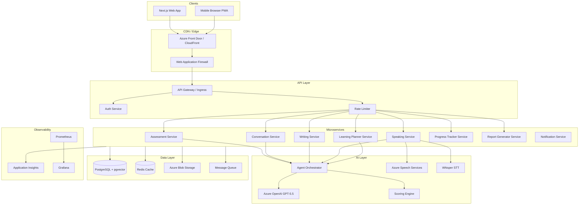
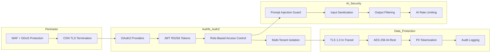
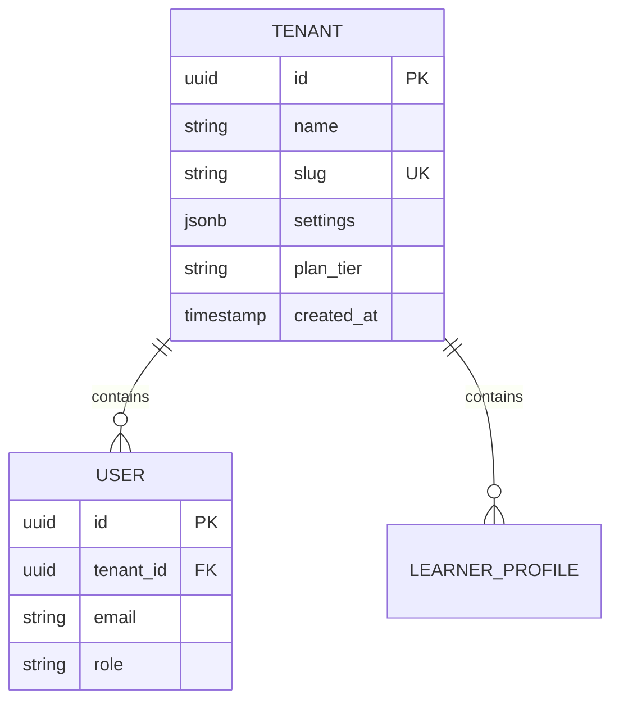

# System Architecture

## 1. High-Level Architecture



## 2. Microservice Architecture

| Service | Responsibility | Port | Scaling |
|---------|---------------|------|---------|
| **api-gateway** | Routing, TLS termination, rate limiting | 443 | 3–20 pods |
| **auth-service** | JWT issuance, OAuth2, RBAC | 8001 | 2–10 pods |
| **assessment-service** | Placement tests, skill evaluations | 8002 | 3–15 pods |
| **conversation-service** | Role-play chat, context management | 8003 | 3–15 pods |
| **writing-service** | Essay submission, rubric scoring | 8004 | 2–10 pods |
| **speaking-service** | Audio upload, pronunciation analysis | 8005 | 2–10 pods |
| **planner-service** | Learning plan generation & updates | 8006 | 2–8 pods |
| **progress-service** | Progress tracking, mistake memory | 8007 | 2–10 pods |
| **report-service** | Report generation, analytics queries | 8008 | 2–8 pods |
| **notification-service** | Email, push, in-app notifications | 8009 | 2–5 pods |
| **agent-orchestrator** | AI agent routing, prompt management | 8010 | 5–30 pods |

> **v1 Implementation Note:** Services are deployed as a modular monolith (FastAPI) with clear module boundaries, enabling extraction to separate microservices as traffic grows.

## 3. Folder Structure

```
ai-english-teacher/
├── docs/                           # Architecture documentation
├── database/
│   ├── migrations/                 # Versioned SQL migrations
│   └── seeds/                      # Development seed data
├── backend/
│   ├── app/
│   │   ├── main.py                 # FastAPI application entry
│   │   ├── core/
│   │   │   ├── config.py           # Settings (pydantic-settings)
│   │   │   ├── security.py         # JWT, OAuth2, RBAC
│   │   │   ├── database.py         # Async SQLAlchemy engine
│   │   │   ├── redis.py            # Redis connection pool
│   │   │   ├── rate_limit.py       # Rate limiting middleware
│   │   │   └── prompt_guard.py     # Prompt injection protection
│   │   ├── models/                 # SQLAlchemy ORM models
│   │   ├── schemas/                # Pydantic request/response DTOs
│   │   ├── api/
│   │   │   └── v1/
│   │   │       ├── auth.py
│   │   │       ├── assessments.py
│   │   │       ├── conversations.py
│   │   │       ├── writing.py
│   │   │       ├── speaking.py
│   │   │       ├── learning_plans.py
│   │   │       ├── reports.py
│   │   │       └── dashboard.py
│   │   ├── services/               # Business logic
│   │   ├── agents/                 # AI agent implementations
│   │   │   ├── base.py
│   │   │   ├── teacher.py
│   │   │   ├── assessment.py
│   │   │   ├── grammar.py
│   │   │   ├── vocabulary.py
│   │   │   ├── writing.py
│   │   │   ├── speaking.py
│   │   │   ├── reading.py
│   │   │   ├── listening.py
│   │   │   ├── planner.py
│   │   │   ├── progress.py
│   │   │   └── report.py
│   │   ├── scoring/
│   │   │   └── engine.py           # Scoring formulas & aggregation
│   │   └── ai/
│   │       ├── openai_client.py    # Abstraction layer
│   │       └── speech_client.py    # Azure Speech + Whisper
│   ├── alembic/                    # Database migrations
│   ├── tests/
│   ├── Dockerfile
│   └── requirements.txt
├── frontend/
│   ├── src/
│   │   ├── app/                    # Next.js App Router
│   │   │   ├── (auth)/
│   │   │   ├── (dashboard)/
│   │   │   │   ├── student/
│   │   │   │   ├── teacher/
│   │   │   │   └── admin/
│   │   │   ├── assessment/
│   │   │   ├── conversation/
│   │   │   └── layout.tsx
│   │   ├── components/
│   │   │   ├── ui/                 # ShadCN components
│   │   │   ├── charts/
│   │   │   ├── assessment/
│   │   │   └── dashboard/
│   │   ├── lib/
│   │   │   ├── api.ts              # API client
│   │   │   └── auth.ts             # Auth utilities
│   │   ├── hooks/
│   │   ├── stores/                 # Zustand state management
│   │   └── types/
│   ├── Dockerfile
│   └── package.json
├── infrastructure/
│   └── terraform/
│       ├── modules/
│       │   ├── aks/
│       │   ├── postgres/
│       │   ├── redis/
│       │   └── monitoring/
│       ├── environments/
│       │   ├── dev/
│       │   ├── staging/
│       │   └── prod/
│       └── main.tf
├── k8s/
│   ├── base/
│   └── overlays/
│       ├── dev/
│       ├── staging/
│       └── prod/
├── docker-compose.yml
└── .github/workflows/
    ├── ci.yml
    └── cd.yml
```

## 4. Security Architecture



### Security Controls

| Control | Implementation |
|---------|---------------|
| Authentication | JWT (RS256), OAuth2 (Google, Microsoft) |
| Authorization | RBAC with tenant-scoped permissions |
| Rate Limiting | Redis sliding window (100/min user, 1000/min tenant) |
| Input Validation | Pydantic schemas + max length enforcement |
| Prompt Injection | Pattern detection + system prompt hardening |
| Encryption | TLS 1.3, Azure-managed keys for at-rest |
| PII Protection | Column-level encryption for email/phone, data masking in logs |
| Audit | All CRUD operations logged with user/tenant/timestamp |

## 5. Scalability Strategy

### Horizontal Scaling
- **Stateless services**: All API pods are stateless; session state in Redis
- **HPA**: Scale on CPU (70%), memory (80%), and custom metric (queue depth)
- **Database**: Primary + 2 read replicas; PgBouncer connection pooling (max 200 connections)
- **AI workloads**: Dedicated agent-orchestrator pool with queue-based backpressure

### Caching Strategy
| Layer | TTL | Content |
|-------|-----|---------|
| CDN | 24h | Static assets, public pages |
| Redis L1 | 5min | User sessions, dashboard summaries |
| Redis L2 | 1h | Assessment templates, learning plan templates |
| Application | Request-scoped | ORM query results |

### Async Processing
- Long-running AI assessments → ARQ job queue
- Report PDF generation → background worker
- Notification dispatch → event-driven (webhook/SSE)

## 6. Cost Optimization Strategy

| Strategy | Savings | Implementation |
|----------|---------|---------------|
| Reserved instances | 30–40% | 1-year AKS node reservations |
| Spot instances for workers | 60–70% | AI batch processing on spot nodes |
| AI token caching | 20–30% | Cache common assessment prompts |
| Right-sizing | 15–25% | VPA recommendations, off-peak scaling |
| Storage tiering | 40% | Hot (30d) → Cool (90d) → Archive |
| Connection pooling | 10% | PgBouncer reduces DB instance size |

## 7. Multi-Tenant Design



### Tenant Isolation Model: **Shared Database, Shared Schema**

- Every table includes `tenant_id` column with Row-Level Security (RLS) policies
- API middleware injects `tenant_id` from JWT claims
- Cross-tenant queries are blocked at database level via RLS
- Tenant-specific configuration stored in `tenants.settings` JSONB
- Billing/quota tracked per tenant in `tenant_usage` table

### Tenant Tiers

| Tier | Users | AI Calls/mo | Storage | Features |
|------|-------|-------------|---------|----------|
| Free | 50 | 1,000 | 1 GB | Basic assessment |
| Pro | 500 | 10,000 | 10 GB | All features |
| Enterprise | Unlimited | Custom | Custom | SSO, custom branding, SLA |
