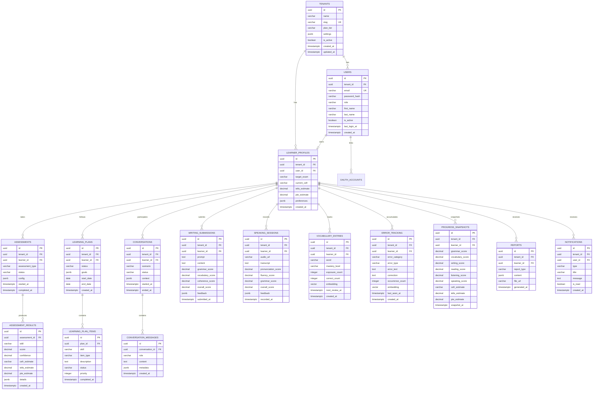

# Database Design

## 1. Entity-Relationship Diagram



## 2. Table Summary

| Table | Rows (est. 1M users) | Purpose |
|-------|---------------------|---------|
| tenants | 1K | Multi-tenant organizations |
| users | 1.2M | Authentication & RBAC |
| learner_profiles | 1M | Learner metadata & targets |
| assessments | 5M | Assessment sessions |
| assessment_results | 30M | Per-skill assessment scores |
| error_tracking | 50M | Long-term mistake memory |
| vocabulary_entries | 100M | Spaced repetition vocabulary |
| conversations | 10M | Role-play sessions |
| conversation_messages | 100M | Chat history |
| writing_submissions | 8M | Essay submissions |
| speaking_sessions | 6M | Audio practice sessions |
| learning_plans | 2M | Personalized study plans |
| learning_plan_items | 20M | Plan task items |
| progress_snapshots | 12M | Weekly progress data points |
| reports | 3M | Generated reports |
| notifications | 20M | User notifications |

## 3. Indexing Strategy

- All `tenant_id` columns: B-tree index (RLS filter)
- `users.email`: Unique index per tenant
- `error_tracking.embedding`: IVFFlat index (pgvector, lists=100)
- `vocabulary_entries.embedding`: IVFFlat index
- `progress_snapshots(learner_id, snapshot_at)`: Composite B-tree
- `assessments(learner_id, status)`: Composite B-tree
- `notifications(user_id, is_read)`: Partial index where `is_read = false`

## 4. Row-Level Security

All tenant-scoped tables enforce RLS:

```sql
ALTER TABLE assessments ENABLE ROW LEVEL SECURITY;
CREATE POLICY tenant_isolation ON assessments
    USING (tenant_id = current_setting('app.tenant_id')::uuid);
```

The application sets `app.tenant_id` at the start of each database transaction via `SET LOCAL`.

## 5. Migration Files

See `database/migrations/` for executable SQL scripts:
- `001_initial_schema.sql` — Core tables, indexes, RLS
- `002_pgvector.sql` — Vector extension and embedding columns
