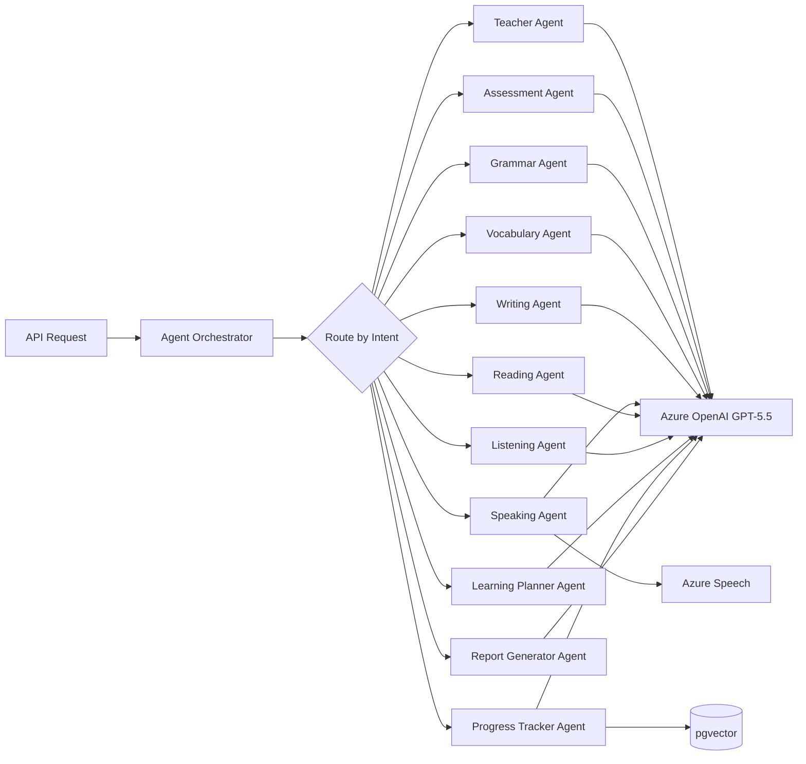

# AI Agent Design

## Agent Orchestration



All agents inherit from `BaseAgent` and implement:
- `system_prompt` — Role-specific instructions
- `execute(input: AgentInput) -> AgentOutput` — Main processing
- Input/output validated via Pydantic schemas

---

## 1. Teacher Agent

**Responsibilities:** Lead role-play conversations, provide encouragement, adapt difficulty, reference learner history.

**API Endpoints:**
- `POST /api/v1/conversations` (orchestrates)
- `POST /api/v1/conversations/{id}/messages`

**Prompt Template:**
```
You are an expert English teacher conducting a {scenario} role-play.
Learner CEFR level: {cefr_level}
Known weaknesses: {error_summary}
Vocabulary focus: {vocab_focus}

Rules:
- Stay in character for the scenario
- Use language appropriate for {cefr_level} with slight challenge (+0.5 level)
- Gently correct errors inline without breaking immersion
- Ask follow-up questions to encourage speaking
- Reference previous mistakes only when naturally relevant
```

**Input Schema:**
```json
{
  "conversation_id": "uuid",
  "learner_id": "uuid",
  "scenario": "string",
  "message_history": [{"role": "string", "content": "string"}],
  "learner_context": {
    "cefr_level": "B2",
    "recent_errors": ["string"],
    "vocabulary_level": 72
  }
}
```

**Output Schema:**
```json
{
  "response": "string",
  "metadata": {
    "grammar_corrections": [{"original": "string", "corrected": "string"}],
    "vocabulary_introduced": ["string"],
    "difficulty_adjustment": "maintain|increase|decrease",
    "encouragement": "string"
  }
}
```

---

## 2. Assessment Agent

**Responsibilities:** Design and score placement/skill assessments, aggregate multi-skill results.

**API Endpoints:**
- `POST /api/v1/assessments`
- `POST /api/v1/assessments/{id}/submit`
- `POST /api/v1/assessments/placement`

**Prompt Template:**
```
You are an English proficiency assessment specialist.
Task: Evaluate the learner's response for {skill} at {difficulty} level.

Scoring rubric:
- Accuracy (40%): grammatical correctness
- Range (30%): vocabulary/structural variety
- Appropriateness (20%): context fit
- Fluency (10%): natural flow (speaking/writing only)

Provide scores 0-100 and justify each dimension.
Map to CEFR: A1(0-20), A2(21-35), B1(36-55), B2(56-75), C1(76-90), C2(91-100).
```

**Input Schema:**
```json
{
  "assessment_id": "uuid",
  "skill": "grammar|vocabulary|reading|listening|writing|speaking",
  "questions": [{"id": "string", "prompt": "string", "expected_type": "string"}],
  "responses": [{"question_id": "string", "answer": "string", "audio_url": "string|null"}],
  "learner_profile": {"current_cefr": "string", "target_exam": "string"}
}
```

**Output Schema:**
```json
{
  "skill": "string",
  "score": 78.5,
  "confidence": 0.85,
  "dimension_scores": {"accuracy": 80, "range": 75, "appropriateness": 82, "fluency": 70},
  "cefr_estimate": "B2",
  "ielts_estimate": 6.5,
  "pte_estimate": 58,
  "details": {"correct": 8, "total": 10, "error_patterns": []}
}
```

---

## 3. Grammar Agent

**Responsibilities:** Detect, categorize, and explain grammar errors; track patterns over time.

**API Endpoints:**
- Used internally by Writing, Speaking, Assessment agents
- `POST /api/v1/assessments` (grammar skill)

**Prompt Template:**
```
Analyze the following text for grammar errors.
Categories: tense, subject-verb agreement, articles, prepositions, word order,
             conditionals, modals, punctuation, sentence structure.

For each error provide: original text, correction, category, explanation (1 sentence),
severity (minor|moderate|major).

Text: {text}
Learner level: {cefr_level}
Previous error patterns: {known_errors}
```

**Input/Output:** See `backend/app/agents/grammar.py` schemas.

---

## 4. Vocabulary Agent

**Responsibilities:** Assess vocabulary range/accuracy, recommend words, manage spaced repetition.

**Prompt Template:**
```
Evaluate vocabulary usage in the text.
Assess: range (unique words / total words), accuracy (correct word choice),
        sophistication (CEFR-appropriate advanced words), collocations.

Recommend 5 words for the learner to study based on their level and gaps.
Text: {text}
Learner vocabulary score: {vocab_score}
Known words: {known_vocabulary}
```

---

## 5. Writing Agent

**Responsibilities:** Score essays using IELTS Task 2 rubric (TA, CC, LR, GRA).

**API Endpoints:**
- `POST /api/v1/writing/submit`

**Prompt Template:**
```
Score this IELTS Writing Task 2 essay using official band descriptors.

Task Achievement (25%): addresses all parts, clear position, relevant ideas
Coherence & Cohesion (25%): logical organization, paragraphing, linking devices
Lexical Resource (25%): vocabulary range, accuracy, collocations
Grammatical Range & Accuracy (25%): sentence variety, error frequency

Prompt: {prompt}
Essay: {content}
Word count: {word_count}
Target band: {target_band}
```

---

## 6. Speaking Agent

**Responsibilities:** Analyze transcribed speech for fluency, pronunciation, grammar, vocabulary.

**API Endpoints:**
- `POST /api/v1/speaking/sessions`

**Prompt Template:**
```
Analyze this spoken English transcript from a {scenario} practice session.
Transcript: {transcript}
Pronunciation scores (Azure Speech): {pronunciation_data}
Duration: {duration_seconds}s
WPM: {words_per_minute}

Score: pronunciation (30%), fluency (25%), grammar (25%), vocabulary (20%).
Identify filler words, pauses, and intonation issues.
```

---

## 7. Reading Agent

**Responsibilities:** Generate reading passages, create comprehension questions, score answers.

**Prompt Template:**
```
Create a {difficulty} level reading passage ({word_count} words) about {topic}.
Include {num_questions} comprehension questions: {question_types}.
For scoring, evaluate: factual accuracy, inference, vocabulary in context.
```

---

## 8. Listening Agent

**Responsibilities:** Generate listening scripts, score comprehension responses.

**Prompt Template:**
```
Generate a listening script at {cefr_level} ({duration_seconds}s when spoken).
Topic: {topic}. Speakers: {num_speakers}.
Create {num_questions} questions testing: gist, detail, inference, attitude.
```

---

## 9. Learning Planner Agent

**Responsibilities:** Generate personalized study plans based on assessment results and goals.

**API Endpoints:**
- `POST /api/v1/learning-plans`

**Prompt Template:**
```
Create a {duration_weeks}-week learning plan for a {cefr_level} learner
targeting {target_exam} band {target_score}.

Current scores: {skill_scores}
Top errors: {error_patterns}
Weak vocabulary areas: {vocab_gaps}
Study time available: {hours_per_week} hours/week

Generate daily/weekly tasks covering all 6 skills with priorities.
Include spaced repetition for vocabulary and targeted grammar drills.
```

**Output Schema:**
```json
{
  "plan": {
    "goals": ["Achieve IELTS 7.0", "Improve speaking fluency"],
    "weeks": [
      {
        "week": 1,
        "focus": "grammar - conditionals",
        "items": [
          {"skill": "grammar", "type": "exercise", "description": "...", "priority": 1},
          {"skill": "speaking", "type": "role_play", "description": "...", "priority": 2}
        ]
      }
    ]
  }
}
```

---

## 10. Progress Tracker Agent

**Responsibilities:** Aggregate scores over time, detect trends, update mistake memory.

**API Endpoints:**
- Internal (triggered after assessments/activities)
- `GET /api/v1/dashboard/student/progress`

**Prompt Template:**
```
Analyze this learner's progress data over {period_days} days.
Snapshots: {progress_snapshots}
Recent errors: {recent_errors}
Activity frequency: {sessions_per_week}

Identify: improving skills, declining skills, plateau areas,
          recommended focus areas, projected scores in 30/60/90 days.
```

---

## 11. Report Generator Agent

**Responsibilities:** Compile comprehensive learner reports with charts data and recommendations.

**API Endpoints:**
- `POST /api/v1/reports/generate`

**Prompt Template:**
```
Generate a {report_type} report for learner {learner_name}.
Period: {start_date} to {end_date}
Data: {all_progress_data}
Errors: {error_summary}
Plan progress: {plan_completion}

Sections: Executive Summary, Skill Breakdown, Progress Charts Data,
          Error Analysis, Recommendations, Next Steps.
Tone: professional, encouraging, actionable.
```

---

## Scoring Engine Integration

All agents feed raw scores into the centralized **Scoring Engine** (`backend/app/scoring/engine.py`) which:

1. Normalizes per-skill scores (0–100)
2. Applies weighted aggregation
3. Maps to CEFR, IELTS, PTE using calibrated formulas
4. Computes confidence based on data volume and consistency

See scoring formulas in `backend/app/scoring/engine.py`.
