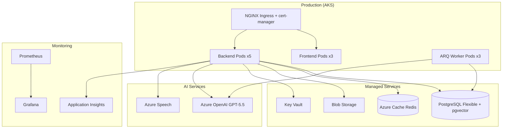

# Deployment Architecture

## Target Cloud: Azure (Primary)

| Component | Azure Service | Alternative (AWS) | Alternative (GCP) |
|-----------|--------------|-------------------|-------------------|
| Kubernetes | AKS | EKS | GKE |
| Database | Azure Database for PostgreSQL Flexible | RDS PostgreSQL | Cloud SQL PostgreSQL |
| Cache | Azure Cache for Redis | ElastiCache Redis | Memorystore Redis |
| AI | Azure OpenAI Service | OpenAI via API Gateway | Vertex AI |
| Speech | Azure Speech Services | Amazon Transcribe + Polly | Cloud Speech-to-Text |
| Storage | Azure Blob Storage | S3 | Cloud Storage |
| CDN/WAF | Azure Front Door | CloudFront + WAF | Cloud CDN + Cloud Armor |
| Monitoring | Application Insights | CloudWatch + X-Ray | Cloud Monitoring |
| Secrets | Azure Key Vault | Secrets Manager | Secret Manager |
| Container Registry | ACR | ECR | Artifact Registry |

## Environment Topology

## Deployment Stages

| Stage | Cluster | Replicas | Database | Purpose |
|-------|---------|----------|----------|---------|
| Dev | Local Docker Compose | 1 each | Local PG | Development |
| Staging | AKS (1 node pool) | 2 each | PG Burstable B2s | Integration testing |
| Production | AKS (3 node pools) | 3–30 HPA | PG General Purpose D4s | Live traffic |

## Node Pools (Production AKS)

| Pool | VM Size | Min/Max | Workload |
|------|---------|---------|----------|
| system | Standard_D2s_v5 | 2/3 | Ingress, monitoring |
| app | Standard_D4s_v5 | 3/20 | API, frontend |
| ai-workers | Standard_D4s_v5 (Spot) | 0/15 | AI batch processing |

## Networking

- VNet: `10.0.0.0/16`
- AKS subnet: `10.0.1.0/24`
- PostgreSQL subnet: `10.0.2.0/24` (private endpoint)
- Redis subnet: `10.0.3.0/24` (private endpoint)
- All inter-service communication via private endpoints
- Public access only through Azure Front Door → Ingress

## Disaster Recovery

| Scenario | RPO | RTO | Strategy |
|----------|-----|-----|----------|
| Pod failure | 0 | < 30s | K8s self-healing + HPA |
| AZ failure | < 1h | < 15min | Multi-AZ AKS + PG geo-redundant backup |
| Region failure | < 4h | < 1h | Cross-region PG replica (manual failover) |
| Data corruption | < 1h | < 30min | Point-in-time recovery (PG, 35 days) |

## SSL/TLS

- cert-manager with Let's Encrypt for ingress TLS
- Azure-managed TLS for Front Door
- mTLS between services (service mesh optional, Istio-ready)
