# AI English Teacher — Complete Architecture

> **C4 model**, agent orchestration flows, data architecture, and deployment plans for all environments ($0 hobby → enterprise).

| Live URLs | |
|-----------|---|
| Web | https://ai-english-teacher-web.onrender.com |
| API | https://ai-english-teacher-api.onrender.com |
| API Docs | https://ai-english-teacher-api.onrender.com/docs |

**Related docs:** [RUNBOOK.md](../RUNBOOK.md) · [Master Blueprint](agents/00-MASTER-BLUEPRINT.md) · [System Architecture](02-SYSTEM_ARCHITECTURE.md)

---

## Table of Contents

1. [C4 Level 1 — System Context](#1-c4-level-1--system-context)
2. [C4 Level 2 — Containers](#2-c4-level-2--containers)
3. [C4 Level 3 — Backend Components](#3-c4-level-3--backend-components)
4. [Agent Registry (38-Agent Roadmap)](#4-agent-registry-38-agent-roadmap)
5. [Conversation Agent Flow (LangGraph)](#5-conversation-agent-flow-langgraph)
6. [Voice Analysis Pipeline](#6-voice-analysis-pipeline)
7. [Grammar Class Flow](#7-grammar-class-flow)
8. [Assessment & Writing Flows](#8-assessment--writing-flows)
9. [Multi-Tenancy & Security](#9-multi-tenancy--security)
10. [Data Architecture](#10-data-architecture)
11. [LLM Provider Resolution](#11-llm-provider-resolution)
12. [Deployment Plans](#12-deployment-plans)
13. [Environment Variable Matrix](#13-environment-variable-matrix)
14. [Ports & Network Reference](#14-ports--network-reference)

---

## 1. C4 Level 1 — System Context

Who uses the system and what external systems it connects to.

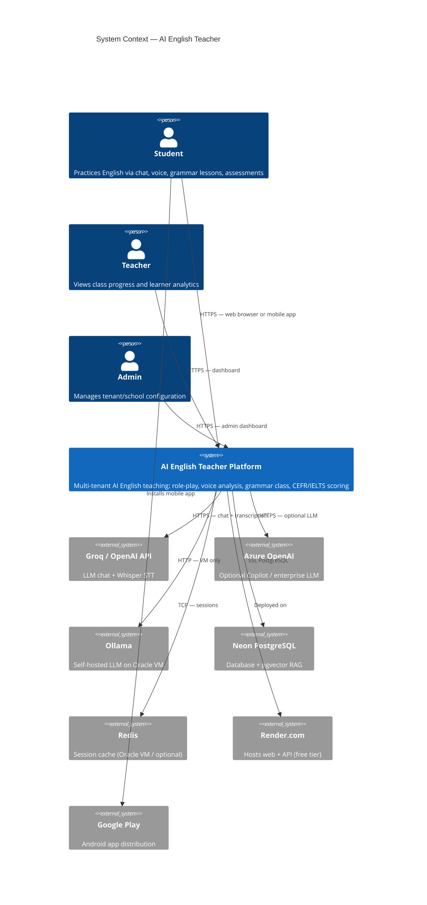

### Actors

| Actor | Channels | Primary features |
|-------|----------|------------------|
| **Student** | Web, Android (Expo) | Role-play chat, voice practice, grammar class (grades 5–12), placement test |
| **Teacher** | Web dashboard | Class overview, learner progress |
| **Admin** | Web dashboard | Tenant management, usage stats |

---

## 2. C4 Level 2 — Containers

Major deployable units and how they communicate.

### 2A. Production — Render + Neon ($0)

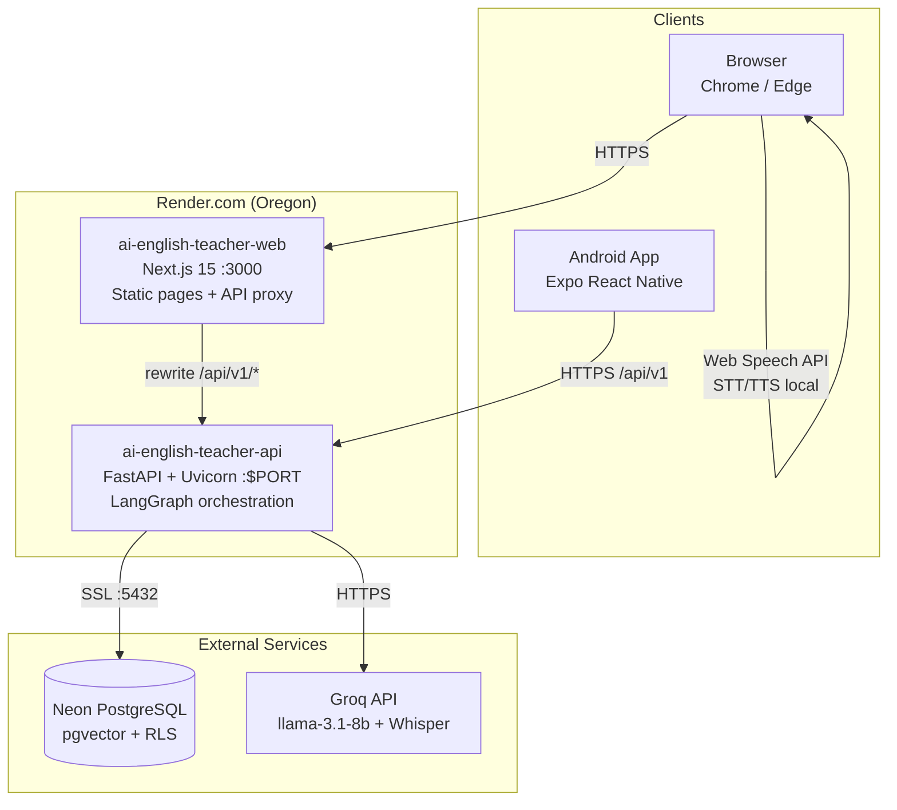

### 2B. Self-Hosted — Oracle Cloud VM ($0)

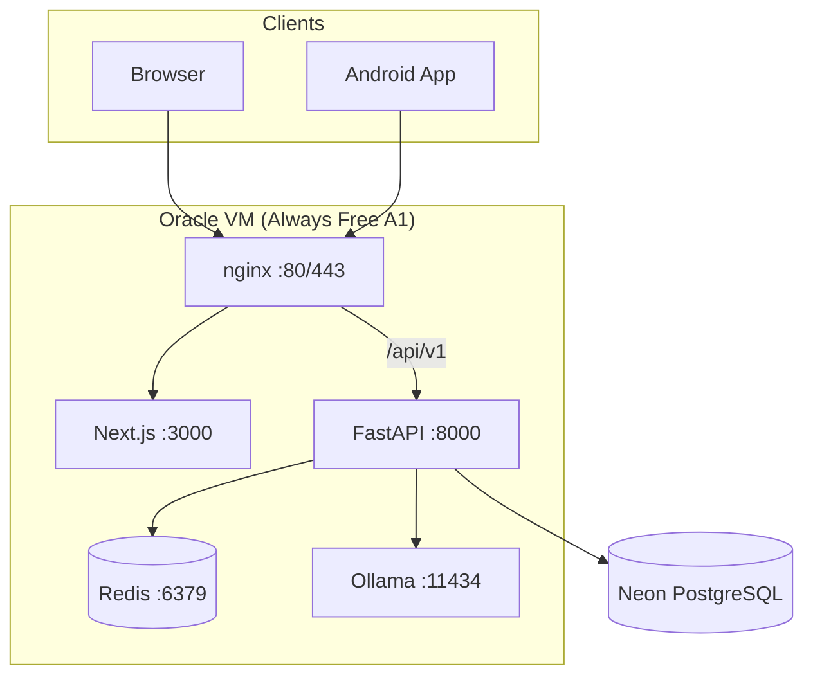

### Container Summary

| Container | Technology | Responsibility |
|-----------|------------|----------------|
| **Web Frontend** | Next.js 15, React, Tailwind | UI pages, same-origin API proxy (`/api/v1` → API) |
| **Mobile App** | Expo React Native | Direct API calls, JWT in SecureStore |
| **Backend API** | FastAPI, SQLAlchemy async, LangGraph | Auth, orchestration, agents, scoring |
| **PostgreSQL** | Neon (managed) | Tenants, users, conversations, pgvector RAG, voice analyses |
| **Redis** | Optional (OCI) | Session state for LangGraph Session Manager |
| **LLM** | Groq / Azure / Ollama / Mock | Chat completions + Whisper transcription |

---

## 3. C4 Level 3 — Backend Components

Internal structure of the FastAPI backend (`backend/app/`).

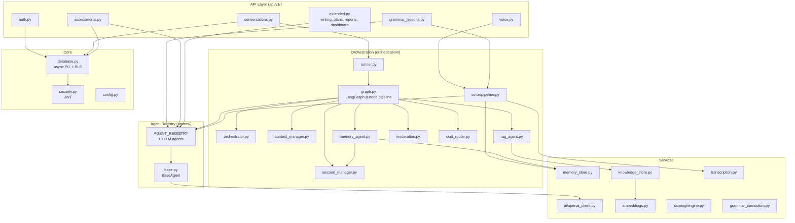

### API → Orchestration Mapping

| Endpoint | Orchestration path |
|----------|-------------------|
| `POST /conversations` | Full LangGraph pipeline |
| `POST /conversations/{id}/messages` | Full LangGraph pipeline |
| `POST /voice/analyze` | Voice pipeline (Wave 2) |
| `POST /grammar/practice` | Voice pipeline → GrammarTeacherAgent |
| `GET /grammar/intro` | GrammarTeacherAgent (direct) |
| `POST /assessments/{id}/submit` | AGENT_REGISTRY per skill (direct) |
| `POST /writing/submit` | WritingAgent (direct) |
| `POST /learning-plans` | LearningPlannerAgent (direct) |
| `POST /reports/generate` | ReportGeneratorAgent (direct) |

---

## 4. Agent Registry (38-Agent Roadmap)

The platform is designed for **38 agents in 6 waves**. Waves 1–2 are implemented; 3–6 are specified in `docs/agents/`.

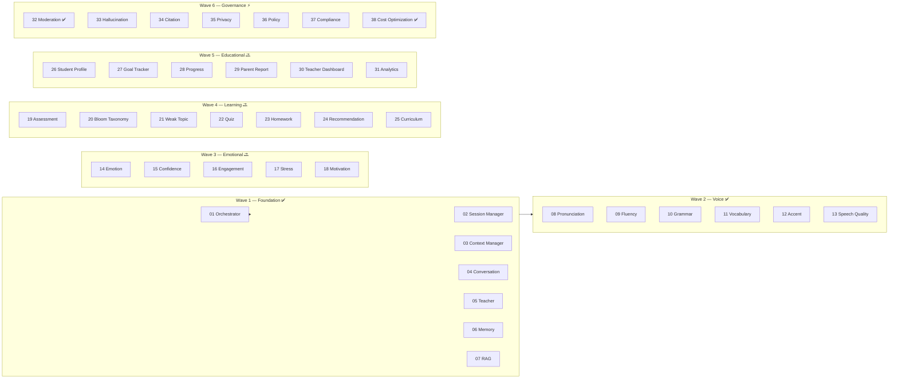

### Implemented LLM Agents (`AGENT_REGISTRY`)

| Key | Class | Role | Triggered by |
|-----|-------|------|--------------|
| `teacher` | `TeacherAgent` | Role-play English teacher with inline corrections | LangGraph, conversations |
| `grammar_teacher` | `GrammarTeacherAgent` | Grade 5–12 grammar lessons with voice | `/grammar/intro`, `/grammar/practice` |
| `grammar` | `GrammarAgent` | Grammar error detection + scoring | Voice pipeline, assessments |
| `vocabulary` | `VocabularyAgent` | Vocabulary range scoring | Voice pipeline, assessments |
| `writing` | `WritingAgent` | IELTS Writing Task 2 scoring | `/writing/submit` |
| `speaking` | `SpeakingAgent` | Transcript-based speaking analysis | Assessments |
| `assessment` | `AssessmentAgent` | General proficiency scoring | Assessments (fallback) |
| `planner` | `LearningPlannerAgent` | Multi-week learning plans | `/learning-plans` |
| `progress` | `ProgressTrackerAgent` | Progress trend analysis | *(registry only)* |
| `report` | `ReportGeneratorAgent` | Executive summaries | `/reports/generate` |

---

## 5. Conversation Agent Flow (LangGraph)

Primary path for role-play chat (`/conversation`).

### 5A. Sequence Diagram

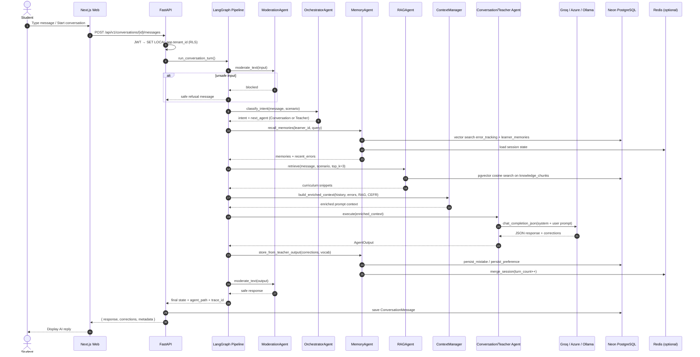

### 5B. LangGraph Node Pipeline

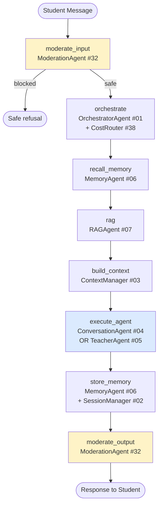

### 5C. Intent Routing Rules

`orchestrator.py:classify_intent()` decides which agent runs:

| Condition | Intent | Agent |
|-----------|--------|-------|
| Empty, greeting, or "Start the conversation." | `greeting` | `ConversationAgent` |
| Contains teaching keywords (explain, grammar, practice…) | `teaching` | `TeacherAgent` |
| Question with >4 words | `teaching` | `TeacherAgent` |
| Non-general scenario (job_interview, travel…) | `teaching` | `TeacherAgent` |
| Default | `conversation` | `ConversationAgent` |

---

## 6. Voice Analysis Pipeline

Triggered by `POST /api/v1/voice/analyze` and optionally by grammar practice with audio.

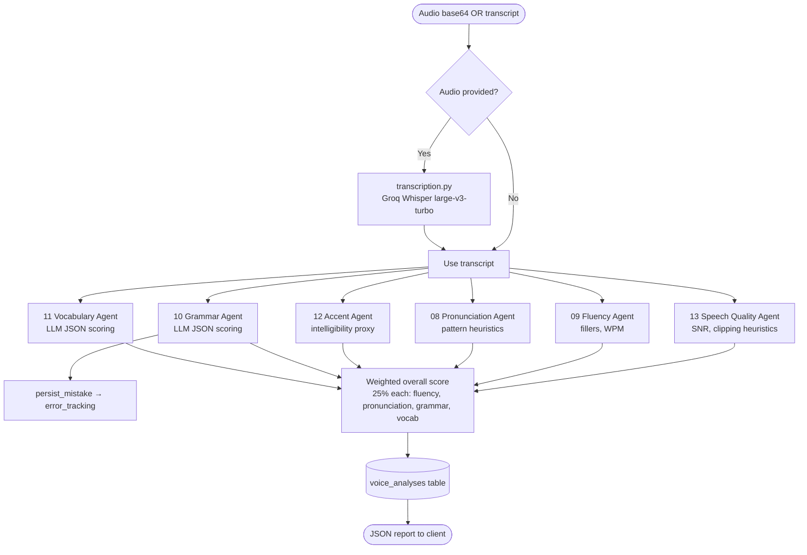

### Voice on Web vs Mobile

| Platform | STT (speech-to-text) | TTS (text-to-speech) | Server analysis |
|----------|---------------------|---------------------|-----------------|
| **Web** | Browser Web Speech API (`useVoice.ts`) | Browser `speechSynthesis` | Optional `POST /voice/analyze` |
| **Mobile** | Expo / device STT | Expo TTS | `POST /voice/analyze` with audio |
| **API** | Groq Whisper (`transcription.py`) | — | Full Wave 2 pipeline |

---

## 7. Grammar Class Flow

Grades 5–12 structured grammar lessons (`/grammar-class`).

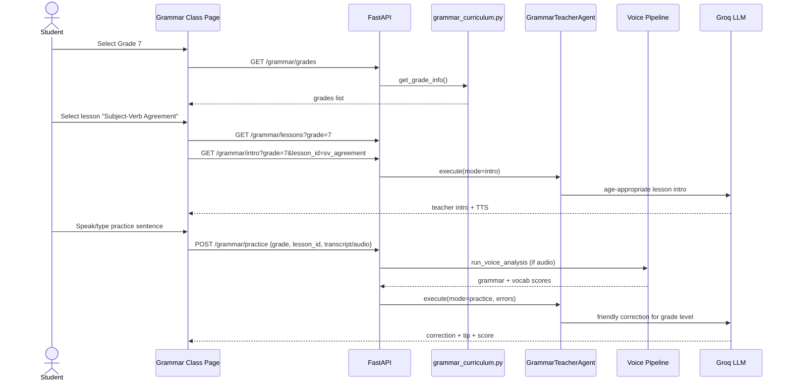

**Curriculum source:** `backend/app/services/grammar_curriculum.py` — 24 lessons across grades 5–12, mapped to CEFR levels.

---

## 8. Assessment & Writing Flows

### Assessment Submit

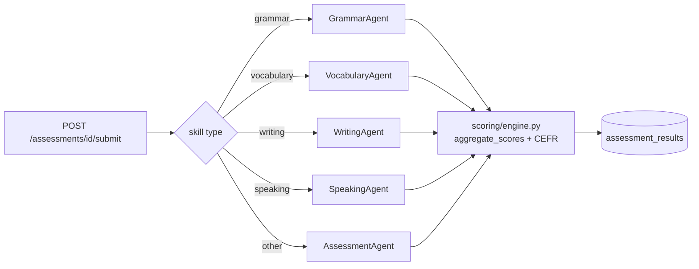

### Writing & Reports (Direct Agent Calls)

| Flow | Path | Agent |
|------|------|-------|
| Essay scoring | `POST /writing/submit` | `WritingAgent` → IELTS band estimate |
| Learning plan | `POST /learning-plans` | `LearningPlannerAgent` → multi-week plan |
| Progress report | `POST /reports/generate` | `ReportGeneratorAgent` → PDF-ready summary |

---

## 9. Multi-Tenancy & Security

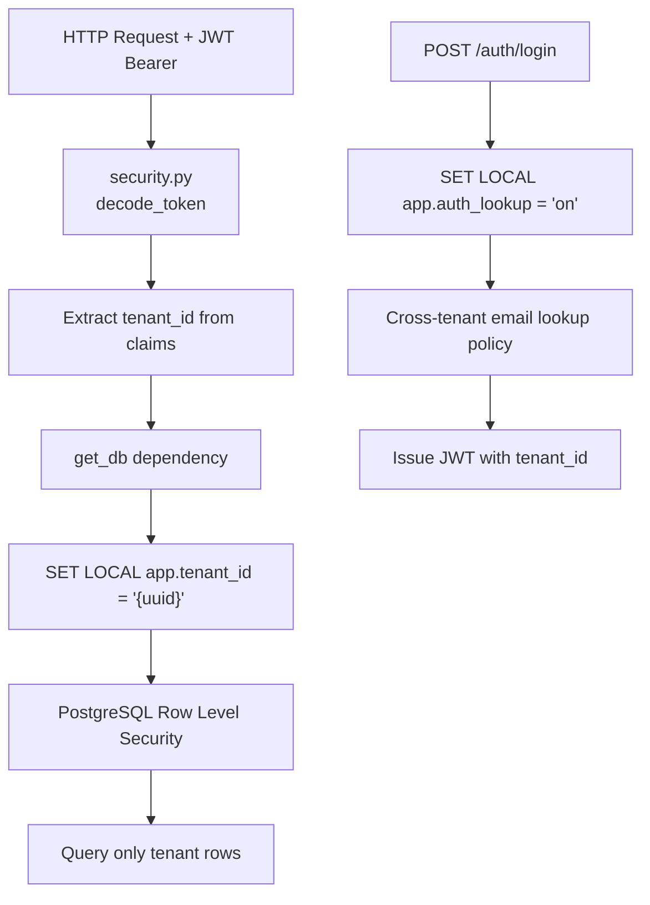

| Layer | Mechanism | File |
|-------|-----------|------|
| **Authentication** | JWT access + refresh tokens (24h / 7d) | `core/security.py` |
| **Tenant isolation** | `SET LOCAL app.tenant_id` per request | `core/database.py` |
| **Database RLS** | `tenant_isolation` policies on all tenant tables | `database/migrations/001_initial_schema.sql` |
| **Login exception** | `auth_email_lookup` policy when `app.auth_lookup=on` | `003_auth_rls.sql` |
| **Input safety** | `prompt_guard.py` + ModerationAgent regex blocklist | `core/prompt_guard.py`, `orchestration/moderation.py` |
| **CORS** | `CORS_ORIGINS` env var | `main.py` |

---

## 10. Data Architecture

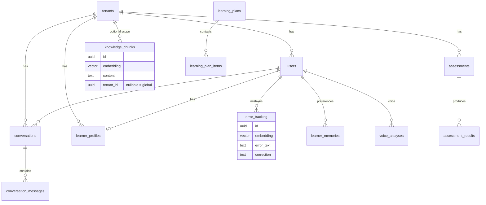

### Storage Responsibilities

| Store | Technology | Data | TTL |
|-------|------------|------|-----|
| **PostgreSQL** | Neon + pgvector | Users, conversations, assessments, RAG chunks, voice analyses, long-term memory | Persistent |
| **Redis** | Optional (OCI) | Session state (`session:{id}`) | 24 hours |
| **In-memory fallback** | Python dict | Sessions when Redis unavailable | Process lifetime |
| **Browser** | localStorage / SecureStore | JWT tokens | Until logout |

---

## 11. LLM Provider Resolution

`ai/openai_client.py` selects provider based on `AI_PROVIDER` env var:

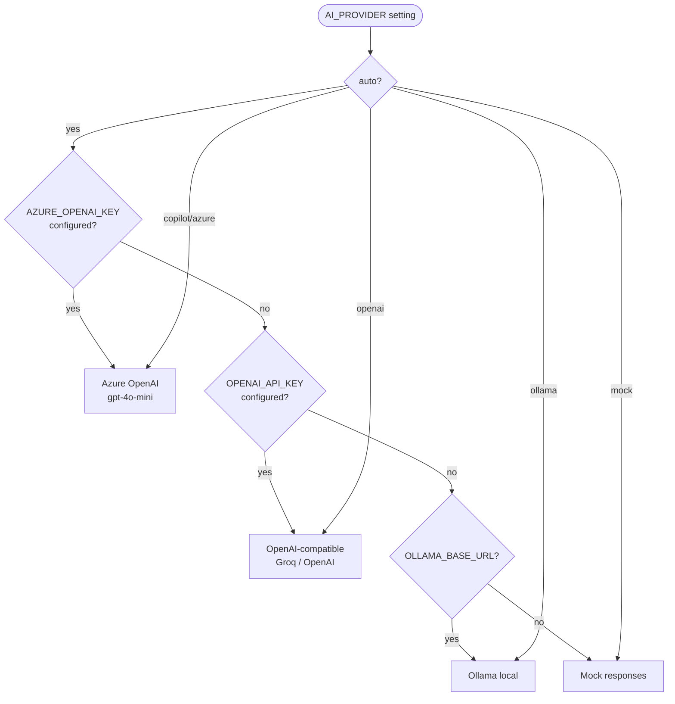

### Recommended Production Config (Render + Groq)

```env
AI_PROVIDER=openai
OPENAI_API_KEY=gsk_...
OPENAI_BASE_URL=https://api.groq.com/openai/v1
OPENAI_MODEL=llama-3.1-8b-instant
WHISPER_MODEL=whisper-large-v3-turbo
```

Verify: `GET /health/ai` → `"configured": true`

---

## 12. Deployment Plans

### Plan A — Hobby / $0 (Current Production) ⭐

**Best for:** Demos, ≤50 users, personal projects

| Component | Service | Cost |
|-----------|---------|------|
| Database | Neon free (0.5 GB, scale-to-zero) | $0 |
| API | Render free web (Oregon, cold start ~30s) | $0 |
| Web | Render free web (Oregon) | $0 |
| LLM | Groq free tier | $0 |
| **Total** | | **$0/month** |

**Deploy steps:**

1. **Neon** — https://neon.tech
   - Create project → run `CREATE EXTENSION IF NOT EXISTS vector;`
   - Copy **pooler** URL: `postgresql://...@ep-xxx-pooler.neon.tech/neondb?sslmode=require`

2. **Render Blueprint** — https://dashboard.render.com/blueprints
   - Connect repo → uses `render.yaml`
   - Set `DATABASE_URL`, `OPENAI_API_KEY` (Groq key)
   - Set branch to **`main`** on both services

3. **Migrations** (one time):
   ```bash
   cd ai-english-teacher/backend
   DATABASE_URL='your-neon-url' python3 scripts/migrate.py
   ```

4. **Smoke test:**
   - https://ai-english-teacher-api.onrender.com/health
   - https://ai-english-teacher-api.onrender.com/health/ai
   - Register → Login → Start conversation → Grammar class

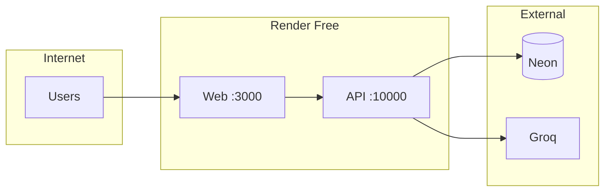

**Limitations:** Cold starts, 512 MB RAM, spins down after 15 min idle, Neon scale-to-zero.

---

### Plan B — Starter / ~$14/month

**Best for:** Small classroom, no cold starts

| Component | Change |
|-----------|--------|
| Render API | Starter plan ($7) — always on |
| Render Web | Starter plan ($7) — always on |
| Neon | Free tier still OK |
| Groq | Free tier |

---

### Plan C — Oracle Cloud VM / $0 Always-On ⭐

**Best for:** India/low-latency, 50+ users, voice-heavy, no cold starts

| Component | Service |
|-----------|---------|
| Compute | Oracle Always Free A1 (1 OCPU / 6 GB) |
| Database | Neon (external, free) |
| LLM | Groq (cloud) OR Ollama (on VM) |
| Cache | Redis (Docker on VM) |
| Proxy | nginx :80 |

**Deploy (one command on VM):**
```bash
curl -fsSL https://raw.githubusercontent.com/meenakshi25jan/docs/main/ai-english-teacher/deploy/oracle-cloud/deploy-now.sh | bash
```

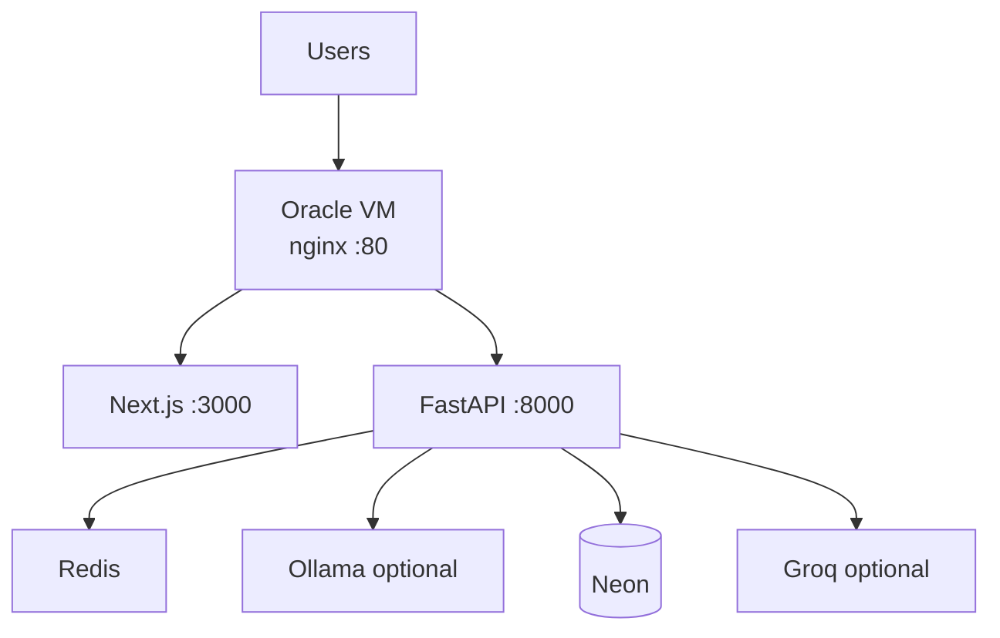

**Note:** Mumbai AD-1 Ampere capacity is often unavailable — retry or use a different region.

---

### Plan D — Enterprise / Azure AKS (~$8,100/month)

**Best for:** Schools, districts, compliance requirements

See `docs/08-DEPLOYMENT_ARCHITECTURE.md` and `docs/11-COST_ESTIMATION.md` for:
- Azure Kubernetes Service
- Azure OpenAI (Copilot)
- Azure PostgreSQL Flexible Server
- Azure Redis, Key Vault, Application Gateway
- Multi-region DR

---

### Deployment Comparison

| Plan | Monthly cost | Cold start | Always-on | Best for |
|------|-------------|------------|-----------|----------|
| **A — Render + Neon** | $0 | Yes (~30s) | No | Demos, hobby |
| **B — Render Starter** | ~$14 | No | Yes | Small classes |
| **C — Oracle VM** | $0 | No | Yes | 50+ users, India |
| **D — Azure AKS** | ~$8,100 | No | Yes | Enterprise schools |

---

## 13. Environment Variable Matrix

### Backend API

| Variable | Required | Default (Render) | Purpose |
|----------|----------|-------------------|---------|
| `DATABASE_URL` | ✅ | manual | Neon PostgreSQL URL with `?sslmode=require` |
| `JWT_SECRET_KEY` | ✅ | auto-generated | Auth token signing |
| `CORS_ORIGINS` | ✅ | web URL JSON array | Cross-origin allowlist |
| `AI_PROVIDER` | | `openai` | LLM provider selection |
| `OPENAI_API_KEY` | ✅ | manual | Groq or OpenAI key |
| `OPENAI_BASE_URL` | | `https://api.groq.com/openai/v1` | Groq endpoint |
| `OPENAI_MODEL` | | `llama-3.1-8b-instant` | Chat model |
| `WHISPER_MODEL` | | `whisper-large-v3-turbo` | STT model |
| `DATABASE_POOL_SIZE` | | `5` | Connection pool (Neon) |
| `DATABASE_POOL_RECYCLE` | | `280` | Recycle stale connections |
| `DATABASE_POOL_PRE_PING` | | `true` | Health-check pool connections |
| `SKIP_MIGRATIONS` | | `true` | Skip auto-migrate on boot |
| `REDIS_URL` | | `redis://localhost:6379/0` | Session cache (OCI) |
| `AZURE_OPENAI_*` | | empty | Azure Copilot (optional) |
| `OLLAMA_BASE_URL` | | empty | Self-hosted LLM (OCI) |

### Frontend Web

| Variable | Render value | Purpose |
|----------|-------------|---------|
| `NEXT_PUBLIC_API_URL` | `/api/v1` | Same-origin API path |
| `API_PROXY_URL` | `https://ai-english-teacher-api.onrender.com` | Rewrite target |
| `NODE_VERSION` | `20` | Node.js version |

### Mobile

| Variable | Example | Purpose |
|----------|---------|---------|
| `EXPO_PUBLIC_API_URL` | `https://ai-english-teacher-api.onrender.com/api/v1` | Direct API base URL |

---

## 14. Ports & Network Reference

| Environment | Service | Port | Protocol |
|-------------|---------|------|----------|
| Render API | FastAPI | `$PORT` (~10000) | HTTPS |
| Render Web | Next.js | 3000 | HTTPS |
| Neon | PostgreSQL | 5432 | SSL/TLS |
| Neon Pooler | PgBouncer | 5432 | SSL/TLS |
| Oracle VM | nginx | 80, 443 | HTTP/S |
| Oracle VM | FastAPI | 8000 | internal |
| Oracle VM | Next.js | 3000 | internal |
| Oracle VM | Redis | 6379 | internal |
| Oracle VM | Ollama | 11434 | internal |
| Local dev | Frontend | 3000 | HTTP |
| Local dev | Backend | 8000 | HTTP |
| Local dev | PostgreSQL | 5432 | TCP |
| Fly.io | FastAPI | 8000 | HTTPS |

---

## Quick Reference — Request Paths

```
Browser
  └─ /conversation          → POST /api/v1/conversations → LangGraph → TeacherAgent → Groq
  └─ /grammar-class         → GET  /api/v1/grammar/*    → GrammarTeacherAgent → Groq
  └─ /assessment            → POST /api/v1/assessments  → AssessmentAgents → Groq
  └─ /dashboard/student     → GET  /api/v1/dashboard/*  → PostgreSQL reads
  └─ /login, /register      → POST /api/v1/auth/*         → PostgreSQL + JWT

Android App
  └─ (tabs)/practice        → POST /api/v1/conversations → LangGraph
  └─ (tabs)/grammar         → POST /api/v1/grammar/practice → Voice + GrammarTeacher
  └─ (tabs)/assessment      → POST /api/v1/assessments
```

---

*Last updated: branch `main` — Waves 1–2 implemented, Plans A–D documented.*
