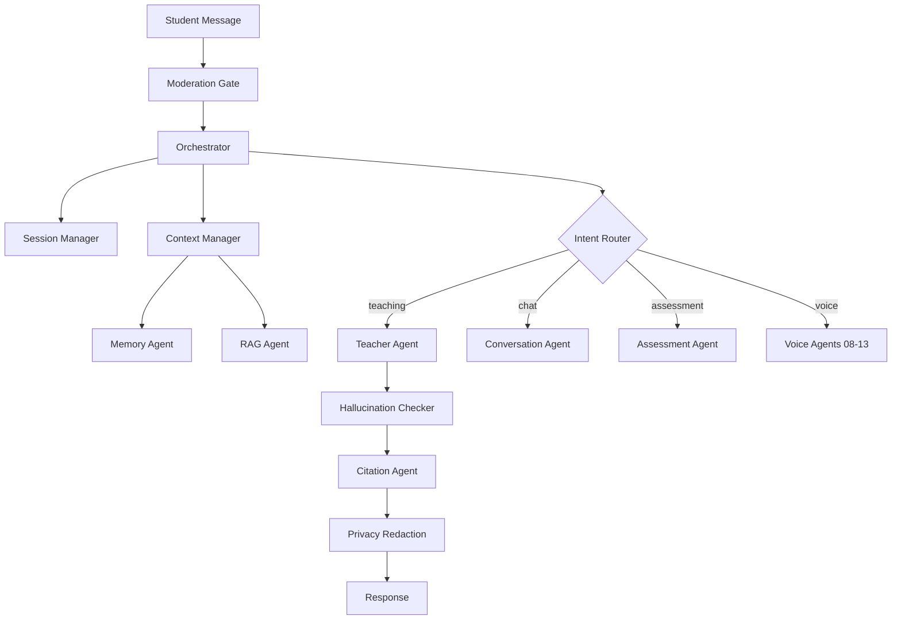

# Enterprise AI Teaching Platform V2.0 — Master Blueprint

Domain-driven agent architecture for scaling from MVP to enterprise (38+ agents).

## Architecture Overview

```
Student
   ↓
Orchestrator Agent (LangGraph Root)
   ↓
┌──────────────────────────────────────────────────────────┐
│  Foundation │ Voice │ Affective │ Learning │ Edu │ Gov  │
│  01-07      │ 08-13 │ 14-18     │ 19-25    │26-31│32-38 │
└──────────────────────────────────────────────────────────┘
   ↓
Response (+ Safety Gate: Moderation, Privacy, Policy)
```

### Design Principles

1. **Domain-driven agents** — Each agent owns one bounded capability; avoid monolithic prompts.
2. **Orchestrator-first** — All traffic flows through LangGraph root node for routing, retries, and audit.
3. **Layered safety** — Wave 6 agents wrap outputs; never optional in production.
4. **Cost-aware routing** — Cost Optimization Agent (#38) selects model tier per intent.
5. **Observable by default** — Every execution emits trace ID, agent path, cost, latency.

## Agent Development Maturity Model

Build in 6 waves instead of 38 agents at once.

| Wave | Name | Goal | Agents | Duration |
|------|------|------|--------|----------|
| 1 | Foundation Platform | AI teacher core | 01–07 | 6 weeks |
| 2 | Voice Intelligence | Speaking coach | 08–13 | 8 weeks |
| 3 | Emotional Intelligence | Emotionally aware teacher | 14–18 | 6 weeks |
| 4 | Learning Intelligence | Adaptive education | 19–25 | 8 weeks |
| 5 | Educational Intelligence | Ecosystem intelligence | 26–31 | 8 weeks |
| 6 | Enterprise Governance | Safe scale to schools | 32–38 | 10 weeks |

## Wave Summaries

### Wave 1 — Foundation Platform

**Deliverables:** Natural AI teacher, memory, personalized context, knowledge retrieval, voice session persistence.

| Agent | LangGraph Role |
|-------|----------------|
| 01 Orchestrator | Root node — routing, retries, state |
| 02 Session Manager | Redis session/lesson/audio state |
| 03 Context Manager | Merge history, profile, memory, RAG into prompt |
| 04 Conversation Agent | Natural dialogue (GPT-4o-mini) |
| 05 Teacher Agent | Teaching, examples, questioning (GPT-4o) |
| 06 Memory Agent | Mistakes, preferences, weak areas (Redis/PG/Qdrant) |
| 07 RAG Agent | Curriculum retrieval (Qdrant) |

### Wave 2 — Voice Intelligence

**Pipeline:** Audio → Whisper → Phoneme Engine → Scoring

**Deliverables:** Pronunciation scoring, speaking reports, live corrections, communication scoring.

Agents: Pronunciation, Fluency, Grammar, Vocabulary, Accent, Speech Quality (08–13).

### Wave 3 — Emotional Intelligence

**Sources:** Voice prosody, conversation text, optional facial (with consent).

**Deliverables:** Emotional awareness, confidence analysis, engagement analytics, adaptive teaching behavior.

Agents: Emotion Detection, Confidence, Engagement, Stress Detection, Motivation (14–18).

### Wave 4 — Learning Intelligence

**Deliverables:** Adaptive learning, personalized curriculums, automatic homework, personalized roadmaps.

Agents: Assessment, Bloom Taxonomy, Weak Topic, Quiz, Homework, Recommendation, Curriculum (19–25).

### Wave 5 — Educational Intelligence

**Deliverables:** Student success platform, parent reports, educational analytics, institution dashboards.

Agents: Student Profile, Goal Tracker, Progress, Parent Report, Teacher Dashboard, Analytics (26–31).

### Wave 6 — Enterprise Governance

**Deliverables:** Content safety, fact verification, compliance, 30–60% LLM cost reduction.

Agents: Moderation, Hallucination Checker, Citation, Privacy, Policy, Compliance, Cost Optimization (32–38).

## LangGraph Topology (Target)



## Technology Stack

| Layer | Technology |
|-------|------------|
| Orchestration | LangGraph |
| API | FastAPI (existing) |
| Session state | Redis |
| Primary DB | PostgreSQL (Neon) |
| Vector DB | Qdrant |
| LLM | Azure OpenAI / Groq / OpenAI (via `AI_PROVIDER`) |
| Speech | Whisper, browser STT (interim) |
| Frontend | Next.js (existing) |
| Deploy | Render + Neon (existing) |

## Release Plan

| Release | Agents | Timeline |
|---------|--------|----------|
| **MVP** | 9 (Wave 1 core subset) | 10–12 weeks |
| **V1** | 18 | ~5 months |
| **V2** | 28 | ~8 months |
| **Enterprise** | 38 | ~12 months |
| **Global Platform** | 38+ | ~18 months |

### MVP Agent Set (Recommended)

1. Orchestrator
2. Session Manager
3. Context Manager
4. Conversation
5. Teacher
6. Memory
7. RAG
8. Moderation (safety minimum)
9. Cost Optimization (cost control from day one)

## Cross-Cutting Layers

- **[MLOps Layer](./40-mlops-layer.md)** — Model registry, offline/online eval, A/B testing
- **[Agent Governance](./41-agent-governance.md)** — Registry, approval pipeline, audit trail

## Mapping V1 → V2

| V1 (`AGENT_REGISTRY`) | V2 Agent |
|-------------------------|----------|
| `teacher` | 05 Teacher Agent |
| `assessment` | 19 Assessment Agent |
| `grammar` | 10 Grammar Agent |
| `vocabulary` | 11 Vocabulary Agent |
| `writing` | (fold into 10 + 19) |
| `speaking` | 08–09 Voice agents |
| `planner` | 24 Recommendation Agent |
| `progress` | 28 Progress Agent |
| `report` | 29 Parent Report Agent |

## Next Implementation Steps

1. Add LangGraph + Redis to `backend/`
2. Implement Orchestrator routing in place of direct `conversations.py` calls
3. Stand up Qdrant collection for RAG Agent
4. Wire Memory Agent to existing PostgreSQL + new vector store
5. Add Moderation gate before any LLM call

See individual agent specs in this directory for inputs, outputs, KPIs, and test cases.
