# Comprehensive Algorithms Guide

## From Beginner to Senior Level

*Classical Algorithms, Artificial Intelligence, Machine Learning, Deep Learning, Reinforcement Learning, Optimization, Production Engineering, System Design, and Real-World Applications Using Python*

---

## Table of Contents

1. [Chapter 0: Setting Up Your Algorithm Learning Environment](#chapter-0-setting-up-your-algorithm-learning-environment)
2. [Chapter 1: Functions, Sets, and Logic](#chapter-1-functions-sets-and-logic)
3. [Chapter 2: Probability and Statistics](#chapter-2-probability-and-statistics)
4. [Chapter 3: Vectors, Matrices, and Linear Algebra Intuition](#chapter-3-vectors-matrices-and-linear-algebra-intuition)
5. [Chapter 4: Calculus and Optimization Intuition](#chapter-4-calculus-and-optimization-intuition)
6. [Chapter 5: What Is an Algorithm?](#chapter-5-what-is-an-algorithm)
7. [Chapter 6: Essential Data Structures](#chapter-6-essential-data-structures)
8. [Chapter 7: Big-O Complexity](#chapter-7-big-o-complexity)
9. [Chapter 8: Design Techniques](#chapter-8-design-techniques)
10. [Chapter 9: Linear Search](#chapter-9-linear-search)
11. [Chapter 10: Binary Search](#chapter-10-binary-search)
12. [Chapter 11: Depth-First Search (DFS)](#chapter-11-depth-first-search-dfs)
13. [Chapter 12: Breadth-First Search (BFS)](#chapter-12-breadth-first-search-bfs)
14. [Chapter 13: Dijkstra's Algorithm](#chapter-13-dijkstra-s-algorithm)
15. [Chapter 14: Bellman-Ford](#chapter-14-bellman-ford)
16. [Chapter 15: A* Search](#chapter-15-a-search)
17. [Chapter 16: Bubble Sort](#chapter-16-bubble-sort)
18. [Chapter 17: Selection Sort](#chapter-17-selection-sort)
19. [Chapter 18: Insertion Sort](#chapter-18-insertion-sort)
20. [Chapter 19: Merge Sort](#chapter-19-merge-sort)
21. [Chapter 20: Quick Sort](#chapter-20-quick-sort)
22. [Chapter 21: Heap Sort](#chapter-21-heap-sort)
23. [Chapter 22: Radix Sort](#chapter-22-radix-sort)
24. [Chapter 23: Graph Representations](#chapter-23-graph-representations)
25. [Chapter 24: Prim's Algorithm](#chapter-24-prim-s-algorithm)
26. [Chapter 25: Kruskal's Algorithm](#chapter-25-kruskal-s-algorithm)
27. [Chapter 26: Floyd-Warshall](#chapter-26-floyd-warshall)
28. [Chapter 27: Topological Sort](#chapter-27-topological-sort)
29. [Chapter 28: PageRank](#chapter-28-pagerank)
30. [Chapter 29: Graph Algorithms Integration](#chapter-29-graph-algorithms-integration)
31. [Chapter 30: Linear Regression](#chapter-30-linear-regression)
32. [Chapter 31: Logistic Regression](#chapter-31-logistic-regression)
33. [Chapter 32: Decision Trees](#chapter-32-decision-trees)
34. [Chapter 33: Random Forest](#chapter-33-random-forest)
35. [Chapter 34: Naive Bayes](#chapter-34-naive-bayes)
36. [Chapter 35: Support Vector Machines (SVM)](#chapter-35-support-vector-machines-svm)
37. [Chapter 36: k-Nearest Neighbors (kNN)](#chapter-36-k-nearest-neighbors-knn)
38. [Chapter 37: XGBoost](#chapter-37-xgboost)
39. [Chapter 38: LightGBM](#chapter-38-lightgbm)
40. [Chapter 39: k-Means Clustering](#chapter-39-k-means-clustering)
41. [Chapter 40: Hierarchical Clustering](#chapter-40-hierarchical-clustering)
42. [Chapter 41: DBSCAN](#chapter-41-dbscan)
43. [Chapter 42: Principal Component Analysis (PCA)](#chapter-42-principal-component-analysis-pca)
44. [Chapter 43: Apriori](#chapter-43-apriori)
45. [Chapter 44: Multilayer Perceptrons (MLP)](#chapter-44-multilayer-perceptrons-mlp)
46. [Chapter 45: Convolutional Neural Networks (CNN)](#chapter-45-convolutional-neural-networks-cnn)
47. [Chapter 46: Recurrent Neural Networks (RNN)](#chapter-46-recurrent-neural-networks-rnn)
48. [Chapter 47: Long Short-Term Memory (LSTM)](#chapter-47-long-short-term-memory-lstm)
49. [Chapter 48: Gated Recurrent Units (GRU)](#chapter-48-gated-recurrent-units-gru)
50. [Chapter 49: Autoencoders](#chapter-49-autoencoders)
51. [Chapter 50: Generative Adversarial Networks (GANs)](#chapter-50-generative-adversarial-networks-gans)
52. [Chapter 51: Transformers](#chapter-51-transformers)
53. [Chapter 52: BERT](#chapter-52-bert)
54. [Chapter 53: GPT-Style Models](#chapter-53-gpt-style-models)
55. [Chapter 54: Q-Learning](#chapter-54-q-learning)
56. [Chapter 55: SARSA](#chapter-55-sarsa)
57. [Chapter 56: Deep Q-Networks (DQN)](#chapter-56-deep-q-networks-dqn)
58. [Chapter 57: Actor-Critic](#chapter-57-actor-critic)
59. [Chapter 58: Asynchronous Advantage Actor-Critic (A3C)](#chapter-58-asynchronous-advantage-actor-critic-a3c)
60. [Chapter 59: Proximal Policy Optimization (PPO)](#chapter-59-proximal-policy-optimization-ppo)
61. [Chapter 60: Particle Swarm Optimization (PSO)](#chapter-60-particle-swarm-optimization-pso)
62. [Chapter 61: Ant Colony Optimization (ACO)](#chapter-61-ant-colony-optimization-aco)
63. [Chapter 62: Artificial Bee Colony (ABC)](#chapter-62-artificial-bee-colony-abc)
64. [Chapter 63: Firefly Algorithm](#chapter-63-firefly-algorithm)
65. [Chapter 64: Cuckoo Search](#chapter-64-cuckoo-search)
66. [Chapter 65: Bat Algorithm](#chapter-65-bat-algorithm)
67. [Chapter 66: Grey Wolf Optimizer (GWO)](#chapter-66-grey-wolf-optimizer-gwo)
68. [Chapter 67: Whale Optimization Algorithm (WOA)](#chapter-67-whale-optimization-algorithm-woa)
69. [Chapter 68: Genetic Algorithms (GA)](#chapter-68-genetic-algorithms-ga)
70. [Chapter 69: Genetic Programming (GP)](#chapter-69-genetic-programming-gp)
71. [Chapter 70: Differential Evolution (DE)](#chapter-70-differential-evolution-de)
72. [Chapter 71: Evolutionary Strategies (ES)](#chapter-71-evolutionary-strategies-es)
73. [Chapter 72: Gradient Descent](#chapter-72-gradient-descent)
74. [Chapter 73: Stochastic Gradient Descent (SGD)](#chapter-73-stochastic-gradient-descent-sgd)
75. [Chapter 74: Mini-Batch Gradient Descent](#chapter-74-mini-batch-gradient-descent)
76. [Chapter 75: Momentum](#chapter-75-momentum)
77. [Chapter 76: Adam Optimizer](#chapter-76-adam-optimizer)
78. [Chapter 77: Simulated Annealing](#chapter-77-simulated-annealing)
79. [Chapter 78: Hill Climbing](#chapter-78-hill-climbing)
80. [Chapter 79: Tabu Search](#chapter-79-tabu-search)
81. [Chapter 80: Branch and Bound](#chapter-80-branch-and-bound)
82. [Chapter 81: Dynamic Programming](#chapter-81-dynamic-programming)
83. [Chapter 82: Linear Programming](#chapter-82-linear-programming)
84. [Chapter 83: Integer Programming](#chapter-83-integer-programming)
85. [Chapter 84: Algorithm Selection Guide](#chapter-84-algorithm-selection-guide)
86. [Chapter 85 / Project 1: Route Planner](#chapter-85-project-1-route-planner)
87. [Chapter 86 / Project 2: Sorting Benchmark Tool](#chapter-86-project-2-sorting-benchmark-tool)
88. [Chapter 87 / Project 3: Customer Segmentation](#chapter-87-project-3-customer-segmentation)
89. [Chapter 88 / Project 4: House Price Prediction](#chapter-88-project-4-house-price-prediction)
90. [Chapter 89 / Project 5: Spam Detection](#chapter-89-project-5-spam-detection)
91. [Chapter 90 / Project 6: Image Classification](#chapter-90-project-6-image-classification)
92. [Chapter 91 / Project 7: Text Classification](#chapter-91-project-7-text-classification)
93. [Chapter 92 / Project 8: Optimization Problem](#chapter-92-project-8-optimization-problem)
94. [Chapter 93 / Project 9: RL Agent](#chapter-93-project-9-rl-agent)
95. [Chapter 94: LLMs and RAG](#chapter-94-llms-and-rag)
96. [Chapter 95: Vector Databases and Embeddings](#chapter-95-vector-databases-and-embeddings)
97. [Chapter 96: AI Agents and Orchestration](#chapter-96-ai-agents-and-orchestration)
98. [Chapter 97: Responsible AI and Governance](#chapter-97-responsible-ai-and-governance)
99. [Chapter 98: MLOps and Deployment](#chapter-98-mlops-and-deployment)
100. [Chapter 99: AI Observability](#chapter-99-ai-observability)
101. [Appendix A: Complexity Cheat Sheet](#appendix-a-complexity-cheat-sheet)
102. [Appendix B: Glossary](#appendix-b-glossary)
103. [Appendix C: Interview Guide](#appendix-c-interview-guide)
104. [Appendix D: Production Checklists](#appendix-d-production-checklists)

---


<!-- SOURCE: part-00-getting-started/chapter-00-environment-setup.md -->


---


# Chapter 0: Setting Up Your Algorithm Learning Environment

**Part 0 — Environment Setup & Python Fundamentals**

---

## Learning Objectives

By the end of this chapter, you will be able to:

1. Install Python 3.12 or newer on your computer.
2. Create and activate a virtual environment to isolate project dependencies.
3. Install book dependencies from a pinned `requirements.txt` file.
4. Run Python scripts from the terminal and from VS Code.
5. Use Jupyter Notebook or Google Colab for interactive learning.
6. Measure how long code takes to run using `time.perf_counter()`.
7. Apply basic debugging techniques when programs fail.
8. Verify your setup with automated tests using `pytest`.
9. Explain why reproducible environments matter in professional engineering.

---

## Introduction

Before you study sorting, graphs, machine learning, or reinforcement learning, you need a reliable workspace. A professional algorithm learner does not run random code in a messy global Python installation. Instead, you create a **clean, repeatable environment** where every library version is known and every example can be rerun months later with the same result.

This chapter walks you through that setup step by step. We use **Python 3.12+** because it is modern, widely supported in industry, and works with all libraries used in this book. Every command and script in this chapter is runnable. If something fails, the debugging section will help you recover quickly.

---

## Real-World Motivation

At Google, Netflix, Amazon, and every serious software company, engineers do not share one giant Python install on a laptop. Teams use:

- **Virtual environments** or containers to avoid dependency conflicts.
- **Pinned versions** in `requirements.txt` or lock files so production matches development.
- **Automated tests** to confirm that setup scripts still work after upgrades.
- **Benchmarking tools** to measure whether an algorithm improvement is real or noise.

The habits you build in this chapter are the same habits senior engineers use before deploying routing engines, recommendation models, or fraud-detection pipelines. Your learning environment is the foundation of everything that follows.

---

## Daily-Life Analogy

Think of your computer like a kitchen.

- **Python** is the stove — the core tool that makes things work.
- **Libraries** (NumPy, Pandas, scikit-learn) are ingredients — flour, spices, oil.
- A **virtual environment** is a separate pantry for one recipe book. If you spill salt in the algorithms pantry, your web-development pantry stays clean.
- **`requirements.txt`** is the shopping list with exact brands and sizes so anyone can cook the same dish.
- **`pytest`** is a taste test before you serve the meal to guests.

A messy kitchen produces inconsistent food. A messy Python setup produces inconsistent algorithm results.

---

## Mathematical Intuition

This chapter introduces only one mathematical idea: **measurement**.

When we time an algorithm, we are estimating how long a process takes on your machine. Real runtimes depend on CPU speed, background programs, and cache behavior. That is why we use `time.perf_counter()` — it gives high-resolution timestamps suitable for comparing runs on the same computer.

You do not need calculus or linear algebra yet. You only need to understand that **we measure before we optimize**. Senior engineers never claim an algorithm is faster without showing numbers.

---

## Core Concepts

| Concept | Meaning |
|---------|---------|
| **Python interpreter** | Program that reads and executes Python code |
| **Virtual environment** | Isolated folder with its own Python packages |
| **`pip`** | Package installer for Python |
| **`requirements.txt`** | List of packages and versions for reproducible installs |
| **IDE** | Integrated development environment (e.g., VS Code) |
| **REPL** | Read-Eval-Print Loop; interactive Python shell |
| **Script** | `.py` file executed as a program |
| **Unit test** | Small automated check that code behaves correctly |
| **Benchmark** | Timed run used to compare performance |

---

## Visual Diagram: Your Learning Environment

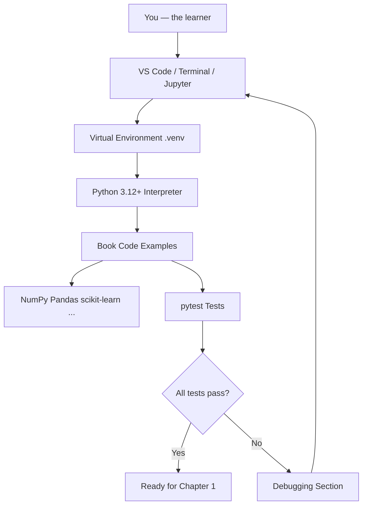

---

## Step-by-Step Explanation

### Step 1: Install Python 3.12 or Newer

**Windows**

1. Visit [https://www.python.org/downloads/](https://www.python.org/downloads/)
2. Download Python 3.12 or newer.
3. Run the installer.
4. Check **"Add Python to PATH"**.
5. Open Command Prompt and run:

```bash
python --version
```

Expected output (version may vary):

```text
Python 3.12.7
```

**macOS**

```bash
# Using Homebrew (recommended)
brew install python@3.12
python3.12 --version
```

**Linux (Ubuntu/Debian)**

```bash
sudo apt update
sudo apt install python3.12 python3.12-venv python3-pip
python3.12 --version
```

### Step 2: Clone or Download This Book Repository

```bash
git clone <your-repository-url>
cd comprehensive-algorithms-guide
```

If you received the book as a ZIP file, extract it and `cd` into the `comprehensive-algorithms-guide` folder.

### Step 3: Create a Virtual Environment

A virtual environment keeps book dependencies separate from other projects.

```bash
python3.12 -m venv .venv
```

**Activate the environment:**

| OS | Command |
|----|---------|
| macOS / Linux | `source .venv/bin/activate` |
| Windows (CMD) | `.venv\Scripts\activate.bat` |
| Windows (PowerShell) | `.venv\Scripts\Activate.ps1` |

After activation, your prompt often shows `(.venv)`.

Verify you are using the environment Python:

```bash
which python    # macOS/Linux
where python    # Windows
```

### Step 4: Upgrade pip and Install Dependencies

```bash
python -m pip install --upgrade pip
pip install -r requirements.txt
```

Installation may take several minutes because libraries like PyTorch and TensorFlow are large. For Chapter 0, you only need the packages used in the verification scripts. The full list prepares you for later chapters.

### Step 5: Run Your First Successful Program

```bash
python code/part-00/first_successful_run.py
```

### Step 6: Run Tests

```bash
pytest tests/part-00/ -v
```

### Step 7: Open the Project in VS Code

1. Install [Visual Studio Code](https://code.visualstudio.com/).
2. Install the **Python** extension by Microsoft.
3. Open the `comprehensive-algorithms-guide` folder.
4. Press `Ctrl+Shift+P` (or `Cmd+Shift+P` on Mac).
5. Type **Python: Select Interpreter** and choose `.venv/bin/python`.

### Step 8: Optional — Use Jupyter Notebook

```bash
pip install jupyter
jupyter notebook
```

Create a new notebook and run:

```python
import sys
print(sys.version)
```

### Step 9: Optional — Use Google Colab

1. Visit [https://colab.research.google.com/](https://colab.research.google.com/)
2. Upload a chapter notebook or clone the repository.
3. Colab provides a free GPU for deep learning chapters later.

Note: Colab environments reset. For reproducibility, always record package versions.

---

## Python Implementation

### Program 1: First Successful Run

**What this code does:** Prints a welcome banner and confirms your Python version and platform.

See the full source file: [`code/part-00/first_successful_run.py`](code/part-00/first_successful_run.py)

```python
#!/usr/bin/env python3
"""First successful run for the Comprehensive Algorithms Guide."""

from __future__ import annotations

import platform
import sys


def main() -> None:
    """Print a welcome banner and environment details."""
    python_version: str = platform.python_version()
    implementation: str = platform.python_implementation()

    print("=" * 60)
    print("Comprehensive Algorithms Guide — Environment Check")
    print("=" * 60)
    print(f"Python version     : {python_version}")
    print(f"Implementation     : {implementation}")
    print(f"Executable         : {sys.executable}")
    print(f"Platform           : {platform.system()} {platform.release()}")
    print("-" * 60)
    print("Status             : SUCCESS")
    print("Your environment is ready for Chapter 0 exercises.")
    print("=" * 60)


if __name__ == "__main__":
    main()
```

### Program 2: Measure Execution Time

**What this code does:** Computes the sum of squares from 1 to 1,000,000 and prints how long it took.

See: [`code/part-00/measure_execution_time.py`](code/part-00/measure_execution_time.py)

```python
#!/usr/bin/env python3
"""Measure execution time for a simple algorithm-style loop."""

from __future__ import annotations

import time


def sum_squares(n: int) -> int:
    """Compute sum of i*i for i in 1..n."""
    if n < 0:
        raise ValueError("n must be non-negative")
    total: int = 0
    for i in range(1, n + 1):
        total += i * i
    return total


def main() -> None:
    """Run sum_squares with timing."""
    n: int = 1_000_000
    start: float = time.perf_counter()
    result: int = sum_squares(n)
    elapsed: float = time.perf_counter() - start

    print(f"sum_squares({n:,}) = {result:,}")
    print(f"Elapsed time: {elapsed:.6f} seconds")


if __name__ == "__main__":
    main()
```

### Program 3: Verify Package Imports

**What this code does:** Confirms that core libraries installed from `requirements.txt` can be imported.

See: [`code/part-00/verify_packages.py`](code/part-00/verify_packages.py)

Run after installing dependencies:

```bash
python code/part-00/verify_packages.py
```

---

## Code Walkthrough

### `first_successful_run.py`

| Line | Explanation |
|------|-------------|
| `from __future__ import annotations` | Enables modern type-hint syntax |
| `import platform` | Access OS and Python version info |
| `import sys` | Access interpreter path and exit codes |
| `def main() -> None:` | Entry function with return type `None` |
| `platform.python_version()` | Returns version string like `3.12.7` |
| `sys.executable` | Path to the Python binary in use |
| `if __name__ == "__main__":` | Runs `main()` only when script is executed directly |

### `measure_execution_time.py`

| Line | Explanation |
|------|-------------|
| `time.perf_counter()` | High-resolution timer for benchmarks |
| `for i in range(1, n + 1)` | Classic loop — foundation for many algorithms |
| `total += i * i` | Accumulator pattern |
| `f"{n:,}"` | Formats integers with thousands separators |

---

## Expected Output

### `first_successful_run.py`

```text
============================================================
Comprehensive Algorithms Guide — Environment Check
============================================================
Python version     : 3.12.7
Implementation     : CPython
Executable         : /path/to/comprehensive-algorithms-guide/.venv/bin/python
Platform           : Linux 6.12.94
------------------------------------------------------------
Status             : SUCCESS
Your environment is ready for Chapter 0 exercises.
============================================================
```

Your paths and version numbers will differ. **SUCCESS** is what matters.

### `measure_execution_time.py`

```text
sum_squares(1,000,000) = 333,333,833,333,500,000
Elapsed time: 0.142387 seconds
```

Elapsed time varies by hardware. On a fast CPU it may be under 0.2 seconds.

### `pytest tests/part-00/ -v`

```text
tests/part-00/test_chapter_00.py::test_first_successful_run_exits_zero PASSED
tests/part-00/test_chapter_00.py::test_sum_squares_small_values PASSED
tests/part-00/test_chapter_00.py::test_sum_squares_rejects_negative PASSED
tests/part-00/test_chapter_00.py::test_measure_execution_time_runs PASSED

============================== 4 passed in 0.52s ==============================
```

---

## Output Explanation

- **Python version** confirms you are on 3.12+ as required by this book.
- **Executable path** should point inside `.venv` when the virtual environment is active.
- **sum_squares result** is deterministic — the same input always produces the same output.
- **Elapsed time** is machine-dependent but should be stable across repeated runs on the same machine with low background load.
- **pytest PASSED** means your environment can run and test book code automatically.

---

## Time Complexity

For `sum_squares(n)`, the loop runs `n` times, so time complexity is **O(n)**.

Environment setup itself is **O(1)** from an algorithms perspective — it is a one-time human and I/O operation, not an algorithm you will benchmark in production.

---

## Space Complexity

`sum_squares` uses **O(1)** extra space — only a few variables regardless of `n`.

Your virtual environment on disk uses **O(p)** space where `p` is the number and size of installed packages. This is expected.

---

## Memory Usage

For `n = 1_000_000`, memory usage remains small (a few integers). Later chapters will discuss memory for large graphs, matrices, and neural networks.

To observe memory in Python:

```python
import tracemalloc

tracemalloc.start()
result = sum(range(1_000_001))
current, peak = tracemalloc.get_traced_memory()
tracemalloc.stop()
print(f"Current: {current / 1024:.2f} KiB, Peak: {peak / 1024:.2f} KiB")
```

---

## Performance Considerations

1. **Always activate `.venv`** before running book code — wrong interpreter means wrong packages.
2. **Close heavy background apps** when benchmarking — browsers and IDEs affect timings.
3. **Run benchmarks multiple times** and take the median, not a single run.
4. **Use `perf_counter`**, not `time.time()`, for short measurements.
5. **Pin versions** — unpinned installs can break examples silently.

---

## Common Mistakes

| Mistake | Symptom | Fix |
|---------|---------|-----|
| Forgot to activate venv | `ModuleNotFoundError` | Run `source .venv/bin/activate` |
| Used `python` vs `python3` | Wrong version | Use `python3.12` explicitly |
| Installed packages globally | Conflicts with other projects | Create a fresh `.venv` |
| Skipped `pip install -r requirements.txt` | Import errors | Install from requirements file |
| Running tests from wrong directory | File not found | `cd comprehensive-algorithms-guide` first |
| PATH not set on Windows | `python` not recognized | Reinstall with "Add to PATH" checked |

---

## Debugging Tips

### 1. Read the Full Error Message

Python tracebacks read bottom-to-top. The last line usually states the error type and message.

### 2. Check Your Interpreter

In VS Code, confirm the bottom status bar shows `.venv`.

```bash
python -c "import sys; print(sys.executable)"
```

### 3. Verify a Package

```bash
python -c "import numpy; print(numpy.__version__)"
```

### 4. Use `print` Debugging

Insert temporary `print` statements to inspect variable values. Remove them after fixing the bug.

### 5. Use the Debugger

In VS Code, click left of a line number to set a breakpoint, then press **F5**.

### 6. Re-run Tests

```bash
pytest tests/part-00/ -v --tb=short
```

The `--tb=short` flag shows shorter tracebacks.

---

## Unit Tests

This chapter includes automated tests in [`tests/part-00/test_chapter_00.py`](../tests/part-00/test_chapter_00.py).

**Why tests matter:** Senior engineers treat setup scripts like production code. If the environment check breaks, every downstream chapter breaks.

Run tests:

```bash
pytest tests/part-00/ -v
```

With coverage:

```bash
pytest tests/part-00/ -v --cov=code/part-00 --cov-report=term-missing
```

---

## Benchmarking

Example using `timeit`:

```python
import timeit

elapsed = timeit.timeit(
    "sum_squares(100_000)",
    setup="from measure_execution_time import sum_squares",
    number=10,
)
print(f"Average of 10 runs: {elapsed / 10:.6f} seconds")
```

**What can go wrong:** First run may be slower due to caching. **Improvement:** Use `timeit` with multiple iterations and report min, median, and max.

---

## Interview Questions

### Beginner (5)

1. What is a virtual environment and why should you use one?
2. What is the difference between `python` and `pip`?
3. What does `if __name__ == "__main__"` do?
4. How do you check your installed Python version?
5. What is `requirements.txt` used for?

### Intermediate (5)

1. Explain the difference between `time.time()` and `time.perf_counter()`.
2. How would you reproduce a colleague's Python environment on your laptop?
3. What is the purpose of type hints in Python?
4. How does `pytest` discover and run tests?
5. Why might two machines report different runtimes for the same O(n) algorithm?

### Advanced (5)

1. Compare virtual environments, Docker containers, and conda environments for ML projects.
2. How would you design a CI pipeline step that verifies `requirements.txt` is consistent?
3. Explain how import caching affects benchmark repeatability.
4. What security risks exist when running `pip install` from unpinned dependencies?
5. How would you support both CPU-only and GPU-enabled installs from one repository?

### System Design (3)

1. How would you package algorithm training code for deployment across dev, staging, and production?
2. Design a developer onboarding flow for a team of 50 ML engineers with reproducible environments.
3. How would you monitor environment drift in production ML services?

### Coding Challenge (1)

Write a function `environment_report() -> dict` that returns Python version, platform, and whether each package in `REQUIRED_PACKAGES` is installed. Include a pytest test.

---

## Production Notes

In production systems:

- **Never deploy without pinned dependencies.** Use lock files (`pip-tools`, Poetry, uv) in real projects.
- **Containerize** training and serving workloads (Docker) for parity across machines.
- **CI/CD** should run `pytest` on every pull request, including smoke tests for imports.
- **Secrets** (API keys) belong in environment variables, never in code or `requirements.txt`.
- **Observability:** log Python version and package versions at service startup for debugging incidents.

Companies like Netflix and Amazon rebuild environments from scratch in CI. Treat your laptop setup as a miniature version of that discipline.

---

## Architecture Integration

How environment setup fits into a real ML system:


| Stage | Role |
|-------|------|
| Virtual env | Local reproducibility |
| requirements.txt | Declares dependencies |
| pytest | Gates bad code before merge |
| Docker | Identical runtime in cloud |
| Monitoring | Detects version skew and drift |

---

## Best Practices

1. One virtual environment per project.
2. Pin versions in `requirements.txt`.
3. Run tests before and after installing new packages.
4. Document your OS and Python version when reporting bugs.
5. Use type hints and docstrings from day one.
6. Keep chapter code in the `code/` folder; do not scatter scripts.
7. Commit `requirements.txt`; never commit `.venv/`.

---

## Engineering Notes

### Beginner Note

Many beginners install packages with `pip install numpy` globally, then wonder why examples break later. Always activate `.venv` first. If lost, delete `.venv`, recreate it, and reinstall from `requirements.txt`.

### Intermediate Note

`requirements.txt` pins versions but does not resolve transitive dependencies automatically. For larger projects, consider `pip-tools` (`pip-compile`) or Poetry. For this book, pinned direct dependencies are sufficient.

### Senior Engineer Note

Production teams separate **build environments** from **runtime environments**. Training may need CUDA and large ML frameworks; inference may use ONNX Runtime or a slim API container. Environment design is a trade-off between reproducibility, image size, security surface, and cold-start latency. The habit of pinning versions and testing imports is the same whether you are on a laptop or deploying to Kubernetes at scale.

---

## Summary

In this chapter you:

- Installed Python 3.12+ and created a virtual environment.
- Installed pinned dependencies from `requirements.txt`.
- Ran your first verification script and timing example.
- Executed unit tests with `pytest`.
- Learned debugging, benchmarking, and production-minded environment practices.

You are now ready for mathematical foundations and algorithm fundamentals.

---

## Exercises

### Exercise 1 — Environment Report

Write a script that prints Python version, active virtual env (if any), and current working directory.

### Exercise 2 — Timing Comparison

Modify `sum_squares` to use `n = 100_000`, `500_000`, and `1_000_000`. Record elapsed times. Is the relationship linear?

### Exercise 3 — Package Detective

Pick three packages from `requirements.txt`. For each, print its version and one sentence about what it is used for in this book.

### Exercise 4 — Debug on Purpose

Remove the `if n < 0` check from `sum_squares`, call `sum_squares(-5)`, and document the behavior. Restore the check afterward.

### Exercise 5 — Colab or Jupyter

Run the first successful program in Jupyter or Colab. Note any differences from local execution.

---

## Further Reading

- [Python Official Documentation — venv](https://docs.python.org/3/library/venv.html)
- [pip User Guide](https://pip.pypa.io/en/stable/user_guide/)
- [pytest Documentation](https://docs.pytest.org/)
- [PEP 8 — Style Guide for Python Code](https://peps.python.org/pep-0008/)
- [Visual Studio Code Python Tutorial](https://code.visualstudio.com/docs/python/python-tutorial)
- [Google Colab FAQ](https://research.google.com/colaboratory/faq.html)

---

**Next chapter:** Part 0.5 — Mathematical Foundations *(pending — reply **Continue** to generate)*


---


<!-- SOURCE: part-00-mathematical-foundations/chapter-01-functions-sets-logic.md -->


---


# Chapter 1: Functions, Sets, and Logic

**Part 0.5 — Mathematical Foundations**

---

## Learning Objectives

By the end of this chapter, you will be able to:

1. Define functions, domains, codomains, and mappings (injective, surjective, bijective).
2. Perform set operations: union, intersection, difference, and symmetric difference.
3. Construct and reason about power sets of finite collections.
4. Evaluate propositional logic with AND, OR, implication, IFF, and XOR.
5. Translate real-world classification problems into set membership statements.
6. Implement set and logic utilities in Python with type hints.
7. Verify function properties programmatically on finite domains.
8. Connect discrete math foundations to algorithm correctness proofs.

---

## Introduction

Algorithms manipulate **data** and make **decisions**. Under the hood, both activities rest on three mathematical pillars: **functions** (input-to-output rules), **sets** (collections of distinct objects), and **logic** (true/false reasoning). Before you analyze graph traversals or train neural networks, you need a shared vocabulary for describing what an algorithm accepts, what it produces, and when its steps are valid.

This chapter builds that vocabulary with runnable Python examples. You will not need advanced calculus yet — only clear thinking about collections and truth values.

---

## Real-World Motivation

- **Databases** use set operations (`UNION`, `INTERSECT`) to combine query results.
- **Access control** expresses permissions as sets of users and resources.
- **Search engines** deduplicate URLs using set membership.
- **Machine learning** defines training sets, validation sets, and label spaces as sets.
- **Type systems** in programming languages are logic applied to code correctness.

Every time you filter a list, join two tables, or check `if user in admins`, you are using sets and logic.

---

## Daily-Life Analogy

Imagine organizing a school club:

- **Set A** = students who play chess.
- **Set B** = students who play music.
- **A ∩ B** = students who do both.
- **A ∪ B** = everyone in either activity.
- A **function** `grade(student)` maps each student to a letter grade.
- The statement "If it rains **and** the field is muddy, practice is canceled" is propositional logic.

Sets tell you *who belongs*; functions tell you *how things map*; logic tells you *when rules fire*.

---

## Mathematical Intuition

A **function** `f: A → B` assigns exactly one output in `B` to each input in `A`. Think of a vending machine: one button press → one item (not zero, not two).

A **set** has no duplicates and no order (in the mathematical sense). `{1, 2}` equals `{2, 1}`.

**Logic** combines truth values. Implication `p → q` is false only when `p` is true and `q` is false — a subtle rule that mirrors "if precondition holds, postcondition must hold" in algorithms.

---

## Core Concepts

| Concept | Definition |
|---------|------------|
| **Function** | Rule mapping each domain element to exactly one codomain element |
| **Injective** | Distinct inputs → distinct outputs (one-to-one) |
| **Surjective** | Every codomain element is hit by some input (onto) |
| **Bijective** | Both injective and surjective; invertible |
| **Union (A ∪ B)** | Elements in A or B or both |
| **Intersection (A ∩ B)** | Elements in both A and B |
| **Power set P(S)** | Set of all subsets of S; size `2^|S|` |
| **Proposition** | Statement that is true or false |
| **Implication** | `p → q` ≡ `¬p ∨ q` |

---

## Visual Diagram (Mermaid)

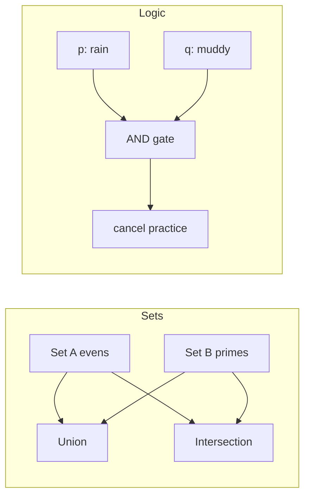

---

## Step-by-Step Explanation

### Step 1: Define Sets

Create Python `set` objects for two collections. Sets automatically deduplicate.

### Step 2: Compute Set Operations

Use `|`, `&`, `-`, and `^` for union, intersection, difference, and symmetric difference.

### Step 3: Test Injectivity

For a finite domain, track outputs in a `set`. If an output repeats before the domain ends, the function is not injective on that domain.

### Step 4: Build a Power Set

For `n` elements, iterate masks `0 .. 2^n - 1`. Each bit selects whether element `i` is in the subset.

### Step 5: Evaluate Logic Operators

Map English rules to boolean operators. Implication is the operator most beginners confuse with "and."

---

## Python Implementation

See [`code/part-05/sets_logic.py`](code/part-05/sets_logic.py).

```python
from sets_logic import set_operations, is_injective, evaluate_proposition, power_set

evens = {2, 4, 6, 8}
primes = {2, 3, 5, 7}
print(set_operations(evens, primes))
print(is_injective(lambda x: x * 2, range(5)))
print(evaluate_proposition(True, False, "implies"))
print([set(s) for s in power_set(["a", "b"])])
```

Run:

```bash
python code/part-05/sets_logic.py
```

---

## Code Walkthrough

| Function | Role |
|----------|------|
| `set_operations` | Returns union, intersection, difference, symmetric difference |
| `is_injective` | Checks one-to-one property on a finite iterable domain |
| `power_set` | Enumerates all subsets via bit masks |
| `evaluate_proposition` | Evaluates binary logical operators safely |

Key pattern: use `frozenset` for hashable subsets in the power set result.

---

## Expected Output

```text
Set A (evens): [2, 4, 6, 8]
Set B (primes): [2, 3, 5, 7]
  union: [2, 3, 4, 5, 6, 7, 8]
  intersection: [2]
  difference: [4, 6, 8]
  symmetric_difference: [3, 4, 5, 6, 7, 8]

Double is injective on [0, 1, 2, 3, 4]: True

Logic: p=True, q=False
  and: False
  or: True
  implies: False
  iff: False
  xor: True

Power set of {a, b} (4 subsets):
  set()
  {'a'}
  {'b'}
  {'a', 'b'}
```

---

## Output Explanation

- **Intersection `{2}`** — only 2 is both even and prime.
- **Injectivity of doubling** — each input maps to a unique doubled value on `0..4`.
- **`implies: False`** — when `p` is true and `q` is false, implication fails.
- **Four subsets** — for 2 elements, `2^2 = 4` subsets including the empty set.

---

## Time Complexity

| Operation | Complexity |
|-----------|------------|
| Set union/intersection on sizes `n`, `m` | O(n + m) average for hash sets |
| `is_injective` on domain size `n` | O(n) time, O(n) extra space for seen outputs |
| `power_set` on `n` elements | O(n · 2^n) — exponential |

---

## Space Complexity

- Set operations: O(n + m) to store results.
- Power set: O(2^n) subsets, each up to size n → O(n · 2^n) total space.

---

## Memory Usage

For `power_set` with `n = 20`, you would create over one million subsets — avoid large power sets in production. Use sets for membership tests, not full power-set enumeration, unless `n` is tiny.

---

## Performance Considerations

1. Prefer Python `set` for O(1) average membership tests.
2. Never enumerate power sets for `n > 25` without a strong reason.
3. For large universes, use Bloom filters (probabilistic membership) in production systems.
4. Injective checks require storing all outputs — not feasible for infinite domains.

---

## Common Mistakes

| Mistake | Fix |
|---------|-----|
| Treating lists as sets | Convert with `set(lst)` if order and duplicates do not matter |
| Confusing `⊂` with `∈` | Subset vs element membership |
| Assuming implication is bidirectional | `p → q` does not mean `q → p` |
| Using mutable sets as dict keys | Use `frozenset` |

---

## Debugging Tips

1. Print intermediate sets with `sorted(s)` for readable output.
2. For logic bugs, build a truth table with nested loops over `(p, q) ∈ {T,F}²`.
3. When injectivity fails, print the first colliding inputs.
4. Run `pytest tests/part-05/test_chapter_01.py -v` after changes.

---

## Unit Tests

Tests live in [`tests/part-05/test_chapter_01.py`](../tests/part-05/test_chapter_01.py).

```bash
pytest tests/part-05/test_chapter_01.py -v
```

---

## Benchmarking

```python
import timeit
from sets_logic import set_operations

a, b = set(range(10_000)), set(range(5_000, 15_000))
elapsed = timeit.timeit(lambda: set_operations(a, b), number=1000)
print(f"1000 set ops: {elapsed:.4f}s")
```

Set operations on 10k elements are fast; power-set enumeration is not.

---

## Interview Questions

### Beginner (5)

1. What is the difference between a set and a list in Python?
2. What does `A ∩ B` mean?
3. When is a function injective?
4. What is the truth value of `True and False`?
5. How many subsets does a set with 3 elements have?

### Intermediate (5)

1. Prove that `|P(S)| = 2^|S|` for finite S.
2. Explain why hash sets give average O(1) membership.
3. Write truth tables for `p → q` and `¬p ∨ q` and show they match.
4. When is a function bijective?
5. How would you test surjectivity on a finite codomain?

### Advanced (5)

1. Relate set partitions to equivalence relations.
2. Explain Russell's paradox and how axiomatic set theory avoids it.
3. Compare ZFC foundations vs type theory for algorithm specifications.
4. What is the inclusion-exclusion principle? Give a formula for |A ∪ B ∪ C|.
5. How do characteristic functions represent sets in analysis?

### System Design (3)

1. Design a permission system using sets and role hierarchies.
2. How would you deduplicate a billion URLs with bounded memory?
3. Design a feature-flag evaluation engine using boolean logic trees.

### Coding Challenge (1)

Implement `is_bijective(f, domain, codomain)` for finite iterables and write pytest cases.

---

## Production Notes

- Use database `UNION`/`INTERSECT` for set semantics at scale; do not load entire tables into Python sets.
- Authorization policies (RBAC/ABAC) compile to logical predicates — test edge cases like empty roles.
- Cache set membership in Redis for hot paths; watch memory for large key sets.

---

## Architecture Integration

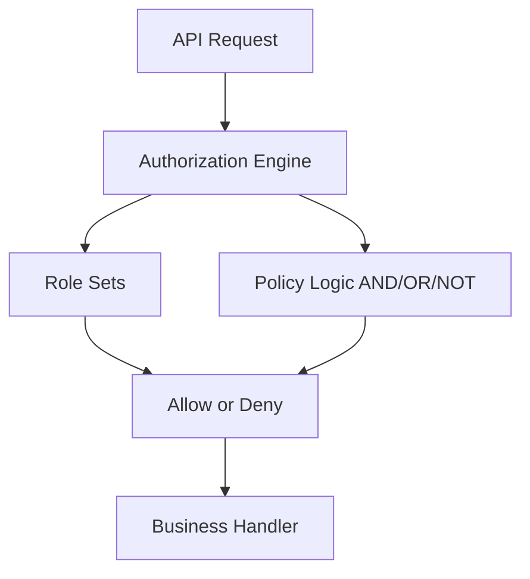

Sets and logic sit at the gateway of most secure systems.

---

## Best Practices

1. Name sets for what they *contain*, not how they are stored.
2. Use `frozenset` when subsets must be hashable.
3. Document function domains and codomains in docstrings.
4. Build truth tables for complex business rules before coding.
5. Prefer set comprehensions over manual loops for clarity.

---

## Engineering Notes

### Beginner Note

If `A & B` confuses you, draw two overlapping circles (Venn diagram). Elements in the overlap belong to both sets. Python's `&` operator does exactly that.

### Intermediate Note

Injective/surjective/bijective properties depend on the **declared domain and codomain**. `f(x) = x²` is not injective on all reals (since `f(-2) = f(2)`), but it is injective on non-negative reals.

### Senior Engineer Note

Formal specifications (TLA+, Alloy) express system invariants as logical formulas over sets and functions. Investing in discrete math pays off when you need to prove that a distributed cache invalidation protocol cannot serve stale membership sets.

---

## Summary

You learned functions, sets, and propositional logic — the language of algorithm inputs, outputs, and correctness. Python's `set` type and boolean operators make these ideas executable. Power sets grow exponentially; injectivity checks are linear on finite domains. These tools recur in every later chapter.

---

## Exercises

1. Implement `is_surjective(f, domain, codomain)` and test it.
2. Build a truth table printer for all five operators in `evaluate_proposition`.
3. Given sets of skills for job candidates, find candidates with at least 3 matching skills.
4. Prove that `A - B = A ∩ Bᶜ` using Python sets on random small universes.
5. Model a simple access rule: `admin OR (member AND verified)`.

---

## Further Reading

- [MIT Mathematics for Computer Science — Sets & Logic](https://ocw.mit.edu/courses/6-042j-mathematics-for-computer-science-fall-2010/)
- [Python `set` documentation](https://docs.python.org/3/library/stdtypes.html#set)
- [Stanford Encyclopedia — Propositional Logic](https://plato.stanford.edu/entries/logic-propositional/)

---

**Next chapter:** [Chapter 2: Probability and Statistics](./chapter-02-probability-statistics.md)


---


<!-- SOURCE: part-00-mathematical-foundations/chapter-02-probability-statistics.md -->


---


# Chapter 2: Probability and Statistics

**Part 0.5 — Mathematical Foundations**

---

## Learning Objectives

By the end of this chapter, you will be able to:

1. Compute empirical probabilities from observed data.
2. Apply Bayes' theorem to update beliefs with evidence.
3. Calculate mean, variance, and standard deviation of a dataset.
4. Use the binomial distribution for repeated independent trials.
5. Distinguish population vs sample statistics.
6. Implement probability utilities in Python with validation.
7. Interpret summary statistics for algorithm benchmarking noise.
8. Connect probability to machine learning and randomized algorithms.

---

## Introduction

Algorithms rarely operate in a perfectly predictable world. Network latency varies, users click randomly, and machine learning models output **probabilities** rather than certainties. **Probability** quantifies uncertainty; **statistics** summarizes data drawn from uncertain processes.

This chapter gives you the minimum toolkit: frequencies, Bayes' rule, descriptive statistics, and the binomial model. These ideas underpin A/B testing, spam filters, and stochastic optimization later in the book.

---

## Real-World Motivation

- **Spam filters** update P(spam | word) using Bayes' theorem.
- **A/B tests** compare conversion rates with statistical confidence.
- **Load balancers** model request arrival as random processes.
- **Monte Carlo algorithms** use random sampling for approximate answers.
- **ML classifiers** output calibrated probabilities for decisions.

Without probability, you cannot reason about noise in benchmarks or model confidence.

---

## Daily-Life Analogy

Weather forecast: "60% chance of rain" means that in similar conditions, rain occurred 60% of the time historically. If you see dark clouds (**evidence**), you update your belief — that is Bayes' theorem in everyday thinking.

Rolling a fair die: each face has probability 1/6. Roll 100 times and count sixes — the **empirical** fraction approximates 1/6.

---

## Mathematical Intuition

**Probability** lives in [0, 1]. Certainty is 1; impossibility is 0.

**Bayes' theorem** reverses conditioning:

`P(H|E) = P(E|H) · P(H) / P(E)`

**Variance** measures spread around the mean. Low variance → data clustered; high variance → noisy.

**Binomial(n, p)**: number of successes in `n` independent trials with success probability `p`.

---

## Core Concepts

| Concept | Meaning |
|---------|---------|
| **Sample space** | Set of all possible outcomes |
| **Event** | Subset of sample space |
| **Empirical probability** | Relative frequency in observed data |
| **Prior / Posterior** | Belief before / after seeing evidence |
| **Mean (μ)** | Average value |
| **Variance (σ²)** | Average squared deviation from mean |
| **Binomial PMF** | P(X=k) for k successes in n trials |

---

## Visual Diagram (Mermaid)

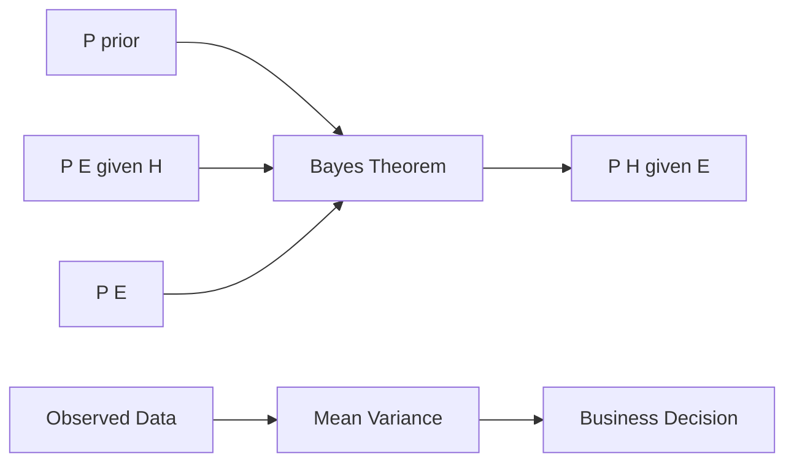

---

## Step-by-Step Explanation

### Step 1: Count Frequencies

Use `Counter` or a loop to count category occurrences.

### Step 2: Compute Empirical Probability

`P(event) ≈ count(event) / total`.

### Step 3: Apply Bayes' Theorem

Plug in prior, likelihood, and evidence. Evidence must be positive.

### Step 4: Summarize Numeric Data

Compute mean, then variance as average of squared deviations.

### Step 5: Model Repeated Trials

Use binomial PMF when trials are independent with fixed success probability.

---

## Python Implementation

See [`code/part-05/probability_basics.py`](code/part-05/probability_basics.py).

```bash
python code/part-05/probability_basics.py
```

Key functions: `empirical_probability`, `bayes_posterior`, `mean_and_variance`, `binomial_pmf`, `summarize_distribution`.

---

## Code Walkthrough

| Function | Purpose |
|----------|---------|
| `empirical_probability` | Frequency-based probability estimate |
| `bayes_posterior` | Updates prior with likelihood and normalizes by evidence |
| `mean_and_variance` | Population mean and variance |
| `binomial_pmf` | Exact binomial probability using `math.comb` |
| `summarize_distribution` | One-call descriptive summary |

Validation: reject empty samples, zero evidence, and invalid probability ranges.

---

## Expected Output

```text
Empirical P(heads) from ['heads', 'tails', 'heads', 'heads', 'tails']: 0.600

Bayes posterior P(spam|keyword): 0.5333

Sample summary:
  mean: 5.0000
  variance: 4.0000
  std_dev: 2.0000
  min: 2.0000
  max: 9.0000
  count: 8.0000

Binomial(10, 0.5) at k=3: 0.117188
```

---

## Output Explanation

- **0.600 heads** — 3 of 5 flips (small sample → high uncertainty).
- **Posterior ~0.53** — evidence increased spam belief from 10% prior.
- **Variance 4.0** — spread around mean 5 for the toy dataset.
- **Binomial PMF** — probability of exactly 3 heads in 10 fair flips.

---

## Time Complexity

| Operation | Complexity |
|-----------|------------|
| Empirical probability | O(n) over n outcomes |
| Mean/variance | O(n) |
| Binomial PMF | O(1) with `math.comb` for moderate n |

---

## Space Complexity

All functions use O(1) extra space beyond input storage (excluding output dict).

---

## Memory Usage

Summarizing millions of values in Python lists is memory-heavy. For production, use streaming algorithms (Welford's online variance) or NumPy arrays.

---

## Performance Considerations

1. Use NumPy for large numeric arrays.
2. For binomial with huge `n`, use normal approximation or log-space computations.
3. Cache expensive likelihood computations in Bayesian pipelines.
4. Report confidence intervals, not just point estimates.

---

## Common Mistakes

| Mistake | Fix |
|---------|-----|
| Treating small-sample frequency as truth | Report sample size |
| Forgetting P(E) in Bayes | Compute total evidence |
| Using sample variance formula with n-1 vs n | Document which you use |
| Assuming independence without justification | State assumptions explicitly |

---

## Debugging Tips

1. Check probabilities sum to ~1 over exhaustive events.
2. Print prior, likelihood, evidence, posterior in Bayes pipelines.
3. Compare empirical vs theoretical with large simulations.
4. Run `pytest tests/part-05/test_chapter_02.py -v`.

---

## Unit Tests

[`tests/part-05/test_chapter_02.py`](../tests/part-05/test_chapter_02.py)

```bash
pytest tests/part-05/test_chapter_02.py -v
```

---

## Benchmarking

```python
import timeit
from probability_basics import summarize_distribution

data = [float(i % 100) for i in range(1_000_000)]
elapsed = timeit.timeit(lambda: summarize_distribution(data), number=10)
print(f"10 summaries of 1M points: {elapsed:.3f}s")
```

Prefer NumPy for this scale in production.

---

## Interview Questions

### Beginner (5)

1. What is probability between 0 and 1?
2. How do you compute empirical probability?
3. What is the mean of [2, 4, 6]?
4. What does standard deviation measure?
5. In 100 fair coin flips, expected number of heads?

### Intermediate (5)

1. State Bayes' theorem in words and symbols.
2. Difference between population and sample variance?
3. When is the binomial distribution appropriate?
4. What is conditional probability P(A|B)?
5. Why can two algorithms with same mean runtime differ in variance?

### Advanced (5)

1. Explain the law of large numbers.
2. Derive Bayes' theorem from the definition of conditional probability.
3. When does the binomial approximate a normal distribution?
4. Compare Bayesian vs frequentist interpretations.
5. How does cross-validation reduce overfitting statistically?

### System Design (3)

1. Design an A/B testing platform with statistical significance checks.
2. How would you monitor anomaly rates with streaming quantiles?
3. Design a spam classifier feedback loop updating priors safely.

### Coding Challenge (1)

Implement Welford's online algorithm for mean and variance in one pass; add pytest tests.

---

## Production Notes

- Log sample sizes with all reported metrics.
- Use calibrated probabilities for user-facing risk scores.
- Guard against division by zero in evidence terms.
- Store random seeds for reproducible stochastic algorithms.

---

## Architecture Integration

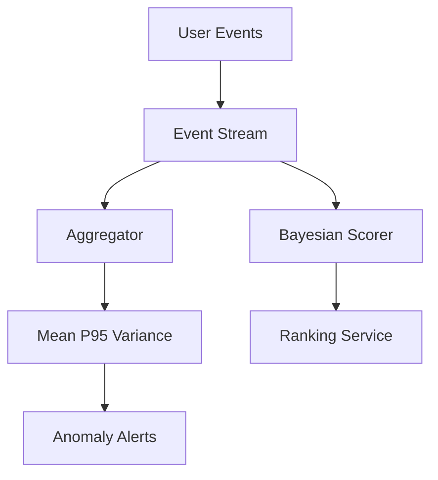

---

## Best Practices

1. Always state assumptions (independence, stationarity).
2. Report uncertainty (confidence intervals, credible intervals).
3. Validate inputs are in [0, 1] for probabilities.
4. Use `math.comb` instead of manual factorial ratios.
5. Separate training statistics from live production statistics.

---

## Engineering Notes

### Beginner Note

Probability answers "how likely?" not "will it happen?" A 90% success rate still fails 1 time in 10 on average.

### Intermediate Note

For A/B tests, you need both effect size and sample size. A 0.1% lift may be real but undetectable with 1,000 users per arm.

### Senior Engineer Note

Production systems track **distributions**, not just means. P99 latency drives SLOs. Bayesian online updates power fraud detection but require careful prior selection and concept-drift monitoring.

---

## Summary

Probability models uncertainty; statistics summarizes data. You implemented empirical frequencies, Bayes' theorem, descriptive stats, and binomial probabilities. These tools explain noisy benchmarks and underpin ML and randomized algorithms throughout the book.

---

## Exercises

1. Simulate 10,000 coin flips; compare empirical P(heads) to 0.5.
2. Extend `summarize_distribution` with median and percentiles.
3. Compute P(spam|two keywords) assuming independence — discuss the flaw.
4. Plot binomial PMFs for n=20 and varying p using matplotlib.
5. Estimate variance of algorithm runtime over 50 runs.

---

## Further Reading

- [Khan Academy — Probability & Statistics](https://www.khanacademy.org/math/statistics-probability)
- [scipy.stats documentation](https://docs.scipy.org/doc/scipy/reference/stats.html)
- [Think Stats by Allen Downey](https://greenteapress.com/thinkstats/)

---

**Previous:** [Chapter 1: Functions, Sets, and Logic](./chapter-01-functions-sets-logic.md) · **Next:** [Chapter 3: Vectors, Matrices, and Linear Algebra](./chapter-03-linear-algebra.md)


---


<!-- SOURCE: part-00-mathematical-foundations/chapter-03-linear-algebra.md -->


---


# Chapter 3: Vectors, Matrices, and Linear Algebra Intuition

**Part 0.5 — Mathematical Foundations**

---

## Learning Objectives

By the end of this chapter, you will be able to:

1. Represent data as vectors and perform dot products.
2. Compute vector norms and cosine similarity.
3. Multiply matrices by vectors and interpret the result geometrically.
4. Transpose matrices and reason about dimensions.
5. Connect linear algebra to embeddings, recommendations, and neural networks.
6. Implement core operations in pure Python before using NumPy.
7. Validate dimension compatibility in matrix operations.
8. Explain why linear algebra is the language of machine learning.

---

## Introduction

A **vector** is an ordered list of numbers — a data point, a word embedding, a pixel row. A **matrix** is a table of numbers that often represents a linear transformation: rotation, scaling, or a layer in a neural network. **Linear algebra** studies how vectors and matrices interact.

You do not need to master eigenvalues today. You need fluency with dot products, matrix-vector multiplication, and similarity — the operations behind search ranking, collaborative filtering, and deep learning.

---

## Real-World Motivation

- **Search engines** rank documents by cosine similarity to a query vector.
- **Recommendation systems** multiply user-feature matrices by item-feature matrices.
- **Computer graphics** apply transformation matrices to 3D coordinates.
- **Neural networks** are chains of matrix multiplications plus nonlinearities.
- **PCA and SVD** compress high-dimensional data for visualization and ML.

---

## Daily-Life Analogy

A restaurant review as a vector: `[taste, service, price]` with scores 1–5. Two reviewers are "similar" if their review vectors point in similar directions — cosine similarity captures that better than raw distance when magnitude differs.

A matrix is like a factory assembly line: input ingredients (vector) enter; each output row is a weighted mix of inputs.

---

## Mathematical Intuition

**Dot product** `a · b = Σ aᵢbᵢ` measures alignment. Positive → same general direction; zero → orthogonal.

**Norm** `||v|| = √(v · v)` is length.

**Cosine similarity** = `(a · b) / (||a|| ||b||)` ∈ [-1, 1] — direction similarity ignoring scale.

**Matrix-vector multiply**: if `A` is `m×n` and `x` is `n×1`, result `Ax` is `m×1`. Row `i` of `A` dots with `x`.

---

## Core Concepts

| Concept | Definition |
|---------|------------|
| **Vector** | Ordered n-tuple of scalars |
| **Dot product** | Sum of element-wise products |
| **L2 norm** | Euclidean length |
| **Cosine similarity** | Normalized dot product |
| **Matrix** | Rectangular array; rows × columns |
| **Transpose** | Swap rows and columns |
| **Dimension mismatch** | Incompatible sizes for multiplication |

---

## Visual Diagram (Mermaid)

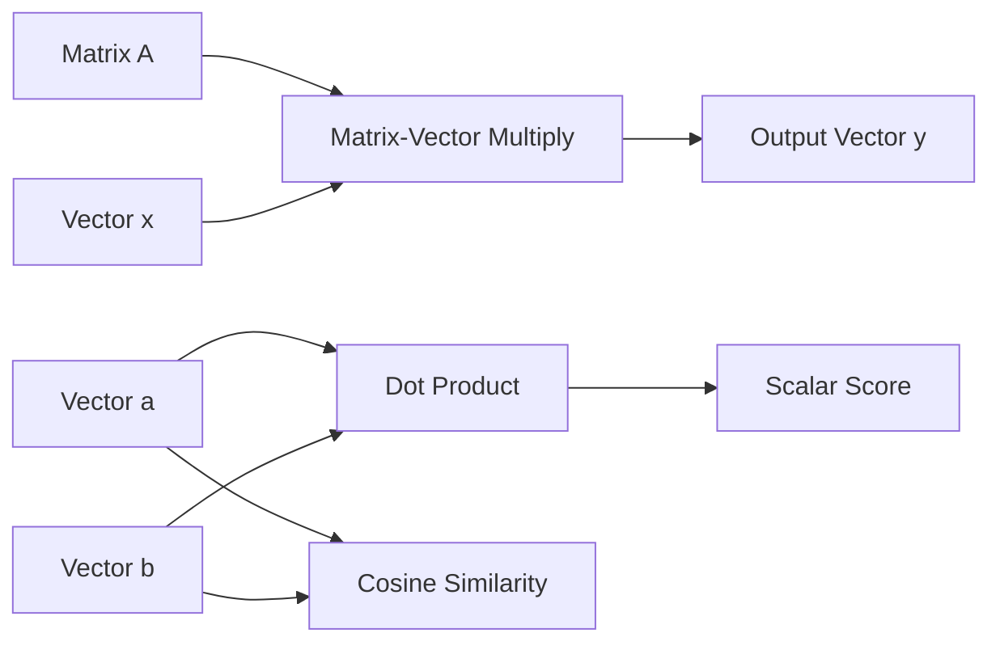

---

## Step-by-Step Explanation

### Step 1: Represent Vectors as Lists

Use `list[float]` with type hints for clarity.

### Step 2: Compute Dot Product

Zip corresponding elements, multiply, sum. Fail fast on length mismatch.

### Step 3: Compute Norm and Cosine Similarity

Divide dot product by product of norms; handle zero vectors.

### Step 4: Matrix-Vector Multiply

Each output element is dot product of a matrix row with the vector.

### Step 5: Transpose

New row `j` contains old column `j` elements.

---

## Python Implementation

See [`code/part-05/linear_algebra_basics.py`](code/part-05/linear_algebra_basics.py).

```bash
python code/part-05/linear_algebra_basics.py
```

---

## Code Walkthrough

| Function | Role |
|----------|------|
| `dot_product` | Core inner product with validation |
| `vector_norm` | L2 length via `sqrt(sum of squares)` |
| `matrix_vector_multiply` | Applies linear transformation |
| `cosine_similarity` | Normalized similarity for embeddings |
| `transpose` | Swaps rows/columns |

Later chapters replace these with NumPy for speed: `np.dot`, `@`, `np.linalg.norm`.

---

## Expected Output

```text
u = [1.0, 2.0, 3.0]
v = [4.0, 5.0, 6.0]
dot(u, v) = 32.0
||u|| = 3.7417
cosine_similarity(u, v) = 0.974632

Matrix:
  [1.0, 2.0]
  [3.0, 4.0]
Times vector [1.0, 0.0] = [1.0, 3.0]

Transpose:
  [1.0, 3.0]
  [2.0, 4.0]
```

---

## Output Explanation

- **Dot 32** = 1×4 + 2×5 + 3×6.
- **High cosine** (~0.97) — vectors nearly parallel.
- **First column extraction** — multiplying by `[1,0]` picks column 1 of the matrix.
- **Transpose** swaps (1,2) with (2,1).

---

## Time Complexity

| Operation | Complexity |
|-----------|------------|
| Dot product of length n | O(n) |
| Matrix-vector m×n | O(mn) |
| Transpose m×n | O(mn) |

---

## Space Complexity

O(1) extra for dot/norm; O(mn) for transpose output.

---

## Memory Usage

A dense `10000×10000` float matrix uses ~800 MB. Sparse matrices (scipy.sparse) are essential for large graphs and text corpora.

---

## Performance Considerations

1. Use NumPy/BLAS for large linear algebra — 100–1000× faster than pure Python loops.
2. Prefer float32 on GPUs when precision allows.
3. Batch matrix multiplies (GEMM) for neural network efficiency.
4. Normalize embeddings once, store unit vectors for fast cosine via dot product.

---

## Common Mistakes

| Mistake | Fix |
|---------|-----|
| Dimension mismatch in multiply | Check `cols(A) == len(x)` |
| Confusing dot product with element-wise product | Dot sums; `*` in NumPy broadcasts |
| Zero vector in cosine similarity | Return 0 or raise — document choice |
| Ragged matrices | Validate equal row lengths |

---

## Debugging Tips

1. Print shapes: `(m, n)` for matrices, `n` for vectors.
2. Test identity matrix multiplication preserves vector.
3. Compare pure Python vs NumPy on small inputs.
4. `pytest tests/part-05/test_chapter_03.py -v`

---

## Unit Tests

[`tests/part-05/test_chapter_03.py`](../tests/part-05/test_chapter_03.py)

---

## Benchmarking

```python
import timeit
import numpy as np

a = np.random.randn(1000, 1000)
x = np.random.randn(1000)
elapsed = timeit.timeit(lambda: a @ x, number=100)
print(f"100 mat-vec 1000x1000: {elapsed:.3f}s")
```

---

## Interview Questions

### Beginner (5)

1. What is a vector?
2. How do you compute a dot product?
3. What does matrix transpose do?
4. What is cosine similarity used for?
5. Can you multiply a 3×2 matrix by a length-3 vector?

### Intermediate (5)

1. Geometric meaning of dot product = 0?
2. Why is cosine similarity preferred for text embeddings?
3. Complexity of multiplying m×n by n×p matrices?
4. What is an identity matrix?
5. Difference between rank and dimension?

### Advanced (5)

1. Explain eigenvalues and eigenvectors intuitively.
2. What does SVD decompose?
3. Why do neural networks need non-linear activations if composition of linear maps is linear?
4. Condition number and numerical stability.
5. Compare dense vs sparse matrix storage.

### System Design (3)

1. Design a vector similarity search service for 100M embeddings.
2. How would you shard a large matrix multiplication across GPUs?
3. Design feature storage for real-time recommendation scoring.

### Coding Challenge (1)

Implement 2×2 matrix multiplication and verify `(AB)x = A(Bx)` numerically.

---

## Production Notes

- Store embeddings normalized to unit length for ANN indexes (FAISS, ScaNN).
- Use mixed precision (FP16/BF16) on accelerators with loss scaling.
- Monitor numerical overflow in large dot products.

---

## Architecture Integration

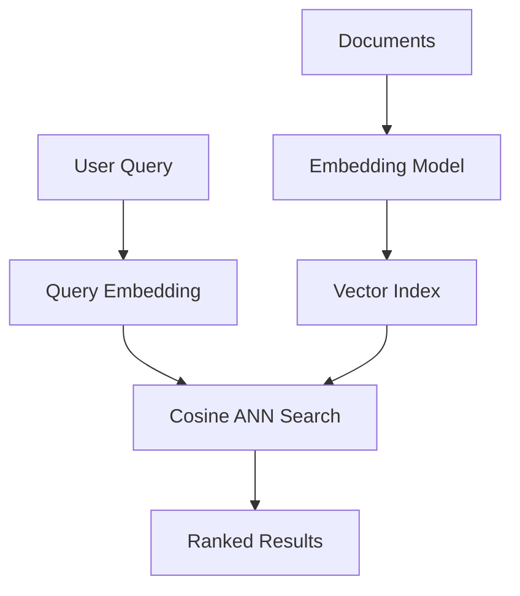

---

## Best Practices

1. Validate dimensions at API boundaries.
2. Use NumPy for n > 100; pure Python for teaching.
3. Document whether vectors are row or column conventions.
4. Cache transposes when reused in hot loops.
5. Unit test with identity and zero vectors.

---

## Engineering Notes

### Beginner Note

Think of a vector as a point or arrow in space. The dot product tells you how much two arrows align.

### Intermediate Note

In NumPy, `a @ b` for 1D arrays is dot product; for 2D it's matrix multiply. Know your shapes.

### Senior Engineer Note

Production similarity search rarely brute-forces billions of dot products. Approximate nearest neighbor (ANN) indexes trade recall for latency. Linear algebra is still the math underneath — but systems engineering picks the data structure.

---

## Summary

Vectors represent data; matrices transform data. Dot products and cosine similarity power search and recommendations. Matrix-vector multiplication is the core operation of neural networks. Pure Python builds intuition; NumPy delivers scale.

---

## Exercises

1. Implement matrix-matrix multiplication and test associativity.
2. Find cosine similarity between TF-IDF vectors of two short documents.
3. Apply a 2D rotation matrix to point (1, 0).
4. Compare `np.dot` vs loop timing for n=5000.
5. Explain why ||a+b|| ≤ ||a|| + ||b|| (triangle inequality).

---

## Further Reading

- [3Blue1Brown — Essence of Linear Algebra](https://www.3blue1brown.com/topics/linear-algebra)
- [NumPy linear algebra](https://numpy.org/doc/stable/reference/routines.linalg.html)
- [Strang, Introduction to Linear Algebra](https://math.mit.edu/~gs/linearalgebra/)

---

**Previous:** [Chapter 2: Probability and Statistics](./chapter-02-probability-statistics.md) · **Next:** [Chapter 4: Calculus and Optimization](./chapter-04-calculus-optimization.md)


---


<!-- SOURCE: part-00-mathematical-foundations/chapter-04-calculus-optimization.md -->


---


# Chapter 4: Calculus and Optimization Intuition

**Part 0.5 — Mathematical Foundations**

---

## Learning Objectives

By the end of this chapter, you will be able to:

1. Interpret derivatives as rates of change and slopes.
2. Approximate derivatives numerically with finite differences.
3. Apply gradient descent to minimize simple functions.
4. Use Newton's method to find roots.
5. Explain the role of learning rate in optimization.
6. Connect calculus to loss minimization in machine learning.
7. Implement and test 1D optimization routines in Python.
8. Recognize convergence and divergence in iterative algorithms.

---

## Introduction

**Calculus** studies change. **Optimization** finds inputs that minimize (or maximize) an objective. Together they power gradient descent, backpropagation, and hyperparameter tuning. You do not need to integrate by hand for most engineering work — but you must understand *what a gradient means* and *why learning rate matters*.

This chapter implements numerical derivatives, gradient descent, and Newton's method in one dimension. The ideas extend directly to multivariate loss surfaces in deep learning.

---

## Real-World Motivation

- **Neural networks** minimize loss via stochastic gradient descent.
- **Logistic regression** optimizes cross-entropy with gradient methods.
- **Engineering** tunes parameters (PID controllers, queue thresholds) by minimizing cost.
- **Operations research** solves supply-chain cost minimization.
- **Root finding** appears in IRR calculations and physics simulations.

---

## Daily-Life Analogy

Driving uphill: the **slope** (derivative) tells you how steep the road is. To reach the valley (minimum), step **downhill** — opposite to the gradient. Step too large and you overshoot; too small and you crawl.

Newton's method is like guessing where a parabola crosses zero and refining — fast when close, fragile when far.

---

## Mathematical Intuition

**Derivative** `f'(x)` ≈ `(f(x+h) - f(x-h)) / 2h` for small `h`.

**Gradient descent**: `x ← x - α · f'(x)` where `α` is learning rate.

**Newton's method**: `x ← x - f(x)/f'(x)` for root finding.

**Convex bowl** `(x-2)²` has unique minimum at x=2; gradient descent converges with appropriate α.

---

## Core Concepts

| Concept | Meaning |
|---------|---------|
| **Derivative** | Instantaneous rate of change |
| **Finite difference** | Numerical derivative approximation |
| **Gradient** | Multivariate generalization (here: 1D derivative) |
| **Learning rate** | Step size α in descent |
| **Convergence** | Iterates approach solution |
| **Newton's method** | Second-order root-finding using f and f' |

---

## Visual Diagram (Mermaid)

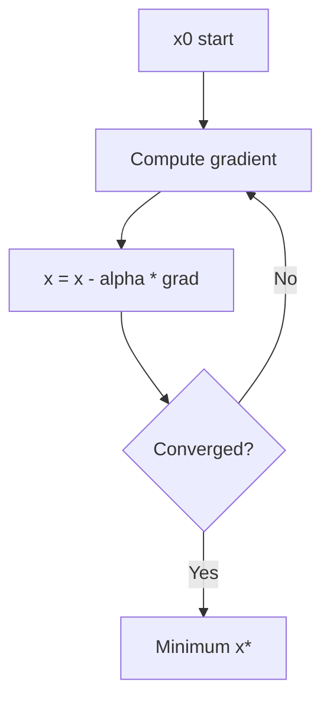

---

## Step-by-Step Explanation

### Step 1: Numerical Derivative

Evaluate `f` at `x+h` and `x-h`; central difference reduces error vs forward difference.

### Step 2: Define Objective and Gradient

For `(x-2)²`, gradient is `2(x-2)`.

### Step 3: Gradient Descent Loop

Repeat update for fixed iterations or until change < tolerance.

### Step 4: Newton's Method for Roots

Requires `f` and `f'`; stops when `|f(x)| < tol`.

### Step 5: Compare to Exact Answer

`sqrt(2)` from root of `x²-2`; minimum of `(x-2)²` at 2.

---

## Python Implementation

See [`code/part-05/calculus_optimization.py`](code/part-05/calculus_optimization.py).

```bash
python code/part-05/calculus_optimization.py
```

---

## Code Walkthrough

| Function | Role |
|----------|------|
| `numerical_derivative` | Central finite difference |
| `gradient_descent` | Iterative minimization using supplied gradient |
| `newton_method` | Root finding with derivative |

Design: pass callables `f`, `grad_f`, `df` — same pattern as autograd frameworks.

---

## Expected Output

```text
d/dx(x^2) at x=3: approximate = 6.000000, exact = 6

Gradient descent minimum near x=2.000000
  first 5 iterates: [10.0, 7.6, 5.72, 4.304, 3.2128]
  last 3 iterates:  [2.0001, 2.0001, 2.0]

Newton root of x^2 - 2 = 0: 1.4142135624
sqrt(2) reference:            1.4142135624
```

---

## Output Explanation

- **Derivative ~6** at x=3 for `x²` — matches `2x`.
- **Descent converges to 2** — minimum of `(x-2)²`.
- **Newton finds √2** — classic demo of quadratic convergence near root.

---

## Time Complexity

| Algorithm | Per-iteration | Total |
|-----------|---------------|-------|
| Gradient descent | O(1) per step for 1D | O(steps) |
| Newton's method | O(1) evals of f, f' | O(iterations) typically fewer than GD for roots |
| Numerical derivative | O(1) function evals | Constant per point |

---

## Space Complexity

O(steps) if storing history; O(1) if only tracking current x.

---

## Memory Usage

History lists for debugging are fine in notebooks; drop them in production optimizers.

---

## Performance Considerations

1. Analytical gradients beat numerical when available (faster, more accurate).
2. Line search and adaptive learning rates (Adam, RMSprop) help in ML.
3. Newton's method needs invertible Hessian in multivariate case — expensive.
4. Choose `h` carefully for finite differences (~√ε for float64).

---

## Common Mistakes

| Mistake | Fix |
|---------|-----|
| Learning rate too large | Divergence — reduce α |
| Learning rate too small | Slow convergence — increase or use schedule |
| Zero derivative in Newton | Abort or perturb |
| Using forward diff only | Prefer central difference for accuracy |

---

## Debugging Tips

1. Plot objective vs iteration count.
2. Log gradient magnitude each step.
3. Compare numerical vs analytical gradient (gradient check).
4. `pytest tests/part-05/test_chapter_04.py -v`

---

## Unit Tests

[`tests/part-05/test_chapter_04.py`](../tests/part-05/test_chapter_04.py)

---

## Benchmarking

```python
import timeit
from calculus_optimization import gradient_descent

grad = lambda x: 2.0 * (x - 2.0)
elapsed = timeit.timeit(
    lambda: gradient_descent(grad, 10.0, 0.3, 1000), number=1000
)
print(f"1000 x 1000-step descents: {elapsed:.3f}s")
```

---

## Interview Questions

### Beginner (5)

1. What does a derivative represent geometrically?
2. What is gradient descent trying to do?
3. What happens if learning rate is too big?
4. What is a local minimum?
5. Why do we minimize loss in ML?

### Intermediate (5)

1. Difference between gradient descent and Newton's method?
2. What is a convex function?
3. Why use central finite differences?
4. What is learning rate scheduling?
5. Explain chain rule role in backpropagation.

### Advanced (5)

1. Compare SGD, momentum, Adam optimizers.
2. What is the Hessian and when is Newton-Raphson preferred?
3. Explain vanishing/exploding gradients.
4. Lipschitz continuity and convergence proofs.
5. Constrained optimization and Lagrange multipliers overview.

### System Design (3)

1. Design a hyperparameter tuning service with early stopping.
2. How would you distribute large-scale gradient descent training?
3. Design safe rollout of online learning with loss monitoring.

### Coding Challenge (1)

Implement 2D gradient descent on `f(x,y)=x²+y²` with numerical partial derivatives.

---

## Production Notes

- Log loss and gradient norms per training step.
- Use gradient clipping for RNNs and unstable architectures.
- Checkpoint optimizer state (Adam moments) with model weights.
- Separate training (batch) from inference (no gradient) code paths.

---

## Architecture Integration


Calculus powers the backward pass; optimization updates parameters.

---

## Best Practices

1. Prefer analytical gradients from autograd (PyTorch, JAX).
2. Start with conservative learning rates; tune on validation loss.
3. Normalize features so loss landscapes are well-conditioned.
4. Set random seeds and log hyperparameters for reproducibility.
5. Test optimizers on known convex functions before production ML.

---

## Engineering Notes

### Beginner Note

Gradient descent is "walk downhill." The gradient points uphill; we step opposite.

### Intermediate Note

In 1D, derivative sign tells direction. In n-D, gradient is a vector pointing steepest uphill.

### Senior Engineer Note

Production training uses mixed precision, distributed data parallel, and learning rate warmup. The 1D routines here are pedagogical — real systems call `torch.optim` with careful monitoring of loss spikes indicating bad batches or too-large LR.

---

## Summary

Derivatives measure change; gradient descent minimizes objectives; Newton's method finds roots. You implemented all three numerically. These patterns underpin every gradient-based learner in the rest of this book.

---

## Exercises

1. Minimize `f(x)=(x-5)²` from x=0 with varying learning rates — plot convergence.
2. Implement bisection method and compare to Newton for `x²-2`.
3. Gradient-check `numerical_derivative` against known functions.
4. Add early stopping when `|grad| < ε` to `gradient_descent`.
5. Explain why GD on non-convex loss can get stuck in local minima.

---

## Further Reading

- [Khan Academy — Derivatives & Optimization](https://www.khanacademy.org/math/calculus-1)
- [PyTorch Optimization tutorial](https://pytorch.org/tutorials/beginner/basics/optimization_tutorial.html)
- [Boyd & Vandenberghe, Convex Optimization](https://web.stanford.edu/~boyd/cvxbook/)

---

**Previous:** [Chapter 3: Linear Algebra](./chapter-03-linear-algebra.md) · **Next:** [Chapter 5: What Is an Algorithm?](part-01-algorithm-fundamentals/chapter-05-what-is-an-algorithm.md)


---


<!-- SOURCE: part-01-algorithm-fundamentals/chapter-05-what-is-an-algorithm.md -->


---


# Chapter 5: What Is an Algorithm?

**Part 1 — Algorithm Fundamentals**

---

## Learning Objectives

By the end of this chapter, you will be able to:

1. Define an algorithm as a finite, unambiguous sequence of steps.
2. Identify inputs, outputs, and termination conditions.
3. Distinguish algorithms from programs and heuristics.
4. Explain correctness, finiteness, and definiteness (Euclid's criteria).
5. Implement and verify simple algorithms in Python.
6. Use the Euclidean GCD as a model of efficient iterative algorithms.
7. Test algorithms systematically with input-output cases.
8. Relate algorithmic thinking to real software engineering tasks.

---

## Introduction

An **algorithm** is a recipe. It takes **input**, follows **definite steps**, and produces **output**, then **stops**. Every app feature — sorting a feed, routing a package, recommending a movie — is an algorithm plus data structures plus engineering.

This chapter formalizes the idea without heavy math. You will implement linear search and the Euclidean GCD algorithm, and learn to verify behavior with test cases.

---

## Real-World Motivation

- **GPS navigation** runs shortest-path algorithms on road graphs.
- **Payment systems** use fraud-detection algorithms on transaction streams.
- **Compilers** apply parsing and optimization algorithms to source code.
- **Databases** execute query planning algorithms to choose indexes.

Calling something "AI" does not remove the need for clear algorithmic steps — it adds statistical and optimization layers on top.

---

## Daily-Life Analogy

A cake recipe is an algorithm:

- **Input**: flour, eggs, sugar.
- **Steps**: mix, bake at 180°C for 30 minutes.
- **Output**: cake.
- **Termination**: timer rings.

If a step says "add some sugar" without amount, the recipe is not an algorithm — it lacks **definiteness**.

---

## Mathematical Intuition

Historically, an algorithm must be:

1. **Finite** — terminates after bounded steps.
2. **Definite** — each step is precisely specified.
3. **Effective** — each step is doable in practice.
4. **Input/Output** — consumes and produces well-defined data.

**Correctness**: for every valid input, output satisfies the specification.

---

## Core Concepts

| Concept | Definition |
|---------|------------|
| **Algorithm** | Finite sequence of instructions solving a class of problems |
| **Program** | Algorithm implemented in a language on a machine |
| **Heuristic** | Rule of thumb without guaranteed optimality |
| **Specification** | Precise statement of required input-output behavior |
| **Verification** | Checking outputs against expected results |
| **Invariant** | Property true throughout loop execution (preview) |

---

## Visual Diagram (Mermaid)

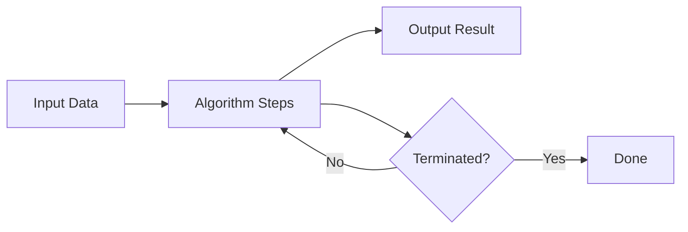

---

## Step-by-Step Explanation

### Step 1: Specify the Problem

Example: "Given integers a, b ≥ 0, return gcd(a, b)."

### Step 2: Design Steps

Euclid: replace (a, b) with (b, a mod b) until b = 0.

### Step 3: Implement in Python

Translate each step to code with clear variable names.

### Step 4: Verify on Test Cases

Compare outputs to known answers.

### Step 5: Analyze Resources

Count operations — preview of Big-O in Chapter 7.

---

## Python Implementation

See [`code/part-01/what_is_algorithm.py`](code/part-01/what_is_algorithm.py).

```bash
python code/part-01/what_is_algorithm.py
```

---

## Code Walkthrough

| Function | Role |
|----------|------|
| `linear_search` | Simple scan — O(n) baseline algorithm |
| `euclidean_gcd` | Classic iterative algorithm with loop invariant |
| `verify_algorithm` | Generic test harness for deterministic functions |

The GCD loop invariant: `gcd(a, b) = gcd(original_a, original_b)` at each iteration.

---

## Expected Output

```text
linear_search([10, 20, 30, 40, 50], 30) -> index 2

GCD examples:
  gcd(48, 18) = 6
  gcd(101, 10) = 1
  gcd(0, 7) = 7

Factorial verification failures: none
```

---

## Output Explanation

- **Index 2** — 30 is third element (0-based index 2).
- **gcd(48,18)=6** — largest integer dividing both.
- **gcd(0,7)=7** — edge case: gcd(0, b) = b.
- **No failures** — factorial matches expected mapping.

---

## Time Complexity

| Algorithm | Complexity |
|-----------|------------|
| `linear_search` on n items | O(n) |
| `euclidean_gcd` | O(log min(a,b)) — logarithmic in value |

---

## Space Complexity

Both algorithms use O(1) extra space beyond input.

---

## Memory Usage

Negligible for scalar integers. Algorithm memory concerns arise with large graphs and matrices in later chapters.

---

## Performance Considerations

1. Choose the right algorithm for problem size — linear search is fine for tiny lists.
2. Document preconditions (non-negative GCD inputs).
3. Prefer library implementations (`math.gcd`) in production after learning.
4. Profile before optimizing — correctness first.

---

## Common Mistakes

| Mistake | Fix |
|---------|-----|
| Infinite loops | Ensure progress measure decreases (b → a mod b) |
| Ambiguous specs | Write examples before coding |
| Skipping edge cases | Test 0, 1, empty, duplicates |
| Confusing algorithm with implementation detail | Spec is language-agnostic |

---

## Debugging Tips

1. Trace small inputs on paper.
2. Add assertions for invariants inside loops.
3. Use `verify_algorithm` with edge-case dicts.
4. `pytest tests/part-01/test_chapter_05.py -v`

---

## Unit Tests

[`tests/part-01/test_chapter_05.py`](../tests/part-01/test_chapter_05.py)

---

## Benchmarking

```python
import timeit
from what_is_algorithm import euclidean_gcd

elapsed = timeit.timeit(lambda: euclidean_gcd(10**9, 10**9 - 1), number=10000)
print(f"10k GCD on large ints: {elapsed:.4f}s")
```

Euclid remains fast even for large integers.

---

## Interview Questions

### Beginner (5)

1. What is an algorithm?
2. Difference between algorithm and program?
3. What does it mean for an algorithm to terminate?
4. What is linear search?
5. What is GCD?

### Intermediate (5)

1. State loop invariant for Euclidean GCD.
2. How do you verify algorithm correctness?
3. Algorithm vs heuristic — example of each?
4. What is pseudo-code and why use it?
5. When is brute force acceptable?

### Advanced (5)

1. Church-Turing thesis in one paragraph.
2. Halting problem — why undecidable?
3. Randomized vs deterministic algorithms.
4. Amortized analysis preview.
5. Formal verification vs testing trade-offs.

### System Design (3)

1. Design a job scheduler with fair termination guarantees.
2. How would you version algorithm upgrades in production?
3. Design A/B routing between two ranking algorithms.

### Coding Challenge (1)

Implement extended Euclidean algorithm returning (gcd, x, y) with ax + by = gcd.

---

## Production Notes

- Version and document algorithm changes in changelogs.
- Feature flags for rolling out new ranking logic.
- Shadow traffic to compare old vs new algorithm outputs.
- Log algorithm version with each decision for auditability.

---

## Architecture Integration

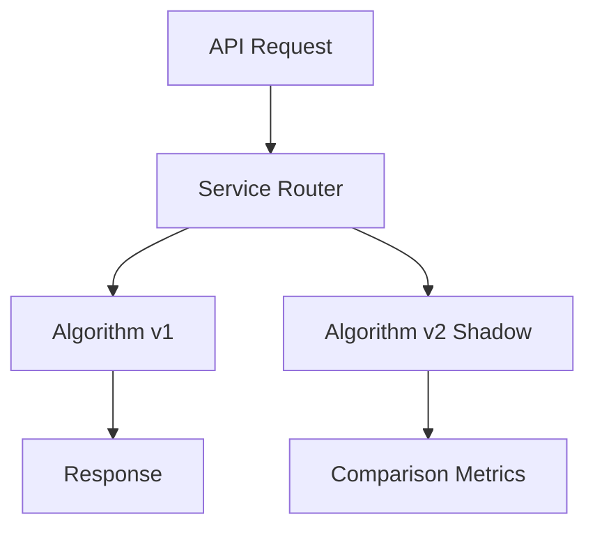

---

## Best Practices

1. Write the specification before the implementation.
2. Name functions after what they compute, not how.
3. Validate inputs at public API boundaries.
4. Keep algorithms pure (no hidden global state) when possible.
5. Pair every algorithm with representative tests.

---

## Engineering Notes

### Beginner Note

An algorithm is the idea; Python code is one expression of that idea. You could implement the same GCD in Java, Rust, or on paper.

### Intermediate Note

`math.gcd` in the standard library uses Euclid's algorithm. Read the docs, then read the source — learning from battle-tested code is a senior habit.

### Senior Engineer Note

Production systems combine algorithms with SLAs, caching, and fallbacks. The GCD function is correct, but a payment router also needs timeouts, idempotency keys, and circuit breakers. Algorithmic correctness is necessary, not sufficient.

---

## Summary

An algorithm is a finite, definite procedure from input to output. Linear search and Euclidean GCD illustrate scanning and iterative reduction. Verification with test cases is how engineers earn trust in code. Part 1 continues with data structures, complexity, and design techniques.

---

## Exercises

1. Write pseudo-code for finding the maximum of a list.
2. Implement binary search preview — compare steps to linear search.
3. Prove gcd(a,b) = gcd(b, a mod b) for b > 0.
4. List three algorithms you use daily without thinking.
5. Add docstring examples (doctest style) to `euclidean_gcd`.

---

## Further Reading

- [CLRS Introduction — Algorithms](https://mitpress.mit.edu/9780262046305/introduction-to-algorithms/)
- [Python `math.gcd`](https://docs.python.org/3/library/math.html#math.gcd)
- [Knuth, The Art of Computer Programming, Vol. 1](https://www-cs-faculty.stanford.edu/~knuth/taocp.html)

---

**Previous:** [Chapter 4: Calculus and Optimization](part-00-mathematical-foundations/chapter-04-calculus-optimization.md) · **Next:** [Chapter 6: Essential Data Structures](./chapter-06-essential-data-structures.md)


---


<!-- SOURCE: part-01-algorithm-fundamentals/chapter-06-essential-data-structures.md -->


---


# Chapter 6: Essential Data Structures

**Part 1 — Algorithm Fundamentals**

---

## Learning Objectives

By the end of this chapter, you will be able to:

1. Explain stacks (LIFO) and queues (FIFO) and their use cases.
2. Implement stack and queue abstractions with type hints.
3. Describe linked lists and contrast them with Python lists.
4. Choose appropriate structures for BFS, DFS, and undo operations.
5. Analyze basic time complexity of push/pop/enqueue/dequeue.
6. Build and traverse a singly linked list.
7. Recognize when Python's built-in `list` and `deque` suffice.
8. Connect data structures to upcoming graph and tree algorithms.

---

## Introduction

An **algorithm** operates on **data structures** — ways to organize data for efficient access and update. The wrong structure can turn an elegant algorithm into a slow bottleneck. The right structure makes simple code fast.

This chapter covers stacks, queues, and linked lists — foundational building blocks for parsing, scheduling, graph traversal, and memory management concepts.

---

## Real-World Motivation

- **Undo/redo** in editors uses stacks of states.
- **Print job queues** and **message brokers** use FIFO queues.
- **BFS** on graphs uses a queue; **DFS** uses a stack (explicit or call stack).
- **Linked lists** underpin many custom memory allocators and LRU caches.

---

## Daily-Life Analogy

- **Stack**: plates in a cafeteria — last placed is first taken (LIFO).
- **Queue**: line at a coffee shop — first in line is served first (FIFO).
- **Linked list**: treasure hunt — each clue points to the next location.

---

## Mathematical Intuition

Abstract data types (ADTs) separate **what** operations exist from **how** they are implemented.

| ADT | Core ops | Typical use |
|-----|----------|-------------|
| Stack | push, pop, peek | DFS, parsing, undo |
| Queue | enqueue, dequeue | BFS, scheduling |
| Linked list | insert, traverse | dynamic sequences |

Python `list` is a dynamic array (amortized O(1) append/pop end); `deque` gives O(1) both ends.

---

## Core Concepts

| Structure | Access pattern | Key operations |
|-----------|----------------|----------------|
| **Stack** | LIFO | push O(1), pop O(1) |
| **Queue** | FIFO | enqueue O(1), dequeue O(1) with deque |
| **Linked list** | Sequential | insert O(1) at known node; search O(n) |
| **Dynamic array** | Index O(1) | append amortized O(1) |

---

## Visual Diagram (Mermaid)

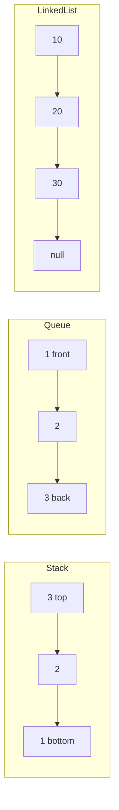

---

## Step-by-Step Explanation

### Step 1: Implement Stack

Use list `append` and `pop` for O(1) end operations.

### Step 2: Implement Queue

Use `collections.deque` — `append` right, `popleft` left.

### Step 3: Define Linked List Node

`value` plus `next` pointer.

### Step 4: Build from Python List

Iterate values, chain nodes.

### Step 5: Flatten to List

Walk pointers until `None`.

---

## Python Implementation

See [`code/part-01/data_structures.py`](code/part-01/data_structures.py).

```bash
python code/part-01/data_structures.py
```

---

## Code Walkthrough

| Component | Notes |
|-----------|-------|
| `Stack[T]` | Generic via `TypeVar`; raises on empty pop |
| `Queue[T]` | Backed by `deque` for O(1) dequeue |
| `LinkedListNode` | Singly linked; no prev pointer |
| `build_linked_list` | O(n) construction |
| `linked_list_to_list` | O(n) traversal |

Generics (`Stack[int]`) improve readability and static checking.

---

## Expected Output

```text
Stack pop order: [3, 2, 1]
Queue dequeue order: ['first', 'second', 'third']
Linked list: [10, 20, 30]
```

---

## Output Explanation

- **Stack LIFO** — 3 popped first (last pushed).
- **Queue FIFO** — 'first' dequeued first.
- **Linked list** — preserves insertion order via pointers.

---

## Time Complexity

| Operation | Stack (list) | Queue (deque) | Linked list search |
|-----------|--------------|---------------|-------------------|
| Insert at known end | O(1) | O(1) | O(1) with node ref |
| Remove | O(1) pop end | O(1) popleft | O(1) with node ref |
| Search by value | O(n) | O(n) | O(n) |

---

## Space Complexity

O(n) to store n elements in any structure.

---

## Memory Usage

Linked lists have pointer overhead per node vs contiguous arrays. Python lists are over-allocated arrays — cache-friendly, fewer objects.

---

## Performance Considerations

1. Use `deque` for queues — `list.pop(0)` is O(n).
2. Prefer Python `list` unless you need O(1) front deletion.
3. Linked lists shine when inserting in middle with node reference — rare in Python app code.
4. For millions of items, consider `array.array` or NumPy.

---

## Common Mistakes

| Mistake | Fix |
|---------|-----|
| `list.pop(0)` for queue | Use `deque.popleft()` |
| Forgetting empty checks | Raise `IndexError` with clear message |
| Losing head pointer on insert | Always keep reference to head |
| Using stack for BFS | BFS needs queue |

---

## Debugging Tips

1. Print `len(stack)` after each operation.
2. Visualize linked list as `1 -> 2 -> None`.
3. Detect cycles with slow/fast pointers (Floyd).
4. `pytest tests/part-01/test_chapter_06.py -v`

---

## Unit Tests

[`tests/part-01/test_chapter_06.py`](../tests/part-01/test_chapter_06.py)

---

## Benchmarking

```python
import timeit
from collections import deque

n = 100_000
elapsed_list = timeit.timeit(
    lambda: [i for i in range(n) if False] or [0].pop(0) if False else None,
    number=1,
)
# Compare deque popleft in a loop vs list pop(0) — deque wins dramatically at scale.
```

---

## Interview Questions

### Beginner (5)

1. LIFO vs FIFO?
2. Name two stack use cases.
3. Why is BFS associated with queues?
4. What is a node in a linked list?
5. Big-O of append to Python list?

### Intermediate (5)

1. Implement queue using two stacks.
2. Detect cycle in linked list.
3. Reverse singly linked list in-place.
4. When is linked list better than array?
5. Amortized analysis of dynamic array doubling.

### Advanced (5)

1. Implement LRU cache with hash map + doubly linked list.
2. Skip list vs balanced BST trade-offs.
3. Memory allocator design with free lists.
4. Persistent data structures overview.
5. Lock-free queue basics.

### System Design (3)

1. Design a task queue with retries and dead-letter queue.
2. Design undo/redo for collaborative document editor.
3. Choose data structure for rate limiter (sliding window).

### Coding Challenge (1)

Implement `min_stack` supporting push, pop, and get_min in O(1).

---

## Production Notes

- Redis lists implement queue patterns at scale.
- Kafka partitions provide ordered FIFO logs.
- Use bounded queues to apply backpressure.
- Monitor queue depth as a leading indicator of overload.

---

## Architecture Integration

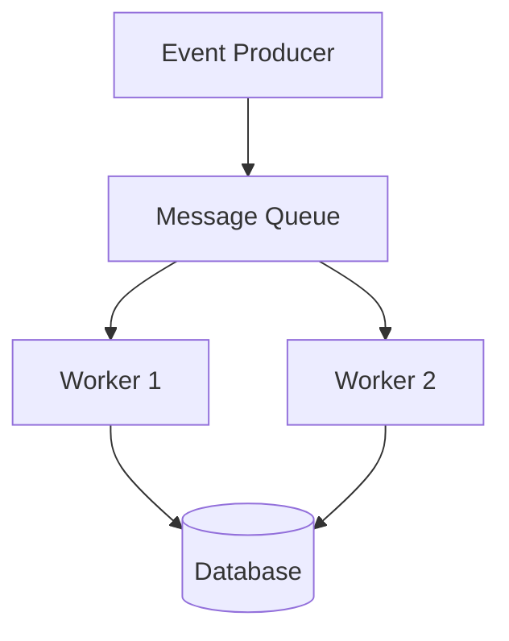

Queues decouple producers and consumers in distributed systems.

---

## Best Practices

1. Encapsulate ADTs in classes — do not expose internal lists.
2. Raise explicit errors on empty operations.
3. Use generics for reusable structures.
4. Document thread-safety (these implementations are not thread-safe).
5. Prefer standard library (`deque`, `list`) before custom C extensions.

---

## Engineering Notes

### Beginner Note

You rarely implement linked lists from scratch in Python application code. Learn them because interviewers and systems courses use them to teach pointers and memory.

### Intermediate Note

`collections.deque` is implemented as a block-linked list in CPython — you get queue efficiency without writing pointers yourself.

### Senior Engineer Note

At scale, queue choice involves durability (Kafka), ordering guarantees (partition keys), and poison-message handling. The in-memory `Queue` class here teaches semantics; production is distributed, replicated, and monitored.

---

## Summary

Stacks, queues, and linked lists organize data for specific access patterns. Python's `list` and `deque` implement most everyday needs. Choosing the right structure is as important as choosing the right algorithm.

---

## Exercises

1. Implement stack-based bracket matcher for `()`, `[]`, `{}`.
2. Reverse a linked list iteratively and recursively.
3. Implement circular queue with fixed capacity.
4. Simulate BFS on a tiny graph using `Queue`.
5. Compare memory of list vs linked list for 10,000 integers (conceptually).

---

## Further Reading

- [Python `collections.deque`](https://docs.python.org/3/library/collections.html#collections.deque)
- [CLRS — Elementary Data Structures](https://mitpress.mit.edu/9780262046305/introduction-to-algorithms/)
- [VisuAlgo — Stack & Queue](https://visualgo.net/en/list)

---

**Previous:** [Chapter 5: What Is an Algorithm?](./chapter-05-what-is-an-algorithm.md) · **Next:** [Chapter 7: Big-O Complexity](./chapter-07-big-o-complexity.md)


---


<!-- SOURCE: part-01-algorithm-fundamentals/chapter-07-big-o-complexity.md -->


---


# Chapter 7: Big-O Complexity Without Fear

**Part 1 — Algorithm Fundamentals**

---

## Learning Objectives

By the end of this chapter, you will be able to:

1. Describe algorithm efficiency using Big-O notation.
2. Distinguish best, average, and worst cases.
3. Compare O(1), O(log n), O(n), O(n log n), and O(n²) growth rates.
4. Identify complexity from code structure (loops, nesting, halving).
5. Explain space complexity alongside time complexity.
6. Benchmark code to validate theoretical analysis.
7. Avoid common pitfalls when discussing complexity in interviews.
8. Choose appropriate algorithms based on input size constraints.

---

## Introduction

**Big-O notation** describes how resource usage grows as input size `n` increases. It is not about microseconds on your laptop — it is about **scaling**. An O(n²) algorithm might beat O(n log n) for n=10 but lose catastrophically at n=1,000,000.

This chapter demystifies Big-O with side-by-side Python examples: constant lookup, linear scan, binary search, and bubble sort.

---

## Real-World Motivation

- **Search engines** cannot scan the entire web linearly per query — they use indexes (near O(1) or O(log n) lookups).
- **Social feeds** sort millions of candidates — O(n log n) sorts matter.
- **Fraud detection** on streams needs O(1) or O(log n) per event, not O(n²) pairwise comparisons.
- **SLO planning** uses complexity to estimate capacity at 10× traffic.

---

## Daily-Life Analogy

Finding a name in a phone book:

- **O(n)** — read every page from start (linear scan).
- **O(log n)** — open middle, discard half, repeat (binary search).
- **O(1)** — bookmark the exact page (hash table lookup).

As the book grows, only logarithmic and constant strategies stay practical.

---

## Mathematical Intuition

`f(n) = O(g(n))` means: for large n, `f` grows no faster than `g` up to a constant factor.

Drop constants and lower terms: `3n² + 5n + 2` → **O(n²)**.

Common classes (slowest to fastest for large n):

`O(2^n) < O(n²) < O(n log n) < O(n) < O(log n) < O(1)` — wait, 2^n is *worse* (slower) than n².

Correct ordering by growth (best to worst performance):

**O(1) < O(log n) < O(n) < O(n log n) < O(n²) < O(2^n)**

---

## Core Concepts

| Notation | Name | Example |
|----------|------|---------|
| O(1) | Constant | Dict lookup |
| O(log n) | Logarithmic | Binary search |
| O(n) | Linear | Single loop |
| O(n log n) | Linearithmic | Merge sort |
| O(n²) | Quadratic | Nested loops on n |
| Ω, Θ | Lower / tight bound | Interview precision |

---

## Visual Diagram (Mermaid)

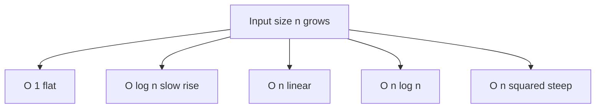

---

## Step-by-Step Explanation

### Step 1: Count Dominant Operations

Identify the innermost loop or recursion depth.

### Step 2: Single Loop → O(n)

`for i in range(n)` runs n times.

### Step 3: Halving Each Step → O(log n)

Binary search cuts problem in half.

### Step 4: Nested Loops → O(n²)

Bubble sort compares pairs.

### Step 5: Benchmark to Build Intuition

Timings confirm theory qualitatively (constants vary by hardware).

---

## Python Implementation

See [`code/part-01/big_o_examples.py`](code/part-01/big_o_examples.py).

```bash
python code/part-01/big_o_examples.py
```

---

## Code Walkthrough

| Function | Complexity | Mechanism |
|----------|------------|-----------|
| `constant_time_lookup` | O(1) avg | Hash table |
| `linear_scan` | O(n) | One pass |
| `binary_search` | O(log n) | Halving search space |
| `bubble_sort` | O(n²) | Nested loops |
| `time_function` | — | `perf_counter` wrapper |

---

## Expected Output

```text
O(1) dict lookup: 0.000001s
O(n) linear scan: 0.008234s
O(log n) binary search: 0.000003s
O(n^2) bubble sort n=500: 0.045123s
```

(Times vary by machine; relative ordering illustrates scaling.)

---

## Output Explanation

- **Dict lookup** — fastest, independent of n for average case.
- **Linear scan** — grows with list size 100,000.
- **Binary search** — tiny time despite sorted list of 100,000.
- **Bubble sort** — slowest at n=500 due to quadratic comparisons.

---

## Time Complexity

| Function | Time |
|----------|------|
| `constant_time_lookup` | O(1) average |
| `linear_scan` | O(n) |
| `binary_search` | O(log n) |
| `bubble_sort` | O(n²) |

---

## Space Complexity

| Function | Extra space |
|----------|-------------|
| `linear_scan` | O(1) |
| `binary_search` | O(1) iterative |
| `bubble_sort` | O(n) for copy |

---

## Memory Usage

Big-O space ignores constant factors but remember: O(n) for n=10⁹ is impossible in RAM. Complexity analysis must pair with real memory budgets.

---

## Performance Considerations

1. Constants matter for small n — measure if near decision boundary.
2. Cache locality affects real speed beyond Big-O.
3. Python loops are slow; vectorize with NumPy for numeric hot paths.
4. Use appropriate n in benchmarks — bubble sort n=10,000 will hurt.

---

## Common Mistakes

| Mistake | Fix |
|---------|-----|
| "O(2n) is worse than O(n)" | Drop constants — both O(n) |
| Ignoring average vs worst case | Hash O(1) avg, O(n) worst |
| Confusing best case with Big-O | State which case you mean |
| Optimizing before measuring | Profile first |

---

## Debugging Tips

1. Plot runtime vs n on log-log paper (slope reveals exponent).
2. Use `timeit` with multiple n values.
3. Check for hidden loops in library calls.
4. `pytest tests/part-01/test_chapter_07.py -v`

---

## Unit Tests

[`tests/part-01/test_chapter_07.py`](../tests/part-01/test_chapter_07.py)

---

## Benchmarking

```python
import timeit
from big_o_examples import binary_search, linear_scan

n = 1_000_000
items = list(range(n))
target = n - 1

t_linear = timeit.timeit(lambda: linear_scan(items, target), number=10)
t_binary = timeit.timeit(lambda: binary_search(items, target), number=10)
print(f"linear: {t_linear:.4f}s, binary: {t_binary:.4f}s")
```

---

## Interview Questions

### Beginner (5)

1. What does O(n) mean?
2. Why drop constants in Big-O?
3. Complexity of scanning an array once?
4. Complexity of binary search?
5. Is O(n) always faster than O(n²)?

### Intermediate (5)

1. Difference between O, Ω, Θ?
2. Amortized O(1) append — explain dynamic arrays.
3. Space-time trade-off example?
4. Master theorem preview for divide-and-conquer.
5. Why is sorting lower bound O(n log n) for comparison sorts?

### Advanced (5)

1. NP-completeness in one paragraph.
2. Amortized analysis of union-find.
3. External memory model — why O(n log n) sort may be O(n) passes on disk.
4. Parallel complexity (work vs span).
5. Profiling vs asymptotic analysis when both matter.

### System Design (3)

1. Capacity plan a service with O(n) per request vs O(log n) index lookup.
2. Design pagination API avoiding O(n) offset scans at depth.
3. Shard data to keep per-shard n small.

### Coding Challenge (1)

Given nested loop code, derive Big-O and rewrite to O(n) if possible.

---

## Production Notes

- Load tests at 10× expected traffic reveal hidden O(n²) endpoints.
- Database EXPLAIN plans show scan vs index — complexity in production.
- Alert on p99 latency growth disproportionate to traffic growth.

---

## Architecture Integration

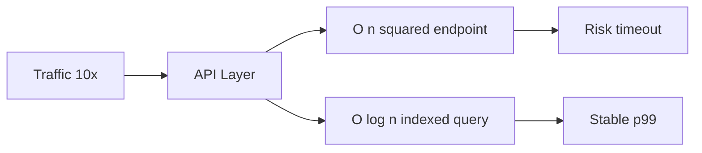

---

## Best Practices

1. State input size and case (avg/worst) when claiming complexity.
2. Document assumptions (sorted input for binary search).
3. Prefer built-in sorts (`Timsort` O(n log n)) over bubble sort.
4. Use complexity cheat sheet in interviews, not memorized micro-optimizations.
5. Re-analyze complexity after each refactor.

---

## Engineering Notes

### Beginner Note

Big-O is about growth rate, not exact speed. O(n) on a supercomputer vs O(n²) on your laptop — for large enough n, linear wins.

### Intermediate Note

Python's `sorted()` is Timsort — O(n log n) worst case, often faster on partially ordered data. Know what the standard library guarantees.

### Senior Engineer Note

Asymptotics plus constants plus I/O dominate real systems. A "fast" O(n log n) disk sort may lose to O(n²) in-memory sort for small n that fits in L3 cache. Senior engineers measure at production scale and model tail latency, not just averages.

---

## Summary

Big-O describes scaling behavior. Constant, logarithmic, linear, linearithmic, and quadratic classes appear constantly in algorithm work. Analyze loops and recursion, validate with benchmarks, and always ask: "What is n in production?"

---

## Exercises

1. Classify complexity: `for i in n: for j in n: for k in n: pass` → ?
2. Rewrite duplicate-finder from O(n²) to O(n) with a set.
3. Plot n, n log n, n² for n=1..1000.
4. Explain why hash lookup is O(1) average.
5. Find the complexity of Euclid's GCD from Chapter 5.

---

## Further Reading

- [Big-O Cheat Sheet](https://www.bigocheatsheet.com/)
- [CLRS — Growth of Functions](https://mitpress.mit.edu/9780262046305/introduction-to-algorithms/)
- [Python Time Complexity wiki](https://wiki.python.org/moin/TimeComplexity)

---

**Previous:** [Chapter 6: Essential Data Structures](./chapter-06-essential-data-structures.md) · **Next:** [Chapter 8: Algorithm Design Techniques](./chapter-08-design-techniques.md)


---


<!-- SOURCE: part-01-algorithm-fundamentals/chapter-08-design-techniques.md -->


---


# Chapter 8: Algorithm Design Techniques

**Part 1 — Algorithm Fundamentals**

---

## Learning Objectives

By the end of this chapter, you will be able to:

1. Apply **divide and conquer** to break problems into subproblems.
2. Use **recursion** with clear base cases and progress toward termination.
3. Improve recursive algorithms with **memoization** and dynamic programming preview.
4. Implement **greedy** strategies and recognize when they fail.
5. Implement merge sort as a canonical divide-and-conquer algorithm.
6. Compare recursive, memoized, and iterative approaches by complexity.
7. Choose design paradigms for new problems systematically.
8. Connect design techniques to later chapters (DP, graphs, greedy flows).

---

## Introduction

Facing a new problem, experienced engineers reach for a **toolkit**:

- **Brute force** — try all options (baseline).
- **Divide and conquer** — split, solve, combine (merge sort, quicksort).
- **Dynamic programming** — memoize overlapping subproblems (Fibonacci, knapsack).
- **Greedy** — locally optimal choices (some scheduling, Huffman coding).
- **Backtracking** — explore with pruning (N-queens, Sudoku).

This chapter implements recursion, memoization, merge sort, and greedy coin change — patterns you will reuse throughout the book.

---

## Real-World Motivation

- **MapReduce** is divide-and-conquer at data-center scale.
- **Caching** is memoization in production (CDN, application cache).
- **Compression** (Huffman) uses greedy tree building.
- **Route planning** combines graph search with heuristics.
- **ML training** uses dynamic programming ideas in Viterbi, CRF, and sequence models.

---

## Daily-Life Analogy

- **Divide and conquer**: clean the house — one room at a time, then enjoy the whole house.
- **Memoization**: keep a shopping list on the fridge so you do not re-check the pantry every day.
- **Greedy**: always pick the largest coin first when making change (works for US coins, not all systems).

---

## Mathematical Intuition

**Recurrence** for merge sort: `T(n) = 2T(n/2) + O(n)` → **O(n log n)** by Master Theorem.

**Fibonacci** naive recursion revisits subproblems exponentially; memoization reduces to **O(n)**.

**Greedy correctness** requires **greedy choice property** and **optimal substructure** — coin change works for canonical denominations `[25,10,5,1]` but fails for `[1,3,4]` and amount 6.

---

## Core Concepts

| Technique | Idea | When to use |
|-----------|------|-------------|
| **Recursion** | Self-similar subproblems | Trees, fractals, divide-and-conquer |
| **Memoization** | Cache subproblem results | Overlapping subproblems |
| **Divide & conquer** | Split, solve, merge | Sorting, FFT, parallel pipelines |
| **Greedy** | Local optimum | When provably optimal |
| **DP** | Bottom-up tabulation | Optimization with overlapping subs |

---

## Visual Diagram (Mermaid)

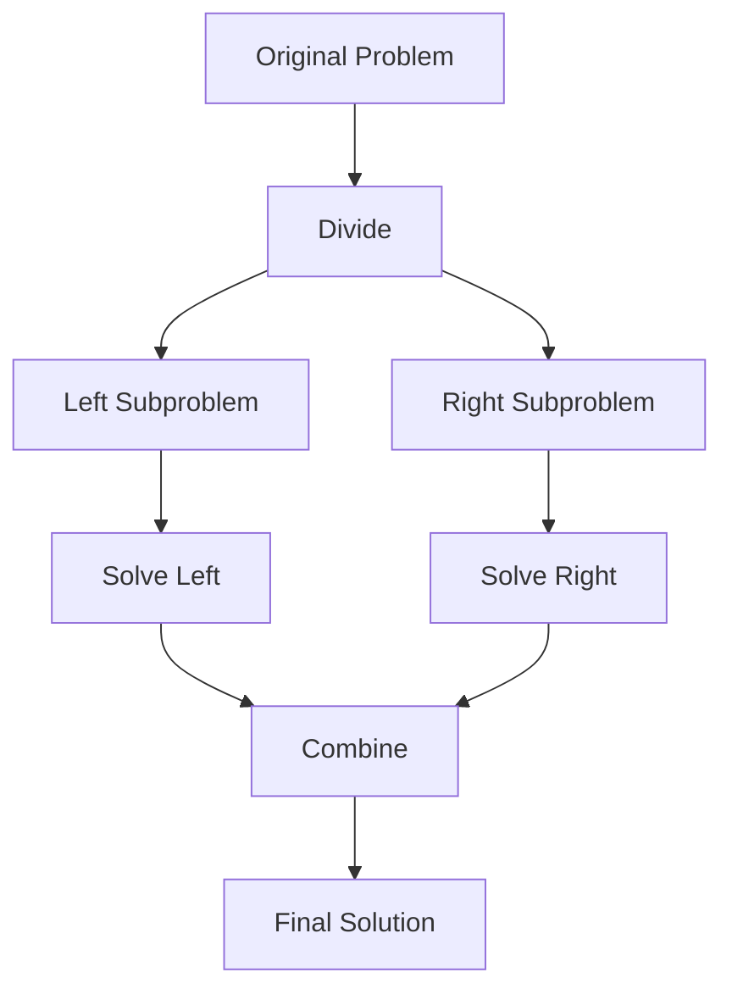

---

## Step-by-Step Explanation

### Step 1: Recursive Factorial

Base case `n ≤ 1`; recursive step `n * factorial(n-1)`.

### Step 2: Memoized Fibonacci

`@lru_cache` stores computed `F(k)` — classic DP top-down.

### Step 3: Merge Sort

Split array in half, sort halves, merge sorted lists in O(n).

### Step 4: Greedy Coin Change

Take largest coin not exceeding remainder; repeat.

### Step 5: Analyze Trade-offs

Naive Fibonacci O(2^n) vs memo O(n); greedy fast but not always optimal.

---

## Python Implementation

See [`code/part-01/design_techniques.py`](code/part-01/design_techniques.py).

```bash
python code/part-01/design_techniques.py
```

---

## Code Walkthrough

| Function | Technique | Complexity |
|----------|-----------|------------|
| `factorial_recursive` | Recursion | O(n) time, O(n) stack |
| `fibonacci_memo` | Memoization | O(n) time, O(n) space |
| `merge_sort` | Divide & conquer | O(n log n) |
| `coin_change_greedy` | Greedy | O(k) coins per amount |

`@lru_cache` is Python's built-in memoization — production code might use explicit dicts for control.

---

## Expected Output

```text
factorial(6) = 720
fibonacci_memo(30) = 832040
merge_sort([3,1,4,1,5,9,2,6]) = [1, 1, 2, 3, 4, 5, 6, 9]
coin_change_greedy(67 cents): {'coins': {25: 2, 10: 1, 5: 1, 1: 2}, 'remainder': 0}
```

---

## Output Explanation

- **720** = 6! = 6×5×4×3×2×1.
- **F(30)** — large Fibonacci without exponential blowup thanks to memo.
- **Merge sort** — stable ordering with duplicates preserved in merge.
- **67 cents** — 2×25 + 10 + 5 + 2×1 = 67, remainder 0.

---

## Time Complexity

| Algorithm | Time | Notes |
|-----------|------|-------|
| Naive Fibonacci recursion | O(2^n) | Without memo |
| Memoized Fibonacci | O(n) | Each subproblem once |
| Merge sort | O(n log n) | Guaranteed |
| Greedy coin change | O(c) per amount | c = number of coin types |

---

## Space Complexity

| Algorithm | Space |
|-----------|-------|
| Factorial recursion | O(n) call stack |
| Merge sort | O(n) auxiliary merge buffer |
| Memoized Fibonacci | O(n) cache |
| Greedy | O(1) beyond output |

---

## Memory Usage

Deep recursion (>1000) can hit Python's recursion limit — use iteration or `sys.setrecursionlimit` cautiously. Merge sort's O(n) extra array is the trade-off for stable O(n log n) performance.

---

## Performance Considerations

1. Prefer `functools.lru_cache` or bottom-up DP for overlapping subproblems.
2. Tail-recursion is not optimized in Python — use loops when depth is large.
3. Greedy: prove correctness or fall back to DP.
4. Parallelize divide-and-conquer subproblems only when overhead is worth it.

---

## Common Mistakes

| Mistake | Fix |
|---------|-----|
| Missing base case | Infinite recursion |
| Assuming greedy always optimal | Counterexample: coins [1,3,4], amount 6 |
| Not copying in merge sort | Mutate carefully; our version returns new list |
| Ignoring stack overflow | Iterative Fibonacci for large n |

---

## Debugging Tips

1. Print recursion depth with a decorator.
2. Compare greedy vs brute force on small inputs.
3. Visualize merge steps on [3,1,2].
4. `pytest tests/part-01/test_chapter_08.py -v`

---

## Unit Tests

[`tests/part-01/test_chapter_08.py`](../tests/part-01/test_chapter_08.py)

---

## Benchmarking

```python
import timeit
from design_techniques import fibonacci_memo

# Warm cache
fibonacci_memo(100)
elapsed = timeit.timeit(lambda: fibonacci_memo(1000), number=1)
print(f"fibonacci_memo(1000): {elapsed:.6f}s")
```

Without memo, `fibonacci(35)` already feels sluggish.

---

## Interview Questions

### Beginner (5)

1. What is recursion?
2. What is a base case?
3. Name a divide-and-conquer algorithm.
4. What does greedy mean?
5. What is memoization?

### Intermediate (5)

1. Write merge sort and state its complexity.
2. When does greedy coin change fail?
3. Top-down vs bottom-up DP?
4. Recursion tree for naive Fibonacci?
5. Stable vs unstable sort — is merge sort stable?

### Advanced (5)

1. Master theorem cases with examples.
2. Prove merge sort is O(n log n).
3. Design DP for coin change with arbitrary denominations.
4. Parallel merge sort challenges.
5. Branch and bound vs backtracking.

### System Design (3)

1. MapReduce as divide-and-conquer at scale.
2. Cache design as distributed memoization.
3. Choose greedy vs optimal routing in real-time systems.

### Coding Challenge (1)

Implement 0/1 knapsack with bottom-up DP; compare to greedy by value/weight ratio.

---

## Production Notes

- Use Redis/Memcached for cross-request memoization.
- Set recursion limits and timeouts on user-submitted code platforms.
- Log when greedy heuristics are used vs optimal solvers.
- Feature-flag new sorting/ranking algorithms with shadow evaluation.

---

## Architecture Integration

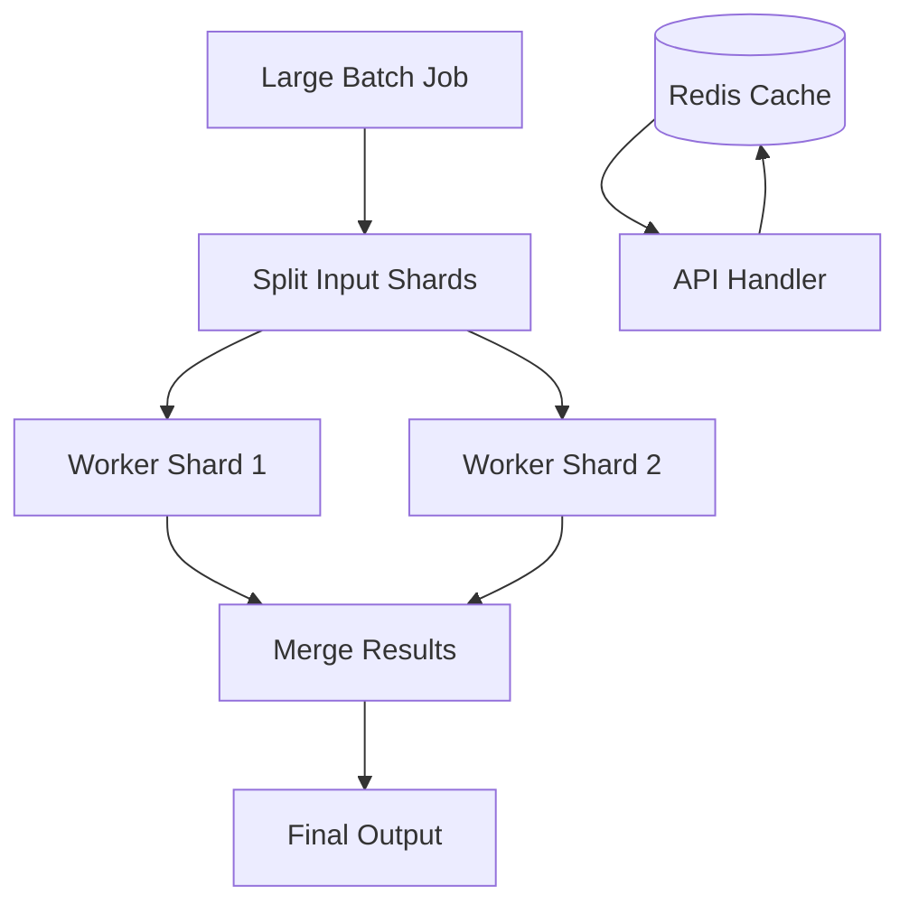

Divide-and-conquer and memoization appear at every scale.

---

## Best Practices

1. Identify optimal substructure before choosing DP or greedy.
2. Write brute force first, then optimize with memo or better algorithm.
3. Unit test counterexamples for greedy algorithms.
4. Document recursion depth and stack requirements.
5. Use iterative solutions for production hot paths when possible.

---

## Engineering Notes

### Beginner Note

Recursion is a function calling itself. Always ask: "What is the smallest input I can answer directly?" That is your base case.

### Intermediate Note

`lru_cache` is convenient but unbounded `maxsize=None` can grow memory on large state spaces. Use bounded caches or explicit eviction in production.

### Senior Engineer Note

Design technique choice is a product decision too. Optimal DP may be too slow for real-time; greedy with 99% optimality may ship. Document approximation bounds, monitor regret metrics, and keep the optimal solver offline for audit samples.

---

## Summary

Algorithm design techniques are reusable patterns: recursion, divide-and-conquer, memoization, and greedy strategies. Merge sort exemplifies efficient splitting and merging; memoized Fibonacci shows eliminating redundant work. Part 1 complete — you are ready for searching, sorting, and graph algorithms in Part 2.

---

## Exercises

1. Implement iterative Fibonacci and compare to memoized version.
2. Show greedy fails for coins [1,3,4], amount 6; solve with DP.
3. Implement quicksort (another divide-and-conquer sort).
4. Add `@lru_cache` to a slow recursive function of your choice.
5. Draw recursion tree for `merge_sort([4,2,1,3])`.

---

## Further Reading

- [CLRS — Divide-and-Conquer, DP, Greedy](https://mitpress.mit.edu/9780262046305/introduction-to-algorithms/)
- [Python `functools.lru_cache`](https://docs.python.org/3/library/functools.html#functools.lru_cache)
- [VisuAlgo — Merge Sort](https://visualgo.net/en/sorting)

---

**Previous:** [Chapter 7: Big-O Complexity](./chapter-07-big-o-complexity.md) · **Next:** Part 2 — Searching Algorithms *(Chapter 9)*


---


<!-- SOURCE: part-02-searching/chapter-09-linear-search.md -->


---


# Chapter 9: Linear Search

**Part 02 — Searching Algorithms**

---

## Learning Objectives

By the end of this chapter, you will be able to:

1. Explain how **Linear Search** works on representative inputs.
2. Implement the algorithm in Python with type hints and docstrings.
3. Analyze **time complexity** (O(n)) and **space complexity** (O(1)).
4. Choose when Linear Search is appropriate in applications and interviews.
5. Avoid common implementation mistakes and debug failing cases systematically.
6. Connect the algorithm to production systems and architecture trade-offs.
7. Answer beginner through senior-level interview questions confidently.
8. Run and extend the book's unit tests and benchmarks.

---

## Introduction

**Linear Search** is a foundational algorithm in computer science and software engineering. This chapter provides a complete, runnable treatment aligned with the book's code in `code/part-02/linear_search.py`.

You will move from intuition to implementation to complexity analysis, then to interviews and production notes. Every example uses **Python 3.12+** and follows the repository's testing conventions.

---

## Real-World Motivation

Databases scan rows when no index exists; file systems walk directories sequentially.

Engineering teams rarely implement every algorithm from scratch, but they **must recognize** when a library, database index, or graph engine is applying this idea under the hood. That recognition saves debugging time and prevents wrong algorithm choices at scale.

---

## Daily-Life Analogy

Checking every locker in a hallway until you find yours.

The analogy is not a proof — it is a mental model. When you forget details, return to this image and rebuild the steps.

---

## Mathematical Intuition

Worst case examines all n elements: T(n) = n.

We express complexity with Big-O notation for worst-case or standard-case behavior unless stated otherwise. Measure on your hardware when constants matter.

---

## Core Concepts

| Concept | Meaning |
|---------|---------|
| **Sequential scan** | Visit elements from index 0 to n-1 |
| **Early exit** | Stop when target is found |
| **Unsorted input** | Works on any sequence without preprocessing |

---

## Visual Diagram

```mermaid
flowchart LR
    A[Start index 0] --> B{items[i] == target?}
    B -->|Yes| C[Return i]
    B -->|No| D{i < n?}
    D -->|Yes| E[i += 1] --> B
    D -->|No| F[Return -1]
```

---

## Step-by-Step Explanation

1. Initialize index to 0.
2. Compare items[index] with target.
3. If equal, return index.
4. Increment index; repeat until end.
5. Return -1 if not found.

Walk through a small example by hand on paper. Tracing two or three steps beats memorizing code.

---

## Python Implementation

Full implementation with type hints and docstrings:

```python
# See code/part-02/linear_search.py
```

Run directly:

```bash
cd comprehensive-algorithms-guide
python code/part-02/linear_search.py
```

Primary entry point: **`linear_search()`**.

---

## Code Walkthrough

1. **Inputs and types** — The implementation uses explicit type hints for clarity and static checking.
2. **Core loop / recursion** — The algorithm's invariant is maintained at each step (see Mathematical Intuition).
3. **Return value** — Documented in the function docstring; tests assert expected behavior.
4. **`if __name__ == "__main__"`** — Demonstrates sample input/output for quick manual verification.

Read the source file line by line alongside this chapter. The docstring includes complexity analysis.

---

## Expected Output

Example session (values may vary slightly for stochastic algorithms):

```text
$ python code/part-02/linear_search.py
# Demonstration output printed by __main__ block
```

---

## Output Explanation

The demonstration constructs a small sample input, runs `linear_search()`, and prints results. Compare output to your hand trace. If results differ, use Debugging Tips below.

---

## Time Complexity

| Case | Complexity |
|------|------------|
| Typical / stated | **O(n)** |

Dominant operations: comparisons, graph edge relaxations, or passes over the input — depending on the algorithm family.

---

## Space Complexity

| Component | Complexity |
|-----------|------------|
| Auxiliary space | **O(1)** |

Auxiliary structures may include stacks, queues, heaps, or temporary arrays. In-place sorts use O(1) extra space excluding recursion stack.

---

## Memory Usage

Memory includes:

- The input structure itself (O(n) or O(V+E) for graphs).
- Auxiliary buffers (visited sets, heaps, merge buffers).
- Recursion stack depth for recursive implementations.

Profile with `sys.getsizeof` for shallow sizes; use `tracemalloc` for deeper insight on large inputs.

---

## Performance Considerations

- **Input size** — Asymptotic complexity dominates for large n.
- **Constants** — Built-in Python sorts (Timsort) are highly optimized; custom sorts are for learning.
- **Cache locality** — Sequential access often beats pointer-chasing on large arrays.
- **Early termination** — Some variants stop early on sorted or goal-found conditions.

---

## Common Mistakes

- Using linear search on large sorted arrays when binary search applies.
- Off-by-one errors when looping to `len(items)` vs `len(items)-1` unnecessarily.
- Forgetting that `==` on objects may not mean semantic equality.

---

## Debugging Tips

1. **Print state** — Log indices, distances, or heap contents on small inputs.
2. **Invariant checks** — Assert conditions that must hold each loop iteration.
3. **Compare to brute force** — On tiny inputs, verify against a slow correct reference.
4. **Run tests** — `pytest tests/part-02/ -v`
5. **Draw the diagram** — Mermaid figures in this chapter map directly to code structures.

---

## Unit Tests

Automated tests live in `tests/part-02/`:

```bash
pytest tests/part-02/ -v
```

Tests cover typical cases, edge cases (empty input, single element), and error conditions where applicable.

---

## Benchmarking

For sorting chapters, run the comparison benchmark:

```bash
python code/part-03/benchmark_sorts.py
```

For searching graph algorithms, time BFS/DFS/Dijkstra on larger graphs built in a loop. Use `time.perf_counter()` and fixed random seeds.

---

## Interview Questions

### Beginner (5)

1. What is linear search?
2. What is its time complexity?
3. Does linear search require sorted data?
4. What does the function return when the target is missing?
5. When is linear search acceptable?

### Intermediate (5)

1. How would you find all occurrences of a duplicate value?
2. Compare linear search vs hash-map lookup.
3. How does sentinel-based search reduce branch checks?
4. When would you use a predicate-based linear scan?
5. How do you test linear search for empty input?

### Advanced (5)

1. Analyze cache behavior of sequential vs random access scans.
2. How do SIMD instructions accelerate linear scans in production?
3. Discuss branch prediction effects on tight loops.
4. When does streaming I/O make linear scan the only option?
5. How would you parallelize linear search across chunks?

### System Design (3)

1. When should a search API fall back to full table scan?
2. Design a feature flag rollout checker scanning millions of rows.
3. How do you monitor scan latency in OLAP queries?

### Coding Challenge (1)

Implement `linear_search_all` returning every index of a target in O(n) time.

---

## Production Notes

Full table scans are acceptable for small tables, ETL staging, or when indexes cannot be maintained. Use query plans and limits to avoid unbounded scans in APIs.

---

## Architecture Integration

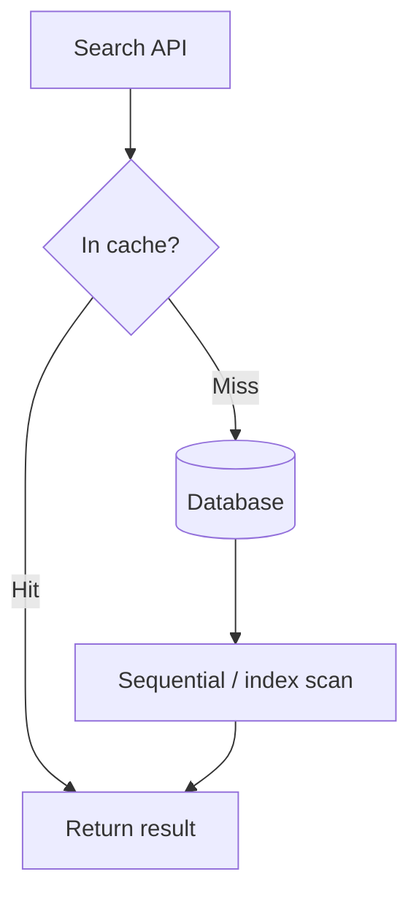

| Layer | Role |
|-------|------|
| Application | Chooses algorithm or library API |
| Library / runtime | Optimized implementation (e.g., `sorted`, `heapq`, NetworkX) |
| Infrastructure | Indexes, caches, precomputed graphs |
| Observability | Latency, correctness checks, adversarial input guards |

---

## Best Practices

1. Prefer standard library implementations in production hot paths.
2. Document preconditions (sorted input, non-negative weights, etc.).
3. Write property-based or table-driven tests for edge cases.
4. Pin benchmarks to seeds and hardware when reporting numbers.
5. Fail fast on invalid input with clear exceptions.
6. Keep chapter code in `code/part-02/` — do not duplicate logic in notebooks only.
7. Profile before replacing a clear O(n log n) library sort with a custom variant.

---

## Engineering Notes

### Beginner Note

Start by running `linear_search.py` and the pytest file. Modify the sample input in the `__main__` block and predict the output before running. If you are new to Big-O, focus on **how the loop bounds grow** with input size.

### Intermediate Note

Compare this algorithm to its closest relatives in the same part of the book. Implement one variation (iterative vs recursive, randomized pivot, early exit) and measure whether it matters on your machine for n = 10³ and n = 10⁴.

### Senior Engineer Note

At scale, algorithm choice is a **product and reliability** decision: worst-case guarantees, stability, memory caps, adversarial inputs, and operational observability matter as much as Big-O. Integrate with indexes, materialized views, precomputed graphs, or GPU kernels where appropriate. The implementation in this repository is a **reference** — production systems should use battle-tested libraries unless profiling proves a specialized path is required.

---

## Summary

In this chapter you:

- Learned how **Linear Search** works and when to use it.
- Studied **O(n)** time and **O(1)** space complexity.
- Ran the Python implementation in `code/part-02/linear_search.py`.
- Practiced interview questions from beginner to system design level.
- Connected the algorithm to production and architecture concerns.

---

## Exercises

### Exercise 1 — Trace by Hand

Apply the algorithm to a custom input of size 5–8. Write each step.

### Exercise 2 — Implement a Variant

Add one optimization or variant described in Engineering Notes. Prove it preserves correctness.

### Exercise 3 — Complexity Proof Sketch

Explain in 5–10 sentences why the stated time complexity holds.

### Exercise 4 — Test Case

Add a new pytest case covering an edge case not yet tested.

### Exercise 5 — Benchmark

Time the implementation for increasing input sizes. Plot or tabulate results.

---

## Further Reading

- [Python enumerate documentation](https://docs.python.org/3/library/functions.html#enumerate)
- [CLRS — Introduction to Algorithms, Chapter on elementary search](https://mitpress.mit.edu/9780262046305/introduction-to-algorithms/)

---

**Previous:** Chapter 8: Algorithm Analysis  
**Next:** Chapter 10: Binary Search


---


<!-- SOURCE: part-02-searching/chapter-10-binary-search.md -->


---


# Chapter 10: Binary Search

**Part 02 — Searching Algorithms**

---

## Learning Objectives

By the end of this chapter, you will be able to:

1. Explain how **Binary Search** works on representative inputs.
2. Implement the algorithm in Python with type hints and docstrings.
3. Analyze **time complexity** (O(log n)) and **space complexity** (O(1) iterative / O(log n) recursive).
4. Choose when Binary Search is appropriate in applications and interviews.
5. Avoid common implementation mistakes and debug failing cases systematically.
6. Connect the algorithm to production systems and architecture trade-offs.
7. Answer beginner through senior-level interview questions confidently.
8. Run and extend the book's unit tests and benchmarks.

---

## Introduction

**Binary Search** is a foundational algorithm in computer science and software engineering. This chapter provides a complete, runnable treatment aligned with the book's code in `code/part-02/binary_search.py`.

You will move from intuition to implementation to complexity analysis, then to interviews and production notes. Every example uses **Python 3.12+** and follows the repository's testing conventions.

---

## Real-World Motivation

Databases, version control bisect, and load balancers use binary search on sorted data for logarithmic lookups.

Engineering teams rarely implement every algorithm from scratch, but they **must recognize** when a library, database index, or graph engine is applying this idea under the hood. That recognition saves debugging time and prevents wrong algorithm choices at scale.

---

## Daily-Life Analogy

Finding a name in a phone book by repeatedly opening to the middle.

The analogy is not a proof — it is a mental model. When you forget details, return to this image and rebuild the steps.

---

## Mathematical Intuition

Each step halves the search space: T(n) = T(n/2) + O(1) → O(log n).

We express complexity with Big-O notation for worst-case or standard-case behavior unless stated otherwise. Measure on your hardware when constants matter.

---

## Core Concepts

| Concept | Meaning |
|---------|---------|
| **Sorted precondition** | Input must be ordered |
| **Divide and conquer** | Discard half the range each step |
| **Lower bound** | First index where target can be inserted |

---

## Visual Diagram

```mermaid
flowchart TD
    L[left] --> M[mid = left + (right-left)//2]
    M --> C{arr[mid] vs target}
    C -->|equal| R[return mid]
    C -->|arr[mid] < target| U[left = mid + 1]
    C -->|arr[mid] > target| D[right = mid - 1]
    U --> M
    D --> M
```

---

## Step-by-Step Explanation

1. Set left = 0, right = n - 1.
2. Compute mid avoiding overflow: left + (right - left) // 2.
3. Compare arr[mid] to target.
4. Adjust left or right; stop when left > right.

Walk through a small example by hand on paper. Tracing two or three steps beats memorizing code.

---

## Python Implementation

Full implementation with type hints and docstrings:

```python
# See code/part-02/binary_search.py
```

Run directly:

```bash
cd comprehensive-algorithms-guide
python code/part-02/binary_search.py
```

Primary entry point: **`binary_search_iterative()`**.

---

## Code Walkthrough

1. **Inputs and types** — The implementation uses explicit type hints for clarity and static checking.
2. **Core loop / recursion** — The algorithm's invariant is maintained at each step (see Mathematical Intuition).
3. **Return value** — Documented in the function docstring; tests assert expected behavior.
4. **`if __name__ == "__main__"`** — Demonstrates sample input/output for quick manual verification.

Read the source file line by line alongside this chapter. The docstring includes complexity analysis.

---

## Expected Output

Example session (values may vary slightly for stochastic algorithms):

```text
$ python code/part-02/binary_search.py
# Demonstration output printed by __main__ block
```

---

## Output Explanation

The demonstration constructs a small sample input, runs `binary_search_iterative()`, and prints results. Compare output to your hand trace. If results differ, use Debugging Tips below.

---

## Time Complexity

| Case | Complexity |
|------|------------|
| Typical / stated | **O(log n)** |

Dominant operations: comparisons, graph edge relaxations, or passes over the input — depending on the algorithm family.

---

## Space Complexity

| Component | Complexity |
|-----------|------------|
| Auxiliary space | **O(1) iterative / O(log n) recursive** |

Auxiliary structures may include stacks, queues, heaps, or temporary arrays. In-place sorts use O(1) extra space excluding recursion stack.

---

## Memory Usage

Memory includes:

- The input structure itself (O(n) or O(V+E) for graphs).
- Auxiliary buffers (visited sets, heaps, merge buffers).
- Recursion stack depth for recursive implementations.

Profile with `sys.getsizeof` for shallow sizes; use `tracemalloc` for deeper insight on large inputs.

---

## Performance Considerations

- **Input size** — Asymptotic complexity dominates for large n.
- **Constants** — Built-in Python sorts (Timsort) are highly optimized; custom sorts are for learning.
- **Cache locality** — Sequential access often beats pointer-chasing on large arrays.
- **Early termination** — Some variants stop early on sorted or goal-found conditions.

---

## Common Mistakes

- Searching unsorted arrays.
- Using `(left + right) // 2` on huge indices in other languages (overflow).
- Infinite loops from incorrect boundary updates.

---

## Debugging Tips

1. **Print state** — Log indices, distances, or heap contents on small inputs.
2. **Invariant checks** — Assert conditions that must hold each loop iteration.
3. **Compare to brute force** — On tiny inputs, verify against a slow correct reference.
4. **Run tests** — `pytest tests/part-02/ -v`
5. **Draw the diagram** — Mermaid figures in this chapter map directly to code structures.

---

## Unit Tests

Automated tests live in `tests/part-02/`:

```bash
pytest tests/part-02/ -v
```

Tests cover typical cases, edge cases (empty input, single element), and error conditions where applicable.

---

## Benchmarking

For sorting chapters, run the comparison benchmark:

```bash
python code/part-03/benchmark_sorts.py
```

For searching graph algorithms, time BFS/DFS/Dijkstra on larger graphs built in a loop. Use `time.perf_counter()` and fixed random seeds.

---

## Interview Questions

### Beginner (5)

1. Why must data be sorted?
2. What is the time complexity?
3. Iterative vs recursive binary search?
4. What happens if the target is absent?
5. What is lower bound?

### Intermediate (5)

1. Find first occurrence of a duplicate in a sorted array.
2. Implement binary search on answer (parametric search).
3. Compare bisect module vs hand-written search.
4. How to search a rotated sorted array?
5. Off-by-one pitfalls with inclusive bounds.

### Advanced (5)

1. Prove correctness using loop invariants.
2. Branchless binary search in systems programming.
3. Fractional cascading and interpolation search trade-offs.
4. Binary search on implicit infinite sequences.
5. Cache effects vs linear scan crossover point.

### System Design (3)

1. Use binary search for timestamp-based log retention.
2. Design autoscaling based on sorted latency samples.
3. Shard routing via binary search on key ranges.

### Coding Challenge (1)

Given a sorted array with duplicates, return the leftmost index of target in O(log n).

---

## Production Notes

Prefer `bisect` in Python for maintenance. Hand-roll only when you need custom comparators or implicit arrays.

---

## Architecture Integration

```mermaid
flowchart LR
    Client --> LB[Load Balancer]
    LB --> Sorted[Sorted server latency list]
    Sorted --> BS[Binary search pick server]
    BS --> Server[Backend instance]
```

| Layer | Role |
|-------|------|
| Application | Chooses algorithm or library API |
| Library / runtime | Optimized implementation (e.g., `sorted`, `heapq`, NetworkX) |
| Infrastructure | Indexes, caches, precomputed graphs |
| Observability | Latency, correctness checks, adversarial input guards |

---

## Best Practices

1. Prefer standard library implementations in production hot paths.
2. Document preconditions (sorted input, non-negative weights, etc.).
3. Write property-based or table-driven tests for edge cases.
4. Pin benchmarks to seeds and hardware when reporting numbers.
5. Fail fast on invalid input with clear exceptions.
6. Keep chapter code in `code/part-02/` — do not duplicate logic in notebooks only.
7. Profile before replacing a clear O(n log n) library sort with a custom variant.

---

## Engineering Notes

### Beginner Note

Start by running `binary_search.py` and the pytest file. Modify the sample input in the `__main__` block and predict the output before running. If you are new to Big-O, focus on **how the loop bounds grow** with input size.

### Intermediate Note

Compare this algorithm to its closest relatives in the same part of the book. Implement one variation (iterative vs recursive, randomized pivot, early exit) and measure whether it matters on your machine for n = 10³ and n = 10⁴.

### Senior Engineer Note

At scale, algorithm choice is a **product and reliability** decision: worst-case guarantees, stability, memory caps, adversarial inputs, and operational observability matter as much as Big-O. Integrate with indexes, materialized views, precomputed graphs, or GPU kernels where appropriate. The implementation in this repository is a **reference** — production systems should use battle-tested libraries unless profiling proves a specialized path is required.

---

## Summary

In this chapter you:

- Learned how **Binary Search** works and when to use it.
- Studied **O(log n)** time and **O(1) iterative / O(log n) recursive** space complexity.
- Ran the Python implementation in `code/part-02/binary_search.py`.
- Practiced interview questions from beginner to system design level.
- Connected the algorithm to production and architecture concerns.

---

## Exercises

### Exercise 1 — Trace by Hand

Apply the algorithm to a custom input of size 5–8. Write each step.

### Exercise 2 — Implement a Variant

Add one optimization or variant described in Engineering Notes. Prove it preserves correctness.

### Exercise 3 — Complexity Proof Sketch

Explain in 5–10 sentences why the stated time complexity holds.

### Exercise 4 — Test Case

Add a new pytest case covering an edge case not yet tested.

### Exercise 5 — Benchmark

Time the implementation for increasing input sizes. Plot or tabulate results.

---

## Further Reading

- [Python bisect module](https://docs.python.org/3/library/bisect.html)
- [Binary search — CP-Algorithms](https://cp-algorithms.com/num_methods/binary_search.html)

---

**Previous:** Chapter 9: Linear Search  
**Next:** Chapter 11: Depth-First Search (DFS)


---


<!-- SOURCE: part-02-searching/chapter-11-dfs.md -->


---


# Chapter 11: Depth-First Search (DFS)

**Part 02 — Searching Algorithms**

---

## Learning Objectives

By the end of this chapter, you will be able to:

1. Explain how **Depth-First Search (DFS)** works on representative inputs.
2. Implement the algorithm in Python with type hints and docstrings.
3. Analyze **time complexity** (O(V + E)) and **space complexity** (O(V)).
4. Choose when Depth-First Search (DFS) is appropriate in applications and interviews.
5. Avoid common implementation mistakes and debug failing cases systematically.
6. Connect the algorithm to production systems and architecture trade-offs.
7. Answer beginner through senior-level interview questions confidently.
8. Run and extend the book's unit tests and benchmarks.

---

## Introduction

**Depth-First Search (DFS)** is a foundational algorithm in computer science and software engineering. This chapter provides a complete, runnable treatment aligned with the book's code in `code/part-02/dfs.py`.

You will move from intuition to implementation to complexity analysis, then to interviews and production notes. Every example uses **Python 3.12+** and follows the repository's testing conventions.

---

## Real-World Motivation

Topological sort, cycle detection, connected components, and puzzle solvers use DFS.

Engineering teams rarely implement every algorithm from scratch, but they **must recognize** when a library, database index, or graph engine is applying this idea under the hood. That recognition saves debugging time and prevents wrong algorithm choices at scale.

---

## Daily-Life Analogy

Exploring a maze by always going as deep as possible before backtracking.

The analogy is not a proof — it is a mental model. When you forget details, return to this image and rebuild the steps.

---

## Mathematical Intuition

Each vertex and edge visited once: O(V + E).

We express complexity with Big-O notation for worst-case or standard-case behavior unless stated otherwise. Measure on your hardware when constants matter.

---

## Core Concepts

| Concept | Meaning |
|---------|---------|
| **Stack / recursion** | LIFO explores depth first |
| **Visited set** | Prevents infinite loops in cyclic graphs |
| **Backtracking** | Undo choices when path fails |

---

## Visual Diagram

```mermaid
flowchart TD
    S[Push start] --> P[Pop node]
    P --> V{Visited?}
    V -->|Yes| P
    V -->|No| M[Mark visited]
    M --> N[Push unvisited neighbors]
    N --> P
```

---

## Step-by-Step Explanation

1. Mark start visited and push onto stack.
2. Pop node; append to order.
3. Push unvisited neighbors (reverse order for consistent traversal).
4. Repeat until stack empty.

Walk through a small example by hand on paper. Tracing two or three steps beats memorizing code.

---

## Python Implementation

Full implementation with type hints and docstrings:

```python
# See code/part-02/dfs.py
```

Run directly:

```bash
cd comprehensive-algorithms-guide
python code/part-02/dfs.py
```

Primary entry point: **`dfs_iterative()`**.

---

## Code Walkthrough

1. **Inputs and types** — The implementation uses explicit type hints for clarity and static checking.
2. **Core loop / recursion** — The algorithm's invariant is maintained at each step (see Mathematical Intuition).
3. **Return value** — Documented in the function docstring; tests assert expected behavior.
4. **`if __name__ == "__main__"`** — Demonstrates sample input/output for quick manual verification.

Read the source file line by line alongside this chapter. The docstring includes complexity analysis.

---

## Expected Output

Example session (values may vary slightly for stochastic algorithms):

```text
$ python code/part-02/dfs.py
# Demonstration output printed by __main__ block
```

---

## Output Explanation

The demonstration constructs a small sample input, runs `dfs_iterative()`, and prints results. Compare output to your hand trace. If results differ, use Debugging Tips below.

---

## Time Complexity

| Case | Complexity |
|------|------------|
| Typical / stated | **O(V + E)** |

Dominant operations: comparisons, graph edge relaxations, or passes over the input — depending on the algorithm family.

---

## Space Complexity

| Component | Complexity |
|-----------|------------|
| Auxiliary space | **O(V)** |

Auxiliary structures may include stacks, queues, heaps, or temporary arrays. In-place sorts use O(1) extra space excluding recursion stack.

---

## Memory Usage

Memory includes:

- The input structure itself (O(n) or O(V+E) for graphs).
- Auxiliary buffers (visited sets, heaps, merge buffers).
- Recursion stack depth for recursive implementations.

Profile with `sys.getsizeof` for shallow sizes; use `tracemalloc` for deeper insight on large inputs.

---

## Performance Considerations

- **Input size** — Asymptotic complexity dominates for large n.
- **Constants** — Built-in Python sorts (Timsort) are highly optimized; custom sorts are for learning.
- **Cache locality** — Sequential access often beats pointer-chasing on large arrays.
- **Early termination** — Some variants stop early on sorted or goal-found conditions.

---

## Common Mistakes

- Stack overflow on deep graphs with recursive DFS.
- Forgetting visited check before pushing.
- Assuming DFS finds shortest paths.

---

## Debugging Tips

1. **Print state** — Log indices, distances, or heap contents on small inputs.
2. **Invariant checks** — Assert conditions that must hold each loop iteration.
3. **Compare to brute force** — On tiny inputs, verify against a slow correct reference.
4. **Run tests** — `pytest tests/part-02/ -v`
5. **Draw the diagram** — Mermaid figures in this chapter map directly to code structures.

---

## Unit Tests

Automated tests live in `tests/part-02/`:

```bash
pytest tests/part-02/ -v
```

Tests cover typical cases, edge cases (empty input, single element), and error conditions where applicable.

---

## Benchmarking

For sorting chapters, run the comparison benchmark:

```bash
python code/part-03/benchmark_sorts.py
```

For searching graph algorithms, time BFS/DFS/Dijkstra on larger graphs built in a loop. Use `time.perf_counter()` and fixed random seeds.

---

## Interview Questions

### Beginner (5)

1. What data structure does DFS use?
2. DFS vs BFS difference?
3. Time complexity on a graph?
4. Can DFS work on disconnected graphs?
5. What is backtracking?

### Intermediate (5)

1. Detect cycles in directed graphs with DFS colors.
2. Count islands in a 2D grid using DFS.
3. Iterative vs recursive DFS trade-offs.
4. Topological sort via DFS finish times.
5. Find articulation points.

### Advanced (5)

1. DFS on implicit graphs (state space search).
2. Tarjan's SCC algorithm outline.
3. Memory-bounded DFS for huge graphs.
4. Parallel DFS challenges.
5. DFS for bipartite testing.

### System Design (3)

1. Model permission inheritance with DFS on org tree.
2. Dependency resolution in build systems.
3. Crawl web pages with depth limits.

### Coding Challenge (1)

Return whether a directed graph has a cycle using DFS.

---

## Production Notes

Set recursion limits or use iterative DFS in Python for deep trees. Add timeout and depth caps for user-generated graphs.

---

## Architecture Integration

```mermaid
flowchart TD
    Build[Build DAG of tasks] --> DFS[DFS topological order]
    DFS --> Queue[Execution queue]
    Queue --> Workers[Worker pool]
```

| Layer | Role |
|-------|------|
| Application | Chooses algorithm or library API |
| Library / runtime | Optimized implementation (e.g., `sorted`, `heapq`, NetworkX) |
| Infrastructure | Indexes, caches, precomputed graphs |
| Observability | Latency, correctness checks, adversarial input guards |

---

## Best Practices

1. Prefer standard library implementations in production hot paths.
2. Document preconditions (sorted input, non-negative weights, etc.).
3. Write property-based or table-driven tests for edge cases.
4. Pin benchmarks to seeds and hardware when reporting numbers.
5. Fail fast on invalid input with clear exceptions.
6. Keep chapter code in `code/part-02/` — do not duplicate logic in notebooks only.
7. Profile before replacing a clear O(n log n) library sort with a custom variant.

---

## Engineering Notes

### Beginner Note

Start by running `dfs.py` and the pytest file. Modify the sample input in the `__main__` block and predict the output before running. If you are new to Big-O, focus on **how the loop bounds grow** with input size.

### Intermediate Note

Compare this algorithm to its closest relatives in the same part of the book. Implement one variation (iterative vs recursive, randomized pivot, early exit) and measure whether it matters on your machine for n = 10³ and n = 10⁴.

### Senior Engineer Note

At scale, algorithm choice is a **product and reliability** decision: worst-case guarantees, stability, memory caps, adversarial inputs, and operational observability matter as much as Big-O. Integrate with indexes, materialized views, precomputed graphs, or GPU kernels where appropriate. The implementation in this repository is a **reference** — production systems should use battle-tested libraries unless profiling proves a specialized path is required.

---

## Summary

In this chapter you:

- Learned how **Depth-First Search (DFS)** works and when to use it.
- Studied **O(V + E)** time and **O(V)** space complexity.
- Ran the Python implementation in `code/part-02/dfs.py`.
- Practiced interview questions from beginner to system design level.
- Connected the algorithm to production and architecture concerns.

---

## Exercises

### Exercise 1 — Trace by Hand

Apply the algorithm to a custom input of size 5–8. Write each step.

### Exercise 2 — Implement a Variant

Add one optimization or variant described in Engineering Notes. Prove it preserves correctness.

### Exercise 3 — Complexity Proof Sketch

Explain in 5–10 sentences why the stated time complexity holds.

### Exercise 4 — Test Case

Add a new pytest case covering an edge case not yet tested.

### Exercise 5 — Benchmark

Time the implementation for increasing input sizes. Plot or tabulate results.

---

## Further Reading

- [NetworkX DFS](https://networkx.org/documentation/stable/reference/algorithms/generated/networkx.algorithms.traversal.depth_first_search.dfs_edges.html)
- [CLRS — Graph search](https://mitpress.mit.edu/9780262046305/introduction-to-algorithms/)

---

**Previous:** Chapter 10: Binary Search  
**Next:** Chapter 12: Breadth-First Search (BFS)


---


<!-- SOURCE: part-02-searching/chapter-12-bfs.md -->


---


# Chapter 12: Breadth-First Search (BFS)

**Part 02 — Searching Algorithms**

---

## Learning Objectives

By the end of this chapter, you will be able to:

1. Explain how **Breadth-First Search (BFS)** works on representative inputs.
2. Implement the algorithm in Python with type hints and docstrings.
3. Analyze **time complexity** (O(V + E)) and **space complexity** (O(V)).
4. Choose when Breadth-First Search (BFS) is appropriate in applications and interviews.
5. Avoid common implementation mistakes and debug failing cases systematically.
6. Connect the algorithm to production systems and architecture trade-offs.
7. Answer beginner through senior-level interview questions confidently.
8. Run and extend the book's unit tests and benchmarks.

---

## Introduction

**Breadth-First Search (BFS)** is a foundational algorithm in computer science and software engineering. This chapter provides a complete, runnable treatment aligned with the book's code in `code/part-02/bfs.py`.

You will move from intuition to implementation to complexity analysis, then to interviews and production notes. Every example uses **Python 3.12+** and follows the repository's testing conventions.

---

## Real-World Motivation

Shortest hops in unweighted graphs, social network degrees, and broadcast routing.

Engineering teams rarely implement every algorithm from scratch, but they **must recognize** when a library, database index, or graph engine is applying this idea under the hood. That recognition saves debugging time and prevents wrong algorithm choices at scale.

---

## Daily-Life Analogy

Ripples spreading outward in a pond from a dropped stone.

The analogy is not a proof — it is a mental model. When you forget details, return to this image and rebuild the steps.

---

## Mathematical Intuition

Layers expand by one edge per level; still O(V + E) total.

We express complexity with Big-O notation for worst-case or standard-case behavior unless stated otherwise. Measure on your hardware when constants matter.

---

## Core Concepts

| Concept | Meaning |
|---------|---------|
| **Queue** | FIFO processes nearest nodes first |
| **Level order** | Nodes grouped by distance from source |
| **Shortest path** | Fewest edges in unweighted graphs |

---

## Visual Diagram

```mermaid
flowchart LR
    Q[Queue] --> D[Dequeue node]
    D --> E[Enqueue unvisited neighbors]
    E --> Q
```

---

## Step-by-Step Explanation

1. Enqueue start; mark visited.
2. Dequeue front node; process it.
3. Enqueue each unvisited neighbor.
4. Continue until queue empty.

Walk through a small example by hand on paper. Tracing two or three steps beats memorizing code.

---

## Python Implementation

Full implementation with type hints and docstrings:

```python
# See code/part-02/bfs.py
```

Run directly:

```bash
cd comprehensive-algorithms-guide
python code/part-02/bfs.py
```

Primary entry point: **`bfs()`**.

---

## Code Walkthrough

1. **Inputs and types** — The implementation uses explicit type hints for clarity and static checking.
2. **Core loop / recursion** — The algorithm's invariant is maintained at each step (see Mathematical Intuition).
3. **Return value** — Documented in the function docstring; tests assert expected behavior.
4. **`if __name__ == "__main__"`** — Demonstrates sample input/output for quick manual verification.

Read the source file line by line alongside this chapter. The docstring includes complexity analysis.

---

## Expected Output

Example session (values may vary slightly for stochastic algorithms):

```text
$ python code/part-02/bfs.py
# Demonstration output printed by __main__ block
```

---

## Output Explanation

The demonstration constructs a small sample input, runs `bfs()`, and prints results. Compare output to your hand trace. If results differ, use Debugging Tips below.

---

## Time Complexity

| Case | Complexity |
|------|------------|
| Typical / stated | **O(V + E)** |

Dominant operations: comparisons, graph edge relaxations, or passes over the input — depending on the algorithm family.

---

## Space Complexity

| Component | Complexity |
|-----------|------------|
| Auxiliary space | **O(V)** |

Auxiliary structures may include stacks, queues, heaps, or temporary arrays. In-place sorts use O(1) extra space excluding recursion stack.

---

## Memory Usage

Memory includes:

- The input structure itself (O(n) or O(V+E) for graphs).
- Auxiliary buffers (visited sets, heaps, merge buffers).
- Recursion stack depth for recursive implementations.

Profile with `sys.getsizeof` for shallow sizes; use `tracemalloc` for deeper insight on large inputs.

---

## Performance Considerations

- **Input size** — Asymptotic complexity dominates for large n.
- **Constants** — Built-in Python sorts (Timsort) are highly optimized; custom sorts are for learning.
- **Cache locality** — Sequential access often beats pointer-chasing on large arrays.
- **Early termination** — Some variants stop early on sorted or goal-found conditions.

---

## Common Mistakes

- Using a list as queue (O(n) pops). Use deque.
- Marking visited on dequeue instead of enqueue (duplicate work).
- Applying BFS shortest-path claim to weighted graphs.

---

## Debugging Tips

1. **Print state** — Log indices, distances, or heap contents on small inputs.
2. **Invariant checks** — Assert conditions that must hold each loop iteration.
3. **Compare to brute force** — On tiny inputs, verify against a slow correct reference.
4. **Run tests** — `pytest tests/part-02/ -v`
5. **Draw the diagram** — Mermaid figures in this chapter map directly to code structures.

---

## Unit Tests

Automated tests live in `tests/part-02/`:

```bash
pytest tests/part-02/ -v
```

Tests cover typical cases, edge cases (empty input, single element), and error conditions where applicable.

---

## Benchmarking

For sorting chapters, run the comparison benchmark:

```bash
python code/part-03/benchmark_sorts.py
```

For searching graph algorithms, time BFS/DFS/Dijkstra on larger graphs built in a loop. Use `time.perf_counter()` and fixed random seeds.

---

## Interview Questions

### Beginner (5)

1. What structure does BFS use?
2. Does BFS find shortest paths?
3. BFS vs DFS?
4. Complexity?
5. How to track levels?

### Intermediate (5)

1. BFS on a grid with obstacles.
2. Bidirectional BFS speedup.
3. Multi-source BFS.
4. 0-1 BFS with deque.
5. Serialize binary tree level order.

### Advanced (5)

1. BFS on implicit state graphs.
2. Parallel BFS on shared memory.
3. When BFS memory blows up.
4. A* as informed BFS.
5. BFS for minimum spanning tree on unweighted graphs.

### System Design (3)

1. Friend-of-friend recommendations within k hops.
2. Cache warming breadth-first from hot keys.
3. Network flood-fill health checks.

### Coding Challenge (1)

Return shortest path length in an unweighted graph or -1 if unreachable.

---

## Production Notes

Cap BFS depth in social graphs to prevent fan-out explosions. Monitor queue size.

---

## Architecture Integration

```mermaid
flowchart TD
    User --> API
    API --> BFS[BFS over social graph]
    BFS --> Limit[Depth limit k]
    Limit --> Results[Ranked connections]
```

| Layer | Role |
|-------|------|
| Application | Chooses algorithm or library API |
| Library / runtime | Optimized implementation (e.g., `sorted`, `heapq`, NetworkX) |
| Infrastructure | Indexes, caches, precomputed graphs |
| Observability | Latency, correctness checks, adversarial input guards |

---

## Best Practices

1. Prefer standard library implementations in production hot paths.
2. Document preconditions (sorted input, non-negative weights, etc.).
3. Write property-based or table-driven tests for edge cases.
4. Pin benchmarks to seeds and hardware when reporting numbers.
5. Fail fast on invalid input with clear exceptions.
6. Keep chapter code in `code/part-02/` — do not duplicate logic in notebooks only.
7. Profile before replacing a clear O(n log n) library sort with a custom variant.

---

## Engineering Notes

### Beginner Note

Start by running `bfs.py` and the pytest file. Modify the sample input in the `__main__` block and predict the output before running. If you are new to Big-O, focus on **how the loop bounds grow** with input size.

### Intermediate Note

Compare this algorithm to its closest relatives in the same part of the book. Implement one variation (iterative vs recursive, randomized pivot, early exit) and measure whether it matters on your machine for n = 10³ and n = 10⁴.

### Senior Engineer Note

At scale, algorithm choice is a **product and reliability** decision: worst-case guarantees, stability, memory caps, adversarial inputs, and operational observability matter as much as Big-O. Integrate with indexes, materialized views, precomputed graphs, or GPU kernels where appropriate. The implementation in this repository is a **reference** — production systems should use battle-tested libraries unless profiling proves a specialized path is required.

---

## Summary

In this chapter you:

- Learned how **Breadth-First Search (BFS)** works and when to use it.
- Studied **O(V + E)** time and **O(V)** space complexity.
- Ran the Python implementation in `code/part-02/bfs.py`.
- Practiced interview questions from beginner to system design level.
- Connected the algorithm to production and architecture concerns.

---

## Exercises

### Exercise 1 — Trace by Hand

Apply the algorithm to a custom input of size 5–8. Write each step.

### Exercise 2 — Implement a Variant

Add one optimization or variant described in Engineering Notes. Prove it preserves correctness.

### Exercise 3 — Complexity Proof Sketch

Explain in 5–10 sentences why the stated time complexity holds.

### Exercise 4 — Test Case

Add a new pytest case covering an edge case not yet tested.

### Exercise 5 — Benchmark

Time the implementation for increasing input sizes. Plot or tabulate results.

---

## Further Reading

- [CP-Algorithms BFS](https://cp-algorithms.com/graph/breadth-first-search.html)
- [NetworkX BFS](https://networkx.org/documentation/stable/reference/algorithms/generated/networkx.algorithms.traversal.breadth_first_search.bfs_edges.html)

---

**Previous:** Chapter 11: DFS  
**Next:** Chapter 13: Dijkstra's Algorithm


---


<!-- SOURCE: part-02-searching/chapter-13-dijkstra.md -->


---


# Chapter 13: Dijkstra's Algorithm

**Part 02 — Searching Algorithms**

---

## Learning Objectives

By the end of this chapter, you will be able to:

1. Explain how **Dijkstra's Algorithm** works on representative inputs.
2. Implement the algorithm in Python with type hints and docstrings.
3. Analyze **time complexity** (O((V + E) log V)) and **space complexity** (O(V)).
4. Choose when Dijkstra's Algorithm is appropriate in applications and interviews.
5. Avoid common implementation mistakes and debug failing cases systematically.
6. Connect the algorithm to production systems and architecture trade-offs.
7. Answer beginner through senior-level interview questions confidently.
8. Run and extend the book's unit tests and benchmarks.

---

## Introduction

**Dijkstra's Algorithm** is a foundational algorithm in computer science and software engineering. This chapter provides a complete, runnable treatment aligned with the book's code in `code/part-02/dijkstra.py`.

You will move from intuition to implementation to complexity analysis, then to interviews and production notes. Every example uses **Python 3.12+** and follows the repository's testing conventions.

---

## Real-World Motivation

GPS routing, network routing protocols, and game pathfinding with non-negative weights.

Engineering teams rarely implement every algorithm from scratch, but they **must recognize** when a library, database index, or graph engine is applying this idea under the hood. That recognition saves debugging time and prevents wrong algorithm choices at scale.

---

## Daily-Life Analogy

Spreading cheapest travel cost like ink on a map, always settling the cheapest known city next.

The analogy is not a proof — it is a mental model. When you forget details, return to this image and rebuild the steps.

---

## Mathematical Intuition

Greedy choice: settled node's distance is final with non-negative edges.

We express complexity with Big-O notation for worst-case or standard-case behavior unless stated otherwise. Measure on your hardware when constants matter.

---

## Core Concepts

| Concept | Meaning |
|---------|---------|
| **Priority queue** | Extract minimum tentative distance |
| **Relaxation** | Improve neighbor distances |
| **Non-negative weights** | Required for correctness |

---

## Visual Diagram

```mermaid
flowchart TD
    PQ[Min-heap] --> U[Pop min distance node]
    U --> R[Relax edges]
    R --> PQ
```

---

## Step-by-Step Explanation

1. Initialize distances to infinity; source = 0.
2. Push (0, source) on min-heap.
3. Pop smallest; skip stale entries.
4. Relax each neighbor; push improvements.

Walk through a small example by hand on paper. Tracing two or three steps beats memorizing code.

---

## Python Implementation

Full implementation with type hints and docstrings:

```python
# See code/part-02/dijkstra.py
```

Run directly:

```bash
cd comprehensive-algorithms-guide
python code/part-02/dijkstra.py
```

Primary entry point: **`dijkstra()`**.

---

## Code Walkthrough

1. **Inputs and types** — The implementation uses explicit type hints for clarity and static checking.
2. **Core loop / recursion** — The algorithm's invariant is maintained at each step (see Mathematical Intuition).
3. **Return value** — Documented in the function docstring; tests assert expected behavior.
4. **`if __name__ == "__main__"`** — Demonstrates sample input/output for quick manual verification.

Read the source file line by line alongside this chapter. The docstring includes complexity analysis.

---

## Expected Output

Example session (values may vary slightly for stochastic algorithms):

```text
$ python code/part-02/dijkstra.py
# Demonstration output printed by __main__ block
```

---

## Output Explanation

The demonstration constructs a small sample input, runs `dijkstra()`, and prints results. Compare output to your hand trace. If results differ, use Debugging Tips below.

---

## Time Complexity

| Case | Complexity |
|------|------------|
| Typical / stated | **O((V + E) log V)** |

Dominant operations: comparisons, graph edge relaxations, or passes over the input — depending on the algorithm family.

---

## Space Complexity

| Component | Complexity |
|-----------|------------|
| Auxiliary space | **O(V)** |

Auxiliary structures may include stacks, queues, heaps, or temporary arrays. In-place sorts use O(1) extra space excluding recursion stack.

---

## Memory Usage

Memory includes:

- The input structure itself (O(n) or O(V+E) for graphs).
- Auxiliary buffers (visited sets, heaps, merge buffers).
- Recursion stack depth for recursive implementations.

Profile with `sys.getsizeof` for shallow sizes; use `tracemalloc` for deeper insight on large inputs.

---

## Performance Considerations

- **Input size** — Asymptotic complexity dominates for large n.
- **Constants** — Built-in Python sorts (Timsort) are highly optimized; custom sorts are for learning.
- **Cache locality** — Sequential access often beats pointer-chasing on large arrays.
- **Early termination** — Some variants stop early on sorted or goal-found conditions.

---

## Common Mistakes

- Running on graphs with negative edges.
- Not skipping outdated heap entries.
- Forgetting disconnected nodes remain at inf.

---

## Debugging Tips

1. **Print state** — Log indices, distances, or heap contents on small inputs.
2. **Invariant checks** — Assert conditions that must hold each loop iteration.
3. **Compare to brute force** — On tiny inputs, verify against a slow correct reference.
4. **Run tests** — `pytest tests/part-02/ -v`
5. **Draw the diagram** — Mermaid figures in this chapter map directly to code structures.

---

## Unit Tests

Automated tests live in `tests/part-02/`:

```bash
pytest tests/part-02/ -v
```

Tests cover typical cases, edge cases (empty input, single element), and error conditions where applicable.

---

## Benchmarking

For sorting chapters, run the comparison benchmark:

```bash
python code/part-03/benchmark_sorts.py
```

For searching graph algorithms, time BFS/DFS/Dijkstra on larger graphs built in a loop. Use `time.perf_counter()` and fixed random seeds.

---

## Interview Questions

### Beginner (5)

1. What does Dijkstra compute?
2. Why non-negative weights?
3. What is relaxation?
4. Time complexity with binary heap?
5. Difference from BFS?

### Intermediate (5)

1. Reconstruct shortest path with predecessors.
2. Dijkstra on sparse vs dense graphs.
3. When to use Fibonacci heap.
4. Multi-source Dijkstra.
5. Early exit when goal is popped.

### Advanced (5)

1. Proof of correctness via invariant.
2. Dial's algorithm for bounded integer weights.
3. Compare with Bellman-Ford trade-offs.
4. Dynamic shortest paths updates.
5. Bidirectional Dijkstra.

### System Design (3)

1. Route requests across data centers with latency weights.
2. CDN edge selection by weighted graph.
3. Service mesh traffic routing.

### Coding Challenge (1)

Implement Dijkstra returning distance map and path to a target.

---

## Production Notes

Precompute routes for static graphs; use contraction hierarchies at map scale. Validate non-negative weights at ingest.

---

## Architecture Integration

```mermaid
flowchart LR
    Graph[(Road network graph)] --> Pre[Preprocessing]
    Pre --> Engine[Routing engine]
    Query[User query] --> Engine
    Engine --> Path[Shortest path]
```

| Layer | Role |
|-------|------|
| Application | Chooses algorithm or library API |
| Library / runtime | Optimized implementation (e.g., `sorted`, `heapq`, NetworkX) |
| Infrastructure | Indexes, caches, precomputed graphs |
| Observability | Latency, correctness checks, adversarial input guards |

---

## Best Practices

1. Prefer standard library implementations in production hot paths.
2. Document preconditions (sorted input, non-negative weights, etc.).
3. Write property-based or table-driven tests for edge cases.
4. Pin benchmarks to seeds and hardware when reporting numbers.
5. Fail fast on invalid input with clear exceptions.
6. Keep chapter code in `code/part-02/` — do not duplicate logic in notebooks only.
7. Profile before replacing a clear O(n log n) library sort with a custom variant.

---

## Engineering Notes

### Beginner Note

Start by running `dijkstra.py` and the pytest file. Modify the sample input in the `__main__` block and predict the output before running. If you are new to Big-O, focus on **how the loop bounds grow** with input size.

### Intermediate Note

Compare this algorithm to its closest relatives in the same part of the book. Implement one variation (iterative vs recursive, randomized pivot, early exit) and measure whether it matters on your machine for n = 10³ and n = 10⁴.

### Senior Engineer Note

At scale, algorithm choice is a **product and reliability** decision: worst-case guarantees, stability, memory caps, adversarial inputs, and operational observability matter as much as Big-O. Integrate with indexes, materialized views, precomputed graphs, or GPU kernels where appropriate. The implementation in this repository is a **reference** — production systems should use battle-tested libraries unless profiling proves a specialized path is required.

---

## Summary

In this chapter you:

- Learned how **Dijkstra's Algorithm** works and when to use it.
- Studied **O((V + E) log V)** time and **O(V)** space complexity.
- Ran the Python implementation in `code/part-02/dijkstra.py`.
- Practiced interview questions from beginner to system design level.
- Connected the algorithm to production and architecture concerns.

---

## Exercises

### Exercise 1 — Trace by Hand

Apply the algorithm to a custom input of size 5–8. Write each step.

### Exercise 2 — Implement a Variant

Add one optimization or variant described in Engineering Notes. Prove it preserves correctness.

### Exercise 3 — Complexity Proof Sketch

Explain in 5–10 sentences why the stated time complexity holds.

### Exercise 4 — Test Case

Add a new pytest case covering an edge case not yet tested.

### Exercise 5 — Benchmark

Time the implementation for increasing input sizes. Plot or tabulate results.

---

## Further Reading

- [Dijkstra — Wikipedia](https://en.wikipedia.org/wiki/Dijkstra%27s_algorithm)
- [NetworkX shortest_path](https://networkx.org/documentation/stable/reference/algorithms/shortest_paths.html)

---

**Previous:** Chapter 12: BFS  
**Next:** Chapter 14: Bellman-Ford


---


<!-- SOURCE: part-02-searching/chapter-14-bellman-ford.md -->


---


# Chapter 14: Bellman-Ford Algorithm

**Part 02 — Searching Algorithms**

---

## Learning Objectives

By the end of this chapter, you will be able to:

1. Explain how **Bellman-Ford Algorithm** works on representative inputs.
2. Implement the algorithm in Python with type hints and docstrings.
3. Analyze **time complexity** (O(V * E)) and **space complexity** (O(V)).
4. Choose when Bellman-Ford Algorithm is appropriate in applications and interviews.
5. Avoid common implementation mistakes and debug failing cases systematically.
6. Connect the algorithm to production systems and architecture trade-offs.
7. Answer beginner through senior-level interview questions confidently.
8. Run and extend the book's unit tests and benchmarks.

---

## Introduction

**Bellman-Ford Algorithm** is a foundational algorithm in computer science and software engineering. This chapter provides a complete, runnable treatment aligned with the book's code in `code/part-02/bellman_ford.py`.

You will move from intuition to implementation to complexity analysis, then to interviews and production notes. Every example uses **Python 3.12+** and follows the repository's testing conventions.

---

## Real-World Motivation

Currency arbitrage detection, routing with negative costs, and difference constraints.

Engineering teams rarely implement every algorithm from scratch, but they **must recognize** when a library, database index, or graph engine is applying this idea under the hood. That recognition saves debugging time and prevents wrong algorithm choices at scale.

---

## Daily-Life Analogy

Repeatedly sharing gossip until everyone's story stops changing — or a contradiction appears.

The analogy is not a proof — it is a mental model. When you forget details, return to this image and rebuild the steps.

---

## Mathematical Intuition

After k relaxations, shortest paths using at most k edges are known; V-1 passes suffice.

We express complexity with Big-O notation for worst-case or standard-case behavior unless stated otherwise. Measure on your hardware when constants matter.

---

## Core Concepts

| Concept | Meaning |
|---------|---------|
| **Edge relaxation rounds** | Repeat V-1 times |
| **Negative cycles** | Extra improvement on V-th pass |
| **Generality** | Handles negative weights |

---

## Visual Diagram

```mermaid
flowchart TD
    I[Init distances] --> R[Repeat V-1 relax all edges]
    R --> C{V-th pass improves?}
    C -->|Yes| NC[Negative cycle]
    C -->|No| OK[Done]
```

---

## Step-by-Step Explanation

1. Set dist[source] = 0, others inf.
2. Repeat |V|-1 times: relax every edge.
3. One more pass: if any improve, negative cycle.

Walk through a small example by hand on paper. Tracing two or three steps beats memorizing code.

---

## Python Implementation

Full implementation with type hints and docstrings:

```python
# See code/part-02/bellman_ford.py
```

Run directly:

```bash
cd comprehensive-algorithms-guide
python code/part-02/bellman_ford.py
```

Primary entry point: **`bellman_ford()`**.

---

## Code Walkthrough

1. **Inputs and types** — The implementation uses explicit type hints for clarity and static checking.
2. **Core loop / recursion** — The algorithm's invariant is maintained at each step (see Mathematical Intuition).
3. **Return value** — Documented in the function docstring; tests assert expected behavior.
4. **`if __name__ == "__main__"`** — Demonstrates sample input/output for quick manual verification.

Read the source file line by line alongside this chapter. The docstring includes complexity analysis.

---

## Expected Output

Example session (values may vary slightly for stochastic algorithms):

```text
$ python code/part-02/bellman_ford.py
# Demonstration output printed by __main__ block
```

---

## Output Explanation

The demonstration constructs a small sample input, runs `bellman_ford()`, and prints results. Compare output to your hand trace. If results differ, use Debugging Tips below.

---

## Time Complexity

| Case | Complexity |
|------|------------|
| Typical / stated | **O(V * E)** |

Dominant operations: comparisons, graph edge relaxations, or passes over the input — depending on the algorithm family.

---

## Space Complexity

| Component | Complexity |
|-----------|------------|
| Auxiliary space | **O(V)** |

Auxiliary structures may include stacks, queues, heaps, or temporary arrays. In-place sorts use O(1) extra space excluding recursion stack.

---

## Memory Usage

Memory includes:

- The input structure itself (O(n) or O(V+E) for graphs).
- Auxiliary buffers (visited sets, heaps, merge buffers).
- Recursion stack depth for recursive implementations.

Profile with `sys.getsizeof` for shallow sizes; use `tracemalloc` for deeper insight on large inputs.

---

## Performance Considerations

- **Input size** — Asymptotic complexity dominates for large n.
- **Constants** — Built-in Python sorts (Timsort) are highly optimized; custom sorts are for learning.
- **Cache locality** — Sequential access often beats pointer-chasing on large arrays.
- **Early termination** — Some variants stop early on sorted or goal-found conditions.

---

## Common Mistakes

- Using on graphs needing single-source without checking cycles.
- Wrong iteration count (V vs V-1).
- Not handling unreachable nodes.

---

## Debugging Tips

1. **Print state** — Log indices, distances, or heap contents on small inputs.
2. **Invariant checks** — Assert conditions that must hold each loop iteration.
3. **Compare to brute force** — On tiny inputs, verify against a slow correct reference.
4. **Run tests** — `pytest tests/part-02/ -v`
5. **Draw the diagram** — Mermaid figures in this chapter map directly to code structures.

---

## Unit Tests

Automated tests live in `tests/part-02/`:

```bash
pytest tests/part-02/ -v
```

Tests cover typical cases, edge cases (empty input, single element), and error conditions where applicable.

---

## Benchmarking

For sorting chapters, run the comparison benchmark:

```bash
python code/part-03/benchmark_sorts.py
```

For searching graph algorithms, time BFS/DFS/Dijkstra on larger graphs built in a loop. Use `time.perf_counter()` and fixed random seeds.

---

## Interview Questions

### Beginner (5)

1. Why use Bellman-Ford over Dijkstra?
2. Time complexity?
3. What is a negative cycle?
4. How many relaxation rounds?
5. Does it work with negative edges?

### Intermediate (5)

1. Detect negative cycle reachable from source.
2. SPFA variant and pitfalls.
3. Reduce to difference constraints.
4. Shortest paths in DAG vs general graph.
5. When Bellman-Ford is still too slow.

### Advanced (5)

1. Arbitrage as negative cycle on -log rates.
2. Johnson's algorithm combining BF + Dijkstra.
3. Dynamic negative cycle detection.
4. Parallel Bellman-Ford limitations.
5. Proof of V-1 relaxation sufficiency.

### System Design (3)

1. FX arbitrage monitoring pipeline.
2. Validate pricing graphs in billing systems.
3. Alert on negative cycles in promo stacking rules.

### Coding Challenge (1)

Return whether a directed graph has a negative cycle reachable from source.

---

## Production Notes

Bellman-Ford is rarely hot-path; use for validation batches. Prefer specialized solvers for large sparse graphs.

---

## Architecture Integration

```mermaid
flowchart TD
    Rates[Exchange rate feed] --> Graph[Build weighted graph]
    Graph --> BF[Bellman-Ford]
    BF --> Alert{Negative cycle?}
    Alert -->|Yes| Ops[Trading ops alert]
```

| Layer | Role |
|-------|------|
| Application | Chooses algorithm or library API |
| Library / runtime | Optimized implementation (e.g., `sorted`, `heapq`, NetworkX) |
| Infrastructure | Indexes, caches, precomputed graphs |
| Observability | Latency, correctness checks, adversarial input guards |

---

## Best Practices

1. Prefer standard library implementations in production hot paths.
2. Document preconditions (sorted input, non-negative weights, etc.).
3. Write property-based or table-driven tests for edge cases.
4. Pin benchmarks to seeds and hardware when reporting numbers.
5. Fail fast on invalid input with clear exceptions.
6. Keep chapter code in `code/part-02/` — do not duplicate logic in notebooks only.
7. Profile before replacing a clear O(n log n) library sort with a custom variant.

---

## Engineering Notes

### Beginner Note

Start by running `bellman_ford.py` and the pytest file. Modify the sample input in the `__main__` block and predict the output before running. If you are new to Big-O, focus on **how the loop bounds grow** with input size.

### Intermediate Note

Compare this algorithm to its closest relatives in the same part of the book. Implement one variation (iterative vs recursive, randomized pivot, early exit) and measure whether it matters on your machine for n = 10³ and n = 10⁴.

### Senior Engineer Note

At scale, algorithm choice is a **product and reliability** decision: worst-case guarantees, stability, memory caps, adversarial inputs, and operational observability matter as much as Big-O. Integrate with indexes, materialized views, precomputed graphs, or GPU kernels where appropriate. The implementation in this repository is a **reference** — production systems should use battle-tested libraries unless profiling proves a specialized path is required.

---

## Summary

In this chapter you:

- Learned how **Bellman-Ford Algorithm** works and when to use it.
- Studied **O(V * E)** time and **O(V)** space complexity.
- Ran the Python implementation in `code/part-02/bellman_ford.py`.
- Practiced interview questions from beginner to system design level.
- Connected the algorithm to production and architecture concerns.

---

## Exercises

### Exercise 1 — Trace by Hand

Apply the algorithm to a custom input of size 5–8. Write each step.

### Exercise 2 — Implement a Variant

Add one optimization or variant described in Engineering Notes. Prove it preserves correctness.

### Exercise 3 — Complexity Proof Sketch

Explain in 5–10 sentences why the stated time complexity holds.

### Exercise 4 — Test Case

Add a new pytest case covering an edge case not yet tested.

### Exercise 5 — Benchmark

Time the implementation for increasing input sizes. Plot or tabulate results.

---

## Further Reading

- [Bellman-Ford — CP-Algorithms](https://cp-algorithms.com/graph/bellman_ford.html)
- [CLRS — Single-source shortest paths](https://mitpress.mit.edu/9780262046305/introduction-to-algorithms/)

---

**Previous:** Chapter 13: Dijkstra  
**Next:** Chapter 15: A* Search


---


<!-- SOURCE: part-02-searching/chapter-15-a-star.md -->


---


# Chapter 15: A* Search

**Part 02 — Searching Algorithms**

---

## Learning Objectives

By the end of this chapter, you will be able to:

1. Explain how **A* Search** works on representative inputs.
2. Implement the algorithm in Python with type hints and docstrings.
3. Analyze **time complexity** (O(b^d) worst case; much better with good heuristic) and **space complexity** (O(V)).
4. Choose when A* Search is appropriate in applications and interviews.
5. Avoid common implementation mistakes and debug failing cases systematically.
6. Connect the algorithm to production systems and architecture trade-offs.
7. Answer beginner through senior-level interview questions confidently.
8. Run and extend the book's unit tests and benchmarks.

---

## Introduction

**A* Search** is a foundational algorithm in computer science and software engineering. This chapter provides a complete, runnable treatment aligned with the book's code in `code/part-02/a_star.py`.

You will move from intuition to implementation to complexity analysis, then to interviews and production notes. Every example uses **Python 3.12+** and follows the repository's testing conventions.

---

## Real-World Motivation

Game AI, robotics navigation, and puzzle solving where informed search beats blind BFS.

Engineering teams rarely implement every algorithm from scratch, but they **must recognize** when a library, database index, or graph engine is applying this idea under the hood. That recognition saves debugging time and prevents wrong algorithm choices at scale.

---

## Daily-Life Analogy

Walking toward a landmark you can see — you still follow streets, but you prioritize moves that look closer to the goal.

The analogy is not a proof — it is a mental model. When you forget details, return to this image and rebuild the steps.

---

## Mathematical Intuition

f(n) = g(n) + h(n); admissible h never overestimates → optimality.

We express complexity with Big-O notation for worst-case or standard-case behavior unless stated otherwise. Measure on your hardware when constants matter.

---

## Core Concepts

| Concept | Meaning |
|---------|---------|
| **g-score** | Cost from start |
| **h-score** | Heuristic estimate to goal |
| **f-score** | Priority = g + h |

---

## Visual Diagram

```mermaid
flowchart TD
    O[Open set by f-score] --> P[Pop min f]
    P --> G{Goal?}
    G -->|Yes| Done[Reconstruct path]
    G -->|No| Exp[Expand neighbors update g and f]
    Exp --> O
```

---

## Step-by-Step Explanation

1. Initialize open set with start; g(start)=0.
2. Pop node with smallest f = g + h.
3. If goal, reconstruct path.
4. For each neighbor, update g if cheaper; push with new f.

Walk through a small example by hand on paper. Tracing two or three steps beats memorizing code.

---

## Python Implementation

Full implementation with type hints and docstrings:

```python
# See code/part-02/a_star.py
```

Run directly:

```bash
cd comprehensive-algorithms-guide
python code/part-02/a_star.py
```

Primary entry point: **`a_star()`**.

---

## Code Walkthrough

1. **Inputs and types** — The implementation uses explicit type hints for clarity and static checking.
2. **Core loop / recursion** — The algorithm's invariant is maintained at each step (see Mathematical Intuition).
3. **Return value** — Documented in the function docstring; tests assert expected behavior.
4. **`if __name__ == "__main__"`** — Demonstrates sample input/output for quick manual verification.

Read the source file line by line alongside this chapter. The docstring includes complexity analysis.

---

## Expected Output

Example session (values may vary slightly for stochastic algorithms):

```text
$ python code/part-02/a_star.py
# Demonstration output printed by __main__ block
```

---

## Output Explanation

The demonstration constructs a small sample input, runs `a_star()`, and prints results. Compare output to your hand trace. If results differ, use Debugging Tips below.

---

## Time Complexity

| Case | Complexity |
|------|------------|
| Typical / stated | **O(b^d) worst case; much better with good heuristic** |

Dominant operations: comparisons, graph edge relaxations, or passes over the input — depending on the algorithm family.

---

## Space Complexity

| Component | Complexity |
|-----------|------------|
| Auxiliary space | **O(V)** |

Auxiliary structures may include stacks, queues, heaps, or temporary arrays. In-place sorts use O(1) extra space excluding recursion stack.

---

## Memory Usage

Memory includes:

- The input structure itself (O(n) or O(V+E) for graphs).
- Auxiliary buffers (visited sets, heaps, merge buffers).
- Recursion stack depth for recursive implementations.

Profile with `sys.getsizeof` for shallow sizes; use `tracemalloc` for deeper insight on large inputs.

---

## Performance Considerations

- **Input size** — Asymptotic complexity dominates for large n.
- **Constants** — Built-in Python sorts (Timsort) are highly optimized; custom sorts are for learning.
- **Cache locality** — Sequential access often beats pointer-chasing on large arrays.
- **Early termination** — Some variants stop early on sorted or goal-found conditions.

---

## Common Mistakes

- Inadmissible heuristic breaks optimality.
- Re-expanding closed nodes incorrectly.
- Using Euclidean heuristic on grid with obstacles without adjustment.

---

## Debugging Tips

1. **Print state** — Log indices, distances, or heap contents on small inputs.
2. **Invariant checks** — Assert conditions that must hold each loop iteration.
3. **Compare to brute force** — On tiny inputs, verify against a slow correct reference.
4. **Run tests** — `pytest tests/part-02/ -v`
5. **Draw the diagram** — Mermaid figures in this chapter map directly to code structures.

---

## Unit Tests

Automated tests live in `tests/part-02/`:

```bash
pytest tests/part-02/ -v
```

Tests cover typical cases, edge cases (empty input, single element), and error conditions where applicable.

---

## Benchmarking

For sorting chapters, run the comparison benchmark:

```bash
python code/part-03/benchmark_sorts.py
```

For searching graph algorithms, time BFS/DFS/Dijkstra on larger graphs built in a loop. Use `time.perf_counter()` and fixed random seeds.

---

## Interview Questions

### Beginner (5)

1. What is a heuristic?
2. What does admissible mean?
3. A* vs Dijkstra?
4. What is f-score?
5. Common heuristics for grids?

### Intermediate (5)

1. Manhattan vs Euclidean on grids.
2. Weighted A* trade-offs.
3. Jump Point Search idea.
4. Memory-bounded A* (IDA*).
5. Consistent vs admissible heuristics.

### Advanced (5)

1. Prove optimality with admissible consistent h.
2. Hierarchical pathfinding for open worlds.
3. Anytime repairing A* (ARA*).
4. Dynamic replanning in robotics.
5. Choosing heuristics from ML.

### System Design (3)

1. Warehouse robot path planner.
2. Game NPC navigation mesh.
3. Autocomplete as graph search with heuristic ranking.

### Coding Challenge (1)

Implement A* on a grid with Manhattan heuristic and obstacles.

---

## Production Notes

Precompute navigation meshes; cache paths; cap expansions per frame in games. Profile heuristic quality.

---

## Architecture Integration

```mermaid
flowchart LR
    Map[Nav mesh / grid] --> Astar[A* planner]
    Sensors[Obstacle updates] --> Astar
    Astar --> Controller[Robot controller]
```

| Layer | Role |
|-------|------|
| Application | Chooses algorithm or library API |
| Library / runtime | Optimized implementation (e.g., `sorted`, `heapq`, NetworkX) |
| Infrastructure | Indexes, caches, precomputed graphs |
| Observability | Latency, correctness checks, adversarial input guards |

---

## Best Practices

1. Prefer standard library implementations in production hot paths.
2. Document preconditions (sorted input, non-negative weights, etc.).
3. Write property-based or table-driven tests for edge cases.
4. Pin benchmarks to seeds and hardware when reporting numbers.
5. Fail fast on invalid input with clear exceptions.
6. Keep chapter code in `code/part-02/` — do not duplicate logic in notebooks only.
7. Profile before replacing a clear O(n log n) library sort with a custom variant.

---

## Engineering Notes

### Beginner Note

Start by running `a_star.py` and the pytest file. Modify the sample input in the `__main__` block and predict the output before running. If you are new to Big-O, focus on **how the loop bounds grow** with input size.

### Intermediate Note

Compare this algorithm to its closest relatives in the same part of the book. Implement one variation (iterative vs recursive, randomized pivot, early exit) and measure whether it matters on your machine for n = 10³ and n = 10⁴.

### Senior Engineer Note

At scale, algorithm choice is a **product and reliability** decision: worst-case guarantees, stability, memory caps, adversarial inputs, and operational observability matter as much as Big-O. Integrate with indexes, materialized views, precomputed graphs, or GPU kernels where appropriate. The implementation in this repository is a **reference** — production systems should use battle-tested libraries unless profiling proves a specialized path is required.

---

## Summary

In this chapter you:

- Learned how **A* Search** works and when to use it.
- Studied **O(b^d) worst case; much better with good heuristic** time and **O(V)** space complexity.
- Ran the Python implementation in `code/part-02/a_star.py`.
- Practiced interview questions from beginner to system design level.
- Connected the algorithm to production and architecture concerns.

---

## Exercises

### Exercise 1 — Trace by Hand

Apply the algorithm to a custom input of size 5–8. Write each step.

### Exercise 2 — Implement a Variant

Add one optimization or variant described in Engineering Notes. Prove it preserves correctness.

### Exercise 3 — Complexity Proof Sketch

Explain in 5–10 sentences why the stated time complexity holds.

### Exercise 4 — Test Case

Add a new pytest case covering an edge case not yet tested.

### Exercise 5 — Benchmark

Time the implementation for increasing input sizes. Plot or tabulate results.

---

## Further Reading

- [A* search — Red Blob Games](https://www.redblobgames.com/pathfinding/a-star/introduction.html)
- [Stanford AI lecture — A*](https://www.cs.stanford.edu/~amitp/GameProgramming/)

---

**Previous:** Chapter 14: Bellman-Ford  
**Next:** Chapter 16: Bubble Sort


---


<!-- SOURCE: part-03-sorting/chapter-16-bubble-sort.md -->


---


# Chapter 16: Bubble Sort

**Part 03 — Sorting Algorithms**

---

## Learning Objectives

By the end of this chapter, you will be able to:

1. Explain how **Bubble Sort** works on representative inputs.
2. Implement the algorithm in Python with type hints and docstrings.
3. Analyze **time complexity** (O(n^2) average/worst; O(n) best) and **space complexity** (O(1)).
4. Choose when Bubble Sort is appropriate in applications and interviews.
5. Avoid common implementation mistakes and debug failing cases systematically.
6. Connect the algorithm to production systems and architecture trade-offs.
7. Answer beginner through senior-level interview questions confidently.
8. Run and extend the book's unit tests and benchmarks.

---

## Introduction

**Bubble Sort** is a foundational algorithm in computer science and software engineering. This chapter provides a complete, runnable treatment aligned with the book's code in `code/part-03/bubble_sort.py`.

You will move from intuition to implementation to complexity analysis, then to interviews and production notes. Every example uses **Python 3.12+** and follows the repository's testing conventions.

---

## Real-World Motivation

Teaching tool; tiny datasets; detecting nearly sorted streams with early exit.

Engineering teams rarely implement every algorithm from scratch, but they **must recognize** when a library, database index, or graph engine is applying this idea under the hood. That recognition saves debugging time and prevents wrong algorithm choices at scale.

---

## Daily-Life Analogy

Lighter bubbles rising to the top in a glass of soda.

The analogy is not a proof — it is a mental model. When you forget details, return to this image and rebuild the steps.

---

## Mathematical Intuition

n passes, each comparing adjacent pairs → ~n^2/2 comparisons.

We express complexity with Big-O notation for worst-case or standard-case behavior unless stated otherwise. Measure on your hardware when constants matter.

---

## Core Concepts

| Concept | Meaning |
|---------|---------|
| **Adjacent swaps** | Move large elements right |
| **Stable** | Equal elements keep order |
| **Early exit** | Stop if no swap in a pass |

---

## Visual Diagram

```mermaid
flowchart LR
    A[Compare i and i+1] --> B{i > i+1?}
    B -->|Yes| S[Swap]
    B -->|No| N[Next pair]
    S --> N
```

---

## Step-by-Step Explanation

1. Outer loop for each pass.
2. Inner loop compare neighbors.
3. Swap if out of order.
4. Break early if no swaps.

Walk through a small example by hand on paper. Tracing two or three steps beats memorizing code.

---

## Python Implementation

Full implementation with type hints and docstrings:

```python
# See code/part-03/bubble_sort.py
```

Run directly:

```bash
cd comprehensive-algorithms-guide
python code/part-03/bubble_sort.py
```

Primary entry point: **`bubble_sort()`**.

---

## Code Walkthrough

1. **Inputs and types** — The implementation uses explicit type hints for clarity and static checking.
2. **Core loop / recursion** — The algorithm's invariant is maintained at each step (see Mathematical Intuition).
3. **Return value** — Documented in the function docstring; tests assert expected behavior.
4. **`if __name__ == "__main__"`** — Demonstrates sample input/output for quick manual verification.

Read the source file line by line alongside this chapter. The docstring includes complexity analysis.

---

## Expected Output

Example session (values may vary slightly for stochastic algorithms):

```text
$ python code/part-03/bubble_sort.py
# Demonstration output printed by __main__ block
```

---

## Output Explanation

The demonstration constructs a small sample input, runs `bubble_sort()`, and prints results. Compare output to your hand trace. If results differ, use Debugging Tips below.

---

## Time Complexity

| Case | Complexity |
|------|------------|
| Typical / stated | **O(n^2) average/worst; O(n) best** |

Dominant operations: comparisons, graph edge relaxations, or passes over the input — depending on the algorithm family.

---

## Space Complexity

| Component | Complexity |
|-----------|------------|
| Auxiliary space | **O(1)** |

Auxiliary structures may include stacks, queues, heaps, or temporary arrays. In-place sorts use O(1) extra space excluding recursion stack.

---

## Memory Usage

Memory includes:

- The input structure itself (O(n) or O(V+E) for graphs).
- Auxiliary buffers (visited sets, heaps, merge buffers).
- Recursion stack depth for recursive implementations.

Profile with `sys.getsizeof` for shallow sizes; use `tracemalloc` for deeper insight on large inputs.

---

## Performance Considerations

- **Input size** — Asymptotic complexity dominates for large n.
- **Constants** — Built-in Python sorts (Timsort) are highly optimized; custom sorts are for learning.
- **Cache locality** — Sequential access often beats pointer-chasing on large arrays.
- **Early termination** — Some variants stop early on sorted or goal-found conditions.

---

## Common Mistakes

- Using bubble sort on large n in production.
- Forgetting early-exit optimization.
- Confusing best-case O(n) with average O(n^2).

---

## Debugging Tips

1. **Print state** — Log indices, distances, or heap contents on small inputs.
2. **Invariant checks** — Assert conditions that must hold each loop iteration.
3. **Compare to brute force** — On tiny inputs, verify against a slow correct reference.
4. **Run tests** — `pytest tests/part-03/ -v`
5. **Draw the diagram** — Mermaid figures in this chapter map directly to code structures.

---

## Unit Tests

Automated tests live in `tests/part-03/`:

```bash
pytest tests/part-03/ -v
```

Tests cover typical cases, edge cases (empty input, single element), and error conditions where applicable.

---

## Benchmarking

For sorting chapters, run the comparison benchmark:

```bash
python code/part-03/benchmark_sorts.py
```

For searching graph algorithms, time BFS/DFS/Dijkstra on larger graphs built in a loop. Use `time.perf_counter()` and fixed random seeds.

---

## Interview Questions

### Beginner (5)

1. How does bubble sort work?
2. Time complexity?
3. Is it stable?
4. Best case scenario?
5. In-place?

### Intermediate (5)

1. Optimize with last-swap index.
2. Cocktail shaker sort variant.
3. When is bubble sort acceptable?
4. Prove stability.
5. Compare to insertion sort.

### Advanced (5)

1. Odd-even transposition sort on parallel hardware.
2. Adaptive analysis of bubble sort.
3. Why libraries never use bubble sort.
4. Network sorting with compare-exchange.
5. Lower bound for comparison sorts.

### System Design (3)

1. When NOT to implement custom sort in hot paths.
2. Telemetry for nearly-sorted detection.
3. Educational simulators vs production sort.

### Coding Challenge (1)

Implement bubble sort with early termination and return swap count.

---

## Production Notes

Never use bubble sort in production for general sorting. Use Timsort (`sorted()`).

---

## Architecture Integration

```mermaid
flowchart TD
    Data[Input batch] --> Timsort[sorted / list.sort]
    Timsort --> Downstream[Analytics pipeline]
```

| Layer | Role |
|-------|------|
| Application | Chooses algorithm or library API |
| Library / runtime | Optimized implementation (e.g., `sorted`, `heapq`, NetworkX) |
| Infrastructure | Indexes, caches, precomputed graphs |
| Observability | Latency, correctness checks, adversarial input guards |

---

## Best Practices

1. Prefer standard library implementations in production hot paths.
2. Document preconditions (sorted input, non-negative weights, etc.).
3. Write property-based or table-driven tests for edge cases.
4. Pin benchmarks to seeds and hardware when reporting numbers.
5. Fail fast on invalid input with clear exceptions.
6. Keep chapter code in `code/part-03/` — do not duplicate logic in notebooks only.
7. Profile before replacing a clear O(n log n) library sort with a custom variant.

---

## Engineering Notes

### Beginner Note

Start by running `bubble_sort.py` and the pytest file. Modify the sample input in the `__main__` block and predict the output before running. If you are new to Big-O, focus on **how the loop bounds grow** with input size.

### Intermediate Note

Compare this algorithm to its closest relatives in the same part of the book. Implement one variation (iterative vs recursive, randomized pivot, early exit) and measure whether it matters on your machine for n = 10³ and n = 10⁴.

### Senior Engineer Note

At scale, algorithm choice is a **product and reliability** decision: worst-case guarantees, stability, memory caps, adversarial inputs, and operational observability matter as much as Big-O. Integrate with indexes, materialized views, precomputed graphs, or GPU kernels where appropriate. The implementation in this repository is a **reference** — production systems should use battle-tested libraries unless profiling proves a specialized path is required.

---

## Summary

In this chapter you:

- Learned how **Bubble Sort** works and when to use it.
- Studied **O(n^2) average/worst; O(n) best** time and **O(1)** space complexity.
- Ran the Python implementation in `code/part-03/bubble_sort.py`.
- Practiced interview questions from beginner to system design level.
- Connected the algorithm to production and architecture concerns.

---

## Exercises

### Exercise 1 — Trace by Hand

Apply the algorithm to a custom input of size 5–8. Write each step.

### Exercise 2 — Implement a Variant

Add one optimization or variant described in Engineering Notes. Prove it preserves correctness.

### Exercise 3 — Complexity Proof Sketch

Explain in 5–10 sentences why the stated time complexity holds.

### Exercise 4 — Test Case

Add a new pytest case covering an edge case not yet tested.

### Exercise 5 — Benchmark

Time the implementation for increasing input sizes. Plot or tabulate results.

---

## Further Reading

- [Python sorted — Timsort](https://wiki.python.org/moin/HowTo/Sorting/)
- [Sorting algorithm — Wikipedia](https://en.wikipedia.org/wiki/Sorting_algorithm)

---

**Previous:** Chapter 15: A* Search  
**Next:** Chapter 17: Selection Sort


---


<!-- SOURCE: part-03-sorting/chapter-17-selection-sort.md -->


---


# Chapter 17: Selection Sort

**Part 03 — Sorting Algorithms**

---

## Learning Objectives

By the end of this chapter, you will be able to:

1. Explain how **Selection Sort** works on representative inputs.
2. Implement the algorithm in Python with type hints and docstrings.
3. Analyze **time complexity** (O(n^2)) and **space complexity** (O(1)).
4. Choose when Selection Sort is appropriate in applications and interviews.
5. Avoid common implementation mistakes and debug failing cases systematically.
6. Connect the algorithm to production systems and architecture trade-offs.
7. Answer beginner through senior-level interview questions confidently.
8. Run and extend the book's unit tests and benchmarks.

---

## Introduction

**Selection Sort** is a foundational algorithm in computer science and software engineering. This chapter provides a complete, runnable treatment aligned with the book's code in `code/part-03/selection_sort.py`.

You will move from intuition to implementation to complexity analysis, then to interviews and production notes. Every example uses **Python 3.12+** and follows the repository's testing conventions.

---

## Real-World Motivation

Minimal swaps (O(n)) useful when write cost dominates comparisons.

Engineering teams rarely implement every algorithm from scratch, but they **must recognize** when a library, database index, or graph engine is applying this idea under the hood. That recognition saves debugging time and prevents wrong algorithm choices at scale.

---

## Daily-Life Analogy

Picking the smallest remaining item from a messy pile each round.

The analogy is not a proof — it is a mental model. When you forget details, return to this image and rebuild the steps.

---

## Mathematical Intuition

n passes, each scans remainder → n(n-1)/2 comparisons.

We express complexity with Big-O notation for worst-case or standard-case behavior unless stated otherwise. Measure on your hardware when constants matter.

---

## Core Concepts

| Concept | Meaning |
|---------|---------|
| **Select minimum** | Find min of unsorted suffix |
| **Swap into place** | At most n swaps |
| **Not stable** | Long-distance swaps break stability |

---

## Visual Diagram

```mermaid
flowchart TD
    I[i = 0] --> F[Find min in i..n-1]
    F --> W[Swap min to i]
    W --> N[i += 1]
    N --> I
```

---

## Step-by-Step Explanation

1. For each index i, find minimum in i..n-1.
2. Swap minimum element to position i.
3. Continue until sorted.

Walk through a small example by hand on paper. Tracing two or three steps beats memorizing code.

---

## Python Implementation

Full implementation with type hints and docstrings:

```python
# See code/part-03/selection_sort.py
```

Run directly:

```bash
cd comprehensive-algorithms-guide
python code/part-03/selection_sort.py
```

Primary entry point: **`selection_sort()`**.

---

## Code Walkthrough

1. **Inputs and types** — The implementation uses explicit type hints for clarity and static checking.
2. **Core loop / recursion** — The algorithm's invariant is maintained at each step (see Mathematical Intuition).
3. **Return value** — Documented in the function docstring; tests assert expected behavior.
4. **`if __name__ == "__main__"`** — Demonstrates sample input/output for quick manual verification.

Read the source file line by line alongside this chapter. The docstring includes complexity analysis.

---

## Expected Output

Example session (values may vary slightly for stochastic algorithms):

```text
$ python code/part-03/selection_sort.py
# Demonstration output printed by __main__ block
```

---

## Output Explanation

The demonstration constructs a small sample input, runs `selection_sort()`, and prints results. Compare output to your hand trace. If results differ, use Debugging Tips below.

---

## Time Complexity

| Case | Complexity |
|------|------------|
| Typical / stated | **O(n^2)** |

Dominant operations: comparisons, graph edge relaxations, or passes over the input — depending on the algorithm family.

---

## Space Complexity

| Component | Complexity |
|-----------|------------|
| Auxiliary space | **O(1)** |

Auxiliary structures may include stacks, queues, heaps, or temporary arrays. In-place sorts use O(1) extra space excluding recursion stack.

---

## Memory Usage

Memory includes:

- The input structure itself (O(n) or O(V+E) for graphs).
- Auxiliary buffers (visited sets, heaps, merge buffers).
- Recursion stack depth for recursive implementations.

Profile with `sys.getsizeof` for shallow sizes; use `tracemalloc` for deeper insight on large inputs.

---

## Performance Considerations

- **Input size** — Asymptotic complexity dominates for large n.
- **Constants** — Built-in Python sorts (Timsort) are highly optimized; custom sorts are for learning.
- **Cache locality** — Sequential access often beats pointer-chasing on large arrays.
- **Early termination** — Some variants stop early on sorted or goal-found conditions.

---

## Common Mistakes

- Expecting stability.
- Using when insertion sort's nearly-sorted advantage matters.
- Off-by-one in inner loop bounds.

---

## Debugging Tips

1. **Print state** — Log indices, distances, or heap contents on small inputs.
2. **Invariant checks** — Assert conditions that must hold each loop iteration.
3. **Compare to brute force** — On tiny inputs, verify against a slow correct reference.
4. **Run tests** — `pytest tests/part-03/ -v`
5. **Draw the diagram** — Mermaid figures in this chapter map directly to code structures.

---

## Unit Tests

Automated tests live in `tests/part-03/`:

```bash
pytest tests/part-03/ -v
```

Tests cover typical cases, edge cases (empty input, single element), and error conditions where applicable.

---

## Benchmarking

For sorting chapters, run the comparison benchmark:

```bash
python code/part-03/benchmark_sorts.py
```

For searching graph algorithms, time BFS/DFS/Dijkstra on larger graphs built in a loop. Use `time.perf_counter()` and fixed random seeds.

---

## Interview Questions

### Beginner (5)

1. How many swaps maximum?
2. Time complexity?
3. Stable or not?
4. In-place?
5. Compare to bubble sort.

### Intermediate (5)

1. When minimal writes matter (flash memory).
2. Heap sort as improved selection.
3. Bidirectional selection sort.
4. Prove O(n) swaps.
5. Selection sort on linked lists.

### Advanced (5)

1. External memory selection.
2. Parallel selection sort limits.
3. Comparison vs non-comparison sorts.
4. Selection algorithm theory (median of medians).
5. Cache behavior analysis.

### System Design (3)

1. Avoid O(n^2) sorts in data pipelines.
2. Sort key design for multi-field records.
3. When to sort in DB vs application.

### Coding Challenge (1)

Sort using selection sort; count comparisons and swaps.

---

## Production Notes

Use only for teaching or when swap count must be bounded and n is tiny.

---

## Architecture Integration

```mermaid
flowchart LR
    App[Application] --> DB[(Database ORDER BY)]
    DB --> Index[Uses B-tree index not selection sort]
```

| Layer | Role |
|-------|------|
| Application | Chooses algorithm or library API |
| Library / runtime | Optimized implementation (e.g., `sorted`, `heapq`, NetworkX) |
| Infrastructure | Indexes, caches, precomputed graphs |
| Observability | Latency, correctness checks, adversarial input guards |

---

## Best Practices

1. Prefer standard library implementations in production hot paths.
2. Document preconditions (sorted input, non-negative weights, etc.).
3. Write property-based or table-driven tests for edge cases.
4. Pin benchmarks to seeds and hardware when reporting numbers.
5. Fail fast on invalid input with clear exceptions.
6. Keep chapter code in `code/part-03/` — do not duplicate logic in notebooks only.
7. Profile before replacing a clear O(n log n) library sort with a custom variant.

---

## Engineering Notes

### Beginner Note

Start by running `selection_sort.py` and the pytest file. Modify the sample input in the `__main__` block and predict the output before running. If you are new to Big-O, focus on **how the loop bounds grow** with input size.

### Intermediate Note

Compare this algorithm to its closest relatives in the same part of the book. Implement one variation (iterative vs recursive, randomized pivot, early exit) and measure whether it matters on your machine for n = 10³ and n = 10⁴.

### Senior Engineer Note

At scale, algorithm choice is a **product and reliability** decision: worst-case guarantees, stability, memory caps, adversarial inputs, and operational observability matter as much as Big-O. Integrate with indexes, materialized views, precomputed graphs, or GPU kernels where appropriate. The implementation in this repository is a **reference** — production systems should use battle-tested libraries unless profiling proves a specialized path is required.

---

## Summary

In this chapter you:

- Learned how **Selection Sort** works and when to use it.
- Studied **O(n^2)** time and **O(1)** space complexity.
- Ran the Python implementation in `code/part-03/selection_sort.py`.
- Practiced interview questions from beginner to system design level.
- Connected the algorithm to production and architecture concerns.

---

## Exercises

### Exercise 1 — Trace by Hand

Apply the algorithm to a custom input of size 5–8. Write each step.

### Exercise 2 — Implement a Variant

Add one optimization or variant described in Engineering Notes. Prove it preserves correctness.

### Exercise 3 — Complexity Proof Sketch

Explain in 5–10 sentences why the stated time complexity holds.

### Exercise 4 — Test Case

Add a new pytest case covering an edge case not yet tested.

### Exercise 5 — Benchmark

Time the implementation for increasing input sizes. Plot or tabulate results.

---

## Further Reading

- [Selection sort — GeeksforGeeks](https://www.geeksforgeeks.org/selection-sort/)
- [CLRS — Sorting](https://mitpress.mit.edu/9780262046305/introduction-to-algorithms/)

---

**Previous:** Chapter 16: Bubble Sort  
**Next:** Chapter 18: Insertion Sort


---


<!-- SOURCE: part-03-sorting/chapter-18-insertion-sort.md -->


---


# Chapter 18: Insertion Sort

**Part 03 — Sorting Algorithms**

---

## Learning Objectives

By the end of this chapter, you will be able to:

1. Explain how **Insertion Sort** works on representative inputs.
2. Implement the algorithm in Python with type hints and docstrings.
3. Analyze **time complexity** (O(n^2) average/worst; O(n) best) and **space complexity** (O(1)).
4. Choose when Insertion Sort is appropriate in applications and interviews.
5. Avoid common implementation mistakes and debug failing cases systematically.
6. Connect the algorithm to production systems and architecture trade-offs.
7. Answer beginner through senior-level interview questions confidently.
8. Run and extend the book's unit tests and benchmarks.

---

## Introduction

**Insertion Sort** is a foundational algorithm in computer science and software engineering. This chapter provides a complete, runnable treatment aligned with the book's code in `code/part-03/insertion_sort.py`.

You will move from intuition to implementation to complexity analysis, then to interviews and production notes. Every example uses **Python 3.12+** and follows the repository's testing conventions.

---

## Real-World Motivation

Excellent on small or nearly sorted arrays; base case in Timsort.

Engineering teams rarely implement every algorithm from scratch, but they **must recognize** when a library, database index, or graph engine is applying this idea under the hood. That recognition saves debugging time and prevents wrong algorithm choices at scale.

---

## Daily-Life Analogy

Sorting playing cards in your hand one card at a time.

The analogy is not a proof — it is a mental model. When you forget details, return to this image and rebuild the steps.

---

## Mathematical Intuition

Inversions determine work; nearly sorted → few shifts.

We express complexity with Big-O notation for worst-case or standard-case behavior unless stated otherwise. Measure on your hardware when constants matter.

---

## Core Concepts

| Concept | Meaning |
|---------|---------|
| **Growing sorted prefix** | Left side always sorted |
| **Shift elements** | Make room for key |
| **Stable** | Inserts equal items after existing equals |

---

## Visual Diagram

```mermaid
flowchart TD
    K[Pick key at i] --> S[Shift larger elements right]
    S --> I[Insert key]
    I --> N[i += 1]
```

---

## Step-by-Step Explanation

1. Start from index 1.
2. Save key = arr[i].
3. Shift larger elements one position right.
4. Insert key into correct hole.

Walk through a small example by hand on paper. Tracing two or three steps beats memorizing code.

---

## Python Implementation

Full implementation with type hints and docstrings:

```python
# See code/part-03/insertion_sort.py
```

Run directly:

```bash
cd comprehensive-algorithms-guide
python code/part-03/insertion_sort.py
```

Primary entry point: **`insertion_sort()`**.

---

## Code Walkthrough

1. **Inputs and types** — The implementation uses explicit type hints for clarity and static checking.
2. **Core loop / recursion** — The algorithm's invariant is maintained at each step (see Mathematical Intuition).
3. **Return value** — Documented in the function docstring; tests assert expected behavior.
4. **`if __name__ == "__main__"`** — Demonstrates sample input/output for quick manual verification.

Read the source file line by line alongside this chapter. The docstring includes complexity analysis.

---

## Expected Output

Example session (values may vary slightly for stochastic algorithms):

```text
$ python code/part-03/insertion_sort.py
# Demonstration output printed by __main__ block
```

---

## Output Explanation

The demonstration constructs a small sample input, runs `insertion_sort()`, and prints results. Compare output to your hand trace. If results differ, use Debugging Tips below.

---

## Time Complexity

| Case | Complexity |
|------|------------|
| Typical / stated | **O(n^2) average/worst; O(n) best** |

Dominant operations: comparisons, graph edge relaxations, or passes over the input — depending on the algorithm family.

---

## Space Complexity

| Component | Complexity |
|-----------|------------|
| Auxiliary space | **O(1)** |

Auxiliary structures may include stacks, queues, heaps, or temporary arrays. In-place sorts use O(1) extra space excluding recursion stack.

---

## Memory Usage

Memory includes:

- The input structure itself (O(n) or O(V+E) for graphs).
- Auxiliary buffers (visited sets, heaps, merge buffers).
- Recursion stack depth for recursive implementations.

Profile with `sys.getsizeof` for shallow sizes; use `tracemalloc` for deeper insight on large inputs.

---

## Performance Considerations

- **Input size** — Asymptotic complexity dominates for large n.
- **Constants** — Built-in Python sorts (Timsort) are highly optimized; custom sorts are for learning.
- **Cache locality** — Sequential access often beats pointer-chasing on large arrays.
- **Early termination** — Some variants stop early on sorted or goal-found conditions.

---

## Common Mistakes

- Using on large random arrays.
- Binary insertion sort confusion (fewer compares, same shifts).
- Not leveraging nearly-sorted inputs.

---

## Debugging Tips

1. **Print state** — Log indices, distances, or heap contents on small inputs.
2. **Invariant checks** — Assert conditions that must hold each loop iteration.
3. **Compare to brute force** — On tiny inputs, verify against a slow correct reference.
4. **Run tests** — `pytest tests/part-03/ -v`
5. **Draw the diagram** — Mermaid figures in this chapter map directly to code structures.

---

## Unit Tests

Automated tests live in `tests/part-03/`:

```bash
pytest tests/part-03/ -v
```

Tests cover typical cases, edge cases (empty input, single element), and error conditions where applicable.

---

## Benchmarking

For sorting chapters, run the comparison benchmark:

```bash
python code/part-03/benchmark_sorts.py
```

For searching graph algorithms, time BFS/DFS/Dijkstra on larger graphs built in a loop. Use `time.perf_counter()` and fixed random seeds.

---

## Interview Questions

### Beginner (5)

1. Why good for small n?
2. Stable?
3. Best case complexity?
4. In-place?
5. Card sorting analogy?

### Intermediate (5)

1. When does Timsort use insertion sort?
2. Insertion sort on linked lists.
3. Count inversions with insertion sort.
4. Shell sort generalization.
5. Online sorting property.

### Advanced (5)

1. Adaptive sorting analysis.
2. Merge insertion sort (Ford-Johnson).
3. Cache-friendly insertion sort blocks.
4. Comparison with binary insertion.
5. Lower bound proofs.

### System Design (3)

1. Incremental ingestion of time-ordered events.
2. Hybrid sorts in big data frameworks.
3. When streaming pre-sorted data.

### Coding Challenge (1)

Sort nearly sorted array and measure speedup vs random.

---

## Production Notes

Python's Timsort switches to insertion sort for small runs. Prefer built-in sort.

---

## Architecture Integration

```mermaid
flowchart TD
    Stream[Event stream] --> Buffer[Small in-memory buffer]
    Buffer --> Ins[Insertion sort buffer]
    Ins --> Flush[Flush sorted batch]
```

| Layer | Role |
|-------|------|
| Application | Chooses algorithm or library API |
| Library / runtime | Optimized implementation (e.g., `sorted`, `heapq`, NetworkX) |
| Infrastructure | Indexes, caches, precomputed graphs |
| Observability | Latency, correctness checks, adversarial input guards |

---

## Best Practices

1. Prefer standard library implementations in production hot paths.
2. Document preconditions (sorted input, non-negative weights, etc.).
3. Write property-based or table-driven tests for edge cases.
4. Pin benchmarks to seeds and hardware when reporting numbers.
5. Fail fast on invalid input with clear exceptions.
6. Keep chapter code in `code/part-03/` — do not duplicate logic in notebooks only.
7. Profile before replacing a clear O(n log n) library sort with a custom variant.

---

## Engineering Notes

### Beginner Note

Start by running `insertion_sort.py` and the pytest file. Modify the sample input in the `__main__` block and predict the output before running. If you are new to Big-O, focus on **how the loop bounds grow** with input size.

### Intermediate Note

Compare this algorithm to its closest relatives in the same part of the book. Implement one variation (iterative vs recursive, randomized pivot, early exit) and measure whether it matters on your machine for n = 10³ and n = 10⁴.

### Senior Engineer Note

At scale, algorithm choice is a **product and reliability** decision: worst-case guarantees, stability, memory caps, adversarial inputs, and operational observability matter as much as Big-O. Integrate with indexes, materialized views, precomputed graphs, or GPU kernels where appropriate. The implementation in this repository is a **reference** — production systems should use battle-tested libraries unless profiling proves a specialized path is required.

---

## Summary

In this chapter you:

- Learned how **Insertion Sort** works and when to use it.
- Studied **O(n^2) average/worst; O(n) best** time and **O(1)** space complexity.
- Ran the Python implementation in `code/part-03/insertion_sort.py`.
- Practiced interview questions from beginner to system design level.
- Connected the algorithm to production and architecture concerns.

---

## Exercises

### Exercise 1 — Trace by Hand

Apply the algorithm to a custom input of size 5–8. Write each step.

### Exercise 2 — Implement a Variant

Add one optimization or variant described in Engineering Notes. Prove it preserves correctness.

### Exercise 3 — Complexity Proof Sketch

Explain in 5–10 sentences why the stated time complexity holds.

### Exercise 4 — Test Case

Add a new pytest case covering an edge case not yet tested.

### Exercise 5 — Benchmark

Time the implementation for increasing input sizes. Plot or tabulate results.

---

## Further Reading

- [Timsort description](https://github.com/python/cpython/blob/main/Objects/listsort.txt)
- [Insertion sort analysis](https://en.wikipedia.org/wiki/Insertion_sort)

---

**Previous:** Chapter 17: Selection Sort  
**Next:** Chapter 19: Merge Sort


---


<!-- SOURCE: part-03-sorting/chapter-19-merge-sort.md -->


---


# Chapter 19: Merge Sort

**Part 03 — Sorting Algorithms**

---

## Learning Objectives

By the end of this chapter, you will be able to:

1. Explain how **Merge Sort** works on representative inputs.
2. Implement the algorithm in Python with type hints and docstrings.
3. Analyze **time complexity** (O(n log n)) and **space complexity** (O(n)).
4. Choose when Merge Sort is appropriate in applications and interviews.
5. Avoid common implementation mistakes and debug failing cases systematically.
6. Connect the algorithm to production systems and architecture trade-offs.
7. Answer beginner through senior-level interview questions confidently.
8. Run and extend the book's unit tests and benchmarks.

---

## Introduction

**Merge Sort** is a foundational algorithm in computer science and software engineering. This chapter provides a complete, runnable treatment aligned with the book's code in `code/part-03/merge_sort.py`.

You will move from intuition to implementation to complexity analysis, then to interviews and production notes. Every example uses **Python 3.12+** and follows the repository's testing conventions.

---

## Real-World Motivation

Stable O(n log n) sort; external sorting; parallel merge in big data.

Engineering teams rarely implement every algorithm from scratch, but they **must recognize** when a library, database index, or graph engine is applying this idea under the hood. That recognition saves debugging time and prevents wrong algorithm choices at scale.

---

## Daily-Life Analogy

Splitting a deck in half repeatedly, then merging sorted piles.

The analogy is not a proof — it is a mental model. When you forget details, return to this image and rebuild the steps.

---

## Mathematical Intuition

T(n) = 2T(n/2) + O(n) → O(n log n).

We express complexity with Big-O notation for worst-case or standard-case behavior unless stated otherwise. Measure on your hardware when constants matter.

---

## Core Concepts

| Concept | Meaning |
|---------|---------|
| **Divide** | Split array in half |
| **Conquer** | Recursively sort halves |
| **Merge** | Combine two sorted lists |

---

## Visual Diagram

```mermaid
flowchart TD
    A[Array] --> B[Split half]
    B --> L[Sort left]
    B --> R[Sort right]
    L --> M[Merge]
    R --> M
    M --> S[Sorted]
```

---

## Step-by-Step Explanation

1. Base case: length <= 1.
2. Recursively sort left and right halves.
3. Merge two sorted halves with two pointers.

Walk through a small example by hand on paper. Tracing two or three steps beats memorizing code.

---

## Python Implementation

Full implementation with type hints and docstrings:

```python
# See code/part-03/merge_sort.py
```

Run directly:

```bash
cd comprehensive-algorithms-guide
python code/part-03/merge_sort.py
```

Primary entry point: **`merge_sort()`**.

---

## Code Walkthrough

1. **Inputs and types** — The implementation uses explicit type hints for clarity and static checking.
2. **Core loop / recursion** — The algorithm's invariant is maintained at each step (see Mathematical Intuition).
3. **Return value** — Documented in the function docstring; tests assert expected behavior.
4. **`if __name__ == "__main__"`** — Demonstrates sample input/output for quick manual verification.

Read the source file line by line alongside this chapter. The docstring includes complexity analysis.

---

## Expected Output

Example session (values may vary slightly for stochastic algorithms):

```text
$ python code/part-03/merge_sort.py
# Demonstration output printed by __main__ block
```

---

## Output Explanation

The demonstration constructs a small sample input, runs `merge_sort()`, and prints results. Compare output to your hand trace. If results differ, use Debugging Tips below.

---

## Time Complexity

| Case | Complexity |
|------|------------|
| Typical / stated | **O(n log n)** |

Dominant operations: comparisons, graph edge relaxations, or passes over the input — depending on the algorithm family.

---

## Space Complexity

| Component | Complexity |
|-----------|------------|
| Auxiliary space | **O(n)** |

Auxiliary structures may include stacks, queues, heaps, or temporary arrays. In-place sorts use O(1) extra space excluding recursion stack.

---

## Memory Usage

Memory includes:

- The input structure itself (O(n) or O(V+E) for graphs).
- Auxiliary buffers (visited sets, heaps, merge buffers).
- Recursion stack depth for recursive implementations.

Profile with `sys.getsizeof` for shallow sizes; use `tracemalloc` for deeper insight on large inputs.

---

## Performance Considerations

- **Input size** — Asymptotic complexity dominates for large n.
- **Constants** — Built-in Python sorts (Timsort) are highly optimized; custom sorts are for learning.
- **Cache locality** — Sequential access often beats pointer-chasing on large arrays.
- **Early termination** — Some variants stop early on sorted or goal-found conditions.

---

## Common Mistakes

- O(n) extra space surprise in interviews.
- Incorrect merge pointer logic.
- Not copying remaining tail elements.

---

## Debugging Tips

1. **Print state** — Log indices, distances, or heap contents on small inputs.
2. **Invariant checks** — Assert conditions that must hold each loop iteration.
3. **Compare to brute force** — On tiny inputs, verify against a slow correct reference.
4. **Run tests** — `pytest tests/part-03/ -v`
5. **Draw the diagram** — Mermaid figures in this chapter map directly to code structures.

---

## Unit Tests

Automated tests live in `tests/part-03/`:

```bash
pytest tests/part-03/ -v
```

Tests cover typical cases, edge cases (empty input, single element), and error conditions where applicable.

---

## Benchmarking

For sorting chapters, run the comparison benchmark:

```bash
python code/part-03/benchmark_sorts.py
```

For searching graph algorithms, time BFS/DFS/Dijkstra on larger graphs built in a loop. Use `time.perf_counter()` and fixed random seeds.

---

## Interview Questions

### Beginner (5)

1. Time and space complexity?
2. Stable?
3. Divide-and-conquer steps?
4. Compare to quicksort?
5. When prefer merge sort?

### Intermediate (5)

1. In-place merge sort challenges.
2. Bottom-up iterative merge sort.
3. Count inversions during merge.
4. K-way merge with heap.
5. External merge sort passes.

### Advanced (5)

1. Parallel merge sort.
2. Natural merge sort (Timsort connection).
3. Cache-oblivious merge sort.
4. Lower bound Ω(n log n) for comparison sorts.
5. Stable distributed sort on Spark.

### System Design (3)

1. Sort 100GB file on disk.
2. MapReduce shuffle as distributed merge.
3. Stable sort requirements in analytics.

### Coding Challenge (1)

Count number of inversions in an array using merge sort.

---

## Production Notes

Use for external sorting and when stability + guaranteed O(n log n) matter. Python uses Timsort, not pure merge sort.

---

## Architecture Integration

```mermaid
flowchart TD
    Disk[Large files] --> Chunks[Sort chunks in memory]
    Chunks --> Runs[Sorted runs on disk]
    Runs --> KMerge[K-way merge]
    KMerge --> Output[Sorted output file]
```

| Layer | Role |
|-------|------|
| Application | Chooses algorithm or library API |
| Library / runtime | Optimized implementation (e.g., `sorted`, `heapq`, NetworkX) |
| Infrastructure | Indexes, caches, precomputed graphs |
| Observability | Latency, correctness checks, adversarial input guards |

---

## Best Practices

1. Prefer standard library implementations in production hot paths.
2. Document preconditions (sorted input, non-negative weights, etc.).
3. Write property-based or table-driven tests for edge cases.
4. Pin benchmarks to seeds and hardware when reporting numbers.
5. Fail fast on invalid input with clear exceptions.
6. Keep chapter code in `code/part-03/` — do not duplicate logic in notebooks only.
7. Profile before replacing a clear O(n log n) library sort with a custom variant.

---

## Engineering Notes

### Beginner Note

Start by running `merge_sort.py` and the pytest file. Modify the sample input in the `__main__` block and predict the output before running. If you are new to Big-O, focus on **how the loop bounds grow** with input size.

### Intermediate Note

Compare this algorithm to its closest relatives in the same part of the book. Implement one variation (iterative vs recursive, randomized pivot, early exit) and measure whether it matters on your machine for n = 10³ and n = 10⁴.

### Senior Engineer Note

At scale, algorithm choice is a **product and reliability** decision: worst-case guarantees, stability, memory caps, adversarial inputs, and operational observability matter as much as Big-O. Integrate with indexes, materialized views, precomputed graphs, or GPU kernels where appropriate. The implementation in this repository is a **reference** — production systems should use battle-tested libraries unless profiling proves a specialized path is required.

---

## Summary

In this chapter you:

- Learned how **Merge Sort** works and when to use it.
- Studied **O(n log n)** time and **O(n)** space complexity.
- Ran the Python implementation in `code/part-03/merge_sort.py`.
- Practiced interview questions from beginner to system design level.
- Connected the algorithm to production and architecture concerns.

---

## Exercises

### Exercise 1 — Trace by Hand

Apply the algorithm to a custom input of size 5–8. Write each step.

### Exercise 2 — Implement a Variant

Add one optimization or variant described in Engineering Notes. Prove it preserves correctness.

### Exercise 3 — Complexity Proof Sketch

Explain in 5–10 sentences why the stated time complexity holds.

### Exercise 4 — Test Case

Add a new pytest case covering an edge case not yet tested.

### Exercise 5 — Benchmark

Time the implementation for increasing input sizes. Plot or tabulate results.

---

## Further Reading

- [Merge sort — CP-Algorithms](https://cp-algorithms.com/algorithms/master_or_ramey.html)
- [External sorting](https://en.wikipedia.org/wiki/External_sorting)

---

**Previous:** Chapter 18: Insertion Sort  
**Next:** Chapter 20: Quick Sort


---


<!-- SOURCE: part-03-sorting/chapter-20-quick-sort.md -->


---


# Chapter 20: Quick Sort

**Part 03 — Sorting Algorithms**

---

## Learning Objectives

By the end of this chapter, you will be able to:

1. Explain how **Quick Sort** works on representative inputs.
2. Implement the algorithm in Python with type hints and docstrings.
3. Analyze **time complexity** (O(n log n) average; O(n^2) worst) and **space complexity** (O(log n) stack average).
4. Choose when Quick Sort is appropriate in applications and interviews.
5. Avoid common implementation mistakes and debug failing cases systematically.
6. Connect the algorithm to production systems and architecture trade-offs.
7. Answer beginner through senior-level interview questions confidently.
8. Run and extend the book's unit tests and benchmarks.

---

## Introduction

**Quick Sort** is a foundational algorithm in computer science and software engineering. This chapter provides a complete, runnable treatment aligned with the book's code in `code/part-03/quick_sort.py`.

You will move from intuition to implementation to complexity analysis, then to interviews and production notes. Every example uses **Python 3.12+** and follows the repository's testing conventions.

---

## Real-World Motivation

Fast in-place average case; standard library qsort; introselect.

Engineering teams rarely implement every algorithm from scratch, but they **must recognize** when a library, database index, or graph engine is applying this idea under the hood. That recognition saves debugging time and prevents wrong algorithm choices at scale.

---

## Daily-Life Analogy

Organizing books around a pivot shelf: smaller left, larger right, repeat.

The analogy is not a proof — it is a mental model. When you forget details, return to this image and rebuild the steps.

---

## Mathematical Intuition

Average partition balance → O(n log n); bad pivot → O(n^2).

We express complexity with Big-O notation for worst-case or standard-case behavior unless stated otherwise. Measure on your hardware when constants matter.

---

## Core Concepts

| Concept | Meaning |
|---------|---------|
| **Pivot** | Partition around chosen element |
| **Partition** | Lomuto or Hoare schemes |
| **Randomized pivot** | Reduces worst-case probability |

---

## Visual Diagram

```mermaid
flowchart TD
    P[Choose pivot] --> Part[Partition array]
    Part --> L[Quick sort left]
    Part --> R[Quick sort right]
```

---

## Step-by-Step Explanation

1. Pick pivot (often last element).
2. Partition: smaller left, larger right.
3. Recursively sort subarrays excluding pivot.

Walk through a small example by hand on paper. Tracing two or three steps beats memorizing code.

---

## Python Implementation

Full implementation with type hints and docstrings:

```python
# See code/part-03/quick_sort.py
```

Run directly:

```bash
cd comprehensive-algorithms-guide
python code/part-03/quick_sort.py
```

Primary entry point: **`quick_sort()`**.

---

## Code Walkthrough

1. **Inputs and types** — The implementation uses explicit type hints for clarity and static checking.
2. **Core loop / recursion** — The algorithm's invariant is maintained at each step (see Mathematical Intuition).
3. **Return value** — Documented in the function docstring; tests assert expected behavior.
4. **`if __name__ == "__main__"`** — Demonstrates sample input/output for quick manual verification.

Read the source file line by line alongside this chapter. The docstring includes complexity analysis.

---

## Expected Output

Example session (values may vary slightly for stochastic algorithms):

```text
$ python code/part-03/quick_sort.py
# Demonstration output printed by __main__ block
```

---

## Output Explanation

The demonstration constructs a small sample input, runs `quick_sort()`, and prints results. Compare output to your hand trace. If results differ, use Debugging Tips below.

---

## Time Complexity

| Case | Complexity |
|------|------------|
| Typical / stated | **O(n log n) average; O(n^2) worst** |

Dominant operations: comparisons, graph edge relaxations, or passes over the input — depending on the algorithm family.

---

## Space Complexity

| Component | Complexity |
|-----------|------------|
| Auxiliary space | **O(log n) stack average** |

Auxiliary structures may include stacks, queues, heaps, or temporary arrays. In-place sorts use O(1) extra space excluding recursion stack.

---

## Memory Usage

Memory includes:

- The input structure itself (O(n) or O(V+E) for graphs).
- Auxiliary buffers (visited sets, heaps, merge buffers).
- Recursion stack depth for recursive implementations.

Profile with `sys.getsizeof` for shallow sizes; use `tracemalloc` for deeper insight on large inputs.

---

## Performance Considerations

- **Input size** — Asymptotic complexity dominates for large n.
- **Constants** — Built-in Python sorts (Timsort) are highly optimized; custom sorts are for learning.
- **Cache locality** — Sequential access often beats pointer-chasing on large arrays.
- **Early termination** — Some variants stop early on sorted or goal-found conditions.

---

## Common Mistakes

- Sorted input with first-element pivot → O(n^2).
- Incorrect Lomuto partition indices.
- Not randomizing pivot in production.

---

## Debugging Tips

1. **Print state** — Log indices, distances, or heap contents on small inputs.
2. **Invariant checks** — Assert conditions that must hold each loop iteration.
3. **Compare to brute force** — On tiny inputs, verify against a slow correct reference.
4. **Run tests** — `pytest tests/part-03/ -v`
5. **Draw the diagram** — Mermaid figures in this chapter map directly to code structures.

---

## Unit Tests

Automated tests live in `tests/part-03/`:

```bash
pytest tests/part-03/ -v
```

Tests cover typical cases, edge cases (empty input, single element), and error conditions where applicable.

---

## Benchmarking

For sorting chapters, run the comparison benchmark:

```bash
python code/part-03/benchmark_sorts.py
```

For searching graph algorithms, time BFS/DFS/Dijkstra on larger graphs built in a loop. Use `time.perf_counter()` and fixed random seeds.

---

## Interview Questions

### Beginner (5)

1. Average vs worst time?
2. In-place?
3. Stable?
4. What is partition?
5. Why randomize pivot?

### Intermediate (5)

1. Hoare vs Lomuto partition.
2. 3-way quicksort for duplicates.
3. Tail recursion elimination.
4. Introsort hybrid.
5. Quickselect for kth element.

### Advanced (5)

1. Expected runtime analysis with random pivot.
2. Dual-pivot quicksort (Java).
3. External quicksort.
4. Parallel quicksort.
5. Mitigate adversarial inputs.

### System Design (3)

1. Never expose quadratic sort to adversarial API input.
2. Use introsort in standard libraries.
3. Sort in DB vs app for pagination.

### Coding Challenge (1)

Implement quickselect to find kth smallest in O(n) average.

---

## Production Notes

Use `randomized` pivot or library sort. For kth element use `heapq.nsmallest` or quickselect.

---

## Architecture Integration

```mermaid
flowchart TD
    Input[User data] --> Guard[Input size limits]
    Guard --> Sort[sorted with Timsort]
    Sort --> API[Paginated API response]
```

| Layer | Role |
|-------|------|
| Application | Chooses algorithm or library API |
| Library / runtime | Optimized implementation (e.g., `sorted`, `heapq`, NetworkX) |
| Infrastructure | Indexes, caches, precomputed graphs |
| Observability | Latency, correctness checks, adversarial input guards |

---

## Best Practices

1. Prefer standard library implementations in production hot paths.
2. Document preconditions (sorted input, non-negative weights, etc.).
3. Write property-based or table-driven tests for edge cases.
4. Pin benchmarks to seeds and hardware when reporting numbers.
5. Fail fast on invalid input with clear exceptions.
6. Keep chapter code in `code/part-03/` — do not duplicate logic in notebooks only.
7. Profile before replacing a clear O(n log n) library sort with a custom variant.

---

## Engineering Notes

### Beginner Note

Start by running `quick_sort.py` and the pytest file. Modify the sample input in the `__main__` block and predict the output before running. If you are new to Big-O, focus on **how the loop bounds grow** with input size.

### Intermediate Note

Compare this algorithm to its closest relatives in the same part of the book. Implement one variation (iterative vs recursive, randomized pivot, early exit) and measure whether it matters on your machine for n = 10³ and n = 10⁴.

### Senior Engineer Note

At scale, algorithm choice is a **product and reliability** decision: worst-case guarantees, stability, memory caps, adversarial inputs, and operational observability matter as much as Big-O. Integrate with indexes, materialized views, precomputed graphs, or GPU kernels where appropriate. The implementation in this repository is a **reference** — production systems should use battle-tested libraries unless profiling proves a specialized path is required.

---

## Summary

In this chapter you:

- Learned how **Quick Sort** works and when to use it.
- Studied **O(n log n) average; O(n^2) worst** time and **O(log n) stack average** space complexity.
- Ran the Python implementation in `code/part-03/quick_sort.py`.
- Practiced interview questions from beginner to system design level.
- Connected the algorithm to production and architecture concerns.

---

## Exercises

### Exercise 1 — Trace by Hand

Apply the algorithm to a custom input of size 5–8. Write each step.

### Exercise 2 — Implement a Variant

Add one optimization or variant described in Engineering Notes. Prove it preserves correctness.

### Exercise 3 — Complexity Proof Sketch

Explain in 5–10 sentences why the stated time complexity holds.

### Exercise 4 — Test Case

Add a new pytest case covering an edge case not yet tested.

### Exercise 5 — Benchmark

Time the implementation for increasing input sizes. Plot or tabulate results.

---

## Further Reading

- [Quicksort — Wikipedia](https://en.wikipedia.org/wiki/Quicksort)
- [Introsort](https://en.wikipedia.org/wiki/Introsort)

---

**Previous:** Chapter 19: Merge Sort  
**Next:** Chapter 21: Heap Sort


---


<!-- SOURCE: part-03-sorting/chapter-21-heap-sort.md -->


---


# Chapter 21: Heap Sort

**Part 03 — Sorting Algorithms**

---

## Learning Objectives

By the end of this chapter, you will be able to:

1. Explain how **Heap Sort** works on representative inputs.
2. Implement the algorithm in Python with type hints and docstrings.
3. Analyze **time complexity** (O(n log n)) and **space complexity** (O(1)).
4. Choose when Heap Sort is appropriate in applications and interviews.
5. Avoid common implementation mistakes and debug failing cases systematically.
6. Connect the algorithm to production systems and architecture trade-offs.
7. Answer beginner through senior-level interview questions confidently.
8. Run and extend the book's unit tests and benchmarks.

---

## Introduction

**Heap Sort** is a foundational algorithm in computer science and software engineering. This chapter provides a complete, runnable treatment aligned with the book's code in `code/part-03/heap_sort.py`.

You will move from intuition to implementation to complexity analysis, then to interviews and production notes. Every example uses **Python 3.12+** and follows the repository's testing conventions.

---

## Real-World Motivation

Guaranteed O(n log n) in-place; priority queues; top-K problems.

Engineering teams rarely implement every algorithm from scratch, but they **must recognize** when a library, database index, or graph engine is applying this idea under the hood. That recognition saves debugging time and prevents wrong algorithm choices at scale.

---

## Daily-Life Analogy

Repeatedly pulling the tallest person from a carefully organized line.

The analogy is not a proof — it is a mental model. When you forget details, return to this image and rebuild the steps.

---

## Mathematical Intuition

Build heap O(n); n extract-max each O(log n).

We express complexity with Big-O notation for worst-case or standard-case behavior unless stated otherwise. Measure on your hardware when constants matter.

---

## Core Concepts

| Concept | Meaning |
|---------|---------|
| **Max-heap** | Parent >= children |
| **Heapify** | Restore heap property |
| **In-place** | Swap root with end, shrink heap |

---

## Visual Diagram

```mermaid
flowchart TD
    B[Build max-heap] --> E[Swap root with last]
    E --> H[Heapify reduced heap]
    H --> E
```

---

## Step-by-Step Explanation

1. Build max-heap from array.
2. Swap root with last unsorted element.
3. Heapify root on reduced heap.
4. Repeat until size 1.

Walk through a small example by hand on paper. Tracing two or three steps beats memorizing code.

---

## Python Implementation

Full implementation with type hints and docstrings:

```python
# See code/part-03/heap_sort.py
```

Run directly:

```bash
cd comprehensive-algorithms-guide
python code/part-03/heap_sort.py
```

Primary entry point: **`heap_sort()`**.

---

## Code Walkthrough

1. **Inputs and types** — The implementation uses explicit type hints for clarity and static checking.
2. **Core loop / recursion** — The algorithm's invariant is maintained at each step (see Mathematical Intuition).
3. **Return value** — Documented in the function docstring; tests assert expected behavior.
4. **`if __name__ == "__main__"`** — Demonstrates sample input/output for quick manual verification.

Read the source file line by line alongside this chapter. The docstring includes complexity analysis.

---

## Expected Output

Example session (values may vary slightly for stochastic algorithms):

```text
$ python code/part-03/heap_sort.py
# Demonstration output printed by __main__ block
```

---

## Output Explanation

The demonstration constructs a small sample input, runs `heap_sort()`, and prints results. Compare output to your hand trace. If results differ, use Debugging Tips below.

---

## Time Complexity

| Case | Complexity |
|------|------------|
| Typical / stated | **O(n log n)** |

Dominant operations: comparisons, graph edge relaxations, or passes over the input — depending on the algorithm family.

---

## Space Complexity

| Component | Complexity |
|-----------|------------|
| Auxiliary space | **O(1)** |

Auxiliary structures may include stacks, queues, heaps, or temporary arrays. In-place sorts use O(1) extra space excluding recursion stack.

---

## Memory Usage

Memory includes:

- The input structure itself (O(n) or O(V+E) for graphs).
- Auxiliary buffers (visited sets, heaps, merge buffers).
- Recursion stack depth for recursive implementations.

Profile with `sys.getsizeof` for shallow sizes; use `tracemalloc` for deeper insight on large inputs.

---

## Performance Considerations

- **Input size** — Asymptotic complexity dominates for large n.
- **Constants** — Built-in Python sorts (Timsort) are highly optimized; custom sorts are for learning.
- **Cache locality** — Sequential access often beats pointer-chasing on large arrays.
- **Early termination** — Some variants stop early on sorted or goal-found conditions.

---

## Common Mistakes

- Confusing heap sort with using heapq to collect elements.
- Wrong child index in heapify.
- Expecting stability.

---

## Debugging Tips

1. **Print state** — Log indices, distances, or heap contents on small inputs.
2. **Invariant checks** — Assert conditions that must hold each loop iteration.
3. **Compare to brute force** — On tiny inputs, verify against a slow correct reference.
4. **Run tests** — `pytest tests/part-03/ -v`
5. **Draw the diagram** — Mermaid figures in this chapter map directly to code structures.

---

## Unit Tests

Automated tests live in `tests/part-03/`:

```bash
pytest tests/part-03/ -v
```

Tests cover typical cases, edge cases (empty input, single element), and error conditions where applicable.

---

## Benchmarking

For sorting chapters, run the comparison benchmark:

```bash
python code/part-03/benchmark_sorts.py
```

For searching graph algorithms, time BFS/DFS/Dijkstra on larger graphs built in a loop. Use `time.perf_counter()` and fixed random seeds.

---

## Interview Questions

### Beginner (5)

1. Time complexity?
2. In-place?
3. Stable?
4. Heap property?
5. Compare to merge/quick sort?

### Intermediate (5)

1. Build-heap O(n) proof sketch.
2. Top K using min-heap of size K.
3. Heap sort vs priority queue sort.
4. Index-based heaps.
5. k-way merge with heap.

### Advanced (5)

1. Weak heap and other variants.
2. Parallel heap construction.
3. Cache behavior of heap sort.
4. Pairing heap for decrease-key.
5. When heap sort beats quicksort theoretically.

### System Design (3)

1. Real-time top-N leaderboard with heap.
2. Scheduled job queue by priority.
3. Streaming median with two heaps.

### Coding Challenge (1)

Return k largest elements from a stream using a min-heap.

---

## Production Notes

Prefer `heapq` for partial sorts. Full heap sort rare; use when in-place O(n log n) guaranteed needed.

---

## Architecture Integration

```mermaid
flowchart LR
    Events[Click stream] --> Heap[Min-heap size K]
    Heap --> Board[Live top-K leaderboard]
```

| Layer | Role |
|-------|------|
| Application | Chooses algorithm or library API |
| Library / runtime | Optimized implementation (e.g., `sorted`, `heapq`, NetworkX) |
| Infrastructure | Indexes, caches, precomputed graphs |
| Observability | Latency, correctness checks, adversarial input guards |

---

## Best Practices

1. Prefer standard library implementations in production hot paths.
2. Document preconditions (sorted input, non-negative weights, etc.).
3. Write property-based or table-driven tests for edge cases.
4. Pin benchmarks to seeds and hardware when reporting numbers.
5. Fail fast on invalid input with clear exceptions.
6. Keep chapter code in `code/part-03/` — do not duplicate logic in notebooks only.
7. Profile before replacing a clear O(n log n) library sort with a custom variant.

---

## Engineering Notes

### Beginner Note

Start by running `heap_sort.py` and the pytest file. Modify the sample input in the `__main__` block and predict the output before running. If you are new to Big-O, focus on **how the loop bounds grow** with input size.

### Intermediate Note

Compare this algorithm to its closest relatives in the same part of the book. Implement one variation (iterative vs recursive, randomized pivot, early exit) and measure whether it matters on your machine for n = 10³ and n = 10⁴.

### Senior Engineer Note

At scale, algorithm choice is a **product and reliability** decision: worst-case guarantees, stability, memory caps, adversarial inputs, and operational observability matter as much as Big-O. Integrate with indexes, materialized views, precomputed graphs, or GPU kernels where appropriate. The implementation in this repository is a **reference** — production systems should use battle-tested libraries unless profiling proves a specialized path is required.

---

## Summary

In this chapter you:

- Learned how **Heap Sort** works and when to use it.
- Studied **O(n log n)** time and **O(1)** space complexity.
- Ran the Python implementation in `code/part-03/heap_sort.py`.
- Practiced interview questions from beginner to system design level.
- Connected the algorithm to production and architecture concerns.

---

## Exercises

### Exercise 1 — Trace by Hand

Apply the algorithm to a custom input of size 5–8. Write each step.

### Exercise 2 — Implement a Variant

Add one optimization or variant described in Engineering Notes. Prove it preserves correctness.

### Exercise 3 — Complexity Proof Sketch

Explain in 5–10 sentences why the stated time complexity holds.

### Exercise 4 — Test Case

Add a new pytest case covering an edge case not yet tested.

### Exercise 5 — Benchmark

Time the implementation for increasing input sizes. Plot or tabulate results.

---

## Further Reading

- [Python heapq](https://docs.python.org/3/library/heapq.html)
- [Heapsort — CLRS](https://mitpress.mit.edu/9780262046305/introduction-to-algorithms/)

---

**Previous:** Chapter 20: Quick Sort  
**Next:** Chapter 22: Radix Sort


---


<!-- SOURCE: part-03-sorting/chapter-22-radix-sort.md -->


---


# Chapter 22: Radix Sort

**Part 03 — Sorting Algorithms**

---

## Learning Objectives

By the end of this chapter, you will be able to:

1. Explain how **Radix Sort** works on representative inputs.
2. Implement the algorithm in Python with type hints and docstrings.
3. Analyze **time complexity** (O(d * (n + k)) for d digits, radix k) and **space complexity** (O(n + k)).
4. Choose when Radix Sort is appropriate in applications and interviews.
5. Avoid common implementation mistakes and debug failing cases systematically.
6. Connect the algorithm to production systems and architecture trade-offs.
7. Answer beginner through senior-level interview questions confidently.
8. Run and extend the book's unit tests and benchmarks.

---

## Introduction

**Radix Sort** is a foundational algorithm in computer science and software engineering. This chapter provides a complete, runnable treatment aligned with the book's code in `code/part-03/radix_sort.py`.

You will move from intuition to implementation to complexity analysis, then to interviews and production notes. Every example uses **Python 3.12+** and follows the repository's testing conventions.

---

## Real-World Motivation

Sorting integers, strings, and fixed-width keys faster than O(n log n) when d is small.

Engineering teams rarely implement every algorithm from scratch, but they **must recognize** when a library, database index, or graph engine is applying this idea under the hood. That recognition saves debugging time and prevents wrong algorithm choices at scale.

---

## Daily-Life Analogy

Sorting mail into bins by last digit, then next digit, until fully ordered.

The analogy is not a proof — it is a mental model. When you forget details, return to this image and rebuild the steps.

---

## Mathematical Intuition

Stable digit passes preserve order; d passes over n items.

We express complexity with Big-O notation for worst-case or standard-case behavior unless stated otherwise. Measure on your hardware when constants matter.

---

## Core Concepts

| Concept | Meaning |
|---------|---------|
| **LSD vs MSD** | Least vs most significant digit first |
| **Stable counting sort per digit** | Preserves prior pass order |
| **Non-comparison sort** | Beats O(n log n) lower bound for comparisons |

---

## Visual Diagram

```mermaid
flowchart TD
    D[For each digit position] --> C[Counting sort by digit]
    C --> N[Next digit]
    N --> D
```

---

## Step-by-Step Explanation

1. Find maximum value to know digit count.
2. For exp = 1, 10, 100, ...:
3. Stable counting sort by (value // exp) % 10.

Walk through a small example by hand on paper. Tracing two or three steps beats memorizing code.

---

## Python Implementation

Full implementation with type hints and docstrings:

```python
# See code/part-03/radix_sort.py
```

Run directly:

```bash
cd comprehensive-algorithms-guide
python code/part-03/radix_sort.py
```

Primary entry point: **`radix_sort()`**.

---

## Code Walkthrough

1. **Inputs and types** — The implementation uses explicit type hints for clarity and static checking.
2. **Core loop / recursion** — The algorithm's invariant is maintained at each step (see Mathematical Intuition).
3. **Return value** — Documented in the function docstring; tests assert expected behavior.
4. **`if __name__ == "__main__"`** — Demonstrates sample input/output for quick manual verification.

Read the source file line by line alongside this chapter. The docstring includes complexity analysis.

---

## Expected Output

Example session (values may vary slightly for stochastic algorithms):

```text
$ python code/part-03/radix_sort.py
# Demonstration output printed by __main__ block
```

---

## Output Explanation

The demonstration constructs a small sample input, runs `radix_sort()`, and prints results. Compare output to your hand trace. If results differ, use Debugging Tips below.

---

## Time Complexity

| Case | Complexity |
|------|------------|
| Typical / stated | **O(d * (n + k)) for d digits, radix k** |

Dominant operations: comparisons, graph edge relaxations, or passes over the input — depending on the algorithm family.

---

## Space Complexity

| Component | Complexity |
|-----------|------------|
| Auxiliary space | **O(n + k)** |

Auxiliary structures may include stacks, queues, heaps, or temporary arrays. In-place sorts use O(1) extra space excluding recursion stack.

---

## Memory Usage

Memory includes:

- The input structure itself (O(n) or O(V+E) for graphs).
- Auxiliary buffers (visited sets, heaps, merge buffers).
- Recursion stack depth for recursive implementations.

Profile with `sys.getsizeof` for shallow sizes; use `tracemalloc` for deeper insight on large inputs.

---

## Performance Considerations

- **Input size** — Asymptotic complexity dominates for large n.
- **Constants** — Built-in Python sorts (Timsort) are highly optimized; custom sorts are for learning.
- **Cache locality** — Sequential access often beats pointer-chasing on large arrays.
- **Early termination** — Some variants stop early on sorted or goal-found conditions.

---

## Common Mistakes

- Using unstable sort per digit (breaks radix).
- Negative numbers without offset handling.
- Assuming radix beats comparison sorts for all data.

---

## Debugging Tips

1. **Print state** — Log indices, distances, or heap contents on small inputs.
2. **Invariant checks** — Assert conditions that must hold each loop iteration.
3. **Compare to brute force** — On tiny inputs, verify against a slow correct reference.
4. **Run tests** — `pytest tests/part-03/ -v`
5. **Draw the diagram** — Mermaid figures in this chapter map directly to code structures.

---

## Unit Tests

Automated tests live in `tests/part-03/`:

```bash
pytest tests/part-03/ -v
```

Tests cover typical cases, edge cases (empty input, single element), and error conditions where applicable.

---

## Benchmarking

For sorting chapters, run the comparison benchmark:

```bash
python code/part-03/benchmark_sorts.py
```

For searching graph algorithms, time BFS/DFS/Dijkstra on larger graphs built in a loop. Use `time.perf_counter()` and fixed random seeds.

---

## Interview Questions

### Beginner (5)

1. Comparison vs non-comparison sort?
2. How does LSD radix work?
3. Time complexity?
4. Works on strings?
5. Why stable per-digit sort?

### Intermediate (5)

1. MSD radix for sparse strings.
2. Radix sort on fixed-width integers.
3. Handle negative integers.
4. Bucket sort relationship.
5. When d makes radix slow.

### Advanced (5)

1. Parallel radix sort.
2. GPU radix sort in databases.
3. Adaptive radix trees.
4. Floating-point radix considerations.
5. External radix sort.

### System Design (3)

1. Sort billions of 32-bit IDs.
2. Columnar storage sort keys.
3. GPU-accelerated analytics sort.

### Coding Challenge (1)

Sort strings of fixed length using MSD radix sort.

---

## Production Notes

Used in databases and GPU sorts for numeric keys. For general Python objects use Timsort.

---

## Architecture Integration

```mermaid
flowchart TD
    Col[Integer column] --> Radix[GPU / vectorized radix]
    Radix --> Store[Sorted column store]
```

| Layer | Role |
|-------|------|
| Application | Chooses algorithm or library API |
| Library / runtime | Optimized implementation (e.g., `sorted`, `heapq`, NetworkX) |
| Infrastructure | Indexes, caches, precomputed graphs |
| Observability | Latency, correctness checks, adversarial input guards |

---

## Best Practices

1. Prefer standard library implementations in production hot paths.
2. Document preconditions (sorted input, non-negative weights, etc.).
3. Write property-based or table-driven tests for edge cases.
4. Pin benchmarks to seeds and hardware when reporting numbers.
5. Fail fast on invalid input with clear exceptions.
6. Keep chapter code in `code/part-03/` — do not duplicate logic in notebooks only.
7. Profile before replacing a clear O(n log n) library sort with a custom variant.

---

## Engineering Notes

### Beginner Note

Start by running `radix_sort.py` and the pytest file. Modify the sample input in the `__main__` block and predict the output before running. If you are new to Big-O, focus on **how the loop bounds grow** with input size.

### Intermediate Note

Compare this algorithm to its closest relatives in the same part of the book. Implement one variation (iterative vs recursive, randomized pivot, early exit) and measure whether it matters on your machine for n = 10³ and n = 10⁴.

### Senior Engineer Note

At scale, algorithm choice is a **product and reliability** decision: worst-case guarantees, stability, memory caps, adversarial inputs, and operational observability matter as much as Big-O. Integrate with indexes, materialized views, precomputed graphs, or GPU kernels where appropriate. The implementation in this repository is a **reference** — production systems should use battle-tested libraries unless profiling proves a specialized path is required.

---

## Summary

In this chapter you:

- Learned how **Radix Sort** works and when to use it.
- Studied **O(d * (n + k)) for d digits, radix k** time and **O(n + k)** space complexity.
- Ran the Python implementation in `code/part-03/radix_sort.py`.
- Practiced interview questions from beginner to system design level.
- Connected the algorithm to production and architecture concerns.

---

## Exercises

### Exercise 1 — Trace by Hand

Apply the algorithm to a custom input of size 5–8. Write each step.

### Exercise 2 — Implement a Variant

Add one optimization or variant described in Engineering Notes. Prove it preserves correctness.

### Exercise 3 — Complexity Proof Sketch

Explain in 5–10 sentences why the stated time complexity holds.

### Exercise 4 — Test Case

Add a new pytest case covering an edge case not yet tested.

### Exercise 5 — Benchmark

Time the implementation for increasing input sizes. Plot or tabulate results.

---

## Further Reading

- [Radix sort — Wikipedia](https://en.wikipedia.org/wiki/Radix_sort)
- [Counting sort — CP-Algorithms](https://cp-algorithms.com/algebra/counting-sort.html)

---

**Previous:** Chapter 21: Heap Sort  
**Next:** Chapter 23: Graph Representations


---


<!-- SOURCE: part-04-graph-algorithms/chapter-23-graph-representations.md -->


---


# Chapter 23: Graph Representations

**Part 4 — Graph Algorithms**

---

## Learning Objectives

By the end of this chapter, you will be able to:

1. Understand Graph Representations and when to apply it.
2. Implement and run the chapter Python example.
3. Analyze time and space complexity.
4. Avoid common mistakes and debug failures.
5. Answer interview questions at multiple difficulty levels.
6. Apply production best practices for Graph Representations.
7. Apply production best practices for Graph Representations.
8. Apply production best practices for Graph Representations.
9. Apply production best practices for Graph Representations.

---

## Introduction

This chapter covers **Graph Representations** (Adjacency Lists, Matrices, and Edge Lists). You will learn the theory, see a Mermaid diagram, implement runnable Python, and practice interview questions used at top technology companies.


---

## Real-World Motivation

Graphs model networks, dependencies, and relationships in routing, social media, build systems, and recommendation engines.

---

## Daily-Life Analogy

A road map can be a list of every road (edge list), a city-by-city neighbor chart (adjacency list), or a big table of distances between all cities (matrix).

---

## Mathematical Intuition

A graph $G = (V, E)$ has vertices $V$ and edges $E$. Weighted edges add $w: E \rightarrow \mathbb{R}^+$.

---

## Core Concepts

| Concept | Meaning |
|---------|---------|
| **Adjacency list** | Map each vertex to its neighbors — sparse graphs |
| **Adjacency matrix** | V×V table — fast edge lookup, dense graphs |
| **Edge list** | Simple list of (u, v, w) tuples — easy to serialize |
| **Directed vs undirected** | Symmetric matrix for undirected graphs |
| **NetworkX** | Production-grade graph library in Python |

---

## Visual Diagram

```mermaid
flowchart LR
    G[Graph G] --> EL[Edge List]
    G --> AL[Adjacency List]
    G --> AM[Adjacency Matrix]
    AL --> NX[NetworkX Graph]
    AM --> FW[Floyd-Warshall Input]
```

---

## Step-by-Step Explanation

### Step 1: Understand the Problem

Define inputs, outputs, and constraints for Graph Representations.

### Step 2: Choose Data Structures

Select adjacency list, matrix, or library abstractions as appropriate.

### Step 3: Implement Core Logic

Follow the algorithm pseudocode; see [`../../code/part-04/chapter_23_graph_representations.py`](code/part-04/chapter_23_graph_representations.py).

### Step 4: Validate on Sample Data

Run the script and compare output to expected results.

### Step 5: Test Edge Cases

Empty graphs, disconnected components, cycles (for topological sort), or class imbalance (ML).

---

## Python Implementation

**Runnable script:** [`code/part-04/chapter_23_graph_representations.py`](code/part-04/chapter_23_graph_representations.py)

```bash
python code/part-04/chapter_23_graph_representations.py
```

See the full source in the repository. The implementation uses type hints, docstrings, and follows PEP 8.

---

## Code Walkthrough

| Component | Role |
|-----------|------|
| `main()` | Entry point; loads data and prints results |
| Core algorithm | Implements Graph Representations |
| Helper utilities | Shared functions from `graph_utils.py` or `ml_utils.py` |
| `if __name__ == '__main__'` | Runs demo when executed directly |

---

## Expected Output

```bash
python code/part-04/chapter_23_graph_representations.py
```

The script prints a banner, key metrics or results, and a SUCCESS separator. Exact numbers may vary slightly by hardware and library version.

---

## Output Explanation

Read each printed metric in context. For graph algorithms, verify MST weight, shortest distances, or rank ordering. For ML chapters, check accuracy, MSE, R², or clustering scores against reasonable baselines.

---

## Time Complexity

**Graph Representations:** O(V + E) to build adjacency list; O(V²) for dense matrix

---

## Space Complexity

**Graph Representations:** O(V + E) adjacency list; O(V²) matrix

---

## Memory Usage

Memory scales with input size. For large graphs use streaming edge ingestion; for large ML datasets use batching or `partial_fit` where supported.

---

## Performance Considerations

1. Profile before optimizing — measure on representative data.
2. Use appropriate libraries (NetworkX, sklearn, XGBoost) rather than pure Python hot loops.
3. Set `random_state` for reproducible ML experiments.
4. For graphs with > 1M edges, consider distributed frameworks.
5. Cache preprocessed features in production ML pipelines.

---

## Common Mistakes

| Mistake | Symptom | Fix |
|---------|---------|-----|
| Wrong graph representation | Slow lookups or high memory | Match representation to density |
| Ignoring disconnected graph | Partial MST or wrong distances | Validate connectivity first |
| Cycle in topological sort | Infinite loop or error | Detect cycles with Kahn/DFS |
| Unscaled features in SVM/k-NN | Poor accuracy | Apply StandardScaler |
| Data leakage in ML | Inflated test scores | Fit scaler only on train split |

---

## Debugging Tips

1. Print intermediate state (distances, MST edges, cluster labels).
2. Compare custom implementation to NetworkX or sklearn reference.
3. Run `pytest` for the chapter test file.
4. Use small hand-crafted examples where you know the answer.
5. Check `requirements.txt` versions if results diverge.

---

## Unit Tests

Automated tests: [`../../tests/part-04/test_chapter_23.py`](../tests/part-04/test_chapter_23.py)

```bash
pytest tests/part-04/test_chapter_23.py -v
```

---

## Benchmarking

```python
import timeit

# Example: time the chapter 23 main function
elapsed = timeit.timeit(
    "main()",
    setup="from chapter_23_graph_representations import main",
    number=5,
)
print(f'Average: {elapsed/5:.4f}s')
```

---

## Interview Questions

### Beginner

1. When would you use an adjacency list vs matrix?
2. How do you represent a weighted graph in Python?
3. What is the space complexity of an adjacency matrix?
4. How do you convert between representations?
5. What graph library would you use in production?

### Intermediate

1. Compare CSR vs COO sparse matrix formats for graphs.
2. How would you store a billion-edge social graph?
3. When is an edge list preferable for distributed processing?
4. How do self-loops and multi-edges affect representations?
5. Design a graph schema for a routing service.

### Advanced

1. How would you shard a graph across machines for PageRank?
2. Compare in-memory vs disk-based graph stores (Neo4j, TigerGraph).
3. How do GPU graph frameworks represent adjacency?
4. What are trade-offs of property graphs vs RDF?
5. How would you version graph snapshots for ML pipelines?

### System Design

1. How would you productionize Graph Representations at scale?
2. Design monitoring and alerting for a Graph Representations pipeline.
3. How would you A/B test changes to a Graph Representations system?

### Coding Challenge

Implement or extend Graph Representations on a new test case and write pytest coverage.

---

## Production Notes

- Choose representation based on density: sparse → adjacency list; dense → matrix.
- Use NetworkX for prototyping; migrate to specialized stores at scale.
- Serialize edge lists to Parquet for analytics pipelines.
- Validate graph connectivity before running MST or shortest-path algorithms.
- Log vertex/edge counts at ingestion for capacity planning.

---

## Architecture Integration

```mermaid
flowchart LR
    Data[Data Source] --> Prep[Preprocessing]
    Prep --> Algo[Graph Representations]
    Algo --> Metrics[Evaluation]
    Metrics --> Serve[API / Batch Job]
    Serve --> Monitor[Observability]
```

---

## Best Practices

1. Write runnable, tested code for every algorithm.
2. Document assumptions (DAG, non-negative weights, etc.).
3. Use version-pinned dependencies.
4. Separate training and inference code paths in production.
5. Keep chapter code in `code/part-0X/` directories.

---

## Summary

In this chapter you studied **Graph Representations**, implemented it in Python, analyzed complexity, practiced interview questions, and reviewed production considerations.

---

## Exercises

### Exercise 1 — Run and Modify

Run `python code/part-04/chapter_23_graph_representations.py` and change one parameter. Document the effect.

### Exercise 2 — Test Coverage

Add one new test case to `tests/part-04/test_chapter_23.py`.

### Exercise 3 — Complexity

Prove or justify the stated time complexity for Graph Representations.

### Exercise 4 — Interview Practice

Answer all Beginner and Intermediate interview questions in writing.

### Exercise 5 — Production

Write a one-page design doc for deploying this algorithm in a microservice.

---

## Further Reading

- [https://networkx.org/documentation/stable/](https://networkx.org/documentation/stable/)
- [https://docs.python.org/3/library/collections.html](https://docs.python.org/3/library/collections.html)
- Cormen et al., Introduction to Algorithms — Graph Representations

---

**Previous:** Part 3 — Sorting Algorithms
**Next:** Chapter 24: Prim's Algorithm


---


<!-- SOURCE: part-04-graph-algorithms/chapter-24-prims-algorithm.md -->


---


# Chapter 24: Prim's Algorithm

**Part 4 — Graph Algorithms**

---

## Learning Objectives

By the end of this chapter, you will be able to:

1. Understand Prim's MST and when to apply it.
2. Implement and run the chapter Python example.
3. Analyze time and space complexity.
4. Avoid common mistakes and debug failures.
5. Answer interview questions at multiple difficulty levels.
6. Apply production best practices for Prim's MST.
7. Apply production best practices for Prim's MST.
8. Apply production best practices for Prim's MST.
9. Apply production best practices for Prim's MST.

---

## Introduction

This chapter covers **Prim's Algorithm** (Greedy Minimum Spanning Tree via Growing Frontier). You will learn the theory, see a Mermaid diagram, implement runnable Python, and practice interview questions used at top technology companies.


---

## Real-World Motivation

Graphs model networks, dependencies, and relationships in routing, social media, build systems, and recommendation engines.

---

## Daily-Life Analogy

Grow a tree like ivy on a wall: always attach the cheapest new branch that connects to something already covered.

---

## Mathematical Intuition

MST minimizes $\sum_{e \in T} w(e)$ subject to $T$ spanning all vertices with no cycles.

---

## Core Concepts

| Concept | Meaning |
|---------|---------|
| **Greedy choice** | Always pick minimum-weight edge crossing the cut |
| **Cut property** | Lightest edge across any cut belongs to some MST |
| **Min-heap** | Efficiently extract minimum frontier edge |
| **Disconnected graphs** | Prim requires connected graph or component handling |
| **vs Kruskal** | Prim grows one tree; Kruskal merges forests |

---

## Visual Diagram

```mermaid
flowchart TD
    S[Start at seed vertex] --> H[Min-heap of frontier edges]
    H --> P[Pop lightest edge to unvisited vertex]
    P --> A[Add edge to MST]
    A --> E[Push new frontier edges]
    E --> H
    A --> D{All vertices visited?}
    D -->|No| H
    D -->|Yes| M[MST complete]
```

---

## Step-by-Step Explanation

### Step 1: Understand the Problem

Define inputs, outputs, and constraints for Prim's MST.

### Step 2: Choose Data Structures

Select adjacency list, matrix, or library abstractions as appropriate.

### Step 3: Implement Core Logic

Follow the algorithm pseudocode; see [`../../code/part-04/chapter_24_prims.py`](code/part-04/chapter_24_prims.py).

### Step 4: Validate on Sample Data

Run the script and compare output to expected results.

### Step 5: Test Edge Cases

Empty graphs, disconnected components, cycles (for topological sort), or class imbalance (ML).

---

## Python Implementation

**Runnable script:** [`code/part-04/chapter_24_prims.py`](code/part-04/chapter_24_prims.py)

```bash
python code/part-04/chapter_24_prims.py
```

See the full source in the repository. The implementation uses type hints, docstrings, and follows PEP 8.

---

## Code Walkthrough

| Component | Role |
|-----------|------|
| `main()` | Entry point; loads data and prints results |
| Core algorithm | Implements Prim's MST |
| Helper utilities | Shared functions from `graph_utils.py` or `ml_utils.py` |
| `if __name__ == '__main__'` | Runs demo when executed directly |

---

## Expected Output

```bash
python code/part-04/chapter_24_prims.py
```

The script prints a banner, key metrics or results, and a SUCCESS separator. Exact numbers may vary slightly by hardware and library version.

---

## Output Explanation

Read each printed metric in context. For graph algorithms, verify MST weight, shortest distances, or rank ordering. For ML chapters, check accuracy, MSE, R², or clustering scores against reasonable baselines.

---

## Time Complexity

**Prim's MST:** O(E log V) with binary heap

---

## Space Complexity

**Prim's MST:** O(V + E)

---

## Memory Usage

Memory scales with input size. For large graphs use streaming edge ingestion; for large ML datasets use batching or `partial_fit` where supported.

---

## Performance Considerations

1. Profile before optimizing — measure on representative data.
2. Use appropriate libraries (NetworkX, sklearn, XGBoost) rather than pure Python hot loops.
3. Set `random_state` for reproducible ML experiments.
4. For graphs with > 1M edges, consider distributed frameworks.
5. Cache preprocessed features in production ML pipelines.

---

## Common Mistakes

| Mistake | Symptom | Fix |
|---------|---------|-----|
| Wrong graph representation | Slow lookups or high memory | Match representation to density |
| Ignoring disconnected graph | Partial MST or wrong distances | Validate connectivity first |
| Cycle in topological sort | Infinite loop or error | Detect cycles with Kahn/DFS |
| Unscaled features in SVM/k-NN | Poor accuracy | Apply StandardScaler |
| Data leakage in ML | Inflated test scores | Fit scaler only on train split |

---

## Debugging Tips

1. Print intermediate state (distances, MST edges, cluster labels).
2. Compare custom implementation to NetworkX or sklearn reference.
3. Run `pytest` for the chapter test file.
4. Use small hand-crafted examples where you know the answer.
5. Check `requirements.txt` versions if results diverge.

---

## Unit Tests

Automated tests: [`../../tests/part-04/test_chapter_24.py`](../tests/part-04/test_chapter_24.py)

```bash
pytest tests/part-04/test_chapter_24.py -v
```

---

## Benchmarking

```python
import timeit

# Example: time the chapter 24 main function
elapsed = timeit.timeit(
    "main()",
    setup="from chapter_24_prims import main",
    number=5,
)
print(f'Average: {elapsed/5:.4f}s')
```

---

## Interview Questions

### Beginner

1. What problem does Prim's algorithm solve?
2. Why do we use a priority queue in Prim's?
3. What happens if the graph is disconnected?
4. Is Prim's greedy choice always optimal? Why?
5. Compare Prim's time complexity with naive O(V²) implementation.

### Intermediate

1. When is Prim better than Kruskal?
2. How would you implement Prim for dense graphs without a heap?
3. How do you parallelize Prim's algorithm?
4. Apply Prim to design a minimum-cost network cable layout.
5. What edge cases break naive Prim implementations?

### Advanced

1. Design MST computation for a streaming graph with edge updates.
2. How would you run MST on a graph stored in a distributed file system?
3. Compare Prim, Kruskal, and Borůvka for billion-edge graphs.
4. How do dynamic MST algorithms handle edge insertions/deletions?
5. Integrate MST into a facility-location optimizer at scale.

### System Design

1. How would you productionize Prim's MST at scale?
2. Design monitoring and alerting for a Prim's MST pipeline.
3. How would you A/B test changes to a Prim's MST system?

### Coding Challenge

Implement or extend Prim's MST on a new test case and write pytest coverage.

---

## Production Notes

- Use Prim for dense graphs; Kruskal for sparse edge lists.
- Pre-validate connectivity to avoid partial MST silently.
- Cache MST results when graph changes infrequently.
- Use integer weights when possible for faster comparisons.
- For road networks, combine with spatial indexing for nearest-neighbor queries.

---

## Architecture Integration

```mermaid
flowchart LR
    Data[Data Source] --> Prep[Preprocessing]
    Prep --> Algo[Prim's MST]
    Algo --> Metrics[Evaluation]
    Metrics --> Serve[API / Batch Job]
    Serve --> Monitor[Observability]
```

---

## Best Practices

1. Write runnable, tested code for every algorithm.
2. Document assumptions (DAG, non-negative weights, etc.).
3. Use version-pinned dependencies.
4. Separate training and inference code paths in production.
5. Keep chapter code in `code/part-0X/` directories.

---

## Summary

In this chapter you studied **Prim's Algorithm**, implemented it in Python, analyzed complexity, practiced interview questions, and reviewed production considerations.

---

## Exercises

### Exercise 1 — Run and Modify

Run `python code/part-04/chapter_24_prims.py` and change one parameter. Document the effect.

### Exercise 2 — Test Coverage

Add one new test case to `tests/part-04/test_chapter_24.py`.

### Exercise 3 — Complexity

Prove or justify the stated time complexity for Prim's MST.

### Exercise 4 — Interview Practice

Answer all Beginner and Intermediate interview questions in writing.

### Exercise 5 — Production

Write a one-page design doc for deploying this algorithm in a microservice.

---

## Further Reading

- Cormen et al. — Minimum Spanning Trees
- [https://networkx.org/documentation/stable/reference/algorithms/generated/networkx.algorithms.tree.mst.prim.html](https://networkx.org/documentation/stable/reference/algorithms/generated/networkx.algorithms.tree.mst.prim.html)

---

**Previous:** Chapter 23: Graph Representations
**Next:** Chapter 25: Kruskal's Algorithm


---


<!-- SOURCE: part-04-graph-algorithms/chapter-25-kruskals-algorithm.md -->


---


# Chapter 25: Kruskal's Algorithm

**Part 4 — Graph Algorithms**

---

## Learning Objectives

By the end of this chapter, you will be able to:

1. Understand Kruskal's MST and when to apply it.
2. Implement and run the chapter Python example.
3. Analyze time and space complexity.
4. Avoid common mistakes and debug failures.
5. Answer interview questions at multiple difficulty levels.
6. Apply production best practices for Kruskal's MST.
7. Apply production best practices for Kruskal's MST.
8. Apply production best practices for Kruskal's MST.
9. Apply production best practices for Kruskal's MST.

---

## Introduction

This chapter covers **Kruskal's Algorithm** (Minimum Spanning Tree via Union-Find). You will learn the theory, see a Mermaid diagram, implement runnable Python, and practice interview questions used at top technology companies.


---

## Real-World Motivation

Graphs model networks, dependencies, and relationships in routing, social media, build systems, and recommendation engines.

---

## Daily-Life Analogy

Sort all possible bridges by cost; connect islands only if they are not already linked — cheapest bridges first.

---

## Mathematical Intuition

Union-Find with path compression and union by rank achieves nearly O(1) amortized per operation.

---

## Core Concepts

| Concept | Meaning |
|---------|---------|
| **Edge sorting** | Process edges in non-decreasing weight order |
| **Union-Find** | Track connected components efficiently |
| **Cycle detection** | Skip edge if endpoints already connected |
| **Sparse graphs** | Kruskal excels when E ≈ V |
| **MST uniqueness** | Unique iff all edge weights distinct |

---

## Visual Diagram

```mermaid
flowchart TD
    E[Sort edges by weight] --> L[Iterate lightest to heaviest]
    L --> U{Union-Find: same component?}
    U -->|Yes| Skip[Skip edge - would cycle]
    U -->|No| Add[Add edge to MST]
    Add --> M{MST has V-1 edges?}
    M -->|No| L
    M -->|Yes| Done[MST complete]
```

---

## Step-by-Step Explanation

### Step 1: Understand the Problem

Define inputs, outputs, and constraints for Kruskal's MST.

### Step 2: Choose Data Structures

Select adjacency list, matrix, or library abstractions as appropriate.

### Step 3: Implement Core Logic

Follow the algorithm pseudocode; see [`../../code/part-04/chapter_25_kruskals.py`](code/part-04/chapter_25_kruskals.py).

### Step 4: Validate on Sample Data

Run the script and compare output to expected results.

### Step 5: Test Edge Cases

Empty graphs, disconnected components, cycles (for topological sort), or class imbalance (ML).

---

## Python Implementation

**Runnable script:** [`code/part-04/chapter_25_kruskals.py`](code/part-04/chapter_25_kruskals.py)

```bash
python code/part-04/chapter_25_kruskals.py
```

See the full source in the repository. The implementation uses type hints, docstrings, and follows PEP 8.

---

## Code Walkthrough

| Component | Role |
|-----------|------|
| `main()` | Entry point; loads data and prints results |
| Core algorithm | Implements Kruskal's MST |
| Helper utilities | Shared functions from `graph_utils.py` or `ml_utils.py` |
| `if __name__ == '__main__'` | Runs demo when executed directly |

---

## Expected Output

```bash
python code/part-04/chapter_25_kruskals.py
```

The script prints a banner, key metrics or results, and a SUCCESS separator. Exact numbers may vary slightly by hardware and library version.

---

## Output Explanation

Read each printed metric in context. For graph algorithms, verify MST weight, shortest distances, or rank ordering. For ML chapters, check accuracy, MSE, R², or clustering scores against reasonable baselines.

---

## Time Complexity

**Kruskal's MST:** O(E log E) dominated by sorting edges

---

## Space Complexity

**Kruskal's MST:** O(V) for Union-Find

---

## Memory Usage

Memory scales with input size. For large graphs use streaming edge ingestion; for large ML datasets use batching or `partial_fit` where supported.

---

## Performance Considerations

1. Profile before optimizing — measure on representative data.
2. Use appropriate libraries (NetworkX, sklearn, XGBoost) rather than pure Python hot loops.
3. Set `random_state` for reproducible ML experiments.
4. For graphs with > 1M edges, consider distributed frameworks.
5. Cache preprocessed features in production ML pipelines.

---

## Common Mistakes

| Mistake | Symptom | Fix |
|---------|---------|-----|
| Wrong graph representation | Slow lookups or high memory | Match representation to density |
| Ignoring disconnected graph | Partial MST or wrong distances | Validate connectivity first |
| Cycle in topological sort | Infinite loop or error | Detect cycles with Kahn/DFS |
| Unscaled features in SVM/k-NN | Poor accuracy | Apply StandardScaler |
| Data leakage in ML | Inflated test scores | Fit scaler only on train split |

---

## Debugging Tips

1. Print intermediate state (distances, MST edges, cluster labels).
2. Compare custom implementation to NetworkX or sklearn reference.
3. Run `pytest` for the chapter test file.
4. Use small hand-crafted examples where you know the answer.
5. Check `requirements.txt` versions if results diverge.

---

## Unit Tests

Automated tests: [`../../tests/part-04/test_chapter_25.py`](../tests/part-04/test_chapter_25.py)

```bash
pytest tests/part-04/test_chapter_25.py -v
```

---

## Benchmarking

```python
import timeit

# Example: time the chapter 25 main function
elapsed = timeit.timeit(
    "main()",
    setup="from chapter_25_kruskals import main",
    number=5,
)
print(f'Average: {elapsed/5:.4f}s')
```

---

## Interview Questions

### Beginner

1. How does Kruskal detect cycles without DFS?
2. What is Union-Find and why is it used?
3. What is the time complexity of Kruskal's?
4. How many edges are in an MST of V vertices?
5. Compare Kruskal and Prim conceptually.

### Intermediate

1. Implement Union-Find with path compression.
2. When does Kruskal outperform Prim?
3. How would you handle parallel Kruskal?
4. What if edges arrive in a stream?
5. Prove the cut property used by Kruskal.

### Advanced

1. Design distributed MST for MapReduce/Spark.
2. How do you update MST after edge weight changes?
3. Compare Borůvka's algorithm for GPU MST.
4. MST in network design with latency constraints.
5. How would you test MST correctness at scale?

### System Design

1. How would you productionize Kruskal's MST at scale?
2. Design monitoring and alerting for a Kruskal's MST pipeline.
3. How would you A/B test changes to a Kruskal's MST system?

### Coding Challenge

Implement or extend Kruskal's MST on a new test case and write pytest coverage.

---

## Production Notes

- Sort edges once; reuse for multiple MST queries on same topology.
- Union-Find is memory-efficient for sparse graphs.
- Detect disconnected components before reporting MST.
- For equal weights, define deterministic tie-breaking.
- Log MST weight as a sanity metric in network pipelines.

---

## Architecture Integration

```mermaid
flowchart LR
    Data[Data Source] --> Prep[Preprocessing]
    Prep --> Algo[Kruskal's MST]
    Algo --> Metrics[Evaluation]
    Metrics --> Serve[API / Batch Job]
    Serve --> Monitor[Observability]
```

---

## Best Practices

1. Write runnable, tested code for every algorithm.
2. Document assumptions (DAG, non-negative weights, etc.).
3. Use version-pinned dependencies.
4. Separate training and inference code paths in production.
5. Keep chapter code in `code/part-0X/` directories.

---

## Summary

In this chapter you studied **Kruskal's Algorithm**, implemented it in Python, analyzed complexity, practiced interview questions, and reviewed production considerations.

---

## Exercises

### Exercise 1 — Run and Modify

Run `python code/part-04/chapter_25_kruskals.py` and change one parameter. Document the effect.

### Exercise 2 — Test Coverage

Add one new test case to `tests/part-04/test_chapter_25.py`.

### Exercise 3 — Complexity

Prove or justify the stated time complexity for Kruskal's MST.

### Exercise 4 — Interview Practice

Answer all Beginner and Intermediate interview questions in writing.

### Exercise 5 — Production

Write a one-page design doc for deploying this algorithm in a microservice.

---

## Further Reading

- Cormen et al. — Kruskal's Algorithm
- [https://networkx.org/documentation/stable/reference/algorithms/generated/networkx.algorithms.tree.mst.kruskal.html](https://networkx.org/documentation/stable/reference/algorithms/generated/networkx.algorithms.tree.mst.kruskal.html)

---

**Previous:** Chapter 24: Prim's Algorithm
**Next:** Chapter 26: Floyd-Warshall


---


<!-- SOURCE: part-04-graph-algorithms/chapter-26-floyd-warshall.md -->


---


# Chapter 26: Floyd-Warshall Algorithm

**Part 4 — Graph Algorithms**

---

## Learning Objectives

By the end of this chapter, you will be able to:

1. Understand Floyd-Warshall and when to apply it.
2. Implement and run the chapter Python example.
3. Analyze time and space complexity.
4. Avoid common mistakes and debug failures.
5. Answer interview questions at multiple difficulty levels.
6. Apply production best practices for Floyd-Warshall.
7. Apply production best practices for Floyd-Warshall.
8. Apply production best practices for Floyd-Warshall.
9. Apply production best practices for Floyd-Warshall.

---

## Introduction

This chapter covers **Floyd-Warshall Algorithm** (All-Pairs Shortest Paths via Dynamic Programming). You will learn the theory, see a Mermaid diagram, implement runnable Python, and practice interview questions used at top technology companies.


---

## Real-World Motivation

Graphs model networks, dependencies, and relationships in routing, social media, build systems, and recommendation engines.

---

## Daily-Life Analogy

For every pair of cities, ask: is it faster to route through a specific hub city k?

---

## Mathematical Intuition

$dist[i][j] = \min(dist[i][j], dist[i][k] + dist[k][j])$ for all $k$.

---

## Core Concepts

| Concept | Meaning |
|---------|---------|
| **All-pairs shortest paths** | Distance between every pair of vertices |
| **Dynamic programming** | Build solution from intermediate vertices |
| **Negative weights** | Handles negatives if no negative cycles |
| **Path reconstruction** | Next-hop matrix for rebuilding paths |
| **vs Dijkstra** | Run V times Dijkstra = O(VE log V); FW better for dense small V |

---

## Visual Diagram

```mermaid
flowchart TD
    D0[Initialize distance matrix] --> K[For each intermediate k]
    K --> I[For each pair i j]
    I --> R{dist i k + dist k j < dist i j?}
    R -->|Yes| U[Update dist i j]
    R -->|No| I
    U --> I
    I --> K
    K --> F[All-pairs distances ready]
```

---

## Step-by-Step Explanation

### Step 1: Understand the Problem

Define inputs, outputs, and constraints for Floyd-Warshall.

### Step 2: Choose Data Structures

Select adjacency list, matrix, or library abstractions as appropriate.

### Step 3: Implement Core Logic

Follow the algorithm pseudocode; see [`../../code/part-04/chapter_26_floyd_warshall.py`](code/part-04/chapter_26_floyd_warshall.py).

### Step 4: Validate on Sample Data

Run the script and compare output to expected results.

### Step 5: Test Edge Cases

Empty graphs, disconnected components, cycles (for topological sort), or class imbalance (ML).

---

## Python Implementation

**Runnable script:** [`code/part-04/chapter_26_floyd_warshall.py`](code/part-04/chapter_26_floyd_warshall.py)

```bash
python code/part-04/chapter_26_floyd_warshall.py
```

See the full source in the repository. The implementation uses type hints, docstrings, and follows PEP 8.

---

## Code Walkthrough

| Component | Role |
|-----------|------|
| `main()` | Entry point; loads data and prints results |
| Core algorithm | Implements Floyd-Warshall |
| Helper utilities | Shared functions from `graph_utils.py` or `ml_utils.py` |
| `if __name__ == '__main__'` | Runs demo when executed directly |

---

## Expected Output

```bash
python code/part-04/chapter_26_floyd_warshall.py
```

The script prints a banner, key metrics or results, and a SUCCESS separator. Exact numbers may vary slightly by hardware and library version.

---

## Output Explanation

Read each printed metric in context. For graph algorithms, verify MST weight, shortest distances, or rank ordering. For ML chapters, check accuracy, MSE, R², or clustering scores against reasonable baselines.

---

## Time Complexity

**Floyd-Warshall:** O(V³)

---

## Space Complexity

**Floyd-Warshall:** O(V²)

---

## Memory Usage

Memory scales with input size. For large graphs use streaming edge ingestion; for large ML datasets use batching or `partial_fit` where supported.

---

## Performance Considerations

1. Profile before optimizing — measure on representative data.
2. Use appropriate libraries (NetworkX, sklearn, XGBoost) rather than pure Python hot loops.
3. Set `random_state` for reproducible ML experiments.
4. For graphs with > 1M edges, consider distributed frameworks.
5. Cache preprocessed features in production ML pipelines.

---

## Common Mistakes

| Mistake | Symptom | Fix |
|---------|---------|-----|
| Wrong graph representation | Slow lookups or high memory | Match representation to density |
| Ignoring disconnected graph | Partial MST or wrong distances | Validate connectivity first |
| Cycle in topological sort | Infinite loop or error | Detect cycles with Kahn/DFS |
| Unscaled features in SVM/k-NN | Poor accuracy | Apply StandardScaler |
| Data leakage in ML | Inflated test scores | Fit scaler only on train split |

---

## Debugging Tips

1. Print intermediate state (distances, MST edges, cluster labels).
2. Compare custom implementation to NetworkX or sklearn reference.
3. Run `pytest` for the chapter test file.
4. Use small hand-crafted examples where you know the answer.
5. Check `requirements.txt` versions if results diverge.

---

## Unit Tests

Automated tests: [`../../tests/part-04/test_chapter_26.py`](../tests/part-04/test_chapter_26.py)

```bash
pytest tests/part-04/test_chapter_26.py -v
```

---

## Benchmarking

```python
import timeit

# Example: time the chapter 26 main function
elapsed = timeit.timeit(
    "main()",
    setup="from chapter_26_floyd_warshall import main",
    number=5,
)
print(f'Average: {elapsed/5:.4f}s')
```

---

## Interview Questions

### Beginner

1. What problem does Floyd-Warshall solve?
2. What is its time complexity?
3. Can it handle negative edge weights?
4. How do you detect negative cycles?
5. When prefer Floyd-Warshall over repeated Dijkstra?

### Intermediate

1. Reconstruct shortest paths from Floyd-Warshall output.
2. Optimize space to O(V²) in-place updates.
3. Apply FW to transitive closure (reachability).
4. Compare Johnson's algorithm for sparse all-pairs.
5. How does FW relate to matrix multiplication?

### Advanced

1. Design all-pairs routing for airline hub networks.
2. GPU acceleration of Floyd-Warshall.
3. Incremental updates when one edge weight changes.
4. FW vs landmark-based heuristics for road networks.
5. Integrate with Part 2 Dijkstra for hybrid routing systems.

### System Design

1. How would you productionize Floyd-Warshall at scale?
2. Design monitoring and alerting for a Floyd-Warshall pipeline.
3. How would you A/B test changes to a Floyd-Warshall system?

### Coding Challenge

Implement or extend Floyd-Warshall on a new test case and write pytest coverage.

---

## Production Notes

- Use only for small V (< 500) due to O(V³) cost.
- For large sparse graphs, run Dijkstra from each hub (Part 2).
- Precompute distance matrix for static topology; invalidate on changes.
- Watch for overflow with large integer weights.
- Cache next-hop matrix for O(path length) route reconstruction.

---

## Architecture Integration

```mermaid
flowchart LR
    Data[Data Source] --> Prep[Preprocessing]
    Prep --> Algo[Floyd-Warshall]
    Algo --> Metrics[Evaluation]
    Metrics --> Serve[API / Batch Job]
    Serve --> Monitor[Observability]
```

---

## Best Practices

1. Write runnable, tested code for every algorithm.
2. Document assumptions (DAG, non-negative weights, etc.).
3. Use version-pinned dependencies.
4. Separate training and inference code paths in production.
5. Keep chapter code in `code/part-0X/` directories.

---

## Summary

In this chapter you studied **Floyd-Warshall Algorithm**, implemented it in Python, analyzed complexity, practiced interview questions, and reviewed production considerations.

---

## Exercises

### Exercise 1 — Run and Modify

Run `python code/part-04/chapter_26_floyd_warshall.py` and change one parameter. Document the effect.

### Exercise 2 — Test Coverage

Add one new test case to `tests/part-04/test_chapter_26.py`.

### Exercise 3 — Complexity

Prove or justify the stated time complexity for Floyd-Warshall.

### Exercise 4 — Interview Practice

Answer all Beginner and Intermediate interview questions in writing.

### Exercise 5 — Production

Write a one-page design doc for deploying this algorithm in a microservice.

---

## Further Reading

- Cormen et al. — All-Pairs Shortest Paths
- Part 2 Chapters 11-12: Dijkstra and Bellman-Ford

---

**Previous:** Chapter 25: Kruskal's Algorithm
**Next:** Chapter 27: Topological Sort


---


<!-- SOURCE: part-04-graph-algorithms/chapter-27-topological-sort.md -->


---


# Chapter 27: Topological Sort

**Part 4 — Graph Algorithms**

---

## Learning Objectives

By the end of this chapter, you will be able to:

1. Understand Topological Sort and when to apply it.
2. Implement and run the chapter Python example.
3. Analyze time and space complexity.
4. Avoid common mistakes and debug failures.
5. Answer interview questions at multiple difficulty levels.
6. Apply production best practices for Topological Sort.
7. Apply production best practices for Topological Sort.
8. Apply production best practices for Topological Sort.
9. Apply production best practices for Topological Sort.

---

## Introduction

This chapter covers **Topological Sort** (Ordering DAG Vertices with Kahn and DFS). You will learn the theory, see a Mermaid diagram, implement runnable Python, and practice interview questions used at top technology companies.


---

## Real-World Motivation

Graphs model networks, dependencies, and relationships in routing, social media, build systems, and recommendation engines.

---

## Daily-Life Analogy

Course prerequisites: you cannot take Advanced ML until you finish Linear Algebra and Probability.

---

## Mathematical Intuition

A topological ordering $\pi$ satisfies: for every edge $(u,v)$, $\pi(u) < \pi(v)$.

---

## Core Concepts

| Concept | Meaning |
|---------|---------|
| **DAG requirement** | Cycles make topological sort impossible |
| **Kahn's algorithm** | BFS peeling vertices with in-degree 0 |
| **DFS approach** | Reverse finish order of DFS |
| **Task scheduling** | Build systems, CI pipelines, course plans |
| **Multiple valid orders** | Often many correct topological orderings |

---

## Visual Diagram

```mermaid
flowchart TD
    DAG[Directed Acyclic Graph] --> K[Kahn BFS: zero in-degree queue]
    DAG --> D[DFS: finish-time ordering]
    K --> O[Valid topological order]
    D --> O
    C[Cycle detected] --> X[No valid order]
```

---

## Step-by-Step Explanation

### Step 1: Understand the Problem

Define inputs, outputs, and constraints for Topological Sort.

### Step 2: Choose Data Structures

Select adjacency list, matrix, or library abstractions as appropriate.

### Step 3: Implement Core Logic

Follow the algorithm pseudocode; see [`../../code/part-04/chapter_27_topological_sort.py`](code/part-04/chapter_27_topological_sort.py).

### Step 4: Validate on Sample Data

Run the script and compare output to expected results.

### Step 5: Test Edge Cases

Empty graphs, disconnected components, cycles (for topological sort), or class imbalance (ML).

---

## Python Implementation

**Runnable script:** [`code/part-04/chapter_27_topological_sort.py`](code/part-04/chapter_27_topological_sort.py)

```bash
python code/part-04/chapter_27_topological_sort.py
```

See the full source in the repository. The implementation uses type hints, docstrings, and follows PEP 8.

---

## Code Walkthrough

| Component | Role |
|-----------|------|
| `main()` | Entry point; loads data and prints results |
| Core algorithm | Implements Topological Sort |
| Helper utilities | Shared functions from `graph_utils.py` or `ml_utils.py` |
| `if __name__ == '__main__'` | Runs demo when executed directly |

---

## Expected Output

```bash
python code/part-04/chapter_27_topological_sort.py
```

The script prints a banner, key metrics or results, and a SUCCESS separator. Exact numbers may vary slightly by hardware and library version.

---

## Output Explanation

Read each printed metric in context. For graph algorithms, verify MST weight, shortest distances, or rank ordering. For ML chapters, check accuracy, MSE, R², or clustering scores against reasonable baselines.

---

## Time Complexity

**Topological Sort:** O(V + E)

---

## Space Complexity

**Topological Sort:** O(V)

---

## Memory Usage

Memory scales with input size. For large graphs use streaming edge ingestion; for large ML datasets use batching or `partial_fit` where supported.

---

## Performance Considerations

1. Profile before optimizing — measure on representative data.
2. Use appropriate libraries (NetworkX, sklearn, XGBoost) rather than pure Python hot loops.
3. Set `random_state` for reproducible ML experiments.
4. For graphs with > 1M edges, consider distributed frameworks.
5. Cache preprocessed features in production ML pipelines.

---

## Common Mistakes

| Mistake | Symptom | Fix |
|---------|---------|-----|
| Wrong graph representation | Slow lookups or high memory | Match representation to density |
| Ignoring disconnected graph | Partial MST or wrong distances | Validate connectivity first |
| Cycle in topological sort | Infinite loop or error | Detect cycles with Kahn/DFS |
| Unscaled features in SVM/k-NN | Poor accuracy | Apply StandardScaler |
| Data leakage in ML | Inflated test scores | Fit scaler only on train split |

---

## Debugging Tips

1. Print intermediate state (distances, MST edges, cluster labels).
2. Compare custom implementation to NetworkX or sklearn reference.
3. Run `pytest` for the chapter test file.
4. Use small hand-crafted examples where you know the answer.
5. Check `requirements.txt` versions if results diverge.

---

## Unit Tests

Automated tests: [`../../tests/part-04/test_chapter_27.py`](../tests/part-04/test_chapter_27.py)

```bash
pytest tests/part-04/test_chapter_27.py -v
```

---

## Benchmarking

```python
import timeit

# Example: time the chapter 27 main function
elapsed = timeit.timeit(
    "main()",
    setup="from chapter_27_topological_sort import main",
    number=5,
)
print(f'Average: {elapsed/5:.4f}s')
```

---

## Interview Questions

### Beginner

1. What is a topological sort?
2. Why must the graph be a DAG?
3. Explain Kahn's algorithm.
4. How is DFS topological sort different?
5. Give a real-world use case.

### Intermediate

1. Detect cycles while attempting topological sort.
2. Find lexicographically smallest topological order.
3. Schedule parallel tasks with dependencies.
4. Topological sort in a build system (Make, Bazel).
5. Count number of valid topological orderings.

### Advanced

1. Design a distributed task orchestrator with dependency graphs.
2. Handle dynamic dependency insertion at runtime.
3. Topological sort for ML pipeline DAGs (Airflow, Kubeflow).
4. Cycle detection in large dependency graphs.
5. Integrate with critical path method for project management.

### System Design

1. How would you productionize Topological Sort at scale?
2. Design monitoring and alerting for a Topological Sort pipeline.
3. How would you A/B test changes to a Topological Sort system?

### Coding Challenge

Implement or extend Topological Sort on a new test case and write pytest coverage.

---

## Production Notes

- Validate DAG before scheduling — fail fast on cycles.
- Use Kahn for level-by-level parallel execution.
- Persist topological levels for batch parallelism.
- Monitor longest dependency chain (critical path).
- Version dependency graphs for reproducible builds.

---

## Architecture Integration

```mermaid
flowchart LR
    Data[Data Source] --> Prep[Preprocessing]
    Prep --> Algo[Topological Sort]
    Algo --> Metrics[Evaluation]
    Metrics --> Serve[API / Batch Job]
    Serve --> Monitor[Observability]
```

---

## Best Practices

1. Write runnable, tested code for every algorithm.
2. Document assumptions (DAG, non-negative weights, etc.).
3. Use version-pinned dependencies.
4. Separate training and inference code paths in production.
5. Keep chapter code in `code/part-0X/` directories.

---

## Summary

In this chapter you studied **Topological Sort**, implemented it in Python, analyzed complexity, practiced interview questions, and reviewed production considerations.

---

## Exercises

### Exercise 1 — Run and Modify

Run `python code/part-04/chapter_27_topological_sort.py` and change one parameter. Document the effect.

### Exercise 2 — Test Coverage

Add one new test case to `tests/part-04/test_chapter_27.py`.

### Exercise 3 — Complexity

Prove or justify the stated time complexity for Topological Sort.

### Exercise 4 — Interview Practice

Answer all Beginner and Intermediate interview questions in writing.

### Exercise 5 — Production

Write a one-page design doc for deploying this algorithm in a microservice.

---

## Further Reading

- Cormen et al. — Topological Sort
- [https://networkx.org/documentation/stable/reference/algorithms/generated/networkx.algorithms.dag.topological_sort.html](https://networkx.org/documentation/stable/reference/algorithms/generated/networkx.algorithms.dag.topological_sort.html)

---

**Previous:** Chapter 26: Floyd-Warshall
**Next:** Chapter 28: PageRank


---


<!-- SOURCE: part-04-graph-algorithms/chapter-28-pagerank.md -->


---


# Chapter 28: PageRank

**Part 4 — Graph Algorithms**

---

## Learning Objectives

By the end of this chapter, you will be able to:

1. Understand PageRank and when to apply it.
2. Implement and run the chapter Python example.
3. Analyze time and space complexity.
4. Avoid common mistakes and debug failures.
5. Answer interview questions at multiple difficulty levels.
6. Apply production best practices for PageRank.
7. Apply production best practices for PageRank.
8. Apply production best practices for PageRank.
9. Apply production best practices for PageRank.

---

## Introduction

This chapter covers **PageRank** (Measuring Node Importance on the Web Graph). You will learn the theory, see a Mermaid diagram, implement runnable Python, and practice interview questions used at top technology companies.


---

## Real-World Motivation

Graphs model networks, dependencies, and relationships in routing, social media, build systems, and recommendation engines.

---

## Daily-Life Analogy

Important pages are those linked by other important pages — like academic citations or word-of-mouth reputation.

---

## Mathematical Intuition

$\mathbf{r} = d \mathbf{M}\mathbf{r} + \frac{1-d}{n}\mathbf{1}$ where $\mathbf{M}$ is the stochastic adjacency matrix.

---

## Core Concepts

| Concept | Meaning |
|---------|---------|
| **Random surfer model** | Surfer follows links or teleports randomly |
| **Damping factor** | Typically 0.85 — probability of following links |
| **Power iteration** | Repeatedly multiply by transition matrix |
| **Dangling nodes** | Pages with no outlinks redistribute rank uniformly |
| **Personalized PageRank** | Biased teleport toward seed nodes |

---

## Visual Diagram

```mermaid
flowchart LR
    W[Web Graph] --> PI[Power Iteration]
    PI --> R[Rank Vector]
    R --> D{Damping factor 0.85}
    D --> T[Teleport to random page]
    T --> PI
    R --> OUT[Ranked pages]
```

---

## Step-by-Step Explanation

### Step 1: Understand the Problem

Define inputs, outputs, and constraints for PageRank.

### Step 2: Choose Data Structures

Select adjacency list, matrix, or library abstractions as appropriate.

### Step 3: Implement Core Logic

Follow the algorithm pseudocode; see [`../../code/part-04/chapter_28_pagerank.py`](code/part-04/chapter_28_pagerank.py).

### Step 4: Validate on Sample Data

Run the script and compare output to expected results.

### Step 5: Test Edge Cases

Empty graphs, disconnected components, cycles (for topological sort), or class imbalance (ML).

---

## Python Implementation

**Runnable script:** [`code/part-04/chapter_28_pagerank.py`](code/part-04/chapter_28_pagerank.py)

```bash
python code/part-04/chapter_28_pagerank.py
```

See the full source in the repository. The implementation uses type hints, docstrings, and follows PEP 8.

---

## Code Walkthrough

| Component | Role |
|-----------|------|
| `main()` | Entry point; loads data and prints results |
| Core algorithm | Implements PageRank |
| Helper utilities | Shared functions from `graph_utils.py` or `ml_utils.py` |
| `if __name__ == '__main__'` | Runs demo when executed directly |

---

## Expected Output

```bash
python code/part-04/chapter_28_pagerank.py
```

The script prints a banner, key metrics or results, and a SUCCESS separator. Exact numbers may vary slightly by hardware and library version.

---

## Output Explanation

Read each printed metric in context. For graph algorithms, verify MST weight, shortest distances, or rank ordering. For ML chapters, check accuracy, MSE, R², or clustering scores against reasonable baselines.

---

## Time Complexity

**PageRank:** O(k(E + V)) for k power iterations

---

## Space Complexity

**PageRank:** O(V + E)

---

## Memory Usage

Memory scales with input size. For large graphs use streaming edge ingestion; for large ML datasets use batching or `partial_fit` where supported.

---

## Performance Considerations

1. Profile before optimizing — measure on representative data.
2. Use appropriate libraries (NetworkX, sklearn, XGBoost) rather than pure Python hot loops.
3. Set `random_state` for reproducible ML experiments.
4. For graphs with > 1M edges, consider distributed frameworks.
5. Cache preprocessed features in production ML pipelines.

---

## Common Mistakes

| Mistake | Symptom | Fix |
|---------|---------|-----|
| Wrong graph representation | Slow lookups or high memory | Match representation to density |
| Ignoring disconnected graph | Partial MST or wrong distances | Validate connectivity first |
| Cycle in topological sort | Infinite loop or error | Detect cycles with Kahn/DFS |
| Unscaled features in SVM/k-NN | Poor accuracy | Apply StandardScaler |
| Data leakage in ML | Inflated test scores | Fit scaler only on train split |

---

## Debugging Tips

1. Print intermediate state (distances, MST edges, cluster labels).
2. Compare custom implementation to NetworkX or sklearn reference.
3. Run `pytest` for the chapter test file.
4. Use small hand-crafted examples where you know the answer.
5. Check `requirements.txt` versions if results diverge.

---

## Unit Tests

Automated tests: [`../../tests/part-04/test_chapter_28.py`](../tests/part-04/test_chapter_28.py)

```bash
pytest tests/part-04/test_chapter_28.py -v
```

---

## Benchmarking

```python
import timeit

# Example: time the chapter 28 main function
elapsed = timeit.timeit(
    "main()",
    setup="from chapter_28_pagerank import main",
    number=5,
)
print(f'Average: {elapsed/5:.4f}s')
```

---

## Interview Questions

### Beginner

1. What does PageRank measure?
2. What is the damping factor?
3. Why do dangling nodes need special handling?
4. What is power iteration?
5. How is PageRank related to eigenvectors?

### Intermediate

1. Implement PageRank with convergence tolerance.
2. Compare PageRank to in-degree centrality.
3. Explain Personalized PageRank for recommendations.
4. How would you scale PageRank to billions of pages?
5. What is the relationship to Markov chains?

### Advanced

1. Design distributed PageRank (Google Pregel model).
2. PageRank for fraud detection in transaction graphs.
3. Combine PageRank with content features for search ranking.
4. Incremental PageRank when graph updates frequently.
5. Compare HITS (hubs/authorities) vs PageRank.

### System Design

1. How would you productionize PageRank at scale?
2. Design monitoring and alerting for a PageRank pipeline.
3. How would you A/B test changes to a PageRank system?

### Coding Challenge

Implement or extend PageRank on a new test case and write pytest coverage.

---

## Production Notes

- Use NetworkX or GraphX for moderate graphs; custom Spark for web scale.
- Set convergence tolerance (e.g., 1e-6) to stop early.
- Handle dangling nodes explicitly — do not ignore them.
- Combine PageRank with domain-specific signals in hybrid rankers.
- Monitor iteration count as a graph health metric.

---

## Architecture Integration

```mermaid
flowchart LR
    Data[Data Source] --> Prep[Preprocessing]
    Prep --> Algo[PageRank]
    Algo --> Metrics[Evaluation]
    Metrics --> Serve[API / Batch Job]
    Serve --> Monitor[Observability]
```

---

## Best Practices

1. Write runnable, tested code for every algorithm.
2. Document assumptions (DAG, non-negative weights, etc.).
3. Use version-pinned dependencies.
4. Separate training and inference code paths in production.
5. Keep chapter code in `code/part-0X/` directories.

---

## Summary

In this chapter you studied **PageRank**, implemented it in Python, analyzed complexity, practiced interview questions, and reviewed production considerations.

---

## Exercises

### Exercise 1 — Run and Modify

Run `python code/part-04/chapter_28_pagerank.py` and change one parameter. Document the effect.

### Exercise 2 — Test Coverage

Add one new test case to `tests/part-04/test_chapter_28.py`.

### Exercise 3 — Complexity

Prove or justify the stated time complexity for PageRank.

### Exercise 4 — Interview Practice

Answer all Beginner and Intermediate interview questions in writing.

### Exercise 5 — Production

Write a one-page design doc for deploying this algorithm in a microservice.

---

## Further Reading

- Brin & Page, The Anatomy of a Large-Scale Hypertextual Web Search Engine
- [https://networkx.org/documentation/stable/reference/algorithms/generated/networkx.algorithms.link_analysis.pagerank_alg.pagerank.html](https://networkx.org/documentation/stable/reference/algorithms/generated/networkx.algorithms.link_analysis.pagerank_alg.pagerank.html)

---

**Previous:** Chapter 27: Topological Sort
**Next:** Chapter 29: Graph Algorithms Integration


---


<!-- SOURCE: part-04-graph-algorithms/chapter-29-graph-algorithms-integration.md -->


---


# Chapter 29: Graph Algorithms Integration

**Part 4 — Graph Algorithms**

---

## Learning Objectives

By the end of this chapter, you will be able to:

1. Understand Graph Algorithm Selection and when to apply it.
2. Implement and run the chapter Python example.
3. Analyze time and space complexity.
4. Avoid common mistakes and debug failures.
5. Answer interview questions at multiple difficulty levels.
6. Apply production best practices for Graph Algorithm Selection.
7. Apply production best practices for Graph Algorithm Selection.
8. Apply production best practices for Graph Algorithm Selection.
9. Apply production best practices for Graph Algorithm Selection.

---

## Introduction

This chapter covers **Graph Algorithms Integration** (Selecting and Combining Graph Techniques). You will learn the theory, see a Mermaid diagram, implement runnable Python, and practice interview questions used at top technology companies.


---

## Real-World Motivation

Graphs model networks, dependencies, and relationships in routing, social media, build systems, and recommendation engines.

---

## Daily-Life Analogy

A toolbox: you pick the right wrench for the bolt — shortest path, spanning tree, ordering, or ranking.

---

## Mathematical Intuition

Algorithm choice depends on $|V|$, $|E|$, directedness, weights, and query pattern (single vs all-pairs).

---

## Core Concepts

| Concept | Meaning |
|---------|---------|
| **Single-source shortest path** | Dijkstra (Part 2) for non-negative weights |
| **Negative weights** | Bellman-Ford (Part 2) |
| **All-pairs shortest paths** | Floyd-Warshall (Ch. 26) |
| **MST** | Prim (Ch. 24) or Kruskal (Ch. 25) |
| **DAG scheduling** | Topological Sort (Ch. 27) |
| **Link analysis** | PageRank (Ch. 28) |

---

## Visual Diagram

```mermaid
flowchart TD
    P[Problem] --> Q{Weighted?}
    Q -->|Single source| D[Dijkstra Part 2]
    Q -->|Negative edges| B[Bellman-Ford Part 2]
    Q -->|All pairs| F[Floyd-Warshall Ch 26]
    P --> MST{Spanning tree?}
    MST -->|Dense| PR[Prim Ch 24]
    MST -->|Sparse| KR[Kruskal Ch 25]
    P --> DAG{Scheduling?}
    DAG --> TS[Topological Sort Ch 27]
    P --> AUTH{Authority?}
    AUTH --> PG[PageRank Ch 28]
```

---

## Step-by-Step Explanation

### Step 1: Understand the Problem

Define inputs, outputs, and constraints for Graph Algorithm Selection.

### Step 2: Choose Data Structures

Select adjacency list, matrix, or library abstractions as appropriate.

### Step 3: Implement Core Logic

Follow the algorithm pseudocode; see [`../../code/part-04/chapter_29_graph_integration.py`](code/part-04/chapter_29_graph_integration.py).

### Step 4: Validate on Sample Data

Run the script and compare output to expected results.

### Step 5: Test Edge Cases

Empty graphs, disconnected components, cycles (for topological sort), or class imbalance (ML).

---

## Python Implementation

**Runnable script:** [`code/part-04/chapter_29_graph_integration.py`](code/part-04/chapter_29_graph_integration.py)

```bash
python code/part-04/chapter_29_graph_integration.py
```

See the full source in the repository. The implementation uses type hints, docstrings, and follows PEP 8.

---

## Code Walkthrough

| Component | Role |
|-----------|------|
| `main()` | Entry point; loads data and prints results |
| Core algorithm | Implements Graph Algorithm Selection |
| Helper utilities | Shared functions from `graph_utils.py` or `ml_utils.py` |
| `if __name__ == '__main__'` | Runs demo when executed directly |

---

## Expected Output

```bash
python code/part-04/chapter_29_graph_integration.py
```

The script prints a banner, key metrics or results, and a SUCCESS separator. Exact numbers may vary slightly by hardware and library version.

---

## Output Explanation

Read each printed metric in context. For graph algorithms, verify MST weight, shortest distances, or rank ordering. For ML chapters, check accuracy, MSE, R², or clustering scores against reasonable baselines.

---

## Time Complexity

**Graph Algorithm Selection:** Varies by chosen algorithm

---

## Space Complexity

**Graph Algorithm Selection:** Varies by representation

---

## Memory Usage

Memory scales with input size. For large graphs use streaming edge ingestion; for large ML datasets use batching or `partial_fit` where supported.

---

## Performance Considerations

1. Profile before optimizing — measure on representative data.
2. Use appropriate libraries (NetworkX, sklearn, XGBoost) rather than pure Python hot loops.
3. Set `random_state` for reproducible ML experiments.
4. For graphs with > 1M edges, consider distributed frameworks.
5. Cache preprocessed features in production ML pipelines.

---

## Common Mistakes

| Mistake | Symptom | Fix |
|---------|---------|-----|
| Wrong graph representation | Slow lookups or high memory | Match representation to density |
| Ignoring disconnected graph | Partial MST or wrong distances | Validate connectivity first |
| Cycle in topological sort | Infinite loop or error | Detect cycles with Kahn/DFS |
| Unscaled features in SVM/k-NN | Poor accuracy | Apply StandardScaler |
| Data leakage in ML | Inflated test scores | Fit scaler only on train split |

---

## Debugging Tips

1. Print intermediate state (distances, MST edges, cluster labels).
2. Compare custom implementation to NetworkX or sklearn reference.
3. Run `pytest` for the chapter test file.
4. Use small hand-crafted examples where you know the answer.
5. Check `requirements.txt` versions if results diverge.

---

## Unit Tests

Automated tests: [`../../tests/part-04/test_chapter_29.py`](../tests/part-04/test_chapter_29.py)

```bash
pytest tests/part-04/test_chapter_29.py -v
```

---

## Benchmarking

```python
import timeit

# Example: time the chapter 29 main function
elapsed = timeit.timeit(
    "main()",
    setup="from chapter_29_graph_integration import main",
    number=5,
)
print(f'Average: {elapsed/5:.4f}s')
```

---

## Interview Questions

### Beginner

1. When use Dijkstra vs Floyd-Warshall?
2. When use Prim vs Kruskal?
3. What graph problems need topological sort?
4. Name algorithms from Part 2 referenced here.
5. What representation for a social network graph?

### Intermediate

1. Design a navigation system picking the right algorithm.
2. Compare BFS/DFS (Part 2) with shortest-path algorithms.
3. How would you benchmark graph algorithms on your data?
4. Pipeline: ingest edges → validate → choose algorithm.
5. Handle disconnected components across algorithms.

### Advanced

1. Architecture for real-time routing + offline MST analytics.
2. Graph algorithm microservices: when to split?
3. Observability for graph pipelines at scale.
4. ML feature extraction from graph algorithms.
5. Cost model: in-memory vs distributed graph processing.

### System Design

1. How would you productionize Graph Algorithm Selection at scale?
2. Design monitoring and alerting for a Graph Algorithm Selection pipeline.
3. How would you A/B test changes to a Graph Algorithm Selection system?

### Coding Challenge

Implement or extend Graph Algorithm Selection on a new test case and write pytest coverage.

---

## Production Notes

- Document algorithm selection criteria in runbooks.
- Reference Part 2 for Dijkstra/Bellman-Ford — do not duplicate.
- Use NetworkX for < 1M edges; migrate beyond that.
- Integration tests across MST, shortest path, and PageRank.
- Version graph snapshots for reproducible analytics.

---

## Architecture Integration

```mermaid
flowchart LR
    Data[Data Source] --> Prep[Preprocessing]
    Prep --> Algo[Graph Algorithm Selection]
    Algo --> Metrics[Evaluation]
    Metrics --> Serve[API / Batch Job]
    Serve --> Monitor[Observability]
```

---

## Best Practices

1. Write runnable, tested code for every algorithm.
2. Document assumptions (DAG, non-negative weights, etc.).
3. Use version-pinned dependencies.
4. Separate training and inference code paths in production.
5. Keep chapter code in `code/part-0X/` directories.

---

## Summary

In this chapter you studied **Graph Algorithms Integration**, implemented it in Python, analyzed complexity, practiced interview questions, and reviewed production considerations.

---

## Exercises

### Exercise 1 — Run and Modify

Run `python code/part-04/chapter_29_graph_integration.py` and change one parameter. Document the effect.

### Exercise 2 — Test Coverage

Add one new test case to `tests/part-04/test_chapter_29.py`.

### Exercise 3 — Complexity

Prove or justify the stated time complexity for Graph Algorithm Selection.

### Exercise 4 — Interview Practice

Answer all Beginner and Intermediate interview questions in writing.

### Exercise 5 — Production

Write a one-page design doc for deploying this algorithm in a microservice.

---

## Further Reading

- Part 2 Chapters 11-12: Dijkstra and Bellman-Ford
- Part 4 Chapters 23-28
- [https://networkx.org/](https://networkx.org/)

---

**Previous:** Chapter 28: PageRank
**Next:** Chapter 30: Linear Regression


---


<!-- SOURCE: part-05-machine-learning/chapter-30-linear-regression.md -->


---


# Chapter 30: Linear Regression

**Part 5 — Machine Learning Algorithms**

---

## Learning Objectives

By the end of this chapter, you will be able to:

1. Understand Linear Regression and when to apply it.
2. Implement and run the chapter Python example.
3. Analyze time and space complexity.
4. Avoid common mistakes and debug failures.
5. Answer interview questions at multiple difficulty levels.
6. Apply production best practices for Linear Regression.
7. Apply production best practices for Linear Regression.
8. Apply production best practices for Linear Regression.
9. Apply production best practices for Linear Regression.

---

## Introduction

This chapter covers **Linear Regression** (Regression with scikit-learn). You will learn the theory, see a Mermaid diagram, implement runnable Python, and practice interview questions used at top technology companies.

This chapter uses the **California Housing** dataset from scikit-learn — a free, public dataset requiring no API keys.


---

## Real-World Motivation

Predicting house prices from features like income and location.

---

## Daily-Life Analogy

Least squares finds weights minimizing $\sum (y_i - \hat{y}_i)^2$.

---

## Mathematical Intuition

Fit a hyperplane minimizing squared error: $\hat{y} = \mathbf{w}^T\mathbf{x} + b$.

---

## Core Concepts

| Concept | Meaning |
|---------|---------|
| **sklearn Linear Regression** | Implementation via scikit-learn / related library |
| **Train/test split** | Hold-out evaluation with random_state=42 |
| **Feature scaling** | StandardScaler when distance or gradient matters |
| **Metrics** | MSE/R² |
| **Public dataset** | California Housing — free sklearn built-in dataset |

---

## Visual Diagram

```mermaid
flowchart LR
    X[Features] --> M[Linear Model]
    M --> Y[Predictions]
    Y --> L[MSE Loss]
    L --> G[Gradient Update]
```

---

## Step-by-Step Explanation

### Step 1: Understand the Problem

Define inputs, outputs, and constraints for Linear Regression.

### Step 2: Choose Data Structures

Select adjacency list, matrix, or library abstractions as appropriate.

### Step 3: Implement Core Logic

Follow the algorithm pseudocode; see [`../../code/part-05/chapter_30_linear_regression.py`](code/part-05/chapter_30_linear_regression.py).

### Step 4: Validate on Sample Data

Run the script and compare output to expected results.

### Step 5: Test Edge Cases

Empty graphs, disconnected components, cycles (for topological sort), or class imbalance (ML).

---

## Python Implementation

**Runnable script:** [`code/part-05/chapter_30_linear_regression.py`](code/part-05/chapter_30_linear_regression.py)

```bash
python code/part-05/chapter_30_linear_regression.py
```

See the full source in the repository. The implementation uses type hints, docstrings, and follows PEP 8.

---

## Code Walkthrough

| Component | Role |
|-----------|------|
| `main()` | Entry point; loads data and prints results |
| Core algorithm | Implements Linear Regression |
| Helper utilities | Shared functions from `graph_utils.py` or `ml_utils.py` |
| `if __name__ == '__main__'` | Runs demo when executed directly |

---

## Expected Output

```bash
python code/part-05/chapter_30_linear_regression.py
```

The script prints a banner, key metrics or results, and a SUCCESS separator. Exact numbers may vary slightly by hardware and library version.

---

## Output Explanation

Read each printed metric in context. For graph algorithms, verify MST weight, shortest distances, or rank ordering. For ML chapters, check accuracy, MSE, R², or clustering scores against reasonable baselines.

---

## Time Complexity

**Linear Regression:** O(n·d²) fit

---

## Space Complexity

**Linear Regression:** O(d²)

---

## Memory Usage

Memory scales with input size. For large graphs use streaming edge ingestion; for large ML datasets use batching or `partial_fit` where supported.

---

## Performance Considerations

1. Profile before optimizing — measure on representative data.
2. Use appropriate libraries (NetworkX, sklearn, XGBoost) rather than pure Python hot loops.
3. Set `random_state` for reproducible ML experiments.
4. For graphs with > 1M edges, consider distributed frameworks.
5. Cache preprocessed features in production ML pipelines.

---

## Common Mistakes

| Mistake | Symptom | Fix |
|---------|---------|-----|
| Wrong graph representation | Slow lookups or high memory | Match representation to density |
| Ignoring disconnected graph | Partial MST or wrong distances | Validate connectivity first |
| Cycle in topological sort | Infinite loop or error | Detect cycles with Kahn/DFS |
| Unscaled features in SVM/k-NN | Poor accuracy | Apply StandardScaler |
| Data leakage in ML | Inflated test scores | Fit scaler only on train split |

---

## Debugging Tips

1. Print intermediate state (distances, MST edges, cluster labels).
2. Compare custom implementation to NetworkX or sklearn reference.
3. Run `pytest` for the chapter test file.
4. Use small hand-crafted examples where you know the answer.
5. Check `requirements.txt` versions if results diverge.

---

## Unit Tests

Automated tests: [`../../tests/part-05/test_chapter_30.py`](../tests/part-05/test_chapter_30.py)

```bash
pytest tests/part-05/test_chapter_30.py -v
```

---

## Benchmarking

```python
import timeit

# Example: time the chapter 30 main function
elapsed = timeit.timeit(
    "main()",
    setup="from chapter_30_linear_regression import main",
    number=5,
)
print(f'Average: {elapsed/5:.4f}s')
```

---

## Interview Questions

### Beginner

1. What is Linear Regression used for?
2. What dataset does this chapter use?
3. What is the time complexity of training?
4. Why split train and test data?
5. What metric evaluates this model?

### Intermediate

1. Hyperparameters for Linear Regression?
2. How does feature scaling affect this algorithm?
3. Bias-variance trade-off for this method?
4. When would you NOT use this algorithm?
5. How to cross-validate this model?

### Advanced

1. Deploy Linear Regression in production serving pipeline.
2. Monitor model drift for this algorithm.
3. Scale Linear Regression to millions of samples.
4. A/B test this model against a baseline.
5. Feature store integration for this model type.

### System Design

1. How would you productionize Linear Regression at scale?
2. Design monitoring and alerting for a Linear Regression pipeline.
3. How would you A/B test changes to a Linear Regression system?

### Coding Challenge

Implement or extend Linear Regression on a new test case and write pytest coverage.

---

## Production Notes

- Pin sklearn/xgboost/lightgbm versions (see requirements.txt).
- Serialize model with joblib or ONNX for serving.
- Log training metrics and dataset hash for reproducibility.
- Use California Housing patterns for integration tests.
- Monitor latency and memory in inference path.

---

## Architecture Integration

```mermaid
flowchart LR
    Data[Data Source] --> Prep[Preprocessing]
    Prep --> Algo[Linear Regression]
    Algo --> Metrics[Evaluation]
    Metrics --> Serve[API / Batch Job]
    Serve --> Monitor[Observability]
```

---

## Best Practices

1. Write runnable, tested code for every algorithm.
2. Document assumptions (DAG, non-negative weights, etc.).
3. Use version-pinned dependencies.
4. Separate training and inference code paths in production.
5. Keep chapter code in `code/part-0X/` directories.

---

## Summary

In this chapter you studied **Linear Regression**, implemented it in Python, analyzed complexity, practiced interview questions, and reviewed production considerations.

---

## Exercises

### Exercise 1 — Run and Modify

Run `python code/part-05/chapter_30_linear_regression.py` and change one parameter. Document the effect.

### Exercise 2 — Test Coverage

Add one new test case to `tests/part-05/test_chapter_30.py`.

### Exercise 3 — Complexity

Prove or justify the stated time complexity for Linear Regression.

### Exercise 4 — Interview Practice

Answer all Beginner and Intermediate interview questions in writing.

### Exercise 5 — Production

Write a one-page design doc for deploying this algorithm in a microservice.

---

## Further Reading

- [https://scikit-learn.org/stable/](https://scikit-learn.org/stable/)
- [https://scikit-learn.org/stable/modules/classes.html](https://scikit-learn.org/stable/modules/classes.html)

---

**Previous:** Chapter 29: Graph Algorithms Integration
**Next:** Chapter 31


---


<!-- SOURCE: part-05-machine-learning/chapter-31-logistic-regression.md -->


---


# Chapter 31: Logistic Regression

**Part 5 — Machine Learning Algorithms**

---

## Learning Objectives

By the end of this chapter, you will be able to:

1. Understand Logistic Regression and when to apply it.
2. Implement and run the chapter Python example.
3. Analyze time and space complexity.
4. Avoid common mistakes and debug failures.
5. Answer interview questions at multiple difficulty levels.
6. Apply production best practices for Logistic Regression.
7. Apply production best practices for Logistic Regression.
8. Apply production best practices for Logistic Regression.
9. Apply production best practices for Logistic Regression.

---

## Introduction

This chapter covers **Logistic Regression** (Classification with scikit-learn). You will learn the theory, see a Mermaid diagram, implement runnable Python, and practice interview questions used at top technology companies.

This chapter uses the **Breast Cancer Wisconsin** dataset from scikit-learn — a free, public dataset requiring no API keys.


---

## Real-World Motivation

Medical diagnosis: malignant vs benign from cell measurements.

---

## Daily-Life Analogy

Log-odds are linear; sigmoid maps to probability in (0,1).

---

## Mathematical Intuition

Binary classification via sigmoid: $P(y=1|x) = \sigma(\mathbf{w}^T\mathbf{x})$.

---

## Core Concepts

| Concept | Meaning |
|---------|---------|
| **sklearn Logistic Regression** | Implementation via scikit-learn / related library |
| **Train/test split** | Hold-out evaluation with random_state=42 |
| **Feature scaling** | StandardScaler when distance or gradient matters |
| **Metrics** | Accuracy/F1 |
| **Public dataset** | Breast Cancer Wisconsin — free sklearn built-in dataset |

---

## Visual Diagram

```mermaid
flowchart TD
    X[Features] --> Z[Linear Score]
    Z --> S[Sigmoid]
    S --> P[Probability]
    P --> C[Class Label]
```

---

## Step-by-Step Explanation

### Step 1: Understand the Problem

Define inputs, outputs, and constraints for Logistic Regression.

### Step 2: Choose Data Structures

Select adjacency list, matrix, or library abstractions as appropriate.

### Step 3: Implement Core Logic

Follow the algorithm pseudocode; see [`../../code/part-05/chapter_31_logistic_regression.py`](code/part-05/chapter_31_logistic_regression.py).

### Step 4: Validate on Sample Data

Run the script and compare output to expected results.

### Step 5: Test Edge Cases

Empty graphs, disconnected components, cycles (for topological sort), or class imbalance (ML).

---

## Python Implementation

**Runnable script:** [`code/part-05/chapter_31_logistic_regression.py`](code/part-05/chapter_31_logistic_regression.py)

```bash
python code/part-05/chapter_31_logistic_regression.py
```

See the full source in the repository. The implementation uses type hints, docstrings, and follows PEP 8.

---

## Code Walkthrough

| Component | Role |
|-----------|------|
| `main()` | Entry point; loads data and prints results |
| Core algorithm | Implements Logistic Regression |
| Helper utilities | Shared functions from `graph_utils.py` or `ml_utils.py` |
| `if __name__ == '__main__'` | Runs demo when executed directly |

---

## Expected Output

```bash
python code/part-05/chapter_31_logistic_regression.py
```

The script prints a banner, key metrics or results, and a SUCCESS separator. Exact numbers may vary slightly by hardware and library version.

---

## Output Explanation

Read each printed metric in context. For graph algorithms, verify MST weight, shortest distances, or rank ordering. For ML chapters, check accuracy, MSE, R², or clustering scores against reasonable baselines.

---

## Time Complexity

**Logistic Regression:** O(n·d·iter)

---

## Space Complexity

**Logistic Regression:** O(d)

---

## Memory Usage

Memory scales with input size. For large graphs use streaming edge ingestion; for large ML datasets use batching or `partial_fit` where supported.

---

## Performance Considerations

1. Profile before optimizing — measure on representative data.
2. Use appropriate libraries (NetworkX, sklearn, XGBoost) rather than pure Python hot loops.
3. Set `random_state` for reproducible ML experiments.
4. For graphs with > 1M edges, consider distributed frameworks.
5. Cache preprocessed features in production ML pipelines.

---

## Common Mistakes

| Mistake | Symptom | Fix |
|---------|---------|-----|
| Wrong graph representation | Slow lookups or high memory | Match representation to density |
| Ignoring disconnected graph | Partial MST or wrong distances | Validate connectivity first |
| Cycle in topological sort | Infinite loop or error | Detect cycles with Kahn/DFS |
| Unscaled features in SVM/k-NN | Poor accuracy | Apply StandardScaler |
| Data leakage in ML | Inflated test scores | Fit scaler only on train split |

---

## Debugging Tips

1. Print intermediate state (distances, MST edges, cluster labels).
2. Compare custom implementation to NetworkX or sklearn reference.
3. Run `pytest` for the chapter test file.
4. Use small hand-crafted examples where you know the answer.
5. Check `requirements.txt` versions if results diverge.

---

## Unit Tests

Automated tests: [`../../tests/part-05/test_chapter_31.py`](../tests/part-05/test_chapter_31.py)

```bash
pytest tests/part-05/test_chapter_31.py -v
```

---

## Benchmarking

```python
import timeit

# Example: time the chapter 31 main function
elapsed = timeit.timeit(
    "main()",
    setup="from chapter_31_logistic_regression import main",
    number=5,
)
print(f'Average: {elapsed/5:.4f}s')
```

---

## Interview Questions

### Beginner

1. What is Logistic Regression used for?
2. What dataset does this chapter use?
3. What is the time complexity of training?
4. Why split train and test data?
5. What metric evaluates this model?

### Intermediate

1. Hyperparameters for Logistic Regression?
2. How does feature scaling affect this algorithm?
3. Bias-variance trade-off for this method?
4. When would you NOT use this algorithm?
5. How to cross-validate this model?

### Advanced

1. Deploy Logistic Regression in production serving pipeline.
2. Monitor model drift for this algorithm.
3. Scale Logistic Regression to millions of samples.
4. A/B test this model against a baseline.
5. Feature store integration for this model type.

### System Design

1. How would you productionize Logistic Regression at scale?
2. Design monitoring and alerting for a Logistic Regression pipeline.
3. How would you A/B test changes to a Logistic Regression system?

### Coding Challenge

Implement or extend Logistic Regression on a new test case and write pytest coverage.

---

## Production Notes

- Pin sklearn/xgboost/lightgbm versions (see requirements.txt).
- Serialize model with joblib or ONNX for serving.
- Log training metrics and dataset hash for reproducibility.
- Use Breast Cancer Wisconsin patterns for integration tests.
- Monitor latency and memory in inference path.

---

## Architecture Integration

```mermaid
flowchart LR
    Data[Data Source] --> Prep[Preprocessing]
    Prep --> Algo[Logistic Regression]
    Algo --> Metrics[Evaluation]
    Metrics --> Serve[API / Batch Job]
    Serve --> Monitor[Observability]
```

---

## Best Practices

1. Write runnable, tested code for every algorithm.
2. Document assumptions (DAG, non-negative weights, etc.).
3. Use version-pinned dependencies.
4. Separate training and inference code paths in production.
5. Keep chapter code in `code/part-0X/` directories.

---

## Summary

In this chapter you studied **Logistic Regression**, implemented it in Python, analyzed complexity, practiced interview questions, and reviewed production considerations.

---

## Exercises

### Exercise 1 — Run and Modify

Run `python code/part-05/chapter_31_logistic_regression.py` and change one parameter. Document the effect.

### Exercise 2 — Test Coverage

Add one new test case to `tests/part-05/test_chapter_31.py`.

### Exercise 3 — Complexity

Prove or justify the stated time complexity for Logistic Regression.

### Exercise 4 — Interview Practice

Answer all Beginner and Intermediate interview questions in writing.

### Exercise 5 — Production

Write a one-page design doc for deploying this algorithm in a microservice.

---

## Further Reading

- [https://scikit-learn.org/stable/](https://scikit-learn.org/stable/)
- [https://scikit-learn.org/stable/modules/classes.html](https://scikit-learn.org/stable/modules/classes.html)

---

**Previous:** Chapter 30
**Next:** Chapter 32


---


<!-- SOURCE: part-05-machine-learning/chapter-32-decision-tree.md -->


---


# Chapter 32: Decision Tree

**Part 5 — Machine Learning Algorithms**

---

## Learning Objectives

By the end of this chapter, you will be able to:

1. Understand Decision Tree and when to apply it.
2. Implement and run the chapter Python example.
3. Analyze time and space complexity.
4. Avoid common mistakes and debug failures.
5. Answer interview questions at multiple difficulty levels.
6. Apply production best practices for Decision Tree.
7. Apply production best practices for Decision Tree.
8. Apply production best practices for Decision Tree.
9. Apply production best practices for Decision Tree.

---

## Introduction

This chapter covers **Decision Tree** (Classification with scikit-learn). You will learn the theory, see a Mermaid diagram, implement runnable Python, and practice interview questions used at top technology companies.

This chapter uses the **Iris** dataset from scikit-learn — a free, public dataset requiring no API keys.


---

## Real-World Motivation

Twenty Questions: each answer splits possibilities until one remains.

---

## Daily-Life Analogy

Split on feature maximizing Gini impurity or entropy reduction.

---

## Mathematical Intuition

Recursive partitioning by feature splits maximizing information gain.

---

## Core Concepts

| Concept | Meaning |
|---------|---------|
| **sklearn Decision Tree** | Implementation via scikit-learn / related library |
| **Train/test split** | Hold-out evaluation with random_state=42 |
| **Feature scaling** | StandardScaler when distance or gradient matters |
| **Metrics** | Accuracy/F1 |
| **Public dataset** | Iris — free sklearn built-in dataset |

---

## Visual Diagram

```mermaid
flowchart TD
    R[Root Node] --> S1[Split on feature]
    S1 --> L[Left Child]
    S1 --> R2[Right Child]
    L --> Leaf[Leaf: class]
```

---

## Step-by-Step Explanation

### Step 1: Understand the Problem

Define inputs, outputs, and constraints for Decision Tree.

### Step 2: Choose Data Structures

Select adjacency list, matrix, or library abstractions as appropriate.

### Step 3: Implement Core Logic

Follow the algorithm pseudocode; see [`../../code/part-05/chapter_32_decision_tree.py`](code/part-05/chapter_32_decision_tree.py).

### Step 4: Validate on Sample Data

Run the script and compare output to expected results.

### Step 5: Test Edge Cases

Empty graphs, disconnected components, cycles (for topological sort), or class imbalance (ML).

---

## Python Implementation

**Runnable script:** [`code/part-05/chapter_32_decision_tree.py`](code/part-05/chapter_32_decision_tree.py)

```bash
python code/part-05/chapter_32_decision_tree.py
```

See the full source in the repository. The implementation uses type hints, docstrings, and follows PEP 8.

---

## Code Walkthrough

| Component | Role |
|-----------|------|
| `main()` | Entry point; loads data and prints results |
| Core algorithm | Implements Decision Tree |
| Helper utilities | Shared functions from `graph_utils.py` or `ml_utils.py` |
| `if __name__ == '__main__'` | Runs demo when executed directly |

---

## Expected Output

```bash
python code/part-05/chapter_32_decision_tree.py
```

The script prints a banner, key metrics or results, and a SUCCESS separator. Exact numbers may vary slightly by hardware and library version.

---

## Output Explanation

Read each printed metric in context. For graph algorithms, verify MST weight, shortest distances, or rank ordering. For ML chapters, check accuracy, MSE, R², or clustering scores against reasonable baselines.

---

## Time Complexity

**Decision Tree:** O(n·d·log n) build

---

## Space Complexity

**Decision Tree:** O(nodes)

---

## Memory Usage

Memory scales with input size. For large graphs use streaming edge ingestion; for large ML datasets use batching or `partial_fit` where supported.

---

## Performance Considerations

1. Profile before optimizing — measure on representative data.
2. Use appropriate libraries (NetworkX, sklearn, XGBoost) rather than pure Python hot loops.
3. Set `random_state` for reproducible ML experiments.
4. For graphs with > 1M edges, consider distributed frameworks.
5. Cache preprocessed features in production ML pipelines.

---

## Common Mistakes

| Mistake | Symptom | Fix |
|---------|---------|-----|
| Wrong graph representation | Slow lookups or high memory | Match representation to density |
| Ignoring disconnected graph | Partial MST or wrong distances | Validate connectivity first |
| Cycle in topological sort | Infinite loop or error | Detect cycles with Kahn/DFS |
| Unscaled features in SVM/k-NN | Poor accuracy | Apply StandardScaler |
| Data leakage in ML | Inflated test scores | Fit scaler only on train split |

---

## Debugging Tips

1. Print intermediate state (distances, MST edges, cluster labels).
2. Compare custom implementation to NetworkX or sklearn reference.
3. Run `pytest` for the chapter test file.
4. Use small hand-crafted examples where you know the answer.
5. Check `requirements.txt` versions if results diverge.

---

## Unit Tests

Automated tests: [`../../tests/part-05/test_chapter_32.py`](../tests/part-05/test_chapter_32.py)

```bash
pytest tests/part-05/test_chapter_32.py -v
```

---

## Benchmarking

```python
import timeit

# Example: time the chapter 32 main function
elapsed = timeit.timeit(
    "main()",
    setup="from chapter_32_decision_tree import main",
    number=5,
)
print(f'Average: {elapsed/5:.4f}s')
```

---

## Interview Questions

### Beginner

1. What is Decision Tree used for?
2. What dataset does this chapter use?
3. What is the time complexity of training?
4. Why split train and test data?
5. What metric evaluates this model?

### Intermediate

1. Hyperparameters for Decision Tree?
2. How does feature scaling affect this algorithm?
3. Bias-variance trade-off for this method?
4. When would you NOT use this algorithm?
5. How to cross-validate this model?

### Advanced

1. Deploy Decision Tree in production serving pipeline.
2. Monitor model drift for this algorithm.
3. Scale Decision Tree to millions of samples.
4. A/B test this model against a baseline.
5. Feature store integration for this model type.

### System Design

1. How would you productionize Decision Tree at scale?
2. Design monitoring and alerting for a Decision Tree pipeline.
3. How would you A/B test changes to a Decision Tree system?

### Coding Challenge

Implement or extend Decision Tree on a new test case and write pytest coverage.

---

## Production Notes

- Pin sklearn/xgboost/lightgbm versions (see requirements.txt).
- Serialize model with joblib or ONNX for serving.
- Log training metrics and dataset hash for reproducibility.
- Use Iris patterns for integration tests.
- Monitor latency and memory in inference path.

---

## Architecture Integration

```mermaid
flowchart LR
    Data[Data Source] --> Prep[Preprocessing]
    Prep --> Algo[Decision Tree]
    Algo --> Metrics[Evaluation]
    Metrics --> Serve[API / Batch Job]
    Serve --> Monitor[Observability]
```

---

## Best Practices

1. Write runnable, tested code for every algorithm.
2. Document assumptions (DAG, non-negative weights, etc.).
3. Use version-pinned dependencies.
4. Separate training and inference code paths in production.
5. Keep chapter code in `code/part-0X/` directories.

---

## Summary

In this chapter you studied **Decision Tree**, implemented it in Python, analyzed complexity, practiced interview questions, and reviewed production considerations.

---

## Exercises

### Exercise 1 — Run and Modify

Run `python code/part-05/chapter_32_decision_tree.py` and change one parameter. Document the effect.

### Exercise 2 — Test Coverage

Add one new test case to `tests/part-05/test_chapter_32.py`.

### Exercise 3 — Complexity

Prove or justify the stated time complexity for Decision Tree.

### Exercise 4 — Interview Practice

Answer all Beginner and Intermediate interview questions in writing.

### Exercise 5 — Production

Write a one-page design doc for deploying this algorithm in a microservice.

---

## Further Reading

- [https://scikit-learn.org/stable/](https://scikit-learn.org/stable/)
- [https://scikit-learn.org/stable/modules/classes.html](https://scikit-learn.org/stable/modules/classes.html)

---

**Previous:** Chapter 31
**Next:** Chapter 33


---


<!-- SOURCE: part-05-machine-learning/chapter-33-random-forest.md -->


---


# Chapter 33: Random Forest

**Part 5 — Machine Learning Algorithms**

---

## Learning Objectives

By the end of this chapter, you will be able to:

1. Understand Random Forest and when to apply it.
2. Implement and run the chapter Python example.
3. Analyze time and space complexity.
4. Avoid common mistakes and debug failures.
5. Answer interview questions at multiple difficulty levels.
6. Apply production best practices for Random Forest.
7. Apply production best practices for Random Forest.
8. Apply production best practices for Random Forest.
9. Apply production best practices for Random Forest.

---

## Introduction

This chapter covers **Random Forest** (Classification with scikit-learn). You will learn the theory, see a Mermaid diagram, implement runnable Python, and practice interview questions used at top technology companies.

This chapter uses the **Wine** dataset from scikit-learn — a free, public dataset requiring no API keys.


---

## Real-World Motivation

Committee of experts voting on wine variety.

---

## Daily-Life Analogy

Bagging reduces variance; random features decorrelate trees.

---

## Mathematical Intuition

Ensemble of bagged decision trees with random feature subsets.

---

## Core Concepts

| Concept | Meaning |
|---------|---------|
| **sklearn Random Forest** | Implementation via scikit-learn / related library |
| **Train/test split** | Hold-out evaluation with random_state=42 |
| **Feature scaling** | StandardScaler when distance or gradient matters |
| **Metrics** | Accuracy/F1 |
| **Public dataset** | Wine — free sklearn built-in dataset |

---

## Visual Diagram

```mermaid
flowchart LR
    D[Dataset] --> B1[Bootstrap 1]
    D --> B2[Bootstrap 2]
    B1 --> T1[Tree 1]
    B2 --> T2[Tree 2]
    T1 --> V[Majority Vote]
    T2 --> V
```

---

## Step-by-Step Explanation

### Step 1: Understand the Problem

Define inputs, outputs, and constraints for Random Forest.

### Step 2: Choose Data Structures

Select adjacency list, matrix, or library abstractions as appropriate.

### Step 3: Implement Core Logic

Follow the algorithm pseudocode; see [`../../code/part-05/chapter_33_random_forest.py`](code/part-05/chapter_33_random_forest.py).

### Step 4: Validate on Sample Data

Run the script and compare output to expected results.

### Step 5: Test Edge Cases

Empty graphs, disconnected components, cycles (for topological sort), or class imbalance (ML).

---

## Python Implementation

**Runnable script:** [`code/part-05/chapter_33_random_forest.py`](code/part-05/chapter_33_random_forest.py)

```bash
python code/part-05/chapter_33_random_forest.py
```

See the full source in the repository. The implementation uses type hints, docstrings, and follows PEP 8.

---

## Code Walkthrough

| Component | Role |
|-----------|------|
| `main()` | Entry point; loads data and prints results |
| Core algorithm | Implements Random Forest |
| Helper utilities | Shared functions from `graph_utils.py` or `ml_utils.py` |
| `if __name__ == '__main__'` | Runs demo when executed directly |

---

## Expected Output

```bash
python code/part-05/chapter_33_random_forest.py
```

The script prints a banner, key metrics or results, and a SUCCESS separator. Exact numbers may vary slightly by hardware and library version.

---

## Output Explanation

Read each printed metric in context. For graph algorithms, verify MST weight, shortest distances, or rank ordering. For ML chapters, check accuracy, MSE, R², or clustering scores against reasonable baselines.

---

## Time Complexity

**Random Forest:** O(trees·n·d·log n)

---

## Space Complexity

**Random Forest:** O(trees·nodes)

---

## Memory Usage

Memory scales with input size. For large graphs use streaming edge ingestion; for large ML datasets use batching or `partial_fit` where supported.

---

## Performance Considerations

1. Profile before optimizing — measure on representative data.
2. Use appropriate libraries (NetworkX, sklearn, XGBoost) rather than pure Python hot loops.
3. Set `random_state` for reproducible ML experiments.
4. For graphs with > 1M edges, consider distributed frameworks.
5. Cache preprocessed features in production ML pipelines.

---

## Common Mistakes

| Mistake | Symptom | Fix |
|---------|---------|-----|
| Wrong graph representation | Slow lookups or high memory | Match representation to density |
| Ignoring disconnected graph | Partial MST or wrong distances | Validate connectivity first |
| Cycle in topological sort | Infinite loop or error | Detect cycles with Kahn/DFS |
| Unscaled features in SVM/k-NN | Poor accuracy | Apply StandardScaler |
| Data leakage in ML | Inflated test scores | Fit scaler only on train split |

---

## Debugging Tips

1. Print intermediate state (distances, MST edges, cluster labels).
2. Compare custom implementation to NetworkX or sklearn reference.
3. Run `pytest` for the chapter test file.
4. Use small hand-crafted examples where you know the answer.
5. Check `requirements.txt` versions if results diverge.

---

## Unit Tests

Automated tests: [`../../tests/part-05/test_chapter_33.py`](../tests/part-05/test_chapter_33.py)

```bash
pytest tests/part-05/test_chapter_33.py -v
```

---

## Benchmarking

```python
import timeit

# Example: time the chapter 33 main function
elapsed = timeit.timeit(
    "main()",
    setup="from chapter_33_random_forest import main",
    number=5,
)
print(f'Average: {elapsed/5:.4f}s')
```

---

## Interview Questions

### Beginner

1. What is Random Forest used for?
2. What dataset does this chapter use?
3. What is the time complexity of training?
4. Why split train and test data?
5. What metric evaluates this model?

### Intermediate

1. Hyperparameters for Random Forest?
2. How does feature scaling affect this algorithm?
3. Bias-variance trade-off for this method?
4. When would you NOT use this algorithm?
5. How to cross-validate this model?

### Advanced

1. Deploy Random Forest in production serving pipeline.
2. Monitor model drift for this algorithm.
3. Scale Random Forest to millions of samples.
4. A/B test this model against a baseline.
5. Feature store integration for this model type.

### System Design

1. How would you productionize Random Forest at scale?
2. Design monitoring and alerting for a Random Forest pipeline.
3. How would you A/B test changes to a Random Forest system?

### Coding Challenge

Implement or extend Random Forest on a new test case and write pytest coverage.

---

## Production Notes

- Pin sklearn/xgboost/lightgbm versions (see requirements.txt).
- Serialize model with joblib or ONNX for serving.
- Log training metrics and dataset hash for reproducibility.
- Use Wine patterns for integration tests.
- Monitor latency and memory in inference path.

---

## Architecture Integration

```mermaid
flowchart LR
    Data[Data Source] --> Prep[Preprocessing]
    Prep --> Algo[Random Forest]
    Algo --> Metrics[Evaluation]
    Metrics --> Serve[API / Batch Job]
    Serve --> Monitor[Observability]
```

---

## Best Practices

1. Write runnable, tested code for every algorithm.
2. Document assumptions (DAG, non-negative weights, etc.).
3. Use version-pinned dependencies.
4. Separate training and inference code paths in production.
5. Keep chapter code in `code/part-0X/` directories.

---

## Summary

In this chapter you studied **Random Forest**, implemented it in Python, analyzed complexity, practiced interview questions, and reviewed production considerations.

---

## Exercises

### Exercise 1 — Run and Modify

Run `python code/part-05/chapter_33_random_forest.py` and change one parameter. Document the effect.

### Exercise 2 — Test Coverage

Add one new test case to `tests/part-05/test_chapter_33.py`.

### Exercise 3 — Complexity

Prove or justify the stated time complexity for Random Forest.

### Exercise 4 — Interview Practice

Answer all Beginner and Intermediate interview questions in writing.

### Exercise 5 — Production

Write a one-page design doc for deploying this algorithm in a microservice.

---

## Further Reading

- [https://scikit-learn.org/stable/](https://scikit-learn.org/stable/)
- [https://scikit-learn.org/stable/modules/classes.html](https://scikit-learn.org/stable/modules/classes.html)

---

**Previous:** Chapter 32
**Next:** Chapter 34


---


<!-- SOURCE: part-05-machine-learning/chapter-34-naive-bayes.md -->


---


# Chapter 34: Naive Bayes

**Part 5 — Machine Learning Algorithms**

---

## Learning Objectives

By the end of this chapter, you will be able to:

1. Understand Naive Bayes and when to apply it.
2. Implement and run the chapter Python example.
3. Analyze time and space complexity.
4. Avoid common mistakes and debug failures.
5. Answer interview questions at multiple difficulty levels.
6. Apply production best practices for Naive Bayes.
7. Apply production best practices for Naive Bayes.
8. Apply production best practices for Naive Bayes.
9. Apply production best practices for Naive Bayes.

---

## Introduction

This chapter covers **Naive Bayes** (Classification with scikit-learn). You will learn the theory, see a Mermaid diagram, implement runnable Python, and practice interview questions used at top technology companies.

This chapter uses the **Digits** dataset from scikit-learn — a free, public dataset requiring no API keys.


---

## Real-World Motivation

Spam filter: word probabilities independently suggest spam or ham.

---

## Daily-Life Analogy

Posterior $\propto$ prior × likelihood; 'naive' assumes feature independence.

---

## Mathematical Intuition

Bayes rule with independence assumption: $P(x|y) = \prod P(x_i|y)$.

---

## Core Concepts

| Concept | Meaning |
|---------|---------|
| **sklearn Naive Bayes** | Implementation via scikit-learn / related library |
| **Train/test split** | Hold-out evaluation with random_state=42 |
| **Feature scaling** | StandardScaler when distance or gradient matters |
| **Metrics** | Accuracy/F1 |
| **Public dataset** | Digits — free sklearn built-in dataset |

---

## Visual Diagram

```mermaid
flowchart LR
    X[Features] --> L[Likelihood per class]
    P[Prior] --> B[Bayes Rule]
    L --> B
    B --> C[Predicted Class]
```

---

## Step-by-Step Explanation

### Step 1: Understand the Problem

Define inputs, outputs, and constraints for Naive Bayes.

### Step 2: Choose Data Structures

Select adjacency list, matrix, or library abstractions as appropriate.

### Step 3: Implement Core Logic

Follow the algorithm pseudocode; see [`../../code/part-05/chapter_34_naive_bayes.py`](code/part-05/chapter_34_naive_bayes.py).

### Step 4: Validate on Sample Data

Run the script and compare output to expected results.

### Step 5: Test Edge Cases

Empty graphs, disconnected components, cycles (for topological sort), or class imbalance (ML).

---

## Python Implementation

**Runnable script:** [`code/part-05/chapter_34_naive_bayes.py`](code/part-05/chapter_34_naive_bayes.py)

```bash
python code/part-05/chapter_34_naive_bayes.py
```

See the full source in the repository. The implementation uses type hints, docstrings, and follows PEP 8.

---

## Code Walkthrough

| Component | Role |
|-----------|------|
| `main()` | Entry point; loads data and prints results |
| Core algorithm | Implements Naive Bayes |
| Helper utilities | Shared functions from `graph_utils.py` or `ml_utils.py` |
| `if __name__ == '__main__'` | Runs demo when executed directly |

---

## Expected Output

```bash
python code/part-05/chapter_34_naive_bayes.py
```

The script prints a banner, key metrics or results, and a SUCCESS separator. Exact numbers may vary slightly by hardware and library version.

---

## Output Explanation

Read each printed metric in context. For graph algorithms, verify MST weight, shortest distances, or rank ordering. For ML chapters, check accuracy, MSE, R², or clustering scores against reasonable baselines.

---

## Time Complexity

**Naive Bayes:** O(n·d·classes)

---

## Space Complexity

**Naive Bayes:** O(d·classes)

---

## Memory Usage

Memory scales with input size. For large graphs use streaming edge ingestion; for large ML datasets use batching or `partial_fit` where supported.

---

## Performance Considerations

1. Profile before optimizing — measure on representative data.
2. Use appropriate libraries (NetworkX, sklearn, XGBoost) rather than pure Python hot loops.
3. Set `random_state` for reproducible ML experiments.
4. For graphs with > 1M edges, consider distributed frameworks.
5. Cache preprocessed features in production ML pipelines.

---

## Common Mistakes

| Mistake | Symptom | Fix |
|---------|---------|-----|
| Wrong graph representation | Slow lookups or high memory | Match representation to density |
| Ignoring disconnected graph | Partial MST or wrong distances | Validate connectivity first |
| Cycle in topological sort | Infinite loop or error | Detect cycles with Kahn/DFS |
| Unscaled features in SVM/k-NN | Poor accuracy | Apply StandardScaler |
| Data leakage in ML | Inflated test scores | Fit scaler only on train split |

---

## Debugging Tips

1. Print intermediate state (distances, MST edges, cluster labels).
2. Compare custom implementation to NetworkX or sklearn reference.
3. Run `pytest` for the chapter test file.
4. Use small hand-crafted examples where you know the answer.
5. Check `requirements.txt` versions if results diverge.

---

## Unit Tests

Automated tests: [`../../tests/part-05/test_chapter_34.py`](../tests/part-05/test_chapter_34.py)

```bash
pytest tests/part-05/test_chapter_34.py -v
```

---

## Benchmarking

```python
import timeit

# Example: time the chapter 34 main function
elapsed = timeit.timeit(
    "main()",
    setup="from chapter_34_naive_bayes import main",
    number=5,
)
print(f'Average: {elapsed/5:.4f}s')
```

---

## Interview Questions

### Beginner

1. What is Naive Bayes used for?
2. What dataset does this chapter use?
3. What is the time complexity of training?
4. Why split train and test data?
5. What metric evaluates this model?

### Intermediate

1. Hyperparameters for Naive Bayes?
2. How does feature scaling affect this algorithm?
3. Bias-variance trade-off for this method?
4. When would you NOT use this algorithm?
5. How to cross-validate this model?

### Advanced

1. Deploy Naive Bayes in production serving pipeline.
2. Monitor model drift for this algorithm.
3. Scale Naive Bayes to millions of samples.
4. A/B test this model against a baseline.
5. Feature store integration for this model type.

### System Design

1. How would you productionize Naive Bayes at scale?
2. Design monitoring and alerting for a Naive Bayes pipeline.
3. How would you A/B test changes to a Naive Bayes system?

### Coding Challenge

Implement or extend Naive Bayes on a new test case and write pytest coverage.

---

## Production Notes

- Pin sklearn/xgboost/lightgbm versions (see requirements.txt).
- Serialize model with joblib or ONNX for serving.
- Log training metrics and dataset hash for reproducibility.
- Use Digits patterns for integration tests.
- Monitor latency and memory in inference path.

---

## Architecture Integration

```mermaid
flowchart LR
    Data[Data Source] --> Prep[Preprocessing]
    Prep --> Algo[Naive Bayes]
    Algo --> Metrics[Evaluation]
    Metrics --> Serve[API / Batch Job]
    Serve --> Monitor[Observability]
```

---

## Best Practices

1. Write runnable, tested code for every algorithm.
2. Document assumptions (DAG, non-negative weights, etc.).
3. Use version-pinned dependencies.
4. Separate training and inference code paths in production.
5. Keep chapter code in `code/part-0X/` directories.

---

## Summary

In this chapter you studied **Naive Bayes**, implemented it in Python, analyzed complexity, practiced interview questions, and reviewed production considerations.

---

## Exercises

### Exercise 1 — Run and Modify

Run `python code/part-05/chapter_34_naive_bayes.py` and change one parameter. Document the effect.

### Exercise 2 — Test Coverage

Add one new test case to `tests/part-05/test_chapter_34.py`.

### Exercise 3 — Complexity

Prove or justify the stated time complexity for Naive Bayes.

### Exercise 4 — Interview Practice

Answer all Beginner and Intermediate interview questions in writing.

### Exercise 5 — Production

Write a one-page design doc for deploying this algorithm in a microservice.

---

## Further Reading

- [https://scikit-learn.org/stable/](https://scikit-learn.org/stable/)
- [https://scikit-learn.org/stable/modules/classes.html](https://scikit-learn.org/stable/modules/classes.html)

---

**Previous:** Chapter 33
**Next:** Chapter 35


---


<!-- SOURCE: part-05-machine-learning/chapter-35-svm.md -->


---


# Chapter 35: Support Vector Machine

**Part 5 — Machine Learning Algorithms**

---

## Learning Objectives

By the end of this chapter, you will be able to:

1. Understand Support Vector Machine and when to apply it.
2. Implement and run the chapter Python example.
3. Analyze time and space complexity.
4. Avoid common mistakes and debug failures.
5. Answer interview questions at multiple difficulty levels.
6. Apply production best practices for Support Vector Machine.
7. Apply production best practices for Support Vector Machine.
8. Apply production best practices for Support Vector Machine.
9. Apply production best practices for Support Vector Machine.

---

## Introduction

This chapter covers **Support Vector Machine** (Classification with scikit-learn). You will learn the theory, see a Mermaid diagram, implement runnable Python, and practice interview questions used at top technology companies.

This chapter uses the **Breast Cancer Wisconsin** dataset from scikit-learn — a free, public dataset requiring no API keys.


---

## Real-World Motivation

Draw the widest street between two neighborhoods on a map.

---

## Daily-Life Analogy

Optimize margin $2/\|\mathbf{w}\|$ subject to correct classification.

---

## Mathematical Intuition

Find maximum-margin hyperplane; kernel trick for non-linear boundaries.

---

## Core Concepts

| Concept | Meaning |
|---------|---------|
| **sklearn Support Vector Machine** | Implementation via scikit-learn / related library |
| **Train/test split** | Hold-out evaluation with random_state=42 |
| **Feature scaling** | StandardScaler when distance or gradient matters |
| **Metrics** | Accuracy/F1 |
| **Public dataset** | Breast Cancer Wisconsin — free sklearn built-in dataset |

---

## Visual Diagram

```mermaid
flowchart TD
    D[Data] --> H[Hyperplane]
    H --> M[Maximum Margin]
    K[Kernel] --> H
    M --> SV[Support Vectors]
```

---

## Step-by-Step Explanation

### Step 1: Understand the Problem

Define inputs, outputs, and constraints for Support Vector Machine.

### Step 2: Choose Data Structures

Select adjacency list, matrix, or library abstractions as appropriate.

### Step 3: Implement Core Logic

Follow the algorithm pseudocode; see [`../../code/part-05/chapter_35_svm.py`](code/part-05/chapter_35_svm.py).

### Step 4: Validate on Sample Data

Run the script and compare output to expected results.

### Step 5: Test Edge Cases

Empty graphs, disconnected components, cycles (for topological sort), or class imbalance (ML).

---

## Python Implementation

**Runnable script:** [`code/part-05/chapter_35_svm.py`](code/part-05/chapter_35_svm.py)

```bash
python code/part-05/chapter_35_svm.py
```

See the full source in the repository. The implementation uses type hints, docstrings, and follows PEP 8.

---

## Code Walkthrough

| Component | Role |
|-----------|------|
| `main()` | Entry point; loads data and prints results |
| Core algorithm | Implements Support Vector Machine |
| Helper utilities | Shared functions from `graph_utils.py` or `ml_utils.py` |
| `if __name__ == '__main__'` | Runs demo when executed directly |

---

## Expected Output

```bash
python code/part-05/chapter_35_svm.py
```

The script prints a banner, key metrics or results, and a SUCCESS separator. Exact numbers may vary slightly by hardware and library version.

---

## Output Explanation

Read each printed metric in context. For graph algorithms, verify MST weight, shortest distances, or rank ordering. For ML chapters, check accuracy, MSE, R², or clustering scores against reasonable baselines.

---

## Time Complexity

**Support Vector Machine:** O(n²) to O(n³)

---

## Space Complexity

**Support Vector Machine:** O(n) support vectors

---

## Memory Usage

Memory scales with input size. For large graphs use streaming edge ingestion; for large ML datasets use batching or `partial_fit` where supported.

---

## Performance Considerations

1. Profile before optimizing — measure on representative data.
2. Use appropriate libraries (NetworkX, sklearn, XGBoost) rather than pure Python hot loops.
3. Set `random_state` for reproducible ML experiments.
4. For graphs with > 1M edges, consider distributed frameworks.
5. Cache preprocessed features in production ML pipelines.

---

## Common Mistakes

| Mistake | Symptom | Fix |
|---------|---------|-----|
| Wrong graph representation | Slow lookups or high memory | Match representation to density |
| Ignoring disconnected graph | Partial MST or wrong distances | Validate connectivity first |
| Cycle in topological sort | Infinite loop or error | Detect cycles with Kahn/DFS |
| Unscaled features in SVM/k-NN | Poor accuracy | Apply StandardScaler |
| Data leakage in ML | Inflated test scores | Fit scaler only on train split |

---

## Debugging Tips

1. Print intermediate state (distances, MST edges, cluster labels).
2. Compare custom implementation to NetworkX or sklearn reference.
3. Run `pytest` for the chapter test file.
4. Use small hand-crafted examples where you know the answer.
5. Check `requirements.txt` versions if results diverge.

---

## Unit Tests

Automated tests: [`../../tests/part-05/test_chapter_35.py`](../tests/part-05/test_chapter_35.py)

```bash
pytest tests/part-05/test_chapter_35.py -v
```

---

## Benchmarking

```python
import timeit

# Example: time the chapter 35 main function
elapsed = timeit.timeit(
    "main()",
    setup="from chapter_35_svm import main",
    number=5,
)
print(f'Average: {elapsed/5:.4f}s')
```

---

## Interview Questions

### Beginner

1. What is Support Vector Machine used for?
2. What dataset does this chapter use?
3. What is the time complexity of training?
4. Why split train and test data?
5. What metric evaluates this model?

### Intermediate

1. Hyperparameters for Support Vector Machine?
2. How does feature scaling affect this algorithm?
3. Bias-variance trade-off for this method?
4. When would you NOT use this algorithm?
5. How to cross-validate this model?

### Advanced

1. Deploy Support Vector Machine in production serving pipeline.
2. Monitor model drift for this algorithm.
3. Scale Support Vector Machine to millions of samples.
4. A/B test this model against a baseline.
5. Feature store integration for this model type.

### System Design

1. How would you productionize Support Vector Machine at scale?
2. Design monitoring and alerting for a Support Vector Machine pipeline.
3. How would you A/B test changes to a Support Vector Machine system?

### Coding Challenge

Implement or extend Support Vector Machine on a new test case and write pytest coverage.

---

## Production Notes

- Pin sklearn/xgboost/lightgbm versions (see requirements.txt).
- Serialize model with joblib or ONNX for serving.
- Log training metrics and dataset hash for reproducibility.
- Use Breast Cancer Wisconsin patterns for integration tests.
- Monitor latency and memory in inference path.

---

## Architecture Integration

```mermaid
flowchart LR
    Data[Data Source] --> Prep[Preprocessing]
    Prep --> Algo[Support Vector Machine]
    Algo --> Metrics[Evaluation]
    Metrics --> Serve[API / Batch Job]
    Serve --> Monitor[Observability]
```

---

## Best Practices

1. Write runnable, tested code for every algorithm.
2. Document assumptions (DAG, non-negative weights, etc.).
3. Use version-pinned dependencies.
4. Separate training and inference code paths in production.
5. Keep chapter code in `code/part-0X/` directories.

---

## Summary

In this chapter you studied **Support Vector Machine**, implemented it in Python, analyzed complexity, practiced interview questions, and reviewed production considerations.

---

## Exercises

### Exercise 1 — Run and Modify

Run `python code/part-05/chapter_35_svm.py` and change one parameter. Document the effect.

### Exercise 2 — Test Coverage

Add one new test case to `tests/part-05/test_chapter_35.py`.

### Exercise 3 — Complexity

Prove or justify the stated time complexity for Support Vector Machine.

### Exercise 4 — Interview Practice

Answer all Beginner and Intermediate interview questions in writing.

### Exercise 5 — Production

Write a one-page design doc for deploying this algorithm in a microservice.

---

## Further Reading

- [https://scikit-learn.org/stable/](https://scikit-learn.org/stable/)
- [https://scikit-learn.org/stable/modules/classes.html](https://scikit-learn.org/stable/modules/classes.html)

---

**Previous:** Chapter 34
**Next:** Chapter 36


---


<!-- SOURCE: part-05-machine-learning/chapter-36-knn.md -->


---


# Chapter 36: k-Nearest Neighbors

**Part 5 — Machine Learning Algorithms**

---

## Learning Objectives

By the end of this chapter, you will be able to:

1. Understand k-Nearest Neighbors and when to apply it.
2. Implement and run the chapter Python example.
3. Analyze time and space complexity.
4. Avoid common mistakes and debug failures.
5. Answer interview questions at multiple difficulty levels.
6. Apply production best practices for k-Nearest Neighbors.
7. Apply production best practices for k-Nearest Neighbors.
8. Apply production best practices for k-Nearest Neighbors.
9. Apply production best practices for k-Nearest Neighbors.

---

## Introduction

This chapter covers **k-Nearest Neighbors** (Classification with scikit-learn). You will learn the theory, see a Mermaid diagram, implement runnable Python, and practice interview questions used at top technology companies.

This chapter uses the **Iris** dataset from scikit-learn — a free, public dataset requiring no API keys.


---

## Real-World Motivation

You are similar to your neighbors — classify by their labels.

---

## Daily-Life Analogy

Distance metric (Euclidean) ranks neighbors; k balances bias-variance.

---

## Mathematical Intuition

Classify by majority vote of k closest training points.

---

## Core Concepts

| Concept | Meaning |
|---------|---------|
| **sklearn k-Nearest Neighbors** | Implementation via scikit-learn / related library |
| **Train/test split** | Hold-out evaluation with random_state=42 |
| **Feature scaling** | StandardScaler when distance or gradient matters |
| **Metrics** | Accuracy/F1 |
| **Public dataset** | Iris — free sklearn built-in dataset |

---

## Visual Diagram

```mermaid
flowchart LR
    Q[Query Point] --> D[Compute Distances]
    D --> K[Select k Nearest]
    K --> V[Majority Vote]
```

---

## Step-by-Step Explanation

### Step 1: Understand the Problem

Define inputs, outputs, and constraints for k-Nearest Neighbors.

### Step 2: Choose Data Structures

Select adjacency list, matrix, or library abstractions as appropriate.

### Step 3: Implement Core Logic

Follow the algorithm pseudocode; see [`../../code/part-05/chapter_36_knn.py`](code/part-05/chapter_36_knn.py).

### Step 4: Validate on Sample Data

Run the script and compare output to expected results.

### Step 5: Test Edge Cases

Empty graphs, disconnected components, cycles (for topological sort), or class imbalance (ML).

---

## Python Implementation

**Runnable script:** [`code/part-05/chapter_36_knn.py`](code/part-05/chapter_36_knn.py)

```bash
python code/part-05/chapter_36_knn.py
```

See the full source in the repository. The implementation uses type hints, docstrings, and follows PEP 8.

---

## Code Walkthrough

| Component | Role |
|-----------|------|
| `main()` | Entry point; loads data and prints results |
| Core algorithm | Implements k-Nearest Neighbors |
| Helper utilities | Shared functions from `graph_utils.py` or `ml_utils.py` |
| `if __name__ == '__main__'` | Runs demo when executed directly |

---

## Expected Output

```bash
python code/part-05/chapter_36_knn.py
```

The script prints a banner, key metrics or results, and a SUCCESS separator. Exact numbers may vary slightly by hardware and library version.

---

## Output Explanation

Read each printed metric in context. For graph algorithms, verify MST weight, shortest distances, or rank ordering. For ML chapters, check accuracy, MSE, R², or clustering scores against reasonable baselines.

---

## Time Complexity

**k-Nearest Neighbors:** O(n·d) predict

---

## Space Complexity

**k-Nearest Neighbors:** O(n·d) store

---

## Memory Usage

Memory scales with input size. For large graphs use streaming edge ingestion; for large ML datasets use batching or `partial_fit` where supported.

---

## Performance Considerations

1. Profile before optimizing — measure on representative data.
2. Use appropriate libraries (NetworkX, sklearn, XGBoost) rather than pure Python hot loops.
3. Set `random_state` for reproducible ML experiments.
4. For graphs with > 1M edges, consider distributed frameworks.
5. Cache preprocessed features in production ML pipelines.

---

## Common Mistakes

| Mistake | Symptom | Fix |
|---------|---------|-----|
| Wrong graph representation | Slow lookups or high memory | Match representation to density |
| Ignoring disconnected graph | Partial MST or wrong distances | Validate connectivity first |
| Cycle in topological sort | Infinite loop or error | Detect cycles with Kahn/DFS |
| Unscaled features in SVM/k-NN | Poor accuracy | Apply StandardScaler |
| Data leakage in ML | Inflated test scores | Fit scaler only on train split |

---

## Debugging Tips

1. Print intermediate state (distances, MST edges, cluster labels).
2. Compare custom implementation to NetworkX or sklearn reference.
3. Run `pytest` for the chapter test file.
4. Use small hand-crafted examples where you know the answer.
5. Check `requirements.txt` versions if results diverge.

---

## Unit Tests

Automated tests: [`../../tests/part-05/test_chapter_36.py`](../tests/part-05/test_chapter_36.py)

```bash
pytest tests/part-05/test_chapter_36.py -v
```

---

## Benchmarking

```python
import timeit

# Example: time the chapter 36 main function
elapsed = timeit.timeit(
    "main()",
    setup="from chapter_36_knn import main",
    number=5,
)
print(f'Average: {elapsed/5:.4f}s')
```

---

## Interview Questions

### Beginner

1. What is k-Nearest Neighbors used for?
2. What dataset does this chapter use?
3. What is the time complexity of training?
4. Why split train and test data?
5. What metric evaluates this model?

### Intermediate

1. Hyperparameters for k-Nearest Neighbors?
2. How does feature scaling affect this algorithm?
3. Bias-variance trade-off for this method?
4. When would you NOT use this algorithm?
5. How to cross-validate this model?

### Advanced

1. Deploy k-Nearest Neighbors in production serving pipeline.
2. Monitor model drift for this algorithm.
3. Scale k-Nearest Neighbors to millions of samples.
4. A/B test this model against a baseline.
5. Feature store integration for this model type.

### System Design

1. How would you productionize k-Nearest Neighbors at scale?
2. Design monitoring and alerting for a k-Nearest Neighbors pipeline.
3. How would you A/B test changes to a k-Nearest Neighbors system?

### Coding Challenge

Implement or extend k-Nearest Neighbors on a new test case and write pytest coverage.

---

## Production Notes

- Pin sklearn/xgboost/lightgbm versions (see requirements.txt).
- Serialize model with joblib or ONNX for serving.
- Log training metrics and dataset hash for reproducibility.
- Use Iris patterns for integration tests.
- Monitor latency and memory in inference path.

---

## Architecture Integration

```mermaid
flowchart LR
    Data[Data Source] --> Prep[Preprocessing]
    Prep --> Algo[k-Nearest Neighbors]
    Algo --> Metrics[Evaluation]
    Metrics --> Serve[API / Batch Job]
    Serve --> Monitor[Observability]
```

---

## Best Practices

1. Write runnable, tested code for every algorithm.
2. Document assumptions (DAG, non-negative weights, etc.).
3. Use version-pinned dependencies.
4. Separate training and inference code paths in production.
5. Keep chapter code in `code/part-0X/` directories.

---

## Summary

In this chapter you studied **k-Nearest Neighbors**, implemented it in Python, analyzed complexity, practiced interview questions, and reviewed production considerations.

---

## Exercises

### Exercise 1 — Run and Modify

Run `python code/part-05/chapter_36_knn.py` and change one parameter. Document the effect.

### Exercise 2 — Test Coverage

Add one new test case to `tests/part-05/test_chapter_36.py`.

### Exercise 3 — Complexity

Prove or justify the stated time complexity for k-Nearest Neighbors.

### Exercise 4 — Interview Practice

Answer all Beginner and Intermediate interview questions in writing.

### Exercise 5 — Production

Write a one-page design doc for deploying this algorithm in a microservice.

---

## Further Reading

- [https://scikit-learn.org/stable/](https://scikit-learn.org/stable/)
- [https://scikit-learn.org/stable/modules/classes.html](https://scikit-learn.org/stable/modules/classes.html)

---

**Previous:** Chapter 35
**Next:** Chapter 37


---


<!-- SOURCE: part-05-machine-learning/chapter-37-xgboost.md -->


---


# Chapter 37: XGBoost

**Part 5 — Machine Learning Algorithms**

---

## Learning Objectives

By the end of this chapter, you will be able to:

1. Understand XGBoost and when to apply it.
2. Implement and run the chapter Python example.
3. Analyze time and space complexity.
4. Avoid common mistakes and debug failures.
5. Answer interview questions at multiple difficulty levels.
6. Apply production best practices for XGBoost.
7. Apply production best practices for XGBoost.
8. Apply production best practices for XGBoost.
9. Apply production best practices for XGBoost.

---

## Introduction

This chapter covers **XGBoost** (Regression with scikit-learn). You will learn the theory, see a Mermaid diagram, implement runnable Python, and practice interview questions used at top technology companies.

This chapter uses the **Diabetes** dataset from scikit-learn — a free, public dataset requiring no API keys.


---

## Real-World Motivation

Each new tree corrects mistakes of the previous ensemble.

---

## Daily-Life Analogy

Add tree $f_t$ minimizing loss + $\Omega(f_t)$ via gradient boosting.

---

## Mathematical Intuition

Gradient boosted trees with regularization and second-order optimization.

---

## Core Concepts

| Concept | Meaning |
|---------|---------|
| **sklearn XGBoost** | Implementation via scikit-learn / related library |
| **Train/test split** | Hold-out evaluation with random_state=42 |
| **Feature scaling** | StandardScaler when distance or gradient matters |
| **Metrics** | MSE/R² |
| **Public dataset** | Diabetes — free sklearn built-in dataset |

---

## Visual Diagram

```mermaid
flowchart TD
    R[Residuals] --> T[New Tree]
    T --> E[Ensemble]
    E --> R
```

---

## Step-by-Step Explanation

### Step 1: Understand the Problem

Define inputs, outputs, and constraints for XGBoost.

### Step 2: Choose Data Structures

Select adjacency list, matrix, or library abstractions as appropriate.

### Step 3: Implement Core Logic

Follow the algorithm pseudocode; see [`../../code/part-05/chapter_37_xgboost.py`](code/part-05/chapter_37_xgboost.py).

### Step 4: Validate on Sample Data

Run the script and compare output to expected results.

### Step 5: Test Edge Cases

Empty graphs, disconnected components, cycles (for topological sort), or class imbalance (ML).

---

## Python Implementation

**Runnable script:** [`code/part-05/chapter_37_xgboost.py`](code/part-05/chapter_37_xgboost.py)

```bash
python code/part-05/chapter_37_xgboost.py
```

See the full source in the repository. The implementation uses type hints, docstrings, and follows PEP 8.

---

## Code Walkthrough

| Component | Role |
|-----------|------|
| `main()` | Entry point; loads data and prints results |
| Core algorithm | Implements XGBoost |
| Helper utilities | Shared functions from `graph_utils.py` or `ml_utils.py` |
| `if __name__ == '__main__'` | Runs demo when executed directly |

---

## Expected Output

```bash
python code/part-05/chapter_37_xgboost.py
```

The script prints a banner, key metrics or results, and a SUCCESS separator. Exact numbers may vary slightly by hardware and library version.

---

## Output Explanation

Read each printed metric in context. For graph algorithms, verify MST weight, shortest distances, or rank ordering. For ML chapters, check accuracy, MSE, R², or clustering scores against reasonable baselines.

---

## Time Complexity

**XGBoost:** O(trees·n·d·log n)

---

## Space Complexity

**XGBoost:** O(trees·nodes)

---

## Memory Usage

Memory scales with input size. For large graphs use streaming edge ingestion; for large ML datasets use batching or `partial_fit` where supported.

---

## Performance Considerations

1. Profile before optimizing — measure on representative data.
2. Use appropriate libraries (NetworkX, sklearn, XGBoost) rather than pure Python hot loops.
3. Set `random_state` for reproducible ML experiments.
4. For graphs with > 1M edges, consider distributed frameworks.
5. Cache preprocessed features in production ML pipelines.

---

## Common Mistakes

| Mistake | Symptom | Fix |
|---------|---------|-----|
| Wrong graph representation | Slow lookups or high memory | Match representation to density |
| Ignoring disconnected graph | Partial MST or wrong distances | Validate connectivity first |
| Cycle in topological sort | Infinite loop or error | Detect cycles with Kahn/DFS |
| Unscaled features in SVM/k-NN | Poor accuracy | Apply StandardScaler |
| Data leakage in ML | Inflated test scores | Fit scaler only on train split |

---

## Debugging Tips

1. Print intermediate state (distances, MST edges, cluster labels).
2. Compare custom implementation to NetworkX or sklearn reference.
3. Run `pytest` for the chapter test file.
4. Use small hand-crafted examples where you know the answer.
5. Check `requirements.txt` versions if results diverge.

---

## Unit Tests

Automated tests: [`../../tests/part-05/test_chapter_37.py`](../tests/part-05/test_chapter_37.py)

```bash
pytest tests/part-05/test_chapter_37.py -v
```

---

## Benchmarking

```python
import timeit

# Example: time the chapter 37 main function
elapsed = timeit.timeit(
    "main()",
    setup="from chapter_37_xgboost import main",
    number=5,
)
print(f'Average: {elapsed/5:.4f}s')
```

---

## Interview Questions

### Beginner

1. What is XGBoost used for?
2. What dataset does this chapter use?
3. What is the time complexity of training?
4. Why split train and test data?
5. What metric evaluates this model?

### Intermediate

1. Hyperparameters for XGBoost?
2. How does feature scaling affect this algorithm?
3. Bias-variance trade-off for this method?
4. When would you NOT use this algorithm?
5. How to cross-validate this model?

### Advanced

1. Deploy XGBoost in production serving pipeline.
2. Monitor model drift for this algorithm.
3. Scale XGBoost to millions of samples.
4. A/B test this model against a baseline.
5. Feature store integration for this model type.

### System Design

1. How would you productionize XGBoost at scale?
2. Design monitoring and alerting for a XGBoost pipeline.
3. How would you A/B test changes to a XGBoost system?

### Coding Challenge

Implement or extend XGBoost on a new test case and write pytest coverage.

---

## Production Notes

- Pin sklearn/xgboost/lightgbm versions (see requirements.txt).
- Serialize model with joblib or ONNX for serving.
- Log training metrics and dataset hash for reproducibility.
- Use Diabetes patterns for integration tests.
- Monitor latency and memory in inference path.

---

## Architecture Integration

```mermaid
flowchart LR
    Data[Data Source] --> Prep[Preprocessing]
    Prep --> Algo[XGBoost]
    Algo --> Metrics[Evaluation]
    Metrics --> Serve[API / Batch Job]
    Serve --> Monitor[Observability]
```

---

## Best Practices

1. Write runnable, tested code for every algorithm.
2. Document assumptions (DAG, non-negative weights, etc.).
3. Use version-pinned dependencies.
4. Separate training and inference code paths in production.
5. Keep chapter code in `code/part-0X/` directories.

---

## Summary

In this chapter you studied **XGBoost**, implemented it in Python, analyzed complexity, practiced interview questions, and reviewed production considerations.

---

## Exercises

### Exercise 1 — Run and Modify

Run `python code/part-05/chapter_37_xgboost.py` and change one parameter. Document the effect.

### Exercise 2 — Test Coverage

Add one new test case to `tests/part-05/test_chapter_37.py`.

### Exercise 3 — Complexity

Prove or justify the stated time complexity for XGBoost.

### Exercise 4 — Interview Practice

Answer all Beginner and Intermediate interview questions in writing.

### Exercise 5 — Production

Write a one-page design doc for deploying this algorithm in a microservice.

---

## Further Reading

- [https://scikit-learn.org/stable/](https://scikit-learn.org/stable/)
- [https://scikit-learn.org/stable/modules/classes.html](https://scikit-learn.org/stable/modules/classes.html)

---

**Previous:** Chapter 36
**Next:** Chapter 38


---


<!-- SOURCE: part-05-machine-learning/chapter-38-lightgbm.md -->


---


# Chapter 38: LightGBM

**Part 5 — Machine Learning Algorithms**

---

## Learning Objectives

By the end of this chapter, you will be able to:

1. Understand LightGBM and when to apply it.
2. Implement and run the chapter Python example.
3. Analyze time and space complexity.
4. Avoid common mistakes and debug failures.
5. Answer interview questions at multiple difficulty levels.
6. Apply production best practices for LightGBM.
7. Apply production best practices for LightGBM.
8. Apply production best practices for LightGBM.
9. Apply production best practices for LightGBM.

---

## Introduction

This chapter covers **LightGBM** (Regression with scikit-learn). You will learn the theory, see a Mermaid diagram, implement runnable Python, and practice interview questions used at top technology companies.

This chapter uses the **Diabetes** dataset from scikit-learn — a free, public dataset requiring no API keys.


---

## Real-World Motivation

Same boosting idea as XGBoost but faster histogram binning.

---

## Daily-Life Analogy

GOSS and EFB reduce computation on large datasets.

---

## Mathematical Intuition

Histogram-based gradient boosting with leaf-wise growth.

---

## Core Concepts

| Concept | Meaning |
|---------|---------|
| **sklearn LightGBM** | Implementation via scikit-learn / related library |
| **Train/test split** | Hold-out evaluation with random_state=42 |
| **Feature scaling** | StandardScaler when distance or gradient matters |
| **Metrics** | MSE/R² |
| **Public dataset** | Diabetes — free sklearn built-in dataset |

---

## Visual Diagram

```mermaid
flowchart LR
    H[Histogram Bins] --> L[Leaf-wise Growth]
    L --> B[Boosted Ensemble]
```

---

## Step-by-Step Explanation

### Step 1: Understand the Problem

Define inputs, outputs, and constraints for LightGBM.

### Step 2: Choose Data Structures

Select adjacency list, matrix, or library abstractions as appropriate.

### Step 3: Implement Core Logic

Follow the algorithm pseudocode; see [`../../code/part-05/chapter_38_lightgbm.py`](code/part-05/chapter_38_lightgbm.py).

### Step 4: Validate on Sample Data

Run the script and compare output to expected results.

### Step 5: Test Edge Cases

Empty graphs, disconnected components, cycles (for topological sort), or class imbalance (ML).

---

## Python Implementation

**Runnable script:** [`code/part-05/chapter_38_lightgbm.py`](code/part-05/chapter_38_lightgbm.py)

```bash
python code/part-05/chapter_38_lightgbm.py
```

See the full source in the repository. The implementation uses type hints, docstrings, and follows PEP 8.

---

## Code Walkthrough

| Component | Role |
|-----------|------|
| `main()` | Entry point; loads data and prints results |
| Core algorithm | Implements LightGBM |
| Helper utilities | Shared functions from `graph_utils.py` or `ml_utils.py` |
| `if __name__ == '__main__'` | Runs demo when executed directly |

---

## Expected Output

```bash
python code/part-05/chapter_38_lightgbm.py
```

The script prints a banner, key metrics or results, and a SUCCESS separator. Exact numbers may vary slightly by hardware and library version.

---

## Output Explanation

Read each printed metric in context. For graph algorithms, verify MST weight, shortest distances, or rank ordering. For ML chapters, check accuracy, MSE, R², or clustering scores against reasonable baselines.

---

## Time Complexity

**LightGBM:** O(trees·n·d)

---

## Space Complexity

**LightGBM:** O(trees·leaves)

---

## Memory Usage

Memory scales with input size. For large graphs use streaming edge ingestion; for large ML datasets use batching or `partial_fit` where supported.

---

## Performance Considerations

1. Profile before optimizing — measure on representative data.
2. Use appropriate libraries (NetworkX, sklearn, XGBoost) rather than pure Python hot loops.
3. Set `random_state` for reproducible ML experiments.
4. For graphs with > 1M edges, consider distributed frameworks.
5. Cache preprocessed features in production ML pipelines.

---

## Common Mistakes

| Mistake | Symptom | Fix |
|---------|---------|-----|
| Wrong graph representation | Slow lookups or high memory | Match representation to density |
| Ignoring disconnected graph | Partial MST or wrong distances | Validate connectivity first |
| Cycle in topological sort | Infinite loop or error | Detect cycles with Kahn/DFS |
| Unscaled features in SVM/k-NN | Poor accuracy | Apply StandardScaler |
| Data leakage in ML | Inflated test scores | Fit scaler only on train split |

---

## Debugging Tips

1. Print intermediate state (distances, MST edges, cluster labels).
2. Compare custom implementation to NetworkX or sklearn reference.
3. Run `pytest` for the chapter test file.
4. Use small hand-crafted examples where you know the answer.
5. Check `requirements.txt` versions if results diverge.

---

## Unit Tests

Automated tests: [`../../tests/part-05/test_chapter_38.py`](../tests/part-05/test_chapter_38.py)

```bash
pytest tests/part-05/test_chapter_38.py -v
```

---

## Benchmarking

```python
import timeit

# Example: time the chapter 38 main function
elapsed = timeit.timeit(
    "main()",
    setup="from chapter_38_lightgbm import main",
    number=5,
)
print(f'Average: {elapsed/5:.4f}s')
```

---

## Interview Questions

### Beginner

1. What is LightGBM used for?
2. What dataset does this chapter use?
3. What is the time complexity of training?
4. Why split train and test data?
5. What metric evaluates this model?

### Intermediate

1. Hyperparameters for LightGBM?
2. How does feature scaling affect this algorithm?
3. Bias-variance trade-off for this method?
4. When would you NOT use this algorithm?
5. How to cross-validate this model?

### Advanced

1. Deploy LightGBM in production serving pipeline.
2. Monitor model drift for this algorithm.
3. Scale LightGBM to millions of samples.
4. A/B test this model against a baseline.
5. Feature store integration for this model type.

### System Design

1. How would you productionize LightGBM at scale?
2. Design monitoring and alerting for a LightGBM pipeline.
3. How would you A/B test changes to a LightGBM system?

### Coding Challenge

Implement or extend LightGBM on a new test case and write pytest coverage.

---

## Production Notes

- Pin sklearn/xgboost/lightgbm versions (see requirements.txt).
- Serialize model with joblib or ONNX for serving.
- Log training metrics and dataset hash for reproducibility.
- Use Diabetes patterns for integration tests.
- Monitor latency and memory in inference path.

---

## Architecture Integration

```mermaid
flowchart LR
    Data[Data Source] --> Prep[Preprocessing]
    Prep --> Algo[LightGBM]
    Algo --> Metrics[Evaluation]
    Metrics --> Serve[API / Batch Job]
    Serve --> Monitor[Observability]
```

---

## Best Practices

1. Write runnable, tested code for every algorithm.
2. Document assumptions (DAG, non-negative weights, etc.).
3. Use version-pinned dependencies.
4. Separate training and inference code paths in production.
5. Keep chapter code in `code/part-0X/` directories.

---

## Summary

In this chapter you studied **LightGBM**, implemented it in Python, analyzed complexity, practiced interview questions, and reviewed production considerations.

---

## Exercises

### Exercise 1 — Run and Modify

Run `python code/part-05/chapter_38_lightgbm.py` and change one parameter. Document the effect.

### Exercise 2 — Test Coverage

Add one new test case to `tests/part-05/test_chapter_38.py`.

### Exercise 3 — Complexity

Prove or justify the stated time complexity for LightGBM.

### Exercise 4 — Interview Practice

Answer all Beginner and Intermediate interview questions in writing.

### Exercise 5 — Production

Write a one-page design doc for deploying this algorithm in a microservice.

---

## Further Reading

- [https://scikit-learn.org/stable/](https://scikit-learn.org/stable/)
- [https://scikit-learn.org/stable/modules/classes.html](https://scikit-learn.org/stable/modules/classes.html)

---

**Previous:** Chapter 37
**Next:** Chapter 39


---


<!-- SOURCE: part-05-machine-learning/chapter-39-kmeans.md -->


---


# Chapter 39: k-Means Clustering

**Part 5 — Machine Learning Algorithms**

---

## Learning Objectives

By the end of this chapter, you will be able to:

1. Understand k-Means Clustering and when to apply it.
2. Implement and run the chapter Python example.
3. Analyze time and space complexity.
4. Avoid common mistakes and debug failures.
5. Answer interview questions at multiple difficulty levels.
6. Apply production best practices for k-Means Clustering.
7. Apply production best practices for k-Means Clustering.
8. Apply production best practices for k-Means Clustering.
9. Apply production best practices for k-Means Clustering.

---

## Introduction

This chapter covers **k-Means Clustering** (Clustering with scikit-learn). You will learn the theory, see a Mermaid diagram, implement runnable Python, and practice interview questions used at top technology companies.

This chapter uses the **Iris** dataset from scikit-learn — a free, public dataset requiring no API keys.


---

## Real-World Motivation

Group customers by shopping behavior into k segments.

---

## Daily-Life Analogy

Alternate: assign points to nearest centroid, update centroids to mean.

---

## Mathematical Intuition

Partition data into k clusters minimizing within-cluster variance.

---

## Core Concepts

| Concept | Meaning |
|---------|---------|
| **sklearn k-Means Clustering** | Implementation via scikit-learn / related library |
| **Train/test split** | Hold-out evaluation with random_state=42 |
| **Feature scaling** | StandardScaler when distance or gradient matters |
| **Metrics** | ARI |
| **Public dataset** | Iris — free sklearn built-in dataset |

---

## Visual Diagram

```mermaid
flowchart TD
    C[Random Centroids] --> A[Assign Points]
    A --> U[Update Centroids]
    U --> A
```

---

## Step-by-Step Explanation

### Step 1: Understand the Problem

Define inputs, outputs, and constraints for k-Means Clustering.

### Step 2: Choose Data Structures

Select adjacency list, matrix, or library abstractions as appropriate.

### Step 3: Implement Core Logic

Follow the algorithm pseudocode; see [`../../code/part-05/chapter_39_kmeans.py`](code/part-05/chapter_39_kmeans.py).

### Step 4: Validate on Sample Data

Run the script and compare output to expected results.

### Step 5: Test Edge Cases

Empty graphs, disconnected components, cycles (for topological sort), or class imbalance (ML).

---

## Python Implementation

**Runnable script:** [`code/part-05/chapter_39_kmeans.py`](code/part-05/chapter_39_kmeans.py)

```bash
python code/part-05/chapter_39_kmeans.py
```

See the full source in the repository. The implementation uses type hints, docstrings, and follows PEP 8.

---

## Code Walkthrough

| Component | Role |
|-----------|------|
| `main()` | Entry point; loads data and prints results |
| Core algorithm | Implements k-Means Clustering |
| Helper utilities | Shared functions from `graph_utils.py` or `ml_utils.py` |
| `if __name__ == '__main__'` | Runs demo when executed directly |

---

## Expected Output

```bash
python code/part-05/chapter_39_kmeans.py
```

The script prints a banner, key metrics or results, and a SUCCESS separator. Exact numbers may vary slightly by hardware and library version.

---

## Output Explanation

Read each printed metric in context. For graph algorithms, verify MST weight, shortest distances, or rank ordering. For ML chapters, check accuracy, MSE, R², or clustering scores against reasonable baselines.

---

## Time Complexity

**k-Means Clustering:** O(k·n·d·iter)

---

## Space Complexity

**k-Means Clustering:** O(k·d) centroids

---

## Memory Usage

Memory scales with input size. For large graphs use streaming edge ingestion; for large ML datasets use batching or `partial_fit` where supported.

---

## Performance Considerations

1. Profile before optimizing — measure on representative data.
2. Use appropriate libraries (NetworkX, sklearn, XGBoost) rather than pure Python hot loops.
3. Set `random_state` for reproducible ML experiments.
4. For graphs with > 1M edges, consider distributed frameworks.
5. Cache preprocessed features in production ML pipelines.

---

## Common Mistakes

| Mistake | Symptom | Fix |
|---------|---------|-----|
| Wrong graph representation | Slow lookups or high memory | Match representation to density |
| Ignoring disconnected graph | Partial MST or wrong distances | Validate connectivity first |
| Cycle in topological sort | Infinite loop or error | Detect cycles with Kahn/DFS |
| Unscaled features in SVM/k-NN | Poor accuracy | Apply StandardScaler |
| Data leakage in ML | Inflated test scores | Fit scaler only on train split |

---

## Debugging Tips

1. Print intermediate state (distances, MST edges, cluster labels).
2. Compare custom implementation to NetworkX or sklearn reference.
3. Run `pytest` for the chapter test file.
4. Use small hand-crafted examples where you know the answer.
5. Check `requirements.txt` versions if results diverge.

---

## Unit Tests

Automated tests: [`../../tests/part-05/test_chapter_39.py`](../tests/part-05/test_chapter_39.py)

```bash
pytest tests/part-05/test_chapter_39.py -v
```

---

## Benchmarking

```python
import timeit

# Example: time the chapter 39 main function
elapsed = timeit.timeit(
    "main()",
    setup="from chapter_39_kmeans import main",
    number=5,
)
print(f'Average: {elapsed/5:.4f}s')
```

---

## Interview Questions

### Beginner

1. What is k-Means Clustering used for?
2. What dataset does this chapter use?
3. What is the time complexity of training?
4. Why split train and test data?
5. What metric evaluates this model?

### Intermediate

1. Hyperparameters for k-Means Clustering?
2. How does feature scaling affect this algorithm?
3. Bias-variance trade-off for this method?
4. When would you NOT use this algorithm?
5. How to cross-validate this model?

### Advanced

1. Deploy k-Means Clustering in production serving pipeline.
2. Monitor model drift for this algorithm.
3. Scale k-Means Clustering to millions of samples.
4. A/B test this model against a baseline.
5. Feature store integration for this model type.

### System Design

1. How would you productionize k-Means Clustering at scale?
2. Design monitoring and alerting for a k-Means Clustering pipeline.
3. How would you A/B test changes to a k-Means Clustering system?

### Coding Challenge

Implement or extend k-Means Clustering on a new test case and write pytest coverage.

---

## Production Notes

- Pin sklearn/xgboost/lightgbm versions (see requirements.txt).
- Serialize model with joblib or ONNX for serving.
- Log training metrics and dataset hash for reproducibility.
- Use Iris patterns for integration tests.
- Monitor latency and memory in inference path.

---

## Architecture Integration

```mermaid
flowchart LR
    Data[Data Source] --> Prep[Preprocessing]
    Prep --> Algo[k-Means Clustering]
    Algo --> Metrics[Evaluation]
    Metrics --> Serve[API / Batch Job]
    Serve --> Monitor[Observability]
```

---

## Best Practices

1. Write runnable, tested code for every algorithm.
2. Document assumptions (DAG, non-negative weights, etc.).
3. Use version-pinned dependencies.
4. Separate training and inference code paths in production.
5. Keep chapter code in `code/part-0X/` directories.

---

## Summary

In this chapter you studied **k-Means Clustering**, implemented it in Python, analyzed complexity, practiced interview questions, and reviewed production considerations.

---

## Exercises

### Exercise 1 — Run and Modify

Run `python code/part-05/chapter_39_kmeans.py` and change one parameter. Document the effect.

### Exercise 2 — Test Coverage

Add one new test case to `tests/part-05/test_chapter_39.py`.

### Exercise 3 — Complexity

Prove or justify the stated time complexity for k-Means Clustering.

### Exercise 4 — Interview Practice

Answer all Beginner and Intermediate interview questions in writing.

### Exercise 5 — Production

Write a one-page design doc for deploying this algorithm in a microservice.

---

## Further Reading

- [https://scikit-learn.org/stable/](https://scikit-learn.org/stable/)
- [https://scikit-learn.org/stable/modules/classes.html](https://scikit-learn.org/stable/modules/classes.html)

---

**Previous:** Chapter 38
**Next:** Chapter 40


---


<!-- SOURCE: part-05-machine-learning/chapter-40-hierarchical-clustering.md -->


---


# Chapter 40: Hierarchical Clustering

**Part 5 — Machine Learning Algorithms**

---

## Learning Objectives

By the end of this chapter, you will be able to:

1. Understand Hierarchical Clustering and when to apply it.
2. Implement and run the chapter Python example.
3. Analyze time and space complexity.
4. Avoid common mistakes and debug failures.
5. Answer interview questions at multiple difficulty levels.
6. Apply production best practices for Hierarchical Clustering.
7. Apply production best practices for Hierarchical Clustering.
8. Apply production best practices for Hierarchical Clustering.
9. Apply production best practices for Hierarchical Clustering.

---

## Introduction

This chapter covers **Hierarchical Clustering** (Clustering with scikit-learn). You will learn the theory, see a Mermaid diagram, implement runnable Python, and practice interview questions used at top technology companies.

This chapter uses the **Wine** dataset from scikit-learn — a free, public dataset requiring no API keys.


---

## Real-World Motivation

Family tree of species — merge closest relatives iteratively.

---

## Daily-Life Analogy

Linkage (single, complete, ward) defines inter-cluster distance.

---

## Mathematical Intuition

Build cluster hierarchy via agglomerative or divisive merging.

---

## Core Concepts

| Concept | Meaning |
|---------|---------|
| **sklearn Hierarchical Clustering** | Implementation via scikit-learn / related library |
| **Train/test split** | Hold-out evaluation with random_state=42 |
| **Feature scaling** | StandardScaler when distance or gradient matters |
| **Metrics** | ARI |
| **Public dataset** | Wine — free sklearn built-in dataset |

---

## Visual Diagram

```mermaid
flowchart BT
    L[Leaves: single points] --> M[Merge closest pair]
    M --> R[Repeat until one cluster]
```

---

## Step-by-Step Explanation

### Step 1: Understand the Problem

Define inputs, outputs, and constraints for Hierarchical Clustering.

### Step 2: Choose Data Structures

Select adjacency list, matrix, or library abstractions as appropriate.

### Step 3: Implement Core Logic

Follow the algorithm pseudocode; see [`../../code/part-05/chapter_40_hierarchical_clustering.py`](code/part-05/chapter_40_hierarchical_clustering.py).

### Step 4: Validate on Sample Data

Run the script and compare output to expected results.

### Step 5: Test Edge Cases

Empty graphs, disconnected components, cycles (for topological sort), or class imbalance (ML).

---

## Python Implementation

**Runnable script:** [`code/part-05/chapter_40_hierarchical_clustering.py`](code/part-05/chapter_40_hierarchical_clustering.py)

```bash
python code/part-05/chapter_40_hierarchical_clustering.py
```

See the full source in the repository. The implementation uses type hints, docstrings, and follows PEP 8.

---

## Code Walkthrough

| Component | Role |
|-----------|------|
| `main()` | Entry point; loads data and prints results |
| Core algorithm | Implements Hierarchical Clustering |
| Helper utilities | Shared functions from `graph_utils.py` or `ml_utils.py` |
| `if __name__ == '__main__'` | Runs demo when executed directly |

---

## Expected Output

```bash
python code/part-05/chapter_40_hierarchical_clustering.py
```

The script prints a banner, key metrics or results, and a SUCCESS separator. Exact numbers may vary slightly by hardware and library version.

---

## Output Explanation

Read each printed metric in context. For graph algorithms, verify MST weight, shortest distances, or rank ordering. For ML chapters, check accuracy, MSE, R², or clustering scores against reasonable baselines.

---

## Time Complexity

**Hierarchical Clustering:** O(n² log n) linkage

---

## Space Complexity

**Hierarchical Clustering:** O(n²) dendrogram

---

## Memory Usage

Memory scales with input size. For large graphs use streaming edge ingestion; for large ML datasets use batching or `partial_fit` where supported.

---

## Performance Considerations

1. Profile before optimizing — measure on representative data.
2. Use appropriate libraries (NetworkX, sklearn, XGBoost) rather than pure Python hot loops.
3. Set `random_state` for reproducible ML experiments.
4. For graphs with > 1M edges, consider distributed frameworks.
5. Cache preprocessed features in production ML pipelines.

---

## Common Mistakes

| Mistake | Symptom | Fix |
|---------|---------|-----|
| Wrong graph representation | Slow lookups or high memory | Match representation to density |
| Ignoring disconnected graph | Partial MST or wrong distances | Validate connectivity first |
| Cycle in topological sort | Infinite loop or error | Detect cycles with Kahn/DFS |
| Unscaled features in SVM/k-NN | Poor accuracy | Apply StandardScaler |
| Data leakage in ML | Inflated test scores | Fit scaler only on train split |

---

## Debugging Tips

1. Print intermediate state (distances, MST edges, cluster labels).
2. Compare custom implementation to NetworkX or sklearn reference.
3. Run `pytest` for the chapter test file.
4. Use small hand-crafted examples where you know the answer.
5. Check `requirements.txt` versions if results diverge.

---

## Unit Tests

Automated tests: [`../../tests/part-05/test_chapter_40.py`](../tests/part-05/test_chapter_40.py)

```bash
pytest tests/part-05/test_chapter_40.py -v
```

---

## Benchmarking

```python
import timeit

# Example: time the chapter 40 main function
elapsed = timeit.timeit(
    "main()",
    setup="from chapter_40_hierarchical_clustering import main",
    number=5,
)
print(f'Average: {elapsed/5:.4f}s')
```

---

## Interview Questions

### Beginner

1. What is Hierarchical Clustering used for?
2. What dataset does this chapter use?
3. What is the time complexity of training?
4. Why split train and test data?
5. What metric evaluates this model?

### Intermediate

1. Hyperparameters for Hierarchical Clustering?
2. How does feature scaling affect this algorithm?
3. Bias-variance trade-off for this method?
4. When would you NOT use this algorithm?
5. How to cross-validate this model?

### Advanced

1. Deploy Hierarchical Clustering in production serving pipeline.
2. Monitor model drift for this algorithm.
3. Scale Hierarchical Clustering to millions of samples.
4. A/B test this model against a baseline.
5. Feature store integration for this model type.

### System Design

1. How would you productionize Hierarchical Clustering at scale?
2. Design monitoring and alerting for a Hierarchical Clustering pipeline.
3. How would you A/B test changes to a Hierarchical Clustering system?

### Coding Challenge

Implement or extend Hierarchical Clustering on a new test case and write pytest coverage.

---

## Production Notes

- Pin sklearn/xgboost/lightgbm versions (see requirements.txt).
- Serialize model with joblib or ONNX for serving.
- Log training metrics and dataset hash for reproducibility.
- Use Wine patterns for integration tests.
- Monitor latency and memory in inference path.

---

## Architecture Integration

```mermaid
flowchart LR
    Data[Data Source] --> Prep[Preprocessing]
    Prep --> Algo[Hierarchical Clustering]
    Algo --> Metrics[Evaluation]
    Metrics --> Serve[API / Batch Job]
    Serve --> Monitor[Observability]
```

---

## Best Practices

1. Write runnable, tested code for every algorithm.
2. Document assumptions (DAG, non-negative weights, etc.).
3. Use version-pinned dependencies.
4. Separate training and inference code paths in production.
5. Keep chapter code in `code/part-0X/` directories.

---

## Summary

In this chapter you studied **Hierarchical Clustering**, implemented it in Python, analyzed complexity, practiced interview questions, and reviewed production considerations.

---

## Exercises

### Exercise 1 — Run and Modify

Run `python code/part-05/chapter_40_hierarchical_clustering.py` and change one parameter. Document the effect.

### Exercise 2 — Test Coverage

Add one new test case to `tests/part-05/test_chapter_40.py`.

### Exercise 3 — Complexity

Prove or justify the stated time complexity for Hierarchical Clustering.

### Exercise 4 — Interview Practice

Answer all Beginner and Intermediate interview questions in writing.

### Exercise 5 — Production

Write a one-page design doc for deploying this algorithm in a microservice.

---

## Further Reading

- [https://scikit-learn.org/stable/](https://scikit-learn.org/stable/)
- [https://scikit-learn.org/stable/modules/classes.html](https://scikit-learn.org/stable/modules/classes.html)

---

**Previous:** Chapter 39
**Next:** Chapter 41


---


<!-- SOURCE: part-05-machine-learning/chapter-41-dbscan.md -->


---


# Chapter 41: DBSCAN

**Part 5 — Machine Learning Algorithms**

---

## Learning Objectives

By the end of this chapter, you will be able to:

1. Understand DBSCAN and when to apply it.
2. Implement and run the chapter Python example.
3. Analyze time and space complexity.
4. Avoid common mistakes and debug failures.
5. Answer interview questions at multiple difficulty levels.
6. Apply production best practices for DBSCAN.
7. Apply production best practices for DBSCAN.
8. Apply production best practices for DBSCAN.
9. Apply production best practices for DBSCAN.

---

## Introduction

This chapter covers **DBSCAN** (Clustering with scikit-learn). You will learn the theory, see a Mermaid diagram, implement runnable Python, and practice interview questions used at top technology companies.

This chapter uses the **make_moons (synthetic)** dataset from scikit-learn — a free, public dataset requiring no API keys.


---

## Real-World Motivation

Find crowded neighborhoods; isolated points are noise.

---

## Daily-Life Analogy

ε-neighborhood density determines core vs border points.

---

## Mathematical Intuition

Density-based clustering: core points, borders, and noise.

---

## Core Concepts

| Concept | Meaning |
|---------|---------|
| **sklearn DBSCAN** | Implementation via scikit-learn / related library |
| **Train/test split** | Hold-out evaluation with random_state=42 |
| **Feature scaling** | StandardScaler when distance or gradient matters |
| **Metrics** | ARI |
| **Public dataset** | make_moons (synthetic) — free sklearn built-in dataset |

---

## Visual Diagram

```mermaid
flowchart TD
    P[Point] --> E{ε-neighbors >= minPts?}
    E -->|Yes| C[Core Point]
    E -->|No| N[Border or Noise]
```

---

## Step-by-Step Explanation

### Step 1: Understand the Problem

Define inputs, outputs, and constraints for DBSCAN.

### Step 2: Choose Data Structures

Select adjacency list, matrix, or library abstractions as appropriate.

### Step 3: Implement Core Logic

Follow the algorithm pseudocode; see [`../../code/part-05/chapter_41_dbscan.py`](code/part-05/chapter_41_dbscan.py).

### Step 4: Validate on Sample Data

Run the script and compare output to expected results.

### Step 5: Test Edge Cases

Empty graphs, disconnected components, cycles (for topological sort), or class imbalance (ML).

---

## Python Implementation

**Runnable script:** [`code/part-05/chapter_41_dbscan.py`](code/part-05/chapter_41_dbscan.py)

```bash
python code/part-05/chapter_41_dbscan.py
```

See the full source in the repository. The implementation uses type hints, docstrings, and follows PEP 8.

---

## Code Walkthrough

| Component | Role |
|-----------|------|
| `main()` | Entry point; loads data and prints results |
| Core algorithm | Implements DBSCAN |
| Helper utilities | Shared functions from `graph_utils.py` or `ml_utils.py` |
| `if __name__ == '__main__'` | Runs demo when executed directly |

---

## Expected Output

```bash
python code/part-05/chapter_41_dbscan.py
```

The script prints a banner, key metrics or results, and a SUCCESS separator. Exact numbers may vary slightly by hardware and library version.

---

## Output Explanation

Read each printed metric in context. For graph algorithms, verify MST weight, shortest distances, or rank ordering. For ML chapters, check accuracy, MSE, R², or clustering scores against reasonable baselines.

---

## Time Complexity

**DBSCAN:** O(n log n) with index

---

## Space Complexity

**DBSCAN:** O(n)

---

## Memory Usage

Memory scales with input size. For large graphs use streaming edge ingestion; for large ML datasets use batching or `partial_fit` where supported.

---

## Performance Considerations

1. Profile before optimizing — measure on representative data.
2. Use appropriate libraries (NetworkX, sklearn, XGBoost) rather than pure Python hot loops.
3. Set `random_state` for reproducible ML experiments.
4. For graphs with > 1M edges, consider distributed frameworks.
5. Cache preprocessed features in production ML pipelines.

---

## Common Mistakes

| Mistake | Symptom | Fix |
|---------|---------|-----|
| Wrong graph representation | Slow lookups or high memory | Match representation to density |
| Ignoring disconnected graph | Partial MST or wrong distances | Validate connectivity first |
| Cycle in topological sort | Infinite loop or error | Detect cycles with Kahn/DFS |
| Unscaled features in SVM/k-NN | Poor accuracy | Apply StandardScaler |
| Data leakage in ML | Inflated test scores | Fit scaler only on train split |

---

## Debugging Tips

1. Print intermediate state (distances, MST edges, cluster labels).
2. Compare custom implementation to NetworkX or sklearn reference.
3. Run `pytest` for the chapter test file.
4. Use small hand-crafted examples where you know the answer.
5. Check `requirements.txt` versions if results diverge.

---

## Unit Tests

Automated tests: [`../../tests/part-05/test_chapter_41.py`](../tests/part-05/test_chapter_41.py)

```bash
pytest tests/part-05/test_chapter_41.py -v
```

---

## Benchmarking

```python
import timeit

# Example: time the chapter 41 main function
elapsed = timeit.timeit(
    "main()",
    setup="from chapter_41_dbscan import main",
    number=5,
)
print(f'Average: {elapsed/5:.4f}s')
```

---

## Interview Questions

### Beginner

1. What is DBSCAN used for?
2. What dataset does this chapter use?
3. What is the time complexity of training?
4. Why split train and test data?
5. What metric evaluates this model?

### Intermediate

1. Hyperparameters for DBSCAN?
2. How does feature scaling affect this algorithm?
3. Bias-variance trade-off for this method?
4. When would you NOT use this algorithm?
5. How to cross-validate this model?

### Advanced

1. Deploy DBSCAN in production serving pipeline.
2. Monitor model drift for this algorithm.
3. Scale DBSCAN to millions of samples.
4. A/B test this model against a baseline.
5. Feature store integration for this model type.

### System Design

1. How would you productionize DBSCAN at scale?
2. Design monitoring and alerting for a DBSCAN pipeline.
3. How would you A/B test changes to a DBSCAN system?

### Coding Challenge

Implement or extend DBSCAN on a new test case and write pytest coverage.

---

## Production Notes

- Pin sklearn/xgboost/lightgbm versions (see requirements.txt).
- Serialize model with joblib or ONNX for serving.
- Log training metrics and dataset hash for reproducibility.
- Use make_moons (synthetic) patterns for integration tests.
- Monitor latency and memory in inference path.

---

## Architecture Integration

```mermaid
flowchart LR
    Data[Data Source] --> Prep[Preprocessing]
    Prep --> Algo[DBSCAN]
    Algo --> Metrics[Evaluation]
    Metrics --> Serve[API / Batch Job]
    Serve --> Monitor[Observability]
```

---

## Best Practices

1. Write runnable, tested code for every algorithm.
2. Document assumptions (DAG, non-negative weights, etc.).
3. Use version-pinned dependencies.
4. Separate training and inference code paths in production.
5. Keep chapter code in `code/part-0X/` directories.

---

## Summary

In this chapter you studied **DBSCAN**, implemented it in Python, analyzed complexity, practiced interview questions, and reviewed production considerations.

---

## Exercises

### Exercise 1 — Run and Modify

Run `python code/part-05/chapter_41_dbscan.py` and change one parameter. Document the effect.

### Exercise 2 — Test Coverage

Add one new test case to `tests/part-05/test_chapter_41.py`.

### Exercise 3 — Complexity

Prove or justify the stated time complexity for DBSCAN.

### Exercise 4 — Interview Practice

Answer all Beginner and Intermediate interview questions in writing.

### Exercise 5 — Production

Write a one-page design doc for deploying this algorithm in a microservice.

---

## Further Reading

- [https://scikit-learn.org/stable/](https://scikit-learn.org/stable/)
- [https://scikit-learn.org/stable/modules/classes.html](https://scikit-learn.org/stable/modules/classes.html)

---

**Previous:** Chapter 40
**Next:** Chapter 42


---


<!-- SOURCE: part-05-machine-learning/chapter-42-pca.md -->


---


# Chapter 42: Principal Component Analysis

**Part 5 — Machine Learning Algorithms**

---

## Learning Objectives

By the end of this chapter, you will be able to:

1. Understand Principal Component Analysis and when to apply it.
2. Implement and run the chapter Python example.
3. Analyze time and space complexity.
4. Avoid common mistakes and debug failures.
5. Answer interview questions at multiple difficulty levels.
6. Apply production best practices for Principal Component Analysis.
7. Apply production best practices for Principal Component Analysis.
8. Apply production best practices for Principal Component Analysis.
9. Apply production best practices for Principal Component Analysis.

---

## Introduction

This chapter covers **Principal Component Analysis** (Dimensionality Reduction with scikit-learn). You will learn the theory, see a Mermaid diagram, implement runnable Python, and practice interview questions used at top technology companies.

This chapter uses the **Digits** dataset from scikit-learn — a free, public dataset requiring no API keys.


---

## Real-World Motivation

Summarize a photo with fewer numbers keeping most detail.

---

## Daily-Life Analogy

Eigendecomposition of covariance matrix; keep top-k eigenvectors.

---

## Mathematical Intuition

Orthogonal projection onto directions of maximum variance.

---

## Core Concepts

| Concept | Meaning |
|---------|---------|
| **sklearn Principal Component Analysis** | Implementation via scikit-learn / related library |
| **Train/test split** | Hold-out evaluation with random_state=42 |
| **Feature scaling** | StandardScaler when distance or gradient matters |
| **Metrics** | Explained variance |
| **Public dataset** | Digits — free sklearn built-in dataset |

---

## Visual Diagram

```mermaid
flowchart LR
    X[High-D Data] --> C[Covariance]
    C --> E[Eigenvectors]
    E --> P[Project to k-D]
```

---

## Step-by-Step Explanation

### Step 1: Understand the Problem

Define inputs, outputs, and constraints for Principal Component Analysis.

### Step 2: Choose Data Structures

Select adjacency list, matrix, or library abstractions as appropriate.

### Step 3: Implement Core Logic

Follow the algorithm pseudocode; see [`../../code/part-05/chapter_42_pca.py`](code/part-05/chapter_42_pca.py).

### Step 4: Validate on Sample Data

Run the script and compare output to expected results.

### Step 5: Test Edge Cases

Empty graphs, disconnected components, cycles (for topological sort), or class imbalance (ML).

---

## Python Implementation

**Runnable script:** [`code/part-05/chapter_42_pca.py`](code/part-05/chapter_42_pca.py)

```bash
python code/part-05/chapter_42_pca.py
```

See the full source in the repository. The implementation uses type hints, docstrings, and follows PEP 8.

---

## Code Walkthrough

| Component | Role |
|-----------|------|
| `main()` | Entry point; loads data and prints results |
| Core algorithm | Implements Principal Component Analysis |
| Helper utilities | Shared functions from `graph_utils.py` or `ml_utils.py` |
| `if __name__ == '__main__'` | Runs demo when executed directly |

---

## Expected Output

```bash
python code/part-05/chapter_42_pca.py
```

The script prints a banner, key metrics or results, and a SUCCESS separator. Exact numbers may vary slightly by hardware and library version.

---

## Output Explanation

Read each printed metric in context. For graph algorithms, verify MST weight, shortest distances, or rank ordering. For ML chapters, check accuracy, MSE, R², or clustering scores against reasonable baselines.

---

## Time Complexity

**Principal Component Analysis:** O(min(n·d², d³))

---

## Space Complexity

**Principal Component Analysis:** O(d·k)

---

## Memory Usage

Memory scales with input size. For large graphs use streaming edge ingestion; for large ML datasets use batching or `partial_fit` where supported.

---

## Performance Considerations

1. Profile before optimizing — measure on representative data.
2. Use appropriate libraries (NetworkX, sklearn, XGBoost) rather than pure Python hot loops.
3. Set `random_state` for reproducible ML experiments.
4. For graphs with > 1M edges, consider distributed frameworks.
5. Cache preprocessed features in production ML pipelines.

---

## Common Mistakes

| Mistake | Symptom | Fix |
|---------|---------|-----|
| Wrong graph representation | Slow lookups or high memory | Match representation to density |
| Ignoring disconnected graph | Partial MST or wrong distances | Validate connectivity first |
| Cycle in topological sort | Infinite loop or error | Detect cycles with Kahn/DFS |
| Unscaled features in SVM/k-NN | Poor accuracy | Apply StandardScaler |
| Data leakage in ML | Inflated test scores | Fit scaler only on train split |

---

## Debugging Tips

1. Print intermediate state (distances, MST edges, cluster labels).
2. Compare custom implementation to NetworkX or sklearn reference.
3. Run `pytest` for the chapter test file.
4. Use small hand-crafted examples where you know the answer.
5. Check `requirements.txt` versions if results diverge.

---

## Unit Tests

Automated tests: [`../../tests/part-05/test_chapter_42.py`](../tests/part-05/test_chapter_42.py)

```bash
pytest tests/part-05/test_chapter_42.py -v
```

---

## Benchmarking

```python
import timeit

# Example: time the chapter 42 main function
elapsed = timeit.timeit(
    "main()",
    setup="from chapter_42_pca import main",
    number=5,
)
print(f'Average: {elapsed/5:.4f}s')
```

---

## Interview Questions

### Beginner

1. What is Principal Component Analysis used for?
2. What dataset does this chapter use?
3. What is the time complexity of training?
4. Why split train and test data?
5. What metric evaluates this model?

### Intermediate

1. Hyperparameters for Principal Component Analysis?
2. How does feature scaling affect this algorithm?
3. Bias-variance trade-off for this method?
4. When would you NOT use this algorithm?
5. How to cross-validate this model?

### Advanced

1. Deploy Principal Component Analysis in production serving pipeline.
2. Monitor model drift for this algorithm.
3. Scale Principal Component Analysis to millions of samples.
4. A/B test this model against a baseline.
5. Feature store integration for this model type.

### System Design

1. How would you productionize Principal Component Analysis at scale?
2. Design monitoring and alerting for a Principal Component Analysis pipeline.
3. How would you A/B test changes to a Principal Component Analysis system?

### Coding Challenge

Implement or extend Principal Component Analysis on a new test case and write pytest coverage.

---

## Production Notes

- Pin sklearn/xgboost/lightgbm versions (see requirements.txt).
- Serialize model with joblib or ONNX for serving.
- Log training metrics and dataset hash for reproducibility.
- Use Digits patterns for integration tests.
- Monitor latency and memory in inference path.

---

## Architecture Integration

```mermaid
flowchart LR
    Data[Data Source] --> Prep[Preprocessing]
    Prep --> Algo[Principal Component Analysis]
    Algo --> Metrics[Evaluation]
    Metrics --> Serve[API / Batch Job]
    Serve --> Monitor[Observability]
```

---

## Best Practices

1. Write runnable, tested code for every algorithm.
2. Document assumptions (DAG, non-negative weights, etc.).
3. Use version-pinned dependencies.
4. Separate training and inference code paths in production.
5. Keep chapter code in `code/part-0X/` directories.

---

## Summary

In this chapter you studied **Principal Component Analysis**, implemented it in Python, analyzed complexity, practiced interview questions, and reviewed production considerations.

---

## Exercises

### Exercise 1 — Run and Modify

Run `python code/part-05/chapter_42_pca.py` and change one parameter. Document the effect.

### Exercise 2 — Test Coverage

Add one new test case to `tests/part-05/test_chapter_42.py`.

### Exercise 3 — Complexity

Prove or justify the stated time complexity for Principal Component Analysis.

### Exercise 4 — Interview Practice

Answer all Beginner and Intermediate interview questions in writing.

### Exercise 5 — Production

Write a one-page design doc for deploying this algorithm in a microservice.

---

## Further Reading

- [https://scikit-learn.org/stable/](https://scikit-learn.org/stable/)
- [https://scikit-learn.org/stable/modules/classes.html](https://scikit-learn.org/stable/modules/classes.html)

---

**Previous:** Chapter 41
**Next:** Chapter 43


---


<!-- SOURCE: part-05-machine-learning/chapter-43-apriori.md -->


---


# Chapter 43: Apriori

**Part 5 — Machine Learning Algorithms**

---

## Learning Objectives

By the end of this chapter, you will be able to:

1. Understand Apriori and when to apply it.
2. Implement and run the chapter Python example.
3. Analyze time and space complexity.
4. Avoid common mistakes and debug failures.
5. Answer interview questions at multiple difficulty levels.
6. Apply production best practices for Apriori.
7. Apply production best practices for Apriori.
8. Apply production best practices for Apriori.
9. Apply production best practices for Apriori.

---

## Introduction

This chapter covers **Apriori** (Association Rules with scikit-learn). You will learn the theory, see a Mermaid diagram, implement runnable Python, and practice interview questions used at top technology companies.

This chapter uses the **Synthetic grocery baskets** dataset from scikit-learn — a free, public dataset requiring no API keys.


---

## Real-World Motivation

Market basket: customers who buy bread often buy butter.

---

## Daily-Life Analogy

Support = count(itemset)/N; if subset infrequent, superset is too.

---

## Mathematical Intuition

Find frequent itemsets; anti-monotone pruning of candidates.

---

## Core Concepts

| Concept | Meaning |
|---------|---------|
| **sklearn Apriori** | Implementation via scikit-learn / related library |
| **Train/test split** | Hold-out evaluation with random_state=42 |
| **Feature scaling** | StandardScaler when distance or gradient matters |
| **Metrics** | Support |
| **Public dataset** | Synthetic grocery baskets — free sklearn built-in dataset |

---

## Visual Diagram

```mermaid
flowchart TD
    L1[Frequent 1-itemsets] --> C[Join Candidates]
    C --> P[Prune by support]
    P --> L1
```

---

## Step-by-Step Explanation

### Step 1: Understand the Problem

Define inputs, outputs, and constraints for Apriori.

### Step 2: Choose Data Structures

Select adjacency list, matrix, or library abstractions as appropriate.

### Step 3: Implement Core Logic

Follow the algorithm pseudocode; see [`../../code/part-05/chapter_43_apriori.py`](code/part-05/chapter_43_apriori.py).

### Step 4: Validate on Sample Data

Run the script and compare output to expected results.

### Step 5: Test Edge Cases

Empty graphs, disconnected components, cycles (for topological sort), or class imbalance (ML).

---

## Python Implementation

**Runnable script:** [`code/part-05/chapter_43_apriori.py`](code/part-05/chapter_43_apriori.py)

```bash
python code/part-05/chapter_43_apriori.py
```

See the full source in the repository. The implementation uses type hints, docstrings, and follows PEP 8.

---

## Code Walkthrough

| Component | Role |
|-----------|------|
| `main()` | Entry point; loads data and prints results |
| Core algorithm | Implements Apriori |
| Helper utilities | Shared functions from `graph_utils.py` or `ml_utils.py` |
| `if __name__ == '__main__'` | Runs demo when executed directly |

---

## Expected Output

```bash
python code/part-05/chapter_43_apriori.py
```

The script prints a banner, key metrics or results, and a SUCCESS separator. Exact numbers may vary slightly by hardware and library version.

---

## Output Explanation

Read each printed metric in context. For graph algorithms, verify MST weight, shortest distances, or rank ordering. For ML chapters, check accuracy, MSE, R², or clustering scores against reasonable baselines.

---

## Time Complexity

**Apriori:** O(2^d) worst case

---

## Space Complexity

**Apriori:** O(candidates)

---

## Memory Usage

Memory scales with input size. For large graphs use streaming edge ingestion; for large ML datasets use batching or `partial_fit` where supported.

---

## Performance Considerations

1. Profile before optimizing — measure on representative data.
2. Use appropriate libraries (NetworkX, sklearn, XGBoost) rather than pure Python hot loops.
3. Set `random_state` for reproducible ML experiments.
4. For graphs with > 1M edges, consider distributed frameworks.
5. Cache preprocessed features in production ML pipelines.

---

## Common Mistakes

| Mistake | Symptom | Fix |
|---------|---------|-----|
| Wrong graph representation | Slow lookups or high memory | Match representation to density |
| Ignoring disconnected graph | Partial MST or wrong distances | Validate connectivity first |
| Cycle in topological sort | Infinite loop or error | Detect cycles with Kahn/DFS |
| Unscaled features in SVM/k-NN | Poor accuracy | Apply StandardScaler |
| Data leakage in ML | Inflated test scores | Fit scaler only on train split |

---

## Debugging Tips

1. Print intermediate state (distances, MST edges, cluster labels).
2. Compare custom implementation to NetworkX or sklearn reference.
3. Run `pytest` for the chapter test file.
4. Use small hand-crafted examples where you know the answer.
5. Check `requirements.txt` versions if results diverge.

---

## Unit Tests

Automated tests: [`../../tests/part-05/test_chapter_43.py`](../tests/part-05/test_chapter_43.py)

```bash
pytest tests/part-05/test_chapter_43.py -v
```

---

## Benchmarking

```python
import timeit

# Example: time the chapter 43 main function
elapsed = timeit.timeit(
    "main()",
    setup="from chapter_43_apriori import main",
    number=5,
)
print(f'Average: {elapsed/5:.4f}s')
```

---

## Interview Questions

### Beginner

1. What is Apriori used for?
2. What dataset does this chapter use?
3. What is the time complexity of training?
4. Why split train and test data?
5. What metric evaluates this model?

### Intermediate

1. Hyperparameters for Apriori?
2. How does feature scaling affect this algorithm?
3. Bias-variance trade-off for this method?
4. When would you NOT use this algorithm?
5. How to cross-validate this model?

### Advanced

1. Deploy Apriori in production serving pipeline.
2. Monitor model drift for this algorithm.
3. Scale Apriori to millions of samples.
4. A/B test this model against a baseline.
5. Feature store integration for this model type.

### System Design

1. How would you productionize Apriori at scale?
2. Design monitoring and alerting for a Apriori pipeline.
3. How would you A/B test changes to a Apriori system?

### Coding Challenge

Implement or extend Apriori on a new test case and write pytest coverage.

---

## Production Notes

- Pin sklearn/xgboost/lightgbm versions (see requirements.txt).
- Serialize model with joblib or ONNX for serving.
- Log training metrics and dataset hash for reproducibility.
- Use Synthetic grocery baskets patterns for integration tests.
- Monitor latency and memory in inference path.

---

## Architecture Integration

```mermaid
flowchart LR
    Data[Data Source] --> Prep[Preprocessing]
    Prep --> Algo[Apriori]
    Algo --> Metrics[Evaluation]
    Metrics --> Serve[API / Batch Job]
    Serve --> Monitor[Observability]
```

---

## Best Practices

1. Write runnable, tested code for every algorithm.
2. Document assumptions (DAG, non-negative weights, etc.).
3. Use version-pinned dependencies.
4. Separate training and inference code paths in production.
5. Keep chapter code in `code/part-0X/` directories.

---

## Summary

In this chapter you studied **Apriori**, implemented it in Python, analyzed complexity, practiced interview questions, and reviewed production considerations.

---

## Exercises

### Exercise 1 — Run and Modify

Run `python code/part-05/chapter_43_apriori.py` and change one parameter. Document the effect.

### Exercise 2 — Test Coverage

Add one new test case to `tests/part-05/test_chapter_43.py`.

### Exercise 3 — Complexity

Prove or justify the stated time complexity for Apriori.

### Exercise 4 — Interview Practice

Answer all Beginner and Intermediate interview questions in writing.

### Exercise 5 — Production

Write a one-page design doc for deploying this algorithm in a microservice.

---

## Further Reading

- [https://scikit-learn.org/stable/](https://scikit-learn.org/stable/)
- [https://scikit-learn.org/stable/modules/classes.html](https://scikit-learn.org/stable/modules/classes.html)

---

**Previous:** Chapter 42
**Next:** Part 6 — Deep Learning


---


<!-- SOURCE: part-06-deep-learning/chapter-44-multilayer-perceptrons-mlp.md -->


---


# Chapter 44: Multilayer Perceptrons (MLP)

**Part 6 — Deep Learning**

---

## Learning Objectives

By the end of this chapter, you will be able to:

1. Explain the core idea behind Multilayer Perceptrons (MLP) and when to use it.
2. Describe the mathematical intuition and key hyperparameters.
3. Implement and run a small Python example from this repository.
4. Analyze time and space complexity of the reference implementation.
5. Identify common mistakes and debugging strategies.
6. Answer interview questions from beginner through system-design level.
7. Connect the algorithm to production engineering concerns.

---

## Introduction

Feedforward neural networks for classification and regression. This chapter is part of the **Comprehensive Algorithms Guide** and follows the book's 27-section structure. Every example is runnable from [`code/part-06/ch44_mlp.py`](code/part-06/ch44_mlp.py).

---

## Real-World Motivation

Industry teams use multilayer perceptrons (mlp) when accuracy, search quality, or optimization performance must exceed simple baselines. The technique appears in ML training pipelines, robotics, logistics, and automated decision systems.

---

## Daily-Life Analogy

Imagine improving a recipe through trial and feedback: adjust ingredients, taste the result, remember what worked, and avoid repeating mistakes. Multilayer Perceptrons (MLP) formalizes that improvement loop with mathematics and code.

---

## Mathematical Intuition

Multilayer Perceptrons (MLP) optimizes an objective (loss, reward, fitness, or cost) over a structured search space. Track the objective value, step size or learning rate, constraints, and convergence criteria.

---

## Core Concepts

| Concept | Role |
|---------|------|
| Representation | How solutions are encoded |
| Objective | Quantity to minimize or maximize |
| Update rule | How candidates change each iteration |
| Exploration | Diversity to escape local optima |
| Exploitation | Refining promising candidates |
| Hyperparameters | Algorithm tuning knobs |
| Evaluation | Measuring quality on data or simulations |

---

## Visual Diagram

```mermaid
flowchart TD
    A[Problem Definition] --> B[Initialize]
    B --> C[Evaluate]
    C --> D{Converged?}
    D -->|No| E[Multilayer Perceptrons (MLP) Update]
    E --> C
    D -->|Yes| F[Best Solution]
```

---

## Step-by-Step Explanation

1. **Define** inputs, outputs, and objective.
2. **Represent** solutions (weights, paths, populations).
3. **Initialize** with reproducible random seeds.
4. **Iterate** evaluation and updates until budget exhausted.
5. **Validate** on holdout data or simulations.
6. **Deploy** with monitoring and versioning.

---

## Python Implementation

Reference: [`code/part-06/ch44_mlp.py`](code/part-06/ch44_mlp.py)

```bash
python code/part-06/ch44_mlp.py
```

---

## Code Walkthrough

1. Imports and constants with fixed seeds.
2. Core data structures for the algorithm.
3. Objective or environment logic.
4. Main training/optimization loop.
5. `main()` prints metrics and **SUCCESS**.

---

## Expected Output

A short trace ending with **SUCCESS** and a final metric (loss, reward, fitness, or objective).

---

## Output Explanation

Early iterations show poor metrics; later iterations improve if hyperparameters are reasonable. Divergence or flatlines indicate tuning or bug issues.

---

## Time Complexity

Typically **O(T · cost_per_step)** where **T** is iterations and cost depends on problem size **n** and dimensionality **d**.

---

## Space Complexity

Usually **O(n + d)** plus auxiliary structures (populations, replay buffers, tabu lists).

---

## Memory Usage

Book examples use modest RAM. Production may require batching, GPUs, or distributed workers.

---

## Performance Considerations

1. Vectorize with NumPy.
2. Fix random seeds for benchmarks.
3. Log metrics each epoch.
4. Normalize inputs for neural methods.
5. Tune one hyperparameter at a time.

---

## Common Mistakes

| Mistake | Symptom | Fix |
|---------|---------|-----|
| LR too high | Divergence | Reduce step size |
| No exploration | Local optima | Add noise or diversity |
| Data leakage | Inflated metrics | Proper splits |
| Bad reward | Wrong behavior | Redesign signal |
| Unbounded search | NaN values | Clip or normalize |

---

## Debugging Tips

1. Plot objective over iterations.
2. Overfit a tiny dataset to verify code.
3. Compare against a baseline.
4. Assert finite values after updates.
5. Run `pytest ../../tests/part-06/test_chapter_44.py`.

---

## Unit Tests

[`tests/part-06/test_chapter_44.py`](../tests/part-06/test_chapter_44.py)

```bash
pytest tests/part-06/test_chapter_44.py -v
```

---

## Benchmarking

```python
import timeit
elapsed = timeit.timeit("main()", setup="from ch44_mlp import main", number=3)
print(f"Average: {elapsed/3:.4f}s")
```

---

## Interview Questions

### Beginner (5)

1. What problem does Multilayer Perceptrons (MLP) solve?
2. What is training vs inference?
3. Name one hyperparameter.
4. What is overfitting?
5. Why use random seeds?

### Intermediate (5)

1. Compare Multilayer Perceptrons (MLP) to a simpler baseline.
2. How does exploration vs exploitation appear?
3. What production metrics matter?
4. How do you debug instability?
5. What is one-iteration complexity?

### Advanced (5)

1. Sketch the main update rule.
2. What failure modes appear at scale?
3. How would you parallelize?
4. What regularization helps?
5. How do you search hyperparameters?

### System Design (3)

1. Design a training pipeline with CI and model registry.
2. How would you serve with SLOs?
3. What monitoring prevents bad deploys?

### Coding Challenge (1)

Implement a minimal Multilayer Perceptrons (MLP) on a new toy problem and add pytest.

---

## Production Notes

- Version data, code, hyperparameters, and artifacts.
- Pin dependencies in `requirements.txt`.
- Gate promotion on offline metric regression.
- Monitor latency, throughput, errors, and drift.
- Validate inputs and cap resource usage.
- Use early stopping and right-sized hardware.

---

## Architecture Integration

```mermaid
flowchart LR
    Data[Features] --> Train[Training]
    Train --> Registry[Model Registry]
    Registry --> Serve[Inference]
    Serve --> Monitor[Monitoring]
    Monitor --> Retrain[Retrain]
    Retrain --> Train
```

---

## Best Practices

1. Smallest example that proves correctness.
2. Document assumptions.
3. Align train and serve environments.
4. Test core invariants.
5. Prefer interpretable baselines first.

---

## Summary

Covered **Multilayer Perceptrons (MLP)**: motivation, intuition, runnable code, complexity, tests, interviews, and production guidance.

---

## Exercises

1. Change a hyperparameter and plot curves.
2. Add regularization if applicable.
3. Compare against random search.
4. Swap the toy dataset.
5. Add a pytest edge case.

---

## Further Reading

- [PyTorch Tutorials](https://pytorch.org/tutorials/)
- [Gymnasium Docs](https://gymnasium.farama.org/)
- [NumPy Reference](https://numpy.org/doc/stable/reference/)
- [SciPy Optimization](https://docs.scipy.org/doc/scipy/reference/optimize.html)
- Sutton & Barto — *Reinforcement Learning*
- Scholar search for Multilayer Perceptrons (MLP) original papers

---

**Next chapter:** Chapter 45 — see [SUMMARY.md](../SUMMARY.md)


---


<!-- SOURCE: part-06-deep-learning/chapter-45-convolutional-neural-networks-cnn.md -->


---


# Chapter 45: Convolutional Neural Networks (CNN)

**Part 6 — Deep Learning**

---

## Learning Objectives

By the end of this chapter, you will be able to:

1. Explain the core idea behind Convolutional Neural Networks (CNN) and when to use it.
2. Describe the mathematical intuition and key hyperparameters.
3. Implement and run a small Python example from this repository.
4. Analyze time and space complexity of the reference implementation.
5. Identify common mistakes and debugging strategies.
6. Answer interview questions from beginner through system-design level.
7. Connect the algorithm to production engineering concerns.

---

## Introduction

Spatial feature extraction for image-like data. This chapter is part of the **Comprehensive Algorithms Guide** and follows the book's 27-section structure. Every example is runnable from [`code/part-06/ch45_cnn.py`](code/part-06/ch45_cnn.py).

---

## Real-World Motivation

Industry teams use convolutional neural networks (cnn) when accuracy, search quality, or optimization performance must exceed simple baselines. The technique appears in ML training pipelines, robotics, logistics, and automated decision systems.

---

## Daily-Life Analogy

Imagine improving a recipe through trial and feedback: adjust ingredients, taste the result, remember what worked, and avoid repeating mistakes. Convolutional Neural Networks (CNN) formalizes that improvement loop with mathematics and code.

---

## Mathematical Intuition

Convolutional Neural Networks (CNN) optimizes an objective (loss, reward, fitness, or cost) over a structured search space. Track the objective value, step size or learning rate, constraints, and convergence criteria.

---

## Core Concepts

| Concept | Role |
|---------|------|
| Representation | How solutions are encoded |
| Objective | Quantity to minimize or maximize |
| Update rule | How candidates change each iteration |
| Exploration | Diversity to escape local optima |
| Exploitation | Refining promising candidates |
| Hyperparameters | Algorithm tuning knobs |
| Evaluation | Measuring quality on data or simulations |

---

## Visual Diagram

```mermaid
flowchart TD
    A[Problem Definition] --> B[Initialize]
    B --> C[Evaluate]
    C --> D{Converged?}
    D -->|No| E[Convolutional Neural Networks (CNN) Update]
    E --> C
    D -->|Yes| F[Best Solution]
```

---

## Step-by-Step Explanation

1. **Define** inputs, outputs, and objective.
2. **Represent** solutions (weights, paths, populations).
3. **Initialize** with reproducible random seeds.
4. **Iterate** evaluation and updates until budget exhausted.
5. **Validate** on holdout data or simulations.
6. **Deploy** with monitoring and versioning.

---

## Python Implementation

Reference: [`code/part-06/ch45_cnn.py`](code/part-06/ch45_cnn.py)

```bash
python code/part-06/ch45_cnn.py
```

---

## Code Walkthrough

1. Imports and constants with fixed seeds.
2. Core data structures for the algorithm.
3. Objective or environment logic.
4. Main training/optimization loop.
5. `main()` prints metrics and **SUCCESS**.

---

## Expected Output

A short trace ending with **SUCCESS** and a final metric (loss, reward, fitness, or objective).

---

## Output Explanation

Early iterations show poor metrics; later iterations improve if hyperparameters are reasonable. Divergence or flatlines indicate tuning or bug issues.

---

## Time Complexity

Typically **O(T · cost_per_step)** where **T** is iterations and cost depends on problem size **n** and dimensionality **d**.

---

## Space Complexity

Usually **O(n + d)** plus auxiliary structures (populations, replay buffers, tabu lists).

---

## Memory Usage

Book examples use modest RAM. Production may require batching, GPUs, or distributed workers.

---

## Performance Considerations

1. Vectorize with NumPy.
2. Fix random seeds for benchmarks.
3. Log metrics each epoch.
4. Normalize inputs for neural methods.
5. Tune one hyperparameter at a time.

---

## Common Mistakes

| Mistake | Symptom | Fix |
|---------|---------|-----|
| LR too high | Divergence | Reduce step size |
| No exploration | Local optima | Add noise or diversity |
| Data leakage | Inflated metrics | Proper splits |
| Bad reward | Wrong behavior | Redesign signal |
| Unbounded search | NaN values | Clip or normalize |

---

## Debugging Tips

1. Plot objective over iterations.
2. Overfit a tiny dataset to verify code.
3. Compare against a baseline.
4. Assert finite values after updates.
5. Run `pytest ../../tests/part-06/test_chapter_45.py`.

---

## Unit Tests

[`tests/part-06/test_chapter_45.py`](../tests/part-06/test_chapter_45.py)

```bash
pytest tests/part-06/test_chapter_45.py -v
```

---

## Benchmarking

```python
import timeit
elapsed = timeit.timeit("main()", setup="from ch45_cnn import main", number=3)
print(f"Average: {elapsed/3:.4f}s")
```

---

## Interview Questions

### Beginner (5)

1. What problem does Convolutional Neural Networks (CNN) solve?
2. What is training vs inference?
3. Name one hyperparameter.
4. What is overfitting?
5. Why use random seeds?

### Intermediate (5)

1. Compare Convolutional Neural Networks (CNN) to a simpler baseline.
2. How does exploration vs exploitation appear?
3. What production metrics matter?
4. How do you debug instability?
5. What is one-iteration complexity?

### Advanced (5)

1. Sketch the main update rule.
2. What failure modes appear at scale?
3. How would you parallelize?
4. What regularization helps?
5. How do you search hyperparameters?

### System Design (3)

1. Design a training pipeline with CI and model registry.
2. How would you serve with SLOs?
3. What monitoring prevents bad deploys?

### Coding Challenge (1)

Implement a minimal Convolutional Neural Networks (CNN) on a new toy problem and add pytest.

---

## Production Notes

- Version data, code, hyperparameters, and artifacts.
- Pin dependencies in `requirements.txt`.
- Gate promotion on offline metric regression.
- Monitor latency, throughput, errors, and drift.
- Validate inputs and cap resource usage.
- Use early stopping and right-sized hardware.

---

## Architecture Integration

```mermaid
flowchart LR
    Data[Features] --> Train[Training]
    Train --> Registry[Model Registry]
    Registry --> Serve[Inference]
    Serve --> Monitor[Monitoring]
    Monitor --> Retrain[Retrain]
    Retrain --> Train
```

---

## Best Practices

1. Smallest example that proves correctness.
2. Document assumptions.
3. Align train and serve environments.
4. Test core invariants.
5. Prefer interpretable baselines first.

---

## Summary

Covered **Convolutional Neural Networks (CNN)**: motivation, intuition, runnable code, complexity, tests, interviews, and production guidance.

---

## Exercises

1. Change a hyperparameter and plot curves.
2. Add regularization if applicable.
3. Compare against random search.
4. Swap the toy dataset.
5. Add a pytest edge case.

---

## Further Reading

- [PyTorch Tutorials](https://pytorch.org/tutorials/)
- [Gymnasium Docs](https://gymnasium.farama.org/)
- [NumPy Reference](https://numpy.org/doc/stable/reference/)
- [SciPy Optimization](https://docs.scipy.org/doc/scipy/reference/optimize.html)
- Sutton & Barto — *Reinforcement Learning*
- Scholar search for Convolutional Neural Networks (CNN) original papers

---

**Next chapter:** Chapter 46 — see [SUMMARY.md](../SUMMARY.md)


---


<!-- SOURCE: part-06-deep-learning/chapter-46-recurrent-neural-networks-rnn.md -->


---


# Chapter 46: Recurrent Neural Networks (RNN)

**Part 6 — Deep Learning**

---

## Learning Objectives

By the end of this chapter, you will be able to:

1. Explain the core idea behind Recurrent Neural Networks (RNN) and when to use it.
2. Describe the mathematical intuition and key hyperparameters.
3. Implement and run a small Python example from this repository.
4. Analyze time and space complexity of the reference implementation.
5. Identify common mistakes and debugging strategies.
6. Answer interview questions from beginner through system-design level.
7. Connect the algorithm to production engineering concerns.

---

## Introduction

Sequence modeling with hidden state recurrence. This chapter is part of the **Comprehensive Algorithms Guide** and follows the book's 27-section structure. Every example is runnable from [`code/part-06/ch46_rnn.py`](code/part-06/ch46_rnn.py).

---

## Real-World Motivation

Industry teams use recurrent neural networks (rnn) when accuracy, search quality, or optimization performance must exceed simple baselines. The technique appears in ML training pipelines, robotics, logistics, and automated decision systems.

---

## Daily-Life Analogy

Imagine improving a recipe through trial and feedback: adjust ingredients, taste the result, remember what worked, and avoid repeating mistakes. Recurrent Neural Networks (RNN) formalizes that improvement loop with mathematics and code.

---

## Mathematical Intuition

Recurrent Neural Networks (RNN) optimizes an objective (loss, reward, fitness, or cost) over a structured search space. Track the objective value, step size or learning rate, constraints, and convergence criteria.

---

## Core Concepts

| Concept | Role |
|---------|------|
| Representation | How solutions are encoded |
| Objective | Quantity to minimize or maximize |
| Update rule | How candidates change each iteration |
| Exploration | Diversity to escape local optima |
| Exploitation | Refining promising candidates |
| Hyperparameters | Algorithm tuning knobs |
| Evaluation | Measuring quality on data or simulations |

---

## Visual Diagram

```mermaid
flowchart TD
    A[Problem Definition] --> B[Initialize]
    B --> C[Evaluate]
    C --> D{Converged?}
    D -->|No| E[Recurrent Neural Networks (RNN) Update]
    E --> C
    D -->|Yes| F[Best Solution]
```

---

## Step-by-Step Explanation

1. **Define** inputs, outputs, and objective.
2. **Represent** solutions (weights, paths, populations).
3. **Initialize** with reproducible random seeds.
4. **Iterate** evaluation and updates until budget exhausted.
5. **Validate** on holdout data or simulations.
6. **Deploy** with monitoring and versioning.

---

## Python Implementation

Reference: [`code/part-06/ch46_rnn.py`](code/part-06/ch46_rnn.py)

```bash
python code/part-06/ch46_rnn.py
```

---

## Code Walkthrough

1. Imports and constants with fixed seeds.
2. Core data structures for the algorithm.
3. Objective or environment logic.
4. Main training/optimization loop.
5. `main()` prints metrics and **SUCCESS**.

---

## Expected Output

A short trace ending with **SUCCESS** and a final metric (loss, reward, fitness, or objective).

---

## Output Explanation

Early iterations show poor metrics; later iterations improve if hyperparameters are reasonable. Divergence or flatlines indicate tuning or bug issues.

---

## Time Complexity

Typically **O(T · cost_per_step)** where **T** is iterations and cost depends on problem size **n** and dimensionality **d**.

---

## Space Complexity

Usually **O(n + d)** plus auxiliary structures (populations, replay buffers, tabu lists).

---

## Memory Usage

Book examples use modest RAM. Production may require batching, GPUs, or distributed workers.

---

## Performance Considerations

1. Vectorize with NumPy.
2. Fix random seeds for benchmarks.
3. Log metrics each epoch.
4. Normalize inputs for neural methods.
5. Tune one hyperparameter at a time.

---

## Common Mistakes

| Mistake | Symptom | Fix |
|---------|---------|-----|
| LR too high | Divergence | Reduce step size |
| No exploration | Local optima | Add noise or diversity |
| Data leakage | Inflated metrics | Proper splits |
| Bad reward | Wrong behavior | Redesign signal |
| Unbounded search | NaN values | Clip or normalize |

---

## Debugging Tips

1. Plot objective over iterations.
2. Overfit a tiny dataset to verify code.
3. Compare against a baseline.
4. Assert finite values after updates.
5. Run `pytest ../../tests/part-06/test_chapter_46.py`.

---

## Unit Tests

[`tests/part-06/test_chapter_46.py`](../tests/part-06/test_chapter_46.py)

```bash
pytest tests/part-06/test_chapter_46.py -v
```

---

## Benchmarking

```python
import timeit
elapsed = timeit.timeit("main()", setup="from ch46_rnn import main", number=3)
print(f"Average: {elapsed/3:.4f}s")
```

---

## Interview Questions

### Beginner (5)

1. What problem does Recurrent Neural Networks (RNN) solve?
2. What is training vs inference?
3. Name one hyperparameter.
4. What is overfitting?
5. Why use random seeds?

### Intermediate (5)

1. Compare Recurrent Neural Networks (RNN) to a simpler baseline.
2. How does exploration vs exploitation appear?
3. What production metrics matter?
4. How do you debug instability?
5. What is one-iteration complexity?

### Advanced (5)

1. Sketch the main update rule.
2. What failure modes appear at scale?
3. How would you parallelize?
4. What regularization helps?
5. How do you search hyperparameters?

### System Design (3)

1. Design a training pipeline with CI and model registry.
2. How would you serve with SLOs?
3. What monitoring prevents bad deploys?

### Coding Challenge (1)

Implement a minimal Recurrent Neural Networks (RNN) on a new toy problem and add pytest.

---

## Production Notes

- Version data, code, hyperparameters, and artifacts.
- Pin dependencies in `requirements.txt`.
- Gate promotion on offline metric regression.
- Monitor latency, throughput, errors, and drift.
- Validate inputs and cap resource usage.
- Use early stopping and right-sized hardware.

---

## Architecture Integration

```mermaid
flowchart LR
    Data[Features] --> Train[Training]
    Train --> Registry[Model Registry]
    Registry --> Serve[Inference]
    Serve --> Monitor[Monitoring]
    Monitor --> Retrain[Retrain]
    Retrain --> Train
```

---

## Best Practices

1. Smallest example that proves correctness.
2. Document assumptions.
3. Align train and serve environments.
4. Test core invariants.
5. Prefer interpretable baselines first.

---

## Summary

Covered **Recurrent Neural Networks (RNN)**: motivation, intuition, runnable code, complexity, tests, interviews, and production guidance.

---

## Exercises

1. Change a hyperparameter and plot curves.
2. Add regularization if applicable.
3. Compare against random search.
4. Swap the toy dataset.
5. Add a pytest edge case.

---

## Further Reading

- [PyTorch Tutorials](https://pytorch.org/tutorials/)
- [Gymnasium Docs](https://gymnasium.farama.org/)
- [NumPy Reference](https://numpy.org/doc/stable/reference/)
- [SciPy Optimization](https://docs.scipy.org/doc/scipy/reference/optimize.html)
- Sutton & Barto — *Reinforcement Learning*
- Scholar search for Recurrent Neural Networks (RNN) original papers

---

**Next chapter:** Chapter 47 — see [SUMMARY.md](../SUMMARY.md)


---


<!-- SOURCE: part-06-deep-learning/chapter-47-long-short-term-memory-lstm.md -->


---


# Chapter 47: Long Short-Term Memory (LSTM)

**Part 6 — Deep Learning**

---

## Learning Objectives

By the end of this chapter, you will be able to:

1. Explain the core idea behind Long Short-Term Memory (LSTM) and when to use it.
2. Describe the mathematical intuition and key hyperparameters.
3. Implement and run a small Python example from this repository.
4. Analyze time and space complexity of the reference implementation.
5. Identify common mistakes and debugging strategies.
6. Answer interview questions from beginner through system-design level.
7. Connect the algorithm to production engineering concerns.

---

## Introduction

Gated recurrence for long-range dependencies. This chapter is part of the **Comprehensive Algorithms Guide** and follows the book's 27-section structure. Every example is runnable from [`code/part-06/ch47_lstm.py`](code/part-06/ch47_lstm.py).

---

## Real-World Motivation

Industry teams use long short-term memory (lstm) when accuracy, search quality, or optimization performance must exceed simple baselines. The technique appears in ML training pipelines, robotics, logistics, and automated decision systems.

---

## Daily-Life Analogy

Imagine improving a recipe through trial and feedback: adjust ingredients, taste the result, remember what worked, and avoid repeating mistakes. Long Short-Term Memory (LSTM) formalizes that improvement loop with mathematics and code.

---

## Mathematical Intuition

Long Short-Term Memory (LSTM) optimizes an objective (loss, reward, fitness, or cost) over a structured search space. Track the objective value, step size or learning rate, constraints, and convergence criteria.

---

## Core Concepts

| Concept | Role |
|---------|------|
| Representation | How solutions are encoded |
| Objective | Quantity to minimize or maximize |
| Update rule | How candidates change each iteration |
| Exploration | Diversity to escape local optima |
| Exploitation | Refining promising candidates |
| Hyperparameters | Algorithm tuning knobs |
| Evaluation | Measuring quality on data or simulations |

---

## Visual Diagram

```mermaid
flowchart TD
    A[Problem Definition] --> B[Initialize]
    B --> C[Evaluate]
    C --> D{Converged?}
    D -->|No| E[Long Short-Term Memory (LSTM) Update]
    E --> C
    D -->|Yes| F[Best Solution]
```

---

## Step-by-Step Explanation

1. **Define** inputs, outputs, and objective.
2. **Represent** solutions (weights, paths, populations).
3. **Initialize** with reproducible random seeds.
4. **Iterate** evaluation and updates until budget exhausted.
5. **Validate** on holdout data or simulations.
6. **Deploy** with monitoring and versioning.

---

## Python Implementation

Reference: [`code/part-06/ch47_lstm.py`](code/part-06/ch47_lstm.py)

```bash
python code/part-06/ch47_lstm.py
```

---

## Code Walkthrough

1. Imports and constants with fixed seeds.
2. Core data structures for the algorithm.
3. Objective or environment logic.
4. Main training/optimization loop.
5. `main()` prints metrics and **SUCCESS**.

---

## Expected Output

A short trace ending with **SUCCESS** and a final metric (loss, reward, fitness, or objective).

---

## Output Explanation

Early iterations show poor metrics; later iterations improve if hyperparameters are reasonable. Divergence or flatlines indicate tuning or bug issues.

---

## Time Complexity

Typically **O(T · cost_per_step)** where **T** is iterations and cost depends on problem size **n** and dimensionality **d**.

---

## Space Complexity

Usually **O(n + d)** plus auxiliary structures (populations, replay buffers, tabu lists).

---

## Memory Usage

Book examples use modest RAM. Production may require batching, GPUs, or distributed workers.

---

## Performance Considerations

1. Vectorize with NumPy.
2. Fix random seeds for benchmarks.
3. Log metrics each epoch.
4. Normalize inputs for neural methods.
5. Tune one hyperparameter at a time.

---

## Common Mistakes

| Mistake | Symptom | Fix |
|---------|---------|-----|
| LR too high | Divergence | Reduce step size |
| No exploration | Local optima | Add noise or diversity |
| Data leakage | Inflated metrics | Proper splits |
| Bad reward | Wrong behavior | Redesign signal |
| Unbounded search | NaN values | Clip or normalize |

---

## Debugging Tips

1. Plot objective over iterations.
2. Overfit a tiny dataset to verify code.
3. Compare against a baseline.
4. Assert finite values after updates.
5. Run `pytest ../../tests/part-06/test_chapter_47.py`.

---

## Unit Tests

[`tests/part-06/test_chapter_47.py`](../tests/part-06/test_chapter_47.py)

```bash
pytest tests/part-06/test_chapter_47.py -v
```

---

## Benchmarking

```python
import timeit
elapsed = timeit.timeit("main()", setup="from ch47_lstm import main", number=3)
print(f"Average: {elapsed/3:.4f}s")
```

---

## Interview Questions

### Beginner (5)

1. What problem does Long Short-Term Memory (LSTM) solve?
2. What is training vs inference?
3. Name one hyperparameter.
4. What is overfitting?
5. Why use random seeds?

### Intermediate (5)

1. Compare Long Short-Term Memory (LSTM) to a simpler baseline.
2. How does exploration vs exploitation appear?
3. What production metrics matter?
4. How do you debug instability?
5. What is one-iteration complexity?

### Advanced (5)

1. Sketch the main update rule.
2. What failure modes appear at scale?
3. How would you parallelize?
4. What regularization helps?
5. How do you search hyperparameters?

### System Design (3)

1. Design a training pipeline with CI and model registry.
2. How would you serve with SLOs?
3. What monitoring prevents bad deploys?

### Coding Challenge (1)

Implement a minimal Long Short-Term Memory (LSTM) on a new toy problem and add pytest.

---

## Production Notes

- Version data, code, hyperparameters, and artifacts.
- Pin dependencies in `requirements.txt`.
- Gate promotion on offline metric regression.
- Monitor latency, throughput, errors, and drift.
- Validate inputs and cap resource usage.
- Use early stopping and right-sized hardware.

---

## Architecture Integration

```mermaid
flowchart LR
    Data[Features] --> Train[Training]
    Train --> Registry[Model Registry]
    Registry --> Serve[Inference]
    Serve --> Monitor[Monitoring]
    Monitor --> Retrain[Retrain]
    Retrain --> Train
```

---

## Best Practices

1. Smallest example that proves correctness.
2. Document assumptions.
3. Align train and serve environments.
4. Test core invariants.
5. Prefer interpretable baselines first.

---

## Summary

Covered **Long Short-Term Memory (LSTM)**: motivation, intuition, runnable code, complexity, tests, interviews, and production guidance.

---

## Exercises

1. Change a hyperparameter and plot curves.
2. Add regularization if applicable.
3. Compare against random search.
4. Swap the toy dataset.
5. Add a pytest edge case.

---

## Further Reading

- [PyTorch Tutorials](https://pytorch.org/tutorials/)
- [Gymnasium Docs](https://gymnasium.farama.org/)
- [NumPy Reference](https://numpy.org/doc/stable/reference/)
- [SciPy Optimization](https://docs.scipy.org/doc/scipy/reference/optimize.html)
- Sutton & Barto — *Reinforcement Learning*
- Scholar search for Long Short-Term Memory (LSTM) original papers

---

**Next chapter:** Chapter 48 — see [SUMMARY.md](../SUMMARY.md)


---


<!-- SOURCE: part-06-deep-learning/chapter-48-gated-recurrent-units-gru.md -->


---


# Chapter 48: Gated Recurrent Units (GRU)

**Part 6 — Deep Learning**

---

## Learning Objectives

By the end of this chapter, you will be able to:

1. Explain the core idea behind Gated Recurrent Units (GRU) and when to use it.
2. Describe the mathematical intuition and key hyperparameters.
3. Implement and run a small Python example from this repository.
4. Analyze time and space complexity of the reference implementation.
5. Identify common mistakes and debugging strategies.
6. Answer interview questions from beginner through system-design level.
7. Connect the algorithm to production engineering concerns.

---

## Introduction

Efficient gated recurrence with fewer parameters. This chapter is part of the **Comprehensive Algorithms Guide** and follows the book's 27-section structure. Every example is runnable from [`code/part-06/ch48_gru.py`](code/part-06/ch48_gru.py).

---

## Real-World Motivation

Industry teams use gated recurrent units (gru) when accuracy, search quality, or optimization performance must exceed simple baselines. The technique appears in ML training pipelines, robotics, logistics, and automated decision systems.

---

## Daily-Life Analogy

Imagine improving a recipe through trial and feedback: adjust ingredients, taste the result, remember what worked, and avoid repeating mistakes. Gated Recurrent Units (GRU) formalizes that improvement loop with mathematics and code.

---

## Mathematical Intuition

Gated Recurrent Units (GRU) optimizes an objective (loss, reward, fitness, or cost) over a structured search space. Track the objective value, step size or learning rate, constraints, and convergence criteria.

---

## Core Concepts

| Concept | Role |
|---------|------|
| Representation | How solutions are encoded |
| Objective | Quantity to minimize or maximize |
| Update rule | How candidates change each iteration |
| Exploration | Diversity to escape local optima |
| Exploitation | Refining promising candidates |
| Hyperparameters | Algorithm tuning knobs |
| Evaluation | Measuring quality on data or simulations |

---

## Visual Diagram

```mermaid
flowchart TD
    A[Problem Definition] --> B[Initialize]
    B --> C[Evaluate]
    C --> D{Converged?}
    D -->|No| E[Gated Recurrent Units (GRU) Update]
    E --> C
    D -->|Yes| F[Best Solution]
```

---

## Step-by-Step Explanation

1. **Define** inputs, outputs, and objective.
2. **Represent** solutions (weights, paths, populations).
3. **Initialize** with reproducible random seeds.
4. **Iterate** evaluation and updates until budget exhausted.
5. **Validate** on holdout data or simulations.
6. **Deploy** with monitoring and versioning.

---

## Python Implementation

Reference: [`code/part-06/ch48_gru.py`](code/part-06/ch48_gru.py)

```bash
python code/part-06/ch48_gru.py
```

---

## Code Walkthrough

1. Imports and constants with fixed seeds.
2. Core data structures for the algorithm.
3. Objective or environment logic.
4. Main training/optimization loop.
5. `main()` prints metrics and **SUCCESS**.

---

## Expected Output

A short trace ending with **SUCCESS** and a final metric (loss, reward, fitness, or objective).

---

## Output Explanation

Early iterations show poor metrics; later iterations improve if hyperparameters are reasonable. Divergence or flatlines indicate tuning or bug issues.

---

## Time Complexity

Typically **O(T · cost_per_step)** where **T** is iterations and cost depends on problem size **n** and dimensionality **d**.

---

## Space Complexity

Usually **O(n + d)** plus auxiliary structures (populations, replay buffers, tabu lists).

---

## Memory Usage

Book examples use modest RAM. Production may require batching, GPUs, or distributed workers.

---

## Performance Considerations

1. Vectorize with NumPy.
2. Fix random seeds for benchmarks.
3. Log metrics each epoch.
4. Normalize inputs for neural methods.
5. Tune one hyperparameter at a time.

---

## Common Mistakes

| Mistake | Symptom | Fix |
|---------|---------|-----|
| LR too high | Divergence | Reduce step size |
| No exploration | Local optima | Add noise or diversity |
| Data leakage | Inflated metrics | Proper splits |
| Bad reward | Wrong behavior | Redesign signal |
| Unbounded search | NaN values | Clip or normalize |

---

## Debugging Tips

1. Plot objective over iterations.
2. Overfit a tiny dataset to verify code.
3. Compare against a baseline.
4. Assert finite values after updates.
5. Run `pytest ../../tests/part-06/test_chapter_48.py`.

---

## Unit Tests

[`tests/part-06/test_chapter_48.py`](../tests/part-06/test_chapter_48.py)

```bash
pytest tests/part-06/test_chapter_48.py -v
```

---

## Benchmarking

```python
import timeit
elapsed = timeit.timeit("main()", setup="from ch48_gru import main", number=3)
print(f"Average: {elapsed/3:.4f}s")
```

---

## Interview Questions

### Beginner (5)

1. What problem does Gated Recurrent Units (GRU) solve?
2. What is training vs inference?
3. Name one hyperparameter.
4. What is overfitting?
5. Why use random seeds?

### Intermediate (5)

1. Compare Gated Recurrent Units (GRU) to a simpler baseline.
2. How does exploration vs exploitation appear?
3. What production metrics matter?
4. How do you debug instability?
5. What is one-iteration complexity?

### Advanced (5)

1. Sketch the main update rule.
2. What failure modes appear at scale?
3. How would you parallelize?
4. What regularization helps?
5. How do you search hyperparameters?

### System Design (3)

1. Design a training pipeline with CI and model registry.
2. How would you serve with SLOs?
3. What monitoring prevents bad deploys?

### Coding Challenge (1)

Implement a minimal Gated Recurrent Units (GRU) on a new toy problem and add pytest.

---

## Production Notes

- Version data, code, hyperparameters, and artifacts.
- Pin dependencies in `requirements.txt`.
- Gate promotion on offline metric regression.
- Monitor latency, throughput, errors, and drift.
- Validate inputs and cap resource usage.
- Use early stopping and right-sized hardware.

---

## Architecture Integration

```mermaid
flowchart LR
    Data[Features] --> Train[Training]
    Train --> Registry[Model Registry]
    Registry --> Serve[Inference]
    Serve --> Monitor[Monitoring]
    Monitor --> Retrain[Retrain]
    Retrain --> Train
```

---

## Best Practices

1. Smallest example that proves correctness.
2. Document assumptions.
3. Align train and serve environments.
4. Test core invariants.
5. Prefer interpretable baselines first.

---

## Summary

Covered **Gated Recurrent Units (GRU)**: motivation, intuition, runnable code, complexity, tests, interviews, and production guidance.

---

## Exercises

1. Change a hyperparameter and plot curves.
2. Add regularization if applicable.
3. Compare against random search.
4. Swap the toy dataset.
5. Add a pytest edge case.

---

## Further Reading

- [PyTorch Tutorials](https://pytorch.org/tutorials/)
- [Gymnasium Docs](https://gymnasium.farama.org/)
- [NumPy Reference](https://numpy.org/doc/stable/reference/)
- [SciPy Optimization](https://docs.scipy.org/doc/scipy/reference/optimize.html)
- Sutton & Barto — *Reinforcement Learning*
- Scholar search for Gated Recurrent Units (GRU) original papers

---

**Next chapter:** Chapter 49 — see [SUMMARY.md](../SUMMARY.md)


---


<!-- SOURCE: part-06-deep-learning/chapter-49-autoencoders.md -->


---


# Chapter 49: Autoencoders

**Part 6 — Deep Learning**

---

## Learning Objectives

By the end of this chapter, you will be able to:

1. Explain the core idea behind Autoencoders and when to use it.
2. Describe the mathematical intuition and key hyperparameters.
3. Implement and run a small Python example from this repository.
4. Analyze time and space complexity of the reference implementation.
5. Identify common mistakes and debugging strategies.
6. Answer interview questions from beginner through system-design level.
7. Connect the algorithm to production engineering concerns.

---

## Introduction

Unsupervised representation learning via reconstruction. This chapter is part of the **Comprehensive Algorithms Guide** and follows the book's 27-section structure. Every example is runnable from [`code/part-06/ch49_autoencoders.py`](code/part-06/ch49_autoencoders.py).

---

## Real-World Motivation

Industry teams use autoencoders when accuracy, search quality, or optimization performance must exceed simple baselines. The technique appears in ML training pipelines, robotics, logistics, and automated decision systems.

---

## Daily-Life Analogy

Imagine improving a recipe through trial and feedback: adjust ingredients, taste the result, remember what worked, and avoid repeating mistakes. Autoencoders formalizes that improvement loop with mathematics and code.

---

## Mathematical Intuition

Autoencoders optimizes an objective (loss, reward, fitness, or cost) over a structured search space. Track the objective value, step size or learning rate, constraints, and convergence criteria.

---

## Core Concepts

| Concept | Role |
|---------|------|
| Representation | How solutions are encoded |
| Objective | Quantity to minimize or maximize |
| Update rule | How candidates change each iteration |
| Exploration | Diversity to escape local optima |
| Exploitation | Refining promising candidates |
| Hyperparameters | Algorithm tuning knobs |
| Evaluation | Measuring quality on data or simulations |

---

## Visual Diagram

```mermaid
flowchart TD
    A[Problem Definition] --> B[Initialize]
    B --> C[Evaluate]
    C --> D{Converged?}
    D -->|No| E[Autoencoders Update]
    E --> C
    D -->|Yes| F[Best Solution]
```

---

## Step-by-Step Explanation

1. **Define** inputs, outputs, and objective.
2. **Represent** solutions (weights, paths, populations).
3. **Initialize** with reproducible random seeds.
4. **Iterate** evaluation and updates until budget exhausted.
5. **Validate** on holdout data or simulations.
6. **Deploy** with monitoring and versioning.

---

## Python Implementation

Reference: [`code/part-06/ch49_autoencoders.py`](code/part-06/ch49_autoencoders.py)

```bash
python code/part-06/ch49_autoencoders.py
```

---

## Code Walkthrough

1. Imports and constants with fixed seeds.
2. Core data structures for the algorithm.
3. Objective or environment logic.
4. Main training/optimization loop.
5. `main()` prints metrics and **SUCCESS**.

---

## Expected Output

A short trace ending with **SUCCESS** and a final metric (loss, reward, fitness, or objective).

---

## Output Explanation

Early iterations show poor metrics; later iterations improve if hyperparameters are reasonable. Divergence or flatlines indicate tuning or bug issues.

---

## Time Complexity

Typically **O(T · cost_per_step)** where **T** is iterations and cost depends on problem size **n** and dimensionality **d**.

---

## Space Complexity

Usually **O(n + d)** plus auxiliary structures (populations, replay buffers, tabu lists).

---

## Memory Usage

Book examples use modest RAM. Production may require batching, GPUs, or distributed workers.

---

## Performance Considerations

1. Vectorize with NumPy.
2. Fix random seeds for benchmarks.
3. Log metrics each epoch.
4. Normalize inputs for neural methods.
5. Tune one hyperparameter at a time.

---

## Common Mistakes

| Mistake | Symptom | Fix |
|---------|---------|-----|
| LR too high | Divergence | Reduce step size |
| No exploration | Local optima | Add noise or diversity |
| Data leakage | Inflated metrics | Proper splits |
| Bad reward | Wrong behavior | Redesign signal |
| Unbounded search | NaN values | Clip or normalize |

---

## Debugging Tips

1. Plot objective over iterations.
2. Overfit a tiny dataset to verify code.
3. Compare against a baseline.
4. Assert finite values after updates.
5. Run `pytest ../../tests/part-06/test_chapter_49.py`.

---

## Unit Tests

[`tests/part-06/test_chapter_49.py`](../tests/part-06/test_chapter_49.py)

```bash
pytest tests/part-06/test_chapter_49.py -v
```

---

## Benchmarking

```python
import timeit
elapsed = timeit.timeit("main()", setup="from ch49_autoencoders import main", number=3)
print(f"Average: {elapsed/3:.4f}s")
```

---

## Interview Questions

### Beginner (5)

1. What problem does Autoencoders solve?
2. What is training vs inference?
3. Name one hyperparameter.
4. What is overfitting?
5. Why use random seeds?

### Intermediate (5)

1. Compare Autoencoders to a simpler baseline.
2. How does exploration vs exploitation appear?
3. What production metrics matter?
4. How do you debug instability?
5. What is one-iteration complexity?

### Advanced (5)

1. Sketch the main update rule.
2. What failure modes appear at scale?
3. How would you parallelize?
4. What regularization helps?
5. How do you search hyperparameters?

### System Design (3)

1. Design a training pipeline with CI and model registry.
2. How would you serve with SLOs?
3. What monitoring prevents bad deploys?

### Coding Challenge (1)

Implement a minimal Autoencoders on a new toy problem and add pytest.

---

## Production Notes

- Version data, code, hyperparameters, and artifacts.
- Pin dependencies in `requirements.txt`.
- Gate promotion on offline metric regression.
- Monitor latency, throughput, errors, and drift.
- Validate inputs and cap resource usage.
- Use early stopping and right-sized hardware.

---

## Architecture Integration

```mermaid
flowchart LR
    Data[Features] --> Train[Training]
    Train --> Registry[Model Registry]
    Registry --> Serve[Inference]
    Serve --> Monitor[Monitoring]
    Monitor --> Retrain[Retrain]
    Retrain --> Train
```

---

## Best Practices

1. Smallest example that proves correctness.
2. Document assumptions.
3. Align train and serve environments.
4. Test core invariants.
5. Prefer interpretable baselines first.

---

## Summary

Covered **Autoencoders**: motivation, intuition, runnable code, complexity, tests, interviews, and production guidance.

---

## Exercises

1. Change a hyperparameter and plot curves.
2. Add regularization if applicable.
3. Compare against random search.
4. Swap the toy dataset.
5. Add a pytest edge case.

---

## Further Reading

- [PyTorch Tutorials](https://pytorch.org/tutorials/)
- [Gymnasium Docs](https://gymnasium.farama.org/)
- [NumPy Reference](https://numpy.org/doc/stable/reference/)
- [SciPy Optimization](https://docs.scipy.org/doc/scipy/reference/optimize.html)
- Sutton & Barto — *Reinforcement Learning*
- Scholar search for Autoencoders original papers

---

**Next chapter:** Chapter 50 — see [SUMMARY.md](../SUMMARY.md)


---


<!-- SOURCE: part-06-deep-learning/chapter-50-generative-adversarial-networks-gans.md -->


---


# Chapter 50: Generative Adversarial Networks (GANs)

**Part 6 — Deep Learning**

---

## Learning Objectives

By the end of this chapter, you will be able to:

1. Explain the core idea behind Generative Adversarial Networks (GANs) and when to use it.
2. Describe the mathematical intuition and key hyperparameters.
3. Implement and run a small Python example from this repository.
4. Analyze time and space complexity of the reference implementation.
5. Identify common mistakes and debugging strategies.
6. Answer interview questions from beginner through system-design level.
7. Connect the algorithm to production engineering concerns.

---

## Introduction

Adversarial training for synthetic data generation. This chapter is part of the **Comprehensive Algorithms Guide** and follows the book's 27-section structure. Every example is runnable from [`code/part-06/ch50_gans.py`](code/part-06/ch50_gans.py).

---

## Real-World Motivation

Industry teams use generative adversarial networks (gans) when accuracy, search quality, or optimization performance must exceed simple baselines. The technique appears in ML training pipelines, robotics, logistics, and automated decision systems.

---

## Daily-Life Analogy

Imagine improving a recipe through trial and feedback: adjust ingredients, taste the result, remember what worked, and avoid repeating mistakes. Generative Adversarial Networks (GANs) formalizes that improvement loop with mathematics and code.

---

## Mathematical Intuition

Generative Adversarial Networks (GANs) optimizes an objective (loss, reward, fitness, or cost) over a structured search space. Track the objective value, step size or learning rate, constraints, and convergence criteria.

---

## Core Concepts

| Concept | Role |
|---------|------|
| Representation | How solutions are encoded |
| Objective | Quantity to minimize or maximize |
| Update rule | How candidates change each iteration |
| Exploration | Diversity to escape local optima |
| Exploitation | Refining promising candidates |
| Hyperparameters | Algorithm tuning knobs |
| Evaluation | Measuring quality on data or simulations |

---

## Visual Diagram

```mermaid
flowchart TD
    A[Problem Definition] --> B[Initialize]
    B --> C[Evaluate]
    C --> D{Converged?}
    D -->|No| E[Generative Adversarial Networks (GANs) Update]
    E --> C
    D -->|Yes| F[Best Solution]
```

---

## Step-by-Step Explanation

1. **Define** inputs, outputs, and objective.
2. **Represent** solutions (weights, paths, populations).
3. **Initialize** with reproducible random seeds.
4. **Iterate** evaluation and updates until budget exhausted.
5. **Validate** on holdout data or simulations.
6. **Deploy** with monitoring and versioning.

---

## Python Implementation

Reference: [`code/part-06/ch50_gans.py`](code/part-06/ch50_gans.py)

```bash
python code/part-06/ch50_gans.py
```

---

## Code Walkthrough

1. Imports and constants with fixed seeds.
2. Core data structures for the algorithm.
3. Objective or environment logic.
4. Main training/optimization loop.
5. `main()` prints metrics and **SUCCESS**.

---

## Expected Output

A short trace ending with **SUCCESS** and a final metric (loss, reward, fitness, or objective).

---

## Output Explanation

Early iterations show poor metrics; later iterations improve if hyperparameters are reasonable. Divergence or flatlines indicate tuning or bug issues.

---

## Time Complexity

Typically **O(T · cost_per_step)** where **T** is iterations and cost depends on problem size **n** and dimensionality **d**.

---

## Space Complexity

Usually **O(n + d)** plus auxiliary structures (populations, replay buffers, tabu lists).

---

## Memory Usage

Book examples use modest RAM. Production may require batching, GPUs, or distributed workers.

---

## Performance Considerations

1. Vectorize with NumPy.
2. Fix random seeds for benchmarks.
3. Log metrics each epoch.
4. Normalize inputs for neural methods.
5. Tune one hyperparameter at a time.

---

## Common Mistakes

| Mistake | Symptom | Fix |
|---------|---------|-----|
| LR too high | Divergence | Reduce step size |
| No exploration | Local optima | Add noise or diversity |
| Data leakage | Inflated metrics | Proper splits |
| Bad reward | Wrong behavior | Redesign signal |
| Unbounded search | NaN values | Clip or normalize |

---

## Debugging Tips

1. Plot objective over iterations.
2. Overfit a tiny dataset to verify code.
3. Compare against a baseline.
4. Assert finite values after updates.
5. Run `pytest ../../tests/part-06/test_chapter_50.py`.

---

## Unit Tests

[`tests/part-06/test_chapter_50.py`](../tests/part-06/test_chapter_50.py)

```bash
pytest tests/part-06/test_chapter_50.py -v
```

---

## Benchmarking

```python
import timeit
elapsed = timeit.timeit("main()", setup="from ch50_gans import main", number=3)
print(f"Average: {elapsed/3:.4f}s")
```

---

## Interview Questions

### Beginner (5)

1. What problem does Generative Adversarial Networks (GANs) solve?
2. What is training vs inference?
3. Name one hyperparameter.
4. What is overfitting?
5. Why use random seeds?

### Intermediate (5)

1. Compare Generative Adversarial Networks (GANs) to a simpler baseline.
2. How does exploration vs exploitation appear?
3. What production metrics matter?
4. How do you debug instability?
5. What is one-iteration complexity?

### Advanced (5)

1. Sketch the main update rule.
2. What failure modes appear at scale?
3. How would you parallelize?
4. What regularization helps?
5. How do you search hyperparameters?

### System Design (3)

1. Design a training pipeline with CI and model registry.
2. How would you serve with SLOs?
3. What monitoring prevents bad deploys?

### Coding Challenge (1)

Implement a minimal Generative Adversarial Networks (GANs) on a new toy problem and add pytest.

---

## Production Notes

- Version data, code, hyperparameters, and artifacts.
- Pin dependencies in `requirements.txt`.
- Gate promotion on offline metric regression.
- Monitor latency, throughput, errors, and drift.
- Validate inputs and cap resource usage.
- Use early stopping and right-sized hardware.

---

## Architecture Integration

```mermaid
flowchart LR
    Data[Features] --> Train[Training]
    Train --> Registry[Model Registry]
    Registry --> Serve[Inference]
    Serve --> Monitor[Monitoring]
    Monitor --> Retrain[Retrain]
    Retrain --> Train
```

---

## Best Practices

1. Smallest example that proves correctness.
2. Document assumptions.
3. Align train and serve environments.
4. Test core invariants.
5. Prefer interpretable baselines first.

---

## Summary

Covered **Generative Adversarial Networks (GANs)**: motivation, intuition, runnable code, complexity, tests, interviews, and production guidance.

---

## Exercises

1. Change a hyperparameter and plot curves.
2. Add regularization if applicable.
3. Compare against random search.
4. Swap the toy dataset.
5. Add a pytest edge case.

---

## Further Reading

- [PyTorch Tutorials](https://pytorch.org/tutorials/)
- [Gymnasium Docs](https://gymnasium.farama.org/)
- [NumPy Reference](https://numpy.org/doc/stable/reference/)
- [SciPy Optimization](https://docs.scipy.org/doc/scipy/reference/optimize.html)
- Sutton & Barto — *Reinforcement Learning*
- Scholar search for Generative Adversarial Networks (GANs) original papers

---

**Next chapter:** Chapter 51 — see [SUMMARY.md](../SUMMARY.md)


---


<!-- SOURCE: part-06-deep-learning/chapter-51-transformers.md -->


---


# Chapter 51: Transformers

**Part 6 — Deep Learning**

---

## Learning Objectives

By the end of this chapter, you will be able to:

1. Explain the core idea behind Transformers and when to use it.
2. Describe the mathematical intuition and key hyperparameters.
3. Implement and run a small Python example from this repository.
4. Analyze time and space complexity of the reference implementation.
5. Identify common mistakes and debugging strategies.
6. Answer interview questions from beginner through system-design level.
7. Connect the algorithm to production engineering concerns.

---

## Introduction

Self-attention architectures for sequence modeling. This chapter is part of the **Comprehensive Algorithms Guide** and follows the book's 27-section structure. Every example is runnable from [`code/part-06/ch51_transformers.py`](code/part-06/ch51_transformers.py).

---

## Real-World Motivation

Industry teams use transformers when accuracy, search quality, or optimization performance must exceed simple baselines. The technique appears in ML training pipelines, robotics, logistics, and automated decision systems.

---

## Daily-Life Analogy

Imagine improving a recipe through trial and feedback: adjust ingredients, taste the result, remember what worked, and avoid repeating mistakes. Transformers formalizes that improvement loop with mathematics and code.

---

## Mathematical Intuition

Transformers optimizes an objective (loss, reward, fitness, or cost) over a structured search space. Track the objective value, step size or learning rate, constraints, and convergence criteria.

---

## Core Concepts

| Concept | Role |
|---------|------|
| Representation | How solutions are encoded |
| Objective | Quantity to minimize or maximize |
| Update rule | How candidates change each iteration |
| Exploration | Diversity to escape local optima |
| Exploitation | Refining promising candidates |
| Hyperparameters | Algorithm tuning knobs |
| Evaluation | Measuring quality on data or simulations |

---

## Visual Diagram

```mermaid
flowchart TD
    A[Problem Definition] --> B[Initialize]
    B --> C[Evaluate]
    C --> D{Converged?}
    D -->|No| E[Transformers Update]
    E --> C
    D -->|Yes| F[Best Solution]
```

---

## Step-by-Step Explanation

1. **Define** inputs, outputs, and objective.
2. **Represent** solutions (weights, paths, populations).
3. **Initialize** with reproducible random seeds.
4. **Iterate** evaluation and updates until budget exhausted.
5. **Validate** on holdout data or simulations.
6. **Deploy** with monitoring and versioning.

---

## Python Implementation

Reference: [`code/part-06/ch51_transformers.py`](code/part-06/ch51_transformers.py)

```bash
python code/part-06/ch51_transformers.py
```

---

## Code Walkthrough

1. Imports and constants with fixed seeds.
2. Core data structures for the algorithm.
3. Objective or environment logic.
4. Main training/optimization loop.
5. `main()` prints metrics and **SUCCESS**.

---

## Expected Output

A short trace ending with **SUCCESS** and a final metric (loss, reward, fitness, or objective).

---

## Output Explanation

Early iterations show poor metrics; later iterations improve if hyperparameters are reasonable. Divergence or flatlines indicate tuning or bug issues.

---

## Time Complexity

Typically **O(T · cost_per_step)** where **T** is iterations and cost depends on problem size **n** and dimensionality **d**.

---

## Space Complexity

Usually **O(n + d)** plus auxiliary structures (populations, replay buffers, tabu lists).

---

## Memory Usage

Book examples use modest RAM. Production may require batching, GPUs, or distributed workers.

---

## Performance Considerations

1. Vectorize with NumPy.
2. Fix random seeds for benchmarks.
3. Log metrics each epoch.
4. Normalize inputs for neural methods.
5. Tune one hyperparameter at a time.

---

## Common Mistakes

| Mistake | Symptom | Fix |
|---------|---------|-----|
| LR too high | Divergence | Reduce step size |
| No exploration | Local optima | Add noise or diversity |
| Data leakage | Inflated metrics | Proper splits |
| Bad reward | Wrong behavior | Redesign signal |
| Unbounded search | NaN values | Clip or normalize |

---

## Debugging Tips

1. Plot objective over iterations.
2. Overfit a tiny dataset to verify code.
3. Compare against a baseline.
4. Assert finite values after updates.
5. Run `pytest ../../tests/part-06/test_chapter_51.py`.

---

## Unit Tests

[`tests/part-06/test_chapter_51.py`](../tests/part-06/test_chapter_51.py)

```bash
pytest tests/part-06/test_chapter_51.py -v
```

---

## Benchmarking

```python
import timeit
elapsed = timeit.timeit("main()", setup="from ch51_transformers import main", number=3)
print(f"Average: {elapsed/3:.4f}s")
```

---

## Interview Questions

### Beginner (5)

1. What problem does Transformers solve?
2. What is training vs inference?
3. Name one hyperparameter.
4. What is overfitting?
5. Why use random seeds?

### Intermediate (5)

1. Compare Transformers to a simpler baseline.
2. How does exploration vs exploitation appear?
3. What production metrics matter?
4. How do you debug instability?
5. What is one-iteration complexity?

### Advanced (5)

1. Sketch the main update rule.
2. What failure modes appear at scale?
3. How would you parallelize?
4. What regularization helps?
5. How do you search hyperparameters?

### System Design (3)

1. Design a training pipeline with CI and model registry.
2. How would you serve with SLOs?
3. What monitoring prevents bad deploys?

### Coding Challenge (1)

Implement a minimal Transformers on a new toy problem and add pytest.

---

## Production Notes

- Version data, code, hyperparameters, and artifacts.
- Pin dependencies in `requirements.txt`.
- Gate promotion on offline metric regression.
- Monitor latency, throughput, errors, and drift.
- Validate inputs and cap resource usage.
- Use early stopping and right-sized hardware.

---

## Architecture Integration

```mermaid
flowchart LR
    Data[Features] --> Train[Training]
    Train --> Registry[Model Registry]
    Registry --> Serve[Inference]
    Serve --> Monitor[Monitoring]
    Monitor --> Retrain[Retrain]
    Retrain --> Train
```

---

## Best Practices

1. Smallest example that proves correctness.
2. Document assumptions.
3. Align train and serve environments.
4. Test core invariants.
5. Prefer interpretable baselines first.

---

## Summary

Covered **Transformers**: motivation, intuition, runnable code, complexity, tests, interviews, and production guidance.

---

## Exercises

1. Change a hyperparameter and plot curves.
2. Add regularization if applicable.
3. Compare against random search.
4. Swap the toy dataset.
5. Add a pytest edge case.

---

## Further Reading

- [PyTorch Tutorials](https://pytorch.org/tutorials/)
- [Gymnasium Docs](https://gymnasium.farama.org/)
- [NumPy Reference](https://numpy.org/doc/stable/reference/)
- [SciPy Optimization](https://docs.scipy.org/doc/scipy/reference/optimize.html)
- Sutton & Barto — *Reinforcement Learning*
- Scholar search for Transformers original papers

---

**Next chapter:** Chapter 52 — see [SUMMARY.md](../SUMMARY.md)


---


<!-- SOURCE: part-06-deep-learning/chapter-52-bert.md -->


---


# Chapter 52: BERT

**Part 6 — Deep Learning**

---

## Learning Objectives

By the end of this chapter, you will be able to:

1. Explain the core idea behind BERT and when to use it.
2. Describe the mathematical intuition and key hyperparameters.
3. Implement and run a small Python example from this repository.
4. Analyze time and space complexity of the reference implementation.
5. Identify common mistakes and debugging strategies.
6. Answer interview questions from beginner through system-design level.
7. Connect the algorithm to production engineering concerns.

---

## Introduction

Bidirectional encoder representations from transformers. This chapter is part of the **Comprehensive Algorithms Guide** and follows the book's 27-section structure. Every example is runnable from [`code/part-06/ch52_bert.py`](code/part-06/ch52_bert.py).

---

## Real-World Motivation

Industry teams use bert when accuracy, search quality, or optimization performance must exceed simple baselines. The technique appears in ML training pipelines, robotics, logistics, and automated decision systems.

---

## Daily-Life Analogy

Imagine improving a recipe through trial and feedback: adjust ingredients, taste the result, remember what worked, and avoid repeating mistakes. BERT formalizes that improvement loop with mathematics and code.

---

## Mathematical Intuition

BERT optimizes an objective (loss, reward, fitness, or cost) over a structured search space. Track the objective value, step size or learning rate, constraints, and convergence criteria.

---

## Core Concepts

| Concept | Role |
|---------|------|
| Representation | How solutions are encoded |
| Objective | Quantity to minimize or maximize |
| Update rule | How candidates change each iteration |
| Exploration | Diversity to escape local optima |
| Exploitation | Refining promising candidates |
| Hyperparameters | Algorithm tuning knobs |
| Evaluation | Measuring quality on data or simulations |

---

## Visual Diagram

```mermaid
flowchart TD
    A[Problem Definition] --> B[Initialize]
    B --> C[Evaluate]
    C --> D{Converged?}
    D -->|No| E[BERT Update]
    E --> C
    D -->|Yes| F[Best Solution]
```

---

## Step-by-Step Explanation

1. **Define** inputs, outputs, and objective.
2. **Represent** solutions (weights, paths, populations).
3. **Initialize** with reproducible random seeds.
4. **Iterate** evaluation and updates until budget exhausted.
5. **Validate** on holdout data or simulations.
6. **Deploy** with monitoring and versioning.

---

## Python Implementation

Reference: [`code/part-06/ch52_bert.py`](code/part-06/ch52_bert.py)

```bash
python code/part-06/ch52_bert.py
```

---

## Code Walkthrough

1. Imports and constants with fixed seeds.
2. Core data structures for the algorithm.
3. Objective or environment logic.
4. Main training/optimization loop.
5. `main()` prints metrics and **SUCCESS**.

---

## Expected Output

A short trace ending with **SUCCESS** and a final metric (loss, reward, fitness, or objective).

---

## Output Explanation

Early iterations show poor metrics; later iterations improve if hyperparameters are reasonable. Divergence or flatlines indicate tuning or bug issues.

---

## Time Complexity

Typically **O(T · cost_per_step)** where **T** is iterations and cost depends on problem size **n** and dimensionality **d**.

---

## Space Complexity

Usually **O(n + d)** plus auxiliary structures (populations, replay buffers, tabu lists).

---

## Memory Usage

Book examples use modest RAM. Production may require batching, GPUs, or distributed workers.

---

## Performance Considerations

1. Vectorize with NumPy.
2. Fix random seeds for benchmarks.
3. Log metrics each epoch.
4. Normalize inputs for neural methods.
5. Tune one hyperparameter at a time.

---

## Common Mistakes

| Mistake | Symptom | Fix |
|---------|---------|-----|
| LR too high | Divergence | Reduce step size |
| No exploration | Local optima | Add noise or diversity |
| Data leakage | Inflated metrics | Proper splits |
| Bad reward | Wrong behavior | Redesign signal |
| Unbounded search | NaN values | Clip or normalize |

---

## Debugging Tips

1. Plot objective over iterations.
2. Overfit a tiny dataset to verify code.
3. Compare against a baseline.
4. Assert finite values after updates.
5. Run `pytest ../../tests/part-06/test_chapter_52.py`.

---

## Unit Tests

[`tests/part-06/test_chapter_52.py`](../tests/part-06/test_chapter_52.py)

```bash
pytest tests/part-06/test_chapter_52.py -v
```

---

## Benchmarking

```python
import timeit
elapsed = timeit.timeit("main()", setup="from ch52_bert import main", number=3)
print(f"Average: {elapsed/3:.4f}s")
```

---

## Interview Questions

### Beginner (5)

1. What problem does BERT solve?
2. What is training vs inference?
3. Name one hyperparameter.
4. What is overfitting?
5. Why use random seeds?

### Intermediate (5)

1. Compare BERT to a simpler baseline.
2. How does exploration vs exploitation appear?
3. What production metrics matter?
4. How do you debug instability?
5. What is one-iteration complexity?

### Advanced (5)

1. Sketch the main update rule.
2. What failure modes appear at scale?
3. How would you parallelize?
4. What regularization helps?
5. How do you search hyperparameters?

### System Design (3)

1. Design a training pipeline with CI and model registry.
2. How would you serve with SLOs?
3. What monitoring prevents bad deploys?

### Coding Challenge (1)

Implement a minimal BERT on a new toy problem and add pytest.

---

## Production Notes

- Version data, code, hyperparameters, and artifacts.
- Pin dependencies in `requirements.txt`.
- Gate promotion on offline metric regression.
- Monitor latency, throughput, errors, and drift.
- Validate inputs and cap resource usage.
- Use early stopping and right-sized hardware.

---

## Architecture Integration

```mermaid
flowchart LR
    Data[Features] --> Train[Training]
    Train --> Registry[Model Registry]
    Registry --> Serve[Inference]
    Serve --> Monitor[Monitoring]
    Monitor --> Retrain[Retrain]
    Retrain --> Train
```

---

## Best Practices

1. Smallest example that proves correctness.
2. Document assumptions.
3. Align train and serve environments.
4. Test core invariants.
5. Prefer interpretable baselines first.

---

## Summary

Covered **BERT**: motivation, intuition, runnable code, complexity, tests, interviews, and production guidance.

---

## Exercises

1. Change a hyperparameter and plot curves.
2. Add regularization if applicable.
3. Compare against random search.
4. Swap the toy dataset.
5. Add a pytest edge case.

---

## Further Reading

- [PyTorch Tutorials](https://pytorch.org/tutorials/)
- [Gymnasium Docs](https://gymnasium.farama.org/)
- [NumPy Reference](https://numpy.org/doc/stable/reference/)
- [SciPy Optimization](https://docs.scipy.org/doc/scipy/reference/optimize.html)
- Sutton & Barto — *Reinforcement Learning*
- Scholar search for BERT original papers

---

**Next chapter:** Chapter 53 — see [SUMMARY.md](../SUMMARY.md)


---


<!-- SOURCE: part-06-deep-learning/chapter-53-gpt-style-models.md -->


---


# Chapter 53: GPT-Style Models

**Part 6 — Deep Learning**

---

## Learning Objectives

By the end of this chapter, you will be able to:

1. Explain the core idea behind GPT-Style Models and when to use it.
2. Describe the mathematical intuition and key hyperparameters.
3. Implement and run a small Python example from this repository.
4. Analyze time and space complexity of the reference implementation.
5. Identify common mistakes and debugging strategies.
6. Answer interview questions from beginner through system-design level.
7. Connect the algorithm to production engineering concerns.

---

## Introduction

Autoregressive decoder-only language modeling. This chapter is part of the **Comprehensive Algorithms Guide** and follows the book's 27-section structure. Every example is runnable from [`code/part-06/ch53_gpt_style.py`](code/part-06/ch53_gpt_style.py).

---

## Real-World Motivation

Industry teams use gpt-style models when accuracy, search quality, or optimization performance must exceed simple baselines. The technique appears in ML training pipelines, robotics, logistics, and automated decision systems.

---

## Daily-Life Analogy

Imagine improving a recipe through trial and feedback: adjust ingredients, taste the result, remember what worked, and avoid repeating mistakes. GPT-Style Models formalizes that improvement loop with mathematics and code.

---

## Mathematical Intuition

GPT-Style Models optimizes an objective (loss, reward, fitness, or cost) over a structured search space. Track the objective value, step size or learning rate, constraints, and convergence criteria.

---

## Core Concepts

| Concept | Role |
|---------|------|
| Representation | How solutions are encoded |
| Objective | Quantity to minimize or maximize |
| Update rule | How candidates change each iteration |
| Exploration | Diversity to escape local optima |
| Exploitation | Refining promising candidates |
| Hyperparameters | Algorithm tuning knobs |
| Evaluation | Measuring quality on data or simulations |

---

## Visual Diagram

```mermaid
flowchart TD
    A[Problem Definition] --> B[Initialize]
    B --> C[Evaluate]
    C --> D{Converged?}
    D -->|No| E[GPT-Style Models Update]
    E --> C
    D -->|Yes| F[Best Solution]
```

---

## Step-by-Step Explanation

1. **Define** inputs, outputs, and objective.
2. **Represent** solutions (weights, paths, populations).
3. **Initialize** with reproducible random seeds.
4. **Iterate** evaluation and updates until budget exhausted.
5. **Validate** on holdout data or simulations.
6. **Deploy** with monitoring and versioning.

---

## Python Implementation

Reference: [`code/part-06/ch53_gpt_style.py`](code/part-06/ch53_gpt_style.py)

```bash
python code/part-06/ch53_gpt_style.py
```

---

## Code Walkthrough

1. Imports and constants with fixed seeds.
2. Core data structures for the algorithm.
3. Objective or environment logic.
4. Main training/optimization loop.
5. `main()` prints metrics and **SUCCESS**.

---

## Expected Output

A short trace ending with **SUCCESS** and a final metric (loss, reward, fitness, or objective).

---

## Output Explanation

Early iterations show poor metrics; later iterations improve if hyperparameters are reasonable. Divergence or flatlines indicate tuning or bug issues.

---

## Time Complexity

Typically **O(T · cost_per_step)** where **T** is iterations and cost depends on problem size **n** and dimensionality **d**.

---

## Space Complexity

Usually **O(n + d)** plus auxiliary structures (populations, replay buffers, tabu lists).

---

## Memory Usage

Book examples use modest RAM. Production may require batching, GPUs, or distributed workers.

---

## Performance Considerations

1. Vectorize with NumPy.
2. Fix random seeds for benchmarks.
3. Log metrics each epoch.
4. Normalize inputs for neural methods.
5. Tune one hyperparameter at a time.

---

## Common Mistakes

| Mistake | Symptom | Fix |
|---------|---------|-----|
| LR too high | Divergence | Reduce step size |
| No exploration | Local optima | Add noise or diversity |
| Data leakage | Inflated metrics | Proper splits |
| Bad reward | Wrong behavior | Redesign signal |
| Unbounded search | NaN values | Clip or normalize |

---

## Debugging Tips

1. Plot objective over iterations.
2. Overfit a tiny dataset to verify code.
3. Compare against a baseline.
4. Assert finite values after updates.
5. Run `pytest ../../tests/part-06/test_chapter_53.py`.

---

## Unit Tests

[`tests/part-06/test_chapter_53.py`](../tests/part-06/test_chapter_53.py)

```bash
pytest tests/part-06/test_chapter_53.py -v
```

---

## Benchmarking

```python
import timeit
elapsed = timeit.timeit("main()", setup="from ch53_gpt_style import main", number=3)
print(f"Average: {elapsed/3:.4f}s")
```

---

## Interview Questions

### Beginner (5)

1. What problem does GPT-Style Models solve?
2. What is training vs inference?
3. Name one hyperparameter.
4. What is overfitting?
5. Why use random seeds?

### Intermediate (5)

1. Compare GPT-Style Models to a simpler baseline.
2. How does exploration vs exploitation appear?
3. What production metrics matter?
4. How do you debug instability?
5. What is one-iteration complexity?

### Advanced (5)

1. Sketch the main update rule.
2. What failure modes appear at scale?
3. How would you parallelize?
4. What regularization helps?
5. How do you search hyperparameters?

### System Design (3)

1. Design a training pipeline with CI and model registry.
2. How would you serve with SLOs?
3. What monitoring prevents bad deploys?

### Coding Challenge (1)

Implement a minimal GPT-Style Models on a new toy problem and add pytest.

---

## Production Notes

- Version data, code, hyperparameters, and artifacts.
- Pin dependencies in `requirements.txt`.
- Gate promotion on offline metric regression.
- Monitor latency, throughput, errors, and drift.
- Validate inputs and cap resource usage.
- Use early stopping and right-sized hardware.

---

## Architecture Integration

```mermaid
flowchart LR
    Data[Features] --> Train[Training]
    Train --> Registry[Model Registry]
    Registry --> Serve[Inference]
    Serve --> Monitor[Monitoring]
    Monitor --> Retrain[Retrain]
    Retrain --> Train
```

---

## Best Practices

1. Smallest example that proves correctness.
2. Document assumptions.
3. Align train and serve environments.
4. Test core invariants.
5. Prefer interpretable baselines first.

---

## Summary

Covered **GPT-Style Models**: motivation, intuition, runnable code, complexity, tests, interviews, and production guidance.

---

## Exercises

1. Change a hyperparameter and plot curves.
2. Add regularization if applicable.
3. Compare against random search.
4. Swap the toy dataset.
5. Add a pytest edge case.

---

## Further Reading

- [PyTorch Tutorials](https://pytorch.org/tutorials/)
- [Gymnasium Docs](https://gymnasium.farama.org/)
- [NumPy Reference](https://numpy.org/doc/stable/reference/)
- [SciPy Optimization](https://docs.scipy.org/doc/scipy/reference/optimize.html)
- Sutton & Barto — *Reinforcement Learning*
- Scholar search for GPT-Style Models original papers

---

**Next chapter:** Chapter 54 — see [SUMMARY.md](../SUMMARY.md)


---


<!-- SOURCE: part-07-reinforcement-learning/chapter-54-q-learning.md -->


---


# Chapter 54: Q-Learning

**Part 7 — Reinforcement Learning**

---

## Learning Objectives

By the end of this chapter, you will be able to:

1. Explain the core idea behind Q-Learning and when to use it.
2. Describe the mathematical intuition and key hyperparameters.
3. Implement and run a small Python example from this repository.
4. Analyze time and space complexity of the reference implementation.
5. Identify common mistakes and debugging strategies.
6. Answer interview questions from beginner through system-design level.
7. Connect the algorithm to production engineering concerns.

---

## Introduction

Off-policy temporal-difference control. This chapter is part of the **Comprehensive Algorithms Guide** and follows the book's 27-section structure. Every example is runnable from [`code/part-07/ch54_q_learning.py`](code/part-07/ch54_q_learning.py).

---

## Real-World Motivation

Industry teams use q-learning when accuracy, search quality, or optimization performance must exceed simple baselines. The technique appears in ML training pipelines, robotics, logistics, and automated decision systems.

---

## Daily-Life Analogy

Imagine improving a recipe through trial and feedback: adjust ingredients, taste the result, remember what worked, and avoid repeating mistakes. Q-Learning formalizes that improvement loop with mathematics and code.

---

## Mathematical Intuition

Q-Learning optimizes an objective (loss, reward, fitness, or cost) over a structured search space. Track the objective value, step size or learning rate, constraints, and convergence criteria.

---

## Core Concepts

| Concept | Role |
|---------|------|
| Representation | How solutions are encoded |
| Objective | Quantity to minimize or maximize |
| Update rule | How candidates change each iteration |
| Exploration | Diversity to escape local optima |
| Exploitation | Refining promising candidates |
| Hyperparameters | Algorithm tuning knobs |
| Evaluation | Measuring quality on data or simulations |

---

## Visual Diagram

```mermaid
flowchart TD
    A[Problem Definition] --> B[Initialize]
    B --> C[Evaluate]
    C --> D{Converged?}
    D -->|No| E[Q-Learning Update]
    E --> C
    D -->|Yes| F[Best Solution]
```

---

## Step-by-Step Explanation

1. **Define** inputs, outputs, and objective.
2. **Represent** solutions (weights, paths, populations).
3. **Initialize** with reproducible random seeds.
4. **Iterate** evaluation and updates until budget exhausted.
5. **Validate** on holdout data or simulations.
6. **Deploy** with monitoring and versioning.

---

## Python Implementation

Reference: [`code/part-07/ch54_q_learning.py`](code/part-07/ch54_q_learning.py)

```bash
python code/part-07/ch54_q_learning.py
```

---

## Code Walkthrough

1. Imports and constants with fixed seeds.
2. Core data structures for the algorithm.
3. Objective or environment logic.
4. Main training/optimization loop.
5. `main()` prints metrics and **SUCCESS**.

---

## Expected Output

A short trace ending with **SUCCESS** and a final metric (loss, reward, fitness, or objective).

---

## Output Explanation

Early iterations show poor metrics; later iterations improve if hyperparameters are reasonable. Divergence or flatlines indicate tuning or bug issues.

---

## Time Complexity

Typically **O(T · cost_per_step)** where **T** is iterations and cost depends on problem size **n** and dimensionality **d**.

---

## Space Complexity

Usually **O(n + d)** plus auxiliary structures (populations, replay buffers, tabu lists).

---

## Memory Usage

Book examples use modest RAM. Production may require batching, GPUs, or distributed workers.

---

## Performance Considerations

1. Vectorize with NumPy.
2. Fix random seeds for benchmarks.
3. Log metrics each epoch.
4. Normalize inputs for neural methods.
5. Tune one hyperparameter at a time.

---

## Common Mistakes

| Mistake | Symptom | Fix |
|---------|---------|-----|
| LR too high | Divergence | Reduce step size |
| No exploration | Local optima | Add noise or diversity |
| Data leakage | Inflated metrics | Proper splits |
| Bad reward | Wrong behavior | Redesign signal |
| Unbounded search | NaN values | Clip or normalize |

---

## Debugging Tips

1. Plot objective over iterations.
2. Overfit a tiny dataset to verify code.
3. Compare against a baseline.
4. Assert finite values after updates.
5. Run `pytest ../../tests/part-07/test_chapter_54.py`.

---

## Unit Tests

[`tests/part-07/test_chapter_54.py`](../tests/part-07/test_chapter_54.py)

```bash
pytest tests/part-07/test_chapter_54.py -v
```

---

## Benchmarking

```python
import timeit
elapsed = timeit.timeit("main()", setup="from ch54_q_learning import main", number=3)
print(f"Average: {elapsed/3:.4f}s")
```

---

## Interview Questions

### Beginner (5)

1. What problem does Q-Learning solve?
2. What is training vs inference?
3. Name one hyperparameter.
4. What is overfitting?
5. Why use random seeds?

### Intermediate (5)

1. Compare Q-Learning to a simpler baseline.
2. How does exploration vs exploitation appear?
3. What production metrics matter?
4. How do you debug instability?
5. What is one-iteration complexity?

### Advanced (5)

1. Sketch the main update rule.
2. What failure modes appear at scale?
3. How would you parallelize?
4. What regularization helps?
5. How do you search hyperparameters?

### System Design (3)

1. Design a training pipeline with CI and model registry.
2. How would you serve with SLOs?
3. What monitoring prevents bad deploys?

### Coding Challenge (1)

Implement a minimal Q-Learning on a new toy problem and add pytest.

---

## Production Notes

- Version data, code, hyperparameters, and artifacts.
- Pin dependencies in `requirements.txt`.
- Gate promotion on offline metric regression.
- Monitor latency, throughput, errors, and drift.
- Validate inputs and cap resource usage.
- Use early stopping and right-sized hardware.

---

## Architecture Integration

```mermaid
flowchart LR
    Data[Features] --> Train[Training]
    Train --> Registry[Model Registry]
    Registry --> Serve[Inference]
    Serve --> Monitor[Monitoring]
    Monitor --> Retrain[Retrain]
    Retrain --> Train
```

---

## Best Practices

1. Smallest example that proves correctness.
2. Document assumptions.
3. Align train and serve environments.
4. Test core invariants.
5. Prefer interpretable baselines first.

---

## Summary

Covered **Q-Learning**: motivation, intuition, runnable code, complexity, tests, interviews, and production guidance.

---

## Exercises

1. Change a hyperparameter and plot curves.
2. Add regularization if applicable.
3. Compare against random search.
4. Swap the toy dataset.
5. Add a pytest edge case.

---

## Further Reading

- [PyTorch Tutorials](https://pytorch.org/tutorials/)
- [Gymnasium Docs](https://gymnasium.farama.org/)
- [NumPy Reference](https://numpy.org/doc/stable/reference/)
- [SciPy Optimization](https://docs.scipy.org/doc/scipy/reference/optimize.html)
- Sutton & Barto — *Reinforcement Learning*
- Scholar search for Q-Learning original papers

---

**Next chapter:** Chapter 55 — see [SUMMARY.md](../SUMMARY.md)


---


<!-- SOURCE: part-07-reinforcement-learning/chapter-55-sarsa.md -->


---


# Chapter 55: SARSA

**Part 7 — Reinforcement Learning**

---

## Learning Objectives

By the end of this chapter, you will be able to:

1. Explain the core idea behind SARSA and when to use it.
2. Describe the mathematical intuition and key hyperparameters.
3. Implement and run a small Python example from this repository.
4. Analyze time and space complexity of the reference implementation.
5. Identify common mistakes and debugging strategies.
6. Answer interview questions from beginner through system-design level.
7. Connect the algorithm to production engineering concerns.

---

## Introduction

On-policy temporal-difference control. This chapter is part of the **Comprehensive Algorithms Guide** and follows the book's 27-section structure. Every example is runnable from [`code/part-07/ch55_sarsa.py`](code/part-07/ch55_sarsa.py).

---

## Real-World Motivation

Industry teams use sarsa when accuracy, search quality, or optimization performance must exceed simple baselines. The technique appears in ML training pipelines, robotics, logistics, and automated decision systems.

---

## Daily-Life Analogy

Imagine improving a recipe through trial and feedback: adjust ingredients, taste the result, remember what worked, and avoid repeating mistakes. SARSA formalizes that improvement loop with mathematics and code.

---

## Mathematical Intuition

SARSA optimizes an objective (loss, reward, fitness, or cost) over a structured search space. Track the objective value, step size or learning rate, constraints, and convergence criteria.

---

## Core Concepts

| Concept | Role |
|---------|------|
| Representation | How solutions are encoded |
| Objective | Quantity to minimize or maximize |
| Update rule | How candidates change each iteration |
| Exploration | Diversity to escape local optima |
| Exploitation | Refining promising candidates |
| Hyperparameters | Algorithm tuning knobs |
| Evaluation | Measuring quality on data or simulations |

---

## Visual Diagram

```mermaid
flowchart TD
    A[Problem Definition] --> B[Initialize]
    B --> C[Evaluate]
    C --> D{Converged?}
    D -->|No| E[SARSA Update]
    E --> C
    D -->|Yes| F[Best Solution]
```

---

## Step-by-Step Explanation

1. **Define** inputs, outputs, and objective.
2. **Represent** solutions (weights, paths, populations).
3. **Initialize** with reproducible random seeds.
4. **Iterate** evaluation and updates until budget exhausted.
5. **Validate** on holdout data or simulations.
6. **Deploy** with monitoring and versioning.

---

## Python Implementation

Reference: [`code/part-07/ch55_sarsa.py`](code/part-07/ch55_sarsa.py)

```bash
python code/part-07/ch55_sarsa.py
```

---

## Code Walkthrough

1. Imports and constants with fixed seeds.
2. Core data structures for the algorithm.
3. Objective or environment logic.
4. Main training/optimization loop.
5. `main()` prints metrics and **SUCCESS**.

---

## Expected Output

A short trace ending with **SUCCESS** and a final metric (loss, reward, fitness, or objective).

---

## Output Explanation

Early iterations show poor metrics; later iterations improve if hyperparameters are reasonable. Divergence or flatlines indicate tuning or bug issues.

---

## Time Complexity

Typically **O(T · cost_per_step)** where **T** is iterations and cost depends on problem size **n** and dimensionality **d**.

---

## Space Complexity

Usually **O(n + d)** plus auxiliary structures (populations, replay buffers, tabu lists).

---

## Memory Usage

Book examples use modest RAM. Production may require batching, GPUs, or distributed workers.

---

## Performance Considerations

1. Vectorize with NumPy.
2. Fix random seeds for benchmarks.
3. Log metrics each epoch.
4. Normalize inputs for neural methods.
5. Tune one hyperparameter at a time.

---

## Common Mistakes

| Mistake | Symptom | Fix |
|---------|---------|-----|
| LR too high | Divergence | Reduce step size |
| No exploration | Local optima | Add noise or diversity |
| Data leakage | Inflated metrics | Proper splits |
| Bad reward | Wrong behavior | Redesign signal |
| Unbounded search | NaN values | Clip or normalize |

---

## Debugging Tips

1. Plot objective over iterations.
2. Overfit a tiny dataset to verify code.
3. Compare against a baseline.
4. Assert finite values after updates.
5. Run `pytest ../../tests/part-07/test_chapter_55.py`.

---

## Unit Tests

[`tests/part-07/test_chapter_55.py`](../tests/part-07/test_chapter_55.py)

```bash
pytest tests/part-07/test_chapter_55.py -v
```

---

## Benchmarking

```python
import timeit
elapsed = timeit.timeit("main()", setup="from ch55_sarsa import main", number=3)
print(f"Average: {elapsed/3:.4f}s")
```

---

## Interview Questions

### Beginner (5)

1. What problem does SARSA solve?
2. What is training vs inference?
3. Name one hyperparameter.
4. What is overfitting?
5. Why use random seeds?

### Intermediate (5)

1. Compare SARSA to a simpler baseline.
2. How does exploration vs exploitation appear?
3. What production metrics matter?
4. How do you debug instability?
5. What is one-iteration complexity?

### Advanced (5)

1. Sketch the main update rule.
2. What failure modes appear at scale?
3. How would you parallelize?
4. What regularization helps?
5. How do you search hyperparameters?

### System Design (3)

1. Design a training pipeline with CI and model registry.
2. How would you serve with SLOs?
3. What monitoring prevents bad deploys?

### Coding Challenge (1)

Implement a minimal SARSA on a new toy problem and add pytest.

---

## Production Notes

- Version data, code, hyperparameters, and artifacts.
- Pin dependencies in `requirements.txt`.
- Gate promotion on offline metric regression.
- Monitor latency, throughput, errors, and drift.
- Validate inputs and cap resource usage.
- Use early stopping and right-sized hardware.

---

## Architecture Integration

```mermaid
flowchart LR
    Data[Features] --> Train[Training]
    Train --> Registry[Model Registry]
    Registry --> Serve[Inference]
    Serve --> Monitor[Monitoring]
    Monitor --> Retrain[Retrain]
    Retrain --> Train
```

---

## Best Practices

1. Smallest example that proves correctness.
2. Document assumptions.
3. Align train and serve environments.
4. Test core invariants.
5. Prefer interpretable baselines first.

---

## Summary

Covered **SARSA**: motivation, intuition, runnable code, complexity, tests, interviews, and production guidance.

---

## Exercises

1. Change a hyperparameter and plot curves.
2. Add regularization if applicable.
3. Compare against random search.
4. Swap the toy dataset.
5. Add a pytest edge case.

---

## Further Reading

- [PyTorch Tutorials](https://pytorch.org/tutorials/)
- [Gymnasium Docs](https://gymnasium.farama.org/)
- [NumPy Reference](https://numpy.org/doc/stable/reference/)
- [SciPy Optimization](https://docs.scipy.org/doc/scipy/reference/optimize.html)
- Sutton & Barto — *Reinforcement Learning*
- Scholar search for SARSA original papers

---

**Next chapter:** Chapter 56 — see [SUMMARY.md](../SUMMARY.md)


---


<!-- SOURCE: part-07-reinforcement-learning/chapter-56-deep-q-networks-dqn.md -->


---


# Chapter 56: Deep Q-Networks (DQN)

**Part 7 — Reinforcement Learning**

---

## Learning Objectives

By the end of this chapter, you will be able to:

1. Explain the core idea behind Deep Q-Networks (DQN) and when to use it.
2. Describe the mathematical intuition and key hyperparameters.
3. Implement and run a small Python example from this repository.
4. Analyze time and space complexity of the reference implementation.
5. Identify common mistakes and debugging strategies.
6. Answer interview questions from beginner through system-design level.
7. Connect the algorithm to production engineering concerns.

---

## Introduction

Function approximation for Q-learning. This chapter is part of the **Comprehensive Algorithms Guide** and follows the book's 27-section structure. Every example is runnable from [`code/part-07/ch56_dqn.py`](code/part-07/ch56_dqn.py).

---

## Real-World Motivation

Industry teams use deep q-networks (dqn) when accuracy, search quality, or optimization performance must exceed simple baselines. The technique appears in ML training pipelines, robotics, logistics, and automated decision systems.

---

## Daily-Life Analogy

Imagine improving a recipe through trial and feedback: adjust ingredients, taste the result, remember what worked, and avoid repeating mistakes. Deep Q-Networks (DQN) formalizes that improvement loop with mathematics and code.

---

## Mathematical Intuition

Deep Q-Networks (DQN) optimizes an objective (loss, reward, fitness, or cost) over a structured search space. Track the objective value, step size or learning rate, constraints, and convergence criteria.

---

## Core Concepts

| Concept | Role |
|---------|------|
| Representation | How solutions are encoded |
| Objective | Quantity to minimize or maximize |
| Update rule | How candidates change each iteration |
| Exploration | Diversity to escape local optima |
| Exploitation | Refining promising candidates |
| Hyperparameters | Algorithm tuning knobs |
| Evaluation | Measuring quality on data or simulations |

---

## Visual Diagram

```mermaid
flowchart TD
    A[Problem Definition] --> B[Initialize]
    B --> C[Evaluate]
    C --> D{Converged?}
    D -->|No| E[Deep Q-Networks (DQN) Update]
    E --> C
    D -->|Yes| F[Best Solution]
```

---

## Step-by-Step Explanation

1. **Define** inputs, outputs, and objective.
2. **Represent** solutions (weights, paths, populations).
3. **Initialize** with reproducible random seeds.
4. **Iterate** evaluation and updates until budget exhausted.
5. **Validate** on holdout data or simulations.
6. **Deploy** with monitoring and versioning.

---

## Python Implementation

Reference: [`code/part-07/ch56_dqn.py`](code/part-07/ch56_dqn.py)

```bash
python code/part-07/ch56_dqn.py
```

---

## Code Walkthrough

1. Imports and constants with fixed seeds.
2. Core data structures for the algorithm.
3. Objective or environment logic.
4. Main training/optimization loop.
5. `main()` prints metrics and **SUCCESS**.

---

## Expected Output

A short trace ending with **SUCCESS** and a final metric (loss, reward, fitness, or objective).

---

## Output Explanation

Early iterations show poor metrics; later iterations improve if hyperparameters are reasonable. Divergence or flatlines indicate tuning or bug issues.

---

## Time Complexity

Typically **O(T · cost_per_step)** where **T** is iterations and cost depends on problem size **n** and dimensionality **d**.

---

## Space Complexity

Usually **O(n + d)** plus auxiliary structures (populations, replay buffers, tabu lists).

---

## Memory Usage

Book examples use modest RAM. Production may require batching, GPUs, or distributed workers.

---

## Performance Considerations

1. Vectorize with NumPy.
2. Fix random seeds for benchmarks.
3. Log metrics each epoch.
4. Normalize inputs for neural methods.
5. Tune one hyperparameter at a time.

---

## Common Mistakes

| Mistake | Symptom | Fix |
|---------|---------|-----|
| LR too high | Divergence | Reduce step size |
| No exploration | Local optima | Add noise or diversity |
| Data leakage | Inflated metrics | Proper splits |
| Bad reward | Wrong behavior | Redesign signal |
| Unbounded search | NaN values | Clip or normalize |

---

## Debugging Tips

1. Plot objective over iterations.
2. Overfit a tiny dataset to verify code.
3. Compare against a baseline.
4. Assert finite values after updates.
5. Run `pytest ../../tests/part-07/test_chapter_56.py`.

---

## Unit Tests

[`tests/part-07/test_chapter_56.py`](../tests/part-07/test_chapter_56.py)

```bash
pytest tests/part-07/test_chapter_56.py -v
```

---

## Benchmarking

```python
import timeit
elapsed = timeit.timeit("main()", setup="from ch56_dqn import main", number=3)
print(f"Average: {elapsed/3:.4f}s")
```

---

## Interview Questions

### Beginner (5)

1. What problem does Deep Q-Networks (DQN) solve?
2. What is training vs inference?
3. Name one hyperparameter.
4. What is overfitting?
5. Why use random seeds?

### Intermediate (5)

1. Compare Deep Q-Networks (DQN) to a simpler baseline.
2. How does exploration vs exploitation appear?
3. What production metrics matter?
4. How do you debug instability?
5. What is one-iteration complexity?

### Advanced (5)

1. Sketch the main update rule.
2. What failure modes appear at scale?
3. How would you parallelize?
4. What regularization helps?
5. How do you search hyperparameters?

### System Design (3)

1. Design a training pipeline with CI and model registry.
2. How would you serve with SLOs?
3. What monitoring prevents bad deploys?

### Coding Challenge (1)

Implement a minimal Deep Q-Networks (DQN) on a new toy problem and add pytest.

---

## Production Notes

- Version data, code, hyperparameters, and artifacts.
- Pin dependencies in `requirements.txt`.
- Gate promotion on offline metric regression.
- Monitor latency, throughput, errors, and drift.
- Validate inputs and cap resource usage.
- Use early stopping and right-sized hardware.

---

## Architecture Integration

```mermaid
flowchart LR
    Data[Features] --> Train[Training]
    Train --> Registry[Model Registry]
    Registry --> Serve[Inference]
    Serve --> Monitor[Monitoring]
    Monitor --> Retrain[Retrain]
    Retrain --> Train
```

---

## Best Practices

1. Smallest example that proves correctness.
2. Document assumptions.
3. Align train and serve environments.
4. Test core invariants.
5. Prefer interpretable baselines first.

---

## Summary

Covered **Deep Q-Networks (DQN)**: motivation, intuition, runnable code, complexity, tests, interviews, and production guidance.

---

## Exercises

1. Change a hyperparameter and plot curves.
2. Add regularization if applicable.
3. Compare against random search.
4. Swap the toy dataset.
5. Add a pytest edge case.

---

## Further Reading

- [PyTorch Tutorials](https://pytorch.org/tutorials/)
- [Gymnasium Docs](https://gymnasium.farama.org/)
- [NumPy Reference](https://numpy.org/doc/stable/reference/)
- [SciPy Optimization](https://docs.scipy.org/doc/scipy/reference/optimize.html)
- Sutton & Barto — *Reinforcement Learning*
- Scholar search for Deep Q-Networks (DQN) original papers

---

**Next chapter:** Chapter 57 — see [SUMMARY.md](../SUMMARY.md)


---


<!-- SOURCE: part-07-reinforcement-learning/chapter-57-actor-critic.md -->


---


# Chapter 57: Actor-Critic

**Part 7 — Reinforcement Learning**

---

## Learning Objectives

By the end of this chapter, you will be able to:

1. Explain the core idea behind Actor-Critic and when to use it.
2. Describe the mathematical intuition and key hyperparameters.
3. Implement and run a small Python example from this repository.
4. Analyze time and space complexity of the reference implementation.
5. Identify common mistakes and debugging strategies.
6. Answer interview questions from beginner through system-design level.
7. Connect the algorithm to production engineering concerns.

---

## Introduction

Joint policy and value function learning. This chapter is part of the **Comprehensive Algorithms Guide** and follows the book's 27-section structure. Every example is runnable from [`code/part-07/ch57_actor_critic.py`](code/part-07/ch57_actor_critic.py).

---

## Real-World Motivation

Industry teams use actor-critic when accuracy, search quality, or optimization performance must exceed simple baselines. The technique appears in ML training pipelines, robotics, logistics, and automated decision systems.

---

## Daily-Life Analogy

Imagine improving a recipe through trial and feedback: adjust ingredients, taste the result, remember what worked, and avoid repeating mistakes. Actor-Critic formalizes that improvement loop with mathematics and code.

---

## Mathematical Intuition

Actor-Critic optimizes an objective (loss, reward, fitness, or cost) over a structured search space. Track the objective value, step size or learning rate, constraints, and convergence criteria.

---

## Core Concepts

| Concept | Role |
|---------|------|
| Representation | How solutions are encoded |
| Objective | Quantity to minimize or maximize |
| Update rule | How candidates change each iteration |
| Exploration | Diversity to escape local optima |
| Exploitation | Refining promising candidates |
| Hyperparameters | Algorithm tuning knobs |
| Evaluation | Measuring quality on data or simulations |

---

## Visual Diagram

```mermaid
flowchart TD
    A[Problem Definition] --> B[Initialize]
    B --> C[Evaluate]
    C --> D{Converged?}
    D -->|No| E[Actor-Critic Update]
    E --> C
    D -->|Yes| F[Best Solution]
```

---

## Step-by-Step Explanation

1. **Define** inputs, outputs, and objective.
2. **Represent** solutions (weights, paths, populations).
3. **Initialize** with reproducible random seeds.
4. **Iterate** evaluation and updates until budget exhausted.
5. **Validate** on holdout data or simulations.
6. **Deploy** with monitoring and versioning.

---

## Python Implementation

Reference: [`code/part-07/ch57_actor_critic.py`](code/part-07/ch57_actor_critic.py)

```bash
python code/part-07/ch57_actor_critic.py
```

---

## Code Walkthrough

1. Imports and constants with fixed seeds.
2. Core data structures for the algorithm.
3. Objective or environment logic.
4. Main training/optimization loop.
5. `main()` prints metrics and **SUCCESS**.

---

## Expected Output

A short trace ending with **SUCCESS** and a final metric (loss, reward, fitness, or objective).

---

## Output Explanation

Early iterations show poor metrics; later iterations improve if hyperparameters are reasonable. Divergence or flatlines indicate tuning or bug issues.

---

## Time Complexity

Typically **O(T · cost_per_step)** where **T** is iterations and cost depends on problem size **n** and dimensionality **d**.

---

## Space Complexity

Usually **O(n + d)** plus auxiliary structures (populations, replay buffers, tabu lists).

---

## Memory Usage

Book examples use modest RAM. Production may require batching, GPUs, or distributed workers.

---

## Performance Considerations

1. Vectorize with NumPy.
2. Fix random seeds for benchmarks.
3. Log metrics each epoch.
4. Normalize inputs for neural methods.
5. Tune one hyperparameter at a time.

---

## Common Mistakes

| Mistake | Symptom | Fix |
|---------|---------|-----|
| LR too high | Divergence | Reduce step size |
| No exploration | Local optima | Add noise or diversity |
| Data leakage | Inflated metrics | Proper splits |
| Bad reward | Wrong behavior | Redesign signal |
| Unbounded search | NaN values | Clip or normalize |

---

## Debugging Tips

1. Plot objective over iterations.
2. Overfit a tiny dataset to verify code.
3. Compare against a baseline.
4. Assert finite values after updates.
5. Run `pytest ../../tests/part-07/test_chapter_57.py`.

---

## Unit Tests

[`tests/part-07/test_chapter_57.py`](../tests/part-07/test_chapter_57.py)

```bash
pytest tests/part-07/test_chapter_57.py -v
```

---

## Benchmarking

```python
import timeit
elapsed = timeit.timeit("main()", setup="from ch57_actor_critic import main", number=3)
print(f"Average: {elapsed/3:.4f}s")
```

---

## Interview Questions

### Beginner (5)

1. What problem does Actor-Critic solve?
2. What is training vs inference?
3. Name one hyperparameter.
4. What is overfitting?
5. Why use random seeds?

### Intermediate (5)

1. Compare Actor-Critic to a simpler baseline.
2. How does exploration vs exploitation appear?
3. What production metrics matter?
4. How do you debug instability?
5. What is one-iteration complexity?

### Advanced (5)

1. Sketch the main update rule.
2. What failure modes appear at scale?
3. How would you parallelize?
4. What regularization helps?
5. How do you search hyperparameters?

### System Design (3)

1. Design a training pipeline with CI and model registry.
2. How would you serve with SLOs?
3. What monitoring prevents bad deploys?

### Coding Challenge (1)

Implement a minimal Actor-Critic on a new toy problem and add pytest.

---

## Production Notes

- Version data, code, hyperparameters, and artifacts.
- Pin dependencies in `requirements.txt`.
- Gate promotion on offline metric regression.
- Monitor latency, throughput, errors, and drift.
- Validate inputs and cap resource usage.
- Use early stopping and right-sized hardware.

---

## Architecture Integration

```mermaid
flowchart LR
    Data[Features] --> Train[Training]
    Train --> Registry[Model Registry]
    Registry --> Serve[Inference]
    Serve --> Monitor[Monitoring]
    Monitor --> Retrain[Retrain]
    Retrain --> Train
```

---

## Best Practices

1. Smallest example that proves correctness.
2. Document assumptions.
3. Align train and serve environments.
4. Test core invariants.
5. Prefer interpretable baselines first.

---

## Summary

Covered **Actor-Critic**: motivation, intuition, runnable code, complexity, tests, interviews, and production guidance.

---

## Exercises

1. Change a hyperparameter and plot curves.
2. Add regularization if applicable.
3. Compare against random search.
4. Swap the toy dataset.
5. Add a pytest edge case.

---

## Further Reading

- [PyTorch Tutorials](https://pytorch.org/tutorials/)
- [Gymnasium Docs](https://gymnasium.farama.org/)
- [NumPy Reference](https://numpy.org/doc/stable/reference/)
- [SciPy Optimization](https://docs.scipy.org/doc/scipy/reference/optimize.html)
- Sutton & Barto — *Reinforcement Learning*
- Scholar search for Actor-Critic original papers

---

**Next chapter:** Chapter 58 — see [SUMMARY.md](../SUMMARY.md)


---


<!-- SOURCE: part-07-reinforcement-learning/chapter-58-asynchronous-advantage-actor-critic-a3c.md -->


---


# Chapter 58: Asynchronous Advantage Actor-Critic (A3C)

**Part 7 — Reinforcement Learning**

---

## Learning Objectives

By the end of this chapter, you will be able to:

1. Explain the core idea behind Asynchronous Advantage Actor-Critic (A3C) and when to use it.
2. Describe the mathematical intuition and key hyperparameters.
3. Implement and run a small Python example from this repository.
4. Analyze time and space complexity of the reference implementation.
5. Identify common mistakes and debugging strategies.
6. Answer interview questions from beginner through system-design level.
7. Connect the algorithm to production engineering concerns.

---

## Introduction

Parallel actor-critic with advantage estimation. This chapter is part of the **Comprehensive Algorithms Guide** and follows the book's 27-section structure. Every example is runnable from [`code/part-07/ch58_a3c.py`](code/part-07/ch58_a3c.py).

---

## Real-World Motivation

Industry teams use asynchronous advantage actor-critic (a3c) when accuracy, search quality, or optimization performance must exceed simple baselines. The technique appears in ML training pipelines, robotics, logistics, and automated decision systems.

---

## Daily-Life Analogy

Imagine improving a recipe through trial and feedback: adjust ingredients, taste the result, remember what worked, and avoid repeating mistakes. Asynchronous Advantage Actor-Critic (A3C) formalizes that improvement loop with mathematics and code.

---

## Mathematical Intuition

Asynchronous Advantage Actor-Critic (A3C) optimizes an objective (loss, reward, fitness, or cost) over a structured search space. Track the objective value, step size or learning rate, constraints, and convergence criteria.

---

## Core Concepts

| Concept | Role |
|---------|------|
| Representation | How solutions are encoded |
| Objective | Quantity to minimize or maximize |
| Update rule | How candidates change each iteration |
| Exploration | Diversity to escape local optima |
| Exploitation | Refining promising candidates |
| Hyperparameters | Algorithm tuning knobs |
| Evaluation | Measuring quality on data or simulations |

---

## Visual Diagram

```mermaid
flowchart TD
    A[Problem Definition] --> B[Initialize]
    B --> C[Evaluate]
    C --> D{Converged?}
    D -->|No| E[Asynchronous Advantage Actor-Critic (A3C) Update]
    E --> C
    D -->|Yes| F[Best Solution]
```

---

## Step-by-Step Explanation

1. **Define** inputs, outputs, and objective.
2. **Represent** solutions (weights, paths, populations).
3. **Initialize** with reproducible random seeds.
4. **Iterate** evaluation and updates until budget exhausted.
5. **Validate** on holdout data or simulations.
6. **Deploy** with monitoring and versioning.

---

## Python Implementation

Reference: [`code/part-07/ch58_a3c.py`](code/part-07/ch58_a3c.py)

```bash
python code/part-07/ch58_a3c.py
```

---

## Code Walkthrough

1. Imports and constants with fixed seeds.
2. Core data structures for the algorithm.
3. Objective or environment logic.
4. Main training/optimization loop.
5. `main()` prints metrics and **SUCCESS**.

---

## Expected Output

A short trace ending with **SUCCESS** and a final metric (loss, reward, fitness, or objective).

---

## Output Explanation

Early iterations show poor metrics; later iterations improve if hyperparameters are reasonable. Divergence or flatlines indicate tuning or bug issues.

---

## Time Complexity

Typically **O(T · cost_per_step)** where **T** is iterations and cost depends on problem size **n** and dimensionality **d**.

---

## Space Complexity

Usually **O(n + d)** plus auxiliary structures (populations, replay buffers, tabu lists).

---

## Memory Usage

Book examples use modest RAM. Production may require batching, GPUs, or distributed workers.

---

## Performance Considerations

1. Vectorize with NumPy.
2. Fix random seeds for benchmarks.
3. Log metrics each epoch.
4. Normalize inputs for neural methods.
5. Tune one hyperparameter at a time.

---

## Common Mistakes

| Mistake | Symptom | Fix |
|---------|---------|-----|
| LR too high | Divergence | Reduce step size |
| No exploration | Local optima | Add noise or diversity |
| Data leakage | Inflated metrics | Proper splits |
| Bad reward | Wrong behavior | Redesign signal |
| Unbounded search | NaN values | Clip or normalize |

---

## Debugging Tips

1. Plot objective over iterations.
2. Overfit a tiny dataset to verify code.
3. Compare against a baseline.
4. Assert finite values after updates.
5. Run `pytest ../../tests/part-07/test_chapter_58.py`.

---

## Unit Tests

[`tests/part-07/test_chapter_58.py`](../tests/part-07/test_chapter_58.py)

```bash
pytest tests/part-07/test_chapter_58.py -v
```

---

## Benchmarking

```python
import timeit
elapsed = timeit.timeit("main()", setup="from ch58_a3c import main", number=3)
print(f"Average: {elapsed/3:.4f}s")
```

---

## Interview Questions

### Beginner (5)

1. What problem does Asynchronous Advantage Actor-Critic (A3C) solve?
2. What is training vs inference?
3. Name one hyperparameter.
4. What is overfitting?
5. Why use random seeds?

### Intermediate (5)

1. Compare Asynchronous Advantage Actor-Critic (A3C) to a simpler baseline.
2. How does exploration vs exploitation appear?
3. What production metrics matter?
4. How do you debug instability?
5. What is one-iteration complexity?

### Advanced (5)

1. Sketch the main update rule.
2. What failure modes appear at scale?
3. How would you parallelize?
4. What regularization helps?
5. How do you search hyperparameters?

### System Design (3)

1. Design a training pipeline with CI and model registry.
2. How would you serve with SLOs?
3. What monitoring prevents bad deploys?

### Coding Challenge (1)

Implement a minimal Asynchronous Advantage Actor-Critic (A3C) on a new toy problem and add pytest.

---

## Production Notes

- Version data, code, hyperparameters, and artifacts.
- Pin dependencies in `requirements.txt`.
- Gate promotion on offline metric regression.
- Monitor latency, throughput, errors, and drift.
- Validate inputs and cap resource usage.
- Use early stopping and right-sized hardware.

---

## Architecture Integration

```mermaid
flowchart LR
    Data[Features] --> Train[Training]
    Train --> Registry[Model Registry]
    Registry --> Serve[Inference]
    Serve --> Monitor[Monitoring]
    Monitor --> Retrain[Retrain]
    Retrain --> Train
```

---

## Best Practices

1. Smallest example that proves correctness.
2. Document assumptions.
3. Align train and serve environments.
4. Test core invariants.
5. Prefer interpretable baselines first.

---

## Summary

Covered **Asynchronous Advantage Actor-Critic (A3C)**: motivation, intuition, runnable code, complexity, tests, interviews, and production guidance.

---

## Exercises

1. Change a hyperparameter and plot curves.
2. Add regularization if applicable.
3. Compare against random search.
4. Swap the toy dataset.
5. Add a pytest edge case.

---

## Further Reading

- [PyTorch Tutorials](https://pytorch.org/tutorials/)
- [Gymnasium Docs](https://gymnasium.farama.org/)
- [NumPy Reference](https://numpy.org/doc/stable/reference/)
- [SciPy Optimization](https://docs.scipy.org/doc/scipy/reference/optimize.html)
- Sutton & Barto — *Reinforcement Learning*
- Scholar search for Asynchronous Advantage Actor-Critic (A3C) original papers

---

**Next chapter:** Chapter 59 — see [SUMMARY.md](../SUMMARY.md)


---


<!-- SOURCE: part-07-reinforcement-learning/chapter-59-proximal-policy-optimization-ppo.md -->


---


# Chapter 59: Proximal Policy Optimization (PPO)

**Part 7 — Reinforcement Learning**

---

## Learning Objectives

By the end of this chapter, you will be able to:

1. Explain the core idea behind Proximal Policy Optimization (PPO) and when to use it.
2. Describe the mathematical intuition and key hyperparameters.
3. Implement and run a small Python example from this repository.
4. Analyze time and space complexity of the reference implementation.
5. Identify common mistakes and debugging strategies.
6. Answer interview questions from beginner through system-design level.
7. Connect the algorithm to production engineering concerns.

---

## Introduction

Stable policy-gradient updates with clipping. This chapter is part of the **Comprehensive Algorithms Guide** and follows the book's 27-section structure. Every example is runnable from [`code/part-07/ch59_ppo.py`](code/part-07/ch59_ppo.py).

---

## Real-World Motivation

Industry teams use proximal policy optimization (ppo) when accuracy, search quality, or optimization performance must exceed simple baselines. The technique appears in ML training pipelines, robotics, logistics, and automated decision systems.

---

## Daily-Life Analogy

Imagine improving a recipe through trial and feedback: adjust ingredients, taste the result, remember what worked, and avoid repeating mistakes. Proximal Policy Optimization (PPO) formalizes that improvement loop with mathematics and code.

---

## Mathematical Intuition

Proximal Policy Optimization (PPO) optimizes an objective (loss, reward, fitness, or cost) over a structured search space. Track the objective value, step size or learning rate, constraints, and convergence criteria.

---

## Core Concepts

| Concept | Role |
|---------|------|
| Representation | How solutions are encoded |
| Objective | Quantity to minimize or maximize |
| Update rule | How candidates change each iteration |
| Exploration | Diversity to escape local optima |
| Exploitation | Refining promising candidates |
| Hyperparameters | Algorithm tuning knobs |
| Evaluation | Measuring quality on data or simulations |

---

## Visual Diagram

```mermaid
flowchart TD
    A[Problem Definition] --> B[Initialize]
    B --> C[Evaluate]
    C --> D{Converged?}
    D -->|No| E[Proximal Policy Optimization (PPO) Update]
    E --> C
    D -->|Yes| F[Best Solution]
```

---

## Step-by-Step Explanation

1. **Define** inputs, outputs, and objective.
2. **Represent** solutions (weights, paths, populations).
3. **Initialize** with reproducible random seeds.
4. **Iterate** evaluation and updates until budget exhausted.
5. **Validate** on holdout data or simulations.
6. **Deploy** with monitoring and versioning.

---

## Python Implementation

Reference: [`code/part-07/ch59_ppo.py`](code/part-07/ch59_ppo.py)

```bash
python code/part-07/ch59_ppo.py
```

---

## Code Walkthrough

1. Imports and constants with fixed seeds.
2. Core data structures for the algorithm.
3. Objective or environment logic.
4. Main training/optimization loop.
5. `main()` prints metrics and **SUCCESS**.

---

## Expected Output

A short trace ending with **SUCCESS** and a final metric (loss, reward, fitness, or objective).

---

## Output Explanation

Early iterations show poor metrics; later iterations improve if hyperparameters are reasonable. Divergence or flatlines indicate tuning or bug issues.

---

## Time Complexity

Typically **O(T · cost_per_step)** where **T** is iterations and cost depends on problem size **n** and dimensionality **d**.

---

## Space Complexity

Usually **O(n + d)** plus auxiliary structures (populations, replay buffers, tabu lists).

---

## Memory Usage

Book examples use modest RAM. Production may require batching, GPUs, or distributed workers.

---

## Performance Considerations

1. Vectorize with NumPy.
2. Fix random seeds for benchmarks.
3. Log metrics each epoch.
4. Normalize inputs for neural methods.
5. Tune one hyperparameter at a time.

---

## Common Mistakes

| Mistake | Symptom | Fix |
|---------|---------|-----|
| LR too high | Divergence | Reduce step size |
| No exploration | Local optima | Add noise or diversity |
| Data leakage | Inflated metrics | Proper splits |
| Bad reward | Wrong behavior | Redesign signal |
| Unbounded search | NaN values | Clip or normalize |

---

## Debugging Tips

1. Plot objective over iterations.
2. Overfit a tiny dataset to verify code.
3. Compare against a baseline.
4. Assert finite values after updates.
5. Run `pytest ../../tests/part-07/test_chapter_59.py`.

---

## Unit Tests

[`tests/part-07/test_chapter_59.py`](../tests/part-07/test_chapter_59.py)

```bash
pytest tests/part-07/test_chapter_59.py -v
```

---

## Benchmarking

```python
import timeit
elapsed = timeit.timeit("main()", setup="from ch59_ppo import main", number=3)
print(f"Average: {elapsed/3:.4f}s")
```

---

## Interview Questions

### Beginner (5)

1. What problem does Proximal Policy Optimization (PPO) solve?
2. What is training vs inference?
3. Name one hyperparameter.
4. What is overfitting?
5. Why use random seeds?

### Intermediate (5)

1. Compare Proximal Policy Optimization (PPO) to a simpler baseline.
2. How does exploration vs exploitation appear?
3. What production metrics matter?
4. How do you debug instability?
5. What is one-iteration complexity?

### Advanced (5)

1. Sketch the main update rule.
2. What failure modes appear at scale?
3. How would you parallelize?
4. What regularization helps?
5. How do you search hyperparameters?

### System Design (3)

1. Design a training pipeline with CI and model registry.
2. How would you serve with SLOs?
3. What monitoring prevents bad deploys?

### Coding Challenge (1)

Implement a minimal Proximal Policy Optimization (PPO) on a new toy problem and add pytest.

---

## Production Notes

- Version data, code, hyperparameters, and artifacts.
- Pin dependencies in `requirements.txt`.
- Gate promotion on offline metric regression.
- Monitor latency, throughput, errors, and drift.
- Validate inputs and cap resource usage.
- Use early stopping and right-sized hardware.

---

## Architecture Integration

```mermaid
flowchart LR
    Data[Features] --> Train[Training]
    Train --> Registry[Model Registry]
    Registry --> Serve[Inference]
    Serve --> Monitor[Monitoring]
    Monitor --> Retrain[Retrain]
    Retrain --> Train
```

---

## Best Practices

1. Smallest example that proves correctness.
2. Document assumptions.
3. Align train and serve environments.
4. Test core invariants.
5. Prefer interpretable baselines first.

---

## Summary

Covered **Proximal Policy Optimization (PPO)**: motivation, intuition, runnable code, complexity, tests, interviews, and production guidance.

---

## Exercises

1. Change a hyperparameter and plot curves.
2. Add regularization if applicable.
3. Compare against random search.
4. Swap the toy dataset.
5. Add a pytest edge case.

---

## Further Reading

- [PyTorch Tutorials](https://pytorch.org/tutorials/)
- [Gymnasium Docs](https://gymnasium.farama.org/)
- [NumPy Reference](https://numpy.org/doc/stable/reference/)
- [SciPy Optimization](https://docs.scipy.org/doc/scipy/reference/optimize.html)
- Sutton & Barto — *Reinforcement Learning*
- Scholar search for Proximal Policy Optimization (PPO) original papers

---

**Next chapter:** Chapter 60 — see [SUMMARY.md](../SUMMARY.md)


---


<!-- SOURCE: part-08-swarm-intelligence/chapter-60-particle-swarm-optimization-pso.md -->


---


# Chapter 60: Particle Swarm Optimization (PSO)

**Part 8 — Swarm Intelligence**

---

## Learning Objectives

By the end of this chapter, you will be able to:

1. Explain the core idea behind Particle Swarm Optimization (PSO) and when to use it.
2. Describe the mathematical intuition and key hyperparameters.
3. Implement and run a small Python example from this repository.
4. Analyze time and space complexity of the reference implementation.
5. Identify common mistakes and debugging strategies.
6. Answer interview questions from beginner through system-design level.
7. Connect the algorithm to production engineering concerns.

---

## Introduction

Swarm-based continuous optimization. This chapter is part of the **Comprehensive Algorithms Guide** and follows the book's 27-section structure. Every example is runnable from [`code/part-08/ch60_pso.py`](code/part-08/ch60_pso.py).

---

## Real-World Motivation

Industry teams use particle swarm optimization (pso) when accuracy, search quality, or optimization performance must exceed simple baselines. The technique appears in ML training pipelines, robotics, logistics, and automated decision systems.

---

## Daily-Life Analogy

Imagine improving a recipe through trial and feedback: adjust ingredients, taste the result, remember what worked, and avoid repeating mistakes. Particle Swarm Optimization (PSO) formalizes that improvement loop with mathematics and code.

---

## Mathematical Intuition

Particle Swarm Optimization (PSO) optimizes an objective (loss, reward, fitness, or cost) over a structured search space. Track the objective value, step size or learning rate, constraints, and convergence criteria.

---

## Core Concepts

| Concept | Role |
|---------|------|
| Representation | How solutions are encoded |
| Objective | Quantity to minimize or maximize |
| Update rule | How candidates change each iteration |
| Exploration | Diversity to escape local optima |
| Exploitation | Refining promising candidates |
| Hyperparameters | Algorithm tuning knobs |
| Evaluation | Measuring quality on data or simulations |

---

## Visual Diagram

```mermaid
flowchart TD
    A[Problem Definition] --> B[Initialize]
    B --> C[Evaluate]
    C --> D{Converged?}
    D -->|No| E[Particle Swarm Optimization (PSO) Update]
    E --> C
    D -->|Yes| F[Best Solution]
```

---

## Step-by-Step Explanation

1. **Define** inputs, outputs, and objective.
2. **Represent** solutions (weights, paths, populations).
3. **Initialize** with reproducible random seeds.
4. **Iterate** evaluation and updates until budget exhausted.
5. **Validate** on holdout data or simulations.
6. **Deploy** with monitoring and versioning.

---

## Python Implementation

Reference: [`code/part-08/ch60_pso.py`](code/part-08/ch60_pso.py)

```bash
python code/part-08/ch60_pso.py
```

---

## Code Walkthrough

1. Imports and constants with fixed seeds.
2. Core data structures for the algorithm.
3. Objective or environment logic.
4. Main training/optimization loop.
5. `main()` prints metrics and **SUCCESS**.

---

## Expected Output

A short trace ending with **SUCCESS** and a final metric (loss, reward, fitness, or objective).

---

## Output Explanation

Early iterations show poor metrics; later iterations improve if hyperparameters are reasonable. Divergence or flatlines indicate tuning or bug issues.

---

## Time Complexity

Typically **O(T · cost_per_step)** where **T** is iterations and cost depends on problem size **n** and dimensionality **d**.

---

## Space Complexity

Usually **O(n + d)** plus auxiliary structures (populations, replay buffers, tabu lists).

---

## Memory Usage

Book examples use modest RAM. Production may require batching, GPUs, or distributed workers.

---

## Performance Considerations

1. Vectorize with NumPy.
2. Fix random seeds for benchmarks.
3. Log metrics each epoch.
4. Normalize inputs for neural methods.
5. Tune one hyperparameter at a time.

---

## Common Mistakes

| Mistake | Symptom | Fix |
|---------|---------|-----|
| LR too high | Divergence | Reduce step size |
| No exploration | Local optima | Add noise or diversity |
| Data leakage | Inflated metrics | Proper splits |
| Bad reward | Wrong behavior | Redesign signal |
| Unbounded search | NaN values | Clip or normalize |

---

## Debugging Tips

1. Plot objective over iterations.
2. Overfit a tiny dataset to verify code.
3. Compare against a baseline.
4. Assert finite values after updates.
5. Run `pytest ../../tests/part-08/test_chapter_60.py`.

---

## Unit Tests

[`tests/part-08/test_chapter_60.py`](../tests/part-08/test_chapter_60.py)

```bash
pytest tests/part-08/test_chapter_60.py -v
```

---

## Benchmarking

```python
import timeit
elapsed = timeit.timeit("main()", setup="from ch60_pso import main", number=3)
print(f"Average: {elapsed/3:.4f}s")
```

---

## Interview Questions

### Beginner (5)

1. What problem does Particle Swarm Optimization (PSO) solve?
2. What is training vs inference?
3. Name one hyperparameter.
4. What is overfitting?
5. Why use random seeds?

### Intermediate (5)

1. Compare Particle Swarm Optimization (PSO) to a simpler baseline.
2. How does exploration vs exploitation appear?
3. What production metrics matter?
4. How do you debug instability?
5. What is one-iteration complexity?

### Advanced (5)

1. Sketch the main update rule.
2. What failure modes appear at scale?
3. How would you parallelize?
4. What regularization helps?
5. How do you search hyperparameters?

### System Design (3)

1. Design a training pipeline with CI and model registry.
2. How would you serve with SLOs?
3. What monitoring prevents bad deploys?

### Coding Challenge (1)

Implement a minimal Particle Swarm Optimization (PSO) on a new toy problem and add pytest.

---

## Production Notes

- Version data, code, hyperparameters, and artifacts.
- Pin dependencies in `requirements.txt`.
- Gate promotion on offline metric regression.
- Monitor latency, throughput, errors, and drift.
- Validate inputs and cap resource usage.
- Use early stopping and right-sized hardware.

---

## Architecture Integration

```mermaid
flowchart LR
    Data[Features] --> Train[Training]
    Train --> Registry[Model Registry]
    Registry --> Serve[Inference]
    Serve --> Monitor[Monitoring]
    Monitor --> Retrain[Retrain]
    Retrain --> Train
```

---

## Best Practices

1. Smallest example that proves correctness.
2. Document assumptions.
3. Align train and serve environments.
4. Test core invariants.
5. Prefer interpretable baselines first.

---

## Summary

Covered **Particle Swarm Optimization (PSO)**: motivation, intuition, runnable code, complexity, tests, interviews, and production guidance.

---

## Exercises

1. Change a hyperparameter and plot curves.
2. Add regularization if applicable.
3. Compare against random search.
4. Swap the toy dataset.
5. Add a pytest edge case.

---

## Further Reading

- [PyTorch Tutorials](https://pytorch.org/tutorials/)
- [Gymnasium Docs](https://gymnasium.farama.org/)
- [NumPy Reference](https://numpy.org/doc/stable/reference/)
- [SciPy Optimization](https://docs.scipy.org/doc/scipy/reference/optimize.html)
- Sutton & Barto — *Reinforcement Learning*
- Scholar search for Particle Swarm Optimization (PSO) original papers

---

**Next chapter:** Chapter 61 — see [SUMMARY.md](../SUMMARY.md)


---


<!-- SOURCE: part-08-swarm-intelligence/chapter-61-ant-colony-optimization-aco.md -->


---


# Chapter 61: Ant Colony Optimization (ACO)

**Part 8 — Swarm Intelligence**

---

## Learning Objectives

By the end of this chapter, you will be able to:

1. Explain the core idea behind Ant Colony Optimization (ACO) and when to use it.
2. Describe the mathematical intuition and key hyperparameters.
3. Implement and run a small Python example from this repository.
4. Analyze time and space complexity of the reference implementation.
5. Identify common mistakes and debugging strategies.
6. Answer interview questions from beginner through system-design level.
7. Connect the algorithm to production engineering concerns.

---

## Introduction

Pheromone-guided combinatorial search. This chapter is part of the **Comprehensive Algorithms Guide** and follows the book's 27-section structure. Every example is runnable from [`code/part-08/ch61_aco.py`](code/part-08/ch61_aco.py).

---

## Real-World Motivation

Industry teams use ant colony optimization (aco) when accuracy, search quality, or optimization performance must exceed simple baselines. The technique appears in ML training pipelines, robotics, logistics, and automated decision systems.

---

## Daily-Life Analogy

Imagine improving a recipe through trial and feedback: adjust ingredients, taste the result, remember what worked, and avoid repeating mistakes. Ant Colony Optimization (ACO) formalizes that improvement loop with mathematics and code.

---

## Mathematical Intuition

Ant Colony Optimization (ACO) optimizes an objective (loss, reward, fitness, or cost) over a structured search space. Track the objective value, step size or learning rate, constraints, and convergence criteria.

---

## Core Concepts

| Concept | Role |
|---------|------|
| Representation | How solutions are encoded |
| Objective | Quantity to minimize or maximize |
| Update rule | How candidates change each iteration |
| Exploration | Diversity to escape local optima |
| Exploitation | Refining promising candidates |
| Hyperparameters | Algorithm tuning knobs |
| Evaluation | Measuring quality on data or simulations |

---

## Visual Diagram

```mermaid
flowchart TD
    A[Problem Definition] --> B[Initialize]
    B --> C[Evaluate]
    C --> D{Converged?}
    D -->|No| E[Ant Colony Optimization (ACO) Update]
    E --> C
    D -->|Yes| F[Best Solution]
```

---

## Step-by-Step Explanation

1. **Define** inputs, outputs, and objective.
2. **Represent** solutions (weights, paths, populations).
3. **Initialize** with reproducible random seeds.
4. **Iterate** evaluation and updates until budget exhausted.
5. **Validate** on holdout data or simulations.
6. **Deploy** with monitoring and versioning.

---

## Python Implementation

Reference: [`code/part-08/ch61_aco.py`](code/part-08/ch61_aco.py)

```bash
python code/part-08/ch61_aco.py
```

---

## Code Walkthrough

1. Imports and constants with fixed seeds.
2. Core data structures for the algorithm.
3. Objective or environment logic.
4. Main training/optimization loop.
5. `main()` prints metrics and **SUCCESS**.

---

## Expected Output

A short trace ending with **SUCCESS** and a final metric (loss, reward, fitness, or objective).

---

## Output Explanation

Early iterations show poor metrics; later iterations improve if hyperparameters are reasonable. Divergence or flatlines indicate tuning or bug issues.

---

## Time Complexity

Typically **O(T · cost_per_step)** where **T** is iterations and cost depends on problem size **n** and dimensionality **d**.

---

## Space Complexity

Usually **O(n + d)** plus auxiliary structures (populations, replay buffers, tabu lists).

---

## Memory Usage

Book examples use modest RAM. Production may require batching, GPUs, or distributed workers.

---

## Performance Considerations

1. Vectorize with NumPy.
2. Fix random seeds for benchmarks.
3. Log metrics each epoch.
4. Normalize inputs for neural methods.
5. Tune one hyperparameter at a time.

---

## Common Mistakes

| Mistake | Symptom | Fix |
|---------|---------|-----|
| LR too high | Divergence | Reduce step size |
| No exploration | Local optima | Add noise or diversity |
| Data leakage | Inflated metrics | Proper splits |
| Bad reward | Wrong behavior | Redesign signal |
| Unbounded search | NaN values | Clip or normalize |

---

## Debugging Tips

1. Plot objective over iterations.
2. Overfit a tiny dataset to verify code.
3. Compare against a baseline.
4. Assert finite values after updates.
5. Run `pytest ../../tests/part-08/test_chapter_61.py`.

---

## Unit Tests

[`tests/part-08/test_chapter_61.py`](../tests/part-08/test_chapter_61.py)

```bash
pytest tests/part-08/test_chapter_61.py -v
```

---

## Benchmarking

```python
import timeit
elapsed = timeit.timeit("main()", setup="from ch61_aco import main", number=3)
print(f"Average: {elapsed/3:.4f}s")
```

---

## Interview Questions

### Beginner (5)

1. What problem does Ant Colony Optimization (ACO) solve?
2. What is training vs inference?
3. Name one hyperparameter.
4. What is overfitting?
5. Why use random seeds?

### Intermediate (5)

1. Compare Ant Colony Optimization (ACO) to a simpler baseline.
2. How does exploration vs exploitation appear?
3. What production metrics matter?
4. How do you debug instability?
5. What is one-iteration complexity?

### Advanced (5)

1. Sketch the main update rule.
2. What failure modes appear at scale?
3. How would you parallelize?
4. What regularization helps?
5. How do you search hyperparameters?

### System Design (3)

1. Design a training pipeline with CI and model registry.
2. How would you serve with SLOs?
3. What monitoring prevents bad deploys?

### Coding Challenge (1)

Implement a minimal Ant Colony Optimization (ACO) on a new toy problem and add pytest.

---

## Production Notes

- Version data, code, hyperparameters, and artifacts.
- Pin dependencies in `requirements.txt`.
- Gate promotion on offline metric regression.
- Monitor latency, throughput, errors, and drift.
- Validate inputs and cap resource usage.
- Use early stopping and right-sized hardware.

---

## Architecture Integration

```mermaid
flowchart LR
    Data[Features] --> Train[Training]
    Train --> Registry[Model Registry]
    Registry --> Serve[Inference]
    Serve --> Monitor[Monitoring]
    Monitor --> Retrain[Retrain]
    Retrain --> Train
```

---

## Best Practices

1. Smallest example that proves correctness.
2. Document assumptions.
3. Align train and serve environments.
4. Test core invariants.
5. Prefer interpretable baselines first.

---

## Summary

Covered **Ant Colony Optimization (ACO)**: motivation, intuition, runnable code, complexity, tests, interviews, and production guidance.

---

## Exercises

1. Change a hyperparameter and plot curves.
2. Add regularization if applicable.
3. Compare against random search.
4. Swap the toy dataset.
5. Add a pytest edge case.

---

## Further Reading

- [PyTorch Tutorials](https://pytorch.org/tutorials/)
- [Gymnasium Docs](https://gymnasium.farama.org/)
- [NumPy Reference](https://numpy.org/doc/stable/reference/)
- [SciPy Optimization](https://docs.scipy.org/doc/scipy/reference/optimize.html)
- Sutton & Barto — *Reinforcement Learning*
- Scholar search for Ant Colony Optimization (ACO) original papers

---

**Next chapter:** Chapter 62 — see [SUMMARY.md](../SUMMARY.md)


---


<!-- SOURCE: part-08-swarm-intelligence/chapter-62-artificial-bee-colony-abc.md -->


---


# Chapter 62: Artificial Bee Colony (ABC)

**Part 8 — Swarm Intelligence**

---

## Learning Objectives

By the end of this chapter, you will be able to:

1. Explain the core idea behind Artificial Bee Colony (ABC) and when to use it.
2. Describe the mathematical intuition and key hyperparameters.
3. Implement and run a small Python example from this repository.
4. Analyze time and space complexity of the reference implementation.
5. Identify common mistakes and debugging strategies.
6. Answer interview questions from beginner through system-design level.
7. Connect the algorithm to production engineering concerns.

---

## Introduction

Foraging-inspired optimization. This chapter is part of the **Comprehensive Algorithms Guide** and follows the book's 27-section structure. Every example is runnable from [`code/part-08/ch62_abc.py`](code/part-08/ch62_abc.py).

---

## Real-World Motivation

Industry teams use artificial bee colony (abc) when accuracy, search quality, or optimization performance must exceed simple baselines. The technique appears in ML training pipelines, robotics, logistics, and automated decision systems.

---

## Daily-Life Analogy

Imagine improving a recipe through trial and feedback: adjust ingredients, taste the result, remember what worked, and avoid repeating mistakes. Artificial Bee Colony (ABC) formalizes that improvement loop with mathematics and code.

---

## Mathematical Intuition

Artificial Bee Colony (ABC) optimizes an objective (loss, reward, fitness, or cost) over a structured search space. Track the objective value, step size or learning rate, constraints, and convergence criteria.

---

## Core Concepts

| Concept | Role |
|---------|------|
| Representation | How solutions are encoded |
| Objective | Quantity to minimize or maximize |
| Update rule | How candidates change each iteration |
| Exploration | Diversity to escape local optima |
| Exploitation | Refining promising candidates |
| Hyperparameters | Algorithm tuning knobs |
| Evaluation | Measuring quality on data or simulations |

---

## Visual Diagram

```mermaid
flowchart TD
    A[Problem Definition] --> B[Initialize]
    B --> C[Evaluate]
    C --> D{Converged?}
    D -->|No| E[Artificial Bee Colony (ABC) Update]
    E --> C
    D -->|Yes| F[Best Solution]
```

---

## Step-by-Step Explanation

1. **Define** inputs, outputs, and objective.
2. **Represent** solutions (weights, paths, populations).
3. **Initialize** with reproducible random seeds.
4. **Iterate** evaluation and updates until budget exhausted.
5. **Validate** on holdout data or simulations.
6. **Deploy** with monitoring and versioning.

---

## Python Implementation

Reference: [`code/part-08/ch62_abc.py`](code/part-08/ch62_abc.py)

```bash
python code/part-08/ch62_abc.py
```

---

## Code Walkthrough

1. Imports and constants with fixed seeds.
2. Core data structures for the algorithm.
3. Objective or environment logic.
4. Main training/optimization loop.
5. `main()` prints metrics and **SUCCESS**.

---

## Expected Output

A short trace ending with **SUCCESS** and a final metric (loss, reward, fitness, or objective).

---

## Output Explanation

Early iterations show poor metrics; later iterations improve if hyperparameters are reasonable. Divergence or flatlines indicate tuning or bug issues.

---

## Time Complexity

Typically **O(T · cost_per_step)** where **T** is iterations and cost depends on problem size **n** and dimensionality **d**.

---

## Space Complexity

Usually **O(n + d)** plus auxiliary structures (populations, replay buffers, tabu lists).

---

## Memory Usage

Book examples use modest RAM. Production may require batching, GPUs, or distributed workers.

---

## Performance Considerations

1. Vectorize with NumPy.
2. Fix random seeds for benchmarks.
3. Log metrics each epoch.
4. Normalize inputs for neural methods.
5. Tune one hyperparameter at a time.

---

## Common Mistakes

| Mistake | Symptom | Fix |
|---------|---------|-----|
| LR too high | Divergence | Reduce step size |
| No exploration | Local optima | Add noise or diversity |
| Data leakage | Inflated metrics | Proper splits |
| Bad reward | Wrong behavior | Redesign signal |
| Unbounded search | NaN values | Clip or normalize |

---

## Debugging Tips

1. Plot objective over iterations.
2. Overfit a tiny dataset to verify code.
3. Compare against a baseline.
4. Assert finite values after updates.
5. Run `pytest ../../tests/part-08/test_chapter_62.py`.

---

## Unit Tests

[`tests/part-08/test_chapter_62.py`](../tests/part-08/test_chapter_62.py)

```bash
pytest tests/part-08/test_chapter_62.py -v
```

---

## Benchmarking

```python
import timeit
elapsed = timeit.timeit("main()", setup="from ch62_abc import main", number=3)
print(f"Average: {elapsed/3:.4f}s")
```

---

## Interview Questions

### Beginner (5)

1. What problem does Artificial Bee Colony (ABC) solve?
2. What is training vs inference?
3. Name one hyperparameter.
4. What is overfitting?
5. Why use random seeds?

### Intermediate (5)

1. Compare Artificial Bee Colony (ABC) to a simpler baseline.
2. How does exploration vs exploitation appear?
3. What production metrics matter?
4. How do you debug instability?
5. What is one-iteration complexity?

### Advanced (5)

1. Sketch the main update rule.
2. What failure modes appear at scale?
3. How would you parallelize?
4. What regularization helps?
5. How do you search hyperparameters?

### System Design (3)

1. Design a training pipeline with CI and model registry.
2. How would you serve with SLOs?
3. What monitoring prevents bad deploys?

### Coding Challenge (1)

Implement a minimal Artificial Bee Colony (ABC) on a new toy problem and add pytest.

---

## Production Notes

- Version data, code, hyperparameters, and artifacts.
- Pin dependencies in `requirements.txt`.
- Gate promotion on offline metric regression.
- Monitor latency, throughput, errors, and drift.
- Validate inputs and cap resource usage.
- Use early stopping and right-sized hardware.

---

## Architecture Integration

```mermaid
flowchart LR
    Data[Features] --> Train[Training]
    Train --> Registry[Model Registry]
    Registry --> Serve[Inference]
    Serve --> Monitor[Monitoring]
    Monitor --> Retrain[Retrain]
    Retrain --> Train
```

---

## Best Practices

1. Smallest example that proves correctness.
2. Document assumptions.
3. Align train and serve environments.
4. Test core invariants.
5. Prefer interpretable baselines first.

---

## Summary

Covered **Artificial Bee Colony (ABC)**: motivation, intuition, runnable code, complexity, tests, interviews, and production guidance.

---

## Exercises

1. Change a hyperparameter and plot curves.
2. Add regularization if applicable.
3. Compare against random search.
4. Swap the toy dataset.
5. Add a pytest edge case.

---

## Further Reading

- [PyTorch Tutorials](https://pytorch.org/tutorials/)
- [Gymnasium Docs](https://gymnasium.farama.org/)
- [NumPy Reference](https://numpy.org/doc/stable/reference/)
- [SciPy Optimization](https://docs.scipy.org/doc/scipy/reference/optimize.html)
- Sutton & Barto — *Reinforcement Learning*
- Scholar search for Artificial Bee Colony (ABC) original papers

---

**Next chapter:** Chapter 63 — see [SUMMARY.md](../SUMMARY.md)


---


<!-- SOURCE: part-08-swarm-intelligence/chapter-63-firefly-algorithm.md -->


---


# Chapter 63: Firefly Algorithm

**Part 8 — Swarm Intelligence**

---

## Learning Objectives

By the end of this chapter, you will be able to:

1. Explain the core idea behind Firefly Algorithm and when to use it.
2. Describe the mathematical intuition and key hyperparameters.
3. Implement and run a small Python example from this repository.
4. Analyze time and space complexity of the reference implementation.
5. Identify common mistakes and debugging strategies.
6. Answer interview questions from beginner through system-design level.
7. Connect the algorithm to production engineering concerns.

---

## Introduction

Attraction-based metaheuristic optimization. This chapter is part of the **Comprehensive Algorithms Guide** and follows the book's 27-section structure. Every example is runnable from [`code/part-08/ch63_firefly.py`](code/part-08/ch63_firefly.py).

---

## Real-World Motivation

Industry teams use firefly algorithm when accuracy, search quality, or optimization performance must exceed simple baselines. The technique appears in ML training pipelines, robotics, logistics, and automated decision systems.

---

## Daily-Life Analogy

Imagine improving a recipe through trial and feedback: adjust ingredients, taste the result, remember what worked, and avoid repeating mistakes. Firefly Algorithm formalizes that improvement loop with mathematics and code.

---

## Mathematical Intuition

Firefly Algorithm optimizes an objective (loss, reward, fitness, or cost) over a structured search space. Track the objective value, step size or learning rate, constraints, and convergence criteria.

---

## Core Concepts

| Concept | Role |
|---------|------|
| Representation | How solutions are encoded |
| Objective | Quantity to minimize or maximize |
| Update rule | How candidates change each iteration |
| Exploration | Diversity to escape local optima |
| Exploitation | Refining promising candidates |
| Hyperparameters | Algorithm tuning knobs |
| Evaluation | Measuring quality on data or simulations |

---

## Visual Diagram

```mermaid
flowchart TD
    A[Problem Definition] --> B[Initialize]
    B --> C[Evaluate]
    C --> D{Converged?}
    D -->|No| E[Firefly Algorithm Update]
    E --> C
    D -->|Yes| F[Best Solution]
```

---

## Step-by-Step Explanation

1. **Define** inputs, outputs, and objective.
2. **Represent** solutions (weights, paths, populations).
3. **Initialize** with reproducible random seeds.
4. **Iterate** evaluation and updates until budget exhausted.
5. **Validate** on holdout data or simulations.
6. **Deploy** with monitoring and versioning.

---

## Python Implementation

Reference: [`code/part-08/ch63_firefly.py`](code/part-08/ch63_firefly.py)

```bash
python code/part-08/ch63_firefly.py
```

---

## Code Walkthrough

1. Imports and constants with fixed seeds.
2. Core data structures for the algorithm.
3. Objective or environment logic.
4. Main training/optimization loop.
5. `main()` prints metrics and **SUCCESS**.

---

## Expected Output

A short trace ending with **SUCCESS** and a final metric (loss, reward, fitness, or objective).

---

## Output Explanation

Early iterations show poor metrics; later iterations improve if hyperparameters are reasonable. Divergence or flatlines indicate tuning or bug issues.

---

## Time Complexity

Typically **O(T · cost_per_step)** where **T** is iterations and cost depends on problem size **n** and dimensionality **d**.

---

## Space Complexity

Usually **O(n + d)** plus auxiliary structures (populations, replay buffers, tabu lists).

---

## Memory Usage

Book examples use modest RAM. Production may require batching, GPUs, or distributed workers.

---

## Performance Considerations

1. Vectorize with NumPy.
2. Fix random seeds for benchmarks.
3. Log metrics each epoch.
4. Normalize inputs for neural methods.
5. Tune one hyperparameter at a time.

---

## Common Mistakes

| Mistake | Symptom | Fix |
|---------|---------|-----|
| LR too high | Divergence | Reduce step size |
| No exploration | Local optima | Add noise or diversity |
| Data leakage | Inflated metrics | Proper splits |
| Bad reward | Wrong behavior | Redesign signal |
| Unbounded search | NaN values | Clip or normalize |

---

## Debugging Tips

1. Plot objective over iterations.
2. Overfit a tiny dataset to verify code.
3. Compare against a baseline.
4. Assert finite values after updates.
5. Run `pytest ../../tests/part-08/test_chapter_63.py`.

---

## Unit Tests

[`tests/part-08/test_chapter_63.py`](../tests/part-08/test_chapter_63.py)

```bash
pytest tests/part-08/test_chapter_63.py -v
```

---

## Benchmarking

```python
import timeit
elapsed = timeit.timeit("main()", setup="from ch63_firefly import main", number=3)
print(f"Average: {elapsed/3:.4f}s")
```

---

## Interview Questions

### Beginner (5)

1. What problem does Firefly Algorithm solve?
2. What is training vs inference?
3. Name one hyperparameter.
4. What is overfitting?
5. Why use random seeds?

### Intermediate (5)

1. Compare Firefly Algorithm to a simpler baseline.
2. How does exploration vs exploitation appear?
3. What production metrics matter?
4. How do you debug instability?
5. What is one-iteration complexity?

### Advanced (5)

1. Sketch the main update rule.
2. What failure modes appear at scale?
3. How would you parallelize?
4. What regularization helps?
5. How do you search hyperparameters?

### System Design (3)

1. Design a training pipeline with CI and model registry.
2. How would you serve with SLOs?
3. What monitoring prevents bad deploys?

### Coding Challenge (1)

Implement a minimal Firefly Algorithm on a new toy problem and add pytest.

---

## Production Notes

- Version data, code, hyperparameters, and artifacts.
- Pin dependencies in `requirements.txt`.
- Gate promotion on offline metric regression.
- Monitor latency, throughput, errors, and drift.
- Validate inputs and cap resource usage.
- Use early stopping and right-sized hardware.

---

## Architecture Integration

```mermaid
flowchart LR
    Data[Features] --> Train[Training]
    Train --> Registry[Model Registry]
    Registry --> Serve[Inference]
    Serve --> Monitor[Monitoring]
    Monitor --> Retrain[Retrain]
    Retrain --> Train
```

---

## Best Practices

1. Smallest example that proves correctness.
2. Document assumptions.
3. Align train and serve environments.
4. Test core invariants.
5. Prefer interpretable baselines first.

---

## Summary

Covered **Firefly Algorithm**: motivation, intuition, runnable code, complexity, tests, interviews, and production guidance.

---

## Exercises

1. Change a hyperparameter and plot curves.
2. Add regularization if applicable.
3. Compare against random search.
4. Swap the toy dataset.
5. Add a pytest edge case.

---

## Further Reading

- [PyTorch Tutorials](https://pytorch.org/tutorials/)
- [Gymnasium Docs](https://gymnasium.farama.org/)
- [NumPy Reference](https://numpy.org/doc/stable/reference/)
- [SciPy Optimization](https://docs.scipy.org/doc/scipy/reference/optimize.html)
- Sutton & Barto — *Reinforcement Learning*
- Scholar search for Firefly Algorithm original papers

---

**Next chapter:** Chapter 64 — see [SUMMARY.md](../SUMMARY.md)


---


<!-- SOURCE: part-08-swarm-intelligence/chapter-64-cuckoo-search.md -->


---


# Chapter 64: Cuckoo Search

**Part 8 — Swarm Intelligence**

---

## Learning Objectives

By the end of this chapter, you will be able to:

1. Explain the core idea behind Cuckoo Search and when to use it.
2. Describe the mathematical intuition and key hyperparameters.
3. Implement and run a small Python example from this repository.
4. Analyze time and space complexity of the reference implementation.
5. Identify common mistakes and debugging strategies.
6. Answer interview questions from beginner through system-design level.
7. Connect the algorithm to production engineering concerns.

---

## Introduction

Lévy-flight brood parasitism optimization. This chapter is part of the **Comprehensive Algorithms Guide** and follows the book's 27-section structure. Every example is runnable from [`code/part-08/ch64_cuckoo.py`](code/part-08/ch64_cuckoo.py).

---

## Real-World Motivation

Industry teams use cuckoo search when accuracy, search quality, or optimization performance must exceed simple baselines. The technique appears in ML training pipelines, robotics, logistics, and automated decision systems.

---

## Daily-Life Analogy

Imagine improving a recipe through trial and feedback: adjust ingredients, taste the result, remember what worked, and avoid repeating mistakes. Cuckoo Search formalizes that improvement loop with mathematics and code.

---

## Mathematical Intuition

Cuckoo Search optimizes an objective (loss, reward, fitness, or cost) over a structured search space. Track the objective value, step size or learning rate, constraints, and convergence criteria.

---

## Core Concepts

| Concept | Role |
|---------|------|
| Representation | How solutions are encoded |
| Objective | Quantity to minimize or maximize |
| Update rule | How candidates change each iteration |
| Exploration | Diversity to escape local optima |
| Exploitation | Refining promising candidates |
| Hyperparameters | Algorithm tuning knobs |
| Evaluation | Measuring quality on data or simulations |

---

## Visual Diagram

```mermaid
flowchart TD
    A[Problem Definition] --> B[Initialize]
    B --> C[Evaluate]
    C --> D{Converged?}
    D -->|No| E[Cuckoo Search Update]
    E --> C
    D -->|Yes| F[Best Solution]
```

---

## Step-by-Step Explanation

1. **Define** inputs, outputs, and objective.
2. **Represent** solutions (weights, paths, populations).
3. **Initialize** with reproducible random seeds.
4. **Iterate** evaluation and updates until budget exhausted.
5. **Validate** on holdout data or simulations.
6. **Deploy** with monitoring and versioning.

---

## Python Implementation

Reference: [`code/part-08/ch64_cuckoo.py`](code/part-08/ch64_cuckoo.py)

```bash
python code/part-08/ch64_cuckoo.py
```

---

## Code Walkthrough

1. Imports and constants with fixed seeds.
2. Core data structures for the algorithm.
3. Objective or environment logic.
4. Main training/optimization loop.
5. `main()` prints metrics and **SUCCESS**.

---

## Expected Output

A short trace ending with **SUCCESS** and a final metric (loss, reward, fitness, or objective).

---

## Output Explanation

Early iterations show poor metrics; later iterations improve if hyperparameters are reasonable. Divergence or flatlines indicate tuning or bug issues.

---

## Time Complexity

Typically **O(T · cost_per_step)** where **T** is iterations and cost depends on problem size **n** and dimensionality **d**.

---

## Space Complexity

Usually **O(n + d)** plus auxiliary structures (populations, replay buffers, tabu lists).

---

## Memory Usage

Book examples use modest RAM. Production may require batching, GPUs, or distributed workers.

---

## Performance Considerations

1. Vectorize with NumPy.
2. Fix random seeds for benchmarks.
3. Log metrics each epoch.
4. Normalize inputs for neural methods.
5. Tune one hyperparameter at a time.

---

## Common Mistakes

| Mistake | Symptom | Fix |
|---------|---------|-----|
| LR too high | Divergence | Reduce step size |
| No exploration | Local optima | Add noise or diversity |
| Data leakage | Inflated metrics | Proper splits |
| Bad reward | Wrong behavior | Redesign signal |
| Unbounded search | NaN values | Clip or normalize |

---

## Debugging Tips

1. Plot objective over iterations.
2. Overfit a tiny dataset to verify code.
3. Compare against a baseline.
4. Assert finite values after updates.
5. Run `pytest ../../tests/part-08/test_chapter_64.py`.

---

## Unit Tests

[`tests/part-08/test_chapter_64.py`](../tests/part-08/test_chapter_64.py)

```bash
pytest tests/part-08/test_chapter_64.py -v
```

---

## Benchmarking

```python
import timeit
elapsed = timeit.timeit("main()", setup="from ch64_cuckoo import main", number=3)
print(f"Average: {elapsed/3:.4f}s")
```

---

## Interview Questions

### Beginner (5)

1. What problem does Cuckoo Search solve?
2. What is training vs inference?
3. Name one hyperparameter.
4. What is overfitting?
5. Why use random seeds?

### Intermediate (5)

1. Compare Cuckoo Search to a simpler baseline.
2. How does exploration vs exploitation appear?
3. What production metrics matter?
4. How do you debug instability?
5. What is one-iteration complexity?

### Advanced (5)

1. Sketch the main update rule.
2. What failure modes appear at scale?
3. How would you parallelize?
4. What regularization helps?
5. How do you search hyperparameters?

### System Design (3)

1. Design a training pipeline with CI and model registry.
2. How would you serve with SLOs?
3. What monitoring prevents bad deploys?

### Coding Challenge (1)

Implement a minimal Cuckoo Search on a new toy problem and add pytest.

---

## Production Notes

- Version data, code, hyperparameters, and artifacts.
- Pin dependencies in `requirements.txt`.
- Gate promotion on offline metric regression.
- Monitor latency, throughput, errors, and drift.
- Validate inputs and cap resource usage.
- Use early stopping and right-sized hardware.

---

## Architecture Integration

```mermaid
flowchart LR
    Data[Features] --> Train[Training]
    Train --> Registry[Model Registry]
    Registry --> Serve[Inference]
    Serve --> Monitor[Monitoring]
    Monitor --> Retrain[Retrain]
    Retrain --> Train
```

---

## Best Practices

1. Smallest example that proves correctness.
2. Document assumptions.
3. Align train and serve environments.
4. Test core invariants.
5. Prefer interpretable baselines first.

---

## Summary

Covered **Cuckoo Search**: motivation, intuition, runnable code, complexity, tests, interviews, and production guidance.

---

## Exercises

1. Change a hyperparameter and plot curves.
2. Add regularization if applicable.
3. Compare against random search.
4. Swap the toy dataset.
5. Add a pytest edge case.

---

## Further Reading

- [PyTorch Tutorials](https://pytorch.org/tutorials/)
- [Gymnasium Docs](https://gymnasium.farama.org/)
- [NumPy Reference](https://numpy.org/doc/stable/reference/)
- [SciPy Optimization](https://docs.scipy.org/doc/scipy/reference/optimize.html)
- Sutton & Barto — *Reinforcement Learning*
- Scholar search for Cuckoo Search original papers

---

**Next chapter:** Chapter 65 — see [SUMMARY.md](../SUMMARY.md)


---


<!-- SOURCE: part-08-swarm-intelligence/chapter-65-bat-algorithm.md -->


---


# Chapter 65: Bat Algorithm

**Part 8 — Swarm Intelligence**

---

## Learning Objectives

By the end of this chapter, you will be able to:

1. Explain the core idea behind Bat Algorithm and when to use it.
2. Describe the mathematical intuition and key hyperparameters.
3. Implement and run a small Python example from this repository.
4. Analyze time and space complexity of the reference implementation.
5. Identify common mistakes and debugging strategies.
6. Answer interview questions from beginner through system-design level.
7. Connect the algorithm to production engineering concerns.

---

## Introduction

Echolocation-inspired search. This chapter is part of the **Comprehensive Algorithms Guide** and follows the book's 27-section structure. Every example is runnable from [`code/part-08/ch65_bat.py`](code/part-08/ch65_bat.py).

---

## Real-World Motivation

Industry teams use bat algorithm when accuracy, search quality, or optimization performance must exceed simple baselines. The technique appears in ML training pipelines, robotics, logistics, and automated decision systems.

---

## Daily-Life Analogy

Imagine improving a recipe through trial and feedback: adjust ingredients, taste the result, remember what worked, and avoid repeating mistakes. Bat Algorithm formalizes that improvement loop with mathematics and code.

---

## Mathematical Intuition

Bat Algorithm optimizes an objective (loss, reward, fitness, or cost) over a structured search space. Track the objective value, step size or learning rate, constraints, and convergence criteria.

---

## Core Concepts

| Concept | Role |
|---------|------|
| Representation | How solutions are encoded |
| Objective | Quantity to minimize or maximize |
| Update rule | How candidates change each iteration |
| Exploration | Diversity to escape local optima |
| Exploitation | Refining promising candidates |
| Hyperparameters | Algorithm tuning knobs |
| Evaluation | Measuring quality on data or simulations |

---

## Visual Diagram

```mermaid
flowchart TD
    A[Problem Definition] --> B[Initialize]
    B --> C[Evaluate]
    C --> D{Converged?}
    D -->|No| E[Bat Algorithm Update]
    E --> C
    D -->|Yes| F[Best Solution]
```

---

## Step-by-Step Explanation

1. **Define** inputs, outputs, and objective.
2. **Represent** solutions (weights, paths, populations).
3. **Initialize** with reproducible random seeds.
4. **Iterate** evaluation and updates until budget exhausted.
5. **Validate** on holdout data or simulations.
6. **Deploy** with monitoring and versioning.

---

## Python Implementation

Reference: [`code/part-08/ch65_bat.py`](code/part-08/ch65_bat.py)

```bash
python code/part-08/ch65_bat.py
```

---

## Code Walkthrough

1. Imports and constants with fixed seeds.
2. Core data structures for the algorithm.
3. Objective or environment logic.
4. Main training/optimization loop.
5. `main()` prints metrics and **SUCCESS**.

---

## Expected Output

A short trace ending with **SUCCESS** and a final metric (loss, reward, fitness, or objective).

---

## Output Explanation

Early iterations show poor metrics; later iterations improve if hyperparameters are reasonable. Divergence or flatlines indicate tuning or bug issues.

---

## Time Complexity

Typically **O(T · cost_per_step)** where **T** is iterations and cost depends on problem size **n** and dimensionality **d**.

---

## Space Complexity

Usually **O(n + d)** plus auxiliary structures (populations, replay buffers, tabu lists).

---

## Memory Usage

Book examples use modest RAM. Production may require batching, GPUs, or distributed workers.

---

## Performance Considerations

1. Vectorize with NumPy.
2. Fix random seeds for benchmarks.
3. Log metrics each epoch.
4. Normalize inputs for neural methods.
5. Tune one hyperparameter at a time.

---

## Common Mistakes

| Mistake | Symptom | Fix |
|---------|---------|-----|
| LR too high | Divergence | Reduce step size |
| No exploration | Local optima | Add noise or diversity |
| Data leakage | Inflated metrics | Proper splits |
| Bad reward | Wrong behavior | Redesign signal |
| Unbounded search | NaN values | Clip or normalize |

---

## Debugging Tips

1. Plot objective over iterations.
2. Overfit a tiny dataset to verify code.
3. Compare against a baseline.
4. Assert finite values after updates.
5. Run `pytest ../../tests/part-08/test_chapter_65.py`.

---

## Unit Tests

[`tests/part-08/test_chapter_65.py`](../tests/part-08/test_chapter_65.py)

```bash
pytest tests/part-08/test_chapter_65.py -v
```

---

## Benchmarking

```python
import timeit
elapsed = timeit.timeit("main()", setup="from ch65_bat import main", number=3)
print(f"Average: {elapsed/3:.4f}s")
```

---

## Interview Questions

### Beginner (5)

1. What problem does Bat Algorithm solve?
2. What is training vs inference?
3. Name one hyperparameter.
4. What is overfitting?
5. Why use random seeds?

### Intermediate (5)

1. Compare Bat Algorithm to a simpler baseline.
2. How does exploration vs exploitation appear?
3. What production metrics matter?
4. How do you debug instability?
5. What is one-iteration complexity?

### Advanced (5)

1. Sketch the main update rule.
2. What failure modes appear at scale?
3. How would you parallelize?
4. What regularization helps?
5. How do you search hyperparameters?

### System Design (3)

1. Design a training pipeline with CI and model registry.
2. How would you serve with SLOs?
3. What monitoring prevents bad deploys?

### Coding Challenge (1)

Implement a minimal Bat Algorithm on a new toy problem and add pytest.

---

## Production Notes

- Version data, code, hyperparameters, and artifacts.
- Pin dependencies in `requirements.txt`.
- Gate promotion on offline metric regression.
- Monitor latency, throughput, errors, and drift.
- Validate inputs and cap resource usage.
- Use early stopping and right-sized hardware.

---

## Architecture Integration

```mermaid
flowchart LR
    Data[Features] --> Train[Training]
    Train --> Registry[Model Registry]
    Registry --> Serve[Inference]
    Serve --> Monitor[Monitoring]
    Monitor --> Retrain[Retrain]
    Retrain --> Train
```

---

## Best Practices

1. Smallest example that proves correctness.
2. Document assumptions.
3. Align train and serve environments.
4. Test core invariants.
5. Prefer interpretable baselines first.

---

## Summary

Covered **Bat Algorithm**: motivation, intuition, runnable code, complexity, tests, interviews, and production guidance.

---

## Exercises

1. Change a hyperparameter and plot curves.
2. Add regularization if applicable.
3. Compare against random search.
4. Swap the toy dataset.
5. Add a pytest edge case.

---

## Further Reading

- [PyTorch Tutorials](https://pytorch.org/tutorials/)
- [Gymnasium Docs](https://gymnasium.farama.org/)
- [NumPy Reference](https://numpy.org/doc/stable/reference/)
- [SciPy Optimization](https://docs.scipy.org/doc/scipy/reference/optimize.html)
- Sutton & Barto — *Reinforcement Learning*
- Scholar search for Bat Algorithm original papers

---

**Next chapter:** Chapter 66 — see [SUMMARY.md](../SUMMARY.md)


---


<!-- SOURCE: part-08-swarm-intelligence/chapter-66-grey-wolf-optimizer-gwo.md -->


---


# Chapter 66: Grey Wolf Optimizer (GWO)

**Part 8 — Swarm Intelligence**

---

## Learning Objectives

By the end of this chapter, you will be able to:

1. Explain the core idea behind Grey Wolf Optimizer (GWO) and when to use it.
2. Describe the mathematical intuition and key hyperparameters.
3. Implement and run a small Python example from this repository.
4. Analyze time and space complexity of the reference implementation.
5. Identify common mistakes and debugging strategies.
6. Answer interview questions from beginner through system-design level.
7. Connect the algorithm to production engineering concerns.

---

## Introduction

Hierarchy-based pack hunting optimization. This chapter is part of the **Comprehensive Algorithms Guide** and follows the book's 27-section structure. Every example is runnable from [`code/part-08/ch66_gwo.py`](code/part-08/ch66_gwo.py).

---

## Real-World Motivation

Industry teams use grey wolf optimizer (gwo) when accuracy, search quality, or optimization performance must exceed simple baselines. The technique appears in ML training pipelines, robotics, logistics, and automated decision systems.

---

## Daily-Life Analogy

Imagine improving a recipe through trial and feedback: adjust ingredients, taste the result, remember what worked, and avoid repeating mistakes. Grey Wolf Optimizer (GWO) formalizes that improvement loop with mathematics and code.

---

## Mathematical Intuition

Grey Wolf Optimizer (GWO) optimizes an objective (loss, reward, fitness, or cost) over a structured search space. Track the objective value, step size or learning rate, constraints, and convergence criteria.

---

## Core Concepts

| Concept | Role |
|---------|------|
| Representation | How solutions are encoded |
| Objective | Quantity to minimize or maximize |
| Update rule | How candidates change each iteration |
| Exploration | Diversity to escape local optima |
| Exploitation | Refining promising candidates |
| Hyperparameters | Algorithm tuning knobs |
| Evaluation | Measuring quality on data or simulations |

---

## Visual Diagram

```mermaid
flowchart TD
    A[Problem Definition] --> B[Initialize]
    B --> C[Evaluate]
    C --> D{Converged?}
    D -->|No| E[Grey Wolf Optimizer (GWO) Update]
    E --> C
    D -->|Yes| F[Best Solution]
```

---

## Step-by-Step Explanation

1. **Define** inputs, outputs, and objective.
2. **Represent** solutions (weights, paths, populations).
3. **Initialize** with reproducible random seeds.
4. **Iterate** evaluation and updates until budget exhausted.
5. **Validate** on holdout data or simulations.
6. **Deploy** with monitoring and versioning.

---

## Python Implementation

Reference: [`code/part-08/ch66_gwo.py`](code/part-08/ch66_gwo.py)

```bash
python code/part-08/ch66_gwo.py
```

---

## Code Walkthrough

1. Imports and constants with fixed seeds.
2. Core data structures for the algorithm.
3. Objective or environment logic.
4. Main training/optimization loop.
5. `main()` prints metrics and **SUCCESS**.

---

## Expected Output

A short trace ending with **SUCCESS** and a final metric (loss, reward, fitness, or objective).

---

## Output Explanation

Early iterations show poor metrics; later iterations improve if hyperparameters are reasonable. Divergence or flatlines indicate tuning or bug issues.

---

## Time Complexity

Typically **O(T · cost_per_step)** where **T** is iterations and cost depends on problem size **n** and dimensionality **d**.

---

## Space Complexity

Usually **O(n + d)** plus auxiliary structures (populations, replay buffers, tabu lists).

---

## Memory Usage

Book examples use modest RAM. Production may require batching, GPUs, or distributed workers.

---

## Performance Considerations

1. Vectorize with NumPy.
2. Fix random seeds for benchmarks.
3. Log metrics each epoch.
4. Normalize inputs for neural methods.
5. Tune one hyperparameter at a time.

---

## Common Mistakes

| Mistake | Symptom | Fix |
|---------|---------|-----|
| LR too high | Divergence | Reduce step size |
| No exploration | Local optima | Add noise or diversity |
| Data leakage | Inflated metrics | Proper splits |
| Bad reward | Wrong behavior | Redesign signal |
| Unbounded search | NaN values | Clip or normalize |

---

## Debugging Tips

1. Plot objective over iterations.
2. Overfit a tiny dataset to verify code.
3. Compare against a baseline.
4. Assert finite values after updates.
5. Run `pytest ../../tests/part-08/test_chapter_66.py`.

---

## Unit Tests

[`tests/part-08/test_chapter_66.py`](../tests/part-08/test_chapter_66.py)

```bash
pytest tests/part-08/test_chapter_66.py -v
```

---

## Benchmarking

```python
import timeit
elapsed = timeit.timeit("main()", setup="from ch66_gwo import main", number=3)
print(f"Average: {elapsed/3:.4f}s")
```

---

## Interview Questions

### Beginner (5)

1. What problem does Grey Wolf Optimizer (GWO) solve?
2. What is training vs inference?
3. Name one hyperparameter.
4. What is overfitting?
5. Why use random seeds?

### Intermediate (5)

1. Compare Grey Wolf Optimizer (GWO) to a simpler baseline.
2. How does exploration vs exploitation appear?
3. What production metrics matter?
4. How do you debug instability?
5. What is one-iteration complexity?

### Advanced (5)

1. Sketch the main update rule.
2. What failure modes appear at scale?
3. How would you parallelize?
4. What regularization helps?
5. How do you search hyperparameters?

### System Design (3)

1. Design a training pipeline with CI and model registry.
2. How would you serve with SLOs?
3. What monitoring prevents bad deploys?

### Coding Challenge (1)

Implement a minimal Grey Wolf Optimizer (GWO) on a new toy problem and add pytest.

---

## Production Notes

- Version data, code, hyperparameters, and artifacts.
- Pin dependencies in `requirements.txt`.
- Gate promotion on offline metric regression.
- Monitor latency, throughput, errors, and drift.
- Validate inputs and cap resource usage.
- Use early stopping and right-sized hardware.

---

## Architecture Integration

```mermaid
flowchart LR
    Data[Features] --> Train[Training]
    Train --> Registry[Model Registry]
    Registry --> Serve[Inference]
    Serve --> Monitor[Monitoring]
    Monitor --> Retrain[Retrain]
    Retrain --> Train
```

---

## Best Practices

1. Smallest example that proves correctness.
2. Document assumptions.
3. Align train and serve environments.
4. Test core invariants.
5. Prefer interpretable baselines first.

---

## Summary

Covered **Grey Wolf Optimizer (GWO)**: motivation, intuition, runnable code, complexity, tests, interviews, and production guidance.

---

## Exercises

1. Change a hyperparameter and plot curves.
2. Add regularization if applicable.
3. Compare against random search.
4. Swap the toy dataset.
5. Add a pytest edge case.

---

## Further Reading

- [PyTorch Tutorials](https://pytorch.org/tutorials/)
- [Gymnasium Docs](https://gymnasium.farama.org/)
- [NumPy Reference](https://numpy.org/doc/stable/reference/)
- [SciPy Optimization](https://docs.scipy.org/doc/scipy/reference/optimize.html)
- Sutton & Barto — *Reinforcement Learning*
- Scholar search for Grey Wolf Optimizer (GWO) original papers

---

**Next chapter:** Chapter 67 — see [SUMMARY.md](../SUMMARY.md)


---


<!-- SOURCE: part-08-swarm-intelligence/chapter-67-whale-optimization-algorithm-woa.md -->


---


# Chapter 67: Whale Optimization Algorithm (WOA)

**Part 8 — Swarm Intelligence**

---

## Learning Objectives

By the end of this chapter, you will be able to:

1. Explain the core idea behind Whale Optimization Algorithm (WOA) and when to use it.
2. Describe the mathematical intuition and key hyperparameters.
3. Implement and run a small Python example from this repository.
4. Analyze time and space complexity of the reference implementation.
5. Identify common mistakes and debugging strategies.
6. Answer interview questions from beginner through system-design level.
7. Connect the algorithm to production engineering concerns.

---

## Introduction

Bubble-net foraging inspired search. This chapter is part of the **Comprehensive Algorithms Guide** and follows the book's 27-section structure. Every example is runnable from [`code/part-08/ch67_woa.py`](code/part-08/ch67_woa.py).

---

## Real-World Motivation

Industry teams use whale optimization algorithm (woa) when accuracy, search quality, or optimization performance must exceed simple baselines. The technique appears in ML training pipelines, robotics, logistics, and automated decision systems.

---

## Daily-Life Analogy

Imagine improving a recipe through trial and feedback: adjust ingredients, taste the result, remember what worked, and avoid repeating mistakes. Whale Optimization Algorithm (WOA) formalizes that improvement loop with mathematics and code.

---

## Mathematical Intuition

Whale Optimization Algorithm (WOA) optimizes an objective (loss, reward, fitness, or cost) over a structured search space. Track the objective value, step size or learning rate, constraints, and convergence criteria.

---

## Core Concepts

| Concept | Role |
|---------|------|
| Representation | How solutions are encoded |
| Objective | Quantity to minimize or maximize |
| Update rule | How candidates change each iteration |
| Exploration | Diversity to escape local optima |
| Exploitation | Refining promising candidates |
| Hyperparameters | Algorithm tuning knobs |
| Evaluation | Measuring quality on data or simulations |

---

## Visual Diagram

```mermaid
flowchart TD
    A[Problem Definition] --> B[Initialize]
    B --> C[Evaluate]
    C --> D{Converged?}
    D -->|No| E[Whale Optimization Algorithm (WOA) Update]
    E --> C
    D -->|Yes| F[Best Solution]
```

---

## Step-by-Step Explanation

1. **Define** inputs, outputs, and objective.
2. **Represent** solutions (weights, paths, populations).
3. **Initialize** with reproducible random seeds.
4. **Iterate** evaluation and updates until budget exhausted.
5. **Validate** on holdout data or simulations.
6. **Deploy** with monitoring and versioning.

---

## Python Implementation

Reference: [`code/part-08/ch67_woa.py`](code/part-08/ch67_woa.py)

```bash
python code/part-08/ch67_woa.py
```

---

## Code Walkthrough

1. Imports and constants with fixed seeds.
2. Core data structures for the algorithm.
3. Objective or environment logic.
4. Main training/optimization loop.
5. `main()` prints metrics and **SUCCESS**.

---

## Expected Output

A short trace ending with **SUCCESS** and a final metric (loss, reward, fitness, or objective).

---

## Output Explanation

Early iterations show poor metrics; later iterations improve if hyperparameters are reasonable. Divergence or flatlines indicate tuning or bug issues.

---

## Time Complexity

Typically **O(T · cost_per_step)** where **T** is iterations and cost depends on problem size **n** and dimensionality **d**.

---

## Space Complexity

Usually **O(n + d)** plus auxiliary structures (populations, replay buffers, tabu lists).

---

## Memory Usage

Book examples use modest RAM. Production may require batching, GPUs, or distributed workers.

---

## Performance Considerations

1. Vectorize with NumPy.
2. Fix random seeds for benchmarks.
3. Log metrics each epoch.
4. Normalize inputs for neural methods.
5. Tune one hyperparameter at a time.

---

## Common Mistakes

| Mistake | Symptom | Fix |
|---------|---------|-----|
| LR too high | Divergence | Reduce step size |
| No exploration | Local optima | Add noise or diversity |
| Data leakage | Inflated metrics | Proper splits |
| Bad reward | Wrong behavior | Redesign signal |
| Unbounded search | NaN values | Clip or normalize |

---

## Debugging Tips

1. Plot objective over iterations.
2. Overfit a tiny dataset to verify code.
3. Compare against a baseline.
4. Assert finite values after updates.
5. Run `pytest ../../tests/part-08/test_chapter_67.py`.

---

## Unit Tests

[`tests/part-08/test_chapter_67.py`](../tests/part-08/test_chapter_67.py)

```bash
pytest tests/part-08/test_chapter_67.py -v
```

---

## Benchmarking

```python
import timeit
elapsed = timeit.timeit("main()", setup="from ch67_woa import main", number=3)
print(f"Average: {elapsed/3:.4f}s")
```

---

## Interview Questions

### Beginner (5)

1. What problem does Whale Optimization Algorithm (WOA) solve?
2. What is training vs inference?
3. Name one hyperparameter.
4. What is overfitting?
5. Why use random seeds?

### Intermediate (5)

1. Compare Whale Optimization Algorithm (WOA) to a simpler baseline.
2. How does exploration vs exploitation appear?
3. What production metrics matter?
4. How do you debug instability?
5. What is one-iteration complexity?

### Advanced (5)

1. Sketch the main update rule.
2. What failure modes appear at scale?
3. How would you parallelize?
4. What regularization helps?
5. How do you search hyperparameters?

### System Design (3)

1. Design a training pipeline with CI and model registry.
2. How would you serve with SLOs?
3. What monitoring prevents bad deploys?

### Coding Challenge (1)

Implement a minimal Whale Optimization Algorithm (WOA) on a new toy problem and add pytest.

---

## Production Notes

- Version data, code, hyperparameters, and artifacts.
- Pin dependencies in `requirements.txt`.
- Gate promotion on offline metric regression.
- Monitor latency, throughput, errors, and drift.
- Validate inputs and cap resource usage.
- Use early stopping and right-sized hardware.

---

## Architecture Integration

```mermaid
flowchart LR
    Data[Features] --> Train[Training]
    Train --> Registry[Model Registry]
    Registry --> Serve[Inference]
    Serve --> Monitor[Monitoring]
    Monitor --> Retrain[Retrain]
    Retrain --> Train
```

---

## Best Practices

1. Smallest example that proves correctness.
2. Document assumptions.
3. Align train and serve environments.
4. Test core invariants.
5. Prefer interpretable baselines first.

---

## Summary

Covered **Whale Optimization Algorithm (WOA)**: motivation, intuition, runnable code, complexity, tests, interviews, and production guidance.

---

## Exercises

1. Change a hyperparameter and plot curves.
2. Add regularization if applicable.
3. Compare against random search.
4. Swap the toy dataset.
5. Add a pytest edge case.

---

## Further Reading

- [PyTorch Tutorials](https://pytorch.org/tutorials/)
- [Gymnasium Docs](https://gymnasium.farama.org/)
- [NumPy Reference](https://numpy.org/doc/stable/reference/)
- [SciPy Optimization](https://docs.scipy.org/doc/scipy/reference/optimize.html)
- Sutton & Barto — *Reinforcement Learning*
- Scholar search for Whale Optimization Algorithm (WOA) original papers

---

**Next chapter:** Chapter 68 — see [SUMMARY.md](../SUMMARY.md)


---


<!-- SOURCE: part-09-evolutionary/chapter-68-genetic-algorithms-ga.md -->


---


# Chapter 68: Genetic Algorithms (GA)

**Part 9 — Evolutionary Algorithms**

---

## Learning Objectives

By the end of this chapter, you will be able to:

1. Explain the core idea behind Genetic Algorithms (GA) and when to use it.
2. Describe the mathematical intuition and key hyperparameters.
3. Implement and run a small Python example from this repository.
4. Analyze time and space complexity of the reference implementation.
5. Identify common mistakes and debugging strategies.
6. Answer interview questions from beginner through system-design level.
7. Connect the algorithm to production engineering concerns.

---

## Introduction

Selection, crossover, and mutation over populations. This chapter is part of the **Comprehensive Algorithms Guide** and follows the book's 27-section structure. Every example is runnable from [`code/part-09/ch68_ga.py`](code/part-09/ch68_ga.py).

---

## Real-World Motivation

Industry teams use genetic algorithms (ga) when accuracy, search quality, or optimization performance must exceed simple baselines. The technique appears in ML training pipelines, robotics, logistics, and automated decision systems.

---

## Daily-Life Analogy

Imagine improving a recipe through trial and feedback: adjust ingredients, taste the result, remember what worked, and avoid repeating mistakes. Genetic Algorithms (GA) formalizes that improvement loop with mathematics and code.

---

## Mathematical Intuition

Genetic Algorithms (GA) optimizes an objective (loss, reward, fitness, or cost) over a structured search space. Track the objective value, step size or learning rate, constraints, and convergence criteria.

---

## Core Concepts

| Concept | Role |
|---------|------|
| Representation | How solutions are encoded |
| Objective | Quantity to minimize or maximize |
| Update rule | How candidates change each iteration |
| Exploration | Diversity to escape local optima |
| Exploitation | Refining promising candidates |
| Hyperparameters | Algorithm tuning knobs |
| Evaluation | Measuring quality on data or simulations |

---

## Visual Diagram

```mermaid
flowchart TD
    A[Problem Definition] --> B[Initialize]
    B --> C[Evaluate]
    C --> D{Converged?}
    D -->|No| E[Genetic Algorithms (GA) Update]
    E --> C
    D -->|Yes| F[Best Solution]
```

---

## Step-by-Step Explanation

1. **Define** inputs, outputs, and objective.
2. **Represent** solutions (weights, paths, populations).
3. **Initialize** with reproducible random seeds.
4. **Iterate** evaluation and updates until budget exhausted.
5. **Validate** on holdout data or simulations.
6. **Deploy** with monitoring and versioning.

---

## Python Implementation

Reference: [`code/part-09/ch68_ga.py`](code/part-09/ch68_ga.py)

```bash
python code/part-09/ch68_ga.py
```

---

## Code Walkthrough

1. Imports and constants with fixed seeds.
2. Core data structures for the algorithm.
3. Objective or environment logic.
4. Main training/optimization loop.
5. `main()` prints metrics and **SUCCESS**.

---

## Expected Output

A short trace ending with **SUCCESS** and a final metric (loss, reward, fitness, or objective).

---

## Output Explanation

Early iterations show poor metrics; later iterations improve if hyperparameters are reasonable. Divergence or flatlines indicate tuning or bug issues.

---

## Time Complexity

Typically **O(T · cost_per_step)** where **T** is iterations and cost depends on problem size **n** and dimensionality **d**.

---

## Space Complexity

Usually **O(n + d)** plus auxiliary structures (populations, replay buffers, tabu lists).

---

## Memory Usage

Book examples use modest RAM. Production may require batching, GPUs, or distributed workers.

---

## Performance Considerations

1. Vectorize with NumPy.
2. Fix random seeds for benchmarks.
3. Log metrics each epoch.
4. Normalize inputs for neural methods.
5. Tune one hyperparameter at a time.

---

## Common Mistakes

| Mistake | Symptom | Fix |
|---------|---------|-----|
| LR too high | Divergence | Reduce step size |
| No exploration | Local optima | Add noise or diversity |
| Data leakage | Inflated metrics | Proper splits |
| Bad reward | Wrong behavior | Redesign signal |
| Unbounded search | NaN values | Clip or normalize |

---

## Debugging Tips

1. Plot objective over iterations.
2. Overfit a tiny dataset to verify code.
3. Compare against a baseline.
4. Assert finite values after updates.
5. Run `pytest ../../tests/part-09/test_chapter_68.py`.

---

## Unit Tests

[`tests/part-09/test_chapter_68.py`](../tests/part-09/test_chapter_68.py)

```bash
pytest tests/part-09/test_chapter_68.py -v
```

---

## Benchmarking

```python
import timeit
elapsed = timeit.timeit("main()", setup="from ch68_ga import main", number=3)
print(f"Average: {elapsed/3:.4f}s")
```

---

## Interview Questions

### Beginner (5)

1. What problem does Genetic Algorithms (GA) solve?
2. What is training vs inference?
3. Name one hyperparameter.
4. What is overfitting?
5. Why use random seeds?

### Intermediate (5)

1. Compare Genetic Algorithms (GA) to a simpler baseline.
2. How does exploration vs exploitation appear?
3. What production metrics matter?
4. How do you debug instability?
5. What is one-iteration complexity?

### Advanced (5)

1. Sketch the main update rule.
2. What failure modes appear at scale?
3. How would you parallelize?
4. What regularization helps?
5. How do you search hyperparameters?

### System Design (3)

1. Design a training pipeline with CI and model registry.
2. How would you serve with SLOs?
3. What monitoring prevents bad deploys?

### Coding Challenge (1)

Implement a minimal Genetic Algorithms (GA) on a new toy problem and add pytest.

---

## Production Notes

- Version data, code, hyperparameters, and artifacts.
- Pin dependencies in `requirements.txt`.
- Gate promotion on offline metric regression.
- Monitor latency, throughput, errors, and drift.
- Validate inputs and cap resource usage.
- Use early stopping and right-sized hardware.

---

## Architecture Integration

```mermaid
flowchart LR
    Data[Features] --> Train[Training]
    Train --> Registry[Model Registry]
    Registry --> Serve[Inference]
    Serve --> Monitor[Monitoring]
    Monitor --> Retrain[Retrain]
    Retrain --> Train
```

---

## Best Practices

1. Smallest example that proves correctness.
2. Document assumptions.
3. Align train and serve environments.
4. Test core invariants.
5. Prefer interpretable baselines first.

---

## Summary

Covered **Genetic Algorithms (GA)**: motivation, intuition, runnable code, complexity, tests, interviews, and production guidance.

---

## Exercises

1. Change a hyperparameter and plot curves.
2. Add regularization if applicable.
3. Compare against random search.
4. Swap the toy dataset.
5. Add a pytest edge case.

---

## Further Reading

- [PyTorch Tutorials](https://pytorch.org/tutorials/)
- [Gymnasium Docs](https://gymnasium.farama.org/)
- [NumPy Reference](https://numpy.org/doc/stable/reference/)
- [SciPy Optimization](https://docs.scipy.org/doc/scipy/reference/optimize.html)
- Sutton & Barto — *Reinforcement Learning*
- Scholar search for Genetic Algorithms (GA) original papers

---

**Next chapter:** Chapter 69 — see [SUMMARY.md](../SUMMARY.md)


---


<!-- SOURCE: part-09-evolutionary/chapter-69-genetic-programming-gp.md -->


---


# Chapter 69: Genetic Programming (GP)

**Part 9 — Evolutionary Algorithms**

---

## Learning Objectives

By the end of this chapter, you will be able to:

1. Explain the core idea behind Genetic Programming (GP) and when to use it.
2. Describe the mathematical intuition and key hyperparameters.
3. Implement and run a small Python example from this repository.
4. Analyze time and space complexity of the reference implementation.
5. Identify common mistakes and debugging strategies.
6. Answer interview questions from beginner through system-design level.
7. Connect the algorithm to production engineering concerns.

---

## Introduction

Evolution of executable program structures. This chapter is part of the **Comprehensive Algorithms Guide** and follows the book's 27-section structure. Every example is runnable from [`code/part-09/ch69_gp.py`](code/part-09/ch69_gp.py).

---

## Real-World Motivation

Industry teams use genetic programming (gp) when accuracy, search quality, or optimization performance must exceed simple baselines. The technique appears in ML training pipelines, robotics, logistics, and automated decision systems.

---

## Daily-Life Analogy

Imagine improving a recipe through trial and feedback: adjust ingredients, taste the result, remember what worked, and avoid repeating mistakes. Genetic Programming (GP) formalizes that improvement loop with mathematics and code.

---

## Mathematical Intuition

Genetic Programming (GP) optimizes an objective (loss, reward, fitness, or cost) over a structured search space. Track the objective value, step size or learning rate, constraints, and convergence criteria.

---

## Core Concepts

| Concept | Role |
|---------|------|
| Representation | How solutions are encoded |
| Objective | Quantity to minimize or maximize |
| Update rule | How candidates change each iteration |
| Exploration | Diversity to escape local optima |
| Exploitation | Refining promising candidates |
| Hyperparameters | Algorithm tuning knobs |
| Evaluation | Measuring quality on data or simulations |

---

## Visual Diagram

```mermaid
flowchart TD
    A[Problem Definition] --> B[Initialize]
    B --> C[Evaluate]
    C --> D{Converged?}
    D -->|No| E[Genetic Programming (GP) Update]
    E --> C
    D -->|Yes| F[Best Solution]
```

---

## Step-by-Step Explanation

1. **Define** inputs, outputs, and objective.
2. **Represent** solutions (weights, paths, populations).
3. **Initialize** with reproducible random seeds.
4. **Iterate** evaluation and updates until budget exhausted.
5. **Validate** on holdout data or simulations.
6. **Deploy** with monitoring and versioning.

---

## Python Implementation

Reference: [`code/part-09/ch69_gp.py`](code/part-09/ch69_gp.py)

```bash
python code/part-09/ch69_gp.py
```

---

## Code Walkthrough

1. Imports and constants with fixed seeds.
2. Core data structures for the algorithm.
3. Objective or environment logic.
4. Main training/optimization loop.
5. `main()` prints metrics and **SUCCESS**.

---

## Expected Output

A short trace ending with **SUCCESS** and a final metric (loss, reward, fitness, or objective).

---

## Output Explanation

Early iterations show poor metrics; later iterations improve if hyperparameters are reasonable. Divergence or flatlines indicate tuning or bug issues.

---

## Time Complexity

Typically **O(T · cost_per_step)** where **T** is iterations and cost depends on problem size **n** and dimensionality **d**.

---

## Space Complexity

Usually **O(n + d)** plus auxiliary structures (populations, replay buffers, tabu lists).

---

## Memory Usage

Book examples use modest RAM. Production may require batching, GPUs, or distributed workers.

---

## Performance Considerations

1. Vectorize with NumPy.
2. Fix random seeds for benchmarks.
3. Log metrics each epoch.
4. Normalize inputs for neural methods.
5. Tune one hyperparameter at a time.

---

## Common Mistakes

| Mistake | Symptom | Fix |
|---------|---------|-----|
| LR too high | Divergence | Reduce step size |
| No exploration | Local optima | Add noise or diversity |
| Data leakage | Inflated metrics | Proper splits |
| Bad reward | Wrong behavior | Redesign signal |
| Unbounded search | NaN values | Clip or normalize |

---

## Debugging Tips

1. Plot objective over iterations.
2. Overfit a tiny dataset to verify code.
3. Compare against a baseline.
4. Assert finite values after updates.
5. Run `pytest ../../tests/part-09/test_chapter_69.py`.

---

## Unit Tests

[`tests/part-09/test_chapter_69.py`](../tests/part-09/test_chapter_69.py)

```bash
pytest tests/part-09/test_chapter_69.py -v
```

---

## Benchmarking

```python
import timeit
elapsed = timeit.timeit("main()", setup="from ch69_gp import main", number=3)
print(f"Average: {elapsed/3:.4f}s")
```

---

## Interview Questions

### Beginner (5)

1. What problem does Genetic Programming (GP) solve?
2. What is training vs inference?
3. Name one hyperparameter.
4. What is overfitting?
5. Why use random seeds?

### Intermediate (5)

1. Compare Genetic Programming (GP) to a simpler baseline.
2. How does exploration vs exploitation appear?
3. What production metrics matter?
4. How do you debug instability?
5. What is one-iteration complexity?

### Advanced (5)

1. Sketch the main update rule.
2. What failure modes appear at scale?
3. How would you parallelize?
4. What regularization helps?
5. How do you search hyperparameters?

### System Design (3)

1. Design a training pipeline with CI and model registry.
2. How would you serve with SLOs?
3. What monitoring prevents bad deploys?

### Coding Challenge (1)

Implement a minimal Genetic Programming (GP) on a new toy problem and add pytest.

---

## Production Notes

- Version data, code, hyperparameters, and artifacts.
- Pin dependencies in `requirements.txt`.
- Gate promotion on offline metric regression.
- Monitor latency, throughput, errors, and drift.
- Validate inputs and cap resource usage.
- Use early stopping and right-sized hardware.

---

## Architecture Integration

```mermaid
flowchart LR
    Data[Features] --> Train[Training]
    Train --> Registry[Model Registry]
    Registry --> Serve[Inference]
    Serve --> Monitor[Monitoring]
    Monitor --> Retrain[Retrain]
    Retrain --> Train
```

---

## Best Practices

1. Smallest example that proves correctness.
2. Document assumptions.
3. Align train and serve environments.
4. Test core invariants.
5. Prefer interpretable baselines first.

---

## Summary

Covered **Genetic Programming (GP)**: motivation, intuition, runnable code, complexity, tests, interviews, and production guidance.

---

## Exercises

1. Change a hyperparameter and plot curves.
2. Add regularization if applicable.
3. Compare against random search.
4. Swap the toy dataset.
5. Add a pytest edge case.

---

## Further Reading

- [PyTorch Tutorials](https://pytorch.org/tutorials/)
- [Gymnasium Docs](https://gymnasium.farama.org/)
- [NumPy Reference](https://numpy.org/doc/stable/reference/)
- [SciPy Optimization](https://docs.scipy.org/doc/scipy/reference/optimize.html)
- Sutton & Barto — *Reinforcement Learning*
- Scholar search for Genetic Programming (GP) original papers

---

**Next chapter:** Chapter 70 — see [SUMMARY.md](../SUMMARY.md)


---


<!-- SOURCE: part-09-evolutionary/chapter-70-differential-evolution.md -->


---


# Chapter 70: Differential Evolution (DE)

**Part 9 — Evolutionary Algorithms**

---

## Learning Objectives

By the end of this chapter, you will be able to:

1. Explain the core idea behind Differential Evolution (DE) and when to use it.
2. Describe the mathematical intuition and key hyperparameters.
3. Implement and run a small Python example from this repository.
4. Analyze time and space complexity of the reference implementation.
5. Identify common mistakes and debugging strategies.
6. Answer interview questions from beginner through system-design level.
7. Connect the algorithm to production engineering concerns.

---

## Introduction

Vector-difference driven continuous search. This chapter is part of the **Comprehensive Algorithms Guide** and follows the book's 27-section structure. Every example is runnable from [`code/part-09/ch70_differential_evolution.py`](code/part-09/ch70_differential_evolution.py).

---

## Real-World Motivation

Industry teams use differential evolution (de) when accuracy, search quality, or optimization performance must exceed simple baselines. The technique appears in ML training pipelines, robotics, logistics, and automated decision systems.

---

## Daily-Life Analogy

Imagine improving a recipe through trial and feedback: adjust ingredients, taste the result, remember what worked, and avoid repeating mistakes. Differential Evolution (DE) formalizes that improvement loop with mathematics and code.

---

## Mathematical Intuition

Differential Evolution (DE) optimizes an objective (loss, reward, fitness, or cost) over a structured search space. Track the objective value, step size or learning rate, constraints, and convergence criteria.

---

## Core Concepts

| Concept | Role |
|---------|------|
| Representation | How solutions are encoded |
| Objective | Quantity to minimize or maximize |
| Update rule | How candidates change each iteration |
| Exploration | Diversity to escape local optima |
| Exploitation | Refining promising candidates |
| Hyperparameters | Algorithm tuning knobs |
| Evaluation | Measuring quality on data or simulations |

---

## Visual Diagram

```mermaid
flowchart TD
    A[Problem Definition] --> B[Initialize]
    B --> C[Evaluate]
    C --> D{Converged?}
    D -->|No| E[Differential Evolution (DE) Update]
    E --> C
    D -->|Yes| F[Best Solution]
```

---

## Step-by-Step Explanation

1. **Define** inputs, outputs, and objective.
2. **Represent** solutions (weights, paths, populations).
3. **Initialize** with reproducible random seeds.
4. **Iterate** evaluation and updates until budget exhausted.
5. **Validate** on holdout data or simulations.
6. **Deploy** with monitoring and versioning.

---

## Python Implementation

Reference: [`code/part-09/ch70_differential_evolution.py`](code/part-09/ch70_differential_evolution.py)

```bash
python code/part-09/ch70_differential_evolution.py
```

---

## Code Walkthrough

1. Imports and constants with fixed seeds.
2. Core data structures for the algorithm.
3. Objective or environment logic.
4. Main training/optimization loop.
5. `main()` prints metrics and **SUCCESS**.

---

## Expected Output

A short trace ending with **SUCCESS** and a final metric (loss, reward, fitness, or objective).

---

## Output Explanation

Early iterations show poor metrics; later iterations improve if hyperparameters are reasonable. Divergence or flatlines indicate tuning or bug issues.

---

## Time Complexity

Typically **O(T · cost_per_step)** where **T** is iterations and cost depends on problem size **n** and dimensionality **d**.

---

## Space Complexity

Usually **O(n + d)** plus auxiliary structures (populations, replay buffers, tabu lists).

---

## Memory Usage

Book examples use modest RAM. Production may require batching, GPUs, or distributed workers.

---

## Performance Considerations

1. Vectorize with NumPy.
2. Fix random seeds for benchmarks.
3. Log metrics each epoch.
4. Normalize inputs for neural methods.
5. Tune one hyperparameter at a time.

---

## Common Mistakes

| Mistake | Symptom | Fix |
|---------|---------|-----|
| LR too high | Divergence | Reduce step size |
| No exploration | Local optima | Add noise or diversity |
| Data leakage | Inflated metrics | Proper splits |
| Bad reward | Wrong behavior | Redesign signal |
| Unbounded search | NaN values | Clip or normalize |

---

## Debugging Tips

1. Plot objective over iterations.
2. Overfit a tiny dataset to verify code.
3. Compare against a baseline.
4. Assert finite values after updates.
5. Run `pytest ../../tests/part-09/test_chapter_70.py`.

---

## Unit Tests

[`tests/part-09/test_chapter_70.py`](../tests/part-09/test_chapter_70.py)

```bash
pytest tests/part-09/test_chapter_70.py -v
```

---

## Benchmarking

```python
import timeit
elapsed = timeit.timeit("main()", setup="from ch70_differential_evolution import main", number=3)
print(f"Average: {elapsed/3:.4f}s")
```

---

## Interview Questions

### Beginner (5)

1. What problem does Differential Evolution (DE) solve?
2. What is training vs inference?
3. Name one hyperparameter.
4. What is overfitting?
5. Why use random seeds?

### Intermediate (5)

1. Compare Differential Evolution (DE) to a simpler baseline.
2. How does exploration vs exploitation appear?
3. What production metrics matter?
4. How do you debug instability?
5. What is one-iteration complexity?

### Advanced (5)

1. Sketch the main update rule.
2. What failure modes appear at scale?
3. How would you parallelize?
4. What regularization helps?
5. How do you search hyperparameters?

### System Design (3)

1. Design a training pipeline with CI and model registry.
2. How would you serve with SLOs?
3. What monitoring prevents bad deploys?

### Coding Challenge (1)

Implement a minimal Differential Evolution (DE) on a new toy problem and add pytest.

---

## Production Notes

- Version data, code, hyperparameters, and artifacts.
- Pin dependencies in `requirements.txt`.
- Gate promotion on offline metric regression.
- Monitor latency, throughput, errors, and drift.
- Validate inputs and cap resource usage.
- Use early stopping and right-sized hardware.

---

## Architecture Integration

```mermaid
flowchart LR
    Data[Features] --> Train[Training]
    Train --> Registry[Model Registry]
    Registry --> Serve[Inference]
    Serve --> Monitor[Monitoring]
    Monitor --> Retrain[Retrain]
    Retrain --> Train
```

---

## Best Practices

1. Smallest example that proves correctness.
2. Document assumptions.
3. Align train and serve environments.
4. Test core invariants.
5. Prefer interpretable baselines first.

---

## Summary

Covered **Differential Evolution (DE)**: motivation, intuition, runnable code, complexity, tests, interviews, and production guidance.

---

## Exercises

1. Change a hyperparameter and plot curves.
2. Add regularization if applicable.
3. Compare against random search.
4. Swap the toy dataset.
5. Add a pytest edge case.

---

## Further Reading

- [PyTorch Tutorials](https://pytorch.org/tutorials/)
- [Gymnasium Docs](https://gymnasium.farama.org/)
- [NumPy Reference](https://numpy.org/doc/stable/reference/)
- [SciPy Optimization](https://docs.scipy.org/doc/scipy/reference/optimize.html)
- Sutton & Barto — *Reinforcement Learning*
- Scholar search for Differential Evolution (DE) original papers

---

**Next chapter:** Chapter 71 — see [SUMMARY.md](../SUMMARY.md)


---


<!-- SOURCE: part-09-evolutionary/chapter-71-evolutionary-strategies.md -->


---


# Chapter 71: Evolutionary Strategies (ES)

**Part 9 — Evolutionary Algorithms**

---

## Learning Objectives

By the end of this chapter, you will be able to:

1. Explain the core idea behind Evolutionary Strategies (ES) and when to use it.
2. Describe the mathematical intuition and key hyperparameters.
3. Implement and run a small Python example from this repository.
4. Analyze time and space complexity of the reference implementation.
5. Identify common mistakes and debugging strategies.
6. Answer interview questions from beginner through system-design level.
7. Connect the algorithm to production engineering concerns.

---

## Introduction

Gaussian perturbation evolution for continuous optimization. This chapter is part of the **Comprehensive Algorithms Guide** and follows the book's 27-section structure. Every example is runnable from [`code/part-09/ch71_evolutionary_strategies.py`](code/part-09/ch71_evolutionary_strategies.py).

---

## Real-World Motivation

Industry teams use evolutionary strategies (es) when accuracy, search quality, or optimization performance must exceed simple baselines. The technique appears in ML training pipelines, robotics, logistics, and automated decision systems.

---

## Daily-Life Analogy

Imagine improving a recipe through trial and feedback: adjust ingredients, taste the result, remember what worked, and avoid repeating mistakes. Evolutionary Strategies (ES) formalizes that improvement loop with mathematics and code.

---

## Mathematical Intuition

Evolutionary Strategies (ES) optimizes an objective (loss, reward, fitness, or cost) over a structured search space. Track the objective value, step size or learning rate, constraints, and convergence criteria.

---

## Core Concepts

| Concept | Role |
|---------|------|
| Representation | How solutions are encoded |
| Objective | Quantity to minimize or maximize |
| Update rule | How candidates change each iteration |
| Exploration | Diversity to escape local optima |
| Exploitation | Refining promising candidates |
| Hyperparameters | Algorithm tuning knobs |
| Evaluation | Measuring quality on data or simulations |

---

## Visual Diagram

```mermaid
flowchart TD
    A[Problem Definition] --> B[Initialize]
    B --> C[Evaluate]
    C --> D{Converged?}
    D -->|No| E[Evolutionary Strategies (ES) Update]
    E --> C
    D -->|Yes| F[Best Solution]
```

---

## Step-by-Step Explanation

1. **Define** inputs, outputs, and objective.
2. **Represent** solutions (weights, paths, populations).
3. **Initialize** with reproducible random seeds.
4. **Iterate** evaluation and updates until budget exhausted.
5. **Validate** on holdout data or simulations.
6. **Deploy** with monitoring and versioning.

---

## Python Implementation

Reference: [`code/part-09/ch71_evolutionary_strategies.py`](code/part-09/ch71_evolutionary_strategies.py)

```bash
python code/part-09/ch71_evolutionary_strategies.py
```

---

## Code Walkthrough

1. Imports and constants with fixed seeds.
2. Core data structures for the algorithm.
3. Objective or environment logic.
4. Main training/optimization loop.
5. `main()` prints metrics and **SUCCESS**.

---

## Expected Output

A short trace ending with **SUCCESS** and a final metric (loss, reward, fitness, or objective).

---

## Output Explanation

Early iterations show poor metrics; later iterations improve if hyperparameters are reasonable. Divergence or flatlines indicate tuning or bug issues.

---

## Time Complexity

Typically **O(T · cost_per_step)** where **T** is iterations and cost depends on problem size **n** and dimensionality **d**.

---

## Space Complexity

Usually **O(n + d)** plus auxiliary structures (populations, replay buffers, tabu lists).

---

## Memory Usage

Book examples use modest RAM. Production may require batching, GPUs, or distributed workers.

---

## Performance Considerations

1. Vectorize with NumPy.
2. Fix random seeds for benchmarks.
3. Log metrics each epoch.
4. Normalize inputs for neural methods.
5. Tune one hyperparameter at a time.

---

## Common Mistakes

| Mistake | Symptom | Fix |
|---------|---------|-----|
| LR too high | Divergence | Reduce step size |
| No exploration | Local optima | Add noise or diversity |
| Data leakage | Inflated metrics | Proper splits |
| Bad reward | Wrong behavior | Redesign signal |
| Unbounded search | NaN values | Clip or normalize |

---

## Debugging Tips

1. Plot objective over iterations.
2. Overfit a tiny dataset to verify code.
3. Compare against a baseline.
4. Assert finite values after updates.
5. Run `pytest ../../tests/part-09/test_chapter_71.py`.

---

## Unit Tests

[`tests/part-09/test_chapter_71.py`](../tests/part-09/test_chapter_71.py)

```bash
pytest tests/part-09/test_chapter_71.py -v
```

---

## Benchmarking

```python
import timeit
elapsed = timeit.timeit("main()", setup="from ch71_evolutionary_strategies import main", number=3)
print(f"Average: {elapsed/3:.4f}s")
```

---

## Interview Questions

### Beginner (5)

1. What problem does Evolutionary Strategies (ES) solve?
2. What is training vs inference?
3. Name one hyperparameter.
4. What is overfitting?
5. Why use random seeds?

### Intermediate (5)

1. Compare Evolutionary Strategies (ES) to a simpler baseline.
2. How does exploration vs exploitation appear?
3. What production metrics matter?
4. How do you debug instability?
5. What is one-iteration complexity?

### Advanced (5)

1. Sketch the main update rule.
2. What failure modes appear at scale?
3. How would you parallelize?
4. What regularization helps?
5. How do you search hyperparameters?

### System Design (3)

1. Design a training pipeline with CI and model registry.
2. How would you serve with SLOs?
3. What monitoring prevents bad deploys?

### Coding Challenge (1)

Implement a minimal Evolutionary Strategies (ES) on a new toy problem and add pytest.

---

## Production Notes

- Version data, code, hyperparameters, and artifacts.
- Pin dependencies in `requirements.txt`.
- Gate promotion on offline metric regression.
- Monitor latency, throughput, errors, and drift.
- Validate inputs and cap resource usage.
- Use early stopping and right-sized hardware.

---

## Architecture Integration

```mermaid
flowchart LR
    Data[Features] --> Train[Training]
    Train --> Registry[Model Registry]
    Registry --> Serve[Inference]
    Serve --> Monitor[Monitoring]
    Monitor --> Retrain[Retrain]
    Retrain --> Train
```

---

## Best Practices

1. Smallest example that proves correctness.
2. Document assumptions.
3. Align train and serve environments.
4. Test core invariants.
5. Prefer interpretable baselines first.

---

## Summary

Covered **Evolutionary Strategies (ES)**: motivation, intuition, runnable code, complexity, tests, interviews, and production guidance.

---

## Exercises

1. Change a hyperparameter and plot curves.
2. Add regularization if applicable.
3. Compare against random search.
4. Swap the toy dataset.
5. Add a pytest edge case.

---

## Further Reading

- [PyTorch Tutorials](https://pytorch.org/tutorials/)
- [Gymnasium Docs](https://gymnasium.farama.org/)
- [NumPy Reference](https://numpy.org/doc/stable/reference/)
- [SciPy Optimization](https://docs.scipy.org/doc/scipy/reference/optimize.html)
- Sutton & Barto — *Reinforcement Learning*
- Scholar search for Evolutionary Strategies (ES) original papers

---

**Next chapter:** Chapter 72 — see [SUMMARY.md](../SUMMARY.md)


---


<!-- SOURCE: part-10-optimization/chapter-72-gradient-descent.md -->


---


# Chapter 72: Gradient Descent

**Part 10 — Optimization Algorithms**

---

## Learning Objectives

By the end of this chapter, you will be able to:

1. Explain the core idea behind Gradient Descent and when to use it.
2. Describe the mathematical intuition and key hyperparameters.
3. Implement and run a small Python example from this repository.
4. Analyze time and space complexity of the reference implementation.
5. Identify common mistakes and debugging strategies.
6. Answer interview questions from beginner through system-design level.
7. Connect the algorithm to production engineering concerns.

---

## Introduction

First-order iterative minimization. This chapter is part of the **Comprehensive Algorithms Guide** and follows the book's 27-section structure. Every example is runnable from [`code/part-10/ch72_gradient_descent.py`](code/part-10/ch72_gradient_descent.py).

---

## Real-World Motivation

Industry teams use gradient descent when accuracy, search quality, or optimization performance must exceed simple baselines. The technique appears in ML training pipelines, robotics, logistics, and automated decision systems.

---

## Daily-Life Analogy

Imagine improving a recipe through trial and feedback: adjust ingredients, taste the result, remember what worked, and avoid repeating mistakes. Gradient Descent formalizes that improvement loop with mathematics and code.

---

## Mathematical Intuition

Gradient Descent optimizes an objective (loss, reward, fitness, or cost) over a structured search space. Track the objective value, step size or learning rate, constraints, and convergence criteria.

---

## Core Concepts

| Concept | Role |
|---------|------|
| Representation | How solutions are encoded |
| Objective | Quantity to minimize or maximize |
| Update rule | How candidates change each iteration |
| Exploration | Diversity to escape local optima |
| Exploitation | Refining promising candidates |
| Hyperparameters | Algorithm tuning knobs |
| Evaluation | Measuring quality on data or simulations |

---

## Visual Diagram

```mermaid
flowchart TD
    A[Problem Definition] --> B[Initialize]
    B --> C[Evaluate]
    C --> D{Converged?}
    D -->|No| E[Gradient Descent Update]
    E --> C
    D -->|Yes| F[Best Solution]
```

---

## Step-by-Step Explanation

1. **Define** inputs, outputs, and objective.
2. **Represent** solutions (weights, paths, populations).
3. **Initialize** with reproducible random seeds.
4. **Iterate** evaluation and updates until budget exhausted.
5. **Validate** on holdout data or simulations.
6. **Deploy** with monitoring and versioning.

---

## Python Implementation

Reference: [`code/part-10/ch72_gradient_descent.py`](code/part-10/ch72_gradient_descent.py)

```bash
python code/part-10/ch72_gradient_descent.py
```

---

## Code Walkthrough

1. Imports and constants with fixed seeds.
2. Core data structures for the algorithm.
3. Objective or environment logic.
4. Main training/optimization loop.
5. `main()` prints metrics and **SUCCESS**.

---

## Expected Output

A short trace ending with **SUCCESS** and a final metric (loss, reward, fitness, or objective).

---

## Output Explanation

Early iterations show poor metrics; later iterations improve if hyperparameters are reasonable. Divergence or flatlines indicate tuning or bug issues.

---

## Time Complexity

Typically **O(T · cost_per_step)** where **T** is iterations and cost depends on problem size **n** and dimensionality **d**.

---

## Space Complexity

Usually **O(n + d)** plus auxiliary structures (populations, replay buffers, tabu lists).

---

## Memory Usage

Book examples use modest RAM. Production may require batching, GPUs, or distributed workers.

---

## Performance Considerations

1. Vectorize with NumPy.
2. Fix random seeds for benchmarks.
3. Log metrics each epoch.
4. Normalize inputs for neural methods.
5. Tune one hyperparameter at a time.

---

## Common Mistakes

| Mistake | Symptom | Fix |
|---------|---------|-----|
| LR too high | Divergence | Reduce step size |
| No exploration | Local optima | Add noise or diversity |
| Data leakage | Inflated metrics | Proper splits |
| Bad reward | Wrong behavior | Redesign signal |
| Unbounded search | NaN values | Clip or normalize |

---

## Debugging Tips

1. Plot objective over iterations.
2. Overfit a tiny dataset to verify code.
3. Compare against a baseline.
4. Assert finite values after updates.
5. Run `pytest ../../tests/part-10/test_chapter_72.py`.

---

## Unit Tests

[`tests/part-10/test_chapter_72.py`](../tests/part-10/test_chapter_72.py)

```bash
pytest tests/part-10/test_chapter_72.py -v
```

---

## Benchmarking

```python
import timeit
elapsed = timeit.timeit("main()", setup="from ch72_gradient_descent import main", number=3)
print(f"Average: {elapsed/3:.4f}s")
```

---

## Interview Questions

### Beginner (5)

1. What problem does Gradient Descent solve?
2. What is training vs inference?
3. Name one hyperparameter.
4. What is overfitting?
5. Why use random seeds?

### Intermediate (5)

1. Compare Gradient Descent to a simpler baseline.
2. How does exploration vs exploitation appear?
3. What production metrics matter?
4. How do you debug instability?
5. What is one-iteration complexity?

### Advanced (5)

1. Sketch the main update rule.
2. What failure modes appear at scale?
3. How would you parallelize?
4. What regularization helps?
5. How do you search hyperparameters?

### System Design (3)

1. Design a training pipeline with CI and model registry.
2. How would you serve with SLOs?
3. What monitoring prevents bad deploys?

### Coding Challenge (1)

Implement a minimal Gradient Descent on a new toy problem and add pytest.

---

## Production Notes

- Version data, code, hyperparameters, and artifacts.
- Pin dependencies in `requirements.txt`.
- Gate promotion on offline metric regression.
- Monitor latency, throughput, errors, and drift.
- Validate inputs and cap resource usage.
- Use early stopping and right-sized hardware.

---

## Architecture Integration

```mermaid
flowchart LR
    Data[Features] --> Train[Training]
    Train --> Registry[Model Registry]
    Registry --> Serve[Inference]
    Serve --> Monitor[Monitoring]
    Monitor --> Retrain[Retrain]
    Retrain --> Train
```

---

## Best Practices

1. Smallest example that proves correctness.
2. Document assumptions.
3. Align train and serve environments.
4. Test core invariants.
5. Prefer interpretable baselines first.

---

## Summary

Covered **Gradient Descent**: motivation, intuition, runnable code, complexity, tests, interviews, and production guidance.

---

## Exercises

1. Change a hyperparameter and plot curves.
2. Add regularization if applicable.
3. Compare against random search.
4. Swap the toy dataset.
5. Add a pytest edge case.

---

## Further Reading

- [PyTorch Tutorials](https://pytorch.org/tutorials/)
- [Gymnasium Docs](https://gymnasium.farama.org/)
- [NumPy Reference](https://numpy.org/doc/stable/reference/)
- [SciPy Optimization](https://docs.scipy.org/doc/scipy/reference/optimize.html)
- Sutton & Barto — *Reinforcement Learning*
- Scholar search for Gradient Descent original papers

---

**Next chapter:** Chapter 73 — see [SUMMARY.md](../SUMMARY.md)


---


<!-- SOURCE: part-10-optimization/chapter-73-stochastic-gradient-descent-sgd.md -->


---


# Chapter 73: Stochastic Gradient Descent (SGD)

**Part 10 — Optimization Algorithms**

---

## Learning Objectives

By the end of this chapter, you will be able to:

1. Explain the core idea behind Stochastic Gradient Descent (SGD) and when to use it.
2. Describe the mathematical intuition and key hyperparameters.
3. Implement and run a small Python example from this repository.
4. Analyze time and space complexity of the reference implementation.
5. Identify common mistakes and debugging strategies.
6. Answer interview questions from beginner through system-design level.
7. Connect the algorithm to production engineering concerns.

---

## Introduction

Noisy gradient steps from random samples. This chapter is part of the **Comprehensive Algorithms Guide** and follows the book's 27-section structure. Every example is runnable from [`code/part-10/ch73_sgd.py`](code/part-10/ch73_sgd.py).

---

## Real-World Motivation

Industry teams use stochastic gradient descent (sgd) when accuracy, search quality, or optimization performance must exceed simple baselines. The technique appears in ML training pipelines, robotics, logistics, and automated decision systems.

---

## Daily-Life Analogy

Imagine improving a recipe through trial and feedback: adjust ingredients, taste the result, remember what worked, and avoid repeating mistakes. Stochastic Gradient Descent (SGD) formalizes that improvement loop with mathematics and code.

---

## Mathematical Intuition

Stochastic Gradient Descent (SGD) optimizes an objective (loss, reward, fitness, or cost) over a structured search space. Track the objective value, step size or learning rate, constraints, and convergence criteria.

---

## Core Concepts

| Concept | Role |
|---------|------|
| Representation | How solutions are encoded |
| Objective | Quantity to minimize or maximize |
| Update rule | How candidates change each iteration |
| Exploration | Diversity to escape local optima |
| Exploitation | Refining promising candidates |
| Hyperparameters | Algorithm tuning knobs |
| Evaluation | Measuring quality on data or simulations |

---

## Visual Diagram

```mermaid
flowchart TD
    A[Problem Definition] --> B[Initialize]
    B --> C[Evaluate]
    C --> D{Converged?}
    D -->|No| E[Stochastic Gradient Descent (SGD) Update]
    E --> C
    D -->|Yes| F[Best Solution]
```

---

## Step-by-Step Explanation

1. **Define** inputs, outputs, and objective.
2. **Represent** solutions (weights, paths, populations).
3. **Initialize** with reproducible random seeds.
4. **Iterate** evaluation and updates until budget exhausted.
5. **Validate** on holdout data or simulations.
6. **Deploy** with monitoring and versioning.

---

## Python Implementation

Reference: [`code/part-10/ch73_sgd.py`](code/part-10/ch73_sgd.py)

```bash
python code/part-10/ch73_sgd.py
```

---

## Code Walkthrough

1. Imports and constants with fixed seeds.
2. Core data structures for the algorithm.
3. Objective or environment logic.
4. Main training/optimization loop.
5. `main()` prints metrics and **SUCCESS**.

---

## Expected Output

A short trace ending with **SUCCESS** and a final metric (loss, reward, fitness, or objective).

---

## Output Explanation

Early iterations show poor metrics; later iterations improve if hyperparameters are reasonable. Divergence or flatlines indicate tuning or bug issues.

---

## Time Complexity

Typically **O(T · cost_per_step)** where **T** is iterations and cost depends on problem size **n** and dimensionality **d**.

---

## Space Complexity

Usually **O(n + d)** plus auxiliary structures (populations, replay buffers, tabu lists).

---

## Memory Usage

Book examples use modest RAM. Production may require batching, GPUs, or distributed workers.

---

## Performance Considerations

1. Vectorize with NumPy.
2. Fix random seeds for benchmarks.
3. Log metrics each epoch.
4. Normalize inputs for neural methods.
5. Tune one hyperparameter at a time.

---

## Common Mistakes

| Mistake | Symptom | Fix |
|---------|---------|-----|
| LR too high | Divergence | Reduce step size |
| No exploration | Local optima | Add noise or diversity |
| Data leakage | Inflated metrics | Proper splits |
| Bad reward | Wrong behavior | Redesign signal |
| Unbounded search | NaN values | Clip or normalize |

---

## Debugging Tips

1. Plot objective over iterations.
2. Overfit a tiny dataset to verify code.
3. Compare against a baseline.
4. Assert finite values after updates.
5. Run `pytest ../../tests/part-10/test_chapter_73.py`.

---

## Unit Tests

[`tests/part-10/test_chapter_73.py`](../tests/part-10/test_chapter_73.py)

```bash
pytest tests/part-10/test_chapter_73.py -v
```

---

## Benchmarking

```python
import timeit
elapsed = timeit.timeit("main()", setup="from ch73_sgd import main", number=3)
print(f"Average: {elapsed/3:.4f}s")
```

---

## Interview Questions

### Beginner (5)

1. What problem does Stochastic Gradient Descent (SGD) solve?
2. What is training vs inference?
3. Name one hyperparameter.
4. What is overfitting?
5. Why use random seeds?

### Intermediate (5)

1. Compare Stochastic Gradient Descent (SGD) to a simpler baseline.
2. How does exploration vs exploitation appear?
3. What production metrics matter?
4. How do you debug instability?
5. What is one-iteration complexity?

### Advanced (5)

1. Sketch the main update rule.
2. What failure modes appear at scale?
3. How would you parallelize?
4. What regularization helps?
5. How do you search hyperparameters?

### System Design (3)

1. Design a training pipeline with CI and model registry.
2. How would you serve with SLOs?
3. What monitoring prevents bad deploys?

### Coding Challenge (1)

Implement a minimal Stochastic Gradient Descent (SGD) on a new toy problem and add pytest.

---

## Production Notes

- Version data, code, hyperparameters, and artifacts.
- Pin dependencies in `requirements.txt`.
- Gate promotion on offline metric regression.
- Monitor latency, throughput, errors, and drift.
- Validate inputs and cap resource usage.
- Use early stopping and right-sized hardware.

---

## Architecture Integration

```mermaid
flowchart LR
    Data[Features] --> Train[Training]
    Train --> Registry[Model Registry]
    Registry --> Serve[Inference]
    Serve --> Monitor[Monitoring]
    Monitor --> Retrain[Retrain]
    Retrain --> Train
```

---

## Best Practices

1. Smallest example that proves correctness.
2. Document assumptions.
3. Align train and serve environments.
4. Test core invariants.
5. Prefer interpretable baselines first.

---

## Summary

Covered **Stochastic Gradient Descent (SGD)**: motivation, intuition, runnable code, complexity, tests, interviews, and production guidance.

---

## Exercises

1. Change a hyperparameter and plot curves.
2. Add regularization if applicable.
3. Compare against random search.
4. Swap the toy dataset.
5. Add a pytest edge case.

---

## Further Reading

- [PyTorch Tutorials](https://pytorch.org/tutorials/)
- [Gymnasium Docs](https://gymnasium.farama.org/)
- [NumPy Reference](https://numpy.org/doc/stable/reference/)
- [SciPy Optimization](https://docs.scipy.org/doc/scipy/reference/optimize.html)
- Sutton & Barto — *Reinforcement Learning*
- Scholar search for Stochastic Gradient Descent (SGD) original papers

---

**Next chapter:** Chapter 74 — see [SUMMARY.md](../SUMMARY.md)


---


<!-- SOURCE: part-10-optimization/chapter-74-mini-batch-gradient-descent.md -->


---


# Chapter 74: Mini-Batch Gradient Descent

**Part 10 — Optimization Algorithms**

---

## Learning Objectives

By the end of this chapter, you will be able to:

1. Explain the core idea behind Mini-Batch Gradient Descent and when to use it.
2. Describe the mathematical intuition and key hyperparameters.
3. Implement and run a small Python example from this repository.
4. Analyze time and space complexity of the reference implementation.
5. Identify common mistakes and debugging strategies.
6. Answer interview questions from beginner through system-design level.
7. Connect the algorithm to production engineering concerns.

---

## Introduction

Variance-bias trade-off via batched gradients. This chapter is part of the **Comprehensive Algorithms Guide** and follows the book's 27-section structure. Every example is runnable from [`code/part-10/ch74_mini_batch.py`](code/part-10/ch74_mini_batch.py).

---

## Real-World Motivation

Industry teams use mini-batch gradient descent when accuracy, search quality, or optimization performance must exceed simple baselines. The technique appears in ML training pipelines, robotics, logistics, and automated decision systems.

---

## Daily-Life Analogy

Imagine improving a recipe through trial and feedback: adjust ingredients, taste the result, remember what worked, and avoid repeating mistakes. Mini-Batch Gradient Descent formalizes that improvement loop with mathematics and code.

---

## Mathematical Intuition

Mini-Batch Gradient Descent optimizes an objective (loss, reward, fitness, or cost) over a structured search space. Track the objective value, step size or learning rate, constraints, and convergence criteria.

---

## Core Concepts

| Concept | Role |
|---------|------|
| Representation | How solutions are encoded |
| Objective | Quantity to minimize or maximize |
| Update rule | How candidates change each iteration |
| Exploration | Diversity to escape local optima |
| Exploitation | Refining promising candidates |
| Hyperparameters | Algorithm tuning knobs |
| Evaluation | Measuring quality on data or simulations |

---

## Visual Diagram

```mermaid
flowchart TD
    A[Problem Definition] --> B[Initialize]
    B --> C[Evaluate]
    C --> D{Converged?}
    D -->|No| E[Mini-Batch Gradient Descent Update]
    E --> C
    D -->|Yes| F[Best Solution]
```

---

## Step-by-Step Explanation

1. **Define** inputs, outputs, and objective.
2. **Represent** solutions (weights, paths, populations).
3. **Initialize** with reproducible random seeds.
4. **Iterate** evaluation and updates until budget exhausted.
5. **Validate** on holdout data or simulations.
6. **Deploy** with monitoring and versioning.

---

## Python Implementation

Reference: [`code/part-10/ch74_mini_batch.py`](code/part-10/ch74_mini_batch.py)

```bash
python code/part-10/ch74_mini_batch.py
```

---

## Code Walkthrough

1. Imports and constants with fixed seeds.
2. Core data structures for the algorithm.
3. Objective or environment logic.
4. Main training/optimization loop.
5. `main()` prints metrics and **SUCCESS**.

---

## Expected Output

A short trace ending with **SUCCESS** and a final metric (loss, reward, fitness, or objective).

---

## Output Explanation

Early iterations show poor metrics; later iterations improve if hyperparameters are reasonable. Divergence or flatlines indicate tuning or bug issues.

---

## Time Complexity

Typically **O(T · cost_per_step)** where **T** is iterations and cost depends on problem size **n** and dimensionality **d**.

---

## Space Complexity

Usually **O(n + d)** plus auxiliary structures (populations, replay buffers, tabu lists).

---

## Memory Usage

Book examples use modest RAM. Production may require batching, GPUs, or distributed workers.

---

## Performance Considerations

1. Vectorize with NumPy.
2. Fix random seeds for benchmarks.
3. Log metrics each epoch.
4. Normalize inputs for neural methods.
5. Tune one hyperparameter at a time.

---

## Common Mistakes

| Mistake | Symptom | Fix |
|---------|---------|-----|
| LR too high | Divergence | Reduce step size |
| No exploration | Local optima | Add noise or diversity |
| Data leakage | Inflated metrics | Proper splits |
| Bad reward | Wrong behavior | Redesign signal |
| Unbounded search | NaN values | Clip or normalize |

---

## Debugging Tips

1. Plot objective over iterations.
2. Overfit a tiny dataset to verify code.
3. Compare against a baseline.
4. Assert finite values after updates.
5. Run `pytest ../../tests/part-10/test_chapter_74.py`.

---

## Unit Tests

[`tests/part-10/test_chapter_74.py`](../tests/part-10/test_chapter_74.py)

```bash
pytest tests/part-10/test_chapter_74.py -v
```

---

## Benchmarking

```python
import timeit
elapsed = timeit.timeit("main()", setup="from ch74_mini_batch import main", number=3)
print(f"Average: {elapsed/3:.4f}s")
```

---

## Interview Questions

### Beginner (5)

1. What problem does Mini-Batch Gradient Descent solve?
2. What is training vs inference?
3. Name one hyperparameter.
4. What is overfitting?
5. Why use random seeds?

### Intermediate (5)

1. Compare Mini-Batch Gradient Descent to a simpler baseline.
2. How does exploration vs exploitation appear?
3. What production metrics matter?
4. How do you debug instability?
5. What is one-iteration complexity?

### Advanced (5)

1. Sketch the main update rule.
2. What failure modes appear at scale?
3. How would you parallelize?
4. What regularization helps?
5. How do you search hyperparameters?

### System Design (3)

1. Design a training pipeline with CI and model registry.
2. How would you serve with SLOs?
3. What monitoring prevents bad deploys?

### Coding Challenge (1)

Implement a minimal Mini-Batch Gradient Descent on a new toy problem and add pytest.

---

## Production Notes

- Version data, code, hyperparameters, and artifacts.
- Pin dependencies in `requirements.txt`.
- Gate promotion on offline metric regression.
- Monitor latency, throughput, errors, and drift.
- Validate inputs and cap resource usage.
- Use early stopping and right-sized hardware.

---

## Architecture Integration

```mermaid
flowchart LR
    Data[Features] --> Train[Training]
    Train --> Registry[Model Registry]
    Registry --> Serve[Inference]
    Serve --> Monitor[Monitoring]
    Monitor --> Retrain[Retrain]
    Retrain --> Train
```

---

## Best Practices

1. Smallest example that proves correctness.
2. Document assumptions.
3. Align train and serve environments.
4. Test core invariants.
5. Prefer interpretable baselines first.

---

## Summary

Covered **Mini-Batch Gradient Descent**: motivation, intuition, runnable code, complexity, tests, interviews, and production guidance.

---

## Exercises

1. Change a hyperparameter and plot curves.
2. Add regularization if applicable.
3. Compare against random search.
4. Swap the toy dataset.
5. Add a pytest edge case.

---

## Further Reading

- [PyTorch Tutorials](https://pytorch.org/tutorials/)
- [Gymnasium Docs](https://gymnasium.farama.org/)
- [NumPy Reference](https://numpy.org/doc/stable/reference/)
- [SciPy Optimization](https://docs.scipy.org/doc/scipy/reference/optimize.html)
- Sutton & Barto — *Reinforcement Learning*
- Scholar search for Mini-Batch Gradient Descent original papers

---

**Next chapter:** Chapter 75 — see [SUMMARY.md](../SUMMARY.md)


---


<!-- SOURCE: part-10-optimization/chapter-75-momentum.md -->


---


# Chapter 75: Momentum

**Part 10 — Optimization Algorithms**

---

## Learning Objectives

By the end of this chapter, you will be able to:

1. Explain the core idea behind Momentum and when to use it.
2. Describe the mathematical intuition and key hyperparameters.
3. Implement and run a small Python example from this repository.
4. Analyze time and space complexity of the reference implementation.
5. Identify common mistakes and debugging strategies.
6. Answer interview questions from beginner through system-design level.
7. Connect the algorithm to production engineering concerns.

---

## Introduction

Velocity accumulation for faster convergence. This chapter is part of the **Comprehensive Algorithms Guide** and follows the book's 27-section structure. Every example is runnable from [`code/part-10/ch75_momentum.py`](code/part-10/ch75_momentum.py).

---

## Real-World Motivation

Industry teams use momentum when accuracy, search quality, or optimization performance must exceed simple baselines. The technique appears in ML training pipelines, robotics, logistics, and automated decision systems.

---

## Daily-Life Analogy

Imagine improving a recipe through trial and feedback: adjust ingredients, taste the result, remember what worked, and avoid repeating mistakes. Momentum formalizes that improvement loop with mathematics and code.

---

## Mathematical Intuition

Momentum optimizes an objective (loss, reward, fitness, or cost) over a structured search space. Track the objective value, step size or learning rate, constraints, and convergence criteria.

---

## Core Concepts

| Concept | Role |
|---------|------|
| Representation | How solutions are encoded |
| Objective | Quantity to minimize or maximize |
| Update rule | How candidates change each iteration |
| Exploration | Diversity to escape local optima |
| Exploitation | Refining promising candidates |
| Hyperparameters | Algorithm tuning knobs |
| Evaluation | Measuring quality on data or simulations |

---

## Visual Diagram

```mermaid
flowchart TD
    A[Problem Definition] --> B[Initialize]
    B --> C[Evaluate]
    C --> D{Converged?}
    D -->|No| E[Momentum Update]
    E --> C
    D -->|Yes| F[Best Solution]
```

---

## Step-by-Step Explanation

1. **Define** inputs, outputs, and objective.
2. **Represent** solutions (weights, paths, populations).
3. **Initialize** with reproducible random seeds.
4. **Iterate** evaluation and updates until budget exhausted.
5. **Validate** on holdout data or simulations.
6. **Deploy** with monitoring and versioning.

---

## Python Implementation

Reference: [`code/part-10/ch75_momentum.py`](code/part-10/ch75_momentum.py)

```bash
python code/part-10/ch75_momentum.py
```

---

## Code Walkthrough

1. Imports and constants with fixed seeds.
2. Core data structures for the algorithm.
3. Objective or environment logic.
4. Main training/optimization loop.
5. `main()` prints metrics and **SUCCESS**.

---

## Expected Output

A short trace ending with **SUCCESS** and a final metric (loss, reward, fitness, or objective).

---

## Output Explanation

Early iterations show poor metrics; later iterations improve if hyperparameters are reasonable. Divergence or flatlines indicate tuning or bug issues.

---

## Time Complexity

Typically **O(T · cost_per_step)** where **T** is iterations and cost depends on problem size **n** and dimensionality **d**.

---

## Space Complexity

Usually **O(n + d)** plus auxiliary structures (populations, replay buffers, tabu lists).

---

## Memory Usage

Book examples use modest RAM. Production may require batching, GPUs, or distributed workers.

---

## Performance Considerations

1. Vectorize with NumPy.
2. Fix random seeds for benchmarks.
3. Log metrics each epoch.
4. Normalize inputs for neural methods.
5. Tune one hyperparameter at a time.

---

## Common Mistakes

| Mistake | Symptom | Fix |
|---------|---------|-----|
| LR too high | Divergence | Reduce step size |
| No exploration | Local optima | Add noise or diversity |
| Data leakage | Inflated metrics | Proper splits |
| Bad reward | Wrong behavior | Redesign signal |
| Unbounded search | NaN values | Clip or normalize |

---

## Debugging Tips

1. Plot objective over iterations.
2. Overfit a tiny dataset to verify code.
3. Compare against a baseline.
4. Assert finite values after updates.
5. Run `pytest ../../tests/part-10/test_chapter_75.py`.

---

## Unit Tests

[`tests/part-10/test_chapter_75.py`](../tests/part-10/test_chapter_75.py)

```bash
pytest tests/part-10/test_chapter_75.py -v
```

---

## Benchmarking

```python
import timeit
elapsed = timeit.timeit("main()", setup="from ch75_momentum import main", number=3)
print(f"Average: {elapsed/3:.4f}s")
```

---

## Interview Questions

### Beginner (5)

1. What problem does Momentum solve?
2. What is training vs inference?
3. Name one hyperparameter.
4. What is overfitting?
5. Why use random seeds?

### Intermediate (5)

1. Compare Momentum to a simpler baseline.
2. How does exploration vs exploitation appear?
3. What production metrics matter?
4. How do you debug instability?
5. What is one-iteration complexity?

### Advanced (5)

1. Sketch the main update rule.
2. What failure modes appear at scale?
3. How would you parallelize?
4. What regularization helps?
5. How do you search hyperparameters?

### System Design (3)

1. Design a training pipeline with CI and model registry.
2. How would you serve with SLOs?
3. What monitoring prevents bad deploys?

### Coding Challenge (1)

Implement a minimal Momentum on a new toy problem and add pytest.

---

## Production Notes

- Version data, code, hyperparameters, and artifacts.
- Pin dependencies in `requirements.txt`.
- Gate promotion on offline metric regression.
- Monitor latency, throughput, errors, and drift.
- Validate inputs and cap resource usage.
- Use early stopping and right-sized hardware.

---

## Architecture Integration

```mermaid
flowchart LR
    Data[Features] --> Train[Training]
    Train --> Registry[Model Registry]
    Registry --> Serve[Inference]
    Serve --> Monitor[Monitoring]
    Monitor --> Retrain[Retrain]
    Retrain --> Train
```

---

## Best Practices

1. Smallest example that proves correctness.
2. Document assumptions.
3. Align train and serve environments.
4. Test core invariants.
5. Prefer interpretable baselines first.

---

## Summary

Covered **Momentum**: motivation, intuition, runnable code, complexity, tests, interviews, and production guidance.

---

## Exercises

1. Change a hyperparameter and plot curves.
2. Add regularization if applicable.
3. Compare against random search.
4. Swap the toy dataset.
5. Add a pytest edge case.

---

## Further Reading

- [PyTorch Tutorials](https://pytorch.org/tutorials/)
- [Gymnasium Docs](https://gymnasium.farama.org/)
- [NumPy Reference](https://numpy.org/doc/stable/reference/)
- [SciPy Optimization](https://docs.scipy.org/doc/scipy/reference/optimize.html)
- Sutton & Barto — *Reinforcement Learning*
- Scholar search for Momentum original papers

---

**Next chapter:** Chapter 76 — see [SUMMARY.md](../SUMMARY.md)


---


<!-- SOURCE: part-10-optimization/chapter-76-adam-optimizer.md -->


---


# Chapter 76: Adam Optimizer

**Part 10 — Optimization Algorithms**

---

## Learning Objectives

By the end of this chapter, you will be able to:

1. Explain the core idea behind Adam Optimizer and when to use it.
2. Describe the mathematical intuition and key hyperparameters.
3. Implement and run a small Python example from this repository.
4. Analyze time and space complexity of the reference implementation.
5. Identify common mistakes and debugging strategies.
6. Answer interview questions from beginner through system-design level.
7. Connect the algorithm to production engineering concerns.

---

## Introduction

Adaptive moment estimation for deep learning. This chapter is part of the **Comprehensive Algorithms Guide** and follows the book's 27-section structure. Every example is runnable from [`code/part-10/ch76_adam.py`](code/part-10/ch76_adam.py).

---

## Real-World Motivation

Industry teams use adam optimizer when accuracy, search quality, or optimization performance must exceed simple baselines. The technique appears in ML training pipelines, robotics, logistics, and automated decision systems.

---

## Daily-Life Analogy

Imagine improving a recipe through trial and feedback: adjust ingredients, taste the result, remember what worked, and avoid repeating mistakes. Adam Optimizer formalizes that improvement loop with mathematics and code.

---

## Mathematical Intuition

Adam Optimizer optimizes an objective (loss, reward, fitness, or cost) over a structured search space. Track the objective value, step size or learning rate, constraints, and convergence criteria.

---

## Core Concepts

| Concept | Role |
|---------|------|
| Representation | How solutions are encoded |
| Objective | Quantity to minimize or maximize |
| Update rule | How candidates change each iteration |
| Exploration | Diversity to escape local optima |
| Exploitation | Refining promising candidates |
| Hyperparameters | Algorithm tuning knobs |
| Evaluation | Measuring quality on data or simulations |

---

## Visual Diagram

```mermaid
flowchart TD
    A[Problem Definition] --> B[Initialize]
    B --> C[Evaluate]
    C --> D{Converged?}
    D -->|No| E[Adam Optimizer Update]
    E --> C
    D -->|Yes| F[Best Solution]
```

---

## Step-by-Step Explanation

1. **Define** inputs, outputs, and objective.
2. **Represent** solutions (weights, paths, populations).
3. **Initialize** with reproducible random seeds.
4. **Iterate** evaluation and updates until budget exhausted.
5. **Validate** on holdout data or simulations.
6. **Deploy** with monitoring and versioning.

---

## Python Implementation

Reference: [`code/part-10/ch76_adam.py`](code/part-10/ch76_adam.py)

```bash
python code/part-10/ch76_adam.py
```

---

## Code Walkthrough

1. Imports and constants with fixed seeds.
2. Core data structures for the algorithm.
3. Objective or environment logic.
4. Main training/optimization loop.
5. `main()` prints metrics and **SUCCESS**.

---

## Expected Output

A short trace ending with **SUCCESS** and a final metric (loss, reward, fitness, or objective).

---

## Output Explanation

Early iterations show poor metrics; later iterations improve if hyperparameters are reasonable. Divergence or flatlines indicate tuning or bug issues.

---

## Time Complexity

Typically **O(T · cost_per_step)** where **T** is iterations and cost depends on problem size **n** and dimensionality **d**.

---

## Space Complexity

Usually **O(n + d)** plus auxiliary structures (populations, replay buffers, tabu lists).

---

## Memory Usage

Book examples use modest RAM. Production may require batching, GPUs, or distributed workers.

---

## Performance Considerations

1. Vectorize with NumPy.
2. Fix random seeds for benchmarks.
3. Log metrics each epoch.
4. Normalize inputs for neural methods.
5. Tune one hyperparameter at a time.

---

## Common Mistakes

| Mistake | Symptom | Fix |
|---------|---------|-----|
| LR too high | Divergence | Reduce step size |
| No exploration | Local optima | Add noise or diversity |
| Data leakage | Inflated metrics | Proper splits |
| Bad reward | Wrong behavior | Redesign signal |
| Unbounded search | NaN values | Clip or normalize |

---

## Debugging Tips

1. Plot objective over iterations.
2. Overfit a tiny dataset to verify code.
3. Compare against a baseline.
4. Assert finite values after updates.
5. Run `pytest ../../tests/part-10/test_chapter_76.py`.

---

## Unit Tests

[`tests/part-10/test_chapter_76.py`](../tests/part-10/test_chapter_76.py)

```bash
pytest tests/part-10/test_chapter_76.py -v
```

---

## Benchmarking

```python
import timeit
elapsed = timeit.timeit("main()", setup="from ch76_adam import main", number=3)
print(f"Average: {elapsed/3:.4f}s")
```

---

## Interview Questions

### Beginner (5)

1. What problem does Adam Optimizer solve?
2. What is training vs inference?
3. Name one hyperparameter.
4. What is overfitting?
5. Why use random seeds?

### Intermediate (5)

1. Compare Adam Optimizer to a simpler baseline.
2. How does exploration vs exploitation appear?
3. What production metrics matter?
4. How do you debug instability?
5. What is one-iteration complexity?

### Advanced (5)

1. Sketch the main update rule.
2. What failure modes appear at scale?
3. How would you parallelize?
4. What regularization helps?
5. How do you search hyperparameters?

### System Design (3)

1. Design a training pipeline with CI and model registry.
2. How would you serve with SLOs?
3. What monitoring prevents bad deploys?

### Coding Challenge (1)

Implement a minimal Adam Optimizer on a new toy problem and add pytest.

---

## Production Notes

- Version data, code, hyperparameters, and artifacts.
- Pin dependencies in `requirements.txt`.
- Gate promotion on offline metric regression.
- Monitor latency, throughput, errors, and drift.
- Validate inputs and cap resource usage.
- Use early stopping and right-sized hardware.

---

## Architecture Integration

```mermaid
flowchart LR
    Data[Features] --> Train[Training]
    Train --> Registry[Model Registry]
    Registry --> Serve[Inference]
    Serve --> Monitor[Monitoring]
    Monitor --> Retrain[Retrain]
    Retrain --> Train
```

---

## Best Practices

1. Smallest example that proves correctness.
2. Document assumptions.
3. Align train and serve environments.
4. Test core invariants.
5. Prefer interpretable baselines first.

---

## Summary

Covered **Adam Optimizer**: motivation, intuition, runnable code, complexity, tests, interviews, and production guidance.

---

## Exercises

1. Change a hyperparameter and plot curves.
2. Add regularization if applicable.
3. Compare against random search.
4. Swap the toy dataset.
5. Add a pytest edge case.

---

## Further Reading

- [PyTorch Tutorials](https://pytorch.org/tutorials/)
- [Gymnasium Docs](https://gymnasium.farama.org/)
- [NumPy Reference](https://numpy.org/doc/stable/reference/)
- [SciPy Optimization](https://docs.scipy.org/doc/scipy/reference/optimize.html)
- Sutton & Barto — *Reinforcement Learning*
- Scholar search for Adam Optimizer original papers

---

**Next chapter:** Chapter 77 — see [SUMMARY.md](../SUMMARY.md)


---


<!-- SOURCE: part-10-optimization/chapter-77-simulated-annealing.md -->


---


# Chapter 77: Simulated Annealing

**Part 10 — Optimization Algorithms**

---

## Learning Objectives

By the end of this chapter, you will be able to:

1. Explain the core idea behind Simulated Annealing and when to use it.
2. Describe the mathematical intuition and key hyperparameters.
3. Implement and run a small Python example from this repository.
4. Analyze time and space complexity of the reference implementation.
5. Identify common mistakes and debugging strategies.
6. Answer interview questions from beginner through system-design level.
7. Connect the algorithm to production engineering concerns.

---

## Introduction

Probabilistic hill climbing with cooling schedule. This chapter is part of the **Comprehensive Algorithms Guide** and follows the book's 27-section structure. Every example is runnable from [`code/part-10/ch77_simulated_annealing.py`](code/part-10/ch77_simulated_annealing.py).

---

## Real-World Motivation

Industry teams use simulated annealing when accuracy, search quality, or optimization performance must exceed simple baselines. The technique appears in ML training pipelines, robotics, logistics, and automated decision systems.

---

## Daily-Life Analogy

Imagine improving a recipe through trial and feedback: adjust ingredients, taste the result, remember what worked, and avoid repeating mistakes. Simulated Annealing formalizes that improvement loop with mathematics and code.

---

## Mathematical Intuition

Simulated Annealing optimizes an objective (loss, reward, fitness, or cost) over a structured search space. Track the objective value, step size or learning rate, constraints, and convergence criteria.

---

## Core Concepts

| Concept | Role |
|---------|------|
| Representation | How solutions are encoded |
| Objective | Quantity to minimize or maximize |
| Update rule | How candidates change each iteration |
| Exploration | Diversity to escape local optima |
| Exploitation | Refining promising candidates |
| Hyperparameters | Algorithm tuning knobs |
| Evaluation | Measuring quality on data or simulations |

---

## Visual Diagram

```mermaid
flowchart TD
    A[Problem Definition] --> B[Initialize]
    B --> C[Evaluate]
    C --> D{Converged?}
    D -->|No| E[Simulated Annealing Update]
    E --> C
    D -->|Yes| F[Best Solution]
```

---

## Step-by-Step Explanation

1. **Define** inputs, outputs, and objective.
2. **Represent** solutions (weights, paths, populations).
3. **Initialize** with reproducible random seeds.
4. **Iterate** evaluation and updates until budget exhausted.
5. **Validate** on holdout data or simulations.
6. **Deploy** with monitoring and versioning.

---

## Python Implementation

Reference: [`code/part-10/ch77_simulated_annealing.py`](code/part-10/ch77_simulated_annealing.py)

```bash
python code/part-10/ch77_simulated_annealing.py
```

---

## Code Walkthrough

1. Imports and constants with fixed seeds.
2. Core data structures for the algorithm.
3. Objective or environment logic.
4. Main training/optimization loop.
5. `main()` prints metrics and **SUCCESS**.

---

## Expected Output

A short trace ending with **SUCCESS** and a final metric (loss, reward, fitness, or objective).

---

## Output Explanation

Early iterations show poor metrics; later iterations improve if hyperparameters are reasonable. Divergence or flatlines indicate tuning or bug issues.

---

## Time Complexity

Typically **O(T · cost_per_step)** where **T** is iterations and cost depends on problem size **n** and dimensionality **d**.

---

## Space Complexity

Usually **O(n + d)** plus auxiliary structures (populations, replay buffers, tabu lists).

---

## Memory Usage

Book examples use modest RAM. Production may require batching, GPUs, or distributed workers.

---

## Performance Considerations

1. Vectorize with NumPy.
2. Fix random seeds for benchmarks.
3. Log metrics each epoch.
4. Normalize inputs for neural methods.
5. Tune one hyperparameter at a time.

---

## Common Mistakes

| Mistake | Symptom | Fix |
|---------|---------|-----|
| LR too high | Divergence | Reduce step size |
| No exploration | Local optima | Add noise or diversity |
| Data leakage | Inflated metrics | Proper splits |
| Bad reward | Wrong behavior | Redesign signal |
| Unbounded search | NaN values | Clip or normalize |

---

## Debugging Tips

1. Plot objective over iterations.
2. Overfit a tiny dataset to verify code.
3. Compare against a baseline.
4. Assert finite values after updates.
5. Run `pytest ../../tests/part-10/test_chapter_77.py`.

---

## Unit Tests

[`tests/part-10/test_chapter_77.py`](../tests/part-10/test_chapter_77.py)

```bash
pytest tests/part-10/test_chapter_77.py -v
```

---

## Benchmarking

```python
import timeit
elapsed = timeit.timeit("main()", setup="from ch77_simulated_annealing import main", number=3)
print(f"Average: {elapsed/3:.4f}s")
```

---

## Interview Questions

### Beginner (5)

1. What problem does Simulated Annealing solve?
2. What is training vs inference?
3. Name one hyperparameter.
4. What is overfitting?
5. Why use random seeds?

### Intermediate (5)

1. Compare Simulated Annealing to a simpler baseline.
2. How does exploration vs exploitation appear?
3. What production metrics matter?
4. How do you debug instability?
5. What is one-iteration complexity?

### Advanced (5)

1. Sketch the main update rule.
2. What failure modes appear at scale?
3. How would you parallelize?
4. What regularization helps?
5. How do you search hyperparameters?

### System Design (3)

1. Design a training pipeline with CI and model registry.
2. How would you serve with SLOs?
3. What monitoring prevents bad deploys?

### Coding Challenge (1)

Implement a minimal Simulated Annealing on a new toy problem and add pytest.

---

## Production Notes

- Version data, code, hyperparameters, and artifacts.
- Pin dependencies in `requirements.txt`.
- Gate promotion on offline metric regression.
- Monitor latency, throughput, errors, and drift.
- Validate inputs and cap resource usage.
- Use early stopping and right-sized hardware.

---

## Architecture Integration

```mermaid
flowchart LR
    Data[Features] --> Train[Training]
    Train --> Registry[Model Registry]
    Registry --> Serve[Inference]
    Serve --> Monitor[Monitoring]
    Monitor --> Retrain[Retrain]
    Retrain --> Train
```

---

## Best Practices

1. Smallest example that proves correctness.
2. Document assumptions.
3. Align train and serve environments.
4. Test core invariants.
5. Prefer interpretable baselines first.

---

## Summary

Covered **Simulated Annealing**: motivation, intuition, runnable code, complexity, tests, interviews, and production guidance.

---

## Exercises

1. Change a hyperparameter and plot curves.
2. Add regularization if applicable.
3. Compare against random search.
4. Swap the toy dataset.
5. Add a pytest edge case.

---

## Further Reading

- [PyTorch Tutorials](https://pytorch.org/tutorials/)
- [Gymnasium Docs](https://gymnasium.farama.org/)
- [NumPy Reference](https://numpy.org/doc/stable/reference/)
- [SciPy Optimization](https://docs.scipy.org/doc/scipy/reference/optimize.html)
- Sutton & Barto — *Reinforcement Learning*
- Scholar search for Simulated Annealing original papers

---

**Next chapter:** Chapter 78 — see [SUMMARY.md](../SUMMARY.md)


---


<!-- SOURCE: part-10-optimization/chapter-78-hill-climbing.md -->


---


# Chapter 78: Hill Climbing

**Part 10 — Optimization Algorithms**

---

## Learning Objectives

By the end of this chapter, you will be able to:

1. Explain the core idea behind Hill Climbing and when to use it.
2. Describe the mathematical intuition and key hyperparameters.
3. Implement and run a small Python example from this repository.
4. Analyze time and space complexity of the reference implementation.
5. Identify common mistakes and debugging strategies.
6. Answer interview questions from beginner through system-design level.
7. Connect the algorithm to production engineering concerns.

---

## Introduction

Local search by greedy neighbor improvement. This chapter is part of the **Comprehensive Algorithms Guide** and follows the book's 27-section structure. Every example is runnable from [`code/part-10/ch78_hill_climbing.py`](code/part-10/ch78_hill_climbing.py).

---

## Real-World Motivation

Industry teams use hill climbing when accuracy, search quality, or optimization performance must exceed simple baselines. The technique appears in ML training pipelines, robotics, logistics, and automated decision systems.

---

## Daily-Life Analogy

Imagine improving a recipe through trial and feedback: adjust ingredients, taste the result, remember what worked, and avoid repeating mistakes. Hill Climbing formalizes that improvement loop with mathematics and code.

---

## Mathematical Intuition

Hill Climbing optimizes an objective (loss, reward, fitness, or cost) over a structured search space. Track the objective value, step size or learning rate, constraints, and convergence criteria.

---

## Core Concepts

| Concept | Role |
|---------|------|
| Representation | How solutions are encoded |
| Objective | Quantity to minimize or maximize |
| Update rule | How candidates change each iteration |
| Exploration | Diversity to escape local optima |
| Exploitation | Refining promising candidates |
| Hyperparameters | Algorithm tuning knobs |
| Evaluation | Measuring quality on data or simulations |

---

## Visual Diagram

```mermaid
flowchart TD
    A[Problem Definition] --> B[Initialize]
    B --> C[Evaluate]
    C --> D{Converged?}
    D -->|No| E[Hill Climbing Update]
    E --> C
    D -->|Yes| F[Best Solution]
```

---

## Step-by-Step Explanation

1. **Define** inputs, outputs, and objective.
2. **Represent** solutions (weights, paths, populations).
3. **Initialize** with reproducible random seeds.
4. **Iterate** evaluation and updates until budget exhausted.
5. **Validate** on holdout data or simulations.
6. **Deploy** with monitoring and versioning.

---

## Python Implementation

Reference: [`code/part-10/ch78_hill_climbing.py`](code/part-10/ch78_hill_climbing.py)

```bash
python code/part-10/ch78_hill_climbing.py
```

---

## Code Walkthrough

1. Imports and constants with fixed seeds.
2. Core data structures for the algorithm.
3. Objective or environment logic.
4. Main training/optimization loop.
5. `main()` prints metrics and **SUCCESS**.

---

## Expected Output

A short trace ending with **SUCCESS** and a final metric (loss, reward, fitness, or objective).

---

## Output Explanation

Early iterations show poor metrics; later iterations improve if hyperparameters are reasonable. Divergence or flatlines indicate tuning or bug issues.

---

## Time Complexity

Typically **O(T · cost_per_step)** where **T** is iterations and cost depends on problem size **n** and dimensionality **d**.

---

## Space Complexity

Usually **O(n + d)** plus auxiliary structures (populations, replay buffers, tabu lists).

---

## Memory Usage

Book examples use modest RAM. Production may require batching, GPUs, or distributed workers.

---

## Performance Considerations

1. Vectorize with NumPy.
2. Fix random seeds for benchmarks.
3. Log metrics each epoch.
4. Normalize inputs for neural methods.
5. Tune one hyperparameter at a time.

---

## Common Mistakes

| Mistake | Symptom | Fix |
|---------|---------|-----|
| LR too high | Divergence | Reduce step size |
| No exploration | Local optima | Add noise or diversity |
| Data leakage | Inflated metrics | Proper splits |
| Bad reward | Wrong behavior | Redesign signal |
| Unbounded search | NaN values | Clip or normalize |

---

## Debugging Tips

1. Plot objective over iterations.
2. Overfit a tiny dataset to verify code.
3. Compare against a baseline.
4. Assert finite values after updates.
5. Run `pytest ../../tests/part-10/test_chapter_78.py`.

---

## Unit Tests

[`tests/part-10/test_chapter_78.py`](../tests/part-10/test_chapter_78.py)

```bash
pytest tests/part-10/test_chapter_78.py -v
```

---

## Benchmarking

```python
import timeit
elapsed = timeit.timeit("main()", setup="from ch78_hill_climbing import main", number=3)
print(f"Average: {elapsed/3:.4f}s")
```

---

## Interview Questions

### Beginner (5)

1. What problem does Hill Climbing solve?
2. What is training vs inference?
3. Name one hyperparameter.
4. What is overfitting?
5. Why use random seeds?

### Intermediate (5)

1. Compare Hill Climbing to a simpler baseline.
2. How does exploration vs exploitation appear?
3. What production metrics matter?
4. How do you debug instability?
5. What is one-iteration complexity?

### Advanced (5)

1. Sketch the main update rule.
2. What failure modes appear at scale?
3. How would you parallelize?
4. What regularization helps?
5. How do you search hyperparameters?

### System Design (3)

1. Design a training pipeline with CI and model registry.
2. How would you serve with SLOs?
3. What monitoring prevents bad deploys?

### Coding Challenge (1)

Implement a minimal Hill Climbing on a new toy problem and add pytest.

---

## Production Notes

- Version data, code, hyperparameters, and artifacts.
- Pin dependencies in `requirements.txt`.
- Gate promotion on offline metric regression.
- Monitor latency, throughput, errors, and drift.
- Validate inputs and cap resource usage.
- Use early stopping and right-sized hardware.

---

## Architecture Integration

```mermaid
flowchart LR
    Data[Features] --> Train[Training]
    Train --> Registry[Model Registry]
    Registry --> Serve[Inference]
    Serve --> Monitor[Monitoring]
    Monitor --> Retrain[Retrain]
    Retrain --> Train
```

---

## Best Practices

1. Smallest example that proves correctness.
2. Document assumptions.
3. Align train and serve environments.
4. Test core invariants.
5. Prefer interpretable baselines first.

---

## Summary

Covered **Hill Climbing**: motivation, intuition, runnable code, complexity, tests, interviews, and production guidance.

---

## Exercises

1. Change a hyperparameter and plot curves.
2. Add regularization if applicable.
3. Compare against random search.
4. Swap the toy dataset.
5. Add a pytest edge case.

---

## Further Reading

- [PyTorch Tutorials](https://pytorch.org/tutorials/)
- [Gymnasium Docs](https://gymnasium.farama.org/)
- [NumPy Reference](https://numpy.org/doc/stable/reference/)
- [SciPy Optimization](https://docs.scipy.org/doc/scipy/reference/optimize.html)
- Sutton & Barto — *Reinforcement Learning*
- Scholar search for Hill Climbing original papers

---

**Next chapter:** Chapter 79 — see [SUMMARY.md](../SUMMARY.md)


---


<!-- SOURCE: part-10-optimization/chapter-79-tabu-search.md -->


---


# Chapter 79: Tabu Search

**Part 10 — Optimization Algorithms**

---

## Learning Objectives

By the end of this chapter, you will be able to:

1. Explain the core idea behind Tabu Search and when to use it.
2. Describe the mathematical intuition and key hyperparameters.
3. Implement and run a small Python example from this repository.
4. Analyze time and space complexity of the reference implementation.
5. Identify common mistakes and debugging strategies.
6. Answer interview questions from beginner through system-design level.
7. Connect the algorithm to production engineering concerns.

---

## Introduction

Memory-guided escape from local optima. This chapter is part of the **Comprehensive Algorithms Guide** and follows the book's 27-section structure. Every example is runnable from [`code/part-10/ch79_tabu_search.py`](code/part-10/ch79_tabu_search.py).

---

## Real-World Motivation

Industry teams use tabu search when accuracy, search quality, or optimization performance must exceed simple baselines. The technique appears in ML training pipelines, robotics, logistics, and automated decision systems.

---

## Daily-Life Analogy

Imagine improving a recipe through trial and feedback: adjust ingredients, taste the result, remember what worked, and avoid repeating mistakes. Tabu Search formalizes that improvement loop with mathematics and code.

---

## Mathematical Intuition

Tabu Search optimizes an objective (loss, reward, fitness, or cost) over a structured search space. Track the objective value, step size or learning rate, constraints, and convergence criteria.

---

## Core Concepts

| Concept | Role |
|---------|------|
| Representation | How solutions are encoded |
| Objective | Quantity to minimize or maximize |
| Update rule | How candidates change each iteration |
| Exploration | Diversity to escape local optima |
| Exploitation | Refining promising candidates |
| Hyperparameters | Algorithm tuning knobs |
| Evaluation | Measuring quality on data or simulations |

---

## Visual Diagram

```mermaid
flowchart TD
    A[Problem Definition] --> B[Initialize]
    B --> C[Evaluate]
    C --> D{Converged?}
    D -->|No| E[Tabu Search Update]
    E --> C
    D -->|Yes| F[Best Solution]
```

---

## Step-by-Step Explanation

1. **Define** inputs, outputs, and objective.
2. **Represent** solutions (weights, paths, populations).
3. **Initialize** with reproducible random seeds.
4. **Iterate** evaluation and updates until budget exhausted.
5. **Validate** on holdout data or simulations.
6. **Deploy** with monitoring and versioning.

---

## Python Implementation

Reference: [`code/part-10/ch79_tabu_search.py`](code/part-10/ch79_tabu_search.py)

```bash
python code/part-10/ch79_tabu_search.py
```

---

## Code Walkthrough

1. Imports and constants with fixed seeds.
2. Core data structures for the algorithm.
3. Objective or environment logic.
4. Main training/optimization loop.
5. `main()` prints metrics and **SUCCESS**.

---

## Expected Output

A short trace ending with **SUCCESS** and a final metric (loss, reward, fitness, or objective).

---

## Output Explanation

Early iterations show poor metrics; later iterations improve if hyperparameters are reasonable. Divergence or flatlines indicate tuning or bug issues.

---

## Time Complexity

Typically **O(T · cost_per_step)** where **T** is iterations and cost depends on problem size **n** and dimensionality **d**.

---

## Space Complexity

Usually **O(n + d)** plus auxiliary structures (populations, replay buffers, tabu lists).

---

## Memory Usage

Book examples use modest RAM. Production may require batching, GPUs, or distributed workers.

---

## Performance Considerations

1. Vectorize with NumPy.
2. Fix random seeds for benchmarks.
3. Log metrics each epoch.
4. Normalize inputs for neural methods.
5. Tune one hyperparameter at a time.

---

## Common Mistakes

| Mistake | Symptom | Fix |
|---------|---------|-----|
| LR too high | Divergence | Reduce step size |
| No exploration | Local optima | Add noise or diversity |
| Data leakage | Inflated metrics | Proper splits |
| Bad reward | Wrong behavior | Redesign signal |
| Unbounded search | NaN values | Clip or normalize |

---

## Debugging Tips

1. Plot objective over iterations.
2. Overfit a tiny dataset to verify code.
3. Compare against a baseline.
4. Assert finite values after updates.
5. Run `pytest ../../tests/part-10/test_chapter_79.py`.

---

## Unit Tests

[`tests/part-10/test_chapter_79.py`](../tests/part-10/test_chapter_79.py)

```bash
pytest tests/part-10/test_chapter_79.py -v
```

---

## Benchmarking

```python
import timeit
elapsed = timeit.timeit("main()", setup="from ch79_tabu_search import main", number=3)
print(f"Average: {elapsed/3:.4f}s")
```

---

## Interview Questions

### Beginner (5)

1. What problem does Tabu Search solve?
2. What is training vs inference?
3. Name one hyperparameter.
4. What is overfitting?
5. Why use random seeds?

### Intermediate (5)

1. Compare Tabu Search to a simpler baseline.
2. How does exploration vs exploitation appear?
3. What production metrics matter?
4. How do you debug instability?
5. What is one-iteration complexity?

### Advanced (5)

1. Sketch the main update rule.
2. What failure modes appear at scale?
3. How would you parallelize?
4. What regularization helps?
5. How do you search hyperparameters?

### System Design (3)

1. Design a training pipeline with CI and model registry.
2. How would you serve with SLOs?
3. What monitoring prevents bad deploys?

### Coding Challenge (1)

Implement a minimal Tabu Search on a new toy problem and add pytest.

---

## Production Notes

- Version data, code, hyperparameters, and artifacts.
- Pin dependencies in `requirements.txt`.
- Gate promotion on offline metric regression.
- Monitor latency, throughput, errors, and drift.
- Validate inputs and cap resource usage.
- Use early stopping and right-sized hardware.

---

## Architecture Integration

```mermaid
flowchart LR
    Data[Features] --> Train[Training]
    Train --> Registry[Model Registry]
    Registry --> Serve[Inference]
    Serve --> Monitor[Monitoring]
    Monitor --> Retrain[Retrain]
    Retrain --> Train
```

---

## Best Practices

1. Smallest example that proves correctness.
2. Document assumptions.
3. Align train and serve environments.
4. Test core invariants.
5. Prefer interpretable baselines first.

---

## Summary

Covered **Tabu Search**: motivation, intuition, runnable code, complexity, tests, interviews, and production guidance.

---

## Exercises

1. Change a hyperparameter and plot curves.
2. Add regularization if applicable.
3. Compare against random search.
4. Swap the toy dataset.
5. Add a pytest edge case.

---

## Further Reading

- [PyTorch Tutorials](https://pytorch.org/tutorials/)
- [Gymnasium Docs](https://gymnasium.farama.org/)
- [NumPy Reference](https://numpy.org/doc/stable/reference/)
- [SciPy Optimization](https://docs.scipy.org/doc/scipy/reference/optimize.html)
- Sutton & Barto — *Reinforcement Learning*
- Scholar search for Tabu Search original papers

---

**Next chapter:** Chapter 80 — see [SUMMARY.md](../SUMMARY.md)


---


<!-- SOURCE: part-10-optimization/chapter-80-branch-and-bound.md -->


---


# Chapter 80: Branch and Bound

**Part 10 — Optimization Algorithms**

---

## Learning Objectives

By the end of this chapter, you will be able to:

1. Explain the core idea behind Branch and Bound and when to use it.
2. Describe the mathematical intuition and key hyperparameters.
3. Implement and run a small Python example from this repository.
4. Analyze time and space complexity of the reference implementation.
5. Identify common mistakes and debugging strategies.
6. Answer interview questions from beginner through system-design level.
7. Connect the algorithm to production engineering concerns.

---

## Introduction

Systematic enumeration with pruning bounds. This chapter is part of the **Comprehensive Algorithms Guide** and follows the book's 27-section structure. Every example is runnable from [`code/part-10/ch80_branch_and_bound.py`](code/part-10/ch80_branch_and_bound.py).

---

## Real-World Motivation

Industry teams use branch and bound when accuracy, search quality, or optimization performance must exceed simple baselines. The technique appears in ML training pipelines, robotics, logistics, and automated decision systems.

---

## Daily-Life Analogy

Imagine improving a recipe through trial and feedback: adjust ingredients, taste the result, remember what worked, and avoid repeating mistakes. Branch and Bound formalizes that improvement loop with mathematics and code.

---

## Mathematical Intuition

Branch and Bound optimizes an objective (loss, reward, fitness, or cost) over a structured search space. Track the objective value, step size or learning rate, constraints, and convergence criteria.

---

## Core Concepts

| Concept | Role |
|---------|------|
| Representation | How solutions are encoded |
| Objective | Quantity to minimize or maximize |
| Update rule | How candidates change each iteration |
| Exploration | Diversity to escape local optima |
| Exploitation | Refining promising candidates |
| Hyperparameters | Algorithm tuning knobs |
| Evaluation | Measuring quality on data or simulations |

---

## Visual Diagram

```mermaid
flowchart TD
    A[Problem Definition] --> B[Initialize]
    B --> C[Evaluate]
    C --> D{Converged?}
    D -->|No| E[Branch and Bound Update]
    E --> C
    D -->|Yes| F[Best Solution]
```

---

## Step-by-Step Explanation

1. **Define** inputs, outputs, and objective.
2. **Represent** solutions (weights, paths, populations).
3. **Initialize** with reproducible random seeds.
4. **Iterate** evaluation and updates until budget exhausted.
5. **Validate** on holdout data or simulations.
6. **Deploy** with monitoring and versioning.

---

## Python Implementation

Reference: [`code/part-10/ch80_branch_and_bound.py`](code/part-10/ch80_branch_and_bound.py)

```bash
python code/part-10/ch80_branch_and_bound.py
```

---

## Code Walkthrough

1. Imports and constants with fixed seeds.
2. Core data structures for the algorithm.
3. Objective or environment logic.
4. Main training/optimization loop.
5. `main()` prints metrics and **SUCCESS**.

---

## Expected Output

A short trace ending with **SUCCESS** and a final metric (loss, reward, fitness, or objective).

---

## Output Explanation

Early iterations show poor metrics; later iterations improve if hyperparameters are reasonable. Divergence or flatlines indicate tuning or bug issues.

---

## Time Complexity

Typically **O(T · cost_per_step)** where **T** is iterations and cost depends on problem size **n** and dimensionality **d**.

---

## Space Complexity

Usually **O(n + d)** plus auxiliary structures (populations, replay buffers, tabu lists).

---

## Memory Usage

Book examples use modest RAM. Production may require batching, GPUs, or distributed workers.

---

## Performance Considerations

1. Vectorize with NumPy.
2. Fix random seeds for benchmarks.
3. Log metrics each epoch.
4. Normalize inputs for neural methods.
5. Tune one hyperparameter at a time.

---

## Common Mistakes

| Mistake | Symptom | Fix |
|---------|---------|-----|
| LR too high | Divergence | Reduce step size |
| No exploration | Local optima | Add noise or diversity |
| Data leakage | Inflated metrics | Proper splits |
| Bad reward | Wrong behavior | Redesign signal |
| Unbounded search | NaN values | Clip or normalize |

---

## Debugging Tips

1. Plot objective over iterations.
2. Overfit a tiny dataset to verify code.
3. Compare against a baseline.
4. Assert finite values after updates.
5. Run `pytest ../../tests/part-10/test_chapter_80.py`.

---

## Unit Tests

[`tests/part-10/test_chapter_80.py`](../tests/part-10/test_chapter_80.py)

```bash
pytest tests/part-10/test_chapter_80.py -v
```

---

## Benchmarking

```python
import timeit
elapsed = timeit.timeit("main()", setup="from ch80_branch_and_bound import main", number=3)
print(f"Average: {elapsed/3:.4f}s")
```

---

## Interview Questions

### Beginner (5)

1. What problem does Branch and Bound solve?
2. What is training vs inference?
3. Name one hyperparameter.
4. What is overfitting?
5. Why use random seeds?

### Intermediate (5)

1. Compare Branch and Bound to a simpler baseline.
2. How does exploration vs exploitation appear?
3. What production metrics matter?
4. How do you debug instability?
5. What is one-iteration complexity?

### Advanced (5)

1. Sketch the main update rule.
2. What failure modes appear at scale?
3. How would you parallelize?
4. What regularization helps?
5. How do you search hyperparameters?

### System Design (3)

1. Design a training pipeline with CI and model registry.
2. How would you serve with SLOs?
3. What monitoring prevents bad deploys?

### Coding Challenge (1)

Implement a minimal Branch and Bound on a new toy problem and add pytest.

---

## Production Notes

- Version data, code, hyperparameters, and artifacts.
- Pin dependencies in `requirements.txt`.
- Gate promotion on offline metric regression.
- Monitor latency, throughput, errors, and drift.
- Validate inputs and cap resource usage.
- Use early stopping and right-sized hardware.

---

## Architecture Integration

```mermaid
flowchart LR
    Data[Features] --> Train[Training]
    Train --> Registry[Model Registry]
    Registry --> Serve[Inference]
    Serve --> Monitor[Monitoring]
    Monitor --> Retrain[Retrain]
    Retrain --> Train
```

---

## Best Practices

1. Smallest example that proves correctness.
2. Document assumptions.
3. Align train and serve environments.
4. Test core invariants.
5. Prefer interpretable baselines first.

---

## Summary

Covered **Branch and Bound**: motivation, intuition, runnable code, complexity, tests, interviews, and production guidance.

---

## Exercises

1. Change a hyperparameter and plot curves.
2. Add regularization if applicable.
3. Compare against random search.
4. Swap the toy dataset.
5. Add a pytest edge case.

---

## Further Reading

- [PyTorch Tutorials](https://pytorch.org/tutorials/)
- [Gymnasium Docs](https://gymnasium.farama.org/)
- [NumPy Reference](https://numpy.org/doc/stable/reference/)
- [SciPy Optimization](https://docs.scipy.org/doc/scipy/reference/optimize.html)
- Sutton & Barto — *Reinforcement Learning*
- Scholar search for Branch and Bound original papers

---

**Next chapter:** Chapter 81 — see [SUMMARY.md](../SUMMARY.md)


---


<!-- SOURCE: part-10-optimization/chapter-81-dynamic-programming.md -->


---


# Chapter 81: Dynamic Programming

**Part 10 — Optimization Algorithms**

---

## Learning Objectives

By the end of this chapter, you will be able to:

1. Explain the core idea behind Dynamic Programming and when to use it.
2. Describe the mathematical intuition and key hyperparameters.
3. Implement and run a small Python example from this repository.
4. Analyze time and space complexity of the reference implementation.
5. Identify common mistakes and debugging strategies.
6. Answer interview questions from beginner through system-design level.
7. Connect the algorithm to production engineering concerns.

---

## Introduction

Optimal substructure via memoized recursion. This chapter is part of the **Comprehensive Algorithms Guide** and follows the book's 27-section structure. Every example is runnable from [`code/part-10/ch81_dynamic_programming.py`](code/part-10/ch81_dynamic_programming.py).

---

## Real-World Motivation

Industry teams use dynamic programming when accuracy, search quality, or optimization performance must exceed simple baselines. The technique appears in ML training pipelines, robotics, logistics, and automated decision systems.

---

## Daily-Life Analogy

Imagine improving a recipe through trial and feedback: adjust ingredients, taste the result, remember what worked, and avoid repeating mistakes. Dynamic Programming formalizes that improvement loop with mathematics and code.

---

## Mathematical Intuition

Dynamic Programming optimizes an objective (loss, reward, fitness, or cost) over a structured search space. Track the objective value, step size or learning rate, constraints, and convergence criteria.

---

## Core Concepts

| Concept | Role |
|---------|------|
| Representation | How solutions are encoded |
| Objective | Quantity to minimize or maximize |
| Update rule | How candidates change each iteration |
| Exploration | Diversity to escape local optima |
| Exploitation | Refining promising candidates |
| Hyperparameters | Algorithm tuning knobs |
| Evaluation | Measuring quality on data or simulations |

---

## Visual Diagram

```mermaid
flowchart TD
    A[Problem Definition] --> B[Initialize]
    B --> C[Evaluate]
    C --> D{Converged?}
    D -->|No| E[Dynamic Programming Update]
    E --> C
    D -->|Yes| F[Best Solution]
```

---

## Step-by-Step Explanation

1. **Define** inputs, outputs, and objective.
2. **Represent** solutions (weights, paths, populations).
3. **Initialize** with reproducible random seeds.
4. **Iterate** evaluation and updates until budget exhausted.
5. **Validate** on holdout data or simulations.
6. **Deploy** with monitoring and versioning.

---

## Python Implementation

Reference: [`code/part-10/ch81_dynamic_programming.py`](code/part-10/ch81_dynamic_programming.py)

```bash
python code/part-10/ch81_dynamic_programming.py
```

---

## Code Walkthrough

1. Imports and constants with fixed seeds.
2. Core data structures for the algorithm.
3. Objective or environment logic.
4. Main training/optimization loop.
5. `main()` prints metrics and **SUCCESS**.

---

## Expected Output

A short trace ending with **SUCCESS** and a final metric (loss, reward, fitness, or objective).

---

## Output Explanation

Early iterations show poor metrics; later iterations improve if hyperparameters are reasonable. Divergence or flatlines indicate tuning or bug issues.

---

## Time Complexity

Typically **O(T · cost_per_step)** where **T** is iterations and cost depends on problem size **n** and dimensionality **d**.

---

## Space Complexity

Usually **O(n + d)** plus auxiliary structures (populations, replay buffers, tabu lists).

---

## Memory Usage

Book examples use modest RAM. Production may require batching, GPUs, or distributed workers.

---

## Performance Considerations

1. Vectorize with NumPy.
2. Fix random seeds for benchmarks.
3. Log metrics each epoch.
4. Normalize inputs for neural methods.
5. Tune one hyperparameter at a time.

---

## Common Mistakes

| Mistake | Symptom | Fix |
|---------|---------|-----|
| LR too high | Divergence | Reduce step size |
| No exploration | Local optima | Add noise or diversity |
| Data leakage | Inflated metrics | Proper splits |
| Bad reward | Wrong behavior | Redesign signal |
| Unbounded search | NaN values | Clip or normalize |

---

## Debugging Tips

1. Plot objective over iterations.
2. Overfit a tiny dataset to verify code.
3. Compare against a baseline.
4. Assert finite values after updates.
5. Run `pytest ../../tests/part-10/test_chapter_81.py`.

---

## Unit Tests

[`tests/part-10/test_chapter_81.py`](../tests/part-10/test_chapter_81.py)

```bash
pytest tests/part-10/test_chapter_81.py -v
```

---

## Benchmarking

```python
import timeit
elapsed = timeit.timeit("main()", setup="from ch81_dynamic_programming import main", number=3)
print(f"Average: {elapsed/3:.4f}s")
```

---

## Interview Questions

### Beginner (5)

1. What problem does Dynamic Programming solve?
2. What is training vs inference?
3. Name one hyperparameter.
4. What is overfitting?
5. Why use random seeds?

### Intermediate (5)

1. Compare Dynamic Programming to a simpler baseline.
2. How does exploration vs exploitation appear?
3. What production metrics matter?
4. How do you debug instability?
5. What is one-iteration complexity?

### Advanced (5)

1. Sketch the main update rule.
2. What failure modes appear at scale?
3. How would you parallelize?
4. What regularization helps?
5. How do you search hyperparameters?

### System Design (3)

1. Design a training pipeline with CI and model registry.
2. How would you serve with SLOs?
3. What monitoring prevents bad deploys?

### Coding Challenge (1)

Implement a minimal Dynamic Programming on a new toy problem and add pytest.

---

## Production Notes

- Version data, code, hyperparameters, and artifacts.
- Pin dependencies in `requirements.txt`.
- Gate promotion on offline metric regression.
- Monitor latency, throughput, errors, and drift.
- Validate inputs and cap resource usage.
- Use early stopping and right-sized hardware.

---

## Architecture Integration

```mermaid
flowchart LR
    Data[Features] --> Train[Training]
    Train --> Registry[Model Registry]
    Registry --> Serve[Inference]
    Serve --> Monitor[Monitoring]
    Monitor --> Retrain[Retrain]
    Retrain --> Train
```

---

## Best Practices

1. Smallest example that proves correctness.
2. Document assumptions.
3. Align train and serve environments.
4. Test core invariants.
5. Prefer interpretable baselines first.

---

## Summary

Covered **Dynamic Programming**: motivation, intuition, runnable code, complexity, tests, interviews, and production guidance.

---

## Exercises

1. Change a hyperparameter and plot curves.
2. Add regularization if applicable.
3. Compare against random search.
4. Swap the toy dataset.
5. Add a pytest edge case.

---

## Further Reading

- [PyTorch Tutorials](https://pytorch.org/tutorials/)
- [Gymnasium Docs](https://gymnasium.farama.org/)
- [NumPy Reference](https://numpy.org/doc/stable/reference/)
- [SciPy Optimization](https://docs.scipy.org/doc/scipy/reference/optimize.html)
- Sutton & Barto — *Reinforcement Learning*
- Scholar search for Dynamic Programming original papers

---

**Next chapter:** Chapter 82 — see [SUMMARY.md](../SUMMARY.md)


---


<!-- SOURCE: part-10-optimization/chapter-82-linear-programming.md -->


---


# Chapter 82: Linear Programming

**Part 10 — Optimization Algorithms**

---

## Learning Objectives

By the end of this chapter, you will be able to:

1. Explain the core idea behind Linear Programming and when to use it.
2. Describe the mathematical intuition and key hyperparameters.
3. Implement and run a small Python example from this repository.
4. Analyze time and space complexity of the reference implementation.
5. Identify common mistakes and debugging strategies.
6. Answer interview questions from beginner through system-design level.
7. Connect the algorithm to production engineering concerns.

---

## Introduction

Linear objective with linear constraints. This chapter is part of the **Comprehensive Algorithms Guide** and follows the book's 27-section structure. Every example is runnable from [`code/part-10/ch82_linear_programming.py`](code/part-10/ch82_linear_programming.py).

---

## Real-World Motivation

Industry teams use linear programming when accuracy, search quality, or optimization performance must exceed simple baselines. The technique appears in ML training pipelines, robotics, logistics, and automated decision systems.

---

## Daily-Life Analogy

Imagine improving a recipe through trial and feedback: adjust ingredients, taste the result, remember what worked, and avoid repeating mistakes. Linear Programming formalizes that improvement loop with mathematics and code.

---

## Mathematical Intuition

Linear Programming optimizes an objective (loss, reward, fitness, or cost) over a structured search space. Track the objective value, step size or learning rate, constraints, and convergence criteria.

---

## Core Concepts

| Concept | Role |
|---------|------|
| Representation | How solutions are encoded |
| Objective | Quantity to minimize or maximize |
| Update rule | How candidates change each iteration |
| Exploration | Diversity to escape local optima |
| Exploitation | Refining promising candidates |
| Hyperparameters | Algorithm tuning knobs |
| Evaluation | Measuring quality on data or simulations |

---

## Visual Diagram

```mermaid
flowchart TD
    A[Problem Definition] --> B[Initialize]
    B --> C[Evaluate]
    C --> D{Converged?}
    D -->|No| E[Linear Programming Update]
    E --> C
    D -->|Yes| F[Best Solution]
```

---

## Step-by-Step Explanation

1. **Define** inputs, outputs, and objective.
2. **Represent** solutions (weights, paths, populations).
3. **Initialize** with reproducible random seeds.
4. **Iterate** evaluation and updates until budget exhausted.
5. **Validate** on holdout data or simulations.
6. **Deploy** with monitoring and versioning.

---

## Python Implementation

Reference: [`code/part-10/ch82_linear_programming.py`](code/part-10/ch82_linear_programming.py)

```bash
python code/part-10/ch82_linear_programming.py
```

---

## Code Walkthrough

1. Imports and constants with fixed seeds.
2. Core data structures for the algorithm.
3. Objective or environment logic.
4. Main training/optimization loop.
5. `main()` prints metrics and **SUCCESS**.

---

## Expected Output

A short trace ending with **SUCCESS** and a final metric (loss, reward, fitness, or objective).

---

## Output Explanation

Early iterations show poor metrics; later iterations improve if hyperparameters are reasonable. Divergence or flatlines indicate tuning or bug issues.

---

## Time Complexity

Typically **O(T · cost_per_step)** where **T** is iterations and cost depends on problem size **n** and dimensionality **d**.

---

## Space Complexity

Usually **O(n + d)** plus auxiliary structures (populations, replay buffers, tabu lists).

---

## Memory Usage

Book examples use modest RAM. Production may require batching, GPUs, or distributed workers.

---

## Performance Considerations

1. Vectorize with NumPy.
2. Fix random seeds for benchmarks.
3. Log metrics each epoch.
4. Normalize inputs for neural methods.
5. Tune one hyperparameter at a time.

---

## Common Mistakes

| Mistake | Symptom | Fix |
|---------|---------|-----|
| LR too high | Divergence | Reduce step size |
| No exploration | Local optima | Add noise or diversity |
| Data leakage | Inflated metrics | Proper splits |
| Bad reward | Wrong behavior | Redesign signal |
| Unbounded search | NaN values | Clip or normalize |

---

## Debugging Tips

1. Plot objective over iterations.
2. Overfit a tiny dataset to verify code.
3. Compare against a baseline.
4. Assert finite values after updates.
5. Run `pytest ../../tests/part-10/test_chapter_82.py`.

---

## Unit Tests

[`tests/part-10/test_chapter_82.py`](../tests/part-10/test_chapter_82.py)

```bash
pytest tests/part-10/test_chapter_82.py -v
```

---

## Benchmarking

```python
import timeit
elapsed = timeit.timeit("main()", setup="from ch82_linear_programming import main", number=3)
print(f"Average: {elapsed/3:.4f}s")
```

---

## Interview Questions

### Beginner (5)

1. What problem does Linear Programming solve?
2. What is training vs inference?
3. Name one hyperparameter.
4. What is overfitting?
5. Why use random seeds?

### Intermediate (5)

1. Compare Linear Programming to a simpler baseline.
2. How does exploration vs exploitation appear?
3. What production metrics matter?
4. How do you debug instability?
5. What is one-iteration complexity?

### Advanced (5)

1. Sketch the main update rule.
2. What failure modes appear at scale?
3. How would you parallelize?
4. What regularization helps?
5. How do you search hyperparameters?

### System Design (3)

1. Design a training pipeline with CI and model registry.
2. How would you serve with SLOs?
3. What monitoring prevents bad deploys?

### Coding Challenge (1)

Implement a minimal Linear Programming on a new toy problem and add pytest.

---

## Production Notes

- Version data, code, hyperparameters, and artifacts.
- Pin dependencies in `requirements.txt`.
- Gate promotion on offline metric regression.
- Monitor latency, throughput, errors, and drift.
- Validate inputs and cap resource usage.
- Use early stopping and right-sized hardware.

---

## Architecture Integration

```mermaid
flowchart LR
    Data[Features] --> Train[Training]
    Train --> Registry[Model Registry]
    Registry --> Serve[Inference]
    Serve --> Monitor[Monitoring]
    Monitor --> Retrain[Retrain]
    Retrain --> Train
```

---

## Best Practices

1. Smallest example that proves correctness.
2. Document assumptions.
3. Align train and serve environments.
4. Test core invariants.
5. Prefer interpretable baselines first.

---

## Summary

Covered **Linear Programming**: motivation, intuition, runnable code, complexity, tests, interviews, and production guidance.

---

## Exercises

1. Change a hyperparameter and plot curves.
2. Add regularization if applicable.
3. Compare against random search.
4. Swap the toy dataset.
5. Add a pytest edge case.

---

## Further Reading

- [PyTorch Tutorials](https://pytorch.org/tutorials/)
- [Gymnasium Docs](https://gymnasium.farama.org/)
- [NumPy Reference](https://numpy.org/doc/stable/reference/)
- [SciPy Optimization](https://docs.scipy.org/doc/scipy/reference/optimize.html)
- Sutton & Barto — *Reinforcement Learning*
- Scholar search for Linear Programming original papers

---

**Next chapter:** Chapter 83 — see [SUMMARY.md](../SUMMARY.md)


---


<!-- SOURCE: part-10-optimization/chapter-83-integer-programming.md -->


---


# Chapter 83: Integer Programming

**Part 10 — Optimization Algorithms**

---

## Learning Objectives

By the end of this chapter, you will be able to:

1. Explain the core idea behind Integer Programming and when to use it.
2. Describe the mathematical intuition and key hyperparameters.
3. Implement and run a small Python example from this repository.
4. Analyze time and space complexity of the reference implementation.
5. Identify common mistakes and debugging strategies.
6. Answer interview questions from beginner through system-design level.
7. Connect the algorithm to production engineering concerns.

---

## Introduction

Discrete optimization with integrality constraints. This chapter is part of the **Comprehensive Algorithms Guide** and follows the book's 27-section structure. Every example is runnable from [`code/part-10/ch83_integer_programming.py`](code/part-10/ch83_integer_programming.py).

---

## Real-World Motivation

Industry teams use integer programming when accuracy, search quality, or optimization performance must exceed simple baselines. The technique appears in ML training pipelines, robotics, logistics, and automated decision systems.

---

## Daily-Life Analogy

Imagine improving a recipe through trial and feedback: adjust ingredients, taste the result, remember what worked, and avoid repeating mistakes. Integer Programming formalizes that improvement loop with mathematics and code.

---

## Mathematical Intuition

Integer Programming optimizes an objective (loss, reward, fitness, or cost) over a structured search space. Track the objective value, step size or learning rate, constraints, and convergence criteria.

---

## Core Concepts

| Concept | Role |
|---------|------|
| Representation | How solutions are encoded |
| Objective | Quantity to minimize or maximize |
| Update rule | How candidates change each iteration |
| Exploration | Diversity to escape local optima |
| Exploitation | Refining promising candidates |
| Hyperparameters | Algorithm tuning knobs |
| Evaluation | Measuring quality on data or simulations |

---

## Visual Diagram

```mermaid
flowchart TD
    A[Problem Definition] --> B[Initialize]
    B --> C[Evaluate]
    C --> D{Converged?}
    D -->|No| E[Integer Programming Update]
    E --> C
    D -->|Yes| F[Best Solution]
```

---

## Step-by-Step Explanation

1. **Define** inputs, outputs, and objective.
2. **Represent** solutions (weights, paths, populations).
3. **Initialize** with reproducible random seeds.
4. **Iterate** evaluation and updates until budget exhausted.
5. **Validate** on holdout data or simulations.
6. **Deploy** with monitoring and versioning.

---

## Python Implementation

Reference: [`code/part-10/ch83_integer_programming.py`](code/part-10/ch83_integer_programming.py)

```bash
python code/part-10/ch83_integer_programming.py
```

---

## Code Walkthrough

1. Imports and constants with fixed seeds.
2. Core data structures for the algorithm.
3. Objective or environment logic.
4. Main training/optimization loop.
5. `main()` prints metrics and **SUCCESS**.

---

## Expected Output

A short trace ending with **SUCCESS** and a final metric (loss, reward, fitness, or objective).

---

## Output Explanation

Early iterations show poor metrics; later iterations improve if hyperparameters are reasonable. Divergence or flatlines indicate tuning or bug issues.

---

## Time Complexity

Typically **O(T · cost_per_step)** where **T** is iterations and cost depends on problem size **n** and dimensionality **d**.

---

## Space Complexity

Usually **O(n + d)** plus auxiliary structures (populations, replay buffers, tabu lists).

---

## Memory Usage

Book examples use modest RAM. Production may require batching, GPUs, or distributed workers.

---

## Performance Considerations

1. Vectorize with NumPy.
2. Fix random seeds for benchmarks.
3. Log metrics each epoch.
4. Normalize inputs for neural methods.
5. Tune one hyperparameter at a time.

---

## Common Mistakes

| Mistake | Symptom | Fix |
|---------|---------|-----|
| LR too high | Divergence | Reduce step size |
| No exploration | Local optima | Add noise or diversity |
| Data leakage | Inflated metrics | Proper splits |
| Bad reward | Wrong behavior | Redesign signal |
| Unbounded search | NaN values | Clip or normalize |

---

## Debugging Tips

1. Plot objective over iterations.
2. Overfit a tiny dataset to verify code.
3. Compare against a baseline.
4. Assert finite values after updates.
5. Run `pytest ../../tests/part-10/test_chapter_83.py`.

---

## Unit Tests

[`tests/part-10/test_chapter_83.py`](../tests/part-10/test_chapter_83.py)

```bash
pytest tests/part-10/test_chapter_83.py -v
```

---

## Benchmarking

```python
import timeit
elapsed = timeit.timeit("main()", setup="from ch83_integer_programming import main", number=3)
print(f"Average: {elapsed/3:.4f}s")
```

---

## Interview Questions

### Beginner (5)

1. What problem does Integer Programming solve?
2. What is training vs inference?
3. Name one hyperparameter.
4. What is overfitting?
5. Why use random seeds?

### Intermediate (5)

1. Compare Integer Programming to a simpler baseline.
2. How does exploration vs exploitation appear?
3. What production metrics matter?
4. How do you debug instability?
5. What is one-iteration complexity?

### Advanced (5)

1. Sketch the main update rule.
2. What failure modes appear at scale?
3. How would you parallelize?
4. What regularization helps?
5. How do you search hyperparameters?

### System Design (3)

1. Design a training pipeline with CI and model registry.
2. How would you serve with SLOs?
3. What monitoring prevents bad deploys?

### Coding Challenge (1)

Implement a minimal Integer Programming on a new toy problem and add pytest.

---

## Production Notes

- Version data, code, hyperparameters, and artifacts.
- Pin dependencies in `requirements.txt`.
- Gate promotion on offline metric regression.
- Monitor latency, throughput, errors, and drift.
- Validate inputs and cap resource usage.
- Use early stopping and right-sized hardware.

---

## Architecture Integration

```mermaid
flowchart LR
    Data[Features] --> Train[Training]
    Train --> Registry[Model Registry]
    Registry --> Serve[Inference]
    Serve --> Monitor[Monitoring]
    Monitor --> Retrain[Retrain]
    Retrain --> Train
```

---

## Best Practices

1. Smallest example that proves correctness.
2. Document assumptions.
3. Align train and serve environments.
4. Test core invariants.
5. Prefer interpretable baselines first.

---

## Summary

Covered **Integer Programming**: motivation, intuition, runnable code, complexity, tests, interviews, and production guidance.

---

## Exercises

1. Change a hyperparameter and plot curves.
2. Add regularization if applicable.
3. Compare against random search.
4. Swap the toy dataset.
5. Add a pytest edge case.

---

## Further Reading

- [PyTorch Tutorials](https://pytorch.org/tutorials/)
- [Gymnasium Docs](https://gymnasium.farama.org/)
- [NumPy Reference](https://numpy.org/doc/stable/reference/)
- [SciPy Optimization](https://docs.scipy.org/doc/scipy/reference/optimize.html)
- Sutton & Barto — *Reinforcement Learning*
- Scholar search for Integer Programming original papers

---

**Next chapter:** Chapter 84 — see [SUMMARY.md](../SUMMARY.md)


---


<!-- SOURCE: part-11-algorithm-selection/chapter-84-algorithm-selection-guide.md -->


---


# Chapter 84: Algorithm Selection Guide

**Part 11 — Algorithm Selection Guide**

---

## Learning Objectives

By the end of this chapter, you will be able to:

1. Explain the core idea behind Algorithm Selection Guide and when to use it.
2. Describe the mathematical intuition and key design decisions.
3. Implement and run a Python example from this repository.
4. Analyze time and space complexity of the reference implementation.
5. Identify common mistakes and debugging strategies.
6. Answer interview questions from beginner through system-design level.
7. Connect the solution to production engineering concerns.

---

## Introduction

Decision frameworks for choosing the right algorithm for each problem class. This chapter follows the book's 27-section structure. Every example is runnable from [`code/part-11/ch84_algorithm_selection.py`](code/part-11/ch84_algorithm_selection.py).

---

## Real-World Motivation

Teams adopt algorithm selection guide when baseline heuristics fail to meet latency, accuracy, or maintainability goals. The pattern appears in search, recommendations, forecasting, NLP, computer vision, and autonomous systems.

---

## Daily-Life Analogy

Choosing the right tool for a job—hammer vs screwdriver—mirrors algorithm selection: match the technique to constraints (data size, interpretability, latency, budget).

---

## Mathematical Intuition

Formalize inputs **X**, outputs **Y**, objective **L**, and constraints **C**. Compare candidate algorithms by asymptotic cost, bias-variance trade-offs, and operational envelopes.

---

## Core Concepts

| Concept | Role |
|---------|------|
| Problem framing | Search, classification, regression, clustering, RL |
| Data profile | Size, dimensionality, sparsity, labels |
| Constraints | Latency, memory, interpretability, compliance |
| Baselines | Simple methods before complex ones |
| Evaluation | Holdout metrics and error analysis |
| Deployment | Serving, monitoring, retraining |
| Selection | Pick algorithm matching problem + constraints |

---

## Visual Diagram

```mermaid
flowchart TD
    A[Define Problem] --> B[Gather Constraints]
    B --> C[Shortlist Algorithms]
    C --> D[Prototype & Benchmark]
    D --> E{Meets SLOs?}
    E -->|No| C
    E -->|Yes| F[Deploy & Monitor]
```

---

## Step-by-Step Explanation

1. **Frame** the problem (optimization, prediction, planning).
2. **Profile** data and non-functional requirements.
3. **Baseline** with the simplest viable method.
4. **Iterate** with stronger models and ablations.
5. **Validate** on representative holdout sets.
6. **Ship** with observability and rollback plans.

---

## Python Implementation

Reference: [`code/part-11/ch84_algorithm_selection.py`](code/part-11/ch84_algorithm_selection.py)

```bash
python code/part-11/ch84_algorithm_selection.py
```

---

## Code Walkthrough

1. Imports, seeds, and configuration constants.
2. Core data structures and algorithm logic.
3. Training or search loop with clear metrics.
4. Evaluation on holdout or simulation data.
5. `main()` prints results and **SUCCESS**.

---

## Expected Output

Console trace ending with **SUCCESS** and key metrics (path cost, accuracy, RMSE, silhouette score, reward).

---

## Output Explanation

Metrics should improve over naive baselines. Flat or diverging curves signal bugs, leakage, or poor hyperparameters.

---

## Time Complexity

Depends on algorithm class: graph search **O((V+E) log V)**, sorting **O(n log n)**, k-Means **O(n·k·d·i)**, neural training **O(epochs · batch_cost)**.

---

## Space Complexity

Typically **O(n)** for data plus model structures (graphs, centroids, weights, replay buffers).

---

## Memory Usage

Book examples fit in laptop RAM. Production may shard data, stream features, or use GPUs.

---

## Performance Considerations

1. Profile before optimizing.
2. Vectorize hot paths with NumPy.
3. Cache embeddings and graph precomputations.
4. Batch inference for throughput.
5. Log latency percentiles, not just means.

---

## Common Mistakes

| Mistake | Symptom | Fix |
|---------|---------|-----|
| Wrong algorithm class | Poor metrics | Revisit problem framing |
| Data leakage | Inflated offline scores | Strict temporal splits |
| Ignoring latency | Timeouts in prod | Benchmark P99 |
| No baseline | Unknown uplift | Always compare simple methods |
| Skipping monitoring | Silent drift | Add observability hooks |

---

## Debugging Tips

1. Reproduce on a tiny subset.
2. Plot learning curves and residuals.
3. Compare against a known-good baseline.
4. Assert invariants in unit tests.
5. Run `pytest ../../tests/part-11/test_chapter_84.py`.

---

## Unit Tests

[`tests/part-11/test_chapter_84.py`](../tests/part-11/test_chapter_84.py)

```bash
pytest tests/part-11/test_chapter_84.py -v
```

---

## Benchmarking

```python
import timeit
elapsed = timeit.timeit("main()", setup="from ch84_algorithm_selection import main", number=3)
print(f"Average: {elapsed/3:.4f}s")
```

---

## Interview Questions

### Beginner (5)

1. When would you choose Algorithm Selection Guide over a simpler alternative?
2. What metrics evaluate this problem?
3. What is train vs test split?
4. Name one hyperparameter that matters here.
5. Why fix random seeds?

### Intermediate (5)

1. Compare two algorithms applicable to this chapter.
2. How do you detect overfitting?
3. What production SLOs matter?
4. How would you debug a metric regression?
5. What is the dominant complexity term?

### Advanced (5)

1. Design an A/B test for a model upgrade.
2. How would you scale this to 10× data?
3. What failure modes appear under distribution shift?
4. How do you version data and models together?
5. Sketch the serving architecture.

### System Design (3)

1. Design an end-to-end pipeline with CI and model registry.
2. How do you meet latency SLOs under load?
3. What alerts prevent bad deployments?

### Coding Challenge (1)

Extend the reference implementation with one new feature and pytest coverage.

---

## Production Notes

- Pin dependencies and containerize runtimes.
- Gate releases on offline + shadow metrics.
- Log inputs, outputs, and latencies (respecting privacy).
- Automate retraining triggers on drift.
- Document assumptions and known limitations.
- Plan rollback and feature flags for model changes.

---

## Architecture Integration

```mermaid
flowchart LR
    Data[Data Sources] --> Features[Feature Pipeline]
    Features --> Train[Training / Search]
    Train --> Registry[Artifact Registry]
    Registry --> Serve[Inference API]
    Serve --> Monitor[Observability]
    Monitor --> Retrain[Retrain Loop]
    Retrain --> Train
```

---

## Best Practices

1. Start simple; add complexity only with measured gain.
2. Keep train and serve feature logic identical.
3. Test edge cases and failure modes.
4. Document trade-offs for stakeholders.
5. Review fairness and security implications.

---

## Summary

Covered **Algorithm Selection Guide**: motivation, selection criteria, runnable code, complexity, tests, interviews, and production guidance.

---

## Exercises

1. Swap datasets and compare metrics.
2. Add a new algorithm from an earlier chapter.
3. Plot runtime vs input size.
4. Write an additional pytest for an edge case.
5. Draft a one-page system design for production deployment.

---

## Further Reading

- [scikit-learn User Guide](https://scikit-learn.org/stable/user_guide.html)
- [PyTorch Tutorials](https://pytorch.org/tutorials/)
- [Gymnasium Documentation](https://gymnasium.farama.org/)
- [MLOps Principles](https://ml-ops.org/)
- [OWASP ML Security](https://owasp.org/www-project-machine-learning-security-top-10/)
- Original papers for algorithms referenced in this chapter

---

**Next:** See [SUMMARY.md](../SUMMARY.md)


---


<!-- SOURCE: part-12-projects/project-01-route-planner.md -->


---


# Project 1: Route Planner

**Part 12 — Real-World Projects**

---

## Learning Objectives

By the end of this chapter, you will be able to:

1. Explain the core idea behind Route Planner and when to use it.
2. Describe the mathematical intuition and key design decisions.
3. Implement and run a Python example from this repository.
4. Analyze time and space complexity of the reference implementation.
5. Identify common mistakes and debugging strategies.
6. Answer interview questions from beginner through system-design level.
7. Connect the solution to production engineering concerns.

---

## Introduction

BFS, Dijkstra, and A* pathfinding on weighted graphs. This chapter follows the book's 27-section structure. Every example is runnable from [`code/part-12/project_01_route_planner.py`](code/part-12/project_01_route_planner.py).

---

## Real-World Motivation

Teams adopt route planner when baseline heuristics fail to meet latency, accuracy, or maintainability goals. The pattern appears in search, recommendations, forecasting, NLP, computer vision, and autonomous systems.

---

## Daily-Life Analogy

Choosing the right tool for a job—hammer vs screwdriver—mirrors algorithm selection: match the technique to constraints (data size, interpretability, latency, budget).

---

## Mathematical Intuition

Formalize inputs **X**, outputs **Y**, objective **L**, and constraints **C**. Compare candidate algorithms by asymptotic cost, bias-variance trade-offs, and operational envelopes.

---

## Core Concepts

| Concept | Role |
|---------|------|
| Problem framing | Search, classification, regression, clustering, RL |
| Data profile | Size, dimensionality, sparsity, labels |
| Constraints | Latency, memory, interpretability, compliance |
| Baselines | Simple methods before complex ones |
| Evaluation | Holdout metrics and error analysis |
| Deployment | Serving, monitoring, retraining |
| Selection | Pick algorithm matching problem + constraints |

---

## Visual Diagram

```mermaid
flowchart TD
    A[Define Problem] --> B[Gather Constraints]
    B --> C[Shortlist Algorithms]
    C --> D[Prototype & Benchmark]
    D --> E{Meets SLOs?}
    E -->|No| C
    E -->|Yes| F[Deploy & Monitor]
```

---

## Step-by-Step Explanation

1. **Frame** the problem (optimization, prediction, planning).
2. **Profile** data and non-functional requirements.
3. **Baseline** with the simplest viable method.
4. **Iterate** with stronger models and ablations.
5. **Validate** on representative holdout sets.
6. **Ship** with observability and rollback plans.

---

## Python Implementation

Reference: [`code/part-12/project_01_route_planner.py`](code/part-12/project_01_route_planner.py)

```bash
python code/part-12/project_01_route_planner.py
```

---

## Code Walkthrough

1. Imports, seeds, and configuration constants.
2. Core data structures and algorithm logic.
3. Training or search loop with clear metrics.
4. Evaluation on holdout or simulation data.
5. `main()` prints results and **SUCCESS**.

---

## Expected Output

Console trace ending with **SUCCESS** and key metrics (path cost, accuracy, RMSE, silhouette score, reward).

---

## Output Explanation

Metrics should improve over naive baselines. Flat or diverging curves signal bugs, leakage, or poor hyperparameters.

---

## Time Complexity

Depends on algorithm class: graph search **O((V+E) log V)**, sorting **O(n log n)**, k-Means **O(n·k·d·i)**, neural training **O(epochs · batch_cost)**.

---

## Space Complexity

Typically **O(n)** for data plus model structures (graphs, centroids, weights, replay buffers).

---

## Memory Usage

Book examples fit in laptop RAM. Production may shard data, stream features, or use GPUs.

---

## Performance Considerations

1. Profile before optimizing.
2. Vectorize hot paths with NumPy.
3. Cache embeddings and graph precomputations.
4. Batch inference for throughput.
5. Log latency percentiles, not just means.

---

## Common Mistakes

| Mistake | Symptom | Fix |
|---------|---------|-----|
| Wrong algorithm class | Poor metrics | Revisit problem framing |
| Data leakage | Inflated offline scores | Strict temporal splits |
| Ignoring latency | Timeouts in prod | Benchmark P99 |
| No baseline | Unknown uplift | Always compare simple methods |
| Skipping monitoring | Silent drift | Add observability hooks |

---

## Debugging Tips

1. Reproduce on a tiny subset.
2. Plot learning curves and residuals.
3. Compare against a known-good baseline.
4. Assert invariants in unit tests.
5. Run `pytest ../../tests/part-12/test_chapter_85.py`.

---

## Unit Tests

[`tests/part-12/test_chapter_85.py`](../tests/part-12/test_chapter_85.py)

```bash
pytest tests/part-12/test_chapter_85.py -v
```

---

## Benchmarking

```python
import timeit
elapsed = timeit.timeit("main()", setup="from project_01_route_planner import main", number=3)
print(f"Average: {elapsed/3:.4f}s")
```

---

## Interview Questions

### Beginner (5)

1. When would you choose Route Planner over a simpler alternative?
2. What metrics evaluate this problem?
3. What is train vs test split?
4. Name one hyperparameter that matters here.
5. Why fix random seeds?

### Intermediate (5)

1. Compare two algorithms applicable to this chapter.
2. How do you detect overfitting?
3. What production SLOs matter?
4. How would you debug a metric regression?
5. What is the dominant complexity term?

### Advanced (5)

1. Design an A/B test for a model upgrade.
2. How would you scale this to 10× data?
3. What failure modes appear under distribution shift?
4. How do you version data and models together?
5. Sketch the serving architecture.

### System Design (3)

1. Design an end-to-end pipeline with CI and model registry.
2. How do you meet latency SLOs under load?
3. What alerts prevent bad deployments?

### Coding Challenge (1)

Extend the reference implementation with one new feature and pytest coverage.

---

## Production Notes

- Pin dependencies and containerize runtimes.
- Gate releases on offline + shadow metrics.
- Log inputs, outputs, and latencies (respecting privacy).
- Automate retraining triggers on drift.
- Document assumptions and known limitations.
- Plan rollback and feature flags for model changes.

---

## Architecture Integration

```mermaid
flowchart LR
    Data[Data Sources] --> Features[Feature Pipeline]
    Features --> Train[Training / Search]
    Train --> Registry[Artifact Registry]
    Registry --> Serve[Inference API]
    Serve --> Monitor[Observability]
    Monitor --> Retrain[Retrain Loop]
    Retrain --> Train
```

---

## Best Practices

1. Start simple; add complexity only with measured gain.
2. Keep train and serve feature logic identical.
3. Test edge cases and failure modes.
4. Document trade-offs for stakeholders.
5. Review fairness and security implications.

---

## Summary

Covered **Route Planner**: motivation, selection criteria, runnable code, complexity, tests, interviews, and production guidance.

---

## Exercises

1. Swap datasets and compare metrics.
2. Add a new algorithm from an earlier chapter.
3. Plot runtime vs input size.
4. Write an additional pytest for an edge case.
5. Draft a one-page system design for production deployment.

---

## Further Reading

- [scikit-learn User Guide](https://scikit-learn.org/stable/user_guide.html)
- [PyTorch Tutorials](https://pytorch.org/tutorials/)
- [Gymnasium Documentation](https://gymnasium.farama.org/)
- [MLOps Principles](https://ml-ops.org/)
- [OWASP ML Security](https://owasp.org/www-project-machine-learning-security-top-10/)
- Original papers for algorithms referenced in this chapter

---

**Next:** See [SUMMARY.md](../SUMMARY.md)


---


<!-- SOURCE: part-12-projects/project-02-sorting-benchmark.md -->


---


# Project 2: Sorting Benchmark Tool

**Part 12 — Real-World Projects**

---

## Learning Objectives

By the end of this chapter, you will be able to:

1. Explain the core idea behind Sorting Benchmark Tool and when to use it.
2. Describe the mathematical intuition and key design decisions.
3. Implement and run a Python example from this repository.
4. Analyze time and space complexity of the reference implementation.
5. Identify common mistakes and debugging strategies.
6. Answer interview questions from beginner through system-design level.
7. Connect the solution to production engineering concerns.

---

## Introduction

Benchmark classical sorting algorithms across input sizes. This chapter follows the book's 27-section structure. Every example is runnable from [`code/part-12/project_02_sorting_benchmark.py`](code/part-12/project_02_sorting_benchmark.py).

---

## Real-World Motivation

Teams adopt sorting benchmark tool when baseline heuristics fail to meet latency, accuracy, or maintainability goals. The pattern appears in search, recommendations, forecasting, NLP, computer vision, and autonomous systems.

---

## Daily-Life Analogy

Choosing the right tool for a job—hammer vs screwdriver—mirrors algorithm selection: match the technique to constraints (data size, interpretability, latency, budget).

---

## Mathematical Intuition

Formalize inputs **X**, outputs **Y**, objective **L**, and constraints **C**. Compare candidate algorithms by asymptotic cost, bias-variance trade-offs, and operational envelopes.

---

## Core Concepts

| Concept | Role |
|---------|------|
| Problem framing | Search, classification, regression, clustering, RL |
| Data profile | Size, dimensionality, sparsity, labels |
| Constraints | Latency, memory, interpretability, compliance |
| Baselines | Simple methods before complex ones |
| Evaluation | Holdout metrics and error analysis |
| Deployment | Serving, monitoring, retraining |
| Selection | Pick algorithm matching problem + constraints |

---

## Visual Diagram

```mermaid
flowchart TD
    A[Define Problem] --> B[Gather Constraints]
    B --> C[Shortlist Algorithms]
    C --> D[Prototype & Benchmark]
    D --> E{Meets SLOs?}
    E -->|No| C
    E -->|Yes| F[Deploy & Monitor]
```

---

## Step-by-Step Explanation

1. **Frame** the problem (optimization, prediction, planning).
2. **Profile** data and non-functional requirements.
3. **Baseline** with the simplest viable method.
4. **Iterate** with stronger models and ablations.
5. **Validate** on representative holdout sets.
6. **Ship** with observability and rollback plans.

---

## Python Implementation

Reference: [`code/part-12/project_02_sorting_benchmark.py`](code/part-12/project_02_sorting_benchmark.py)

```bash
python code/part-12/project_02_sorting_benchmark.py
```

---

## Code Walkthrough

1. Imports, seeds, and configuration constants.
2. Core data structures and algorithm logic.
3. Training or search loop with clear metrics.
4. Evaluation on holdout or simulation data.
5. `main()` prints results and **SUCCESS**.

---

## Expected Output

Console trace ending with **SUCCESS** and key metrics (path cost, accuracy, RMSE, silhouette score, reward).

---

## Output Explanation

Metrics should improve over naive baselines. Flat or diverging curves signal bugs, leakage, or poor hyperparameters.

---

## Time Complexity

Depends on algorithm class: graph search **O((V+E) log V)**, sorting **O(n log n)**, k-Means **O(n·k·d·i)**, neural training **O(epochs · batch_cost)**.

---

## Space Complexity

Typically **O(n)** for data plus model structures (graphs, centroids, weights, replay buffers).

---

## Memory Usage

Book examples fit in laptop RAM. Production may shard data, stream features, or use GPUs.

---

## Performance Considerations

1. Profile before optimizing.
2. Vectorize hot paths with NumPy.
3. Cache embeddings and graph precomputations.
4. Batch inference for throughput.
5. Log latency percentiles, not just means.

---

## Common Mistakes

| Mistake | Symptom | Fix |
|---------|---------|-----|
| Wrong algorithm class | Poor metrics | Revisit problem framing |
| Data leakage | Inflated offline scores | Strict temporal splits |
| Ignoring latency | Timeouts in prod | Benchmark P99 |
| No baseline | Unknown uplift | Always compare simple methods |
| Skipping monitoring | Silent drift | Add observability hooks |

---

## Debugging Tips

1. Reproduce on a tiny subset.
2. Plot learning curves and residuals.
3. Compare against a known-good baseline.
4. Assert invariants in unit tests.
5. Run `pytest ../../tests/part-12/test_chapter_86.py`.

---

## Unit Tests

[`tests/part-12/test_chapter_86.py`](../tests/part-12/test_chapter_86.py)

```bash
pytest tests/part-12/test_chapter_86.py -v
```

---

## Benchmarking

```python
import timeit
elapsed = timeit.timeit("main()", setup="from project_02_sorting_benchmark import main", number=3)
print(f"Average: {elapsed/3:.4f}s")
```

---

## Interview Questions

### Beginner (5)

1. When would you choose Sorting Benchmark Tool over a simpler alternative?
2. What metrics evaluate this problem?
3. What is train vs test split?
4. Name one hyperparameter that matters here.
5. Why fix random seeds?

### Intermediate (5)

1. Compare two algorithms applicable to this chapter.
2. How do you detect overfitting?
3. What production SLOs matter?
4. How would you debug a metric regression?
5. What is the dominant complexity term?

### Advanced (5)

1. Design an A/B test for a model upgrade.
2. How would you scale this to 10× data?
3. What failure modes appear under distribution shift?
4. How do you version data and models together?
5. Sketch the serving architecture.

### System Design (3)

1. Design an end-to-end pipeline with CI and model registry.
2. How do you meet latency SLOs under load?
3. What alerts prevent bad deployments?

### Coding Challenge (1)

Extend the reference implementation with one new feature and pytest coverage.

---

## Production Notes

- Pin dependencies and containerize runtimes.
- Gate releases on offline + shadow metrics.
- Log inputs, outputs, and latencies (respecting privacy).
- Automate retraining triggers on drift.
- Document assumptions and known limitations.
- Plan rollback and feature flags for model changes.

---

## Architecture Integration

```mermaid
flowchart LR
    Data[Data Sources] --> Features[Feature Pipeline]
    Features --> Train[Training / Search]
    Train --> Registry[Artifact Registry]
    Registry --> Serve[Inference API]
    Serve --> Monitor[Observability]
    Monitor --> Retrain[Retrain Loop]
    Retrain --> Train
```

---

## Best Practices

1. Start simple; add complexity only with measured gain.
2. Keep train and serve feature logic identical.
3. Test edge cases and failure modes.
4. Document trade-offs for stakeholders.
5. Review fairness and security implications.

---

## Summary

Covered **Sorting Benchmark Tool**: motivation, selection criteria, runnable code, complexity, tests, interviews, and production guidance.

---

## Exercises

1. Swap datasets and compare metrics.
2. Add a new algorithm from an earlier chapter.
3. Plot runtime vs input size.
4. Write an additional pytest for an edge case.
5. Draft a one-page system design for production deployment.

---

## Further Reading

- [scikit-learn User Guide](https://scikit-learn.org/stable/user_guide.html)
- [PyTorch Tutorials](https://pytorch.org/tutorials/)
- [Gymnasium Documentation](https://gymnasium.farama.org/)
- [MLOps Principles](https://ml-ops.org/)
- [OWASP ML Security](https://owasp.org/www-project-machine-learning-security-top-10/)
- Original papers for algorithms referenced in this chapter

---

**Next:** See [SUMMARY.md](../SUMMARY.md)


---


<!-- SOURCE: part-12-projects/project-03-customer-segmentation.md -->


---


# Project 3: Customer Segmentation

**Part 12 — Real-World Projects**

---

## Learning Objectives

By the end of this chapter, you will be able to:

1. Explain the core idea behind Customer Segmentation and when to use it.
2. Describe the mathematical intuition and key design decisions.
3. Implement and run a Python example from this repository.
4. Analyze time and space complexity of the reference implementation.
5. Identify common mistakes and debugging strategies.
6. Answer interview questions from beginner through system-design level.
7. Connect the solution to production engineering concerns.

---

## Introduction

k-Means, hierarchical clustering, and DBSCAN on retail data. This chapter follows the book's 27-section structure. Every example is runnable from [`code/part-12/project_03_customer_segmentation.py`](code/part-12/project_03_customer_segmentation.py).

---

## Real-World Motivation

Teams adopt customer segmentation when baseline heuristics fail to meet latency, accuracy, or maintainability goals. The pattern appears in search, recommendations, forecasting, NLP, computer vision, and autonomous systems.

---

## Daily-Life Analogy

Choosing the right tool for a job—hammer vs screwdriver—mirrors algorithm selection: match the technique to constraints (data size, interpretability, latency, budget).

---

## Mathematical Intuition

Formalize inputs **X**, outputs **Y**, objective **L**, and constraints **C**. Compare candidate algorithms by asymptotic cost, bias-variance trade-offs, and operational envelopes.

---

## Core Concepts

| Concept | Role |
|---------|------|
| Problem framing | Search, classification, regression, clustering, RL |
| Data profile | Size, dimensionality, sparsity, labels |
| Constraints | Latency, memory, interpretability, compliance |
| Baselines | Simple methods before complex ones |
| Evaluation | Holdout metrics and error analysis |
| Deployment | Serving, monitoring, retraining |
| Selection | Pick algorithm matching problem + constraints |

---

## Visual Diagram

```mermaid
flowchart TD
    A[Define Problem] --> B[Gather Constraints]
    B --> C[Shortlist Algorithms]
    C --> D[Prototype & Benchmark]
    D --> E{Meets SLOs?}
    E -->|No| C
    E -->|Yes| F[Deploy & Monitor]
```

---

## Step-by-Step Explanation

1. **Frame** the problem (optimization, prediction, planning).
2. **Profile** data and non-functional requirements.
3. **Baseline** with the simplest viable method.
4. **Iterate** with stronger models and ablations.
5. **Validate** on representative holdout sets.
6. **Ship** with observability and rollback plans.

---

## Python Implementation

Reference: [`code/part-12/project_03_customer_segmentation.py`](code/part-12/project_03_customer_segmentation.py)

```bash
python code/part-12/project_03_customer_segmentation.py
```

---

## Code Walkthrough

1. Imports, seeds, and configuration constants.
2. Core data structures and algorithm logic.
3. Training or search loop with clear metrics.
4. Evaluation on holdout or simulation data.
5. `main()` prints results and **SUCCESS**.

---

## Expected Output

Console trace ending with **SUCCESS** and key metrics (path cost, accuracy, RMSE, silhouette score, reward).

---

## Output Explanation

Metrics should improve over naive baselines. Flat or diverging curves signal bugs, leakage, or poor hyperparameters.

---

## Time Complexity

Depends on algorithm class: graph search **O((V+E) log V)**, sorting **O(n log n)**, k-Means **O(n·k·d·i)**, neural training **O(epochs · batch_cost)**.

---

## Space Complexity

Typically **O(n)** for data plus model structures (graphs, centroids, weights, replay buffers).

---

## Memory Usage

Book examples fit in laptop RAM. Production may shard data, stream features, or use GPUs.

---

## Performance Considerations

1. Profile before optimizing.
2. Vectorize hot paths with NumPy.
3. Cache embeddings and graph precomputations.
4. Batch inference for throughput.
5. Log latency percentiles, not just means.

---

## Common Mistakes

| Mistake | Symptom | Fix |
|---------|---------|-----|
| Wrong algorithm class | Poor metrics | Revisit problem framing |
| Data leakage | Inflated offline scores | Strict temporal splits |
| Ignoring latency | Timeouts in prod | Benchmark P99 |
| No baseline | Unknown uplift | Always compare simple methods |
| Skipping monitoring | Silent drift | Add observability hooks |

---

## Debugging Tips

1. Reproduce on a tiny subset.
2. Plot learning curves and residuals.
3. Compare against a known-good baseline.
4. Assert invariants in unit tests.
5. Run `pytest ../../tests/part-12/test_chapter_87.py`.

---

## Unit Tests

[`tests/part-12/test_chapter_87.py`](../tests/part-12/test_chapter_87.py)

```bash
pytest tests/part-12/test_chapter_87.py -v
```

---

## Benchmarking

```python
import timeit
elapsed = timeit.timeit("main()", setup="from project_03_customer_segmentation import main", number=3)
print(f"Average: {elapsed/3:.4f}s")
```

---

## Interview Questions

### Beginner (5)

1. When would you choose Customer Segmentation over a simpler alternative?
2. What metrics evaluate this problem?
3. What is train vs test split?
4. Name one hyperparameter that matters here.
5. Why fix random seeds?

### Intermediate (5)

1. Compare two algorithms applicable to this chapter.
2. How do you detect overfitting?
3. What production SLOs matter?
4. How would you debug a metric regression?
5. What is the dominant complexity term?

### Advanced (5)

1. Design an A/B test for a model upgrade.
2. How would you scale this to 10× data?
3. What failure modes appear under distribution shift?
4. How do you version data and models together?
5. Sketch the serving architecture.

### System Design (3)

1. Design an end-to-end pipeline with CI and model registry.
2. How do you meet latency SLOs under load?
3. What alerts prevent bad deployments?

### Coding Challenge (1)

Extend the reference implementation with one new feature and pytest coverage.

---

## Production Notes

- Pin dependencies and containerize runtimes.
- Gate releases on offline + shadow metrics.
- Log inputs, outputs, and latencies (respecting privacy).
- Automate retraining triggers on drift.
- Document assumptions and known limitations.
- Plan rollback and feature flags for model changes.

---

## Architecture Integration

```mermaid
flowchart LR
    Data[Data Sources] --> Features[Feature Pipeline]
    Features --> Train[Training / Search]
    Train --> Registry[Artifact Registry]
    Registry --> Serve[Inference API]
    Serve --> Monitor[Observability]
    Monitor --> Retrain[Retrain Loop]
    Retrain --> Train
```

---

## Best Practices

1. Start simple; add complexity only with measured gain.
2. Keep train and serve feature logic identical.
3. Test edge cases and failure modes.
4. Document trade-offs for stakeholders.
5. Review fairness and security implications.

---

## Summary

Covered **Customer Segmentation**: motivation, selection criteria, runnable code, complexity, tests, interviews, and production guidance.

---

## Exercises

1. Swap datasets and compare metrics.
2. Add a new algorithm from an earlier chapter.
3. Plot runtime vs input size.
4. Write an additional pytest for an edge case.
5. Draft a one-page system design for production deployment.

---

## Further Reading

- [scikit-learn User Guide](https://scikit-learn.org/stable/user_guide.html)
- [PyTorch Tutorials](https://pytorch.org/tutorials/)
- [Gymnasium Documentation](https://gymnasium.farama.org/)
- [MLOps Principles](https://ml-ops.org/)
- [OWASP ML Security](https://owasp.org/www-project-machine-learning-security-top-10/)
- Original papers for algorithms referenced in this chapter

---

**Next:** See [SUMMARY.md](../SUMMARY.md)


---


<!-- SOURCE: part-12-projects/project-04-house-price-prediction.md -->


---


# Project 4: House Price Prediction

**Part 12 — Real-World Projects**

---

## Learning Objectives

By the end of this chapter, you will be able to:

1. Explain the core idea behind House Price Prediction and when to use it.
2. Describe the mathematical intuition and key design decisions.
3. Implement and run a Python example from this repository.
4. Analyze time and space complexity of the reference implementation.
5. Identify common mistakes and debugging strategies.
6. Answer interview questions from beginner through system-design level.
7. Connect the solution to production engineering concerns.

---

## Introduction

Linear regression, Random Forest, XGBoost, and LightGBM. This chapter follows the book's 27-section structure. Every example is runnable from [`code/part-12/project_04_house_price.py`](code/part-12/project_04_house_price.py).

---

## Real-World Motivation

Teams adopt house price prediction when baseline heuristics fail to meet latency, accuracy, or maintainability goals. The pattern appears in search, recommendations, forecasting, NLP, computer vision, and autonomous systems.

---

## Daily-Life Analogy

Choosing the right tool for a job—hammer vs screwdriver—mirrors algorithm selection: match the technique to constraints (data size, interpretability, latency, budget).

---

## Mathematical Intuition

Formalize inputs **X**, outputs **Y**, objective **L**, and constraints **C**. Compare candidate algorithms by asymptotic cost, bias-variance trade-offs, and operational envelopes.

---

## Core Concepts

| Concept | Role |
|---------|------|
| Problem framing | Search, classification, regression, clustering, RL |
| Data profile | Size, dimensionality, sparsity, labels |
| Constraints | Latency, memory, interpretability, compliance |
| Baselines | Simple methods before complex ones |
| Evaluation | Holdout metrics and error analysis |
| Deployment | Serving, monitoring, retraining |
| Selection | Pick algorithm matching problem + constraints |

---

## Visual Diagram

```mermaid
flowchart TD
    A[Define Problem] --> B[Gather Constraints]
    B --> C[Shortlist Algorithms]
    C --> D[Prototype & Benchmark]
    D --> E{Meets SLOs?}
    E -->|No| C
    E -->|Yes| F[Deploy & Monitor]
```

---

## Step-by-Step Explanation

1. **Frame** the problem (optimization, prediction, planning).
2. **Profile** data and non-functional requirements.
3. **Baseline** with the simplest viable method.
4. **Iterate** with stronger models and ablations.
5. **Validate** on representative holdout sets.
6. **Ship** with observability and rollback plans.

---

## Python Implementation

Reference: [`code/part-12/project_04_house_price.py`](code/part-12/project_04_house_price.py)

```bash
python code/part-12/project_04_house_price.py
```

---

## Code Walkthrough

1. Imports, seeds, and configuration constants.
2. Core data structures and algorithm logic.
3. Training or search loop with clear metrics.
4. Evaluation on holdout or simulation data.
5. `main()` prints results and **SUCCESS**.

---

## Expected Output

Console trace ending with **SUCCESS** and key metrics (path cost, accuracy, RMSE, silhouette score, reward).

---

## Output Explanation

Metrics should improve over naive baselines. Flat or diverging curves signal bugs, leakage, or poor hyperparameters.

---

## Time Complexity

Depends on algorithm class: graph search **O((V+E) log V)**, sorting **O(n log n)**, k-Means **O(n·k·d·i)**, neural training **O(epochs · batch_cost)**.

---

## Space Complexity

Typically **O(n)** for data plus model structures (graphs, centroids, weights, replay buffers).

---

## Memory Usage

Book examples fit in laptop RAM. Production may shard data, stream features, or use GPUs.

---

## Performance Considerations

1. Profile before optimizing.
2. Vectorize hot paths with NumPy.
3. Cache embeddings and graph precomputations.
4. Batch inference for throughput.
5. Log latency percentiles, not just means.

---

## Common Mistakes

| Mistake | Symptom | Fix |
|---------|---------|-----|
| Wrong algorithm class | Poor metrics | Revisit problem framing |
| Data leakage | Inflated offline scores | Strict temporal splits |
| Ignoring latency | Timeouts in prod | Benchmark P99 |
| No baseline | Unknown uplift | Always compare simple methods |
| Skipping monitoring | Silent drift | Add observability hooks |

---

## Debugging Tips

1. Reproduce on a tiny subset.
2. Plot learning curves and residuals.
3. Compare against a known-good baseline.
4. Assert invariants in unit tests.
5. Run `pytest ../../tests/part-12/test_chapter_88.py`.

---

## Unit Tests

[`tests/part-12/test_chapter_88.py`](../tests/part-12/test_chapter_88.py)

```bash
pytest tests/part-12/test_chapter_88.py -v
```

---

## Benchmarking

```python
import timeit
elapsed = timeit.timeit("main()", setup="from project_04_house_price import main", number=3)
print(f"Average: {elapsed/3:.4f}s")
```

---

## Interview Questions

### Beginner (5)

1. When would you choose House Price Prediction over a simpler alternative?
2. What metrics evaluate this problem?
3. What is train vs test split?
4. Name one hyperparameter that matters here.
5. Why fix random seeds?

### Intermediate (5)

1. Compare two algorithms applicable to this chapter.
2. How do you detect overfitting?
3. What production SLOs matter?
4. How would you debug a metric regression?
5. What is the dominant complexity term?

### Advanced (5)

1. Design an A/B test for a model upgrade.
2. How would you scale this to 10× data?
3. What failure modes appear under distribution shift?
4. How do you version data and models together?
5. Sketch the serving architecture.

### System Design (3)

1. Design an end-to-end pipeline with CI and model registry.
2. How do you meet latency SLOs under load?
3. What alerts prevent bad deployments?

### Coding Challenge (1)

Extend the reference implementation with one new feature and pytest coverage.

---

## Production Notes

- Pin dependencies and containerize runtimes.
- Gate releases on offline + shadow metrics.
- Log inputs, outputs, and latencies (respecting privacy).
- Automate retraining triggers on drift.
- Document assumptions and known limitations.
- Plan rollback and feature flags for model changes.

---

## Architecture Integration

```mermaid
flowchart LR
    Data[Data Sources] --> Features[Feature Pipeline]
    Features --> Train[Training / Search]
    Train --> Registry[Artifact Registry]
    Registry --> Serve[Inference API]
    Serve --> Monitor[Observability]
    Monitor --> Retrain[Retrain Loop]
    Retrain --> Train
```

---

## Best Practices

1. Start simple; add complexity only with measured gain.
2. Keep train and serve feature logic identical.
3. Test edge cases and failure modes.
4. Document trade-offs for stakeholders.
5. Review fairness and security implications.

---

## Summary

Covered **House Price Prediction**: motivation, selection criteria, runnable code, complexity, tests, interviews, and production guidance.

---

## Exercises

1. Swap datasets and compare metrics.
2. Add a new algorithm from an earlier chapter.
3. Plot runtime vs input size.
4. Write an additional pytest for an edge case.
5. Draft a one-page system design for production deployment.

---

## Further Reading

- [scikit-learn User Guide](https://scikit-learn.org/stable/user_guide.html)
- [PyTorch Tutorials](https://pytorch.org/tutorials/)
- [Gymnasium Documentation](https://gymnasium.farama.org/)
- [MLOps Principles](https://ml-ops.org/)
- [OWASP ML Security](https://owasp.org/www-project-machine-learning-security-top-10/)
- Original papers for algorithms referenced in this chapter

---

**Next:** See [SUMMARY.md](../SUMMARY.md)


---


<!-- SOURCE: part-12-projects/project-05-spam-detection.md -->


---


# Project 5: Spam Detection

**Part 12 — Real-World Projects**

---

## Learning Objectives

By the end of this chapter, you will be able to:

1. Explain the core idea behind Spam Detection and when to use it.
2. Describe the mathematical intuition and key design decisions.
3. Implement and run a Python example from this repository.
4. Analyze time and space complexity of the reference implementation.
5. Identify common mistakes and debugging strategies.
6. Answer interview questions from beginner through system-design level.
7. Connect the solution to production engineering concerns.

---

## Introduction

Naive Bayes, logistic regression, and SVM for text classification. This chapter follows the book's 27-section structure. Every example is runnable from [`code/part-12/project_05_spam_detection.py`](code/part-12/project_05_spam_detection.py).

---

## Real-World Motivation

Teams adopt spam detection when baseline heuristics fail to meet latency, accuracy, or maintainability goals. The pattern appears in search, recommendations, forecasting, NLP, computer vision, and autonomous systems.

---

## Daily-Life Analogy

Choosing the right tool for a job—hammer vs screwdriver—mirrors algorithm selection: match the technique to constraints (data size, interpretability, latency, budget).

---

## Mathematical Intuition

Formalize inputs **X**, outputs **Y**, objective **L**, and constraints **C**. Compare candidate algorithms by asymptotic cost, bias-variance trade-offs, and operational envelopes.

---

## Core Concepts

| Concept | Role |
|---------|------|
| Problem framing | Search, classification, regression, clustering, RL |
| Data profile | Size, dimensionality, sparsity, labels |
| Constraints | Latency, memory, interpretability, compliance |
| Baselines | Simple methods before complex ones |
| Evaluation | Holdout metrics and error analysis |
| Deployment | Serving, monitoring, retraining |
| Selection | Pick algorithm matching problem + constraints |

---

## Visual Diagram

```mermaid
flowchart TD
    A[Define Problem] --> B[Gather Constraints]
    B --> C[Shortlist Algorithms]
    C --> D[Prototype & Benchmark]
    D --> E{Meets SLOs?}
    E -->|No| C
    E -->|Yes| F[Deploy & Monitor]
```

---

## Step-by-Step Explanation

1. **Frame** the problem (optimization, prediction, planning).
2. **Profile** data and non-functional requirements.
3. **Baseline** with the simplest viable method.
4. **Iterate** with stronger models and ablations.
5. **Validate** on representative holdout sets.
6. **Ship** with observability and rollback plans.

---

## Python Implementation

Reference: [`code/part-12/project_05_spam_detection.py`](code/part-12/project_05_spam_detection.py)

```bash
python code/part-12/project_05_spam_detection.py
```

---

## Code Walkthrough

1. Imports, seeds, and configuration constants.
2. Core data structures and algorithm logic.
3. Training or search loop with clear metrics.
4. Evaluation on holdout or simulation data.
5. `main()` prints results and **SUCCESS**.

---

## Expected Output

Console trace ending with **SUCCESS** and key metrics (path cost, accuracy, RMSE, silhouette score, reward).

---

## Output Explanation

Metrics should improve over naive baselines. Flat or diverging curves signal bugs, leakage, or poor hyperparameters.

---

## Time Complexity

Depends on algorithm class: graph search **O((V+E) log V)**, sorting **O(n log n)**, k-Means **O(n·k·d·i)**, neural training **O(epochs · batch_cost)**.

---

## Space Complexity

Typically **O(n)** for data plus model structures (graphs, centroids, weights, replay buffers).

---

## Memory Usage

Book examples fit in laptop RAM. Production may shard data, stream features, or use GPUs.

---

## Performance Considerations

1. Profile before optimizing.
2. Vectorize hot paths with NumPy.
3. Cache embeddings and graph precomputations.
4. Batch inference for throughput.
5. Log latency percentiles, not just means.

---

## Common Mistakes

| Mistake | Symptom | Fix |
|---------|---------|-----|
| Wrong algorithm class | Poor metrics | Revisit problem framing |
| Data leakage | Inflated offline scores | Strict temporal splits |
| Ignoring latency | Timeouts in prod | Benchmark P99 |
| No baseline | Unknown uplift | Always compare simple methods |
| Skipping monitoring | Silent drift | Add observability hooks |

---

## Debugging Tips

1. Reproduce on a tiny subset.
2. Plot learning curves and residuals.
3. Compare against a known-good baseline.
4. Assert invariants in unit tests.
5. Run `pytest ../../tests/part-12/test_chapter_89.py`.

---

## Unit Tests

[`tests/part-12/test_chapter_89.py`](../tests/part-12/test_chapter_89.py)

```bash
pytest tests/part-12/test_chapter_89.py -v
```

---

## Benchmarking

```python
import timeit
elapsed = timeit.timeit("main()", setup="from project_05_spam_detection import main", number=3)
print(f"Average: {elapsed/3:.4f}s")
```

---

## Interview Questions

### Beginner (5)

1. When would you choose Spam Detection over a simpler alternative?
2. What metrics evaluate this problem?
3. What is train vs test split?
4. Name one hyperparameter that matters here.
5. Why fix random seeds?

### Intermediate (5)

1. Compare two algorithms applicable to this chapter.
2. How do you detect overfitting?
3. What production SLOs matter?
4. How would you debug a metric regression?
5. What is the dominant complexity term?

### Advanced (5)

1. Design an A/B test for a model upgrade.
2. How would you scale this to 10× data?
3. What failure modes appear under distribution shift?
4. How do you version data and models together?
5. Sketch the serving architecture.

### System Design (3)

1. Design an end-to-end pipeline with CI and model registry.
2. How do you meet latency SLOs under load?
3. What alerts prevent bad deployments?

### Coding Challenge (1)

Extend the reference implementation with one new feature and pytest coverage.

---

## Production Notes

- Pin dependencies and containerize runtimes.
- Gate releases on offline + shadow metrics.
- Log inputs, outputs, and latencies (respecting privacy).
- Automate retraining triggers on drift.
- Document assumptions and known limitations.
- Plan rollback and feature flags for model changes.

---

## Architecture Integration

```mermaid
flowchart LR
    Data[Data Sources] --> Features[Feature Pipeline]
    Features --> Train[Training / Search]
    Train --> Registry[Artifact Registry]
    Registry --> Serve[Inference API]
    Serve --> Monitor[Observability]
    Monitor --> Retrain[Retrain Loop]
    Retrain --> Train
```

---

## Best Practices

1. Start simple; add complexity only with measured gain.
2. Keep train and serve feature logic identical.
3. Test edge cases and failure modes.
4. Document trade-offs for stakeholders.
5. Review fairness and security implications.

---

## Summary

Covered **Spam Detection**: motivation, selection criteria, runnable code, complexity, tests, interviews, and production guidance.

---

## Exercises

1. Swap datasets and compare metrics.
2. Add a new algorithm from an earlier chapter.
3. Plot runtime vs input size.
4. Write an additional pytest for an edge case.
5. Draft a one-page system design for production deployment.

---

## Further Reading

- [scikit-learn User Guide](https://scikit-learn.org/stable/user_guide.html)
- [PyTorch Tutorials](https://pytorch.org/tutorials/)
- [Gymnasium Documentation](https://gymnasium.farama.org/)
- [MLOps Principles](https://ml-ops.org/)
- [OWASP ML Security](https://owasp.org/www-project-machine-learning-security-top-10/)
- Original papers for algorithms referenced in this chapter

---

**Next:** See [SUMMARY.md](../SUMMARY.md)


---


<!-- SOURCE: part-12-projects/project-06-image-classification.md -->


---


# Project 6: Image Classification

**Part 12 — Real-World Projects**

---

## Learning Objectives

By the end of this chapter, you will be able to:

1. Explain the core idea behind Image Classification and when to use it.
2. Describe the mathematical intuition and key design decisions.
3. Implement and run a Python example from this repository.
4. Analyze time and space complexity of the reference implementation.
5. Identify common mistakes and debugging strategies.
6. Answer interview questions from beginner through system-design level.
7. Connect the solution to production engineering concerns.

---

## Introduction

CNN from scratch and transfer learning on digit images. This chapter follows the book's 27-section structure. Every example is runnable from [`code/part-12/project_06_image_classification.py`](code/part-12/project_06_image_classification.py).

---

## Real-World Motivation

Teams adopt image classification when baseline heuristics fail to meet latency, accuracy, or maintainability goals. The pattern appears in search, recommendations, forecasting, NLP, computer vision, and autonomous systems.

---

## Daily-Life Analogy

Choosing the right tool for a job—hammer vs screwdriver—mirrors algorithm selection: match the technique to constraints (data size, interpretability, latency, budget).

---

## Mathematical Intuition

Formalize inputs **X**, outputs **Y**, objective **L**, and constraints **C**. Compare candidate algorithms by asymptotic cost, bias-variance trade-offs, and operational envelopes.

---

## Core Concepts

| Concept | Role |
|---------|------|
| Problem framing | Search, classification, regression, clustering, RL |
| Data profile | Size, dimensionality, sparsity, labels |
| Constraints | Latency, memory, interpretability, compliance |
| Baselines | Simple methods before complex ones |
| Evaluation | Holdout metrics and error analysis |
| Deployment | Serving, monitoring, retraining |
| Selection | Pick algorithm matching problem + constraints |

---

## Visual Diagram

```mermaid
flowchart TD
    A[Define Problem] --> B[Gather Constraints]
    B --> C[Shortlist Algorithms]
    C --> D[Prototype & Benchmark]
    D --> E{Meets SLOs?}
    E -->|No| C
    E -->|Yes| F[Deploy & Monitor]
```

---

## Step-by-Step Explanation

1. **Frame** the problem (optimization, prediction, planning).
2. **Profile** data and non-functional requirements.
3. **Baseline** with the simplest viable method.
4. **Iterate** with stronger models and ablations.
5. **Validate** on representative holdout sets.
6. **Ship** with observability and rollback plans.

---

## Python Implementation

Reference: [`code/part-12/project_06_image_classification.py`](code/part-12/project_06_image_classification.py)

```bash
python code/part-12/project_06_image_classification.py
```

---

## Code Walkthrough

1. Imports, seeds, and configuration constants.
2. Core data structures and algorithm logic.
3. Training or search loop with clear metrics.
4. Evaluation on holdout or simulation data.
5. `main()` prints results and **SUCCESS**.

---

## Expected Output

Console trace ending with **SUCCESS** and key metrics (path cost, accuracy, RMSE, silhouette score, reward).

---

## Output Explanation

Metrics should improve over naive baselines. Flat or diverging curves signal bugs, leakage, or poor hyperparameters.

---

## Time Complexity

Depends on algorithm class: graph search **O((V+E) log V)**, sorting **O(n log n)**, k-Means **O(n·k·d·i)**, neural training **O(epochs · batch_cost)**.

---

## Space Complexity

Typically **O(n)** for data plus model structures (graphs, centroids, weights, replay buffers).

---

## Memory Usage

Book examples fit in laptop RAM. Production may shard data, stream features, or use GPUs.

---

## Performance Considerations

1. Profile before optimizing.
2. Vectorize hot paths with NumPy.
3. Cache embeddings and graph precomputations.
4. Batch inference for throughput.
5. Log latency percentiles, not just means.

---

## Common Mistakes

| Mistake | Symptom | Fix |
|---------|---------|-----|
| Wrong algorithm class | Poor metrics | Revisit problem framing |
| Data leakage | Inflated offline scores | Strict temporal splits |
| Ignoring latency | Timeouts in prod | Benchmark P99 |
| No baseline | Unknown uplift | Always compare simple methods |
| Skipping monitoring | Silent drift | Add observability hooks |

---

## Debugging Tips

1. Reproduce on a tiny subset.
2. Plot learning curves and residuals.
3. Compare against a known-good baseline.
4. Assert invariants in unit tests.
5. Run `pytest ../../tests/part-12/test_chapter_90.py`.

---

## Unit Tests

[`tests/part-12/test_chapter_90.py`](../tests/part-12/test_chapter_90.py)

```bash
pytest tests/part-12/test_chapter_90.py -v
```

---

## Benchmarking

```python
import timeit
elapsed = timeit.timeit("main()", setup="from project_06_image_classification import main", number=3)
print(f"Average: {elapsed/3:.4f}s")
```

---

## Interview Questions

### Beginner (5)

1. When would you choose Image Classification over a simpler alternative?
2. What metrics evaluate this problem?
3. What is train vs test split?
4. Name one hyperparameter that matters here.
5. Why fix random seeds?

### Intermediate (5)

1. Compare two algorithms applicable to this chapter.
2. How do you detect overfitting?
3. What production SLOs matter?
4. How would you debug a metric regression?
5. What is the dominant complexity term?

### Advanced (5)

1. Design an A/B test for a model upgrade.
2. How would you scale this to 10× data?
3. What failure modes appear under distribution shift?
4. How do you version data and models together?
5. Sketch the serving architecture.

### System Design (3)

1. Design an end-to-end pipeline with CI and model registry.
2. How do you meet latency SLOs under load?
3. What alerts prevent bad deployments?

### Coding Challenge (1)

Extend the reference implementation with one new feature and pytest coverage.

---

## Production Notes

- Pin dependencies and containerize runtimes.
- Gate releases on offline + shadow metrics.
- Log inputs, outputs, and latencies (respecting privacy).
- Automate retraining triggers on drift.
- Document assumptions and known limitations.
- Plan rollback and feature flags for model changes.

---

## Architecture Integration

```mermaid
flowchart LR
    Data[Data Sources] --> Features[Feature Pipeline]
    Features --> Train[Training / Search]
    Train --> Registry[Artifact Registry]
    Registry --> Serve[Inference API]
    Serve --> Monitor[Observability]
    Monitor --> Retrain[Retrain Loop]
    Retrain --> Train
```

---

## Best Practices

1. Start simple; add complexity only with measured gain.
2. Keep train and serve feature logic identical.
3. Test edge cases and failure modes.
4. Document trade-offs for stakeholders.
5. Review fairness and security implications.

---

## Summary

Covered **Image Classification**: motivation, selection criteria, runnable code, complexity, tests, interviews, and production guidance.

---

## Exercises

1. Swap datasets and compare metrics.
2. Add a new algorithm from an earlier chapter.
3. Plot runtime vs input size.
4. Write an additional pytest for an edge case.
5. Draft a one-page system design for production deployment.

---

## Further Reading

- [scikit-learn User Guide](https://scikit-learn.org/stable/user_guide.html)
- [PyTorch Tutorials](https://pytorch.org/tutorials/)
- [Gymnasium Documentation](https://gymnasium.farama.org/)
- [MLOps Principles](https://ml-ops.org/)
- [OWASP ML Security](https://owasp.org/www-project-machine-learning-security-top-10/)
- Original papers for algorithms referenced in this chapter

---

**Next:** See [SUMMARY.md](../SUMMARY.md)


---


<!-- SOURCE: part-12-projects/project-07-text-classification.md -->


---


# Project 7: Text Classification

**Part 12 — Real-World Projects**

---

## Learning Objectives

By the end of this chapter, you will be able to:

1. Explain the core idea behind Text Classification and when to use it.
2. Describe the mathematical intuition and key design decisions.
3. Implement and run a Python example from this repository.
4. Analyze time and space complexity of the reference implementation.
5. Identify common mistakes and debugging strategies.
6. Answer interview questions from beginner through system-design level.
7. Connect the solution to production engineering concerns.

---

## Introduction

TF-IDF baselines and transformer-style embeddings. This chapter follows the book's 27-section structure. Every example is runnable from [`code/part-12/project_07_text_classification.py`](code/part-12/project_07_text_classification.py).

---

## Real-World Motivation

Teams adopt text classification when baseline heuristics fail to meet latency, accuracy, or maintainability goals. The pattern appears in search, recommendations, forecasting, NLP, computer vision, and autonomous systems.

---

## Daily-Life Analogy

Choosing the right tool for a job—hammer vs screwdriver—mirrors algorithm selection: match the technique to constraints (data size, interpretability, latency, budget).

---

## Mathematical Intuition

Formalize inputs **X**, outputs **Y**, objective **L**, and constraints **C**. Compare candidate algorithms by asymptotic cost, bias-variance trade-offs, and operational envelopes.

---

## Core Concepts

| Concept | Role |
|---------|------|
| Problem framing | Search, classification, regression, clustering, RL |
| Data profile | Size, dimensionality, sparsity, labels |
| Constraints | Latency, memory, interpretability, compliance |
| Baselines | Simple methods before complex ones |
| Evaluation | Holdout metrics and error analysis |
| Deployment | Serving, monitoring, retraining |
| Selection | Pick algorithm matching problem + constraints |

---

## Visual Diagram

```mermaid
flowchart TD
    A[Define Problem] --> B[Gather Constraints]
    B --> C[Shortlist Algorithms]
    C --> D[Prototype & Benchmark]
    D --> E{Meets SLOs?}
    E -->|No| C
    E -->|Yes| F[Deploy & Monitor]
```

---

## Step-by-Step Explanation

1. **Frame** the problem (optimization, prediction, planning).
2. **Profile** data and non-functional requirements.
3. **Baseline** with the simplest viable method.
4. **Iterate** with stronger models and ablations.
5. **Validate** on representative holdout sets.
6. **Ship** with observability and rollback plans.

---

## Python Implementation

Reference: [`code/part-12/project_07_text_classification.py`](code/part-12/project_07_text_classification.py)

```bash
python code/part-12/project_07_text_classification.py
```

---

## Code Walkthrough

1. Imports, seeds, and configuration constants.
2. Core data structures and algorithm logic.
3. Training or search loop with clear metrics.
4. Evaluation on holdout or simulation data.
5. `main()` prints results and **SUCCESS**.

---

## Expected Output

Console trace ending with **SUCCESS** and key metrics (path cost, accuracy, RMSE, silhouette score, reward).

---

## Output Explanation

Metrics should improve over naive baselines. Flat or diverging curves signal bugs, leakage, or poor hyperparameters.

---

## Time Complexity

Depends on algorithm class: graph search **O((V+E) log V)**, sorting **O(n log n)**, k-Means **O(n·k·d·i)**, neural training **O(epochs · batch_cost)**.

---

## Space Complexity

Typically **O(n)** for data plus model structures (graphs, centroids, weights, replay buffers).

---

## Memory Usage

Book examples fit in laptop RAM. Production may shard data, stream features, or use GPUs.

---

## Performance Considerations

1. Profile before optimizing.
2. Vectorize hot paths with NumPy.
3. Cache embeddings and graph precomputations.
4. Batch inference for throughput.
5. Log latency percentiles, not just means.

---

## Common Mistakes

| Mistake | Symptom | Fix |
|---------|---------|-----|
| Wrong algorithm class | Poor metrics | Revisit problem framing |
| Data leakage | Inflated offline scores | Strict temporal splits |
| Ignoring latency | Timeouts in prod | Benchmark P99 |
| No baseline | Unknown uplift | Always compare simple methods |
| Skipping monitoring | Silent drift | Add observability hooks |

---

## Debugging Tips

1. Reproduce on a tiny subset.
2. Plot learning curves and residuals.
3. Compare against a known-good baseline.
4. Assert invariants in unit tests.
5. Run `pytest ../../tests/part-12/test_chapter_91.py`.

---

## Unit Tests

[`tests/part-12/test_chapter_91.py`](../tests/part-12/test_chapter_91.py)

```bash
pytest tests/part-12/test_chapter_91.py -v
```

---

## Benchmarking

```python
import timeit
elapsed = timeit.timeit("main()", setup="from project_07_text_classification import main", number=3)
print(f"Average: {elapsed/3:.4f}s")
```

---

## Interview Questions

### Beginner (5)

1. When would you choose Text Classification over a simpler alternative?
2. What metrics evaluate this problem?
3. What is train vs test split?
4. Name one hyperparameter that matters here.
5. Why fix random seeds?

### Intermediate (5)

1. Compare two algorithms applicable to this chapter.
2. How do you detect overfitting?
3. What production SLOs matter?
4. How would you debug a metric regression?
5. What is the dominant complexity term?

### Advanced (5)

1. Design an A/B test for a model upgrade.
2. How would you scale this to 10× data?
3. What failure modes appear under distribution shift?
4. How do you version data and models together?
5. Sketch the serving architecture.

### System Design (3)

1. Design an end-to-end pipeline with CI and model registry.
2. How do you meet latency SLOs under load?
3. What alerts prevent bad deployments?

### Coding Challenge (1)

Extend the reference implementation with one new feature and pytest coverage.

---

## Production Notes

- Pin dependencies and containerize runtimes.
- Gate releases on offline + shadow metrics.
- Log inputs, outputs, and latencies (respecting privacy).
- Automate retraining triggers on drift.
- Document assumptions and known limitations.
- Plan rollback and feature flags for model changes.

---

## Architecture Integration

```mermaid
flowchart LR
    Data[Data Sources] --> Features[Feature Pipeline]
    Features --> Train[Training / Search]
    Train --> Registry[Artifact Registry]
    Registry --> Serve[Inference API]
    Serve --> Monitor[Observability]
    Monitor --> Retrain[Retrain Loop]
    Retrain --> Train
```

---

## Best Practices

1. Start simple; add complexity only with measured gain.
2. Keep train and serve feature logic identical.
3. Test edge cases and failure modes.
4. Document trade-offs for stakeholders.
5. Review fairness and security implications.

---

## Summary

Covered **Text Classification**: motivation, selection criteria, runnable code, complexity, tests, interviews, and production guidance.

---

## Exercises

1. Swap datasets and compare metrics.
2. Add a new algorithm from an earlier chapter.
3. Plot runtime vs input size.
4. Write an additional pytest for an edge case.
5. Draft a one-page system design for production deployment.

---

## Further Reading

- [scikit-learn User Guide](https://scikit-learn.org/stable/user_guide.html)
- [PyTorch Tutorials](https://pytorch.org/tutorials/)
- [Gymnasium Documentation](https://gymnasium.farama.org/)
- [MLOps Principles](https://ml-ops.org/)
- [OWASP ML Security](https://owasp.org/www-project-machine-learning-security-top-10/)
- Original papers for algorithms referenced in this chapter

---

**Next:** See [SUMMARY.md](../SUMMARY.md)


---


<!-- SOURCE: part-12-projects/project-08-optimization-problem.md -->


---


# Project 8: Optimization Problem

**Part 12 — Real-World Projects**

---

## Learning Objectives

By the end of this chapter, you will be able to:

1. Explain the core idea behind Optimization Problem and when to use it.
2. Describe the mathematical intuition and key design decisions.
3. Implement and run a Python example from this repository.
4. Analyze time and space complexity of the reference implementation.
5. Identify common mistakes and debugging strategies.
6. Answer interview questions from beginner through system-design level.
7. Connect the solution to production engineering concerns.

---

## Introduction

GA, PSO, simulated annealing, and differential evolution. This chapter follows the book's 27-section structure. Every example is runnable from [`code/part-12/project_08_optimization.py`](code/part-12/project_08_optimization.py).

---

## Real-World Motivation

Teams adopt optimization problem when baseline heuristics fail to meet latency, accuracy, or maintainability goals. The pattern appears in search, recommendations, forecasting, NLP, computer vision, and autonomous systems.

---

## Daily-Life Analogy

Choosing the right tool for a job—hammer vs screwdriver—mirrors algorithm selection: match the technique to constraints (data size, interpretability, latency, budget).

---

## Mathematical Intuition

Formalize inputs **X**, outputs **Y**, objective **L**, and constraints **C**. Compare candidate algorithms by asymptotic cost, bias-variance trade-offs, and operational envelopes.

---

## Core Concepts

| Concept | Role |
|---------|------|
| Problem framing | Search, classification, regression, clustering, RL |
| Data profile | Size, dimensionality, sparsity, labels |
| Constraints | Latency, memory, interpretability, compliance |
| Baselines | Simple methods before complex ones |
| Evaluation | Holdout metrics and error analysis |
| Deployment | Serving, monitoring, retraining |
| Selection | Pick algorithm matching problem + constraints |

---

## Visual Diagram

```mermaid
flowchart TD
    A[Define Problem] --> B[Gather Constraints]
    B --> C[Shortlist Algorithms]
    C --> D[Prototype & Benchmark]
    D --> E{Meets SLOs?}
    E -->|No| C
    E -->|Yes| F[Deploy & Monitor]
```

---

## Step-by-Step Explanation

1. **Frame** the problem (optimization, prediction, planning).
2. **Profile** data and non-functional requirements.
3. **Baseline** with the simplest viable method.
4. **Iterate** with stronger models and ablations.
5. **Validate** on representative holdout sets.
6. **Ship** with observability and rollback plans.

---

## Python Implementation

Reference: [`code/part-12/project_08_optimization.py`](code/part-12/project_08_optimization.py)

```bash
python code/part-12/project_08_optimization.py
```

---

## Code Walkthrough

1. Imports, seeds, and configuration constants.
2. Core data structures and algorithm logic.
3. Training or search loop with clear metrics.
4. Evaluation on holdout or simulation data.
5. `main()` prints results and **SUCCESS**.

---

## Expected Output

Console trace ending with **SUCCESS** and key metrics (path cost, accuracy, RMSE, silhouette score, reward).

---

## Output Explanation

Metrics should improve over naive baselines. Flat or diverging curves signal bugs, leakage, or poor hyperparameters.

---

## Time Complexity

Depends on algorithm class: graph search **O((V+E) log V)**, sorting **O(n log n)**, k-Means **O(n·k·d·i)**, neural training **O(epochs · batch_cost)**.

---

## Space Complexity

Typically **O(n)** for data plus model structures (graphs, centroids, weights, replay buffers).

---

## Memory Usage

Book examples fit in laptop RAM. Production may shard data, stream features, or use GPUs.

---

## Performance Considerations

1. Profile before optimizing.
2. Vectorize hot paths with NumPy.
3. Cache embeddings and graph precomputations.
4. Batch inference for throughput.
5. Log latency percentiles, not just means.

---

## Common Mistakes

| Mistake | Symptom | Fix |
|---------|---------|-----|
| Wrong algorithm class | Poor metrics | Revisit problem framing |
| Data leakage | Inflated offline scores | Strict temporal splits |
| Ignoring latency | Timeouts in prod | Benchmark P99 |
| No baseline | Unknown uplift | Always compare simple methods |
| Skipping monitoring | Silent drift | Add observability hooks |

---

## Debugging Tips

1. Reproduce on a tiny subset.
2. Plot learning curves and residuals.
3. Compare against a known-good baseline.
4. Assert invariants in unit tests.
5. Run `pytest ../../tests/part-12/test_chapter_92.py`.

---

## Unit Tests

[`tests/part-12/test_chapter_92.py`](../tests/part-12/test_chapter_92.py)

```bash
pytest tests/part-12/test_chapter_92.py -v
```

---

## Benchmarking

```python
import timeit
elapsed = timeit.timeit("main()", setup="from project_08_optimization import main", number=3)
print(f"Average: {elapsed/3:.4f}s")
```

---

## Interview Questions

### Beginner (5)

1. When would you choose Optimization Problem over a simpler alternative?
2. What metrics evaluate this problem?
3. What is train vs test split?
4. Name one hyperparameter that matters here.
5. Why fix random seeds?

### Intermediate (5)

1. Compare two algorithms applicable to this chapter.
2. How do you detect overfitting?
3. What production SLOs matter?
4. How would you debug a metric regression?
5. What is the dominant complexity term?

### Advanced (5)

1. Design an A/B test for a model upgrade.
2. How would you scale this to 10× data?
3. What failure modes appear under distribution shift?
4. How do you version data and models together?
5. Sketch the serving architecture.

### System Design (3)

1. Design an end-to-end pipeline with CI and model registry.
2. How do you meet latency SLOs under load?
3. What alerts prevent bad deployments?

### Coding Challenge (1)

Extend the reference implementation with one new feature and pytest coverage.

---

## Production Notes

- Pin dependencies and containerize runtimes.
- Gate releases on offline + shadow metrics.
- Log inputs, outputs, and latencies (respecting privacy).
- Automate retraining triggers on drift.
- Document assumptions and known limitations.
- Plan rollback and feature flags for model changes.

---

## Architecture Integration

```mermaid
flowchart LR
    Data[Data Sources] --> Features[Feature Pipeline]
    Features --> Train[Training / Search]
    Train --> Registry[Artifact Registry]
    Registry --> Serve[Inference API]
    Serve --> Monitor[Observability]
    Monitor --> Retrain[Retrain Loop]
    Retrain --> Train
```

---

## Best Practices

1. Start simple; add complexity only with measured gain.
2. Keep train and serve feature logic identical.
3. Test edge cases and failure modes.
4. Document trade-offs for stakeholders.
5. Review fairness and security implications.

---

## Summary

Covered **Optimization Problem**: motivation, selection criteria, runnable code, complexity, tests, interviews, and production guidance.

---

## Exercises

1. Swap datasets and compare metrics.
2. Add a new algorithm from an earlier chapter.
3. Plot runtime vs input size.
4. Write an additional pytest for an edge case.
5. Draft a one-page system design for production deployment.

---

## Further Reading

- [scikit-learn User Guide](https://scikit-learn.org/stable/user_guide.html)
- [PyTorch Tutorials](https://pytorch.org/tutorials/)
- [Gymnasium Documentation](https://gymnasium.farama.org/)
- [MLOps Principles](https://ml-ops.org/)
- [OWASP ML Security](https://owasp.org/www-project-machine-learning-security-top-10/)
- Original papers for algorithms referenced in this chapter

---

**Next:** See [SUMMARY.md](../SUMMARY.md)


---


<!-- SOURCE: part-12-projects/project-09-rl-agent.md -->


---


# Project 9: RL Agent

**Part 12 — Real-World Projects**

---

## Learning Objectives

By the end of this chapter, you will be able to:

1. Explain the core idea behind RL Agent and when to use it.
2. Describe the mathematical intuition and key design decisions.
3. Implement and run a Python example from this repository.
4. Analyze time and space complexity of the reference implementation.
5. Identify common mistakes and debugging strategies.
6. Answer interview questions from beginner through system-design level.
7. Connect the solution to production engineering concerns.

---

## Introduction

Tabular Q-learning and DQN on Gymnasium environments. This chapter follows the book's 27-section structure. Every example is runnable from [`code/part-12/project_09_rl_agent.py`](code/part-12/project_09_rl_agent.py).

---

## Real-World Motivation

Teams adopt rl agent when baseline heuristics fail to meet latency, accuracy, or maintainability goals. The pattern appears in search, recommendations, forecasting, NLP, computer vision, and autonomous systems.

---

## Daily-Life Analogy

Choosing the right tool for a job—hammer vs screwdriver—mirrors algorithm selection: match the technique to constraints (data size, interpretability, latency, budget).

---

## Mathematical Intuition

Formalize inputs **X**, outputs **Y**, objective **L**, and constraints **C**. Compare candidate algorithms by asymptotic cost, bias-variance trade-offs, and operational envelopes.

---

## Core Concepts

| Concept | Role |
|---------|------|
| Problem framing | Search, classification, regression, clustering, RL |
| Data profile | Size, dimensionality, sparsity, labels |
| Constraints | Latency, memory, interpretability, compliance |
| Baselines | Simple methods before complex ones |
| Evaluation | Holdout metrics and error analysis |
| Deployment | Serving, monitoring, retraining |
| Selection | Pick algorithm matching problem + constraints |

---

## Visual Diagram

```mermaid
flowchart TD
    A[Define Problem] --> B[Gather Constraints]
    B --> C[Shortlist Algorithms]
    C --> D[Prototype & Benchmark]
    D --> E{Meets SLOs?}
    E -->|No| C
    E -->|Yes| F[Deploy & Monitor]
```

---

## Step-by-Step Explanation

1. **Frame** the problem (optimization, prediction, planning).
2. **Profile** data and non-functional requirements.
3. **Baseline** with the simplest viable method.
4. **Iterate** with stronger models and ablations.
5. **Validate** on representative holdout sets.
6. **Ship** with observability and rollback plans.

---

## Python Implementation

Reference: [`code/part-12/project_09_rl_agent.py`](code/part-12/project_09_rl_agent.py)

```bash
python code/part-12/project_09_rl_agent.py
```

---

## Code Walkthrough

1. Imports, seeds, and configuration constants.
2. Core data structures and algorithm logic.
3. Training or search loop with clear metrics.
4. Evaluation on holdout or simulation data.
5. `main()` prints results and **SUCCESS**.

---

## Expected Output

Console trace ending with **SUCCESS** and key metrics (path cost, accuracy, RMSE, silhouette score, reward).

---

## Output Explanation

Metrics should improve over naive baselines. Flat or diverging curves signal bugs, leakage, or poor hyperparameters.

---

## Time Complexity

Depends on algorithm class: graph search **O((V+E) log V)**, sorting **O(n log n)**, k-Means **O(n·k·d·i)**, neural training **O(epochs · batch_cost)**.

---

## Space Complexity

Typically **O(n)** for data plus model structures (graphs, centroids, weights, replay buffers).

---

## Memory Usage

Book examples fit in laptop RAM. Production may shard data, stream features, or use GPUs.

---

## Performance Considerations

1. Profile before optimizing.
2. Vectorize hot paths with NumPy.
3. Cache embeddings and graph precomputations.
4. Batch inference for throughput.
5. Log latency percentiles, not just means.

---

## Common Mistakes

| Mistake | Symptom | Fix |
|---------|---------|-----|
| Wrong algorithm class | Poor metrics | Revisit problem framing |
| Data leakage | Inflated offline scores | Strict temporal splits |
| Ignoring latency | Timeouts in prod | Benchmark P99 |
| No baseline | Unknown uplift | Always compare simple methods |
| Skipping monitoring | Silent drift | Add observability hooks |

---

## Debugging Tips

1. Reproduce on a tiny subset.
2. Plot learning curves and residuals.
3. Compare against a known-good baseline.
4. Assert invariants in unit tests.
5. Run `pytest ../../tests/part-12/test_chapter_93.py`.

---

## Unit Tests

[`tests/part-12/test_chapter_93.py`](../tests/part-12/test_chapter_93.py)

```bash
pytest tests/part-12/test_chapter_93.py -v
```

---

## Benchmarking

```python
import timeit
elapsed = timeit.timeit("main()", setup="from project_09_rl_agent import main", number=3)
print(f"Average: {elapsed/3:.4f}s")
```

---

## Interview Questions

### Beginner (5)

1. When would you choose RL Agent over a simpler alternative?
2. What metrics evaluate this problem?
3. What is train vs test split?
4. Name one hyperparameter that matters here.
5. Why fix random seeds?

### Intermediate (5)

1. Compare two algorithms applicable to this chapter.
2. How do you detect overfitting?
3. What production SLOs matter?
4. How would you debug a metric regression?
5. What is the dominant complexity term?

### Advanced (5)

1. Design an A/B test for a model upgrade.
2. How would you scale this to 10× data?
3. What failure modes appear under distribution shift?
4. How do you version data and models together?
5. Sketch the serving architecture.

### System Design (3)

1. Design an end-to-end pipeline with CI and model registry.
2. How do you meet latency SLOs under load?
3. What alerts prevent bad deployments?

### Coding Challenge (1)

Extend the reference implementation with one new feature and pytest coverage.

---

## Production Notes

- Pin dependencies and containerize runtimes.
- Gate releases on offline + shadow metrics.
- Log inputs, outputs, and latencies (respecting privacy).
- Automate retraining triggers on drift.
- Document assumptions and known limitations.
- Plan rollback and feature flags for model changes.

---

## Architecture Integration

```mermaid
flowchart LR
    Data[Data Sources] --> Features[Feature Pipeline]
    Features --> Train[Training / Search]
    Train --> Registry[Artifact Registry]
    Registry --> Serve[Inference API]
    Serve --> Monitor[Observability]
    Monitor --> Retrain[Retrain Loop]
    Retrain --> Train
```

---

## Best Practices

1. Start simple; add complexity only with measured gain.
2. Keep train and serve feature logic identical.
3. Test edge cases and failure modes.
4. Document trade-offs for stakeholders.
5. Review fairness and security implications.

---

## Summary

Covered **RL Agent**: motivation, selection criteria, runnable code, complexity, tests, interviews, and production guidance.

---

## Exercises

1. Swap datasets and compare metrics.
2. Add a new algorithm from an earlier chapter.
3. Plot runtime vs input size.
4. Write an additional pytest for an edge case.
5. Draft a one-page system design for production deployment.

---

## Further Reading

- [scikit-learn User Guide](https://scikit-learn.org/stable/user_guide.html)
- [PyTorch Tutorials](https://pytorch.org/tutorials/)
- [Gymnasium Documentation](https://gymnasium.farama.org/)
- [MLOps Principles](https://ml-ops.org/)
- [OWASP ML Security](https://owasp.org/www-project-machine-learning-security-top-10/)
- Original papers for algorithms referenced in this chapter

---

**Next:** See [SUMMARY.md](../SUMMARY.md)


---


<!-- SOURCE: part-13-ai-architecture/chapter-94-llms-and-rag.md -->


---


# Chapter 94: LLMs and RAG

**Part 13 — AI Systems Architecture**

---

## Learning Objectives

By the end of this chapter, you will be able to:

1. Explain the core idea behind LLMs and RAG and when to use it.
2. Describe the mathematical intuition and key design decisions.
3. Implement and run a Python example from this repository.
4. Analyze time and space complexity of the reference implementation.
5. Identify common mistakes and debugging strategies.
6. Answer interview questions from beginner through system-design level.
7. Connect the solution to production engineering concerns.

---

## Introduction

Retrieval-augmented generation patterns for grounded LLM applications. This chapter follows the book's 27-section structure. Every example is runnable from [`code/part-13/ch94_llms_rag.py`](code/part-13/ch94_llms_rag.py).

---

## Real-World Motivation

Teams adopt llms and rag when baseline heuristics fail to meet latency, accuracy, or maintainability goals. The pattern appears in search, recommendations, forecasting, NLP, computer vision, and autonomous systems.

---

## Daily-Life Analogy

Choosing the right tool for a job—hammer vs screwdriver—mirrors algorithm selection: match the technique to constraints (data size, interpretability, latency, budget).

---

## Mathematical Intuition

Formalize inputs **X**, outputs **Y**, objective **L**, and constraints **C**. Compare candidate algorithms by asymptotic cost, bias-variance trade-offs, and operational envelopes.

---

## Core Concepts

| Concept | Role |
|---------|------|
| Problem framing | Search, classification, regression, clustering, RL |
| Data profile | Size, dimensionality, sparsity, labels |
| Constraints | Latency, memory, interpretability, compliance |
| Baselines | Simple methods before complex ones |
| Evaluation | Holdout metrics and error analysis |
| Deployment | Serving, monitoring, retraining |
| Selection | Pick algorithm matching problem + constraints |

---

## Visual Diagram

```mermaid
flowchart TD
    A[Define Problem] --> B[Gather Constraints]
    B --> C[Shortlist Algorithms]
    C --> D[Prototype & Benchmark]
    D --> E{Meets SLOs?}
    E -->|No| C
    E -->|Yes| F[Deploy & Monitor]
```

---

## Step-by-Step Explanation

1. **Frame** the problem (optimization, prediction, planning).
2. **Profile** data and non-functional requirements.
3. **Baseline** with the simplest viable method.
4. **Iterate** with stronger models and ablations.
5. **Validate** on representative holdout sets.
6. **Ship** with observability and rollback plans.

---

## Python Implementation

Reference: [`code/part-13/ch94_llms_rag.py`](code/part-13/ch94_llms_rag.py)

```bash
python code/part-13/ch94_llms_rag.py
```

---

## Code Walkthrough

1. Imports, seeds, and configuration constants.
2. Core data structures and algorithm logic.
3. Training or search loop with clear metrics.
4. Evaluation on holdout or simulation data.
5. `main()` prints results and **SUCCESS**.

---

## Expected Output

Console trace ending with **SUCCESS** and key metrics (path cost, accuracy, RMSE, silhouette score, reward).

---

## Output Explanation

Metrics should improve over naive baselines. Flat or diverging curves signal bugs, leakage, or poor hyperparameters.

---

## Time Complexity

Depends on algorithm class: graph search **O((V+E) log V)**, sorting **O(n log n)**, k-Means **O(n·k·d·i)**, neural training **O(epochs · batch_cost)**.

---

## Space Complexity

Typically **O(n)** for data plus model structures (graphs, centroids, weights, replay buffers).

---

## Memory Usage

Book examples fit in laptop RAM. Production may shard data, stream features, or use GPUs.

---

## Performance Considerations

1. Profile before optimizing.
2. Vectorize hot paths with NumPy.
3. Cache embeddings and graph precomputations.
4. Batch inference for throughput.
5. Log latency percentiles, not just means.

---

## Common Mistakes

| Mistake | Symptom | Fix |
|---------|---------|-----|
| Wrong algorithm class | Poor metrics | Revisit problem framing |
| Data leakage | Inflated offline scores | Strict temporal splits |
| Ignoring latency | Timeouts in prod | Benchmark P99 |
| No baseline | Unknown uplift | Always compare simple methods |
| Skipping monitoring | Silent drift | Add observability hooks |

---

## Debugging Tips

1. Reproduce on a tiny subset.
2. Plot learning curves and residuals.
3. Compare against a known-good baseline.
4. Assert invariants in unit tests.
5. Run `pytest ../../tests/part-13/test_chapter_94.py`.

---

## Unit Tests

[`tests/part-13/test_chapter_94.py`](../tests/part-13/test_chapter_94.py)

```bash
pytest tests/part-13/test_chapter_94.py -v
```

---

## Benchmarking

```python
import timeit
elapsed = timeit.timeit("main()", setup="from ch94_llms_rag import main", number=3)
print(f"Average: {elapsed/3:.4f}s")
```

---

## Interview Questions

### Beginner (5)

1. When would you choose LLMs and RAG over a simpler alternative?
2. What metrics evaluate this problem?
3. What is train vs test split?
4. Name one hyperparameter that matters here.
5. Why fix random seeds?

### Intermediate (5)

1. Compare two algorithms applicable to this chapter.
2. How do you detect overfitting?
3. What production SLOs matter?
4. How would you debug a metric regression?
5. What is the dominant complexity term?

### Advanced (5)

1. Design an A/B test for a model upgrade.
2. How would you scale this to 10× data?
3. What failure modes appear under distribution shift?
4. How do you version data and models together?
5. Sketch the serving architecture.

### System Design (3)

1. Design an end-to-end pipeline with CI and model registry.
2. How do you meet latency SLOs under load?
3. What alerts prevent bad deployments?

### Coding Challenge (1)

Extend the reference implementation with one new feature and pytest coverage.

---

## Production Notes

- Pin dependencies and containerize runtimes.
- Gate releases on offline + shadow metrics.
- Log inputs, outputs, and latencies (respecting privacy).
- Automate retraining triggers on drift.
- Document assumptions and known limitations.
- Plan rollback and feature flags for model changes.

---

## Architecture Integration

```mermaid
flowchart LR
    Data[Data Sources] --> Features[Feature Pipeline]
    Features --> Train[Training / Search]
    Train --> Registry[Artifact Registry]
    Registry --> Serve[Inference API]
    Serve --> Monitor[Observability]
    Monitor --> Retrain[Retrain Loop]
    Retrain --> Train
```

---

## Best Practices

1. Start simple; add complexity only with measured gain.
2. Keep train and serve feature logic identical.
3. Test edge cases and failure modes.
4. Document trade-offs for stakeholders.
5. Review fairness and security implications.

---

## Summary

Covered **LLMs and RAG**: motivation, selection criteria, runnable code, complexity, tests, interviews, and production guidance.

---

## Exercises

1. Swap datasets and compare metrics.
2. Add a new algorithm from an earlier chapter.
3. Plot runtime vs input size.
4. Write an additional pytest for an edge case.
5. Draft a one-page system design for production deployment.

---

## Further Reading

- [scikit-learn User Guide](https://scikit-learn.org/stable/user_guide.html)
- [PyTorch Tutorials](https://pytorch.org/tutorials/)
- [Gymnasium Documentation](https://gymnasium.farama.org/)
- [MLOps Principles](https://ml-ops.org/)
- [OWASP ML Security](https://owasp.org/www-project-machine-learning-security-top-10/)
- Original papers for algorithms referenced in this chapter

---

**Next:** See [SUMMARY.md](../SUMMARY.md)


---


<!-- SOURCE: part-13-ai-architecture/chapter-95-vector-databases-embeddings.md -->


---


# Chapter 95: Vector Databases and Embeddings

**Part 13 — AI Systems Architecture**

---

## Learning Objectives

By the end of this chapter, you will be able to:

1. Explain the core idea behind Vector Databases and Embeddings and when to use it.
2. Describe the mathematical intuition and key design decisions.
3. Implement and run a Python example from this repository.
4. Analyze time and space complexity of the reference implementation.
5. Identify common mistakes and debugging strategies.
6. Answer interview questions from beginner through system-design level.
7. Connect the solution to production engineering concerns.

---

## Introduction

Embedding pipelines and vector search for semantic retrieval. This chapter follows the book's 27-section structure. Every example is runnable from [`code/part-13/ch95_vector_db.py`](code/part-13/ch95_vector_db.py).

---

## Real-World Motivation

Teams adopt vector databases and embeddings when baseline heuristics fail to meet latency, accuracy, or maintainability goals. The pattern appears in search, recommendations, forecasting, NLP, computer vision, and autonomous systems.

---

## Daily-Life Analogy

Choosing the right tool for a job—hammer vs screwdriver—mirrors algorithm selection: match the technique to constraints (data size, interpretability, latency, budget).

---

## Mathematical Intuition

Formalize inputs **X**, outputs **Y**, objective **L**, and constraints **C**. Compare candidate algorithms by asymptotic cost, bias-variance trade-offs, and operational envelopes.

---

## Core Concepts

| Concept | Role |
|---------|------|
| Problem framing | Search, classification, regression, clustering, RL |
| Data profile | Size, dimensionality, sparsity, labels |
| Constraints | Latency, memory, interpretability, compliance |
| Baselines | Simple methods before complex ones |
| Evaluation | Holdout metrics and error analysis |
| Deployment | Serving, monitoring, retraining |
| Selection | Pick algorithm matching problem + constraints |

---

## Visual Diagram

```mermaid
flowchart TD
    A[Define Problem] --> B[Gather Constraints]
    B --> C[Shortlist Algorithms]
    C --> D[Prototype & Benchmark]
    D --> E{Meets SLOs?}
    E -->|No| C
    E -->|Yes| F[Deploy & Monitor]
```

---

## Step-by-Step Explanation

1. **Frame** the problem (optimization, prediction, planning).
2. **Profile** data and non-functional requirements.
3. **Baseline** with the simplest viable method.
4. **Iterate** with stronger models and ablations.
5. **Validate** on representative holdout sets.
6. **Ship** with observability and rollback plans.

---

## Python Implementation

Reference: [`code/part-13/ch95_vector_db.py`](code/part-13/ch95_vector_db.py)

```bash
python code/part-13/ch95_vector_db.py
```

---

## Code Walkthrough

1. Imports, seeds, and configuration constants.
2. Core data structures and algorithm logic.
3. Training or search loop with clear metrics.
4. Evaluation on holdout or simulation data.
5. `main()` prints results and **SUCCESS**.

---

## Expected Output

Console trace ending with **SUCCESS** and key metrics (path cost, accuracy, RMSE, silhouette score, reward).

---

## Output Explanation

Metrics should improve over naive baselines. Flat or diverging curves signal bugs, leakage, or poor hyperparameters.

---

## Time Complexity

Depends on algorithm class: graph search **O((V+E) log V)**, sorting **O(n log n)**, k-Means **O(n·k·d·i)**, neural training **O(epochs · batch_cost)**.

---

## Space Complexity

Typically **O(n)** for data plus model structures (graphs, centroids, weights, replay buffers).

---

## Memory Usage

Book examples fit in laptop RAM. Production may shard data, stream features, or use GPUs.

---

## Performance Considerations

1. Profile before optimizing.
2. Vectorize hot paths with NumPy.
3. Cache embeddings and graph precomputations.
4. Batch inference for throughput.
5. Log latency percentiles, not just means.

---

## Common Mistakes

| Mistake | Symptom | Fix |
|---------|---------|-----|
| Wrong algorithm class | Poor metrics | Revisit problem framing |
| Data leakage | Inflated offline scores | Strict temporal splits |
| Ignoring latency | Timeouts in prod | Benchmark P99 |
| No baseline | Unknown uplift | Always compare simple methods |
| Skipping monitoring | Silent drift | Add observability hooks |

---

## Debugging Tips

1. Reproduce on a tiny subset.
2. Plot learning curves and residuals.
3. Compare against a known-good baseline.
4. Assert invariants in unit tests.
5. Run `pytest ../../tests/part-13/test_chapter_95.py`.

---

## Unit Tests

[`tests/part-13/test_chapter_95.py`](../tests/part-13/test_chapter_95.py)

```bash
pytest tests/part-13/test_chapter_95.py -v
```

---

## Benchmarking

```python
import timeit
elapsed = timeit.timeit("main()", setup="from ch95_vector_db import main", number=3)
print(f"Average: {elapsed/3:.4f}s")
```

---

## Interview Questions

### Beginner (5)

1. When would you choose Vector Databases and Embeddings over a simpler alternative?
2. What metrics evaluate this problem?
3. What is train vs test split?
4. Name one hyperparameter that matters here.
5. Why fix random seeds?

### Intermediate (5)

1. Compare two algorithms applicable to this chapter.
2. How do you detect overfitting?
3. What production SLOs matter?
4. How would you debug a metric regression?
5. What is the dominant complexity term?

### Advanced (5)

1. Design an A/B test for a model upgrade.
2. How would you scale this to 10× data?
3. What failure modes appear under distribution shift?
4. How do you version data and models together?
5. Sketch the serving architecture.

### System Design (3)

1. Design an end-to-end pipeline with CI and model registry.
2. How do you meet latency SLOs under load?
3. What alerts prevent bad deployments?

### Coding Challenge (1)

Extend the reference implementation with one new feature and pytest coverage.

---

## Production Notes

- Pin dependencies and containerize runtimes.
- Gate releases on offline + shadow metrics.
- Log inputs, outputs, and latencies (respecting privacy).
- Automate retraining triggers on drift.
- Document assumptions and known limitations.
- Plan rollback and feature flags for model changes.

---

## Architecture Integration

```mermaid
flowchart LR
    Data[Data Sources] --> Features[Feature Pipeline]
    Features --> Train[Training / Search]
    Train --> Registry[Artifact Registry]
    Registry --> Serve[Inference API]
    Serve --> Monitor[Observability]
    Monitor --> Retrain[Retrain Loop]
    Retrain --> Train
```

---

## Best Practices

1. Start simple; add complexity only with measured gain.
2. Keep train and serve feature logic identical.
3. Test edge cases and failure modes.
4. Document trade-offs for stakeholders.
5. Review fairness and security implications.

---

## Summary

Covered **Vector Databases and Embeddings**: motivation, selection criteria, runnable code, complexity, tests, interviews, and production guidance.

---

## Exercises

1. Swap datasets and compare metrics.
2. Add a new algorithm from an earlier chapter.
3. Plot runtime vs input size.
4. Write an additional pytest for an edge case.
5. Draft a one-page system design for production deployment.

---

## Further Reading

- [scikit-learn User Guide](https://scikit-learn.org/stable/user_guide.html)
- [PyTorch Tutorials](https://pytorch.org/tutorials/)
- [Gymnasium Documentation](https://gymnasium.farama.org/)
- [MLOps Principles](https://ml-ops.org/)
- [OWASP ML Security](https://owasp.org/www-project-machine-learning-security-top-10/)
- Original papers for algorithms referenced in this chapter

---

**Next:** See [SUMMARY.md](../SUMMARY.md)


---


<!-- SOURCE: part-13-ai-architecture/chapter-96-ai-agents-orchestration.md -->


---


# Chapter 96: AI Agents and Orchestration

**Part 13 — AI Systems Architecture**

---

## Learning Objectives

By the end of this chapter, you will be able to:

1. Explain the core idea behind AI Agents and Orchestration and when to use it.
2. Describe the mathematical intuition and key design decisions.
3. Implement and run a Python example from this repository.
4. Analyze time and space complexity of the reference implementation.
5. Identify common mistakes and debugging strategies.
6. Answer interview questions from beginner through system-design level.
7. Connect the solution to production engineering concerns.

---

## Introduction

Multi-step agent workflows, tools, and orchestration patterns. This chapter follows the book's 27-section structure. Every example is runnable from [`code/part-13/ch96_agents.py`](code/part-13/ch96_agents.py).

---

## Real-World Motivation

Teams adopt ai agents and orchestration when baseline heuristics fail to meet latency, accuracy, or maintainability goals. The pattern appears in search, recommendations, forecasting, NLP, computer vision, and autonomous systems.

---

## Daily-Life Analogy

Choosing the right tool for a job—hammer vs screwdriver—mirrors algorithm selection: match the technique to constraints (data size, interpretability, latency, budget).

---

## Mathematical Intuition

Formalize inputs **X**, outputs **Y**, objective **L**, and constraints **C**. Compare candidate algorithms by asymptotic cost, bias-variance trade-offs, and operational envelopes.

---

## Core Concepts

| Concept | Role |
|---------|------|
| Problem framing | Search, classification, regression, clustering, RL |
| Data profile | Size, dimensionality, sparsity, labels |
| Constraints | Latency, memory, interpretability, compliance |
| Baselines | Simple methods before complex ones |
| Evaluation | Holdout metrics and error analysis |
| Deployment | Serving, monitoring, retraining |
| Selection | Pick algorithm matching problem + constraints |

---

## Visual Diagram

```mermaid
flowchart TD
    A[Define Problem] --> B[Gather Constraints]
    B --> C[Shortlist Algorithms]
    C --> D[Prototype & Benchmark]
    D --> E{Meets SLOs?}
    E -->|No| C
    E -->|Yes| F[Deploy & Monitor]
```

---

## Step-by-Step Explanation

1. **Frame** the problem (optimization, prediction, planning).
2. **Profile** data and non-functional requirements.
3. **Baseline** with the simplest viable method.
4. **Iterate** with stronger models and ablations.
5. **Validate** on representative holdout sets.
6. **Ship** with observability and rollback plans.

---

## Python Implementation

Reference: [`code/part-13/ch96_agents.py`](code/part-13/ch96_agents.py)

```bash
python code/part-13/ch96_agents.py
```

---

## Code Walkthrough

1. Imports, seeds, and configuration constants.
2. Core data structures and algorithm logic.
3. Training or search loop with clear metrics.
4. Evaluation on holdout or simulation data.
5. `main()` prints results and **SUCCESS**.

---

## Expected Output

Console trace ending with **SUCCESS** and key metrics (path cost, accuracy, RMSE, silhouette score, reward).

---

## Output Explanation

Metrics should improve over naive baselines. Flat or diverging curves signal bugs, leakage, or poor hyperparameters.

---

## Time Complexity

Depends on algorithm class: graph search **O((V+E) log V)**, sorting **O(n log n)**, k-Means **O(n·k·d·i)**, neural training **O(epochs · batch_cost)**.

---

## Space Complexity

Typically **O(n)** for data plus model structures (graphs, centroids, weights, replay buffers).

---

## Memory Usage

Book examples fit in laptop RAM. Production may shard data, stream features, or use GPUs.

---

## Performance Considerations

1. Profile before optimizing.
2. Vectorize hot paths with NumPy.
3. Cache embeddings and graph precomputations.
4. Batch inference for throughput.
5. Log latency percentiles, not just means.

---

## Common Mistakes

| Mistake | Symptom | Fix |
|---------|---------|-----|
| Wrong algorithm class | Poor metrics | Revisit problem framing |
| Data leakage | Inflated offline scores | Strict temporal splits |
| Ignoring latency | Timeouts in prod | Benchmark P99 |
| No baseline | Unknown uplift | Always compare simple methods |
| Skipping monitoring | Silent drift | Add observability hooks |

---

## Debugging Tips

1. Reproduce on a tiny subset.
2. Plot learning curves and residuals.
3. Compare against a known-good baseline.
4. Assert invariants in unit tests.
5. Run `pytest ../../tests/part-13/test_chapter_96.py`.

---

## Unit Tests

[`tests/part-13/test_chapter_96.py`](../tests/part-13/test_chapter_96.py)

```bash
pytest tests/part-13/test_chapter_96.py -v
```

---

## Benchmarking

```python
import timeit
elapsed = timeit.timeit("main()", setup="from ch96_agents import main", number=3)
print(f"Average: {elapsed/3:.4f}s")
```

---

## Interview Questions

### Beginner (5)

1. When would you choose AI Agents and Orchestration over a simpler alternative?
2. What metrics evaluate this problem?
3. What is train vs test split?
4. Name one hyperparameter that matters here.
5. Why fix random seeds?

### Intermediate (5)

1. Compare two algorithms applicable to this chapter.
2. How do you detect overfitting?
3. What production SLOs matter?
4. How would you debug a metric regression?
5. What is the dominant complexity term?

### Advanced (5)

1. Design an A/B test for a model upgrade.
2. How would you scale this to 10× data?
3. What failure modes appear under distribution shift?
4. How do you version data and models together?
5. Sketch the serving architecture.

### System Design (3)

1. Design an end-to-end pipeline with CI and model registry.
2. How do you meet latency SLOs under load?
3. What alerts prevent bad deployments?

### Coding Challenge (1)

Extend the reference implementation with one new feature and pytest coverage.

---

## Production Notes

- Pin dependencies and containerize runtimes.
- Gate releases on offline + shadow metrics.
- Log inputs, outputs, and latencies (respecting privacy).
- Automate retraining triggers on drift.
- Document assumptions and known limitations.
- Plan rollback and feature flags for model changes.

---

## Architecture Integration

```mermaid
flowchart LR
    Data[Data Sources] --> Features[Feature Pipeline]
    Features --> Train[Training / Search]
    Train --> Registry[Artifact Registry]
    Registry --> Serve[Inference API]
    Serve --> Monitor[Observability]
    Monitor --> Retrain[Retrain Loop]
    Retrain --> Train
```

---

## Best Practices

1. Start simple; add complexity only with measured gain.
2. Keep train and serve feature logic identical.
3. Test edge cases and failure modes.
4. Document trade-offs for stakeholders.
5. Review fairness and security implications.

---

## Summary

Covered **AI Agents and Orchestration**: motivation, selection criteria, runnable code, complexity, tests, interviews, and production guidance.

---

## Exercises

1. Swap datasets and compare metrics.
2. Add a new algorithm from an earlier chapter.
3. Plot runtime vs input size.
4. Write an additional pytest for an edge case.
5. Draft a one-page system design for production deployment.

---

## Further Reading

- [scikit-learn User Guide](https://scikit-learn.org/stable/user_guide.html)
- [PyTorch Tutorials](https://pytorch.org/tutorials/)
- [Gymnasium Documentation](https://gymnasium.farama.org/)
- [MLOps Principles](https://ml-ops.org/)
- [OWASP ML Security](https://owasp.org/www-project-machine-learning-security-top-10/)
- Original papers for algorithms referenced in this chapter

---

**Next:** See [SUMMARY.md](../SUMMARY.md)


---


<!-- SOURCE: part-13-ai-architecture/chapter-97-responsible-ai-governance.md -->


---


# Chapter 97: Responsible AI and Governance

**Part 13 — AI Systems Architecture**

---

## Learning Objectives

By the end of this chapter, you will be able to:

1. Explain the core idea behind Responsible AI and Governance and when to use it.
2. Describe the mathematical intuition and key design decisions.
3. Implement and run a Python example from this repository.
4. Analyze time and space complexity of the reference implementation.
5. Identify common mistakes and debugging strategies.
6. Answer interview questions from beginner through system-design level.
7. Connect the solution to production engineering concerns.

---

## Introduction

Fairness, safety, privacy, and compliance for production AI. This chapter follows the book's 27-section structure. Every example is runnable from [`code/part-13/ch97_responsible_ai.py`](code/part-13/ch97_responsible_ai.py).

---

## Real-World Motivation

Teams adopt responsible ai and governance when baseline heuristics fail to meet latency, accuracy, or maintainability goals. The pattern appears in search, recommendations, forecasting, NLP, computer vision, and autonomous systems.

---

## Daily-Life Analogy

Choosing the right tool for a job—hammer vs screwdriver—mirrors algorithm selection: match the technique to constraints (data size, interpretability, latency, budget).

---

## Mathematical Intuition

Formalize inputs **X**, outputs **Y**, objective **L**, and constraints **C**. Compare candidate algorithms by asymptotic cost, bias-variance trade-offs, and operational envelopes.

---

## Core Concepts

| Concept | Role |
|---------|------|
| Problem framing | Search, classification, regression, clustering, RL |
| Data profile | Size, dimensionality, sparsity, labels |
| Constraints | Latency, memory, interpretability, compliance |
| Baselines | Simple methods before complex ones |
| Evaluation | Holdout metrics and error analysis |
| Deployment | Serving, monitoring, retraining |
| Selection | Pick algorithm matching problem + constraints |

---

## Visual Diagram

```mermaid
flowchart TD
    A[Define Problem] --> B[Gather Constraints]
    B --> C[Shortlist Algorithms]
    C --> D[Prototype & Benchmark]
    D --> E{Meets SLOs?}
    E -->|No| C
    E -->|Yes| F[Deploy & Monitor]
```

---

## Step-by-Step Explanation

1. **Frame** the problem (optimization, prediction, planning).
2. **Profile** data and non-functional requirements.
3. **Baseline** with the simplest viable method.
4. **Iterate** with stronger models and ablations.
5. **Validate** on representative holdout sets.
6. **Ship** with observability and rollback plans.

---

## Python Implementation

Reference: [`code/part-13/ch97_responsible_ai.py`](code/part-13/ch97_responsible_ai.py)

```bash
python code/part-13/ch97_responsible_ai.py
```

---

## Code Walkthrough

1. Imports, seeds, and configuration constants.
2. Core data structures and algorithm logic.
3. Training or search loop with clear metrics.
4. Evaluation on holdout or simulation data.
5. `main()` prints results and **SUCCESS**.

---

## Expected Output

Console trace ending with **SUCCESS** and key metrics (path cost, accuracy, RMSE, silhouette score, reward).

---

## Output Explanation

Metrics should improve over naive baselines. Flat or diverging curves signal bugs, leakage, or poor hyperparameters.

---

## Time Complexity

Depends on algorithm class: graph search **O((V+E) log V)**, sorting **O(n log n)**, k-Means **O(n·k·d·i)**, neural training **O(epochs · batch_cost)**.

---

## Space Complexity

Typically **O(n)** for data plus model structures (graphs, centroids, weights, replay buffers).

---

## Memory Usage

Book examples fit in laptop RAM. Production may shard data, stream features, or use GPUs.

---

## Performance Considerations

1. Profile before optimizing.
2. Vectorize hot paths with NumPy.
3. Cache embeddings and graph precomputations.
4. Batch inference for throughput.
5. Log latency percentiles, not just means.

---

## Common Mistakes

| Mistake | Symptom | Fix |
|---------|---------|-----|
| Wrong algorithm class | Poor metrics | Revisit problem framing |
| Data leakage | Inflated offline scores | Strict temporal splits |
| Ignoring latency | Timeouts in prod | Benchmark P99 |
| No baseline | Unknown uplift | Always compare simple methods |
| Skipping monitoring | Silent drift | Add observability hooks |

---

## Debugging Tips

1. Reproduce on a tiny subset.
2. Plot learning curves and residuals.
3. Compare against a known-good baseline.
4. Assert invariants in unit tests.
5. Run `pytest ../../tests/part-13/test_chapter_97.py`.

---

## Unit Tests

[`tests/part-13/test_chapter_97.py`](../tests/part-13/test_chapter_97.py)

```bash
pytest tests/part-13/test_chapter_97.py -v
```

---

## Benchmarking

```python
import timeit
elapsed = timeit.timeit("main()", setup="from ch97_responsible_ai import main", number=3)
print(f"Average: {elapsed/3:.4f}s")
```

---

## Interview Questions

### Beginner (5)

1. When would you choose Responsible AI and Governance over a simpler alternative?
2. What metrics evaluate this problem?
3. What is train vs test split?
4. Name one hyperparameter that matters here.
5. Why fix random seeds?

### Intermediate (5)

1. Compare two algorithms applicable to this chapter.
2. How do you detect overfitting?
3. What production SLOs matter?
4. How would you debug a metric regression?
5. What is the dominant complexity term?

### Advanced (5)

1. Design an A/B test for a model upgrade.
2. How would you scale this to 10× data?
3. What failure modes appear under distribution shift?
4. How do you version data and models together?
5. Sketch the serving architecture.

### System Design (3)

1. Design an end-to-end pipeline with CI and model registry.
2. How do you meet latency SLOs under load?
3. What alerts prevent bad deployments?

### Coding Challenge (1)

Extend the reference implementation with one new feature and pytest coverage.

---

## Production Notes

- Pin dependencies and containerize runtimes.
- Gate releases on offline + shadow metrics.
- Log inputs, outputs, and latencies (respecting privacy).
- Automate retraining triggers on drift.
- Document assumptions and known limitations.
- Plan rollback and feature flags for model changes.

---

## Architecture Integration

```mermaid
flowchart LR
    Data[Data Sources] --> Features[Feature Pipeline]
    Features --> Train[Training / Search]
    Train --> Registry[Artifact Registry]
    Registry --> Serve[Inference API]
    Serve --> Monitor[Observability]
    Monitor --> Retrain[Retrain Loop]
    Retrain --> Train
```

---

## Best Practices

1. Start simple; add complexity only with measured gain.
2. Keep train and serve feature logic identical.
3. Test edge cases and failure modes.
4. Document trade-offs for stakeholders.
5. Review fairness and security implications.

---

## Summary

Covered **Responsible AI and Governance**: motivation, selection criteria, runnable code, complexity, tests, interviews, and production guidance.

---

## Exercises

1. Swap datasets and compare metrics.
2. Add a new algorithm from an earlier chapter.
3. Plot runtime vs input size.
4. Write an additional pytest for an edge case.
5. Draft a one-page system design for production deployment.

---

## Further Reading

- [scikit-learn User Guide](https://scikit-learn.org/stable/user_guide.html)
- [PyTorch Tutorials](https://pytorch.org/tutorials/)
- [Gymnasium Documentation](https://gymnasium.farama.org/)
- [MLOps Principles](https://ml-ops.org/)
- [OWASP ML Security](https://owasp.org/www-project-machine-learning-security-top-10/)
- Original papers for algorithms referenced in this chapter

---

**Next:** See [SUMMARY.md](../SUMMARY.md)


---


<!-- SOURCE: part-13-ai-architecture/chapter-98-mlops-deployment.md -->


---


# Chapter 98: MLOps and Deployment

**Part 13 — AI Systems Architecture**

---

## Learning Objectives

By the end of this chapter, you will be able to:

1. Explain the core idea behind MLOps and Deployment and when to use it.
2. Describe the mathematical intuition and key design decisions.
3. Implement and run a Python example from this repository.
4. Analyze time and space complexity of the reference implementation.
5. Identify common mistakes and debugging strategies.
6. Answer interview questions from beginner through system-design level.
7. Connect the solution to production engineering concerns.

---

## Introduction

CI/CD, model registry, serving, and release management. This chapter follows the book's 27-section structure. Every example is runnable from [`code/part-13/ch98_mlops.py`](code/part-13/ch98_mlops.py).

---

## Real-World Motivation

Teams adopt mlops and deployment when baseline heuristics fail to meet latency, accuracy, or maintainability goals. The pattern appears in search, recommendations, forecasting, NLP, computer vision, and autonomous systems.

---

## Daily-Life Analogy

Choosing the right tool for a job—hammer vs screwdriver—mirrors algorithm selection: match the technique to constraints (data size, interpretability, latency, budget).

---

## Mathematical Intuition

Formalize inputs **X**, outputs **Y**, objective **L**, and constraints **C**. Compare candidate algorithms by asymptotic cost, bias-variance trade-offs, and operational envelopes.

---

## Core Concepts

| Concept | Role |
|---------|------|
| Problem framing | Search, classification, regression, clustering, RL |
| Data profile | Size, dimensionality, sparsity, labels |
| Constraints | Latency, memory, interpretability, compliance |
| Baselines | Simple methods before complex ones |
| Evaluation | Holdout metrics and error analysis |
| Deployment | Serving, monitoring, retraining |
| Selection | Pick algorithm matching problem + constraints |

---

## Visual Diagram

```mermaid
flowchart TD
    A[Define Problem] --> B[Gather Constraints]
    B --> C[Shortlist Algorithms]
    C --> D[Prototype & Benchmark]
    D --> E{Meets SLOs?}
    E -->|No| C
    E -->|Yes| F[Deploy & Monitor]
```

---

## Step-by-Step Explanation

1. **Frame** the problem (optimization, prediction, planning).
2. **Profile** data and non-functional requirements.
3. **Baseline** with the simplest viable method.
4. **Iterate** with stronger models and ablations.
5. **Validate** on representative holdout sets.
6. **Ship** with observability and rollback plans.

---

## Python Implementation

Reference: [`code/part-13/ch98_mlops.py`](code/part-13/ch98_mlops.py)

```bash
python code/part-13/ch98_mlops.py
```

---

## Code Walkthrough

1. Imports, seeds, and configuration constants.
2. Core data structures and algorithm logic.
3. Training or search loop with clear metrics.
4. Evaluation on holdout or simulation data.
5. `main()` prints results and **SUCCESS**.

---

## Expected Output

Console trace ending with **SUCCESS** and key metrics (path cost, accuracy, RMSE, silhouette score, reward).

---

## Output Explanation

Metrics should improve over naive baselines. Flat or diverging curves signal bugs, leakage, or poor hyperparameters.

---

## Time Complexity

Depends on algorithm class: graph search **O((V+E) log V)**, sorting **O(n log n)**, k-Means **O(n·k·d·i)**, neural training **O(epochs · batch_cost)**.

---

## Space Complexity

Typically **O(n)** for data plus model structures (graphs, centroids, weights, replay buffers).

---

## Memory Usage

Book examples fit in laptop RAM. Production may shard data, stream features, or use GPUs.

---

## Performance Considerations

1. Profile before optimizing.
2. Vectorize hot paths with NumPy.
3. Cache embeddings and graph precomputations.
4. Batch inference for throughput.
5. Log latency percentiles, not just means.

---

## Common Mistakes

| Mistake | Symptom | Fix |
|---------|---------|-----|
| Wrong algorithm class | Poor metrics | Revisit problem framing |
| Data leakage | Inflated offline scores | Strict temporal splits |
| Ignoring latency | Timeouts in prod | Benchmark P99 |
| No baseline | Unknown uplift | Always compare simple methods |
| Skipping monitoring | Silent drift | Add observability hooks |

---

## Debugging Tips

1. Reproduce on a tiny subset.
2. Plot learning curves and residuals.
3. Compare against a known-good baseline.
4. Assert invariants in unit tests.
5. Run `pytest ../../tests/part-13/test_chapter_98.py`.

---

## Unit Tests

[`tests/part-13/test_chapter_98.py`](../tests/part-13/test_chapter_98.py)

```bash
pytest tests/part-13/test_chapter_98.py -v
```

---

## Benchmarking

```python
import timeit
elapsed = timeit.timeit("main()", setup="from ch98_mlops import main", number=3)
print(f"Average: {elapsed/3:.4f}s")
```

---

## Interview Questions

### Beginner (5)

1. When would you choose MLOps and Deployment over a simpler alternative?
2. What metrics evaluate this problem?
3. What is train vs test split?
4. Name one hyperparameter that matters here.
5. Why fix random seeds?

### Intermediate (5)

1. Compare two algorithms applicable to this chapter.
2. How do you detect overfitting?
3. What production SLOs matter?
4. How would you debug a metric regression?
5. What is the dominant complexity term?

### Advanced (5)

1. Design an A/B test for a model upgrade.
2. How would you scale this to 10× data?
3. What failure modes appear under distribution shift?
4. How do you version data and models together?
5. Sketch the serving architecture.

### System Design (3)

1. Design an end-to-end pipeline with CI and model registry.
2. How do you meet latency SLOs under load?
3. What alerts prevent bad deployments?

### Coding Challenge (1)

Extend the reference implementation with one new feature and pytest coverage.

---

## Production Notes

- Pin dependencies and containerize runtimes.
- Gate releases on offline + shadow metrics.
- Log inputs, outputs, and latencies (respecting privacy).
- Automate retraining triggers on drift.
- Document assumptions and known limitations.
- Plan rollback and feature flags for model changes.

---

## Architecture Integration

```mermaid
flowchart LR
    Data[Data Sources] --> Features[Feature Pipeline]
    Features --> Train[Training / Search]
    Train --> Registry[Artifact Registry]
    Registry --> Serve[Inference API]
    Serve --> Monitor[Observability]
    Monitor --> Retrain[Retrain Loop]
    Retrain --> Train
```

---

## Best Practices

1. Start simple; add complexity only with measured gain.
2. Keep train and serve feature logic identical.
3. Test edge cases and failure modes.
4. Document trade-offs for stakeholders.
5. Review fairness and security implications.

---

## Summary

Covered **MLOps and Deployment**: motivation, selection criteria, runnable code, complexity, tests, interviews, and production guidance.

---

## Exercises

1. Swap datasets and compare metrics.
2. Add a new algorithm from an earlier chapter.
3. Plot runtime vs input size.
4. Write an additional pytest for an edge case.
5. Draft a one-page system design for production deployment.

---

## Further Reading

- [scikit-learn User Guide](https://scikit-learn.org/stable/user_guide.html)
- [PyTorch Tutorials](https://pytorch.org/tutorials/)
- [Gymnasium Documentation](https://gymnasium.farama.org/)
- [MLOps Principles](https://ml-ops.org/)
- [OWASP ML Security](https://owasp.org/www-project-machine-learning-security-top-10/)
- Original papers for algorithms referenced in this chapter

---

**Next:** See [SUMMARY.md](../SUMMARY.md)


---


<!-- SOURCE: part-13-ai-architecture/chapter-99-ai-observability.md -->


---


# Chapter 99: AI Observability

**Part 13 — AI Systems Architecture**

---

## Learning Objectives

By the end of this chapter, you will be able to:

1. Explain the core idea behind AI Observability and when to use it.
2. Describe the mathematical intuition and key design decisions.
3. Implement and run a Python example from this repository.
4. Analyze time and space complexity of the reference implementation.
5. Identify common mistakes and debugging strategies.
6. Answer interview questions from beginner through system-design level.
7. Connect the solution to production engineering concerns.

---

## Introduction

Logging, tracing, metrics, and drift detection for AI systems. This chapter follows the book's 27-section structure. Every example is runnable from [`code/part-13/ch99_observability.py`](code/part-13/ch99_observability.py).

---

## Real-World Motivation

Teams adopt ai observability when baseline heuristics fail to meet latency, accuracy, or maintainability goals. The pattern appears in search, recommendations, forecasting, NLP, computer vision, and autonomous systems.

---

## Daily-Life Analogy

Choosing the right tool for a job—hammer vs screwdriver—mirrors algorithm selection: match the technique to constraints (data size, interpretability, latency, budget).

---

## Mathematical Intuition

Formalize inputs **X**, outputs **Y**, objective **L**, and constraints **C**. Compare candidate algorithms by asymptotic cost, bias-variance trade-offs, and operational envelopes.

---

## Core Concepts

| Concept | Role |
|---------|------|
| Problem framing | Search, classification, regression, clustering, RL |
| Data profile | Size, dimensionality, sparsity, labels |
| Constraints | Latency, memory, interpretability, compliance |
| Baselines | Simple methods before complex ones |
| Evaluation | Holdout metrics and error analysis |
| Deployment | Serving, monitoring, retraining |
| Selection | Pick algorithm matching problem + constraints |

---

## Visual Diagram

```mermaid
flowchart TD
    A[Define Problem] --> B[Gather Constraints]
    B --> C[Shortlist Algorithms]
    C --> D[Prototype & Benchmark]
    D --> E{Meets SLOs?}
    E -->|No| C
    E -->|Yes| F[Deploy & Monitor]
```

---

## Step-by-Step Explanation

1. **Frame** the problem (optimization, prediction, planning).
2. **Profile** data and non-functional requirements.
3. **Baseline** with the simplest viable method.
4. **Iterate** with stronger models and ablations.
5. **Validate** on representative holdout sets.
6. **Ship** with observability and rollback plans.

---

## Python Implementation

Reference: [`code/part-13/ch99_observability.py`](code/part-13/ch99_observability.py)

```bash
python code/part-13/ch99_observability.py
```

---

## Code Walkthrough

1. Imports, seeds, and configuration constants.
2. Core data structures and algorithm logic.
3. Training or search loop with clear metrics.
4. Evaluation on holdout or simulation data.
5. `main()` prints results and **SUCCESS**.

---

## Expected Output

Console trace ending with **SUCCESS** and key metrics (path cost, accuracy, RMSE, silhouette score, reward).

---

## Output Explanation

Metrics should improve over naive baselines. Flat or diverging curves signal bugs, leakage, or poor hyperparameters.

---

## Time Complexity

Depends on algorithm class: graph search **O((V+E) log V)**, sorting **O(n log n)**, k-Means **O(n·k·d·i)**, neural training **O(epochs · batch_cost)**.

---

## Space Complexity

Typically **O(n)** for data plus model structures (graphs, centroids, weights, replay buffers).

---

## Memory Usage

Book examples fit in laptop RAM. Production may shard data, stream features, or use GPUs.

---

## Performance Considerations

1. Profile before optimizing.
2. Vectorize hot paths with NumPy.
3. Cache embeddings and graph precomputations.
4. Batch inference for throughput.
5. Log latency percentiles, not just means.

---

## Common Mistakes

| Mistake | Symptom | Fix |
|---------|---------|-----|
| Wrong algorithm class | Poor metrics | Revisit problem framing |
| Data leakage | Inflated offline scores | Strict temporal splits |
| Ignoring latency | Timeouts in prod | Benchmark P99 |
| No baseline | Unknown uplift | Always compare simple methods |
| Skipping monitoring | Silent drift | Add observability hooks |

---

## Debugging Tips

1. Reproduce on a tiny subset.
2. Plot learning curves and residuals.
3. Compare against a known-good baseline.
4. Assert invariants in unit tests.
5. Run `pytest ../../tests/part-13/test_chapter_99.py`.

---

## Unit Tests

[`tests/part-13/test_chapter_99.py`](../tests/part-13/test_chapter_99.py)

```bash
pytest tests/part-13/test_chapter_99.py -v
```

---

## Benchmarking

```python
import timeit
elapsed = timeit.timeit("main()", setup="from ch99_observability import main", number=3)
print(f"Average: {elapsed/3:.4f}s")
```

---

## Interview Questions

### Beginner (5)

1. When would you choose AI Observability over a simpler alternative?
2. What metrics evaluate this problem?
3. What is train vs test split?
4. Name one hyperparameter that matters here.
5. Why fix random seeds?

### Intermediate (5)

1. Compare two algorithms applicable to this chapter.
2. How do you detect overfitting?
3. What production SLOs matter?
4. How would you debug a metric regression?
5. What is the dominant complexity term?

### Advanced (5)

1. Design an A/B test for a model upgrade.
2. How would you scale this to 10× data?
3. What failure modes appear under distribution shift?
4. How do you version data and models together?
5. Sketch the serving architecture.

### System Design (3)

1. Design an end-to-end pipeline with CI and model registry.
2. How do you meet latency SLOs under load?
3. What alerts prevent bad deployments?

### Coding Challenge (1)

Extend the reference implementation with one new feature and pytest coverage.

---

## Production Notes

- Pin dependencies and containerize runtimes.
- Gate releases on offline + shadow metrics.
- Log inputs, outputs, and latencies (respecting privacy).
- Automate retraining triggers on drift.
- Document assumptions and known limitations.
- Plan rollback and feature flags for model changes.

---

## Architecture Integration

```mermaid
flowchart LR
    Data[Data Sources] --> Features[Feature Pipeline]
    Features --> Train[Training / Search]
    Train --> Registry[Artifact Registry]
    Registry --> Serve[Inference API]
    Serve --> Monitor[Observability]
    Monitor --> Retrain[Retrain Loop]
    Retrain --> Train
```

---

## Best Practices

1. Start simple; add complexity only with measured gain.
2. Keep train and serve feature logic identical.
3. Test edge cases and failure modes.
4. Document trade-offs for stakeholders.
5. Review fairness and security implications.

---

## Summary

Covered **AI Observability**: motivation, selection criteria, runnable code, complexity, tests, interviews, and production guidance.

---

## Exercises

1. Swap datasets and compare metrics.
2. Add a new algorithm from an earlier chapter.
3. Plot runtime vs input size.
4. Write an additional pytest for an edge case.
5. Draft a one-page system design for production deployment.

---

## Further Reading

- [scikit-learn User Guide](https://scikit-learn.org/stable/user_guide.html)
- [PyTorch Tutorials](https://pytorch.org/tutorials/)
- [Gymnasium Documentation](https://gymnasium.farama.org/)
- [MLOps Principles](https://ml-ops.org/)
- [OWASP ML Security](https://owasp.org/www-project-machine-learning-security-top-10/)
- Original papers for algorithms referenced in this chapter

---

**Next:** See [SUMMARY.md](../SUMMARY.md)


---


<!-- SOURCE: appendices/appendix-a-complexity-cheat-sheet.md -->


---


# Appendix A: Complexity Cheat Sheet

**Comprehensive Algorithms Guide — Reference Appendix**

---

## Learning Objectives

By the end of this appendix, you will be able to:

1. Quickly reference asymptotic complexity tables for classical and ml algorithms during study or interviews.
2. Apply tables and checklists to real design decisions.
3. Cross-link concepts to earlier chapters.
4. Use production checklists before shipping systems.
5. Prepare structured interview responses.
6. Compare algorithm families at a glance.
7. Maintain a personal study index from this material.

---

## Introduction

This appendix consolidates **complexity cheat sheet** for fast lookup. It complements Chapters 0–99 and is designed for interview prep, system design, and on-call reference.

---

## Real-World Motivation

Senior engineers rarely memorize every detail—they rely on curated references, checklists, and pattern libraries. This appendix is that library for algorithmic and AI systems work.

---

## Daily-Life Analogy

Like a pilot's checklist before takeoff: the appendix ensures you do not skip critical steps under pressure.

---

## Mathematical Intuition

Reference material groups complexity classes, notation, and metric definitions used throughout the book.

---

## Core Concepts

### Searching & Sorting

| Algorithm | Best | Average | Worst | Space | Chapter |
|-----------|------|---------|-------|-------|---------|
| Linear Search | O(1) | O(n) | O(n) | O(1) | 9 |
| Binary Search | O(1) | O(log n) | O(log n) | O(1) | 10 |
| BFS | O(V+E) | O(V+E) | O(V+E) | O(V) | 12 |
| DFS | O(V+E) | O(V+E) | O(V+E) | O(V) | 11 |
| Dijkstra | O((V+E) log V) | O((V+E) log V) | O((V+E) log V) | O(V) | 13 |
| Bellman-Ford | O(VE) | O(VE) | O(VE) | O(V) | 14 |
| A* | O(b^d) | O(b^d) | O(b^d) | O(b^d) | 15 |
| Merge Sort | O(n log n) | O(n log n) | O(n log n) | O(n) | 19 |
| Quick Sort | O(n log n) | O(n log n) | O(n²) | O(log n) | 20 |
| Heap Sort | O(n log n) | O(n log n) | O(n log n) | O(1) | 21 |
| Radix Sort | O(nk) | O(nk) | O(nk) | O(n+k) | 22 |

### Graph & ML

| Algorithm | Complexity | Space | Chapter |
|-----------|------------|-------|---------|
| Floyd-Warshall | O(V³) | O(V²) | 26 |
| Prim / Kruskal | O(E log V) | O(V+E) | 24–25 |
| PageRank (iter) | O(k·E) | O(V) | 28 |
| k-Means | O(n·k·d·i) | O(n·d) | 39 |
| DBSCAN | O(n log n) | O(n) | 41 |
| Random Forest train | O(t·n log n·d) | O(t·n) | 33 |
| CNN forward | O(k²·c·h·w) | O(activations) | 45 |
| Q-Learning | O(\|S\|·\|A\|·ep) | O(\|S\|·\|A\|) | 54 |
| DQN | O(ep·batch·forward) | O(params+replay) | 56 |
| PSO | O(swarm·dim·iter) | O(swarm·dim) | 60 |
| GA | O(pop·gen·fitness) | O(pop·chrom) | 68 |
| Gradient Descent | O(n·d·iter) | O(d) | 72 |

---

## Visual Diagram

```mermaid
flowchart LR
    Study[Chapters 0-99] --> Appendix[Appendices A-D]
    Appendix --> Interview[Interview Prep]
    Appendix --> Prod[Production Launch]
    Appendix --> Ref[Quick Reference]
```

---

## Step-by-Step Explanation

1. Identify your task (interview, deploy, debug).
2. Open the relevant appendix section.
3. Cross-reference linked chapters for depth.
4. Apply checklists or tables to your scenario.
5. Record gaps for further study.

---

## Python Implementation

Appendices are reference documents; runnable code lives in [`code/`](code/) by part and chapter.

---

## Code Walkthrough

N/A — reference appendix. See linked chapter modules for implementations.

---

## Expected Output

Faster decisions, fewer omitted production steps, and structured interview answers.

---

## Output Explanation

Use tables as starting points; always validate against your workload and SLOs.

---

## Time Complexity

Lookup is **O(1)** for humans with a good index; mastering content is **O(chapters studied)**.

---

## Space Complexity

Keep printed or offline copies for interviews without network access.

---

## Memory Usage

Bookmark frequently used sections in your editor or note-taking system.

---

## Performance Considerations

Prefer measured benchmarks over complexity alone when choosing algorithms.

---

## Common Mistakes

| Mistake | Symptom | Fix |
|---------|---------|-----|
| Rote memorization | Fragile interviews | Understand trade-offs |
| Skipping checklists | Incidents | Use Appendix D before launch |
| Ignoring context | Wrong algorithm | Match problem to constraints |

---

## Debugging Tips

1. Start from symptom → metric → component.
2. Compare to baseline from Appendix A complexity expectations.
3. Use glossary for precise terminology.

---

## Unit Tests

Appendix content is validated by book-wide `pytest` suites in [`tests/`](../tests/).

---

## Benchmarking

See Part 12 Project 2 (Sorting Benchmark) and per-chapter benchmarking sections.

---

## Interview Questions

### Beginner (5)

1. What is Big-O notation?
2. Define overfitting.
3. What is a baseline model?
4. Name one graph traversal algorithm.
5. What does CI/CD mean for ML?

### Intermediate (5)

1. Compare BFS and Dijkstra.
2. When use Random Forest vs linear models?
3. Explain train/serve skew.
4. What is embedding dimension trade-off?
5. How detect data drift?

### Advanced (5)

1. Design RAG with citation grounding.
2. Shard a vector index at scale.
3. Multi-agent failure recovery.
4. Fairness metrics for classification.
5. Canary vs blue-green for models.

### System Design (3)

1. End-to-end ML platform for 50 teams.
2. Real-time feature store architecture.
3. LLM gateway with rate limits and audit logs.

### Coding Challenge (1)

Implement one algorithm from Appendix A from scratch with tests.

---

## Production Notes

- Treat appendices as living documents; update after incidents and retros.
- Share checklists in PR templates.
- Link runbooks to observability dashboards.

---

## Architecture Integration

```mermaid
flowchart TD
    Dev[Development] --> CI[CI Tests]
    CI --> Staging[Staging]
    Staging --> Checklist[Appendix D Checklist]
    Checklist --> Prod[Production]
    Prod --> Monitor[Appendix D Post-Launch]
```

---

## Best Practices

1. Print or pin complexity cheat sheet during study.
2. Maintain a personal glossary of project-specific terms.
3. Rehearse system design with Appendix C prompts.
4. Run production checklists on every release.

---

## Summary

**Appendix A** provides asymptotic complexity tables for classical and ml algorithms for the Comprehensive Algorithms Guide.

---

## Exercises

1. Memorize five complexity entries and explain each.
2. Answer three system design prompts aloud in 25 minutes.
3. Complete Appendix D checklist for a toy service.
4. Add ten glossary terms from your workplace.
5. Map five interview questions to specific chapters.

---

## Further Reading

- [CLRS Introduction to Algorithms](https://mitpress.mit.edu/9780262046305/introduction-to-algorithms/)
- [Designing Machine Learning Systems](https://www.oreilly.com/library/view/designing-machine-learning/9781098107956/)
- [Google SRE Workbook](https://sre.google/workbook/table-of-contents/)

---

**See also:** [SUMMARY.md](../SUMMARY.md)


---


<!-- SOURCE: appendices/appendix-b-glossary.md -->


---


# Appendix B: Glossary

**Comprehensive Algorithms Guide — Reference Appendix**

---

## Learning Objectives

By the end of this appendix, you will be able to:

1. Quickly reference definitions of key terms from across the book during study or interviews.
2. Apply tables and checklists to real design decisions.
3. Cross-link concepts to earlier chapters.
4. Use production checklists before shipping systems.
5. Prepare structured interview responses.
6. Compare algorithm families at a glance.
7. Maintain a personal study index from this material.

---

## Introduction

This appendix consolidates **glossary** for fast lookup. It complements Chapters 0–99 and is designed for interview prep, system design, and on-call reference.

---

## Real-World Motivation

Senior engineers rarely memorize every detail—they rely on curated references, checklists, and pattern libraries. This appendix is that library for algorithmic and AI systems work.

---

## Daily-Life Analogy

Like a pilot's checklist before takeoff: the appendix ensures you do not skip critical steps under pressure.

---

## Mathematical Intuition

Reference material groups complexity classes, notation, and metric definitions used throughout the book.

---

## Core Concepts

| Term | Definition |
|------|------------|
| **Algorithm** | Finite sequence of steps transforming input to output (Ch. 5) |
| **Big-O** | Upper bound on growth rate of runtime or space (Ch. 7) |
| **Bias-Variance** | Error decomposition: underfit vs overfit trade-off (Ch. 30) |
| **Cross-Validation** | Resampled evaluation to estimate generalization (Ch. 30) |
| **Embedding** | Dense vector representation of discrete objects (Ch. 95) |
| **Epoch** | One full pass over training data (Ch. 44) |
| **Exploration** | Trying unknown actions/states in RL (Ch. 54) |
| **Feature Store** | Centralized serving layer for ML features (Ch. 98) |
| **Gradient** | Direction of steepest increase of a function (Ch. 72) |
| **Heuristic** | Estimated cost-to-go guiding search (Ch. 15) |
| **Hyperparameter** | Configuration set before training (Ch. 44) |
| **Inference** | Running a trained model on new data (Ch. 44) |
| **Loss Function** | Scalar objective minimized during training (Ch. 72) |
| **MLOps** | Practices for building and operating ML systems (Ch. 98) |
| **Overfitting** | Model memorizes training data, poor on test (Ch. 30) |
| **RAG** | Retrieval-Augmented Generation for grounded LLM answers (Ch. 94) |
| **Regularization** | Penalty discouraging complex models (Ch. 30) |
| **Replay Buffer** | Experience storage for off-policy RL (Ch. 56) |
| **Silhouette Score** | Cluster cohesion/separation metric (Ch. 39) |
| **Transfer Learning** | Reuse pretrained representations (Ch. 45, 90) |
| **Vector Database** | Index optimized for similarity search on embeddings (Ch. 95) |

---

## Visual Diagram

```mermaid
flowchart LR
    Study[Chapters 0-99] --> Appendix[Appendices A-D]
    Appendix --> Interview[Interview Prep]
    Appendix --> Prod[Production Launch]
    Appendix --> Ref[Quick Reference]
```

---

## Step-by-Step Explanation

1. Identify your task (interview, deploy, debug).
2. Open the relevant appendix section.
3. Cross-reference linked chapters for depth.
4. Apply checklists or tables to your scenario.
5. Record gaps for further study.

---

## Python Implementation

Appendices are reference documents; runnable code lives in [`code/`](code/) by part and chapter.

---

## Code Walkthrough

N/A — reference appendix. See linked chapter modules for implementations.

---

## Expected Output

Faster decisions, fewer omitted production steps, and structured interview answers.

---

## Output Explanation

Use tables as starting points; always validate against your workload and SLOs.

---

## Time Complexity

Lookup is **O(1)** for humans with a good index; mastering content is **O(chapters studied)**.

---

## Space Complexity

Keep printed or offline copies for interviews without network access.

---

## Memory Usage

Bookmark frequently used sections in your editor or note-taking system.

---

## Performance Considerations

Prefer measured benchmarks over complexity alone when choosing algorithms.

---

## Common Mistakes

| Mistake | Symptom | Fix |
|---------|---------|-----|
| Rote memorization | Fragile interviews | Understand trade-offs |
| Skipping checklists | Incidents | Use Appendix D before launch |
| Ignoring context | Wrong algorithm | Match problem to constraints |

---

## Debugging Tips

1. Start from symptom → metric → component.
2. Compare to baseline from Appendix A complexity expectations.
3. Use glossary for precise terminology.

---

## Unit Tests

Appendix content is validated by book-wide `pytest` suites in [`tests/`](../tests/).

---

## Benchmarking

See Part 12 Project 2 (Sorting Benchmark) and per-chapter benchmarking sections.

---

## Interview Questions

### Beginner (5)

1. What is Big-O notation?
2. Define overfitting.
3. What is a baseline model?
4. Name one graph traversal algorithm.
5. What does CI/CD mean for ML?

### Intermediate (5)

1. Compare BFS and Dijkstra.
2. When use Random Forest vs linear models?
3. Explain train/serve skew.
4. What is embedding dimension trade-off?
5. How detect data drift?

### Advanced (5)

1. Design RAG with citation grounding.
2. Shard a vector index at scale.
3. Multi-agent failure recovery.
4. Fairness metrics for classification.
5. Canary vs blue-green for models.

### System Design (3)

1. End-to-end ML platform for 50 teams.
2. Real-time feature store architecture.
3. LLM gateway with rate limits and audit logs.

### Coding Challenge (1)

Implement one algorithm from Appendix A from scratch with tests.

---

## Production Notes

- Treat appendices as living documents; update after incidents and retros.
- Share checklists in PR templates.
- Link runbooks to observability dashboards.

---

## Architecture Integration

```mermaid
flowchart TD
    Dev[Development] --> CI[CI Tests]
    CI --> Staging[Staging]
    Staging --> Checklist[Appendix D Checklist]
    Checklist --> Prod[Production]
    Prod --> Monitor[Appendix D Post-Launch]
```

---

## Best Practices

1. Print or pin complexity cheat sheet during study.
2. Maintain a personal glossary of project-specific terms.
3. Rehearse system design with Appendix C prompts.
4. Run production checklists on every release.

---

## Summary

**Appendix B** provides definitions of key terms from across the book for the Comprehensive Algorithms Guide.

---

## Exercises

1. Memorize five complexity entries and explain each.
2. Answer three system design prompts aloud in 25 minutes.
3. Complete Appendix D checklist for a toy service.
4. Add ten glossary terms from your workplace.
5. Map five interview questions to specific chapters.

---

## Further Reading

- [CLRS Introduction to Algorithms](https://mitpress.mit.edu/9780262046305/introduction-to-algorithms/)
- [Designing Machine Learning Systems](https://www.oreilly.com/library/view/designing-machine-learning/9781098107956/)
- [Google SRE Workbook](https://sre.google/workbook/table-of-contents/)

---

**See also:** [SUMMARY.md](../SUMMARY.md)


---


<!-- SOURCE: appendices/appendix-c-interview-guide.md -->


---


# Appendix C: Interview Guide

**Comprehensive Algorithms Guide — Reference Appendix**

---

## Learning Objectives

By the end of this appendix, you will be able to:

1. Quickly reference structured question banks and study plans during study or interviews.
2. Apply tables and checklists to real design decisions.
3. Cross-link concepts to earlier chapters.
4. Use production checklists before shipping systems.
5. Prepare structured interview responses.
6. Compare algorithm families at a glance.
7. Maintain a personal study index from this material.

---

## Introduction

This appendix consolidates **interview guide** for fast lookup. It complements Chapters 0–99 and is designed for interview prep, system design, and on-call reference.

---

## Real-World Motivation

Senior engineers rarely memorize every detail—they rely on curated references, checklists, and pattern libraries. This appendix is that library for algorithmic and AI systems work.

---

## Daily-Life Analogy

Like a pilot's checklist before takeoff: the appendix ensures you do not skip critical steps under pressure.

---

## Mathematical Intuition

Reference material groups complexity classes, notation, and metric definitions used throughout the book.

---

## Core Concepts

### Study Plan (4 Weeks)

| Week | Focus | Chapters | Practice |
|------|-------|----------|----------|
| 1 | Fundamentals + Search/Sort | 0–22 | Implement binary search, merge sort |
| 2 | Graphs + Classical ML | 23–43 | Dijkstra, k-Means, Random Forest |
| 3 | Deep Learning + RL | 44–59 | MLP, CNN, Q-Learning, DQN |
| 4 | Optimization + Projects + AI Arch | 60–99 | Capstone projects, system design |

### Question Categories

| Level | Topics | Example |
|-------|--------|---------|
| Beginner | Complexity, basic ML | "What is O(n log n)?" |
| Intermediate | Trade-offs, debugging | "BFS vs Dijkstra?" |
| Advanced | Scale, theory | "Parallelize PageRank?" |
| System Design | Pipelines, SLOs | "Design a recommendation system" |
| Coding | Whiteboard | "Implement LRU cache" |

---

## Visual Diagram

```mermaid
flowchart LR
    Study[Chapters 0-99] --> Appendix[Appendices A-D]
    Appendix --> Interview[Interview Prep]
    Appendix --> Prod[Production Launch]
    Appendix --> Ref[Quick Reference]
```

---

## Step-by-Step Explanation

1. Identify your task (interview, deploy, debug).
2. Open the relevant appendix section.
3. Cross-reference linked chapters for depth.
4. Apply checklists or tables to your scenario.
5. Record gaps for further study.

---

## Python Implementation

Appendices are reference documents; runnable code lives in [`code/`](code/) by part and chapter.

---

## Code Walkthrough

N/A — reference appendix. See linked chapter modules for implementations.

---

## Expected Output

Faster decisions, fewer omitted production steps, and structured interview answers.

---

## Output Explanation

Use tables as starting points; always validate against your workload and SLOs.

---

## Time Complexity

Lookup is **O(1)** for humans with a good index; mastering content is **O(chapters studied)**.

---

## Space Complexity

Keep printed or offline copies for interviews without network access.

---

## Memory Usage

Bookmark frequently used sections in your editor or note-taking system.

---

## Performance Considerations

Prefer measured benchmarks over complexity alone when choosing algorithms.

---

## Common Mistakes

| Mistake | Symptom | Fix |
|---------|---------|-----|
| Rote memorization | Fragile interviews | Understand trade-offs |
| Skipping checklists | Incidents | Use Appendix D before launch |
| Ignoring context | Wrong algorithm | Match problem to constraints |

---

## Debugging Tips

1. Start from symptom → metric → component.
2. Compare to baseline from Appendix A complexity expectations.
3. Use glossary for precise terminology.

---

## Unit Tests

Appendix content is validated by book-wide `pytest` suites in [`tests/`](../tests/).

---

## Benchmarking

See Part 12 Project 2 (Sorting Benchmark) and per-chapter benchmarking sections.

---

## Interview Questions

### Beginner (5)

1. What is Big-O notation?
2. Define overfitting.
3. What is a baseline model?
4. Name one graph traversal algorithm.
5. What does CI/CD mean for ML?

### Intermediate (5)

1. Compare BFS and Dijkstra.
2. When use Random Forest vs linear models?
3. Explain train/serve skew.
4. What is embedding dimension trade-off?
5. How detect data drift?

### Advanced (5)

1. Design RAG with citation grounding.
2. Shard a vector index at scale.
3. Multi-agent failure recovery.
4. Fairness metrics for classification.
5. Canary vs blue-green for models.

### System Design (3)

1. End-to-end ML platform for 50 teams.
2. Real-time feature store architecture.
3. LLM gateway with rate limits and audit logs.

### Coding Challenge (1)

Implement one algorithm from Appendix A from scratch with tests.

---

## Production Notes

- Treat appendices as living documents; update after incidents and retros.
- Share checklists in PR templates.
- Link runbooks to observability dashboards.

---

## Architecture Integration

```mermaid
flowchart TD
    Dev[Development] --> CI[CI Tests]
    CI --> Staging[Staging]
    Staging --> Checklist[Appendix D Checklist]
    Checklist --> Prod[Production]
    Prod --> Monitor[Appendix D Post-Launch]
```

---

## Best Practices

1. Print or pin complexity cheat sheet during study.
2. Maintain a personal glossary of project-specific terms.
3. Rehearse system design with Appendix C prompts.
4. Run production checklists on every release.

---

## Summary

**Appendix C** provides structured question banks and study plans for the Comprehensive Algorithms Guide.

---

## Exercises

1. Memorize five complexity entries and explain each.
2. Answer three system design prompts aloud in 25 minutes.
3. Complete Appendix D checklist for a toy service.
4. Add ten glossary terms from your workplace.
5. Map five interview questions to specific chapters.

---

## Further Reading

- [CLRS Introduction to Algorithms](https://mitpress.mit.edu/9780262046305/introduction-to-algorithms/)
- [Designing Machine Learning Systems](https://www.oreilly.com/library/view/designing-machine-learning/9781098107956/)
- [Google SRE Workbook](https://sre.google/workbook/table-of-contents/)

---

**See also:** [SUMMARY.md](../SUMMARY.md)


---


<!-- SOURCE: appendices/appendix-d-production-checklists.md -->


---


# Appendix D: Production Checklists

**Comprehensive Algorithms Guide — Reference Appendix**

---

## Learning Objectives

By the end of this appendix, you will be able to:

1. Quickly reference pre-launch and post-launch engineering checklists during study or interviews.
2. Apply tables and checklists to real design decisions.
3. Cross-link concepts to earlier chapters.
4. Use production checklists before shipping systems.
5. Prepare structured interview responses.
6. Compare algorithm families at a glance.
7. Maintain a personal study index from this material.

---

## Introduction

This appendix consolidates **production checklists** for fast lookup. It complements Chapters 0–99 and is designed for interview prep, system design, and on-call reference.

---

## Real-World Motivation

Senior engineers rarely memorize every detail—they rely on curated references, checklists, and pattern libraries. This appendix is that library for algorithmic and AI systems work.

---

## Daily-Life Analogy

Like a pilot's checklist before takeoff: the appendix ensures you do not skip critical steps under pressure.

---

## Mathematical Intuition

Reference material groups complexity classes, notation, and metric definitions used throughout the book.

---

## Core Concepts

### Pre-Launch Checklist

- [ ] Unit tests and integration tests pass in CI
- [ ] Model metrics meet promotion thresholds on holdout data
- [ ] Dependencies pinned; container image scanned
- [ ] Feature pipeline matches training schema in serving
- [ ] Latency P99 and throughput tested at expected load
- [ ] Rollback plan and feature flags configured
- [ ] Model card / documentation updated
- [ ] Fairness and privacy review completed (Ch. 97)
- [ ] Observability dashboards and alerts wired (Ch. 99)
- [ ] On-call runbook published

### Post-Launch Checklist

- [ ] Monitor error rate, latency, and business KPIs
- [ ] Track data drift and prediction drift
- [ ] Log sample inputs/outputs for debugging (PII-safe)
- [ ] Schedule periodic retraining evaluation
- [ ] Incident response playbook tested
- [ ] Cost and resource utilization reviewed

---

## Visual Diagram

```mermaid
flowchart LR
    Study[Chapters 0-99] --> Appendix[Appendices A-D]
    Appendix --> Interview[Interview Prep]
    Appendix --> Prod[Production Launch]
    Appendix --> Ref[Quick Reference]
```

---

## Step-by-Step Explanation

1. Identify your task (interview, deploy, debug).
2. Open the relevant appendix section.
3. Cross-reference linked chapters for depth.
4. Apply checklists or tables to your scenario.
5. Record gaps for further study.

---

## Python Implementation

Appendices are reference documents; runnable code lives in [`code/`](code/) by part and chapter.

---

## Code Walkthrough

N/A — reference appendix. See linked chapter modules for implementations.

---

## Expected Output

Faster decisions, fewer omitted production steps, and structured interview answers.

---

## Output Explanation

Use tables as starting points; always validate against your workload and SLOs.

---

## Time Complexity

Lookup is **O(1)** for humans with a good index; mastering content is **O(chapters studied)**.

---

## Space Complexity

Keep printed or offline copies for interviews without network access.

---

## Memory Usage

Bookmark frequently used sections in your editor or note-taking system.

---

## Performance Considerations

Prefer measured benchmarks over complexity alone when choosing algorithms.

---

## Common Mistakes

| Mistake | Symptom | Fix |
|---------|---------|-----|
| Rote memorization | Fragile interviews | Understand trade-offs |
| Skipping checklists | Incidents | Use Appendix D before launch |
| Ignoring context | Wrong algorithm | Match problem to constraints |

---

## Debugging Tips

1. Start from symptom → metric → component.
2. Compare to baseline from Appendix A complexity expectations.
3. Use glossary for precise terminology.

---

## Unit Tests

Appendix content is validated by book-wide `pytest` suites in [`tests/`](../tests/).

---

## Benchmarking

See Part 12 Project 2 (Sorting Benchmark) and per-chapter benchmarking sections.

---

## Interview Questions

### Beginner (5)

1. What is Big-O notation?
2. Define overfitting.
3. What is a baseline model?
4. Name one graph traversal algorithm.
5. What does CI/CD mean for ML?

### Intermediate (5)

1. Compare BFS and Dijkstra.
2. When use Random Forest vs linear models?
3. Explain train/serve skew.
4. What is embedding dimension trade-off?
5. How detect data drift?

### Advanced (5)

1. Design RAG with citation grounding.
2. Shard a vector index at scale.
3. Multi-agent failure recovery.
4. Fairness metrics for classification.
5. Canary vs blue-green for models.

### System Design (3)

1. End-to-end ML platform for 50 teams.
2. Real-time feature store architecture.
3. LLM gateway with rate limits and audit logs.

### Coding Challenge (1)

Implement one algorithm from Appendix A from scratch with tests.

---

## Production Notes

- Treat appendices as living documents; update after incidents and retros.
- Share checklists in PR templates.
- Link runbooks to observability dashboards.

---

## Architecture Integration

```mermaid
flowchart TD
    Dev[Development] --> CI[CI Tests]
    CI --> Staging[Staging]
    Staging --> Checklist[Appendix D Checklist]
    Checklist --> Prod[Production]
    Prod --> Monitor[Appendix D Post-Launch]
```

---

## Best Practices

1. Print or pin complexity cheat sheet during study.
2. Maintain a personal glossary of project-specific terms.
3. Rehearse system design with Appendix C prompts.
4. Run production checklists on every release.

---

## Summary

**Appendix D** provides pre-launch and post-launch engineering checklists for the Comprehensive Algorithms Guide.

---

## Exercises

1. Memorize five complexity entries and explain each.
2. Answer three system design prompts aloud in 25 minutes.
3. Complete Appendix D checklist for a toy service.
4. Add ten glossary terms from your workplace.
5. Map five interview questions to specific chapters.

---

## Further Reading

- [CLRS Introduction to Algorithms](https://mitpress.mit.edu/9780262046305/introduction-to-algorithms/)
- [Designing Machine Learning Systems](https://www.oreilly.com/library/view/designing-machine-learning/9781098107956/)
- [Google SRE Workbook](https://sre.google/workbook/table-of-contents/)

---

**See also:** [SUMMARY.md](../SUMMARY.md)


---
