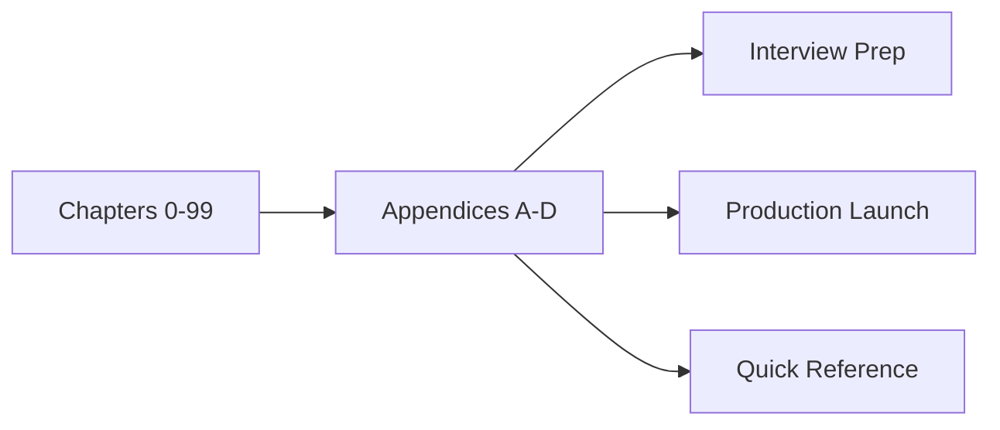
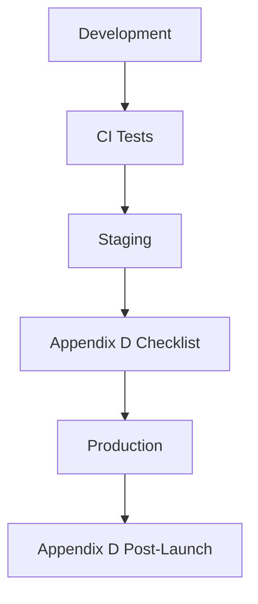

# Appendix A: Complexity Cheat Sheet

**Comprehensive Algorithms Guide — Reference Appendix**

---

## Learning Objectives

By the end of this appendix, you will be able to:

1. Quickly reference asymptotic complexity tables for classical and ml algorithms during study or interviews.
2. Apply tables and checklists to real design decisions.
3. Cross-link concepts to earlier chapters.
4. Use production checklists before shipping systems.
5. Prepare structured interview responses.
6. Compare algorithm families at a glance.
7. Maintain a personal study index from this material.

---

## Introduction

This appendix consolidates **complexity cheat sheet** for fast lookup. It complements Chapters 0–99 and is designed for interview prep, system design, and on-call reference.

---

## Real-World Motivation

Senior engineers rarely memorize every detail—they rely on curated references, checklists, and pattern libraries. This appendix is that library for algorithmic and AI systems work.

---

## Daily-Life Analogy

Like a pilot's checklist before takeoff: the appendix ensures you do not skip critical steps under pressure.

---

## Mathematical Intuition

Reference material groups complexity classes, notation, and metric definitions used throughout the book.

---

## Core Concepts

### Searching & Sorting

| Algorithm | Best | Average | Worst | Space | Chapter |
|-----------|------|---------|-------|-------|---------|
| Linear Search | O(1) | O(n) | O(n) | O(1) | 9 |
| Binary Search | O(1) | O(log n) | O(log n) | O(1) | 10 |
| BFS | O(V+E) | O(V+E) | O(V+E) | O(V) | 12 |
| DFS | O(V+E) | O(V+E) | O(V+E) | O(V) | 11 |
| Dijkstra | O((V+E) log V) | O((V+E) log V) | O((V+E) log V) | O(V) | 13 |
| Bellman-Ford | O(VE) | O(VE) | O(VE) | O(V) | 14 |
| A* | O(b^d) | O(b^d) | O(b^d) | O(b^d) | 15 |
| Merge Sort | O(n log n) | O(n log n) | O(n log n) | O(n) | 19 |
| Quick Sort | O(n log n) | O(n log n) | O(n²) | O(log n) | 20 |
| Heap Sort | O(n log n) | O(n log n) | O(n log n) | O(1) | 21 |
| Radix Sort | O(nk) | O(nk) | O(nk) | O(n+k) | 22 |

### Graph & ML

| Algorithm | Complexity | Space | Chapter |
|-----------|------------|-------|---------|
| Floyd-Warshall | O(V³) | O(V²) | 26 |
| Prim / Kruskal | O(E log V) | O(V+E) | 24–25 |
| PageRank (iter) | O(k·E) | O(V) | 28 |
| k-Means | O(n·k·d·i) | O(n·d) | 39 |
| DBSCAN | O(n log n) | O(n) | 41 |
| Random Forest train | O(t·n log n·d) | O(t·n) | 33 |
| CNN forward | O(k²·c·h·w) | O(activations) | 45 |
| Q-Learning | O(\|S\|·\|A\|·ep) | O(\|S\|·\|A\|) | 54 |
| DQN | O(ep·batch·forward) | O(params+replay) | 56 |
| PSO | O(swarm·dim·iter) | O(swarm·dim) | 60 |
| GA | O(pop·gen·fitness) | O(pop·chrom) | 68 |
| Gradient Descent | O(n·d·iter) | O(d) | 72 |

---

## Visual Diagram

---

## Step-by-Step Explanation

1. Identify your task (interview, deploy, debug).
2. Open the relevant appendix section.
3. Cross-reference linked chapters for depth.
4. Apply checklists or tables to your scenario.
5. Record gaps for further study.

---

## Python Implementation

Appendices are reference documents; runnable code lives in [`code/`](../../code/) by part and chapter.

---

## Code Walkthrough

N/A — reference appendix. See linked chapter modules for implementations.

---

## Expected Output

Faster decisions, fewer omitted production steps, and structured interview answers.

---

## Output Explanation

Use tables as starting points; always validate against your workload and SLOs.

---

## Time Complexity

Lookup is **O(1)** for humans with a good index; mastering content is **O(chapters studied)**.

---

## Space Complexity

Keep printed or offline copies for interviews without network access.

---

## Memory Usage

Bookmark frequently used sections in your editor or note-taking system.

---

## Performance Considerations

Prefer measured benchmarks over complexity alone when choosing algorithms.

---

## Common Mistakes

| Mistake | Symptom | Fix |
|---------|---------|-----|
| Rote memorization | Fragile interviews | Understand trade-offs |
| Skipping checklists | Incidents | Use Appendix D before launch |
| Ignoring context | Wrong algorithm | Match problem to constraints |

---

## Debugging Tips

1. Start from symptom → metric → component.
2. Compare to baseline from Appendix A complexity expectations.
3. Use glossary for precise terminology.

---

## Unit Tests

Appendix content is validated by book-wide `pytest` suites in [`tests/`](../../tests/).

---

## Benchmarking

See Part 12 Project 2 (Sorting Benchmark) and per-chapter benchmarking sections.

---

## Interview Questions

### Beginner (5)

1. What is Big-O notation?
2. Define overfitting.
3. What is a baseline model?
4. Name one graph traversal algorithm.
5. What does CI/CD mean for ML?

### Intermediate (5)

1. Compare BFS and Dijkstra.
2. When use Random Forest vs linear models?
3. Explain train/serve skew.
4. What is embedding dimension trade-off?
5. How detect data drift?

### Advanced (5)

1. Design RAG with citation grounding.
2. Shard a vector index at scale.
3. Multi-agent failure recovery.
4. Fairness metrics for classification.
5. Canary vs blue-green for models.

### System Design (3)

1. End-to-end ML platform for 50 teams.
2. Real-time feature store architecture.
3. LLM gateway with rate limits and audit logs.

### Coding Challenge (1)

Implement one algorithm from Appendix A from scratch with tests.

---

## Production Notes

- Treat appendices as living documents; update after incidents and retros.
- Share checklists in PR templates.
- Link runbooks to observability dashboards.

---

## Architecture Integration

---

## Best Practices

1. Print or pin complexity cheat sheet during study.
2. Maintain a personal glossary of project-specific terms.
3. Rehearse system design with Appendix C prompts.
4. Run production checklists on every release.

---

## Summary

**Appendix A** provides asymptotic complexity tables for classical and ml algorithms for the Comprehensive Algorithms Guide.

---

## Exercises

1. Memorize five complexity entries and explain each.
2. Answer three system design prompts aloud in 25 minutes.
3. Complete Appendix D checklist for a toy service.
4. Add ten glossary terms from your workplace.
5. Map five interview questions to specific chapters.

---

## Further Reading

- [CLRS Introduction to Algorithms](https://mitpress.mit.edu/9780262046305/introduction-to-algorithms/)
- [Designing Machine Learning Systems](https://www.oreilly.com/library/view/designing-machine-learning/9781098107956/)
- [Google SRE Workbook](https://sre.google/workbook/table-of-contents/)

---

**See also:** [SUMMARY.md](../../SUMMARY.md)
