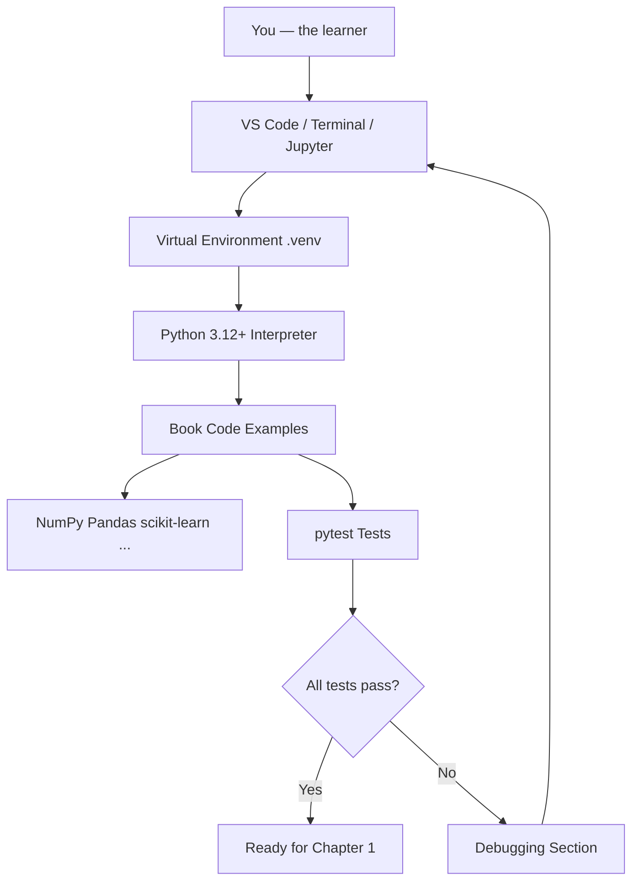

# Chapter 0: Setting Up Your Algorithm Learning Environment

**Part 0 — Environment Setup & Python Fundamentals**

---

## Learning Objectives

By the end of this chapter, you will be able to:

1. Install Python 3.12 or newer on your computer.
2. Create and activate a virtual environment to isolate project dependencies.
3. Install book dependencies from a pinned `requirements.txt` file.
4. Run Python scripts from the terminal and from VS Code.
5. Use Jupyter Notebook or Google Colab for interactive learning.
6. Measure how long code takes to run using `time.perf_counter()`.
7. Apply basic debugging techniques when programs fail.
8. Verify your setup with automated tests using `pytest`.
9. Explain why reproducible environments matter in professional engineering.

---

## Introduction

Before you study sorting, graphs, machine learning, or reinforcement learning, you need a reliable workspace. A professional algorithm learner does not run random code in a messy global Python installation. Instead, you create a **clean, repeatable environment** where every library version is known and every example can be rerun months later with the same result.

This chapter walks you through that setup step by step. We use **Python 3.12+** because it is modern, widely supported in industry, and works with all libraries used in this book. Every command and script in this chapter is runnable. If something fails, the debugging section will help you recover quickly.

---

## Real-World Motivation

At Google, Netflix, Amazon, and every serious software company, engineers do not share one giant Python install on a laptop. Teams use:

- **Virtual environments** or containers to avoid dependency conflicts.
- **Pinned versions** in `requirements.txt` or lock files so production matches development.
- **Automated tests** to confirm that setup scripts still work after upgrades.
- **Benchmarking tools** to measure whether an algorithm improvement is real or noise.

The habits you build in this chapter are the same habits senior engineers use before deploying routing engines, recommendation models, or fraud-detection pipelines. Your learning environment is the foundation of everything that follows.

---

## Daily-Life Analogy

Think of your computer like a kitchen.

- **Python** is the stove — the core tool that makes things work.
- **Libraries** (NumPy, Pandas, scikit-learn) are ingredients — flour, spices, oil.
- A **virtual environment** is a separate pantry for one recipe book. If you spill salt in the algorithms pantry, your web-development pantry stays clean.
- **`requirements.txt`** is the shopping list with exact brands and sizes so anyone can cook the same dish.
- **`pytest`** is a taste test before you serve the meal to guests.

A messy kitchen produces inconsistent food. A messy Python setup produces inconsistent algorithm results.

---

## Mathematical Intuition

This chapter introduces only one mathematical idea: **measurement**.

When we time an algorithm, we are estimating how long a process takes on your machine. Real runtimes depend on CPU speed, background programs, and cache behavior. That is why we use `time.perf_counter()` — it gives high-resolution timestamps suitable for comparing runs on the same computer.

You do not need calculus or linear algebra yet. You only need to understand that **we measure before we optimize**. Senior engineers never claim an algorithm is faster without showing numbers.

---

## Core Concepts

| Concept | Meaning |
|---------|---------|
| **Python interpreter** | Program that reads and executes Python code |
| **Virtual environment** | Isolated folder with its own Python packages |
| **`pip`** | Package installer for Python |
| **`requirements.txt`** | List of packages and versions for reproducible installs |
| **IDE** | Integrated development environment (e.g., VS Code) |
| **REPL** | Read-Eval-Print Loop; interactive Python shell |
| **Script** | `.py` file executed as a program |
| **Unit test** | Small automated check that code behaves correctly |
| **Benchmark** | Timed run used to compare performance |

---

## Visual Diagram: Your Learning Environment



---

## Step-by-Step Explanation

### Step 1: Install Python 3.12 or Newer

**Windows**

1. Visit [https://www.python.org/downloads/](https://www.python.org/downloads/)
2. Download Python 3.12 or newer.
3. Run the installer.
4. Check **"Add Python to PATH"**.
5. Open Command Prompt and run:

```bash
python --version
```

Expected output (version may vary):

```text
Python 3.12.7
```

**macOS**

```bash
# Using Homebrew (recommended)
brew install python@3.12
python3.12 --version
```

**Linux (Ubuntu/Debian)**

```bash
sudo apt update
sudo apt install python3.12 python3.12-venv python3-pip
python3.12 --version
```

### Step 2: Clone or Download This Book Repository

```bash
git clone <your-repository-url>
cd comprehensive-algorithms-guide
```

If you received the book as a ZIP file, extract it and `cd` into the `comprehensive-algorithms-guide` folder.

### Step 3: Create a Virtual Environment

A virtual environment keeps book dependencies separate from other projects.

```bash
python3.12 -m venv .venv
```

**Activate the environment:**

| OS | Command |
|----|---------|
| macOS / Linux | `source .venv/bin/activate` |
| Windows (CMD) | `.venv\Scripts\activate.bat` |
| Windows (PowerShell) | `.venv\Scripts\Activate.ps1` |

After activation, your prompt often shows `(.venv)`.

Verify you are using the environment Python:

```bash
which python    # macOS/Linux
where python    # Windows
```

### Step 4: Upgrade pip and Install Dependencies

```bash
python -m pip install --upgrade pip
pip install -r requirements.txt
```

Installation may take several minutes because libraries like PyTorch and TensorFlow are large. For Chapter 0, you only need the packages used in the verification scripts. The full list prepares you for later chapters.

### Step 5: Run Your First Successful Program

```bash
python code/part-00/first_successful_run.py
```

### Step 6: Run Tests

```bash
pytest tests/part-00/ -v
```

### Step 7: Open the Project in VS Code

1. Install [Visual Studio Code](https://code.visualstudio.com/).
2. Install the **Python** extension by Microsoft.
3. Open the `comprehensive-algorithms-guide` folder.
4. Press `Ctrl+Shift+P` (or `Cmd+Shift+P` on Mac).
5. Type **Python: Select Interpreter** and choose `.venv/bin/python`.

### Step 8: Optional — Use Jupyter Notebook

```bash
pip install jupyter
jupyter notebook
```

Create a new notebook and run:

```python
import sys
print(sys.version)
```

### Step 9: Optional — Use Google Colab

1. Visit [https://colab.research.google.com/](https://colab.research.google.com/)
2. Upload a chapter notebook or clone the repository.
3. Colab provides a free GPU for deep learning chapters later.

Note: Colab environments reset. For reproducibility, always record package versions.

---

## Python Implementation

### Program 1: First Successful Run

**What this code does:** Prints a welcome banner and confirms your Python version and platform.

See the full source file: [`code/part-00/first_successful_run.py`](../../code/part-00/first_successful_run.py)

```python
#!/usr/bin/env python3
"""First successful run for the Comprehensive Algorithms Guide."""

from __future__ import annotations

import platform
import sys


def main() -> None:
    """Print a welcome banner and environment details."""
    python_version: str = platform.python_version()
    implementation: str = platform.python_implementation()

    print("=" * 60)
    print("Comprehensive Algorithms Guide — Environment Check")
    print("=" * 60)
    print(f"Python version     : {python_version}")
    print(f"Implementation     : {implementation}")
    print(f"Executable         : {sys.executable}")
    print(f"Platform           : {platform.system()} {platform.release()}")
    print("-" * 60)
    print("Status             : SUCCESS")
    print("Your environment is ready for Chapter 0 exercises.")
    print("=" * 60)


if __name__ == "__main__":
    main()
```

### Program 2: Measure Execution Time

**What this code does:** Computes the sum of squares from 1 to 1,000,000 and prints how long it took.

See: [`code/part-00/measure_execution_time.py`](../../code/part-00/measure_execution_time.py)

```python
#!/usr/bin/env python3
"""Measure execution time for a simple algorithm-style loop."""

from __future__ import annotations

import time


def sum_squares(n: int) -> int:
    """Compute sum of i*i for i in 1..n."""
    if n < 0:
        raise ValueError("n must be non-negative")
    total: int = 0
    for i in range(1, n + 1):
        total += i * i
    return total


def main() -> None:
    """Run sum_squares with timing."""
    n: int = 1_000_000
    start: float = time.perf_counter()
    result: int = sum_squares(n)
    elapsed: float = time.perf_counter() - start

    print(f"sum_squares({n:,}) = {result:,}")
    print(f"Elapsed time: {elapsed:.6f} seconds")


if __name__ == "__main__":
    main()
```

### Program 3: Verify Package Imports

**What this code does:** Confirms that core libraries installed from `requirements.txt` can be imported.

See: [`code/part-00/verify_packages.py`](../../code/part-00/verify_packages.py)

Run after installing dependencies:

```bash
python code/part-00/verify_packages.py
```

---

## Code Walkthrough

### `first_successful_run.py`

| Line | Explanation |
|------|-------------|
| `from __future__ import annotations` | Enables modern type-hint syntax |
| `import platform` | Access OS and Python version info |
| `import sys` | Access interpreter path and exit codes |
| `def main() -> None:` | Entry function with return type `None` |
| `platform.python_version()` | Returns version string like `3.12.7` |
| `sys.executable` | Path to the Python binary in use |
| `if __name__ == "__main__":` | Runs `main()` only when script is executed directly |

### `measure_execution_time.py`

| Line | Explanation |
|------|-------------|
| `time.perf_counter()` | High-resolution timer for benchmarks |
| `for i in range(1, n + 1)` | Classic loop — foundation for many algorithms |
| `total += i * i` | Accumulator pattern |
| `f"{n:,}"` | Formats integers with thousands separators |

---

## Expected Output

### `first_successful_run.py`

```text
============================================================
Comprehensive Algorithms Guide — Environment Check
============================================================
Python version     : 3.12.7
Implementation     : CPython
Executable         : /path/to/comprehensive-algorithms-guide/.venv/bin/python
Platform           : Linux 6.12.94
------------------------------------------------------------
Status             : SUCCESS
Your environment is ready for Chapter 0 exercises.
============================================================
```

Your paths and version numbers will differ. **SUCCESS** is what matters.

### `measure_execution_time.py`

```text
sum_squares(1,000,000) = 333,333,833,333,500,000
Elapsed time: 0.142387 seconds
```

Elapsed time varies by hardware. On a fast CPU it may be under 0.2 seconds.

### `pytest tests/part-00/ -v`

```text
tests/part-00/test_chapter_00.py::test_first_successful_run_exits_zero PASSED
tests/part-00/test_chapter_00.py::test_sum_squares_small_values PASSED
tests/part-00/test_chapter_00.py::test_sum_squares_rejects_negative PASSED
tests/part-00/test_chapter_00.py::test_measure_execution_time_runs PASSED

============================== 4 passed in 0.52s ==============================
```

---

## Output Explanation

- **Python version** confirms you are on 3.12+ as required by this book.
- **Executable path** should point inside `.venv` when the virtual environment is active.
- **sum_squares result** is deterministic — the same input always produces the same output.
- **Elapsed time** is machine-dependent but should be stable across repeated runs on the same machine with low background load.
- **pytest PASSED** means your environment can run and test book code automatically.

---

## Time Complexity

For `sum_squares(n)`, the loop runs `n` times, so time complexity is **O(n)**.

Environment setup itself is **O(1)** from an algorithms perspective — it is a one-time human and I/O operation, not an algorithm you will benchmark in production.

---

## Space Complexity

`sum_squares` uses **O(1)** extra space — only a few variables regardless of `n`.

Your virtual environment on disk uses **O(p)** space where `p` is the number and size of installed packages. This is expected.

---

## Memory Usage

For `n = 1_000_000`, memory usage remains small (a few integers). Later chapters will discuss memory for large graphs, matrices, and neural networks.

To observe memory in Python:

```python
import tracemalloc

tracemalloc.start()
result = sum(range(1_000_001))
current, peak = tracemalloc.get_traced_memory()
tracemalloc.stop()
print(f"Current: {current / 1024:.2f} KiB, Peak: {peak / 1024:.2f} KiB")
```

---

## Performance Considerations

1. **Always activate `.venv`** before running book code — wrong interpreter means wrong packages.
2. **Close heavy background apps** when benchmarking — browsers and IDEs affect timings.
3. **Run benchmarks multiple times** and take the median, not a single run.
4. **Use `perf_counter`**, not `time.time()`, for short measurements.
5. **Pin versions** — unpinned installs can break examples silently.

---

## Common Mistakes

| Mistake | Symptom | Fix |
|---------|---------|-----|
| Forgot to activate venv | `ModuleNotFoundError` | Run `source .venv/bin/activate` |
| Used `python` vs `python3` | Wrong version | Use `python3.12` explicitly |
| Installed packages globally | Conflicts with other projects | Create a fresh `.venv` |
| Skipped `pip install -r requirements.txt` | Import errors | Install from requirements file |
| Running tests from wrong directory | File not found | `cd comprehensive-algorithms-guide` first |
| PATH not set on Windows | `python` not recognized | Reinstall with "Add to PATH" checked |

---

## Debugging Tips

### 1. Read the Full Error Message

Python tracebacks read bottom-to-top. The last line usually states the error type and message.

### 2. Check Your Interpreter

In VS Code, confirm the bottom status bar shows `.venv`.

```bash
python -c "import sys; print(sys.executable)"
```

### 3. Verify a Package

```bash
python -c "import numpy; print(numpy.__version__)"
```

### 4. Use `print` Debugging

Insert temporary `print` statements to inspect variable values. Remove them after fixing the bug.

### 5. Use the Debugger

In VS Code, click left of a line number to set a breakpoint, then press **F5**.

### 6. Re-run Tests

```bash
pytest tests/part-00/ -v --tb=short
```

The `--tb=short` flag shows shorter tracebacks.

---

## Unit Tests

This chapter includes automated tests in [`tests/part-00/test_chapter_00.py`](../../tests/part-00/test_chapter_00.py).

**Why tests matter:** Senior engineers treat setup scripts like production code. If the environment check breaks, every downstream chapter breaks.

Run tests:

```bash
pytest tests/part-00/ -v
```

With coverage:

```bash
pytest tests/part-00/ -v --cov=code/part-00 --cov-report=term-missing
```

---

## Benchmarking

Example using `timeit`:

```python
import timeit

elapsed = timeit.timeit(
    "sum_squares(100_000)",
    setup="from measure_execution_time import sum_squares",
    number=10,
)
print(f"Average of 10 runs: {elapsed / 10:.6f} seconds")
```

**What can go wrong:** First run may be slower due to caching. **Improvement:** Use `timeit` with multiple iterations and report min, median, and max.

---

## Interview Questions

### Beginner (5)

1. What is a virtual environment and why should you use one?
2. What is the difference between `python` and `pip`?
3. What does `if __name__ == "__main__"` do?
4. How do you check your installed Python version?
5. What is `requirements.txt` used for?

### Intermediate (5)

1. Explain the difference between `time.time()` and `time.perf_counter()`.
2. How would you reproduce a colleague's Python environment on your laptop?
3. What is the purpose of type hints in Python?
4. How does `pytest` discover and run tests?
5. Why might two machines report different runtimes for the same O(n) algorithm?

### Advanced (5)

1. Compare virtual environments, Docker containers, and conda environments for ML projects.
2. How would you design a CI pipeline step that verifies `requirements.txt` is consistent?
3. Explain how import caching affects benchmark repeatability.
4. What security risks exist when running `pip install` from unpinned dependencies?
5. How would you support both CPU-only and GPU-enabled installs from one repository?

### System Design (3)

1. How would you package algorithm training code for deployment across dev, staging, and production?
2. Design a developer onboarding flow for a team of 50 ML engineers with reproducible environments.
3. How would you monitor environment drift in production ML services?

### Coding Challenge (1)

Write a function `environment_report() -> dict` that returns Python version, platform, and whether each package in `REQUIRED_PACKAGES` is installed. Include a pytest test.

---

## Production Notes

In production systems:

- **Never deploy without pinned dependencies.** Use lock files (`pip-tools`, Poetry, uv) in real projects.
- **Containerize** training and serving workloads (Docker) for parity across machines.
- **CI/CD** should run `pytest` on every pull request, including smoke tests for imports.
- **Secrets** (API keys) belong in environment variables, never in code or `requirements.txt`.
- **Observability:** log Python version and package versions at service startup for debugging incidents.

Companies like Netflix and Amazon rebuild environments from scratch in CI. Treat your laptop setup as a miniature version of that discipline.

---

## Architecture Integration

How environment setup fits into a real ML system:


| Stage | Role |
|-------|------|
| Virtual env | Local reproducibility |
| requirements.txt | Declares dependencies |
| pytest | Gates bad code before merge |
| Docker | Identical runtime in cloud |
| Monitoring | Detects version skew and drift |

---

## Best Practices

1. One virtual environment per project.
2. Pin versions in `requirements.txt`.
3. Run tests before and after installing new packages.
4. Document your OS and Python version when reporting bugs.
5. Use type hints and docstrings from day one.
6. Keep chapter code in the `code/` folder; do not scatter scripts.
7. Commit `requirements.txt`; never commit `.venv/`.

---

## Engineering Notes

### Beginner Note

Many beginners install packages with `pip install numpy` globally, then wonder why examples break later. Always activate `.venv` first. If lost, delete `.venv`, recreate it, and reinstall from `requirements.txt`.

### Intermediate Note

`requirements.txt` pins versions but does not resolve transitive dependencies automatically. For larger projects, consider `pip-tools` (`pip-compile`) or Poetry. For this book, pinned direct dependencies are sufficient.

### Senior Engineer Note

Production teams separate **build environments** from **runtime environments**. Training may need CUDA and large ML frameworks; inference may use ONNX Runtime or a slim API container. Environment design is a trade-off between reproducibility, image size, security surface, and cold-start latency. The habit of pinning versions and testing imports is the same whether you are on a laptop or deploying to Kubernetes at scale.

---

## Summary

In this chapter you:

- Installed Python 3.12+ and created a virtual environment.
- Installed pinned dependencies from `requirements.txt`.
- Ran your first verification script and timing example.
- Executed unit tests with `pytest`.
- Learned debugging, benchmarking, and production-minded environment practices.

You are now ready for mathematical foundations and algorithm fundamentals.

---

## Exercises

### Exercise 1 — Environment Report

Write a script that prints Python version, active virtual env (if any), and current working directory.

### Exercise 2 — Timing Comparison

Modify `sum_squares` to use `n = 100_000`, `500_000`, and `1_000_000`. Record elapsed times. Is the relationship linear?

### Exercise 3 — Package Detective

Pick three packages from `requirements.txt`. For each, print its version and one sentence about what it is used for in this book.

### Exercise 4 — Debug on Purpose

Remove the `if n < 0` check from `sum_squares`, call `sum_squares(-5)`, and document the behavior. Restore the check afterward.

### Exercise 5 — Colab or Jupyter

Run the first successful program in Jupyter or Colab. Note any differences from local execution.

---

## Further Reading

- [Python Official Documentation — venv](https://docs.python.org/3/library/venv.html)
- [pip User Guide](https://pip.pypa.io/en/stable/user_guide/)
- [pytest Documentation](https://docs.pytest.org/)
- [PEP 8 — Style Guide for Python Code](https://peps.python.org/pep-0008/)
- [Visual Studio Code Python Tutorial](https://code.visualstudio.com/docs/python/python-tutorial)
- [Google Colab FAQ](https://research.google.com/colaboratory/faq.html)

---

**Next chapter:** Part 0.5 — Mathematical Foundations *(pending — reply **Continue** to generate)*
