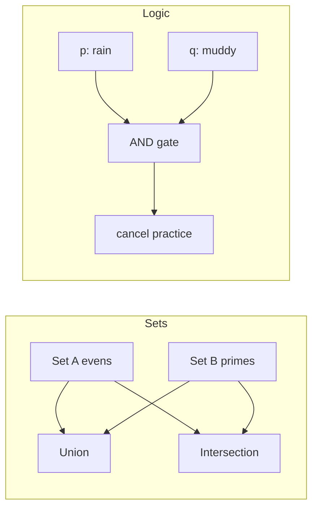
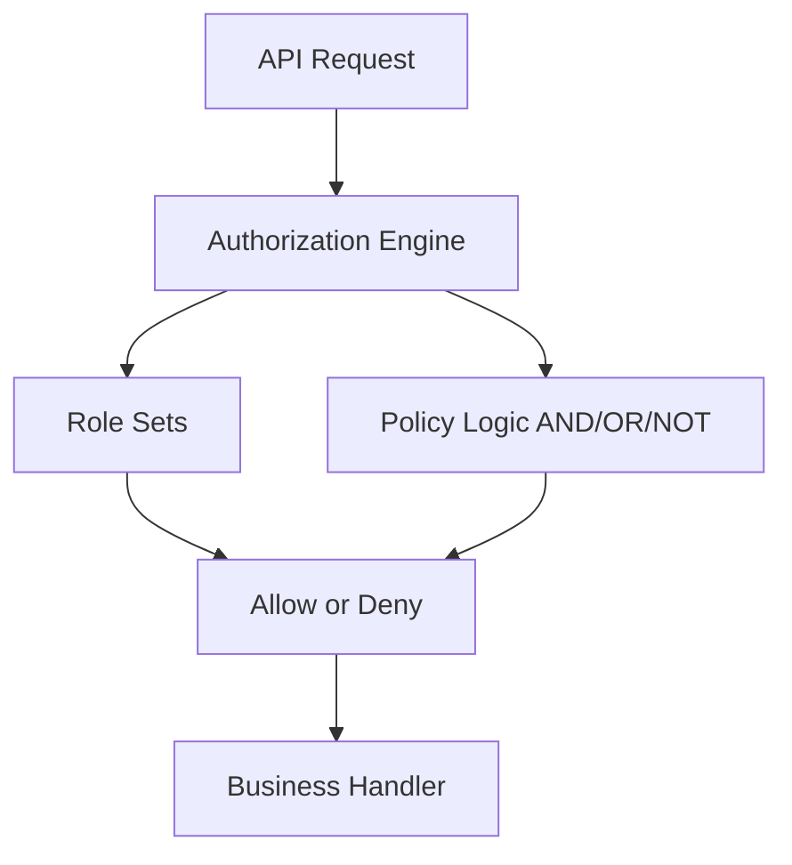

# Chapter 1: Functions, Sets, and Logic

**Part 0.5 — Mathematical Foundations**

---

## Learning Objectives

By the end of this chapter, you will be able to:

1. Define functions, domains, codomains, and mappings (injective, surjective, bijective).
2. Perform set operations: union, intersection, difference, and symmetric difference.
3. Construct and reason about power sets of finite collections.
4. Evaluate propositional logic with AND, OR, implication, IFF, and XOR.
5. Translate real-world classification problems into set membership statements.
6. Implement set and logic utilities in Python with type hints.
7. Verify function properties programmatically on finite domains.
8. Connect discrete math foundations to algorithm correctness proofs.

---

## Introduction

Algorithms manipulate **data** and make **decisions**. Under the hood, both activities rest on three mathematical pillars: **functions** (input-to-output rules), **sets** (collections of distinct objects), and **logic** (true/false reasoning). Before you analyze graph traversals or train neural networks, you need a shared vocabulary for describing what an algorithm accepts, what it produces, and when its steps are valid.

This chapter builds that vocabulary with runnable Python examples. You will not need advanced calculus yet — only clear thinking about collections and truth values.

---

## Real-World Motivation

- **Databases** use set operations (`UNION`, `INTERSECT`) to combine query results.
- **Access control** expresses permissions as sets of users and resources.
- **Search engines** deduplicate URLs using set membership.
- **Machine learning** defines training sets, validation sets, and label spaces as sets.
- **Type systems** in programming languages are logic applied to code correctness.

Every time you filter a list, join two tables, or check `if user in admins`, you are using sets and logic.

---

## Daily-Life Analogy

Imagine organizing a school club:

- **Set A** = students who play chess.
- **Set B** = students who play music.
- **A ∩ B** = students who do both.
- **A ∪ B** = everyone in either activity.
- A **function** `grade(student)` maps each student to a letter grade.
- The statement "If it rains **and** the field is muddy, practice is canceled" is propositional logic.

Sets tell you *who belongs*; functions tell you *how things map*; logic tells you *when rules fire*.

---

## Mathematical Intuition

A **function** `f: A → B` assigns exactly one output in `B` to each input in `A`. Think of a vending machine: one button press → one item (not zero, not two).

A **set** has no duplicates and no order (in the mathematical sense). `{1, 2}` equals `{2, 1}`.

**Logic** combines truth values. Implication `p → q` is false only when `p` is true and `q` is false — a subtle rule that mirrors "if precondition holds, postcondition must hold" in algorithms.

---

## Core Concepts

| Concept | Definition |
|---------|------------|
| **Function** | Rule mapping each domain element to exactly one codomain element |
| **Injective** | Distinct inputs → distinct outputs (one-to-one) |
| **Surjective** | Every codomain element is hit by some input (onto) |
| **Bijective** | Both injective and surjective; invertible |
| **Union (A ∪ B)** | Elements in A or B or both |
| **Intersection (A ∩ B)** | Elements in both A and B |
| **Power set P(S)** | Set of all subsets of S; size `2^|S|` |
| **Proposition** | Statement that is true or false |
| **Implication** | `p → q` ≡ `¬p ∨ q` |

---

## Visual Diagram (Mermaid)



---

## Step-by-Step Explanation

### Step 1: Define Sets

Create Python `set` objects for two collections. Sets automatically deduplicate.

### Step 2: Compute Set Operations

Use `|`, `&`, `-`, and `^` for union, intersection, difference, and symmetric difference.

### Step 3: Test Injectivity

For a finite domain, track outputs in a `set`. If an output repeats before the domain ends, the function is not injective on that domain.

### Step 4: Build a Power Set

For `n` elements, iterate masks `0 .. 2^n - 1`. Each bit selects whether element `i` is in the subset.

### Step 5: Evaluate Logic Operators

Map English rules to boolean operators. Implication is the operator most beginners confuse with "and."

---

## Python Implementation

See [`code/part-05/sets_logic.py`](../../code/part-05/sets_logic.py).

```python
from sets_logic import set_operations, is_injective, evaluate_proposition, power_set

evens = {2, 4, 6, 8}
primes = {2, 3, 5, 7}
print(set_operations(evens, primes))
print(is_injective(lambda x: x * 2, range(5)))
print(evaluate_proposition(True, False, "implies"))
print([set(s) for s in power_set(["a", "b"])])
```

Run:

```bash
python code/part-05/sets_logic.py
```

---

## Code Walkthrough

| Function | Role |
|----------|------|
| `set_operations` | Returns union, intersection, difference, symmetric difference |
| `is_injective` | Checks one-to-one property on a finite iterable domain |
| `power_set` | Enumerates all subsets via bit masks |
| `evaluate_proposition` | Evaluates binary logical operators safely |

Key pattern: use `frozenset` for hashable subsets in the power set result.

---

## Expected Output

```text
Set A (evens): [2, 4, 6, 8]
Set B (primes): [2, 3, 5, 7]
  union: [2, 3, 4, 5, 6, 7, 8]
  intersection: [2]
  difference: [4, 6, 8]
  symmetric_difference: [3, 4, 5, 6, 7, 8]

Double is injective on [0, 1, 2, 3, 4]: True

Logic: p=True, q=False
  and: False
  or: True
  implies: False
  iff: False
  xor: True

Power set of {a, b} (4 subsets):
  set()
  {'a'}
  {'b'}
  {'a', 'b'}
```

---

## Output Explanation

- **Intersection `{2}`** — only 2 is both even and prime.
- **Injectivity of doubling** — each input maps to a unique doubled value on `0..4`.
- **`implies: False`** — when `p` is true and `q` is false, implication fails.
- **Four subsets** — for 2 elements, `2^2 = 4` subsets including the empty set.

---

## Time Complexity

| Operation | Complexity |
|-----------|------------|
| Set union/intersection on sizes `n`, `m` | O(n + m) average for hash sets |
| `is_injective` on domain size `n` | O(n) time, O(n) extra space for seen outputs |
| `power_set` on `n` elements | O(n · 2^n) — exponential |

---

## Space Complexity

- Set operations: O(n + m) to store results.
- Power set: O(2^n) subsets, each up to size n → O(n · 2^n) total space.

---

## Memory Usage

For `power_set` with `n = 20`, you would create over one million subsets — avoid large power sets in production. Use sets for membership tests, not full power-set enumeration, unless `n` is tiny.

---

## Performance Considerations

1. Prefer Python `set` for O(1) average membership tests.
2. Never enumerate power sets for `n > 25` without a strong reason.
3. For large universes, use Bloom filters (probabilistic membership) in production systems.
4. Injective checks require storing all outputs — not feasible for infinite domains.

---

## Common Mistakes

| Mistake | Fix |
|---------|-----|
| Treating lists as sets | Convert with `set(lst)` if order and duplicates do not matter |
| Confusing `⊂` with `∈` | Subset vs element membership |
| Assuming implication is bidirectional | `p → q` does not mean `q → p` |
| Using mutable sets as dict keys | Use `frozenset` |

---

## Debugging Tips

1. Print intermediate sets with `sorted(s)` for readable output.
2. For logic bugs, build a truth table with nested loops over `(p, q) ∈ {T,F}²`.
3. When injectivity fails, print the first colliding inputs.
4. Run `pytest tests/part-05/test_chapter_01.py -v` after changes.

---

## Unit Tests

Tests live in [`tests/part-05/test_chapter_01.py`](../../tests/part-05/test_chapter_01.py).

```bash
pytest tests/part-05/test_chapter_01.py -v
```

---

## Benchmarking

```python
import timeit
from sets_logic import set_operations

a, b = set(range(10_000)), set(range(5_000, 15_000))
elapsed = timeit.timeit(lambda: set_operations(a, b), number=1000)
print(f"1000 set ops: {elapsed:.4f}s")
```

Set operations on 10k elements are fast; power-set enumeration is not.

---

## Interview Questions

### Beginner (5)

1. What is the difference between a set and a list in Python?
2. What does `A ∩ B` mean?
3. When is a function injective?
4. What is the truth value of `True and False`?
5. How many subsets does a set with 3 elements have?

### Intermediate (5)

1. Prove that `|P(S)| = 2^|S|` for finite S.
2. Explain why hash sets give average O(1) membership.
3. Write truth tables for `p → q` and `¬p ∨ q` and show they match.
4. When is a function bijective?
5. How would you test surjectivity on a finite codomain?

### Advanced (5)

1. Relate set partitions to equivalence relations.
2. Explain Russell's paradox and how axiomatic set theory avoids it.
3. Compare ZFC foundations vs type theory for algorithm specifications.
4. What is the inclusion-exclusion principle? Give a formula for |A ∪ B ∪ C|.
5. How do characteristic functions represent sets in analysis?

### System Design (3)

1. Design a permission system using sets and role hierarchies.
2. How would you deduplicate a billion URLs with bounded memory?
3. Design a feature-flag evaluation engine using boolean logic trees.

### Coding Challenge (1)

Implement `is_bijective(f, domain, codomain)` for finite iterables and write pytest cases.

---

## Production Notes

- Use database `UNION`/`INTERSECT` for set semantics at scale; do not load entire tables into Python sets.
- Authorization policies (RBAC/ABAC) compile to logical predicates — test edge cases like empty roles.
- Cache set membership in Redis for hot paths; watch memory for large key sets.

---

## Architecture Integration



Sets and logic sit at the gateway of most secure systems.

---

## Best Practices

1. Name sets for what they *contain*, not how they are stored.
2. Use `frozenset` when subsets must be hashable.
3. Document function domains and codomains in docstrings.
4. Build truth tables for complex business rules before coding.
5. Prefer set comprehensions over manual loops for clarity.

---

## Engineering Notes

### Beginner Note

If `A & B` confuses you, draw two overlapping circles (Venn diagram). Elements in the overlap belong to both sets. Python's `&` operator does exactly that.

### Intermediate Note

Injective/surjective/bijective properties depend on the **declared domain and codomain**. `f(x) = x²` is not injective on all reals (since `f(-2) = f(2)`), but it is injective on non-negative reals.

### Senior Engineer Note

Formal specifications (TLA+, Alloy) express system invariants as logical formulas over sets and functions. Investing in discrete math pays off when you need to prove that a distributed cache invalidation protocol cannot serve stale membership sets.

---

## Summary

You learned functions, sets, and propositional logic — the language of algorithm inputs, outputs, and correctness. Python's `set` type and boolean operators make these ideas executable. Power sets grow exponentially; injectivity checks are linear on finite domains. These tools recur in every later chapter.

---

## Exercises

1. Implement `is_surjective(f, domain, codomain)` and test it.
2. Build a truth table printer for all five operators in `evaluate_proposition`.
3. Given sets of skills for job candidates, find candidates with at least 3 matching skills.
4. Prove that `A - B = A ∩ Bᶜ` using Python sets on random small universes.
5. Model a simple access rule: `admin OR (member AND verified)`.

---

## Further Reading

- [MIT Mathematics for Computer Science — Sets & Logic](https://ocw.mit.edu/courses/6-042j-mathematics-for-computer-science-fall-2010/)
- [Python `set` documentation](https://docs.python.org/3/library/stdtypes.html#set)
- [Stanford Encyclopedia — Propositional Logic](https://plato.stanford.edu/entries/logic-propositional/)

---

**Next chapter:** [Chapter 2: Probability and Statistics](./chapter-02-probability-statistics.md)
