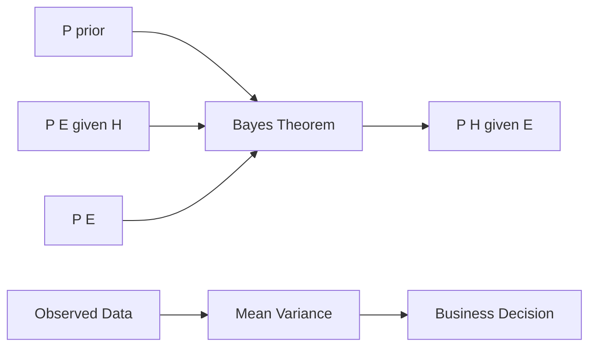
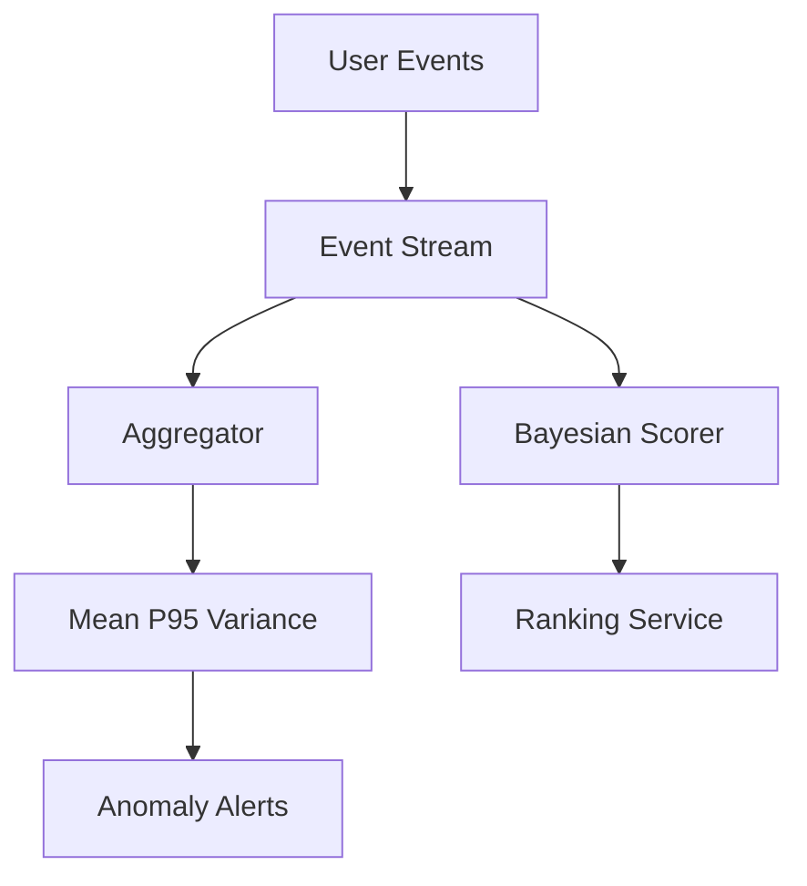

# Chapter 2: Probability and Statistics

**Part 0.5 — Mathematical Foundations**

---

## Learning Objectives

By the end of this chapter, you will be able to:

1. Compute empirical probabilities from observed data.
2. Apply Bayes' theorem to update beliefs with evidence.
3. Calculate mean, variance, and standard deviation of a dataset.
4. Use the binomial distribution for repeated independent trials.
5. Distinguish population vs sample statistics.
6. Implement probability utilities in Python with validation.
7. Interpret summary statistics for algorithm benchmarking noise.
8. Connect probability to machine learning and randomized algorithms.

---

## Introduction

Algorithms rarely operate in a perfectly predictable world. Network latency varies, users click randomly, and machine learning models output **probabilities** rather than certainties. **Probability** quantifies uncertainty; **statistics** summarizes data drawn from uncertain processes.

This chapter gives you the minimum toolkit: frequencies, Bayes' rule, descriptive statistics, and the binomial model. These ideas underpin A/B testing, spam filters, and stochastic optimization later in the book.

---

## Real-World Motivation

- **Spam filters** update P(spam | word) using Bayes' theorem.
- **A/B tests** compare conversion rates with statistical confidence.
- **Load balancers** model request arrival as random processes.
- **Monte Carlo algorithms** use random sampling for approximate answers.
- **ML classifiers** output calibrated probabilities for decisions.

Without probability, you cannot reason about noise in benchmarks or model confidence.

---

## Daily-Life Analogy

Weather forecast: "60% chance of rain" means that in similar conditions, rain occurred 60% of the time historically. If you see dark clouds (**evidence**), you update your belief — that is Bayes' theorem in everyday thinking.

Rolling a fair die: each face has probability 1/6. Roll 100 times and count sixes — the **empirical** fraction approximates 1/6.

---

## Mathematical Intuition

**Probability** lives in [0, 1]. Certainty is 1; impossibility is 0.

**Bayes' theorem** reverses conditioning:

`P(H|E) = P(E|H) · P(H) / P(E)`

**Variance** measures spread around the mean. Low variance → data clustered; high variance → noisy.

**Binomial(n, p)**: number of successes in `n` independent trials with success probability `p`.

---

## Core Concepts

| Concept | Meaning |
|---------|---------|
| **Sample space** | Set of all possible outcomes |
| **Event** | Subset of sample space |
| **Empirical probability** | Relative frequency in observed data |
| **Prior / Posterior** | Belief before / after seeing evidence |
| **Mean (μ)** | Average value |
| **Variance (σ²)** | Average squared deviation from mean |
| **Binomial PMF** | P(X=k) for k successes in n trials |

---

## Visual Diagram (Mermaid)



---

## Step-by-Step Explanation

### Step 1: Count Frequencies

Use `Counter` or a loop to count category occurrences.

### Step 2: Compute Empirical Probability

`P(event) ≈ count(event) / total`.

### Step 3: Apply Bayes' Theorem

Plug in prior, likelihood, and evidence. Evidence must be positive.

### Step 4: Summarize Numeric Data

Compute mean, then variance as average of squared deviations.

### Step 5: Model Repeated Trials

Use binomial PMF when trials are independent with fixed success probability.

---

## Python Implementation

See [`code/part-05/probability_basics.py`](../../code/part-05/probability_basics.py).

```bash
python code/part-05/probability_basics.py
```

Key functions: `empirical_probability`, `bayes_posterior`, `mean_and_variance`, `binomial_pmf`, `summarize_distribution`.

---

## Code Walkthrough

| Function | Purpose |
|----------|---------|
| `empirical_probability` | Frequency-based probability estimate |
| `bayes_posterior` | Updates prior with likelihood and normalizes by evidence |
| `mean_and_variance` | Population mean and variance |
| `binomial_pmf` | Exact binomial probability using `math.comb` |
| `summarize_distribution` | One-call descriptive summary |

Validation: reject empty samples, zero evidence, and invalid probability ranges.

---

## Expected Output

```text
Empirical P(heads) from ['heads', 'tails', 'heads', 'heads', 'tails']: 0.600

Bayes posterior P(spam|keyword): 0.5333

Sample summary:
  mean: 5.0000
  variance: 4.0000
  std_dev: 2.0000
  min: 2.0000
  max: 9.0000
  count: 8.0000

Binomial(10, 0.5) at k=3: 0.117188
```

---

## Output Explanation

- **0.600 heads** — 3 of 5 flips (small sample → high uncertainty).
- **Posterior ~0.53** — evidence increased spam belief from 10% prior.
- **Variance 4.0** — spread around mean 5 for the toy dataset.
- **Binomial PMF** — probability of exactly 3 heads in 10 fair flips.

---

## Time Complexity

| Operation | Complexity |
|-----------|------------|
| Empirical probability | O(n) over n outcomes |
| Mean/variance | O(n) |
| Binomial PMF | O(1) with `math.comb` for moderate n |

---

## Space Complexity

All functions use O(1) extra space beyond input storage (excluding output dict).

---

## Memory Usage

Summarizing millions of values in Python lists is memory-heavy. For production, use streaming algorithms (Welford's online variance) or NumPy arrays.

---

## Performance Considerations

1. Use NumPy for large numeric arrays.
2. For binomial with huge `n`, use normal approximation or log-space computations.
3. Cache expensive likelihood computations in Bayesian pipelines.
4. Report confidence intervals, not just point estimates.

---

## Common Mistakes

| Mistake | Fix |
|---------|-----|
| Treating small-sample frequency as truth | Report sample size |
| Forgetting P(E) in Bayes | Compute total evidence |
| Using sample variance formula with n-1 vs n | Document which you use |
| Assuming independence without justification | State assumptions explicitly |

---

## Debugging Tips

1. Check probabilities sum to ~1 over exhaustive events.
2. Print prior, likelihood, evidence, posterior in Bayes pipelines.
3. Compare empirical vs theoretical with large simulations.
4. Run `pytest tests/part-05/test_chapter_02.py -v`.

---

## Unit Tests

[`tests/part-05/test_chapter_02.py`](../../tests/part-05/test_chapter_02.py)

```bash
pytest tests/part-05/test_chapter_02.py -v
```

---

## Benchmarking

```python
import timeit
from probability_basics import summarize_distribution

data = [float(i % 100) for i in range(1_000_000)]
elapsed = timeit.timeit(lambda: summarize_distribution(data), number=10)
print(f"10 summaries of 1M points: {elapsed:.3f}s")
```

Prefer NumPy for this scale in production.

---

## Interview Questions

### Beginner (5)

1. What is probability between 0 and 1?
2. How do you compute empirical probability?
3. What is the mean of [2, 4, 6]?
4. What does standard deviation measure?
5. In 100 fair coin flips, expected number of heads?

### Intermediate (5)

1. State Bayes' theorem in words and symbols.
2. Difference between population and sample variance?
3. When is the binomial distribution appropriate?
4. What is conditional probability P(A|B)?
5. Why can two algorithms with same mean runtime differ in variance?

### Advanced (5)

1. Explain the law of large numbers.
2. Derive Bayes' theorem from the definition of conditional probability.
3. When does the binomial approximate a normal distribution?
4. Compare Bayesian vs frequentist interpretations.
5. How does cross-validation reduce overfitting statistically?

### System Design (3)

1. Design an A/B testing platform with statistical significance checks.
2. How would you monitor anomaly rates with streaming quantiles?
3. Design a spam classifier feedback loop updating priors safely.

### Coding Challenge (1)

Implement Welford's online algorithm for mean and variance in one pass; add pytest tests.

---

## Production Notes

- Log sample sizes with all reported metrics.
- Use calibrated probabilities for user-facing risk scores.
- Guard against division by zero in evidence terms.
- Store random seeds for reproducible stochastic algorithms.

---

## Architecture Integration



---

## Best Practices

1. Always state assumptions (independence, stationarity).
2. Report uncertainty (confidence intervals, credible intervals).
3. Validate inputs are in [0, 1] for probabilities.
4. Use `math.comb` instead of manual factorial ratios.
5. Separate training statistics from live production statistics.

---

## Engineering Notes

### Beginner Note

Probability answers "how likely?" not "will it happen?" A 90% success rate still fails 1 time in 10 on average.

### Intermediate Note

For A/B tests, you need both effect size and sample size. A 0.1% lift may be real but undetectable with 1,000 users per arm.

### Senior Engineer Note

Production systems track **distributions**, not just means. P99 latency drives SLOs. Bayesian online updates power fraud detection but require careful prior selection and concept-drift monitoring.

---

## Summary

Probability models uncertainty; statistics summarizes data. You implemented empirical frequencies, Bayes' theorem, descriptive stats, and binomial probabilities. These tools explain noisy benchmarks and underpin ML and randomized algorithms throughout the book.

---

## Exercises

1. Simulate 10,000 coin flips; compare empirical P(heads) to 0.5.
2. Extend `summarize_distribution` with median and percentiles.
3. Compute P(spam|two keywords) assuming independence — discuss the flaw.
4. Plot binomial PMFs for n=20 and varying p using matplotlib.
5. Estimate variance of algorithm runtime over 50 runs.

---

## Further Reading

- [Khan Academy — Probability & Statistics](https://www.khanacademy.org/math/statistics-probability)
- [scipy.stats documentation](https://docs.scipy.org/doc/scipy/reference/stats.html)
- [Think Stats by Allen Downey](https://greenteapress.com/thinkstats/)

---

**Previous:** [Chapter 1: Functions, Sets, and Logic](./chapter-01-functions-sets-logic.md) · **Next:** [Chapter 3: Vectors, Matrices, and Linear Algebra](./chapter-03-linear-algebra.md)
