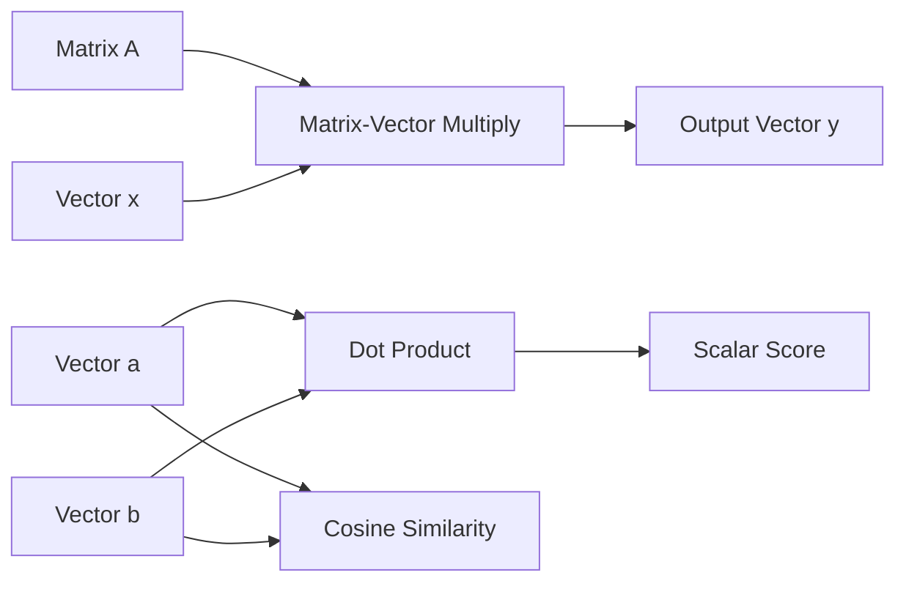
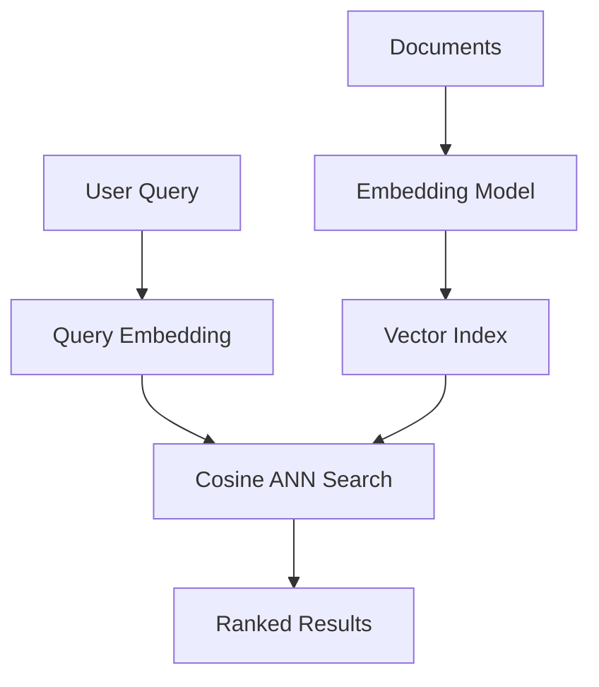

# Chapter 3: Vectors, Matrices, and Linear Algebra Intuition

**Part 0.5 — Mathematical Foundations**

---

## Learning Objectives

By the end of this chapter, you will be able to:

1. Represent data as vectors and perform dot products.
2. Compute vector norms and cosine similarity.
3. Multiply matrices by vectors and interpret the result geometrically.
4. Transpose matrices and reason about dimensions.
5. Connect linear algebra to embeddings, recommendations, and neural networks.
6. Implement core operations in pure Python before using NumPy.
7. Validate dimension compatibility in matrix operations.
8. Explain why linear algebra is the language of machine learning.

---

## Introduction

A **vector** is an ordered list of numbers — a data point, a word embedding, a pixel row. A **matrix** is a table of numbers that often represents a linear transformation: rotation, scaling, or a layer in a neural network. **Linear algebra** studies how vectors and matrices interact.

You do not need to master eigenvalues today. You need fluency with dot products, matrix-vector multiplication, and similarity — the operations behind search ranking, collaborative filtering, and deep learning.

---

## Real-World Motivation

- **Search engines** rank documents by cosine similarity to a query vector.
- **Recommendation systems** multiply user-feature matrices by item-feature matrices.
- **Computer graphics** apply transformation matrices to 3D coordinates.
- **Neural networks** are chains of matrix multiplications plus nonlinearities.
- **PCA and SVD** compress high-dimensional data for visualization and ML.

---

## Daily-Life Analogy

A restaurant review as a vector: `[taste, service, price]` with scores 1–5. Two reviewers are "similar" if their review vectors point in similar directions — cosine similarity captures that better than raw distance when magnitude differs.

A matrix is like a factory assembly line: input ingredients (vector) enter; each output row is a weighted mix of inputs.

---

## Mathematical Intuition

**Dot product** `a · b = Σ aᵢbᵢ` measures alignment. Positive → same general direction; zero → orthogonal.

**Norm** `||v|| = √(v · v)` is length.

**Cosine similarity** = `(a · b) / (||a|| ||b||)` ∈ [-1, 1] — direction similarity ignoring scale.

**Matrix-vector multiply**: if `A` is `m×n` and `x` is `n×1`, result `Ax` is `m×1`. Row `i` of `A` dots with `x`.

---

## Core Concepts

| Concept | Definition |
|---------|------------|
| **Vector** | Ordered n-tuple of scalars |
| **Dot product** | Sum of element-wise products |
| **L2 norm** | Euclidean length |
| **Cosine similarity** | Normalized dot product |
| **Matrix** | Rectangular array; rows × columns |
| **Transpose** | Swap rows and columns |
| **Dimension mismatch** | Incompatible sizes for multiplication |

---

## Visual Diagram (Mermaid)



---

## Step-by-Step Explanation

### Step 1: Represent Vectors as Lists

Use `list[float]` with type hints for clarity.

### Step 2: Compute Dot Product

Zip corresponding elements, multiply, sum. Fail fast on length mismatch.

### Step 3: Compute Norm and Cosine Similarity

Divide dot product by product of norms; handle zero vectors.

### Step 4: Matrix-Vector Multiply

Each output element is dot product of a matrix row with the vector.

### Step 5: Transpose

New row `j` contains old column `j` elements.

---

## Python Implementation

See [`code/part-05/linear_algebra_basics.py`](../../code/part-05/linear_algebra_basics.py).

```bash
python code/part-05/linear_algebra_basics.py
```

---

## Code Walkthrough

| Function | Role |
|----------|------|
| `dot_product` | Core inner product with validation |
| `vector_norm` | L2 length via `sqrt(sum of squares)` |
| `matrix_vector_multiply` | Applies linear transformation |
| `cosine_similarity` | Normalized similarity for embeddings |
| `transpose` | Swaps rows/columns |

Later chapters replace these with NumPy for speed: `np.dot`, `@`, `np.linalg.norm`.

---

## Expected Output

```text
u = [1.0, 2.0, 3.0]
v = [4.0, 5.0, 6.0]
dot(u, v) = 32.0
||u|| = 3.7417
cosine_similarity(u, v) = 0.974632

Matrix:
  [1.0, 2.0]
  [3.0, 4.0]
Times vector [1.0, 0.0] = [1.0, 3.0]

Transpose:
  [1.0, 3.0]
  [2.0, 4.0]
```

---

## Output Explanation

- **Dot 32** = 1×4 + 2×5 + 3×6.
- **High cosine** (~0.97) — vectors nearly parallel.
- **First column extraction** — multiplying by `[1,0]` picks column 1 of the matrix.
- **Transpose** swaps (1,2) with (2,1).

---

## Time Complexity

| Operation | Complexity |
|-----------|------------|
| Dot product of length n | O(n) |
| Matrix-vector m×n | O(mn) |
| Transpose m×n | O(mn) |

---

## Space Complexity

O(1) extra for dot/norm; O(mn) for transpose output.

---

## Memory Usage

A dense `10000×10000` float matrix uses ~800 MB. Sparse matrices (scipy.sparse) are essential for large graphs and text corpora.

---

## Performance Considerations

1. Use NumPy/BLAS for large linear algebra — 100–1000× faster than pure Python loops.
2. Prefer float32 on GPUs when precision allows.
3. Batch matrix multiplies (GEMM) for neural network efficiency.
4. Normalize embeddings once, store unit vectors for fast cosine via dot product.

---

## Common Mistakes

| Mistake | Fix |
|---------|-----|
| Dimension mismatch in multiply | Check `cols(A) == len(x)` |
| Confusing dot product with element-wise product | Dot sums; `*` in NumPy broadcasts |
| Zero vector in cosine similarity | Return 0 or raise — document choice |
| Ragged matrices | Validate equal row lengths |

---

## Debugging Tips

1. Print shapes: `(m, n)` for matrices, `n` for vectors.
2. Test identity matrix multiplication preserves vector.
3. Compare pure Python vs NumPy on small inputs.
4. `pytest tests/part-05/test_chapter_03.py -v`

---

## Unit Tests

[`tests/part-05/test_chapter_03.py`](../../tests/part-05/test_chapter_03.py)

---

## Benchmarking

```python
import timeit
import numpy as np

a = np.random.randn(1000, 1000)
x = np.random.randn(1000)
elapsed = timeit.timeit(lambda: a @ x, number=100)
print(f"100 mat-vec 1000x1000: {elapsed:.3f}s")
```

---

## Interview Questions

### Beginner (5)

1. What is a vector?
2. How do you compute a dot product?
3. What does matrix transpose do?
4. What is cosine similarity used for?
5. Can you multiply a 3×2 matrix by a length-3 vector?

### Intermediate (5)

1. Geometric meaning of dot product = 0?
2. Why is cosine similarity preferred for text embeddings?
3. Complexity of multiplying m×n by n×p matrices?
4. What is an identity matrix?
5. Difference between rank and dimension?

### Advanced (5)

1. Explain eigenvalues and eigenvectors intuitively.
2. What does SVD decompose?
3. Why do neural networks need non-linear activations if composition of linear maps is linear?
4. Condition number and numerical stability.
5. Compare dense vs sparse matrix storage.

### System Design (3)

1. Design a vector similarity search service for 100M embeddings.
2. How would you shard a large matrix multiplication across GPUs?
3. Design feature storage for real-time recommendation scoring.

### Coding Challenge (1)

Implement 2×2 matrix multiplication and verify `(AB)x = A(Bx)` numerically.

---

## Production Notes

- Store embeddings normalized to unit length for ANN indexes (FAISS, ScaNN).
- Use mixed precision (FP16/BF16) on accelerators with loss scaling.
- Monitor numerical overflow in large dot products.

---

## Architecture Integration



---

## Best Practices

1. Validate dimensions at API boundaries.
2. Use NumPy for n > 100; pure Python for teaching.
3. Document whether vectors are row or column conventions.
4. Cache transposes when reused in hot loops.
5. Unit test with identity and zero vectors.

---

## Engineering Notes

### Beginner Note

Think of a vector as a point or arrow in space. The dot product tells you how much two arrows align.

### Intermediate Note

In NumPy, `a @ b` for 1D arrays is dot product; for 2D it's matrix multiply. Know your shapes.

### Senior Engineer Note

Production similarity search rarely brute-forces billions of dot products. Approximate nearest neighbor (ANN) indexes trade recall for latency. Linear algebra is still the math underneath — but systems engineering picks the data structure.

---

## Summary

Vectors represent data; matrices transform data. Dot products and cosine similarity power search and recommendations. Matrix-vector multiplication is the core operation of neural networks. Pure Python builds intuition; NumPy delivers scale.

---

## Exercises

1. Implement matrix-matrix multiplication and test associativity.
2. Find cosine similarity between TF-IDF vectors of two short documents.
3. Apply a 2D rotation matrix to point (1, 0).
4. Compare `np.dot` vs loop timing for n=5000.
5. Explain why ||a+b|| ≤ ||a|| + ||b|| (triangle inequality).

---

## Further Reading

- [3Blue1Brown — Essence of Linear Algebra](https://www.3blue1brown.com/topics/linear-algebra)
- [NumPy linear algebra](https://numpy.org/doc/stable/reference/routines.linalg.html)
- [Strang, Introduction to Linear Algebra](https://math.mit.edu/~gs/linearalgebra/)

---

**Previous:** [Chapter 2: Probability and Statistics](./chapter-02-probability-statistics.md) · **Next:** [Chapter 4: Calculus and Optimization](./chapter-04-calculus-optimization.md)
