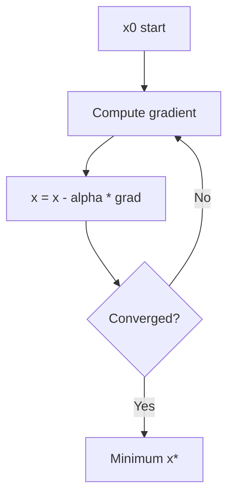
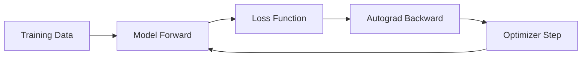

# Chapter 4: Calculus and Optimization Intuition

**Part 0.5 — Mathematical Foundations**

---

## Learning Objectives

By the end of this chapter, you will be able to:

1. Interpret derivatives as rates of change and slopes.
2. Approximate derivatives numerically with finite differences.
3. Apply gradient descent to minimize simple functions.
4. Use Newton's method to find roots.
5. Explain the role of learning rate in optimization.
6. Connect calculus to loss minimization in machine learning.
7. Implement and test 1D optimization routines in Python.
8. Recognize convergence and divergence in iterative algorithms.

---

## Introduction

**Calculus** studies change. **Optimization** finds inputs that minimize (or maximize) an objective. Together they power gradient descent, backpropagation, and hyperparameter tuning. You do not need to integrate by hand for most engineering work — but you must understand *what a gradient means* and *why learning rate matters*.

This chapter implements numerical derivatives, gradient descent, and Newton's method in one dimension. The ideas extend directly to multivariate loss surfaces in deep learning.

---

## Real-World Motivation

- **Neural networks** minimize loss via stochastic gradient descent.
- **Logistic regression** optimizes cross-entropy with gradient methods.
- **Engineering** tunes parameters (PID controllers, queue thresholds) by minimizing cost.
- **Operations research** solves supply-chain cost minimization.
- **Root finding** appears in IRR calculations and physics simulations.

---

## Daily-Life Analogy

Driving uphill: the **slope** (derivative) tells you how steep the road is. To reach the valley (minimum), step **downhill** — opposite to the gradient. Step too large and you overshoot; too small and you crawl.

Newton's method is like guessing where a parabola crosses zero and refining — fast when close, fragile when far.

---

## Mathematical Intuition

**Derivative** `f'(x)` ≈ `(f(x+h) - f(x-h)) / 2h` for small `h`.

**Gradient descent**: `x ← x - α · f'(x)` where `α` is learning rate.

**Newton's method**: `x ← x - f(x)/f'(x)` for root finding.

**Convex bowl** `(x-2)²` has unique minimum at x=2; gradient descent converges with appropriate α.

---

## Core Concepts

| Concept | Meaning |
|---------|---------|
| **Derivative** | Instantaneous rate of change |
| **Finite difference** | Numerical derivative approximation |
| **Gradient** | Multivariate generalization (here: 1D derivative) |
| **Learning rate** | Step size α in descent |
| **Convergence** | Iterates approach solution |
| **Newton's method** | Second-order root-finding using f and f' |

---

## Visual Diagram (Mermaid)



---

## Step-by-Step Explanation

### Step 1: Numerical Derivative

Evaluate `f` at `x+h` and `x-h`; central difference reduces error vs forward difference.

### Step 2: Define Objective and Gradient

For `(x-2)²`, gradient is `2(x-2)`.

### Step 3: Gradient Descent Loop

Repeat update for fixed iterations or until change < tolerance.

### Step 4: Newton's Method for Roots

Requires `f` and `f'`; stops when `|f(x)| < tol`.

### Step 5: Compare to Exact Answer

`sqrt(2)` from root of `x²-2`; minimum of `(x-2)²` at 2.

---

## Python Implementation

See [`code/part-05/calculus_optimization.py`](../../code/part-05/calculus_optimization.py).

```bash
python code/part-05/calculus_optimization.py
```

---

## Code Walkthrough

| Function | Role |
|----------|------|
| `numerical_derivative` | Central finite difference |
| `gradient_descent` | Iterative minimization using supplied gradient |
| `newton_method` | Root finding with derivative |

Design: pass callables `f`, `grad_f`, `df` — same pattern as autograd frameworks.

---

## Expected Output

```text
d/dx(x^2) at x=3: approximate = 6.000000, exact = 6

Gradient descent minimum near x=2.000000
  first 5 iterates: [10.0, 7.6, 5.72, 4.304, 3.2128]
  last 3 iterates:  [2.0001, 2.0001, 2.0]

Newton root of x^2 - 2 = 0: 1.4142135624
sqrt(2) reference:            1.4142135624
```

---

## Output Explanation

- **Derivative ~6** at x=3 for `x²` — matches `2x`.
- **Descent converges to 2** — minimum of `(x-2)²`.
- **Newton finds √2** — classic demo of quadratic convergence near root.

---

## Time Complexity

| Algorithm | Per-iteration | Total |
|-----------|---------------|-------|
| Gradient descent | O(1) per step for 1D | O(steps) |
| Newton's method | O(1) evals of f, f' | O(iterations) typically fewer than GD for roots |
| Numerical derivative | O(1) function evals | Constant per point |

---

## Space Complexity

O(steps) if storing history; O(1) if only tracking current x.

---

## Memory Usage

History lists for debugging are fine in notebooks; drop them in production optimizers.

---

## Performance Considerations

1. Analytical gradients beat numerical when available (faster, more accurate).
2. Line search and adaptive learning rates (Adam, RMSprop) help in ML.
3. Newton's method needs invertible Hessian in multivariate case — expensive.
4. Choose `h` carefully for finite differences (~√ε for float64).

---

## Common Mistakes

| Mistake | Fix |
|---------|-----|
| Learning rate too large | Divergence — reduce α |
| Learning rate too small | Slow convergence — increase or use schedule |
| Zero derivative in Newton | Abort or perturb |
| Using forward diff only | Prefer central difference for accuracy |

---

## Debugging Tips

1. Plot objective vs iteration count.
2. Log gradient magnitude each step.
3. Compare numerical vs analytical gradient (gradient check).
4. `pytest tests/part-05/test_chapter_04.py -v`

---

## Unit Tests

[`tests/part-05/test_chapter_04.py`](../../tests/part-05/test_chapter_04.py)

---

## Benchmarking

```python
import timeit
from calculus_optimization import gradient_descent

grad = lambda x: 2.0 * (x - 2.0)
elapsed = timeit.timeit(
    lambda: gradient_descent(grad, 10.0, 0.3, 1000), number=1000
)
print(f"1000 x 1000-step descents: {elapsed:.3f}s")
```

---

## Interview Questions

### Beginner (5)

1. What does a derivative represent geometrically?
2. What is gradient descent trying to do?
3. What happens if learning rate is too big?
4. What is a local minimum?
5. Why do we minimize loss in ML?

### Intermediate (5)

1. Difference between gradient descent and Newton's method?
2. What is a convex function?
3. Why use central finite differences?
4. What is learning rate scheduling?
5. Explain chain rule role in backpropagation.

### Advanced (5)

1. Compare SGD, momentum, Adam optimizers.
2. What is the Hessian and when is Newton-Raphson preferred?
3. Explain vanishing/exploding gradients.
4. Lipschitz continuity and convergence proofs.
5. Constrained optimization and Lagrange multipliers overview.

### System Design (3)

1. Design a hyperparameter tuning service with early stopping.
2. How would you distribute large-scale gradient descent training?
3. Design safe rollout of online learning with loss monitoring.

### Coding Challenge (1)

Implement 2D gradient descent on `f(x,y)=x²+y²` with numerical partial derivatives.

---

## Production Notes

- Log loss and gradient norms per training step.
- Use gradient clipping for RNNs and unstable architectures.
- Checkpoint optimizer state (Adam moments) with model weights.
- Separate training (batch) from inference (no gradient) code paths.

---

## Architecture Integration



Calculus powers the backward pass; optimization updates parameters.

---

## Best Practices

1. Prefer analytical gradients from autograd (PyTorch, JAX).
2. Start with conservative learning rates; tune on validation loss.
3. Normalize features so loss landscapes are well-conditioned.
4. Set random seeds and log hyperparameters for reproducibility.
5. Test optimizers on known convex functions before production ML.

---

## Engineering Notes

### Beginner Note

Gradient descent is "walk downhill." The gradient points uphill; we step opposite.

### Intermediate Note

In 1D, derivative sign tells direction. In n-D, gradient is a vector pointing steepest uphill.

### Senior Engineer Note

Production training uses mixed precision, distributed data parallel, and learning rate warmup. The 1D routines here are pedagogical — real systems call `torch.optim` with careful monitoring of loss spikes indicating bad batches or too-large LR.

---

## Summary

Derivatives measure change; gradient descent minimizes objectives; Newton's method finds roots. You implemented all three numerically. These patterns underpin every gradient-based learner in the rest of this book.

---

## Exercises

1. Minimize `f(x)=(x-5)²` from x=0 with varying learning rates — plot convergence.
2. Implement bisection method and compare to Newton for `x²-2`.
3. Gradient-check `numerical_derivative` against known functions.
4. Add early stopping when `|grad| < ε` to `gradient_descent`.
5. Explain why GD on non-convex loss can get stuck in local minima.

---

## Further Reading

- [Khan Academy — Derivatives & Optimization](https://www.khanacademy.org/math/calculus-1)
- [PyTorch Optimization tutorial](https://pytorch.org/tutorials/beginner/basics/optimization_tutorial.html)
- [Boyd & Vandenberghe, Convex Optimization](https://web.stanford.edu/~boyd/cvxbook/)

---

**Previous:** [Chapter 3: Linear Algebra](./chapter-03-linear-algebra.md) · **Next:** [Chapter 5: What Is an Algorithm?](../part-01-algorithm-fundamentals/chapter-05-what-is-an-algorithm.md)
