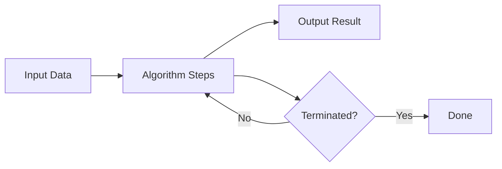
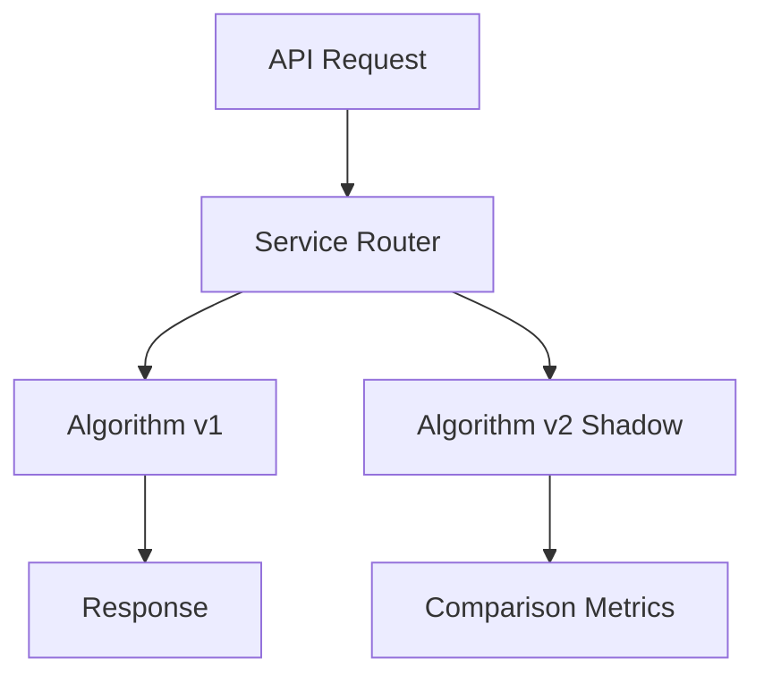

# Chapter 5: What Is an Algorithm?

**Part 1 — Algorithm Fundamentals**

---

## Learning Objectives

By the end of this chapter, you will be able to:

1. Define an algorithm as a finite, unambiguous sequence of steps.
2. Identify inputs, outputs, and termination conditions.
3. Distinguish algorithms from programs and heuristics.
4. Explain correctness, finiteness, and definiteness (Euclid's criteria).
5. Implement and verify simple algorithms in Python.
6. Use the Euclidean GCD as a model of efficient iterative algorithms.
7. Test algorithms systematically with input-output cases.
8. Relate algorithmic thinking to real software engineering tasks.

---

## Introduction

An **algorithm** is a recipe. It takes **input**, follows **definite steps**, and produces **output**, then **stops**. Every app feature — sorting a feed, routing a package, recommending a movie — is an algorithm plus data structures plus engineering.

This chapter formalizes the idea without heavy math. You will implement linear search and the Euclidean GCD algorithm, and learn to verify behavior with test cases.

---

## Real-World Motivation

- **GPS navigation** runs shortest-path algorithms on road graphs.
- **Payment systems** use fraud-detection algorithms on transaction streams.
- **Compilers** apply parsing and optimization algorithms to source code.
- **Databases** execute query planning algorithms to choose indexes.

Calling something "AI" does not remove the need for clear algorithmic steps — it adds statistical and optimization layers on top.

---

## Daily-Life Analogy

A cake recipe is an algorithm:

- **Input**: flour, eggs, sugar.
- **Steps**: mix, bake at 180°C for 30 minutes.
- **Output**: cake.
- **Termination**: timer rings.

If a step says "add some sugar" without amount, the recipe is not an algorithm — it lacks **definiteness**.

---

## Mathematical Intuition

Historically, an algorithm must be:

1. **Finite** — terminates after bounded steps.
2. **Definite** — each step is precisely specified.
3. **Effective** — each step is doable in practice.
4. **Input/Output** — consumes and produces well-defined data.

**Correctness**: for every valid input, output satisfies the specification.

---

## Core Concepts

| Concept | Definition |
|---------|------------|
| **Algorithm** | Finite sequence of instructions solving a class of problems |
| **Program** | Algorithm implemented in a language on a machine |
| **Heuristic** | Rule of thumb without guaranteed optimality |
| **Specification** | Precise statement of required input-output behavior |
| **Verification** | Checking outputs against expected results |
| **Invariant** | Property true throughout loop execution (preview) |

---

## Visual Diagram (Mermaid)



---

## Step-by-Step Explanation

### Step 1: Specify the Problem

Example: "Given integers a, b ≥ 0, return gcd(a, b)."

### Step 2: Design Steps

Euclid: replace (a, b) with (b, a mod b) until b = 0.

### Step 3: Implement in Python

Translate each step to code with clear variable names.

### Step 4: Verify on Test Cases

Compare outputs to known answers.

### Step 5: Analyze Resources

Count operations — preview of Big-O in Chapter 7.

---

## Python Implementation

See [`code/part-01/what_is_algorithm.py`](../../code/part-01/what_is_algorithm.py).

```bash
python code/part-01/what_is_algorithm.py
```

---

## Code Walkthrough

| Function | Role |
|----------|------|
| `linear_search` | Simple scan — O(n) baseline algorithm |
| `euclidean_gcd` | Classic iterative algorithm with loop invariant |
| `verify_algorithm` | Generic test harness for deterministic functions |

The GCD loop invariant: `gcd(a, b) = gcd(original_a, original_b)` at each iteration.

---

## Expected Output

```text
linear_search([10, 20, 30, 40, 50], 30) -> index 2

GCD examples:
  gcd(48, 18) = 6
  gcd(101, 10) = 1
  gcd(0, 7) = 7

Factorial verification failures: none
```

---

## Output Explanation

- **Index 2** — 30 is third element (0-based index 2).
- **gcd(48,18)=6** — largest integer dividing both.
- **gcd(0,7)=7** — edge case: gcd(0, b) = b.
- **No failures** — factorial matches expected mapping.

---

## Time Complexity

| Algorithm | Complexity |
|-----------|------------|
| `linear_search` on n items | O(n) |
| `euclidean_gcd` | O(log min(a,b)) — logarithmic in value |

---

## Space Complexity

Both algorithms use O(1) extra space beyond input.

---

## Memory Usage

Negligible for scalar integers. Algorithm memory concerns arise with large graphs and matrices in later chapters.

---

## Performance Considerations

1. Choose the right algorithm for problem size — linear search is fine for tiny lists.
2. Document preconditions (non-negative GCD inputs).
3. Prefer library implementations (`math.gcd`) in production after learning.
4. Profile before optimizing — correctness first.

---

## Common Mistakes

| Mistake | Fix |
|---------|-----|
| Infinite loops | Ensure progress measure decreases (b → a mod b) |
| Ambiguous specs | Write examples before coding |
| Skipping edge cases | Test 0, 1, empty, duplicates |
| Confusing algorithm with implementation detail | Spec is language-agnostic |

---

## Debugging Tips

1. Trace small inputs on paper.
2. Add assertions for invariants inside loops.
3. Use `verify_algorithm` with edge-case dicts.
4. `pytest tests/part-01/test_chapter_05.py -v`

---

## Unit Tests

[`tests/part-01/test_chapter_05.py`](../../tests/part-01/test_chapter_05.py)

---

## Benchmarking

```python
import timeit
from what_is_algorithm import euclidean_gcd

elapsed = timeit.timeit(lambda: euclidean_gcd(10**9, 10**9 - 1), number=10000)
print(f"10k GCD on large ints: {elapsed:.4f}s")
```

Euclid remains fast even for large integers.

---

## Interview Questions

### Beginner (5)

1. What is an algorithm?
2. Difference between algorithm and program?
3. What does it mean for an algorithm to terminate?
4. What is linear search?
5. What is GCD?

### Intermediate (5)

1. State loop invariant for Euclidean GCD.
2. How do you verify algorithm correctness?
3. Algorithm vs heuristic — example of each?
4. What is pseudo-code and why use it?
5. When is brute force acceptable?

### Advanced (5)

1. Church-Turing thesis in one paragraph.
2. Halting problem — why undecidable?
3. Randomized vs deterministic algorithms.
4. Amortized analysis preview.
5. Formal verification vs testing trade-offs.

### System Design (3)

1. Design a job scheduler with fair termination guarantees.
2. How would you version algorithm upgrades in production?
3. Design A/B routing between two ranking algorithms.

### Coding Challenge (1)

Implement extended Euclidean algorithm returning (gcd, x, y) with ax + by = gcd.

---

## Production Notes

- Version and document algorithm changes in changelogs.
- Feature flags for rolling out new ranking logic.
- Shadow traffic to compare old vs new algorithm outputs.
- Log algorithm version with each decision for auditability.

---

## Architecture Integration



---

## Best Practices

1. Write the specification before the implementation.
2. Name functions after what they compute, not how.
3. Validate inputs at public API boundaries.
4. Keep algorithms pure (no hidden global state) when possible.
5. Pair every algorithm with representative tests.

---

## Engineering Notes

### Beginner Note

An algorithm is the idea; Python code is one expression of that idea. You could implement the same GCD in Java, Rust, or on paper.

### Intermediate Note

`math.gcd` in the standard library uses Euclid's algorithm. Read the docs, then read the source — learning from battle-tested code is a senior habit.

### Senior Engineer Note

Production systems combine algorithms with SLAs, caching, and fallbacks. The GCD function is correct, but a payment router also needs timeouts, idempotency keys, and circuit breakers. Algorithmic correctness is necessary, not sufficient.

---

## Summary

An algorithm is a finite, definite procedure from input to output. Linear search and Euclidean GCD illustrate scanning and iterative reduction. Verification with test cases is how engineers earn trust in code. Part 1 continues with data structures, complexity, and design techniques.

---

## Exercises

1. Write pseudo-code for finding the maximum of a list.
2. Implement binary search preview — compare steps to linear search.
3. Prove gcd(a,b) = gcd(b, a mod b) for b > 0.
4. List three algorithms you use daily without thinking.
5. Add docstring examples (doctest style) to `euclidean_gcd`.

---

## Further Reading

- [CLRS Introduction — Algorithms](https://mitpress.mit.edu/9780262046305/introduction-to-algorithms/)
- [Python `math.gcd`](https://docs.python.org/3/library/math.html#math.gcd)
- [Knuth, The Art of Computer Programming, Vol. 1](https://www-cs-faculty.stanford.edu/~knuth/taocp.html)

---

**Previous:** [Chapter 4: Calculus and Optimization](../part-00-mathematical-foundations/chapter-04-calculus-optimization.md) · **Next:** [Chapter 6: Essential Data Structures](./chapter-06-essential-data-structures.md)
