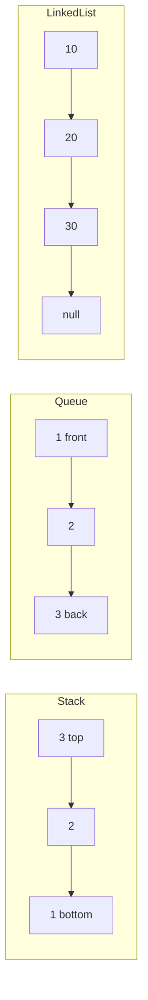
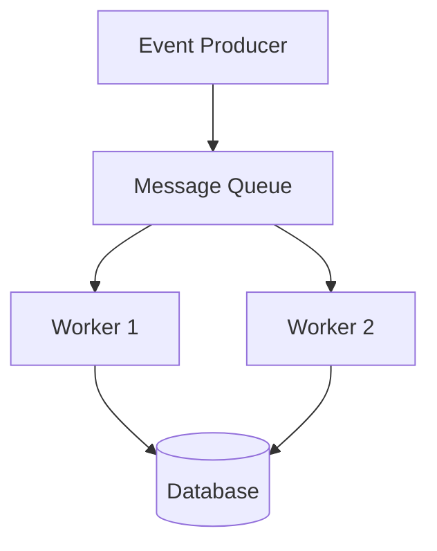

# Chapter 6: Essential Data Structures

**Part 1 — Algorithm Fundamentals**

---

## Learning Objectives

By the end of this chapter, you will be able to:

1. Explain stacks (LIFO) and queues (FIFO) and their use cases.
2. Implement stack and queue abstractions with type hints.
3. Describe linked lists and contrast them with Python lists.
4. Choose appropriate structures for BFS, DFS, and undo operations.
5. Analyze basic time complexity of push/pop/enqueue/dequeue.
6. Build and traverse a singly linked list.
7. Recognize when Python's built-in `list` and `deque` suffice.
8. Connect data structures to upcoming graph and tree algorithms.

---

## Introduction

An **algorithm** operates on **data structures** — ways to organize data for efficient access and update. The wrong structure can turn an elegant algorithm into a slow bottleneck. The right structure makes simple code fast.

This chapter covers stacks, queues, and linked lists — foundational building blocks for parsing, scheduling, graph traversal, and memory management concepts.

---

## Real-World Motivation

- **Undo/redo** in editors uses stacks of states.
- **Print job queues** and **message brokers** use FIFO queues.
- **BFS** on graphs uses a queue; **DFS** uses a stack (explicit or call stack).
- **Linked lists** underpin many custom memory allocators and LRU caches.

---

## Daily-Life Analogy

- **Stack**: plates in a cafeteria — last placed is first taken (LIFO).
- **Queue**: line at a coffee shop — first in line is served first (FIFO).
- **Linked list**: treasure hunt — each clue points to the next location.

---

## Mathematical Intuition

Abstract data types (ADTs) separate **what** operations exist from **how** they are implemented.

| ADT | Core ops | Typical use |
|-----|----------|-------------|
| Stack | push, pop, peek | DFS, parsing, undo |
| Queue | enqueue, dequeue | BFS, scheduling |
| Linked list | insert, traverse | dynamic sequences |

Python `list` is a dynamic array (amortized O(1) append/pop end); `deque` gives O(1) both ends.

---

## Core Concepts

| Structure | Access pattern | Key operations |
|-----------|----------------|----------------|
| **Stack** | LIFO | push O(1), pop O(1) |
| **Queue** | FIFO | enqueue O(1), dequeue O(1) with deque |
| **Linked list** | Sequential | insert O(1) at known node; search O(n) |
| **Dynamic array** | Index O(1) | append amortized O(1) |

---

## Visual Diagram (Mermaid)



---

## Step-by-Step Explanation

### Step 1: Implement Stack

Use list `append` and `pop` for O(1) end operations.

### Step 2: Implement Queue

Use `collections.deque` — `append` right, `popleft` left.

### Step 3: Define Linked List Node

`value` plus `next` pointer.

### Step 4: Build from Python List

Iterate values, chain nodes.

### Step 5: Flatten to List

Walk pointers until `None`.

---

## Python Implementation

See [`code/part-01/data_structures.py`](../../code/part-01/data_structures.py).

```bash
python code/part-01/data_structures.py
```

---

## Code Walkthrough

| Component | Notes |
|-----------|-------|
| `Stack[T]` | Generic via `TypeVar`; raises on empty pop |
| `Queue[T]` | Backed by `deque` for O(1) dequeue |
| `LinkedListNode` | Singly linked; no prev pointer |
| `build_linked_list` | O(n) construction |
| `linked_list_to_list` | O(n) traversal |

Generics (`Stack[int]`) improve readability and static checking.

---

## Expected Output

```text
Stack pop order: [3, 2, 1]
Queue dequeue order: ['first', 'second', 'third']
Linked list: [10, 20, 30]
```

---

## Output Explanation

- **Stack LIFO** — 3 popped first (last pushed).
- **Queue FIFO** — 'first' dequeued first.
- **Linked list** — preserves insertion order via pointers.

---

## Time Complexity

| Operation | Stack (list) | Queue (deque) | Linked list search |
|-----------|--------------|---------------|-------------------|
| Insert at known end | O(1) | O(1) | O(1) with node ref |
| Remove | O(1) pop end | O(1) popleft | O(1) with node ref |
| Search by value | O(n) | O(n) | O(n) |

---

## Space Complexity

O(n) to store n elements in any structure.

---

## Memory Usage

Linked lists have pointer overhead per node vs contiguous arrays. Python lists are over-allocated arrays — cache-friendly, fewer objects.

---

## Performance Considerations

1. Use `deque` for queues — `list.pop(0)` is O(n).
2. Prefer Python `list` unless you need O(1) front deletion.
3. Linked lists shine when inserting in middle with node reference — rare in Python app code.
4. For millions of items, consider `array.array` or NumPy.

---

## Common Mistakes

| Mistake | Fix |
|---------|-----|
| `list.pop(0)` for queue | Use `deque.popleft()` |
| Forgetting empty checks | Raise `IndexError` with clear message |
| Losing head pointer on insert | Always keep reference to head |
| Using stack for BFS | BFS needs queue |

---

## Debugging Tips

1. Print `len(stack)` after each operation.
2. Visualize linked list as `1 -> 2 -> None`.
3. Detect cycles with slow/fast pointers (Floyd).
4. `pytest tests/part-01/test_chapter_06.py -v`

---

## Unit Tests

[`tests/part-01/test_chapter_06.py`](../../tests/part-01/test_chapter_06.py)

---

## Benchmarking

```python
import timeit
from collections import deque

n = 100_000
elapsed_list = timeit.timeit(
    lambda: [i for i in range(n) if False] or [0].pop(0) if False else None,
    number=1,
)
# Compare deque popleft in a loop vs list pop(0) — deque wins dramatically at scale.
```

---

## Interview Questions

### Beginner (5)

1. LIFO vs FIFO?
2. Name two stack use cases.
3. Why is BFS associated with queues?
4. What is a node in a linked list?
5. Big-O of append to Python list?

### Intermediate (5)

1. Implement queue using two stacks.
2. Detect cycle in linked list.
3. Reverse singly linked list in-place.
4. When is linked list better than array?
5. Amortized analysis of dynamic array doubling.

### Advanced (5)

1. Implement LRU cache with hash map + doubly linked list.
2. Skip list vs balanced BST trade-offs.
3. Memory allocator design with free lists.
4. Persistent data structures overview.
5. Lock-free queue basics.

### System Design (3)

1. Design a task queue with retries and dead-letter queue.
2. Design undo/redo for collaborative document editor.
3. Choose data structure for rate limiter (sliding window).

### Coding Challenge (1)

Implement `min_stack` supporting push, pop, and get_min in O(1).

---

## Production Notes

- Redis lists implement queue patterns at scale.
- Kafka partitions provide ordered FIFO logs.
- Use bounded queues to apply backpressure.
- Monitor queue depth as a leading indicator of overload.

---

## Architecture Integration



Queues decouple producers and consumers in distributed systems.

---

## Best Practices

1. Encapsulate ADTs in classes — do not expose internal lists.
2. Raise explicit errors on empty operations.
3. Use generics for reusable structures.
4. Document thread-safety (these implementations are not thread-safe).
5. Prefer standard library (`deque`, `list`) before custom C extensions.

---

## Engineering Notes

### Beginner Note

You rarely implement linked lists from scratch in Python application code. Learn them because interviewers and systems courses use them to teach pointers and memory.

### Intermediate Note

`collections.deque` is implemented as a block-linked list in CPython — you get queue efficiency without writing pointers yourself.

### Senior Engineer Note

At scale, queue choice involves durability (Kafka), ordering guarantees (partition keys), and poison-message handling. The in-memory `Queue` class here teaches semantics; production is distributed, replicated, and monitored.

---

## Summary

Stacks, queues, and linked lists organize data for specific access patterns. Python's `list` and `deque` implement most everyday needs. Choosing the right structure is as important as choosing the right algorithm.

---

## Exercises

1. Implement stack-based bracket matcher for `()`, `[]`, `{}`.
2. Reverse a linked list iteratively and recursively.
3. Implement circular queue with fixed capacity.
4. Simulate BFS on a tiny graph using `Queue`.
5. Compare memory of list vs linked list for 10,000 integers (conceptually).

---

## Further Reading

- [Python `collections.deque`](https://docs.python.org/3/library/collections.html#collections.deque)
- [CLRS — Elementary Data Structures](https://mitpress.mit.edu/9780262046305/introduction-to-algorithms/)
- [VisuAlgo — Stack & Queue](https://visualgo.net/en/list)

---

**Previous:** [Chapter 5: What Is an Algorithm?](./chapter-05-what-is-an-algorithm.md) · **Next:** [Chapter 7: Big-O Complexity](./chapter-07-big-o-complexity.md)
