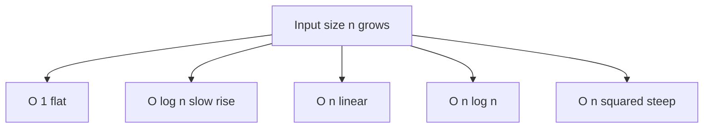
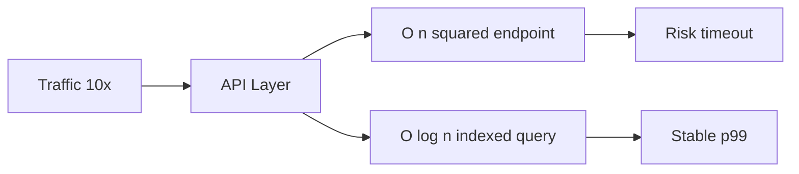

# Chapter 7: Big-O Complexity Without Fear

**Part 1 — Algorithm Fundamentals**

---

## Learning Objectives

By the end of this chapter, you will be able to:

1. Describe algorithm efficiency using Big-O notation.
2. Distinguish best, average, and worst cases.
3. Compare O(1), O(log n), O(n), O(n log n), and O(n²) growth rates.
4. Identify complexity from code structure (loops, nesting, halving).
5. Explain space complexity alongside time complexity.
6. Benchmark code to validate theoretical analysis.
7. Avoid common pitfalls when discussing complexity in interviews.
8. Choose appropriate algorithms based on input size constraints.

---

## Introduction

**Big-O notation** describes how resource usage grows as input size `n` increases. It is not about microseconds on your laptop — it is about **scaling**. An O(n²) algorithm might beat O(n log n) for n=10 but lose catastrophically at n=1,000,000.

This chapter demystifies Big-O with side-by-side Python examples: constant lookup, linear scan, binary search, and bubble sort.

---

## Real-World Motivation

- **Search engines** cannot scan the entire web linearly per query — they use indexes (near O(1) or O(log n) lookups).
- **Social feeds** sort millions of candidates — O(n log n) sorts matter.
- **Fraud detection** on streams needs O(1) or O(log n) per event, not O(n²) pairwise comparisons.
- **SLO planning** uses complexity to estimate capacity at 10× traffic.

---

## Daily-Life Analogy

Finding a name in a phone book:

- **O(n)** — read every page from start (linear scan).
- **O(log n)** — open middle, discard half, repeat (binary search).
- **O(1)** — bookmark the exact page (hash table lookup).

As the book grows, only logarithmic and constant strategies stay practical.

---

## Mathematical Intuition

`f(n) = O(g(n))` means: for large n, `f` grows no faster than `g` up to a constant factor.

Drop constants and lower terms: `3n² + 5n + 2` → **O(n²)**.

Common classes (slowest to fastest for large n):

`O(2^n) < O(n²) < O(n log n) < O(n) < O(log n) < O(1)` — wait, 2^n is *worse* (slower) than n².

Correct ordering by growth (best to worst performance):

**O(1) < O(log n) < O(n) < O(n log n) < O(n²) < O(2^n)**

---

## Core Concepts

| Notation | Name | Example |
|----------|------|---------|
| O(1) | Constant | Dict lookup |
| O(log n) | Logarithmic | Binary search |
| O(n) | Linear | Single loop |
| O(n log n) | Linearithmic | Merge sort |
| O(n²) | Quadratic | Nested loops on n |
| Ω, Θ | Lower / tight bound | Interview precision |

---

## Visual Diagram (Mermaid)



---

## Step-by-Step Explanation

### Step 1: Count Dominant Operations

Identify the innermost loop or recursion depth.

### Step 2: Single Loop → O(n)

`for i in range(n)` runs n times.

### Step 3: Halving Each Step → O(log n)

Binary search cuts problem in half.

### Step 4: Nested Loops → O(n²)

Bubble sort compares pairs.

### Step 5: Benchmark to Build Intuition

Timings confirm theory qualitatively (constants vary by hardware).

---

## Python Implementation

See [`code/part-01/big_o_examples.py`](../../code/part-01/big_o_examples.py).

```bash
python code/part-01/big_o_examples.py
```

---

## Code Walkthrough

| Function | Complexity | Mechanism |
|----------|------------|-----------|
| `constant_time_lookup` | O(1) avg | Hash table |
| `linear_scan` | O(n) | One pass |
| `binary_search` | O(log n) | Halving search space |
| `bubble_sort` | O(n²) | Nested loops |
| `time_function` | — | `perf_counter` wrapper |

---

## Expected Output

```text
O(1) dict lookup: 0.000001s
O(n) linear scan: 0.008234s
O(log n) binary search: 0.000003s
O(n^2) bubble sort n=500: 0.045123s
```

(Times vary by machine; relative ordering illustrates scaling.)

---

## Output Explanation

- **Dict lookup** — fastest, independent of n for average case.
- **Linear scan** — grows with list size 100,000.
- **Binary search** — tiny time despite sorted list of 100,000.
- **Bubble sort** — slowest at n=500 due to quadratic comparisons.

---

## Time Complexity

| Function | Time |
|----------|------|
| `constant_time_lookup` | O(1) average |
| `linear_scan` | O(n) |
| `binary_search` | O(log n) |
| `bubble_sort` | O(n²) |

---

## Space Complexity

| Function | Extra space |
|----------|-------------|
| `linear_scan` | O(1) |
| `binary_search` | O(1) iterative |
| `bubble_sort` | O(n) for copy |

---

## Memory Usage

Big-O space ignores constant factors but remember: O(n) for n=10⁹ is impossible in RAM. Complexity analysis must pair with real memory budgets.

---

## Performance Considerations

1. Constants matter for small n — measure if near decision boundary.
2. Cache locality affects real speed beyond Big-O.
3. Python loops are slow; vectorize with NumPy for numeric hot paths.
4. Use appropriate n in benchmarks — bubble sort n=10,000 will hurt.

---

## Common Mistakes

| Mistake | Fix |
|---------|-----|
| "O(2n) is worse than O(n)" | Drop constants — both O(n) |
| Ignoring average vs worst case | Hash O(1) avg, O(n) worst |
| Confusing best case with Big-O | State which case you mean |
| Optimizing before measuring | Profile first |

---

## Debugging Tips

1. Plot runtime vs n on log-log paper (slope reveals exponent).
2. Use `timeit` with multiple n values.
3. Check for hidden loops in library calls.
4. `pytest tests/part-01/test_chapter_07.py -v`

---

## Unit Tests

[`tests/part-01/test_chapter_07.py`](../../tests/part-01/test_chapter_07.py)

---

## Benchmarking

```python
import timeit
from big_o_examples import binary_search, linear_scan

n = 1_000_000
items = list(range(n))
target = n - 1

t_linear = timeit.timeit(lambda: linear_scan(items, target), number=10)
t_binary = timeit.timeit(lambda: binary_search(items, target), number=10)
print(f"linear: {t_linear:.4f}s, binary: {t_binary:.4f}s")
```

---

## Interview Questions

### Beginner (5)

1. What does O(n) mean?
2. Why drop constants in Big-O?
3. Complexity of scanning an array once?
4. Complexity of binary search?
5. Is O(n) always faster than O(n²)?

### Intermediate (5)

1. Difference between O, Ω, Θ?
2. Amortized O(1) append — explain dynamic arrays.
3. Space-time trade-off example?
4. Master theorem preview for divide-and-conquer.
5. Why is sorting lower bound O(n log n) for comparison sorts?

### Advanced (5)

1. NP-completeness in one paragraph.
2. Amortized analysis of union-find.
3. External memory model — why O(n log n) sort may be O(n) passes on disk.
4. Parallel complexity (work vs span).
5. Profiling vs asymptotic analysis when both matter.

### System Design (3)

1. Capacity plan a service with O(n) per request vs O(log n) index lookup.
2. Design pagination API avoiding O(n) offset scans at depth.
3. Shard data to keep per-shard n small.

### Coding Challenge (1)

Given nested loop code, derive Big-O and rewrite to O(n) if possible.

---

## Production Notes

- Load tests at 10× expected traffic reveal hidden O(n²) endpoints.
- Database EXPLAIN plans show scan vs index — complexity in production.
- Alert on p99 latency growth disproportionate to traffic growth.

---

## Architecture Integration



---

## Best Practices

1. State input size and case (avg/worst) when claiming complexity.
2. Document assumptions (sorted input for binary search).
3. Prefer built-in sorts (`Timsort` O(n log n)) over bubble sort.
4. Use complexity cheat sheet in interviews, not memorized micro-optimizations.
5. Re-analyze complexity after each refactor.

---

## Engineering Notes

### Beginner Note

Big-O is about growth rate, not exact speed. O(n) on a supercomputer vs O(n²) on your laptop — for large enough n, linear wins.

### Intermediate Note

Python's `sorted()` is Timsort — O(n log n) worst case, often faster on partially ordered data. Know what the standard library guarantees.

### Senior Engineer Note

Asymptotics plus constants plus I/O dominate real systems. A "fast" O(n log n) disk sort may lose to O(n²) in-memory sort for small n that fits in L3 cache. Senior engineers measure at production scale and model tail latency, not just averages.

---

## Summary

Big-O describes scaling behavior. Constant, logarithmic, linear, linearithmic, and quadratic classes appear constantly in algorithm work. Analyze loops and recursion, validate with benchmarks, and always ask: "What is n in production?"

---

## Exercises

1. Classify complexity: `for i in n: for j in n: for k in n: pass` → ?
2. Rewrite duplicate-finder from O(n²) to O(n) with a set.
3. Plot n, n log n, n² for n=1..1000.
4. Explain why hash lookup is O(1) average.
5. Find the complexity of Euclid's GCD from Chapter 5.

---

## Further Reading

- [Big-O Cheat Sheet](https://www.bigocheatsheet.com/)
- [CLRS — Growth of Functions](https://mitpress.mit.edu/9780262046305/introduction-to-algorithms/)
- [Python Time Complexity wiki](https://wiki.python.org/moin/TimeComplexity)

---

**Previous:** [Chapter 6: Essential Data Structures](./chapter-06-essential-data-structures.md) · **Next:** [Chapter 8: Algorithm Design Techniques](./chapter-08-design-techniques.md)
