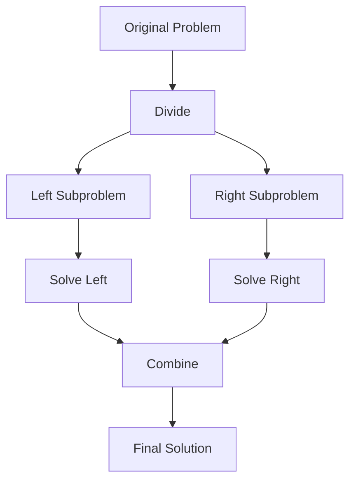
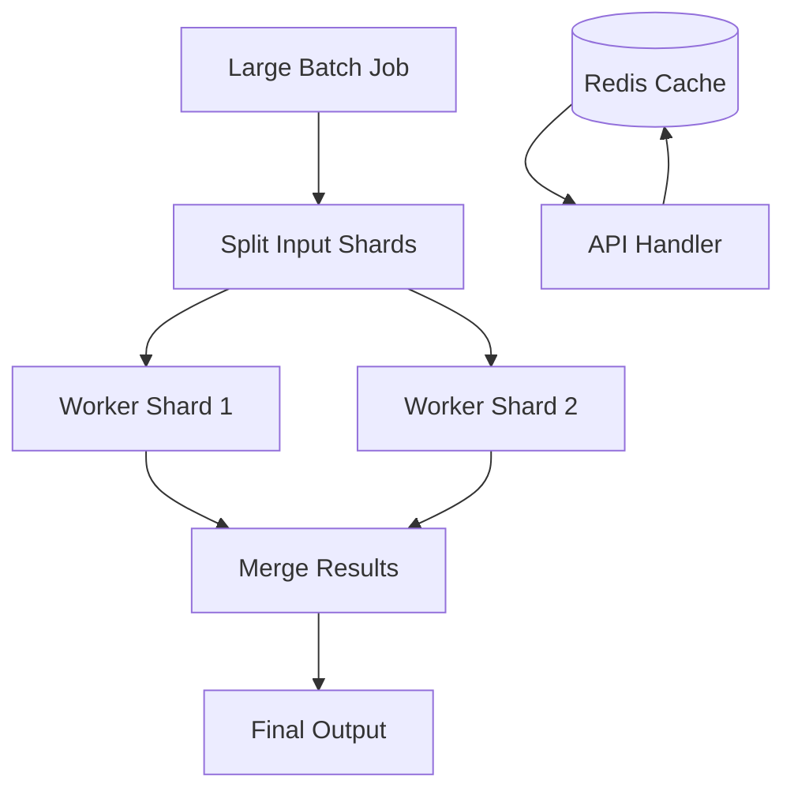

# Chapter 8: Algorithm Design Techniques

**Part 1 — Algorithm Fundamentals**

---

## Learning Objectives

By the end of this chapter, you will be able to:

1. Apply **divide and conquer** to break problems into subproblems.
2. Use **recursion** with clear base cases and progress toward termination.
3. Improve recursive algorithms with **memoization** and dynamic programming preview.
4. Implement **greedy** strategies and recognize when they fail.
5. Implement merge sort as a canonical divide-and-conquer algorithm.
6. Compare recursive, memoized, and iterative approaches by complexity.
7. Choose design paradigms for new problems systematically.
8. Connect design techniques to later chapters (DP, graphs, greedy flows).

---

## Introduction

Facing a new problem, experienced engineers reach for a **toolkit**:

- **Brute force** — try all options (baseline).
- **Divide and conquer** — split, solve, combine (merge sort, quicksort).
- **Dynamic programming** — memoize overlapping subproblems (Fibonacci, knapsack).
- **Greedy** — locally optimal choices (some scheduling, Huffman coding).
- **Backtracking** — explore with pruning (N-queens, Sudoku).

This chapter implements recursion, memoization, merge sort, and greedy coin change — patterns you will reuse throughout the book.

---

## Real-World Motivation

- **MapReduce** is divide-and-conquer at data-center scale.
- **Caching** is memoization in production (CDN, application cache).
- **Compression** (Huffman) uses greedy tree building.
- **Route planning** combines graph search with heuristics.
- **ML training** uses dynamic programming ideas in Viterbi, CRF, and sequence models.

---

## Daily-Life Analogy

- **Divide and conquer**: clean the house — one room at a time, then enjoy the whole house.
- **Memoization**: keep a shopping list on the fridge so you do not re-check the pantry every day.
- **Greedy**: always pick the largest coin first when making change (works for US coins, not all systems).

---

## Mathematical Intuition

**Recurrence** for merge sort: `T(n) = 2T(n/2) + O(n)` → **O(n log n)** by Master Theorem.

**Fibonacci** naive recursion revisits subproblems exponentially; memoization reduces to **O(n)**.

**Greedy correctness** requires **greedy choice property** and **optimal substructure** — coin change works for canonical denominations `[25,10,5,1]` but fails for `[1,3,4]` and amount 6.

---

## Core Concepts

| Technique | Idea | When to use |
|-----------|------|-------------|
| **Recursion** | Self-similar subproblems | Trees, fractals, divide-and-conquer |
| **Memoization** | Cache subproblem results | Overlapping subproblems |
| **Divide & conquer** | Split, solve, merge | Sorting, FFT, parallel pipelines |
| **Greedy** | Local optimum | When provably optimal |
| **DP** | Bottom-up tabulation | Optimization with overlapping subs |

---

## Visual Diagram (Mermaid)



---

## Step-by-Step Explanation

### Step 1: Recursive Factorial

Base case `n ≤ 1`; recursive step `n * factorial(n-1)`.

### Step 2: Memoized Fibonacci

`@lru_cache` stores computed `F(k)` — classic DP top-down.

### Step 3: Merge Sort

Split array in half, sort halves, merge sorted lists in O(n).

### Step 4: Greedy Coin Change

Take largest coin not exceeding remainder; repeat.

### Step 5: Analyze Trade-offs

Naive Fibonacci O(2^n) vs memo O(n); greedy fast but not always optimal.

---

## Python Implementation

See [`code/part-01/design_techniques.py`](../../code/part-01/design_techniques.py).

```bash
python code/part-01/design_techniques.py
```

---

## Code Walkthrough

| Function | Technique | Complexity |
|----------|-----------|------------|
| `factorial_recursive` | Recursion | O(n) time, O(n) stack |
| `fibonacci_memo` | Memoization | O(n) time, O(n) space |
| `merge_sort` | Divide & conquer | O(n log n) |
| `coin_change_greedy` | Greedy | O(k) coins per amount |

`@lru_cache` is Python's built-in memoization — production code might use explicit dicts for control.

---

## Expected Output

```text
factorial(6) = 720
fibonacci_memo(30) = 832040
merge_sort([3,1,4,1,5,9,2,6]) = [1, 1, 2, 3, 4, 5, 6, 9]
coin_change_greedy(67 cents): {'coins': {25: 2, 10: 1, 5: 1, 1: 2}, 'remainder': 0}
```

---

## Output Explanation

- **720** = 6! = 6×5×4×3×2×1.
- **F(30)** — large Fibonacci without exponential blowup thanks to memo.
- **Merge sort** — stable ordering with duplicates preserved in merge.
- **67 cents** — 2×25 + 10 + 5 + 2×1 = 67, remainder 0.

---

## Time Complexity

| Algorithm | Time | Notes |
|-----------|------|-------|
| Naive Fibonacci recursion | O(2^n) | Without memo |
| Memoized Fibonacci | O(n) | Each subproblem once |
| Merge sort | O(n log n) | Guaranteed |
| Greedy coin change | O(c) per amount | c = number of coin types |

---

## Space Complexity

| Algorithm | Space |
|-----------|-------|
| Factorial recursion | O(n) call stack |
| Merge sort | O(n) auxiliary merge buffer |
| Memoized Fibonacci | O(n) cache |
| Greedy | O(1) beyond output |

---

## Memory Usage

Deep recursion (>1000) can hit Python's recursion limit — use iteration or `sys.setrecursionlimit` cautiously. Merge sort's O(n) extra array is the trade-off for stable O(n log n) performance.

---

## Performance Considerations

1. Prefer `functools.lru_cache` or bottom-up DP for overlapping subproblems.
2. Tail-recursion is not optimized in Python — use loops when depth is large.
3. Greedy: prove correctness or fall back to DP.
4. Parallelize divide-and-conquer subproblems only when overhead is worth it.

---

## Common Mistakes

| Mistake | Fix |
|---------|-----|
| Missing base case | Infinite recursion |
| Assuming greedy always optimal | Counterexample: coins [1,3,4], amount 6 |
| Not copying in merge sort | Mutate carefully; our version returns new list |
| Ignoring stack overflow | Iterative Fibonacci for large n |

---

## Debugging Tips

1. Print recursion depth with a decorator.
2. Compare greedy vs brute force on small inputs.
3. Visualize merge steps on [3,1,2].
4. `pytest tests/part-01/test_chapter_08.py -v`

---

## Unit Tests

[`tests/part-01/test_chapter_08.py`](../../tests/part-01/test_chapter_08.py)

---

## Benchmarking

```python
import timeit
from design_techniques import fibonacci_memo

# Warm cache
fibonacci_memo(100)
elapsed = timeit.timeit(lambda: fibonacci_memo(1000), number=1)
print(f"fibonacci_memo(1000): {elapsed:.6f}s")
```

Without memo, `fibonacci(35)` already feels sluggish.

---

## Interview Questions

### Beginner (5)

1. What is recursion?
2. What is a base case?
3. Name a divide-and-conquer algorithm.
4. What does greedy mean?
5. What is memoization?

### Intermediate (5)

1. Write merge sort and state its complexity.
2. When does greedy coin change fail?
3. Top-down vs bottom-up DP?
4. Recursion tree for naive Fibonacci?
5. Stable vs unstable sort — is merge sort stable?

### Advanced (5)

1. Master theorem cases with examples.
2. Prove merge sort is O(n log n).
3. Design DP for coin change with arbitrary denominations.
4. Parallel merge sort challenges.
5. Branch and bound vs backtracking.

### System Design (3)

1. MapReduce as divide-and-conquer at scale.
2. Cache design as distributed memoization.
3. Choose greedy vs optimal routing in real-time systems.

### Coding Challenge (1)

Implement 0/1 knapsack with bottom-up DP; compare to greedy by value/weight ratio.

---

## Production Notes

- Use Redis/Memcached for cross-request memoization.
- Set recursion limits and timeouts on user-submitted code platforms.
- Log when greedy heuristics are used vs optimal solvers.
- Feature-flag new sorting/ranking algorithms with shadow evaluation.

---

## Architecture Integration



Divide-and-conquer and memoization appear at every scale.

---

## Best Practices

1. Identify optimal substructure before choosing DP or greedy.
2. Write brute force first, then optimize with memo or better algorithm.
3. Unit test counterexamples for greedy algorithms.
4. Document recursion depth and stack requirements.
5. Use iterative solutions for production hot paths when possible.

---

## Engineering Notes

### Beginner Note

Recursion is a function calling itself. Always ask: "What is the smallest input I can answer directly?" That is your base case.

### Intermediate Note

`lru_cache` is convenient but unbounded `maxsize=None` can grow memory on large state spaces. Use bounded caches or explicit eviction in production.

### Senior Engineer Note

Design technique choice is a product decision too. Optimal DP may be too slow for real-time; greedy with 99% optimality may ship. Document approximation bounds, monitor regret metrics, and keep the optimal solver offline for audit samples.

---

## Summary

Algorithm design techniques are reusable patterns: recursion, divide-and-conquer, memoization, and greedy strategies. Merge sort exemplifies efficient splitting and merging; memoized Fibonacci shows eliminating redundant work. Part 1 complete — you are ready for searching, sorting, and graph algorithms in Part 2.

---

## Exercises

1. Implement iterative Fibonacci and compare to memoized version.
2. Show greedy fails for coins [1,3,4], amount 6; solve with DP.
3. Implement quicksort (another divide-and-conquer sort).
4. Add `@lru_cache` to a slow recursive function of your choice.
5. Draw recursion tree for `merge_sort([4,2,1,3])`.

---

## Further Reading

- [CLRS — Divide-and-Conquer, DP, Greedy](https://mitpress.mit.edu/9780262046305/introduction-to-algorithms/)
- [Python `functools.lru_cache`](https://docs.python.org/3/library/functools.html#functools.lru_cache)
- [VisuAlgo — Merge Sort](https://visualgo.net/en/sorting)

---

**Previous:** [Chapter 7: Big-O Complexity](./chapter-07-big-o-complexity.md) · **Next:** Part 2 — Searching Algorithms *(Chapter 9)*
