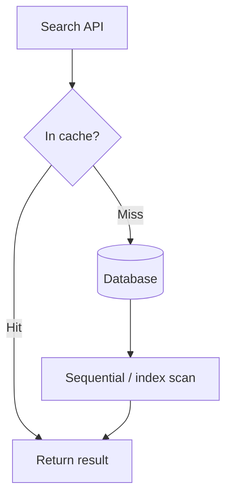

# Chapter 9: Linear Search

**Part 02 — Searching Algorithms**

---

## Learning Objectives

By the end of this chapter, you will be able to:

1. Explain how **Linear Search** works on representative inputs.
2. Implement the algorithm in Python with type hints and docstrings.
3. Analyze **time complexity** (O(n)) and **space complexity** (O(1)).
4. Choose when Linear Search is appropriate in applications and interviews.
5. Avoid common implementation mistakes and debug failing cases systematically.
6. Connect the algorithm to production systems and architecture trade-offs.
7. Answer beginner through senior-level interview questions confidently.
8. Run and extend the book's unit tests and benchmarks.

---

## Introduction

**Linear Search** is a foundational algorithm in computer science and software engineering. This chapter provides a complete, runnable treatment aligned with the book's code in `code/part-02/linear_search.py`.

You will move from intuition to implementation to complexity analysis, then to interviews and production notes. Every example uses **Python 3.12+** and follows the repository's testing conventions.

---

## Real-World Motivation

Databases scan rows when no index exists; file systems walk directories sequentially.

Engineering teams rarely implement every algorithm from scratch, but they **must recognize** when a library, database index, or graph engine is applying this idea under the hood. That recognition saves debugging time and prevents wrong algorithm choices at scale.

---

## Daily-Life Analogy

Checking every locker in a hallway until you find yours.

The analogy is not a proof — it is a mental model. When you forget details, return to this image and rebuild the steps.

---

## Mathematical Intuition

Worst case examines all n elements: T(n) = n.

We express complexity with Big-O notation for worst-case or standard-case behavior unless stated otherwise. Measure on your hardware when constants matter.

---

## Core Concepts

| Concept | Meaning |
|---------|---------|
| **Sequential scan** | Visit elements from index 0 to n-1 |
| **Early exit** | Stop when target is found |
| **Unsorted input** | Works on any sequence without preprocessing |

---

## Visual Diagram

```mermaid
flowchart LR
    A[Start index 0] --> B{items[i] == target?}
    B -->|Yes| C[Return i]
    B -->|No| D{i < n?}
    D -->|Yes| E[i += 1] --> B
    D -->|No| F[Return -1]
```

---

## Step-by-Step Explanation

1. Initialize index to 0.
2. Compare items[index] with target.
3. If equal, return index.
4. Increment index; repeat until end.
5. Return -1 if not found.

Walk through a small example by hand on paper. Tracing two or three steps beats memorizing code.

---

## Python Implementation

Full implementation with type hints and docstrings:

```python
# See code/part-02/linear_search.py
```

Run directly:

```bash
cd comprehensive-algorithms-guide
python code/part-02/linear_search.py
```

Primary entry point: **`linear_search()`**.

---

## Code Walkthrough

1. **Inputs and types** — The implementation uses explicit type hints for clarity and static checking.
2. **Core loop / recursion** — The algorithm's invariant is maintained at each step (see Mathematical Intuition).
3. **Return value** — Documented in the function docstring; tests assert expected behavior.
4. **`if __name__ == "__main__"`** — Demonstrates sample input/output for quick manual verification.

Read the source file line by line alongside this chapter. The docstring includes complexity analysis.

---

## Expected Output

Example session (values may vary slightly for stochastic algorithms):

```text
$ python code/part-02/linear_search.py
# Demonstration output printed by __main__ block
```

---

## Output Explanation

The demonstration constructs a small sample input, runs `linear_search()`, and prints results. Compare output to your hand trace. If results differ, use Debugging Tips below.

---

## Time Complexity

| Case | Complexity |
|------|------------|
| Typical / stated | **O(n)** |

Dominant operations: comparisons, graph edge relaxations, or passes over the input — depending on the algorithm family.

---

## Space Complexity

| Component | Complexity |
|-----------|------------|
| Auxiliary space | **O(1)** |

Auxiliary structures may include stacks, queues, heaps, or temporary arrays. In-place sorts use O(1) extra space excluding recursion stack.

---

## Memory Usage

Memory includes:

- The input structure itself (O(n) or O(V+E) for graphs).
- Auxiliary buffers (visited sets, heaps, merge buffers).
- Recursion stack depth for recursive implementations.

Profile with `sys.getsizeof` for shallow sizes; use `tracemalloc` for deeper insight on large inputs.

---

## Performance Considerations

- **Input size** — Asymptotic complexity dominates for large n.
- **Constants** — Built-in Python sorts (Timsort) are highly optimized; custom sorts are for learning.
- **Cache locality** — Sequential access often beats pointer-chasing on large arrays.
- **Early termination** — Some variants stop early on sorted or goal-found conditions.

---

## Common Mistakes

- Using linear search on large sorted arrays when binary search applies.
- Off-by-one errors when looping to `len(items)` vs `len(items)-1` unnecessarily.
- Forgetting that `==` on objects may not mean semantic equality.

---

## Debugging Tips

1. **Print state** — Log indices, distances, or heap contents on small inputs.
2. **Invariant checks** — Assert conditions that must hold each loop iteration.
3. **Compare to brute force** — On tiny inputs, verify against a slow correct reference.
4. **Run tests** — `pytest tests/part-02/ -v`
5. **Draw the diagram** — Mermaid figures in this chapter map directly to code structures.

---

## Unit Tests

Automated tests live in `tests/part-02/`:

```bash
pytest tests/part-02/ -v
```

Tests cover typical cases, edge cases (empty input, single element), and error conditions where applicable.

---

## Benchmarking

For sorting chapters, run the comparison benchmark:

```bash
python code/part-03/benchmark_sorts.py
```

For searching graph algorithms, time BFS/DFS/Dijkstra on larger graphs built in a loop. Use `time.perf_counter()` and fixed random seeds.

---

## Interview Questions

### Beginner (5)

1. What is linear search?
2. What is its time complexity?
3. Does linear search require sorted data?
4. What does the function return when the target is missing?
5. When is linear search acceptable?

### Intermediate (5)

1. How would you find all occurrences of a duplicate value?
2. Compare linear search vs hash-map lookup.
3. How does sentinel-based search reduce branch checks?
4. When would you use a predicate-based linear scan?
5. How do you test linear search for empty input?

### Advanced (5)

1. Analyze cache behavior of sequential vs random access scans.
2. How do SIMD instructions accelerate linear scans in production?
3. Discuss branch prediction effects on tight loops.
4. When does streaming I/O make linear scan the only option?
5. How would you parallelize linear search across chunks?

### System Design (3)

1. When should a search API fall back to full table scan?
2. Design a feature flag rollout checker scanning millions of rows.
3. How do you monitor scan latency in OLAP queries?

### Coding Challenge (1)

Implement `linear_search_all` returning every index of a target in O(n) time.

---

## Production Notes

Full table scans are acceptable for small tables, ETL staging, or when indexes cannot be maintained. Use query plans and limits to avoid unbounded scans in APIs.

---

## Architecture Integration



| Layer | Role |
|-------|------|
| Application | Chooses algorithm or library API |
| Library / runtime | Optimized implementation (e.g., `sorted`, `heapq`, NetworkX) |
| Infrastructure | Indexes, caches, precomputed graphs |
| Observability | Latency, correctness checks, adversarial input guards |

---

## Best Practices

1. Prefer standard library implementations in production hot paths.
2. Document preconditions (sorted input, non-negative weights, etc.).
3. Write property-based or table-driven tests for edge cases.
4. Pin benchmarks to seeds and hardware when reporting numbers.
5. Fail fast on invalid input with clear exceptions.
6. Keep chapter code in `code/part-02/` — do not duplicate logic in notebooks only.
7. Profile before replacing a clear O(n log n) library sort with a custom variant.

---

## Engineering Notes

### Beginner Note

Start by running `linear_search.py` and the pytest file. Modify the sample input in the `__main__` block and predict the output before running. If you are new to Big-O, focus on **how the loop bounds grow** with input size.

### Intermediate Note

Compare this algorithm to its closest relatives in the same part of the book. Implement one variation (iterative vs recursive, randomized pivot, early exit) and measure whether it matters on your machine for n = 10³ and n = 10⁴.

### Senior Engineer Note

At scale, algorithm choice is a **product and reliability** decision: worst-case guarantees, stability, memory caps, adversarial inputs, and operational observability matter as much as Big-O. Integrate with indexes, materialized views, precomputed graphs, or GPU kernels where appropriate. The implementation in this repository is a **reference** — production systems should use battle-tested libraries unless profiling proves a specialized path is required.

---

## Summary

In this chapter you:

- Learned how **Linear Search** works and when to use it.
- Studied **O(n)** time and **O(1)** space complexity.
- Ran the Python implementation in `code/part-02/linear_search.py`.
- Practiced interview questions from beginner to system design level.
- Connected the algorithm to production and architecture concerns.

---

## Exercises

### Exercise 1 — Trace by Hand

Apply the algorithm to a custom input of size 5–8. Write each step.

### Exercise 2 — Implement a Variant

Add one optimization or variant described in Engineering Notes. Prove it preserves correctness.

### Exercise 3 — Complexity Proof Sketch

Explain in 5–10 sentences why the stated time complexity holds.

### Exercise 4 — Test Case

Add a new pytest case covering an edge case not yet tested.

### Exercise 5 — Benchmark

Time the implementation for increasing input sizes. Plot or tabulate results.

---

## Further Reading

- [Python enumerate documentation](https://docs.python.org/3/library/functions.html#enumerate)
- [CLRS — Introduction to Algorithms, Chapter on elementary search](https://mitpress.mit.edu/9780262046305/introduction-to-algorithms/)

---

**Previous:** Chapter 8: Algorithm Analysis  
**Next:** Chapter 10: Binary Search
