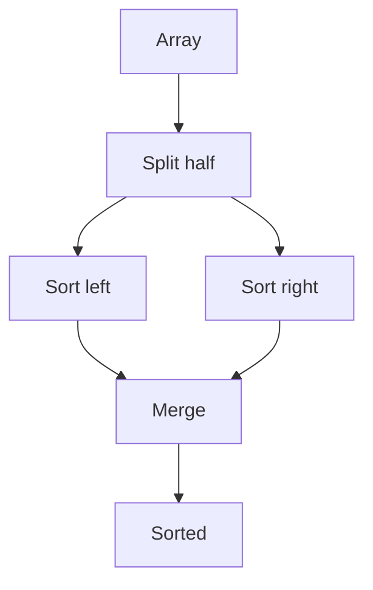
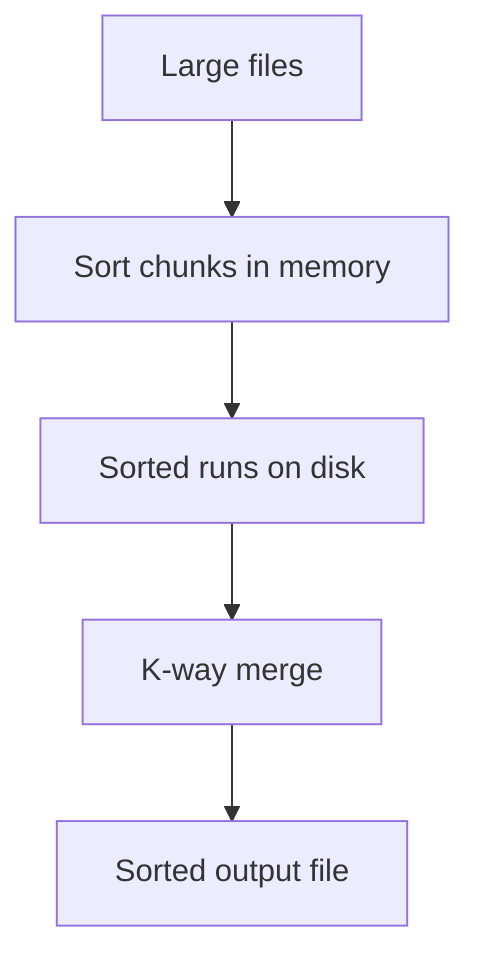

# Chapter 19: Merge Sort

**Part 03 — Sorting Algorithms**

---

## Learning Objectives

By the end of this chapter, you will be able to:

1. Explain how **Merge Sort** works on representative inputs.
2. Implement the algorithm in Python with type hints and docstrings.
3. Analyze **time complexity** (O(n log n)) and **space complexity** (O(n)).
4. Choose when Merge Sort is appropriate in applications and interviews.
5. Avoid common implementation mistakes and debug failing cases systematically.
6. Connect the algorithm to production systems and architecture trade-offs.
7. Answer beginner through senior-level interview questions confidently.
8. Run and extend the book's unit tests and benchmarks.

---

## Introduction

**Merge Sort** is a foundational algorithm in computer science and software engineering. This chapter provides a complete, runnable treatment aligned with the book's code in `code/part-03/merge_sort.py`.

You will move from intuition to implementation to complexity analysis, then to interviews and production notes. Every example uses **Python 3.12+** and follows the repository's testing conventions.

---

## Real-World Motivation

Stable O(n log n) sort; external sorting; parallel merge in big data.

Engineering teams rarely implement every algorithm from scratch, but they **must recognize** when a library, database index, or graph engine is applying this idea under the hood. That recognition saves debugging time and prevents wrong algorithm choices at scale.

---

## Daily-Life Analogy

Splitting a deck in half repeatedly, then merging sorted piles.

The analogy is not a proof — it is a mental model. When you forget details, return to this image and rebuild the steps.

---

## Mathematical Intuition

T(n) = 2T(n/2) + O(n) → O(n log n).

We express complexity with Big-O notation for worst-case or standard-case behavior unless stated otherwise. Measure on your hardware when constants matter.

---

## Core Concepts

| Concept | Meaning |
|---------|---------|
| **Divide** | Split array in half |
| **Conquer** | Recursively sort halves |
| **Merge** | Combine two sorted lists |

---

## Visual Diagram



---

## Step-by-Step Explanation

1. Base case: length <= 1.
2. Recursively sort left and right halves.
3. Merge two sorted halves with two pointers.

Walk through a small example by hand on paper. Tracing two or three steps beats memorizing code.

---

## Python Implementation

Full implementation with type hints and docstrings:

```python
# See code/part-03/merge_sort.py
```

Run directly:

```bash
cd comprehensive-algorithms-guide
python code/part-03/merge_sort.py
```

Primary entry point: **`merge_sort()`**.

---

## Code Walkthrough

1. **Inputs and types** — The implementation uses explicit type hints for clarity and static checking.
2. **Core loop / recursion** — The algorithm's invariant is maintained at each step (see Mathematical Intuition).
3. **Return value** — Documented in the function docstring; tests assert expected behavior.
4. **`if __name__ == "__main__"`** — Demonstrates sample input/output for quick manual verification.

Read the source file line by line alongside this chapter. The docstring includes complexity analysis.

---

## Expected Output

Example session (values may vary slightly for stochastic algorithms):

```text
$ python code/part-03/merge_sort.py
# Demonstration output printed by __main__ block
```

---

## Output Explanation

The demonstration constructs a small sample input, runs `merge_sort()`, and prints results. Compare output to your hand trace. If results differ, use Debugging Tips below.

---

## Time Complexity

| Case | Complexity |
|------|------------|
| Typical / stated | **O(n log n)** |

Dominant operations: comparisons, graph edge relaxations, or passes over the input — depending on the algorithm family.

---

## Space Complexity

| Component | Complexity |
|-----------|------------|
| Auxiliary space | **O(n)** |

Auxiliary structures may include stacks, queues, heaps, or temporary arrays. In-place sorts use O(1) extra space excluding recursion stack.

---

## Memory Usage

Memory includes:

- The input structure itself (O(n) or O(V+E) for graphs).
- Auxiliary buffers (visited sets, heaps, merge buffers).
- Recursion stack depth for recursive implementations.

Profile with `sys.getsizeof` for shallow sizes; use `tracemalloc` for deeper insight on large inputs.

---

## Performance Considerations

- **Input size** — Asymptotic complexity dominates for large n.
- **Constants** — Built-in Python sorts (Timsort) are highly optimized; custom sorts are for learning.
- **Cache locality** — Sequential access often beats pointer-chasing on large arrays.
- **Early termination** — Some variants stop early on sorted or goal-found conditions.

---

## Common Mistakes

- O(n) extra space surprise in interviews.
- Incorrect merge pointer logic.
- Not copying remaining tail elements.

---

## Debugging Tips

1. **Print state** — Log indices, distances, or heap contents on small inputs.
2. **Invariant checks** — Assert conditions that must hold each loop iteration.
3. **Compare to brute force** — On tiny inputs, verify against a slow correct reference.
4. **Run tests** — `pytest tests/part-03/ -v`
5. **Draw the diagram** — Mermaid figures in this chapter map directly to code structures.

---

## Unit Tests

Automated tests live in `tests/part-03/`:

```bash
pytest tests/part-03/ -v
```

Tests cover typical cases, edge cases (empty input, single element), and error conditions where applicable.

---

## Benchmarking

For sorting chapters, run the comparison benchmark:

```bash
python code/part-03/benchmark_sorts.py
```

For searching graph algorithms, time BFS/DFS/Dijkstra on larger graphs built in a loop. Use `time.perf_counter()` and fixed random seeds.

---

## Interview Questions

### Beginner (5)

1. Time and space complexity?
2. Stable?
3. Divide-and-conquer steps?
4. Compare to quicksort?
5. When prefer merge sort?

### Intermediate (5)

1. In-place merge sort challenges.
2. Bottom-up iterative merge sort.
3. Count inversions during merge.
4. K-way merge with heap.
5. External merge sort passes.

### Advanced (5)

1. Parallel merge sort.
2. Natural merge sort (Timsort connection).
3. Cache-oblivious merge sort.
4. Lower bound Ω(n log n) for comparison sorts.
5. Stable distributed sort on Spark.

### System Design (3)

1. Sort 100GB file on disk.
2. MapReduce shuffle as distributed merge.
3. Stable sort requirements in analytics.

### Coding Challenge (1)

Count number of inversions in an array using merge sort.

---

## Production Notes

Use for external sorting and when stability + guaranteed O(n log n) matter. Python uses Timsort, not pure merge sort.

---

## Architecture Integration



| Layer | Role |
|-------|------|
| Application | Chooses algorithm or library API |
| Library / runtime | Optimized implementation (e.g., `sorted`, `heapq`, NetworkX) |
| Infrastructure | Indexes, caches, precomputed graphs |
| Observability | Latency, correctness checks, adversarial input guards |

---

## Best Practices

1. Prefer standard library implementations in production hot paths.
2. Document preconditions (sorted input, non-negative weights, etc.).
3. Write property-based or table-driven tests for edge cases.
4. Pin benchmarks to seeds and hardware when reporting numbers.
5. Fail fast on invalid input with clear exceptions.
6. Keep chapter code in `code/part-03/` — do not duplicate logic in notebooks only.
7. Profile before replacing a clear O(n log n) library sort with a custom variant.

---

## Engineering Notes

### Beginner Note

Start by running `merge_sort.py` and the pytest file. Modify the sample input in the `__main__` block and predict the output before running. If you are new to Big-O, focus on **how the loop bounds grow** with input size.

### Intermediate Note

Compare this algorithm to its closest relatives in the same part of the book. Implement one variation (iterative vs recursive, randomized pivot, early exit) and measure whether it matters on your machine for n = 10³ and n = 10⁴.

### Senior Engineer Note

At scale, algorithm choice is a **product and reliability** decision: worst-case guarantees, stability, memory caps, adversarial inputs, and operational observability matter as much as Big-O. Integrate with indexes, materialized views, precomputed graphs, or GPU kernels where appropriate. The implementation in this repository is a **reference** — production systems should use battle-tested libraries unless profiling proves a specialized path is required.

---

## Summary

In this chapter you:

- Learned how **Merge Sort** works and when to use it.
- Studied **O(n log n)** time and **O(n)** space complexity.
- Ran the Python implementation in `code/part-03/merge_sort.py`.
- Practiced interview questions from beginner to system design level.
- Connected the algorithm to production and architecture concerns.

---

## Exercises

### Exercise 1 — Trace by Hand

Apply the algorithm to a custom input of size 5–8. Write each step.

### Exercise 2 — Implement a Variant

Add one optimization or variant described in Engineering Notes. Prove it preserves correctness.

### Exercise 3 — Complexity Proof Sketch

Explain in 5–10 sentences why the stated time complexity holds.

### Exercise 4 — Test Case

Add a new pytest case covering an edge case not yet tested.

### Exercise 5 — Benchmark

Time the implementation for increasing input sizes. Plot or tabulate results.

---

## Further Reading

- [Merge sort — CP-Algorithms](https://cp-algorithms.com/algorithms/master_or_ramey.html)
- [External sorting](https://en.wikipedia.org/wiki/External_sorting)

---

**Previous:** Chapter 18: Insertion Sort  
**Next:** Chapter 20: Quick Sort
