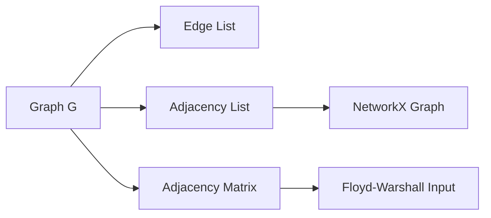
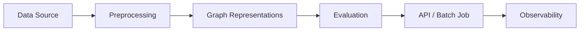

# Chapter 23: Graph Representations

**Part 4 — Graph Algorithms**

---

## Learning Objectives

By the end of this chapter, you will be able to:

1. Understand Graph Representations and when to apply it.
2. Implement and run the chapter Python example.
3. Analyze time and space complexity.
4. Avoid common mistakes and debug failures.
5. Answer interview questions at multiple difficulty levels.
6. Apply production best practices for Graph Representations.
7. Apply production best practices for Graph Representations.
8. Apply production best practices for Graph Representations.
9. Apply production best practices for Graph Representations.

---

## Introduction

This chapter covers **Graph Representations** (Adjacency Lists, Matrices, and Edge Lists). You will learn the theory, see a Mermaid diagram, implement runnable Python, and practice interview questions used at top technology companies.


---

## Real-World Motivation

Graphs model networks, dependencies, and relationships in routing, social media, build systems, and recommendation engines.

---

## Daily-Life Analogy

A road map can be a list of every road (edge list), a city-by-city neighbor chart (adjacency list), or a big table of distances between all cities (matrix).

---

## Mathematical Intuition

A graph $G = (V, E)$ has vertices $V$ and edges $E$. Weighted edges add $w: E \rightarrow \mathbb{R}^+$.

---

## Core Concepts

| Concept | Meaning |
|---------|---------|
| **Adjacency list** | Map each vertex to its neighbors — sparse graphs |
| **Adjacency matrix** | V×V table — fast edge lookup, dense graphs |
| **Edge list** | Simple list of (u, v, w) tuples — easy to serialize |
| **Directed vs undirected** | Symmetric matrix for undirected graphs |
| **NetworkX** | Production-grade graph library in Python |

---

## Visual Diagram



---

## Step-by-Step Explanation

### Step 1: Understand the Problem

Define inputs, outputs, and constraints for Graph Representations.

### Step 2: Choose Data Structures

Select adjacency list, matrix, or library abstractions as appropriate.

### Step 3: Implement Core Logic

Follow the algorithm pseudocode; see [`../../code/part-04/chapter_23_graph_representations.py`](../../code/part-04/chapter_23_graph_representations.py).

### Step 4: Validate on Sample Data

Run the script and compare output to expected results.

### Step 5: Test Edge Cases

Empty graphs, disconnected components, cycles (for topological sort), or class imbalance (ML).

---

## Python Implementation

**Runnable script:** [`code/part-04/chapter_23_graph_representations.py`](../../code/part-04/chapter_23_graph_representations.py)

```bash
python code/part-04/chapter_23_graph_representations.py
```

See the full source in the repository. The implementation uses type hints, docstrings, and follows PEP 8.

---

## Code Walkthrough

| Component | Role |
|-----------|------|
| `main()` | Entry point; loads data and prints results |
| Core algorithm | Implements Graph Representations |
| Helper utilities | Shared functions from `graph_utils.py` or `ml_utils.py` |
| `if __name__ == '__main__'` | Runs demo when executed directly |

---

## Expected Output

```bash
python code/part-04/chapter_23_graph_representations.py
```

The script prints a banner, key metrics or results, and a SUCCESS separator. Exact numbers may vary slightly by hardware and library version.

---

## Output Explanation

Read each printed metric in context. For graph algorithms, verify MST weight, shortest distances, or rank ordering. For ML chapters, check accuracy, MSE, R², or clustering scores against reasonable baselines.

---

## Time Complexity

**Graph Representations:** O(V + E) to build adjacency list; O(V²) for dense matrix

---

## Space Complexity

**Graph Representations:** O(V + E) adjacency list; O(V²) matrix

---

## Memory Usage

Memory scales with input size. For large graphs use streaming edge ingestion; for large ML datasets use batching or `partial_fit` where supported.

---

## Performance Considerations

1. Profile before optimizing — measure on representative data.
2. Use appropriate libraries (NetworkX, sklearn, XGBoost) rather than pure Python hot loops.
3. Set `random_state` for reproducible ML experiments.
4. For graphs with > 1M edges, consider distributed frameworks.
5. Cache preprocessed features in production ML pipelines.

---

## Common Mistakes

| Mistake | Symptom | Fix |
|---------|---------|-----|
| Wrong graph representation | Slow lookups or high memory | Match representation to density |
| Ignoring disconnected graph | Partial MST or wrong distances | Validate connectivity first |
| Cycle in topological sort | Infinite loop or error | Detect cycles with Kahn/DFS |
| Unscaled features in SVM/k-NN | Poor accuracy | Apply StandardScaler |
| Data leakage in ML | Inflated test scores | Fit scaler only on train split |

---

## Debugging Tips

1. Print intermediate state (distances, MST edges, cluster labels).
2. Compare custom implementation to NetworkX or sklearn reference.
3. Run `pytest` for the chapter test file.
4. Use small hand-crafted examples where you know the answer.
5. Check `requirements.txt` versions if results diverge.

---

## Unit Tests

Automated tests: [`../../tests/part-04/test_chapter_23.py`](../../tests/part-04/test_chapter_23.py)

```bash
pytest tests/part-04/test_chapter_23.py -v
```

---

## Benchmarking

```python
import timeit

# Example: time the chapter 23 main function
elapsed = timeit.timeit(
    "main()",
    setup="from chapter_23_graph_representations import main",
    number=5,
)
print(f'Average: {elapsed/5:.4f}s')
```

---

## Interview Questions

### Beginner

1. When would you use an adjacency list vs matrix?
2. How do you represent a weighted graph in Python?
3. What is the space complexity of an adjacency matrix?
4. How do you convert between representations?
5. What graph library would you use in production?

### Intermediate

1. Compare CSR vs COO sparse matrix formats for graphs.
2. How would you store a billion-edge social graph?
3. When is an edge list preferable for distributed processing?
4. How do self-loops and multi-edges affect representations?
5. Design a graph schema for a routing service.

### Advanced

1. How would you shard a graph across machines for PageRank?
2. Compare in-memory vs disk-based graph stores (Neo4j, TigerGraph).
3. How do GPU graph frameworks represent adjacency?
4. What are trade-offs of property graphs vs RDF?
5. How would you version graph snapshots for ML pipelines?

### System Design

1. How would you productionize Graph Representations at scale?
2. Design monitoring and alerting for a Graph Representations pipeline.
3. How would you A/B test changes to a Graph Representations system?

### Coding Challenge

Implement or extend Graph Representations on a new test case and write pytest coverage.

---

## Production Notes

- Choose representation based on density: sparse → adjacency list; dense → matrix.
- Use NetworkX for prototyping; migrate to specialized stores at scale.
- Serialize edge lists to Parquet for analytics pipelines.
- Validate graph connectivity before running MST or shortest-path algorithms.
- Log vertex/edge counts at ingestion for capacity planning.

---

## Architecture Integration



---

## Best Practices

1. Write runnable, tested code for every algorithm.
2. Document assumptions (DAG, non-negative weights, etc.).
3. Use version-pinned dependencies.
4. Separate training and inference code paths in production.
5. Keep chapter code in `code/part-0X/` directories.

---

## Summary

In this chapter you studied **Graph Representations**, implemented it in Python, analyzed complexity, practiced interview questions, and reviewed production considerations.

---

## Exercises

### Exercise 1 — Run and Modify

Run `python code/part-04/chapter_23_graph_representations.py` and change one parameter. Document the effect.

### Exercise 2 — Test Coverage

Add one new test case to `tests/part-04/test_chapter_23.py`.

### Exercise 3 — Complexity

Prove or justify the stated time complexity for Graph Representations.

### Exercise 4 — Interview Practice

Answer all Beginner and Intermediate interview questions in writing.

### Exercise 5 — Production

Write a one-page design doc for deploying this algorithm in a microservice.

---

## Further Reading

- [https://networkx.org/documentation/stable/](https://networkx.org/documentation/stable/)
- [https://docs.python.org/3/library/collections.html](https://docs.python.org/3/library/collections.html)
- Cormen et al., Introduction to Algorithms — Graph Representations

---

**Previous:** Part 3 — Sorting Algorithms
**Next:** Chapter 24: Prim's Algorithm
