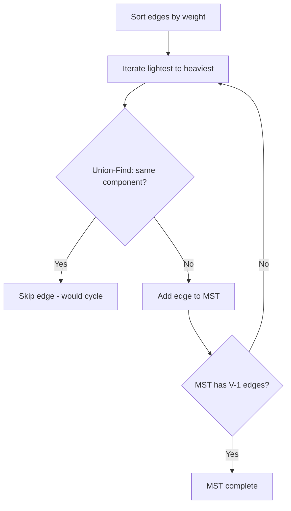

# Chapter 25: Kruskal's Algorithm

**Part 4 — Graph Algorithms**

---

## Learning Objectives

By the end of this chapter, you will be able to:

1. Understand Kruskal's MST and when to apply it.
2. Implement and run the chapter Python example.
3. Analyze time and space complexity.
4. Avoid common mistakes and debug failures.
5. Answer interview questions at multiple difficulty levels.
6. Apply production best practices for Kruskal's MST.
7. Apply production best practices for Kruskal's MST.
8. Apply production best practices for Kruskal's MST.
9. Apply production best practices for Kruskal's MST.

---

## Introduction

This chapter covers **Kruskal's Algorithm** (Minimum Spanning Tree via Union-Find). You will learn the theory, see a Mermaid diagram, implement runnable Python, and practice interview questions used at top technology companies.


---

## Real-World Motivation

Graphs model networks, dependencies, and relationships in routing, social media, build systems, and recommendation engines.

---

## Daily-Life Analogy

Sort all possible bridges by cost; connect islands only if they are not already linked — cheapest bridges first.

---

## Mathematical Intuition

Union-Find with path compression and union by rank achieves nearly O(1) amortized per operation.

---

## Core Concepts

| Concept | Meaning |
|---------|---------|
| **Edge sorting** | Process edges in non-decreasing weight order |
| **Union-Find** | Track connected components efficiently |
| **Cycle detection** | Skip edge if endpoints already connected |
| **Sparse graphs** | Kruskal excels when E ≈ V |
| **MST uniqueness** | Unique iff all edge weights distinct |

---

## Visual Diagram



---

## Step-by-Step Explanation

### Step 1: Understand the Problem

Define inputs, outputs, and constraints for Kruskal's MST.

### Step 2: Choose Data Structures

Select adjacency list, matrix, or library abstractions as appropriate.

### Step 3: Implement Core Logic

Follow the algorithm pseudocode; see [`../../code/part-04/chapter_25_kruskals.py`](../../code/part-04/chapter_25_kruskals.py).

### Step 4: Validate on Sample Data

Run the script and compare output to expected results.

### Step 5: Test Edge Cases

Empty graphs, disconnected components, cycles (for topological sort), or class imbalance (ML).

---

## Python Implementation

**Runnable script:** [`code/part-04/chapter_25_kruskals.py`](../../code/part-04/chapter_25_kruskals.py)

```bash
python code/part-04/chapter_25_kruskals.py
```

See the full source in the repository. The implementation uses type hints, docstrings, and follows PEP 8.

---

## Code Walkthrough

| Component | Role |
|-----------|------|
| `main()` | Entry point; loads data and prints results |
| Core algorithm | Implements Kruskal's MST |
| Helper utilities | Shared functions from `graph_utils.py` or `ml_utils.py` |
| `if __name__ == '__main__'` | Runs demo when executed directly |

---

## Expected Output

```bash
python code/part-04/chapter_25_kruskals.py
```

The script prints a banner, key metrics or results, and a SUCCESS separator. Exact numbers may vary slightly by hardware and library version.

---

## Output Explanation

Read each printed metric in context. For graph algorithms, verify MST weight, shortest distances, or rank ordering. For ML chapters, check accuracy, MSE, R², or clustering scores against reasonable baselines.

---

## Time Complexity

**Kruskal's MST:** O(E log E) dominated by sorting edges

---

## Space Complexity

**Kruskal's MST:** O(V) for Union-Find

---

## Memory Usage

Memory scales with input size. For large graphs use streaming edge ingestion; for large ML datasets use batching or `partial_fit` where supported.

---

## Performance Considerations

1. Profile before optimizing — measure on representative data.
2. Use appropriate libraries (NetworkX, sklearn, XGBoost) rather than pure Python hot loops.
3. Set `random_state` for reproducible ML experiments.
4. For graphs with > 1M edges, consider distributed frameworks.
5. Cache preprocessed features in production ML pipelines.

---

## Common Mistakes

| Mistake | Symptom | Fix |
|---------|---------|-----|
| Wrong graph representation | Slow lookups or high memory | Match representation to density |
| Ignoring disconnected graph | Partial MST or wrong distances | Validate connectivity first |
| Cycle in topological sort | Infinite loop or error | Detect cycles with Kahn/DFS |
| Unscaled features in SVM/k-NN | Poor accuracy | Apply StandardScaler |
| Data leakage in ML | Inflated test scores | Fit scaler only on train split |

---

## Debugging Tips

1. Print intermediate state (distances, MST edges, cluster labels).
2. Compare custom implementation to NetworkX or sklearn reference.
3. Run `pytest` for the chapter test file.
4. Use small hand-crafted examples where you know the answer.
5. Check `requirements.txt` versions if results diverge.

---

## Unit Tests

Automated tests: [`../../tests/part-04/test_chapter_25.py`](../../tests/part-04/test_chapter_25.py)

```bash
pytest tests/part-04/test_chapter_25.py -v
```

---

## Benchmarking

```python
import timeit

# Example: time the chapter 25 main function
elapsed = timeit.timeit(
    "main()",
    setup="from chapter_25_kruskals import main",
    number=5,
)
print(f'Average: {elapsed/5:.4f}s')
```

---

## Interview Questions

### Beginner

1. How does Kruskal detect cycles without DFS?
2. What is Union-Find and why is it used?
3. What is the time complexity of Kruskal's?
4. How many edges are in an MST of V vertices?
5. Compare Kruskal and Prim conceptually.

### Intermediate

1. Implement Union-Find with path compression.
2. When does Kruskal outperform Prim?
3. How would you handle parallel Kruskal?
4. What if edges arrive in a stream?
5. Prove the cut property used by Kruskal.

### Advanced

1. Design distributed MST for MapReduce/Spark.
2. How do you update MST after edge weight changes?
3. Compare Borůvka's algorithm for GPU MST.
4. MST in network design with latency constraints.
5. How would you test MST correctness at scale?

### System Design

1. How would you productionize Kruskal's MST at scale?
2. Design monitoring and alerting for a Kruskal's MST pipeline.
3. How would you A/B test changes to a Kruskal's MST system?

### Coding Challenge

Implement or extend Kruskal's MST on a new test case and write pytest coverage.

---

## Production Notes

- Sort edges once; reuse for multiple MST queries on same topology.
- Union-Find is memory-efficient for sparse graphs.
- Detect disconnected components before reporting MST.
- For equal weights, define deterministic tie-breaking.
- Log MST weight as a sanity metric in network pipelines.

---

## Architecture Integration


---

## Best Practices

1. Write runnable, tested code for every algorithm.
2. Document assumptions (DAG, non-negative weights, etc.).
3. Use version-pinned dependencies.
4. Separate training and inference code paths in production.
5. Keep chapter code in `code/part-0X/` directories.

---

## Summary

In this chapter you studied **Kruskal's Algorithm**, implemented it in Python, analyzed complexity, practiced interview questions, and reviewed production considerations.

---

## Exercises

### Exercise 1 — Run and Modify

Run `python code/part-04/chapter_25_kruskals.py` and change one parameter. Document the effect.

### Exercise 2 — Test Coverage

Add one new test case to `tests/part-04/test_chapter_25.py`.

### Exercise 3 — Complexity

Prove or justify the stated time complexity for Kruskal's MST.

### Exercise 4 — Interview Practice

Answer all Beginner and Intermediate interview questions in writing.

### Exercise 5 — Production

Write a one-page design doc for deploying this algorithm in a microservice.

---

## Further Reading

- Cormen et al. — Kruskal's Algorithm
- [https://networkx.org/documentation/stable/reference/algorithms/generated/networkx.algorithms.tree.mst.kruskal.html](https://networkx.org/documentation/stable/reference/algorithms/generated/networkx.algorithms.tree.mst.kruskal.html)

---

**Previous:** Chapter 24: Prim's Algorithm
**Next:** Chapter 26: Floyd-Warshall
