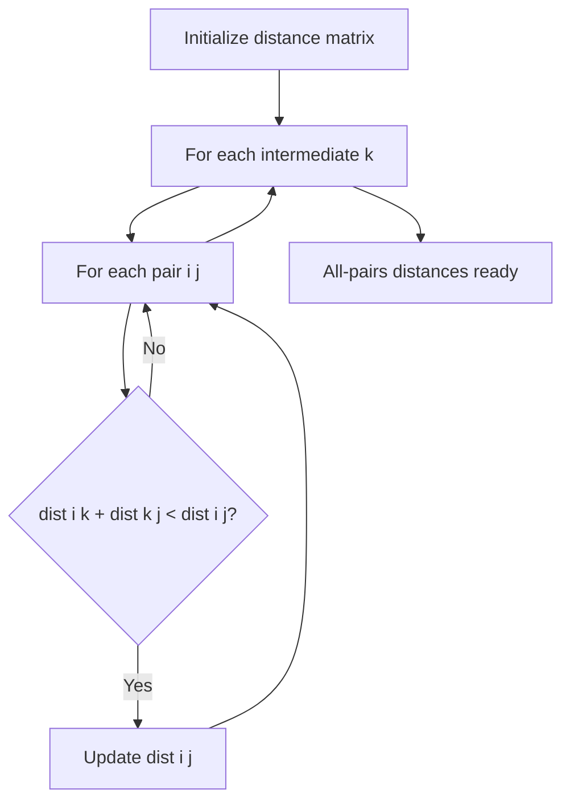

# Chapter 26: Floyd-Warshall Algorithm

**Part 4 — Graph Algorithms**

---

## Learning Objectives

By the end of this chapter, you will be able to:

1. Understand Floyd-Warshall and when to apply it.
2. Implement and run the chapter Python example.
3. Analyze time and space complexity.
4. Avoid common mistakes and debug failures.
5. Answer interview questions at multiple difficulty levels.
6. Apply production best practices for Floyd-Warshall.
7. Apply production best practices for Floyd-Warshall.
8. Apply production best practices for Floyd-Warshall.
9. Apply production best practices for Floyd-Warshall.

---

## Introduction

This chapter covers **Floyd-Warshall Algorithm** (All-Pairs Shortest Paths via Dynamic Programming). You will learn the theory, see a Mermaid diagram, implement runnable Python, and practice interview questions used at top technology companies.


---

## Real-World Motivation

Graphs model networks, dependencies, and relationships in routing, social media, build systems, and recommendation engines.

---

## Daily-Life Analogy

For every pair of cities, ask: is it faster to route through a specific hub city k?

---

## Mathematical Intuition

$dist[i][j] = \min(dist[i][j], dist[i][k] + dist[k][j])$ for all $k$.

---

## Core Concepts

| Concept | Meaning |
|---------|---------|
| **All-pairs shortest paths** | Distance between every pair of vertices |
| **Dynamic programming** | Build solution from intermediate vertices |
| **Negative weights** | Handles negatives if no negative cycles |
| **Path reconstruction** | Next-hop matrix for rebuilding paths |
| **vs Dijkstra** | Run V times Dijkstra = O(VE log V); FW better for dense small V |

---

## Visual Diagram



---

## Step-by-Step Explanation

### Step 1: Understand the Problem

Define inputs, outputs, and constraints for Floyd-Warshall.

### Step 2: Choose Data Structures

Select adjacency list, matrix, or library abstractions as appropriate.

### Step 3: Implement Core Logic

Follow the algorithm pseudocode; see [`../../code/part-04/chapter_26_floyd_warshall.py`](../../code/part-04/chapter_26_floyd_warshall.py).

### Step 4: Validate on Sample Data

Run the script and compare output to expected results.

### Step 5: Test Edge Cases

Empty graphs, disconnected components, cycles (for topological sort), or class imbalance (ML).

---

## Python Implementation

**Runnable script:** [`code/part-04/chapter_26_floyd_warshall.py`](../../code/part-04/chapter_26_floyd_warshall.py)

```bash
python code/part-04/chapter_26_floyd_warshall.py
```

See the full source in the repository. The implementation uses type hints, docstrings, and follows PEP 8.

---

## Code Walkthrough

| Component | Role |
|-----------|------|
| `main()` | Entry point; loads data and prints results |
| Core algorithm | Implements Floyd-Warshall |
| Helper utilities | Shared functions from `graph_utils.py` or `ml_utils.py` |
| `if __name__ == '__main__'` | Runs demo when executed directly |

---

## Expected Output

```bash
python code/part-04/chapter_26_floyd_warshall.py
```

The script prints a banner, key metrics or results, and a SUCCESS separator. Exact numbers may vary slightly by hardware and library version.

---

## Output Explanation

Read each printed metric in context. For graph algorithms, verify MST weight, shortest distances, or rank ordering. For ML chapters, check accuracy, MSE, R², or clustering scores against reasonable baselines.

---

## Time Complexity

**Floyd-Warshall:** O(V³)

---

## Space Complexity

**Floyd-Warshall:** O(V²)

---

## Memory Usage

Memory scales with input size. For large graphs use streaming edge ingestion; for large ML datasets use batching or `partial_fit` where supported.

---

## Performance Considerations

1. Profile before optimizing — measure on representative data.
2. Use appropriate libraries (NetworkX, sklearn, XGBoost) rather than pure Python hot loops.
3. Set `random_state` for reproducible ML experiments.
4. For graphs with > 1M edges, consider distributed frameworks.
5. Cache preprocessed features in production ML pipelines.

---

## Common Mistakes

| Mistake | Symptom | Fix |
|---------|---------|-----|
| Wrong graph representation | Slow lookups or high memory | Match representation to density |
| Ignoring disconnected graph | Partial MST or wrong distances | Validate connectivity first |
| Cycle in topological sort | Infinite loop or error | Detect cycles with Kahn/DFS |
| Unscaled features in SVM/k-NN | Poor accuracy | Apply StandardScaler |
| Data leakage in ML | Inflated test scores | Fit scaler only on train split |

---

## Debugging Tips

1. Print intermediate state (distances, MST edges, cluster labels).
2. Compare custom implementation to NetworkX or sklearn reference.
3. Run `pytest` for the chapter test file.
4. Use small hand-crafted examples where you know the answer.
5. Check `requirements.txt` versions if results diverge.

---

## Unit Tests

Automated tests: [`../../tests/part-04/test_chapter_26.py`](../../tests/part-04/test_chapter_26.py)

```bash
pytest tests/part-04/test_chapter_26.py -v
```

---

## Benchmarking

```python
import timeit

# Example: time the chapter 26 main function
elapsed = timeit.timeit(
    "main()",
    setup="from chapter_26_floyd_warshall import main",
    number=5,
)
print(f'Average: {elapsed/5:.4f}s')
```

---

## Interview Questions

### Beginner

1. What problem does Floyd-Warshall solve?
2. What is its time complexity?
3. Can it handle negative edge weights?
4. How do you detect negative cycles?
5. When prefer Floyd-Warshall over repeated Dijkstra?

### Intermediate

1. Reconstruct shortest paths from Floyd-Warshall output.
2. Optimize space to O(V²) in-place updates.
3. Apply FW to transitive closure (reachability).
4. Compare Johnson's algorithm for sparse all-pairs.
5. How does FW relate to matrix multiplication?

### Advanced

1. Design all-pairs routing for airline hub networks.
2. GPU acceleration of Floyd-Warshall.
3. Incremental updates when one edge weight changes.
4. FW vs landmark-based heuristics for road networks.
5. Integrate with Part 2 Dijkstra for hybrid routing systems.

### System Design

1. How would you productionize Floyd-Warshall at scale?
2. Design monitoring and alerting for a Floyd-Warshall pipeline.
3. How would you A/B test changes to a Floyd-Warshall system?

### Coding Challenge

Implement or extend Floyd-Warshall on a new test case and write pytest coverage.

---

## Production Notes

- Use only for small V (< 500) due to O(V³) cost.
- For large sparse graphs, run Dijkstra from each hub (Part 2).
- Precompute distance matrix for static topology; invalidate on changes.
- Watch for overflow with large integer weights.
- Cache next-hop matrix for O(path length) route reconstruction.

---

## Architecture Integration


---

## Best Practices

1. Write runnable, tested code for every algorithm.
2. Document assumptions (DAG, non-negative weights, etc.).
3. Use version-pinned dependencies.
4. Separate training and inference code paths in production.
5. Keep chapter code in `code/part-0X/` directories.

---

## Summary

In this chapter you studied **Floyd-Warshall Algorithm**, implemented it in Python, analyzed complexity, practiced interview questions, and reviewed production considerations.

---

## Exercises

### Exercise 1 — Run and Modify

Run `python code/part-04/chapter_26_floyd_warshall.py` and change one parameter. Document the effect.

### Exercise 2 — Test Coverage

Add one new test case to `tests/part-04/test_chapter_26.py`.

### Exercise 3 — Complexity

Prove or justify the stated time complexity for Floyd-Warshall.

### Exercise 4 — Interview Practice

Answer all Beginner and Intermediate interview questions in writing.

### Exercise 5 — Production

Write a one-page design doc for deploying this algorithm in a microservice.

---

## Further Reading

- Cormen et al. — All-Pairs Shortest Paths
- Part 2 Chapters 11-12: Dijkstra and Bellman-Ford

---

**Previous:** Chapter 25: Kruskal's Algorithm
**Next:** Chapter 27: Topological Sort
