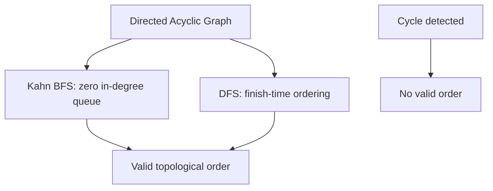

# Chapter 27: Topological Sort

**Part 4 — Graph Algorithms**

---

## Learning Objectives

By the end of this chapter, you will be able to:

1. Understand Topological Sort and when to apply it.
2. Implement and run the chapter Python example.
3. Analyze time and space complexity.
4. Avoid common mistakes and debug failures.
5. Answer interview questions at multiple difficulty levels.
6. Apply production best practices for Topological Sort.
7. Apply production best practices for Topological Sort.
8. Apply production best practices for Topological Sort.
9. Apply production best practices for Topological Sort.

---

## Introduction

This chapter covers **Topological Sort** (Ordering DAG Vertices with Kahn and DFS). You will learn the theory, see a Mermaid diagram, implement runnable Python, and practice interview questions used at top technology companies.


---

## Real-World Motivation

Graphs model networks, dependencies, and relationships in routing, social media, build systems, and recommendation engines.

---

## Daily-Life Analogy

Course prerequisites: you cannot take Advanced ML until you finish Linear Algebra and Probability.

---

## Mathematical Intuition

A topological ordering $\pi$ satisfies: for every edge $(u,v)$, $\pi(u) < \pi(v)$.

---

## Core Concepts

| Concept | Meaning |
|---------|---------|
| **DAG requirement** | Cycles make topological sort impossible |
| **Kahn's algorithm** | BFS peeling vertices with in-degree 0 |
| **DFS approach** | Reverse finish order of DFS |
| **Task scheduling** | Build systems, CI pipelines, course plans |
| **Multiple valid orders** | Often many correct topological orderings |

---

## Visual Diagram



---

## Step-by-Step Explanation

### Step 1: Understand the Problem

Define inputs, outputs, and constraints for Topological Sort.

### Step 2: Choose Data Structures

Select adjacency list, matrix, or library abstractions as appropriate.

### Step 3: Implement Core Logic

Follow the algorithm pseudocode; see [`../../code/part-04/chapter_27_topological_sort.py`](../../code/part-04/chapter_27_topological_sort.py).

### Step 4: Validate on Sample Data

Run the script and compare output to expected results.

### Step 5: Test Edge Cases

Empty graphs, disconnected components, cycles (for topological sort), or class imbalance (ML).

---

## Python Implementation

**Runnable script:** [`code/part-04/chapter_27_topological_sort.py`](../../code/part-04/chapter_27_topological_sort.py)

```bash
python code/part-04/chapter_27_topological_sort.py
```

See the full source in the repository. The implementation uses type hints, docstrings, and follows PEP 8.

---

## Code Walkthrough

| Component | Role |
|-----------|------|
| `main()` | Entry point; loads data and prints results |
| Core algorithm | Implements Topological Sort |
| Helper utilities | Shared functions from `graph_utils.py` or `ml_utils.py` |
| `if __name__ == '__main__'` | Runs demo when executed directly |

---

## Expected Output

```bash
python code/part-04/chapter_27_topological_sort.py
```

The script prints a banner, key metrics or results, and a SUCCESS separator. Exact numbers may vary slightly by hardware and library version.

---

## Output Explanation

Read each printed metric in context. For graph algorithms, verify MST weight, shortest distances, or rank ordering. For ML chapters, check accuracy, MSE, R², or clustering scores against reasonable baselines.

---

## Time Complexity

**Topological Sort:** O(V + E)

---

## Space Complexity

**Topological Sort:** O(V)

---

## Memory Usage

Memory scales with input size. For large graphs use streaming edge ingestion; for large ML datasets use batching or `partial_fit` where supported.

---

## Performance Considerations

1. Profile before optimizing — measure on representative data.
2. Use appropriate libraries (NetworkX, sklearn, XGBoost) rather than pure Python hot loops.
3. Set `random_state` for reproducible ML experiments.
4. For graphs with > 1M edges, consider distributed frameworks.
5. Cache preprocessed features in production ML pipelines.

---

## Common Mistakes

| Mistake | Symptom | Fix |
|---------|---------|-----|
| Wrong graph representation | Slow lookups or high memory | Match representation to density |
| Ignoring disconnected graph | Partial MST or wrong distances | Validate connectivity first |
| Cycle in topological sort | Infinite loop or error | Detect cycles with Kahn/DFS |
| Unscaled features in SVM/k-NN | Poor accuracy | Apply StandardScaler |
| Data leakage in ML | Inflated test scores | Fit scaler only on train split |

---

## Debugging Tips

1. Print intermediate state (distances, MST edges, cluster labels).
2. Compare custom implementation to NetworkX or sklearn reference.
3. Run `pytest` for the chapter test file.
4. Use small hand-crafted examples where you know the answer.
5. Check `requirements.txt` versions if results diverge.

---

## Unit Tests

Automated tests: [`../../tests/part-04/test_chapter_27.py`](../../tests/part-04/test_chapter_27.py)

```bash
pytest tests/part-04/test_chapter_27.py -v
```

---

## Benchmarking

```python
import timeit

# Example: time the chapter 27 main function
elapsed = timeit.timeit(
    "main()",
    setup="from chapter_27_topological_sort import main",
    number=5,
)
print(f'Average: {elapsed/5:.4f}s')
```

---

## Interview Questions

### Beginner

1. What is a topological sort?
2. Why must the graph be a DAG?
3. Explain Kahn's algorithm.
4. How is DFS topological sort different?
5. Give a real-world use case.

### Intermediate

1. Detect cycles while attempting topological sort.
2. Find lexicographically smallest topological order.
3. Schedule parallel tasks with dependencies.
4. Topological sort in a build system (Make, Bazel).
5. Count number of valid topological orderings.

### Advanced

1. Design a distributed task orchestrator with dependency graphs.
2. Handle dynamic dependency insertion at runtime.
3. Topological sort for ML pipeline DAGs (Airflow, Kubeflow).
4. Cycle detection in large dependency graphs.
5. Integrate with critical path method for project management.

### System Design

1. How would you productionize Topological Sort at scale?
2. Design monitoring and alerting for a Topological Sort pipeline.
3. How would you A/B test changes to a Topological Sort system?

### Coding Challenge

Implement or extend Topological Sort on a new test case and write pytest coverage.

---

## Production Notes

- Validate DAG before scheduling — fail fast on cycles.
- Use Kahn for level-by-level parallel execution.
- Persist topological levels for batch parallelism.
- Monitor longest dependency chain (critical path).
- Version dependency graphs for reproducible builds.

---

## Architecture Integration


---

## Best Practices

1. Write runnable, tested code for every algorithm.
2. Document assumptions (DAG, non-negative weights, etc.).
3. Use version-pinned dependencies.
4. Separate training and inference code paths in production.
5. Keep chapter code in `code/part-0X/` directories.

---

## Summary

In this chapter you studied **Topological Sort**, implemented it in Python, analyzed complexity, practiced interview questions, and reviewed production considerations.

---

## Exercises

### Exercise 1 — Run and Modify

Run `python code/part-04/chapter_27_topological_sort.py` and change one parameter. Document the effect.

### Exercise 2 — Test Coverage

Add one new test case to `tests/part-04/test_chapter_27.py`.

### Exercise 3 — Complexity

Prove or justify the stated time complexity for Topological Sort.

### Exercise 4 — Interview Practice

Answer all Beginner and Intermediate interview questions in writing.

### Exercise 5 — Production

Write a one-page design doc for deploying this algorithm in a microservice.

---

## Further Reading

- Cormen et al. — Topological Sort
- [https://networkx.org/documentation/stable/reference/algorithms/generated/networkx.algorithms.dag.topological_sort.html](https://networkx.org/documentation/stable/reference/algorithms/generated/networkx.algorithms.dag.topological_sort.html)

---

**Previous:** Chapter 26: Floyd-Warshall
**Next:** Chapter 28: PageRank
