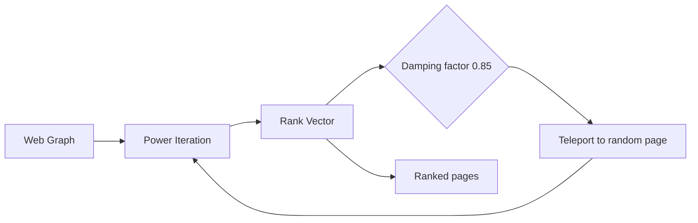

# Chapter 28: PageRank

**Part 4 — Graph Algorithms**

---

## Learning Objectives

By the end of this chapter, you will be able to:

1. Understand PageRank and when to apply it.
2. Implement and run the chapter Python example.
3. Analyze time and space complexity.
4. Avoid common mistakes and debug failures.
5. Answer interview questions at multiple difficulty levels.
6. Apply production best practices for PageRank.
7. Apply production best practices for PageRank.
8. Apply production best practices for PageRank.
9. Apply production best practices for PageRank.

---

## Introduction

This chapter covers **PageRank** (Measuring Node Importance on the Web Graph). You will learn the theory, see a Mermaid diagram, implement runnable Python, and practice interview questions used at top technology companies.


---

## Real-World Motivation

Graphs model networks, dependencies, and relationships in routing, social media, build systems, and recommendation engines.

---

## Daily-Life Analogy

Important pages are those linked by other important pages — like academic citations or word-of-mouth reputation.

---

## Mathematical Intuition

$\mathbf{r} = d \mathbf{M}\mathbf{r} + \frac{1-d}{n}\mathbf{1}$ where $\mathbf{M}$ is the stochastic adjacency matrix.

---

## Core Concepts

| Concept | Meaning |
|---------|---------|
| **Random surfer model** | Surfer follows links or teleports randomly |
| **Damping factor** | Typically 0.85 — probability of following links |
| **Power iteration** | Repeatedly multiply by transition matrix |
| **Dangling nodes** | Pages with no outlinks redistribute rank uniformly |
| **Personalized PageRank** | Biased teleport toward seed nodes |

---

## Visual Diagram



---

## Step-by-Step Explanation

### Step 1: Understand the Problem

Define inputs, outputs, and constraints for PageRank.

### Step 2: Choose Data Structures

Select adjacency list, matrix, or library abstractions as appropriate.

### Step 3: Implement Core Logic

Follow the algorithm pseudocode; see [`../../code/part-04/chapter_28_pagerank.py`](../../code/part-04/chapter_28_pagerank.py).

### Step 4: Validate on Sample Data

Run the script and compare output to expected results.

### Step 5: Test Edge Cases

Empty graphs, disconnected components, cycles (for topological sort), or class imbalance (ML).

---

## Python Implementation

**Runnable script:** [`code/part-04/chapter_28_pagerank.py`](../../code/part-04/chapter_28_pagerank.py)

```bash
python code/part-04/chapter_28_pagerank.py
```

See the full source in the repository. The implementation uses type hints, docstrings, and follows PEP 8.

---

## Code Walkthrough

| Component | Role |
|-----------|------|
| `main()` | Entry point; loads data and prints results |
| Core algorithm | Implements PageRank |
| Helper utilities | Shared functions from `graph_utils.py` or `ml_utils.py` |
| `if __name__ == '__main__'` | Runs demo when executed directly |

---

## Expected Output

```bash
python code/part-04/chapter_28_pagerank.py
```

The script prints a banner, key metrics or results, and a SUCCESS separator. Exact numbers may vary slightly by hardware and library version.

---

## Output Explanation

Read each printed metric in context. For graph algorithms, verify MST weight, shortest distances, or rank ordering. For ML chapters, check accuracy, MSE, R², or clustering scores against reasonable baselines.

---

## Time Complexity

**PageRank:** O(k(E + V)) for k power iterations

---

## Space Complexity

**PageRank:** O(V + E)

---

## Memory Usage

Memory scales with input size. For large graphs use streaming edge ingestion; for large ML datasets use batching or `partial_fit` where supported.

---

## Performance Considerations

1. Profile before optimizing — measure on representative data.
2. Use appropriate libraries (NetworkX, sklearn, XGBoost) rather than pure Python hot loops.
3. Set `random_state` for reproducible ML experiments.
4. For graphs with > 1M edges, consider distributed frameworks.
5. Cache preprocessed features in production ML pipelines.

---

## Common Mistakes

| Mistake | Symptom | Fix |
|---------|---------|-----|
| Wrong graph representation | Slow lookups or high memory | Match representation to density |
| Ignoring disconnected graph | Partial MST or wrong distances | Validate connectivity first |
| Cycle in topological sort | Infinite loop or error | Detect cycles with Kahn/DFS |
| Unscaled features in SVM/k-NN | Poor accuracy | Apply StandardScaler |
| Data leakage in ML | Inflated test scores | Fit scaler only on train split |

---

## Debugging Tips

1. Print intermediate state (distances, MST edges, cluster labels).
2. Compare custom implementation to NetworkX or sklearn reference.
3. Run `pytest` for the chapter test file.
4. Use small hand-crafted examples where you know the answer.
5. Check `requirements.txt` versions if results diverge.

---

## Unit Tests

Automated tests: [`../../tests/part-04/test_chapter_28.py`](../../tests/part-04/test_chapter_28.py)

```bash
pytest tests/part-04/test_chapter_28.py -v
```

---

## Benchmarking

```python
import timeit

# Example: time the chapter 28 main function
elapsed = timeit.timeit(
    "main()",
    setup="from chapter_28_pagerank import main",
    number=5,
)
print(f'Average: {elapsed/5:.4f}s')
```

---

## Interview Questions

### Beginner

1. What does PageRank measure?
2. What is the damping factor?
3. Why do dangling nodes need special handling?
4. What is power iteration?
5. How is PageRank related to eigenvectors?

### Intermediate

1. Implement PageRank with convergence tolerance.
2. Compare PageRank to in-degree centrality.
3. Explain Personalized PageRank for recommendations.
4. How would you scale PageRank to billions of pages?
5. What is the relationship to Markov chains?

### Advanced

1. Design distributed PageRank (Google Pregel model).
2. PageRank for fraud detection in transaction graphs.
3. Combine PageRank with content features for search ranking.
4. Incremental PageRank when graph updates frequently.
5. Compare HITS (hubs/authorities) vs PageRank.

### System Design

1. How would you productionize PageRank at scale?
2. Design monitoring and alerting for a PageRank pipeline.
3. How would you A/B test changes to a PageRank system?

### Coding Challenge

Implement or extend PageRank on a new test case and write pytest coverage.

---

## Production Notes

- Use NetworkX or GraphX for moderate graphs; custom Spark for web scale.
- Set convergence tolerance (e.g., 1e-6) to stop early.
- Handle dangling nodes explicitly — do not ignore them.
- Combine PageRank with domain-specific signals in hybrid rankers.
- Monitor iteration count as a graph health metric.

---

## Architecture Integration


---

## Best Practices

1. Write runnable, tested code for every algorithm.
2. Document assumptions (DAG, non-negative weights, etc.).
3. Use version-pinned dependencies.
4. Separate training and inference code paths in production.
5. Keep chapter code in `code/part-0X/` directories.

---

## Summary

In this chapter you studied **PageRank**, implemented it in Python, analyzed complexity, practiced interview questions, and reviewed production considerations.

---

## Exercises

### Exercise 1 — Run and Modify

Run `python code/part-04/chapter_28_pagerank.py` and change one parameter. Document the effect.

### Exercise 2 — Test Coverage

Add one new test case to `tests/part-04/test_chapter_28.py`.

### Exercise 3 — Complexity

Prove or justify the stated time complexity for PageRank.

### Exercise 4 — Interview Practice

Answer all Beginner and Intermediate interview questions in writing.

### Exercise 5 — Production

Write a one-page design doc for deploying this algorithm in a microservice.

---

## Further Reading

- Brin & Page, The Anatomy of a Large-Scale Hypertextual Web Search Engine
- [https://networkx.org/documentation/stable/reference/algorithms/generated/networkx.algorithms.link_analysis.pagerank_alg.pagerank.html](https://networkx.org/documentation/stable/reference/algorithms/generated/networkx.algorithms.link_analysis.pagerank_alg.pagerank.html)

---

**Previous:** Chapter 27: Topological Sort
**Next:** Chapter 29: Graph Algorithms Integration
