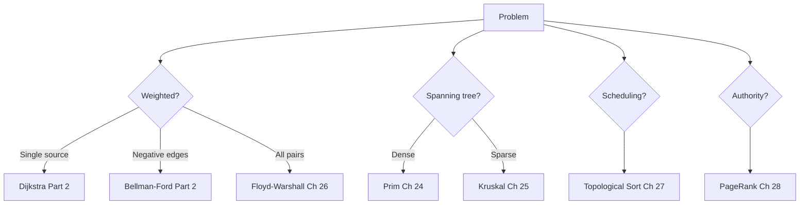
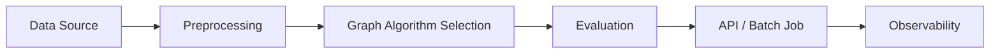

# Chapter 29: Graph Algorithms Integration

**Part 4 — Graph Algorithms**

---

## Learning Objectives

By the end of this chapter, you will be able to:

1. Understand Graph Algorithm Selection and when to apply it.
2. Implement and run the chapter Python example.
3. Analyze time and space complexity.
4. Avoid common mistakes and debug failures.
5. Answer interview questions at multiple difficulty levels.
6. Apply production best practices for Graph Algorithm Selection.
7. Apply production best practices for Graph Algorithm Selection.
8. Apply production best practices for Graph Algorithm Selection.
9. Apply production best practices for Graph Algorithm Selection.

---

## Introduction

This chapter covers **Graph Algorithms Integration** (Selecting and Combining Graph Techniques). You will learn the theory, see a Mermaid diagram, implement runnable Python, and practice interview questions used at top technology companies.


---

## Real-World Motivation

Graphs model networks, dependencies, and relationships in routing, social media, build systems, and recommendation engines.

---

## Daily-Life Analogy

A toolbox: you pick the right wrench for the bolt — shortest path, spanning tree, ordering, or ranking.

---

## Mathematical Intuition

Algorithm choice depends on $|V|$, $|E|$, directedness, weights, and query pattern (single vs all-pairs).

---

## Core Concepts

| Concept | Meaning |
|---------|---------|
| **Single-source shortest path** | Dijkstra (Part 2) for non-negative weights |
| **Negative weights** | Bellman-Ford (Part 2) |
| **All-pairs shortest paths** | Floyd-Warshall (Ch. 26) |
| **MST** | Prim (Ch. 24) or Kruskal (Ch. 25) |
| **DAG scheduling** | Topological Sort (Ch. 27) |
| **Link analysis** | PageRank (Ch. 28) |

---

## Visual Diagram



---

## Step-by-Step Explanation

### Step 1: Understand the Problem

Define inputs, outputs, and constraints for Graph Algorithm Selection.

### Step 2: Choose Data Structures

Select adjacency list, matrix, or library abstractions as appropriate.

### Step 3: Implement Core Logic

Follow the algorithm pseudocode; see [`../../code/part-04/chapter_29_graph_integration.py`](../../code/part-04/chapter_29_graph_integration.py).

### Step 4: Validate on Sample Data

Run the script and compare output to expected results.

### Step 5: Test Edge Cases

Empty graphs, disconnected components, cycles (for topological sort), or class imbalance (ML).

---

## Python Implementation

**Runnable script:** [`code/part-04/chapter_29_graph_integration.py`](../../code/part-04/chapter_29_graph_integration.py)

```bash
python code/part-04/chapter_29_graph_integration.py
```

See the full source in the repository. The implementation uses type hints, docstrings, and follows PEP 8.

---

## Code Walkthrough

| Component | Role |
|-----------|------|
| `main()` | Entry point; loads data and prints results |
| Core algorithm | Implements Graph Algorithm Selection |
| Helper utilities | Shared functions from `graph_utils.py` or `ml_utils.py` |
| `if __name__ == '__main__'` | Runs demo when executed directly |

---

## Expected Output

```bash
python code/part-04/chapter_29_graph_integration.py
```

The script prints a banner, key metrics or results, and a SUCCESS separator. Exact numbers may vary slightly by hardware and library version.

---

## Output Explanation

Read each printed metric in context. For graph algorithms, verify MST weight, shortest distances, or rank ordering. For ML chapters, check accuracy, MSE, R², or clustering scores against reasonable baselines.

---

## Time Complexity

**Graph Algorithm Selection:** Varies by chosen algorithm

---

## Space Complexity

**Graph Algorithm Selection:** Varies by representation

---

## Memory Usage

Memory scales with input size. For large graphs use streaming edge ingestion; for large ML datasets use batching or `partial_fit` where supported.

---

## Performance Considerations

1. Profile before optimizing — measure on representative data.
2. Use appropriate libraries (NetworkX, sklearn, XGBoost) rather than pure Python hot loops.
3. Set `random_state` for reproducible ML experiments.
4. For graphs with > 1M edges, consider distributed frameworks.
5. Cache preprocessed features in production ML pipelines.

---

## Common Mistakes

| Mistake | Symptom | Fix |
|---------|---------|-----|
| Wrong graph representation | Slow lookups or high memory | Match representation to density |
| Ignoring disconnected graph | Partial MST or wrong distances | Validate connectivity first |
| Cycle in topological sort | Infinite loop or error | Detect cycles with Kahn/DFS |
| Unscaled features in SVM/k-NN | Poor accuracy | Apply StandardScaler |
| Data leakage in ML | Inflated test scores | Fit scaler only on train split |

---

## Debugging Tips

1. Print intermediate state (distances, MST edges, cluster labels).
2. Compare custom implementation to NetworkX or sklearn reference.
3. Run `pytest` for the chapter test file.
4. Use small hand-crafted examples where you know the answer.
5. Check `requirements.txt` versions if results diverge.

---

## Unit Tests

Automated tests: [`../../tests/part-04/test_chapter_29.py`](../../tests/part-04/test_chapter_29.py)

```bash
pytest tests/part-04/test_chapter_29.py -v
```

---

## Benchmarking

```python
import timeit

# Example: time the chapter 29 main function
elapsed = timeit.timeit(
    "main()",
    setup="from chapter_29_graph_integration import main",
    number=5,
)
print(f'Average: {elapsed/5:.4f}s')
```

---

## Interview Questions

### Beginner

1. When use Dijkstra vs Floyd-Warshall?
2. When use Prim vs Kruskal?
3. What graph problems need topological sort?
4. Name algorithms from Part 2 referenced here.
5. What representation for a social network graph?

### Intermediate

1. Design a navigation system picking the right algorithm.
2. Compare BFS/DFS (Part 2) with shortest-path algorithms.
3. How would you benchmark graph algorithms on your data?
4. Pipeline: ingest edges → validate → choose algorithm.
5. Handle disconnected components across algorithms.

### Advanced

1. Architecture for real-time routing + offline MST analytics.
2. Graph algorithm microservices: when to split?
3. Observability for graph pipelines at scale.
4. ML feature extraction from graph algorithms.
5. Cost model: in-memory vs distributed graph processing.

### System Design

1. How would you productionize Graph Algorithm Selection at scale?
2. Design monitoring and alerting for a Graph Algorithm Selection pipeline.
3. How would you A/B test changes to a Graph Algorithm Selection system?

### Coding Challenge

Implement or extend Graph Algorithm Selection on a new test case and write pytest coverage.

---

## Production Notes

- Document algorithm selection criteria in runbooks.
- Reference Part 2 for Dijkstra/Bellman-Ford — do not duplicate.
- Use NetworkX for < 1M edges; migrate beyond that.
- Integration tests across MST, shortest path, and PageRank.
- Version graph snapshots for reproducible analytics.

---

## Architecture Integration



---

## Best Practices

1. Write runnable, tested code for every algorithm.
2. Document assumptions (DAG, non-negative weights, etc.).
3. Use version-pinned dependencies.
4. Separate training and inference code paths in production.
5. Keep chapter code in `code/part-0X/` directories.

---

## Summary

In this chapter you studied **Graph Algorithms Integration**, implemented it in Python, analyzed complexity, practiced interview questions, and reviewed production considerations.

---

## Exercises

### Exercise 1 — Run and Modify

Run `python code/part-04/chapter_29_graph_integration.py` and change one parameter. Document the effect.

### Exercise 2 — Test Coverage

Add one new test case to `tests/part-04/test_chapter_29.py`.

### Exercise 3 — Complexity

Prove or justify the stated time complexity for Graph Algorithm Selection.

### Exercise 4 — Interview Practice

Answer all Beginner and Intermediate interview questions in writing.

### Exercise 5 — Production

Write a one-page design doc for deploying this algorithm in a microservice.

---

## Further Reading

- Part 2 Chapters 11-12: Dijkstra and Bellman-Ford
- Part 4 Chapters 23-28
- [https://networkx.org/](https://networkx.org/)

---

**Previous:** Chapter 28: PageRank
**Next:** Chapter 30: Linear Regression
