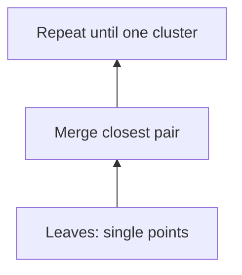

# Chapter 40: Hierarchical Clustering

**Part 5 — Machine Learning Algorithms**

---

## Learning Objectives

By the end of this chapter, you will be able to:

1. Understand Hierarchical Clustering and when to apply it.
2. Implement and run the chapter Python example.
3. Analyze time and space complexity.
4. Avoid common mistakes and debug failures.
5. Answer interview questions at multiple difficulty levels.
6. Apply production best practices for Hierarchical Clustering.
7. Apply production best practices for Hierarchical Clustering.
8. Apply production best practices for Hierarchical Clustering.
9. Apply production best practices for Hierarchical Clustering.

---

## Introduction

This chapter covers **Hierarchical Clustering** (Clustering with scikit-learn). You will learn the theory, see a Mermaid diagram, implement runnable Python, and practice interview questions used at top technology companies.

This chapter uses the **Wine** dataset from scikit-learn — a free, public dataset requiring no API keys.


---

## Real-World Motivation

Family tree of species — merge closest relatives iteratively.

---

## Daily-Life Analogy

Linkage (single, complete, ward) defines inter-cluster distance.

---

## Mathematical Intuition

Build cluster hierarchy via agglomerative or divisive merging.

---

## Core Concepts

| Concept | Meaning |
|---------|---------|
| **sklearn Hierarchical Clustering** | Implementation via scikit-learn / related library |
| **Train/test split** | Hold-out evaluation with random_state=42 |
| **Feature scaling** | StandardScaler when distance or gradient matters |
| **Metrics** | ARI |
| **Public dataset** | Wine — free sklearn built-in dataset |

---

## Visual Diagram



---

## Step-by-Step Explanation

### Step 1: Understand the Problem

Define inputs, outputs, and constraints for Hierarchical Clustering.

### Step 2: Choose Data Structures

Select adjacency list, matrix, or library abstractions as appropriate.

### Step 3: Implement Core Logic

Follow the algorithm pseudocode; see [`../../code/part-05/chapter_40_hierarchical_clustering.py`](../../code/part-05/chapter_40_hierarchical_clustering.py).

### Step 4: Validate on Sample Data

Run the script and compare output to expected results.

### Step 5: Test Edge Cases

Empty graphs, disconnected components, cycles (for topological sort), or class imbalance (ML).

---

## Python Implementation

**Runnable script:** [`code/part-05/chapter_40_hierarchical_clustering.py`](../../code/part-05/chapter_40_hierarchical_clustering.py)

```bash
python code/part-05/chapter_40_hierarchical_clustering.py
```

See the full source in the repository. The implementation uses type hints, docstrings, and follows PEP 8.

---

## Code Walkthrough

| Component | Role |
|-----------|------|
| `main()` | Entry point; loads data and prints results |
| Core algorithm | Implements Hierarchical Clustering |
| Helper utilities | Shared functions from `graph_utils.py` or `ml_utils.py` |
| `if __name__ == '__main__'` | Runs demo when executed directly |

---

## Expected Output

```bash
python code/part-05/chapter_40_hierarchical_clustering.py
```

The script prints a banner, key metrics or results, and a SUCCESS separator. Exact numbers may vary slightly by hardware and library version.

---

## Output Explanation

Read each printed metric in context. For graph algorithms, verify MST weight, shortest distances, or rank ordering. For ML chapters, check accuracy, MSE, R², or clustering scores against reasonable baselines.

---

## Time Complexity

**Hierarchical Clustering:** O(n² log n) linkage

---

## Space Complexity

**Hierarchical Clustering:** O(n²) dendrogram

---

## Memory Usage

Memory scales with input size. For large graphs use streaming edge ingestion; for large ML datasets use batching or `partial_fit` where supported.

---

## Performance Considerations

1. Profile before optimizing — measure on representative data.
2. Use appropriate libraries (NetworkX, sklearn, XGBoost) rather than pure Python hot loops.
3. Set `random_state` for reproducible ML experiments.
4. For graphs with > 1M edges, consider distributed frameworks.
5. Cache preprocessed features in production ML pipelines.

---

## Common Mistakes

| Mistake | Symptom | Fix |
|---------|---------|-----|
| Wrong graph representation | Slow lookups or high memory | Match representation to density |
| Ignoring disconnected graph | Partial MST or wrong distances | Validate connectivity first |
| Cycle in topological sort | Infinite loop or error | Detect cycles with Kahn/DFS |
| Unscaled features in SVM/k-NN | Poor accuracy | Apply StandardScaler |
| Data leakage in ML | Inflated test scores | Fit scaler only on train split |

---

## Debugging Tips

1. Print intermediate state (distances, MST edges, cluster labels).
2. Compare custom implementation to NetworkX or sklearn reference.
3. Run `pytest` for the chapter test file.
4. Use small hand-crafted examples where you know the answer.
5. Check `requirements.txt` versions if results diverge.

---

## Unit Tests

Automated tests: [`../../tests/part-05/test_chapter_40.py`](../../tests/part-05/test_chapter_40.py)

```bash
pytest tests/part-05/test_chapter_40.py -v
```

---

## Benchmarking

```python
import timeit

# Example: time the chapter 40 main function
elapsed = timeit.timeit(
    "main()",
    setup="from chapter_40_hierarchical_clustering import main",
    number=5,
)
print(f'Average: {elapsed/5:.4f}s')
```

---

## Interview Questions

### Beginner

1. What is Hierarchical Clustering used for?
2. What dataset does this chapter use?
3. What is the time complexity of training?
4. Why split train and test data?
5. What metric evaluates this model?

### Intermediate

1. Hyperparameters for Hierarchical Clustering?
2. How does feature scaling affect this algorithm?
3. Bias-variance trade-off for this method?
4. When would you NOT use this algorithm?
5. How to cross-validate this model?

### Advanced

1. Deploy Hierarchical Clustering in production serving pipeline.
2. Monitor model drift for this algorithm.
3. Scale Hierarchical Clustering to millions of samples.
4. A/B test this model against a baseline.
5. Feature store integration for this model type.

### System Design

1. How would you productionize Hierarchical Clustering at scale?
2. Design monitoring and alerting for a Hierarchical Clustering pipeline.
3. How would you A/B test changes to a Hierarchical Clustering system?

### Coding Challenge

Implement or extend Hierarchical Clustering on a new test case and write pytest coverage.

---

## Production Notes

- Pin sklearn/xgboost/lightgbm versions (see requirements.txt).
- Serialize model with joblib or ONNX for serving.
- Log training metrics and dataset hash for reproducibility.
- Use Wine patterns for integration tests.
- Monitor latency and memory in inference path.

---

## Architecture Integration


---

## Best Practices

1. Write runnable, tested code for every algorithm.
2. Document assumptions (DAG, non-negative weights, etc.).
3. Use version-pinned dependencies.
4. Separate training and inference code paths in production.
5. Keep chapter code in `code/part-0X/` directories.

---

## Summary

In this chapter you studied **Hierarchical Clustering**, implemented it in Python, analyzed complexity, practiced interview questions, and reviewed production considerations.

---

## Exercises

### Exercise 1 — Run and Modify

Run `python code/part-05/chapter_40_hierarchical_clustering.py` and change one parameter. Document the effect.

### Exercise 2 — Test Coverage

Add one new test case to `tests/part-05/test_chapter_40.py`.

### Exercise 3 — Complexity

Prove or justify the stated time complexity for Hierarchical Clustering.

### Exercise 4 — Interview Practice

Answer all Beginner and Intermediate interview questions in writing.

### Exercise 5 — Production

Write a one-page design doc for deploying this algorithm in a microservice.

---

## Further Reading

- [https://scikit-learn.org/stable/](https://scikit-learn.org/stable/)
- [https://scikit-learn.org/stable/modules/classes.html](https://scikit-learn.org/stable/modules/classes.html)

---

**Previous:** Chapter 39
**Next:** Chapter 41
