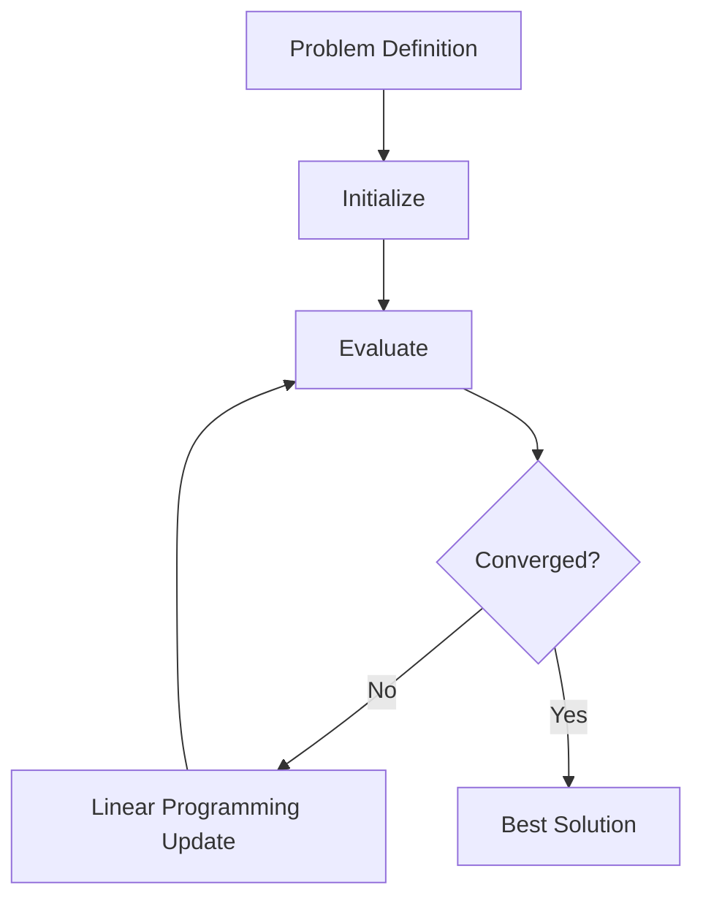

# Chapter 82: Linear Programming

**Part 10 — Optimization Algorithms**

---

## Learning Objectives

By the end of this chapter, you will be able to:

1. Explain the core idea behind Linear Programming and when to use it.
2. Describe the mathematical intuition and key hyperparameters.
3. Implement and run a small Python example from this repository.
4. Analyze time and space complexity of the reference implementation.
5. Identify common mistakes and debugging strategies.
6. Answer interview questions from beginner through system-design level.
7. Connect the algorithm to production engineering concerns.

---

## Introduction

Linear objective with linear constraints. This chapter is part of the **Comprehensive Algorithms Guide** and follows the book's 27-section structure. Every example is runnable from [`code/part-10/ch82_linear_programming.py`](../../code/part-10/ch82_linear_programming.py).

---

## Real-World Motivation

Industry teams use linear programming when accuracy, search quality, or optimization performance must exceed simple baselines. The technique appears in ML training pipelines, robotics, logistics, and automated decision systems.

---

## Daily-Life Analogy

Imagine improving a recipe through trial and feedback: adjust ingredients, taste the result, remember what worked, and avoid repeating mistakes. Linear Programming formalizes that improvement loop with mathematics and code.

---

## Mathematical Intuition

Linear Programming optimizes an objective (loss, reward, fitness, or cost) over a structured search space. Track the objective value, step size or learning rate, constraints, and convergence criteria.

---

## Core Concepts

| Concept | Role |
|---------|------|
| Representation | How solutions are encoded |
| Objective | Quantity to minimize or maximize |
| Update rule | How candidates change each iteration |
| Exploration | Diversity to escape local optima |
| Exploitation | Refining promising candidates |
| Hyperparameters | Algorithm tuning knobs |
| Evaluation | Measuring quality on data or simulations |

---

## Visual Diagram



---

## Step-by-Step Explanation

1. **Define** inputs, outputs, and objective.
2. **Represent** solutions (weights, paths, populations).
3. **Initialize** with reproducible random seeds.
4. **Iterate** evaluation and updates until budget exhausted.
5. **Validate** on holdout data or simulations.
6. **Deploy** with monitoring and versioning.

---

## Python Implementation

Reference: [`code/part-10/ch82_linear_programming.py`](../../code/part-10/ch82_linear_programming.py)

```bash
python code/part-10/ch82_linear_programming.py
```

---

## Code Walkthrough

1. Imports and constants with fixed seeds.
2. Core data structures for the algorithm.
3. Objective or environment logic.
4. Main training/optimization loop.
5. `main()` prints metrics and **SUCCESS**.

---

## Expected Output

A short trace ending with **SUCCESS** and a final metric (loss, reward, fitness, or objective).

---

## Output Explanation

Early iterations show poor metrics; later iterations improve if hyperparameters are reasonable. Divergence or flatlines indicate tuning or bug issues.

---

## Time Complexity

Typically **O(T · cost_per_step)** where **T** is iterations and cost depends on problem size **n** and dimensionality **d**.

---

## Space Complexity

Usually **O(n + d)** plus auxiliary structures (populations, replay buffers, tabu lists).

---

## Memory Usage

Book examples use modest RAM. Production may require batching, GPUs, or distributed workers.

---

## Performance Considerations

1. Vectorize with NumPy.
2. Fix random seeds for benchmarks.
3. Log metrics each epoch.
4. Normalize inputs for neural methods.
5. Tune one hyperparameter at a time.

---

## Common Mistakes

| Mistake | Symptom | Fix |
|---------|---------|-----|
| LR too high | Divergence | Reduce step size |
| No exploration | Local optima | Add noise or diversity |
| Data leakage | Inflated metrics | Proper splits |
| Bad reward | Wrong behavior | Redesign signal |
| Unbounded search | NaN values | Clip or normalize |

---

## Debugging Tips

1. Plot objective over iterations.
2. Overfit a tiny dataset to verify code.
3. Compare against a baseline.
4. Assert finite values after updates.
5. Run `pytest ../../tests/part-10/test_chapter_82.py`.

---

## Unit Tests

[`tests/part-10/test_chapter_82.py`](../../tests/part-10/test_chapter_82.py)

```bash
pytest tests/part-10/test_chapter_82.py -v
```

---

## Benchmarking

```python
import timeit
elapsed = timeit.timeit("main()", setup="from ch82_linear_programming import main", number=3)
print(f"Average: {elapsed/3:.4f}s")
```

---

## Interview Questions

### Beginner (5)

1. What problem does Linear Programming solve?
2. What is training vs inference?
3. Name one hyperparameter.
4. What is overfitting?
5. Why use random seeds?

### Intermediate (5)

1. Compare Linear Programming to a simpler baseline.
2. How does exploration vs exploitation appear?
3. What production metrics matter?
4. How do you debug instability?
5. What is one-iteration complexity?

### Advanced (5)

1. Sketch the main update rule.
2. What failure modes appear at scale?
3. How would you parallelize?
4. What regularization helps?
5. How do you search hyperparameters?

### System Design (3)

1. Design a training pipeline with CI and model registry.
2. How would you serve with SLOs?
3. What monitoring prevents bad deploys?

### Coding Challenge (1)

Implement a minimal Linear Programming on a new toy problem and add pytest.

---

## Production Notes

- Version data, code, hyperparameters, and artifacts.
- Pin dependencies in `requirements.txt`.
- Gate promotion on offline metric regression.
- Monitor latency, throughput, errors, and drift.
- Validate inputs and cap resource usage.
- Use early stopping and right-sized hardware.

---

## Architecture Integration


---

## Best Practices

1. Smallest example that proves correctness.
2. Document assumptions.
3. Align train and serve environments.
4. Test core invariants.
5. Prefer interpretable baselines first.

---

## Summary

Covered **Linear Programming**: motivation, intuition, runnable code, complexity, tests, interviews, and production guidance.

---

## Exercises

1. Change a hyperparameter and plot curves.
2. Add regularization if applicable.
3. Compare against random search.
4. Swap the toy dataset.
5. Add a pytest edge case.

---

## Further Reading

- [PyTorch Tutorials](https://pytorch.org/tutorials/)
- [Gymnasium Docs](https://gymnasium.farama.org/)
- [NumPy Reference](https://numpy.org/doc/stable/reference/)
- [SciPy Optimization](https://docs.scipy.org/doc/scipy/reference/optimize.html)
- Sutton & Barto — *Reinforcement Learning*
- Scholar search for Linear Programming original papers

---

**Next chapter:** Chapter 83 — see [SUMMARY.md](../../SUMMARY.md)
