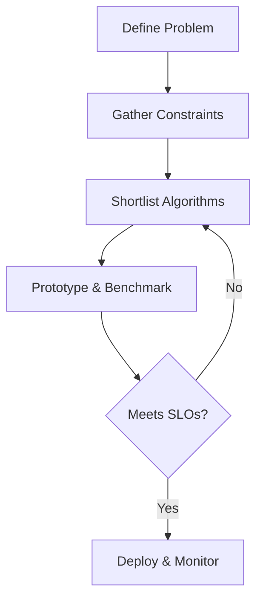
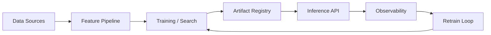

# Project 3: Customer Segmentation

**Part 12 — Real-World Projects**

---

## Learning Objectives

By the end of this chapter, you will be able to:

1. Explain the core idea behind Customer Segmentation and when to use it.
2. Describe the mathematical intuition and key design decisions.
3. Implement and run a Python example from this repository.
4. Analyze time and space complexity of the reference implementation.
5. Identify common mistakes and debugging strategies.
6. Answer interview questions from beginner through system-design level.
7. Connect the solution to production engineering concerns.

---

## Introduction

k-Means, hierarchical clustering, and DBSCAN on retail data. This chapter follows the book's 27-section structure. Every example is runnable from [`code/part-12/project_03_customer_segmentation.py`](../../code/part-12/project_03_customer_segmentation.py).

---

## Real-World Motivation

Teams adopt customer segmentation when baseline heuristics fail to meet latency, accuracy, or maintainability goals. The pattern appears in search, recommendations, forecasting, NLP, computer vision, and autonomous systems.

---

## Daily-Life Analogy

Choosing the right tool for a job—hammer vs screwdriver—mirrors algorithm selection: match the technique to constraints (data size, interpretability, latency, budget).

---

## Mathematical Intuition

Formalize inputs **X**, outputs **Y**, objective **L**, and constraints **C**. Compare candidate algorithms by asymptotic cost, bias-variance trade-offs, and operational envelopes.

---

## Core Concepts

| Concept | Role |
|---------|------|
| Problem framing | Search, classification, regression, clustering, RL |
| Data profile | Size, dimensionality, sparsity, labels |
| Constraints | Latency, memory, interpretability, compliance |
| Baselines | Simple methods before complex ones |
| Evaluation | Holdout metrics and error analysis |
| Deployment | Serving, monitoring, retraining |
| Selection | Pick algorithm matching problem + constraints |

---

## Visual Diagram



---

## Step-by-Step Explanation

1. **Frame** the problem (optimization, prediction, planning).
2. **Profile** data and non-functional requirements.
3. **Baseline** with the simplest viable method.
4. **Iterate** with stronger models and ablations.
5. **Validate** on representative holdout sets.
6. **Ship** with observability and rollback plans.

---

## Python Implementation

Reference: [`code/part-12/project_03_customer_segmentation.py`](../../code/part-12/project_03_customer_segmentation.py)

```bash
python code/part-12/project_03_customer_segmentation.py
```

---

## Code Walkthrough

1. Imports, seeds, and configuration constants.
2. Core data structures and algorithm logic.
3. Training or search loop with clear metrics.
4. Evaluation on holdout or simulation data.
5. `main()` prints results and **SUCCESS**.

---

## Expected Output

Console trace ending with **SUCCESS** and key metrics (path cost, accuracy, RMSE, silhouette score, reward).

---

## Output Explanation

Metrics should improve over naive baselines. Flat or diverging curves signal bugs, leakage, or poor hyperparameters.

---

## Time Complexity

Depends on algorithm class: graph search **O((V+E) log V)**, sorting **O(n log n)**, k-Means **O(n·k·d·i)**, neural training **O(epochs · batch_cost)**.

---

## Space Complexity

Typically **O(n)** for data plus model structures (graphs, centroids, weights, replay buffers).

---

## Memory Usage

Book examples fit in laptop RAM. Production may shard data, stream features, or use GPUs.

---

## Performance Considerations

1. Profile before optimizing.
2. Vectorize hot paths with NumPy.
3. Cache embeddings and graph precomputations.
4. Batch inference for throughput.
5. Log latency percentiles, not just means.

---

## Common Mistakes

| Mistake | Symptom | Fix |
|---------|---------|-----|
| Wrong algorithm class | Poor metrics | Revisit problem framing |
| Data leakage | Inflated offline scores | Strict temporal splits |
| Ignoring latency | Timeouts in prod | Benchmark P99 |
| No baseline | Unknown uplift | Always compare simple methods |
| Skipping monitoring | Silent drift | Add observability hooks |

---

## Debugging Tips

1. Reproduce on a tiny subset.
2. Plot learning curves and residuals.
3. Compare against a known-good baseline.
4. Assert invariants in unit tests.
5. Run `pytest ../../tests/part-12/test_chapter_87.py`.

---

## Unit Tests

[`tests/part-12/test_chapter_87.py`](../../tests/part-12/test_chapter_87.py)

```bash
pytest tests/part-12/test_chapter_87.py -v
```

---

## Benchmarking

```python
import timeit
elapsed = timeit.timeit("main()", setup="from project_03_customer_segmentation import main", number=3)
print(f"Average: {elapsed/3:.4f}s")
```

---

## Interview Questions

### Beginner (5)

1. When would you choose Customer Segmentation over a simpler alternative?
2. What metrics evaluate this problem?
3. What is train vs test split?
4. Name one hyperparameter that matters here.
5. Why fix random seeds?

### Intermediate (5)

1. Compare two algorithms applicable to this chapter.
2. How do you detect overfitting?
3. What production SLOs matter?
4. How would you debug a metric regression?
5. What is the dominant complexity term?

### Advanced (5)

1. Design an A/B test for a model upgrade.
2. How would you scale this to 10× data?
3. What failure modes appear under distribution shift?
4. How do you version data and models together?
5. Sketch the serving architecture.

### System Design (3)

1. Design an end-to-end pipeline with CI and model registry.
2. How do you meet latency SLOs under load?
3. What alerts prevent bad deployments?

### Coding Challenge (1)

Extend the reference implementation with one new feature and pytest coverage.

---

## Production Notes

- Pin dependencies and containerize runtimes.
- Gate releases on offline + shadow metrics.
- Log inputs, outputs, and latencies (respecting privacy).
- Automate retraining triggers on drift.
- Document assumptions and known limitations.
- Plan rollback and feature flags for model changes.

---

## Architecture Integration



---

## Best Practices

1. Start simple; add complexity only with measured gain.
2. Keep train and serve feature logic identical.
3. Test edge cases and failure modes.
4. Document trade-offs for stakeholders.
5. Review fairness and security implications.

---

## Summary

Covered **Customer Segmentation**: motivation, selection criteria, runnable code, complexity, tests, interviews, and production guidance.

---

## Exercises

1. Swap datasets and compare metrics.
2. Add a new algorithm from an earlier chapter.
3. Plot runtime vs input size.
4. Write an additional pytest for an edge case.
5. Draft a one-page system design for production deployment.

---

## Further Reading

- [scikit-learn User Guide](https://scikit-learn.org/stable/user_guide.html)
- [PyTorch Tutorials](https://pytorch.org/tutorials/)
- [Gymnasium Documentation](https://gymnasium.farama.org/)
- [MLOps Principles](https://ml-ops.org/)
- [OWASP ML Security](https://owasp.org/www-project-machine-learning-security-top-10/)
- Original papers for algorithms referenced in this chapter

---

**Next:** See [SUMMARY.md](../../SUMMARY.md)
