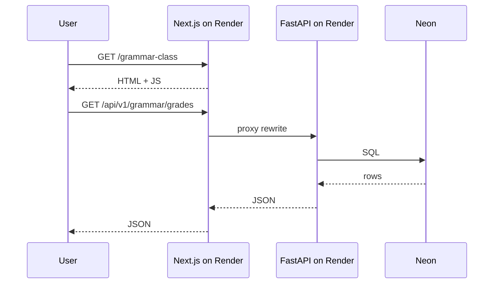

# Deployment architecture

## Components

| Layer | Technology | Hosting |
|-------|------------|---------|
| Frontend | Next.js 15, Node 20 | Render `ai-english-teacher-web` |
| Backend | FastAPI, Python 3.12, Uvicorn | Render `ai-english-teacher-api` |
| Database | PostgreSQL 16 + pgvector | Neon |
| CI | GitHub Actions | GitHub |
| CD | Render autoDeploy + deploy workflow | Render |

## Request flow

## Frontend build

- `output: standalone` in `next.config.js`
- `npm run build` → `postbuild` copies static assets
- `npm start` → `node .next/standalone/frontend/server.js`
- **Not Docker** on Render web service

## Backend build

- `pip install -r requirements-render.txt`
- Copy SQL migrations into `backend/migrations/`
- Start: `uvicorn app.main:app`
- Migrations: automatic via `start.sh` on every API deploy (`SKIP_MIGRATIONS=false`)

## Single source of truth

Only **`render.yaml` at repository root** defines Render services. Archived duplicates live in `archive/deployment/`.
