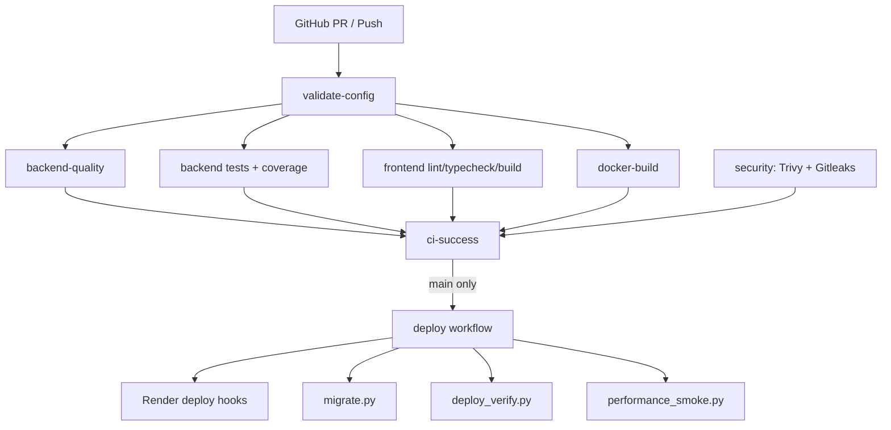

# CI/CD pipeline

## Workflows

| Workflow | File | Trigger |
|----------|------|---------|
| CI | `.github/workflows/ci.yml` | Push/PR touching `ai-english-teacher/` or `render.yaml` |
| Deploy | `.github/workflows/deploy.yml` | After CI succeeds on `main`, or manual |

## Pipeline diagram



## CI stages

### validate-config

- `validate_render_config.py` — canonical `render.yaml` (Node web, Python API, branch `main`)
- `check_migrations.py` — expected migration files on disk
- `migration_report.py` — ordering, duplicates, rollback notes
- `validate_docker.py` — Dockerfile structure and security
- `validate_compose.py` — `docker-compose.yml` services and healthchecks

### backend-quality

- Flake8 (E9, F63, F7, F82 — syntax and undefined names)
- Ruff (E/F on `scripts/`)
- Mypy (`app/core`, `app/schemas`)
- Black (`scripts/`)

### backend

- `validate_connections.py` — OpenAPI surface, optional Postgres + Redis probes
- Pytest with **50%** minimum coverage (`requirements-ci.txt`)

### frontend

- `npm ci`, `lint`, `typecheck`, `build`
- Route table must include `/grammar-class` and `/conversation`

### docker-build

- Builds API and web Docker images and reports image size

### security

- Trivy filesystem scan (CRITICAL/HIGH, non-blocking exit)
- Gitleaks on `ai-english-teacher/` only

### dependency-review (PRs only)

- GitHub dependency review, fails on high severity

## Deploy stages

1. Validate `render.yaml`
2. Optional: POST Render deploy hooks
3. Optional: `migrate.py` with `DATABASE_URL` secret
4. Wait 120s
5. `deploy_verify.py` with retries (~6+ minutes)
6. `performance_smoke.py` latency checks
7. GitHub notice on success

## GitHub configuration

### Secrets

| Secret | Required | Purpose |
|--------|----------|---------|
| `DATABASE_URL` | For deploy migrations | Neon connection string |
| `RENDER_DEPLOY_HOOK_API` | Optional | Trigger API redeploy |
| `RENDER_DEPLOY_HOOK_WEB` | Optional | Trigger web redeploy |

### Variables (optional)

| Variable | Default | Purpose |
|----------|---------|---------|
| `DEPLOY_WEB_URL` | `https://ai-english-teacher-web.onrender.com` | Post-deploy checks |
| `DEPLOY_API_URL` | `https://ai-english-teacher-api.onrender.com` | Post-deploy checks |
| `DEPLOY_VERIFY_GRAMMAR_CLASS` | `true` | Set `false` to skip `/grammar-class` until web redeployed |

### Environments

- `production` — deploy workflow; configure required reviewers in repo settings

## Health endpoints

| Endpoint | Purpose |
|----------|---------|
| `/health` | Overall health + DB latency |
| `/health/live` | Liveness (no dependency checks) |
| `/health/ready` | Readiness (503 if DB unreachable) |
| `/health/ai` | AI provider configuration |
| `/metrics` | Prometheus metrics |

## Branch protection (recommended)

- Require **AI English Teacher CI** before merge to `main`
- Require up-to-date branches
- Restrict force-push to `main`

## Local validation

```bash
python3 ai-english-teacher/scripts/validate_render_config.py
python3 ai-english-teacher/scripts/migration_report.py
bash ai-english-teacher/scripts/ci_lint_backend.sh
cd ai-english-teacher/backend && pip install -r requirements-ci.txt
pytest tests/ --cov=app --cov-fail-under=50
cd ai-english-teacher/frontend && npm ci && npm run lint && npm run typecheck && npm run build
```
