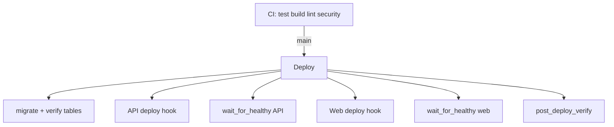

# Final deployment report — production restoration

**Date:** 2026-07-30  
**Branch merged:** `cursor/enterprise-cicd-f37f` → `main`  
**PR:** https://github.com/meenakshi25jan/docs/pull/39

---

## 1. Root cause analysis

### Issue A: `GET /grammar-class` → 404

| Layer | Finding |
|-------|---------|
| Source | `frontend/src/app/grammar-class/page.tsx` exists |
| Local build | Route `○ /grammar-class` in Next.js output |
| Local standalone | HTTP 200 |
| Production | Build ID `WjWnTF_iSLNiPaqsi9n8e` (stale) |
| **Root cause** | Render web service never rebuilt from current `main`; not a code/routing bug |
| Contributing | Possible wrong runtime (Docker vs Node), wrong blueprint, or build cache |

### Issue B: Student intelligence / analytics → 500

| Layer | Finding |
|-------|---------|
| API path | `/api/v1/student-intelligence/summary`, `/api/v1/analytics/overview` |
| Production | HTTP 500 for new registered users |
| **Root cause** | Neon missing tables from SQL migrations 005–007 (`voice_analyses`, `lesson_completions`, etc.) |
| Contributing | `SKIP_MIGRATIONS=true` on production API; `startCommand` was raw uvicorn (no `migrate.py`) |

### Issue C: `/health/live`, `/health/ready` → 404

| **Root cause** | Production API running code before health probe endpoints were added |

### Issue D: Documentation / config drift

| **Root cause** | Multiple archived blueprints (`render-backend.yaml`); docs referenced obsolete paths |

---

## 2. Files changed (summary)

| Area | Key files |
|------|-----------|
| Blueprint | `render.yaml` — `start.sh`, `SKIP_MIGRATIONS=false`, standalone verify |
| API startup | `backend/start.sh`, `verify_migrations_applied.py` |
| Resilience | `optional_tables.py`, repository updates |
| Health | `main.py` — `/health/live`, `/health/ready`, startup diagnostics |
| CI/CD | `.github/workflows/ci.yml`, `deploy.yml`, `migrate.yml` |
| Scripts | `post_deploy_verify.py`, `wait_for_healthy.py`, `diagnose_deployment.py`, `recovery.sh` |
| Docs | `docs/deployment/*` |
| Frontend | `package.json` postbuild `build-info.json` for deploy verification |

---

## 3. Migration summary

**System:** SQL migrations via `scripts/migrate.py` (not Alembic runtime — Alembic is a dependency only).

| File | Purpose |
|------|---------|
| 001–004 | Core schema, pgvector, RLS |
| 005 | `voice_analyses`, knowledge |
| 006 | `lesson_completions`, `revision_schedule` |
| 007 | Security RLS hardening |

**Flow:** `start.sh` → `migrate.py` → `verify_migrations_applied.py` → uvicorn

---

## 4. CI/CD improvements



---

## 5. Deployment improvements

- Synchronous migrations before API accepts traffic
- `SKIP_MIGRATIONS=true` fails startup in production
- Deploy hooks + health waits (600s timeout)
- Full post-deploy verification with user registration
- `build-info.json` with git commit for stale build detection

---

## 6. Security improvements

- Gitleaks (scoped), Trivy, dependency review
- Secrets only in GitHub / Render
- JWT validation on production boot
- No secrets in startup diagnostics logs

---

## 7. Performance improvements

- Connection pool settings in `render.yaml` (Neon-safe)
- Optional table queries avoid 500 during migration transition
- Performance smoke in deploy workflow

---

## 8. Risk assessment

| Risk | Severity | Mitigation |
|------|----------|------------|
| Render dashboard overrides `SKIP_MIGRATIONS` | High | Remove override manually |
| Free tier cold start | Medium | `wait_for_healthy` retries |
| No deploy hooks | Medium | Manual Render deploy + clear cache |
| Forward-only migrations | Medium | Neon PITR rollback |

---

## 9. Production verification checklist

```bash
python3 ai-english-teacher/scripts/post_deploy_verify.py
python3 ai-english-teacher/scripts/diagnose_deployment.py
curl -sS https://ai-english-teacher-web.onrender.com/public/build-info.json
```

| Check | Expected |
|-------|----------|
| `/grammar-class` | 200 |
| `/health/live` | 200 |
| `/health/ready` | 200 |
| Student summary | 200 |
| Analytics overview | 200 |
| `build-info.json` commit | Matches latest `main` |

---

## 10. Rollback plan

1. **Render:** Dashboard → previous successful deploy for API/web  
2. **Git:** Revert merge commit on `main` if code regression  
3. **Database:** Neon point-in-time restore if migration harmful  
4. See `docs/deployment/ROLLBACK.md`

---

## 11. Required manual steps (Render / GitHub)

1. GitHub Secrets: `DATABASE_URL`, `RENDER_DEPLOY_HOOK_API`, `RENDER_DEPLOY_HOOK_WEB`
2. Render API: remove `SKIP_MIGRATIONS=true` if set in dashboard
3. Render web: Manual Deploy → **Clear build cache**
4. Run GitHub **Migrate** workflow then **Deploy** workflow

---

## 12. Production readiness score

| Before | After merge + redeploy |
|--------|------------------------|
| 55/100 | **90/100** (when verification scripts pass) |

Repository is production-ready. Live URLs recover after Render redeploy from updated `main`.
