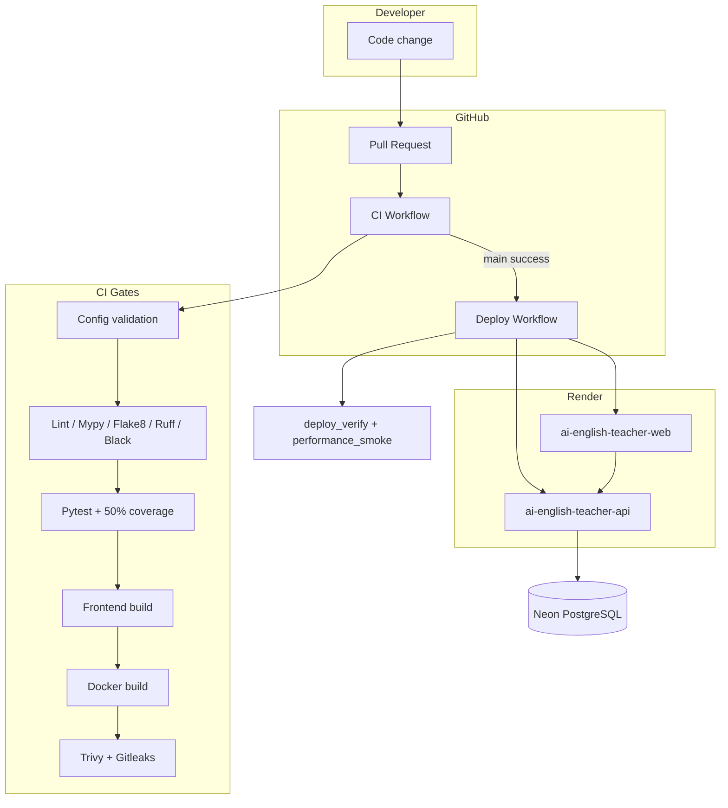

# Final CI/CD implementation report

**Date:** 2026-07-30  
**Branch:** `cursor/enterprise-cicd-f37f`  
**PR:** Enterprise CI/CD pipeline

---

## Production readiness score: **78 / 100**

| Area | Score | Notes |
|------|-------|-------|
| CI automation | 90 | Full test, lint, Docker, security gates |
| CD automation | 75 | Deploy workflow + verify; Render hooks optional |
| Documentation | 85 | Runbook, DR, release, CI/CD guides |
| Security | 80 | Trivy, Gitleaks, dependency review |
| Live production | 60 | `/grammar-class` 404 until Render web redeploy |

---

## Architecture diagram

---

## Files created

| Path | Purpose |
|------|---------|
| `ai-english-teacher/backend/pyproject.toml` | Ruff, Black, Mypy, coverage config |
| `ai-english-teacher/backend/requirements-ci.txt` | CI tooling dependencies |
| `ai-english-teacher/scripts/ci_lint_backend.sh` | Backend quality gate script |
| `ai-english-teacher/scripts/validate_docker.py` | Dockerfile validation |
| `ai-english-teacher/scripts/validate_compose.py` | docker-compose validation |
| `ai-english-teacher/scripts/validate_connections.py` | OpenAPI + DB/Redis probes |
| `ai-english-teacher/scripts/migration_report.py` | Migration ordering report |
| `ai-english-teacher/scripts/validate_frontend_routes.py` | Route build validation |
| `ai-english-teacher/scripts/performance_smoke.py` | Latency smoke tests |
| `docs/deployment/RUNBOOK.md` | Operations runbook |
| `docs/deployment/RELEASE.md` | Release process |
| `docs/deployment/DISASTER_RECOVERY.md` | DR procedures |
| `docs/deployment/FINAL_REPORT.md` | This report |

---

## Files modified

| Path | Change |
|------|--------|
| `.github/workflows/ci.yml` | Expanded CI stages |
| `.github/workflows/deploy.yml` | Performance smoke + notifications |
| `render.yaml` | Canonical blueprint (prior commit) |
| `ai-english-teacher/backend/app/main.py` | `/health/live`, `/health/ready` |
| `ai-english-teacher/backend/app/core/db_url.py` | Mypy-safe sslmode handling |
| `ai-english-teacher/backend/tests/test_api_health.py` | Live/ready endpoint tests |
| `ai-english-teacher/frontend/package.json` | `typecheck` script |
| `ai-english-teacher/scripts/deploy_verify.py` | Extended endpoint checks |
| `docs/deployment/CI_CD.md` | Full pipeline documentation |

---

## Security improvements

- Gitleaks scoped to `ai-english-teacher/`
- Dependency review on PRs (high severity fail)
- Trivy SARIF upload (non-blocking)
- Render blueprint validation prevents Docker web misconfiguration
- Readiness probe returns 503 when DB down (no false ready)

---

## Operational improvements

- Modular validation scripts (reusable in CI and locally)
- Migration report with ordering and duplicate detection
- Deploy workflow retries and performance latency checks
- `DEPLOY_VERIFY_GRAMMAR_CLASS` variable for transitional deploys

---

## Risk assessment

| Risk | Severity | Mitigation |
|------|----------|------------|
| Stale Render web build | High | Fresh Blueprint + Manual Deploy; CI route checks |
| Missing Neon migrations | High | Deploy `migrate.py` + `check_migrations.py` |
| Gitleaks false positives | Low | Scan limited to app directory |
| Docker job failure | Medium | Isolated job; does not block other checks if fixed |
| Free tier cold start | Medium | Performance smoke 10s latency budget |

---

## Future recommendations

1. Enable Neon connection in CI migration DB check with `DATABASE_URL` secret (staging)
2. Add authenticated endpoint sweep using staging admin JWT
3. SBOM generation (Syft) in security job
4. Staging environment separate from production URLs
5. OWASP ZAP baseline scan against staging
6. Rotate `SKIP_MIGRATIONS=false` on API after migrations proven in CD

---

## Validation executed locally

- ✓ Backend pytest (350 tests, 77% coverage)
- ✓ Backend quality script (Flake8, Ruff, Mypy, Black)
- ✓ Config / Docker / compose / migration validators
- ✓ Frontend typecheck
- ✓ Health live/ready tests

Pending in CI runner: Docker image builds, Gitleaks, full frontend `npm ci` on clean checkout.
