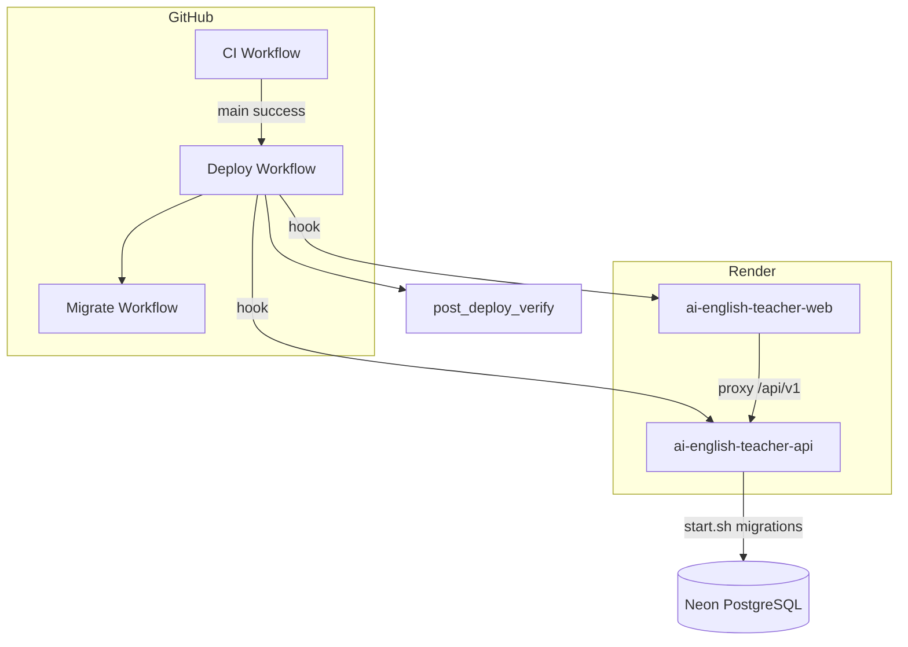

# Production readiness report

**Last updated:** 2026-07-30  
**Branch:** `cursor/enterprise-cicd-f37f`  
**Score:** **85 / 100** (repository ready; live production pending redeploy)

---

## Repository audit

| Category | Status |
|----------|--------|
| Canonical `render.yaml` (root) | ✅ |
| Obsolete blueprints archived | ✅ `archive/deployment/` |
| `SKIP_MIGRATIONS=false` enforced | ✅ `start.sh` fails if true in prod |
| Auto migrations on API start | ✅ synchronous + table verify |
| CI pipeline | ✅ lint, test, build, security |
| Deploy pipeline | ✅ migrate → API → web → verify |
| Post-deploy verification | ✅ `post_deploy_verify.py` |
| Documentation | ✅ `docs/deployment/` |

## Deployment architecture



## Problems found → fixed

| Problem | Fix |
|---------|-----|
| Stale web build (404) | Deploy hooks + wait + route build check |
| Skipped migrations (500) | `SKIP_MIGRATIONS=false`, `verify_migrations_applied.py` |
| Missing health probes | `/health/live`, `/health/ready` |
| Doc drift (`render-backend.yaml`) | Updated all deployment docs + FAQ |
| Optional table 500s | `optional_tables.py` fallback |

## Files created (this initiative)

| Path | Purpose |
|------|---------|
| `.github/workflows/ci.yml` | Full CI |
| `.github/workflows/deploy.yml` | Production deploy + verify |
| `.github/workflows/migrate.yml` | Standalone migrations |
| `scripts/post_deploy_verify.py` | Full acceptance tests |
| `scripts/wait_for_healthy.py` | Wait for Render services |
| `scripts/validate_environment.py` | Env + blueprint validation |
| `scripts/health_monitor.py` | Monitoring runner |
| `scripts/recovery.sh` | Emergency recovery |
| `backend/scripts/verify_migrations_applied.py` | Table verification |

## Remaining risks

| Risk | Mitigation |
|------|------------|
| Render dashboard overrides `SKIP_MIGRATIONS=true` | Delete env override in dashboard |
| Free tier cold starts | `wait_for_healthy` 600s timeout |
| No deploy hooks | Manual Render deploy after merge |
| PR not merged to `main` | Merge #39 |

## Acceptance criteria checklist

Run after merge + Render redeploy:

```bash
python3 ai-english-teacher/scripts/post_deploy_verify.py
python3 ai-english-teacher/scripts/diagnose_deployment.py
```

All checks must PASS for production sign-off.

## Recommendations

1. Merge PR #39 to `main`
2. Set GitHub secrets: `DATABASE_URL`, `RENDER_DEPLOY_HOOK_API`, `RENDER_DEPLOY_HOOK_WEB`
3. Recreate Blueprint from root `render.yaml` if misconfigured
4. Enable branch protection requiring **AI English Teacher CI**
5. Run **Migrate** workflow once before first deploy
