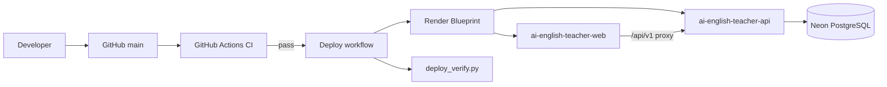

# AI English Teacher — Deployment

Production deployment uses **GitOps**: `main` → GitHub Actions → Render Blueprint → Neon.

## Quick start

1. **Neon:** create project → copy `DATABASE_URL` (`?sslmode=require`)
2. **Render:** New Blueprint → repo `meenakshi25jan/docs` → branch `main` → **`render.yaml`** (repo root)
3. **Render API env:** set `DATABASE_URL`, `OPENAI_API_KEY`
4. **GitHub secrets:** `DATABASE_URL`, optional `RENDER_DEPLOY_HOOK_API`, `RENDER_DEPLOY_HOOK_WEB`
5. Push to `main` → CI runs → Deploy workflow verifies production URLs

## Live URLs

| Service | URL |
|---------|-----|
| Web | https://ai-english-teacher-web.onrender.com |
| API | https://ai-english-teacher-api.onrender.com |
| Grammar Class | https://ai-english-teacher-web.onrender.com/grammar-class |

## Architecture

## Canonical files

| File | Purpose |
|------|---------|
| `render.yaml` | Single Render blueprint (API + web) |
| `.github/workflows/ci.yml` | Test, lint, build, validate |
| `.github/workflows/deploy.yml` | Migrations, hooks, smoke verify |
| `ai-english-teacher/scripts/validate_render_config.py` | Blueprint validation |
| `ai-english-teacher/scripts/check_migrations.py` | Migration file + DB check |
| `ai-english-teacher/scripts/deploy_verify.py` | Post-deploy HTTP checks |

## Docs index

- [Architecture](./ARCHITECTURE.md)
- [CI/CD](./CI_CD.md)
- [Environment variables](./ENVIRONMENT.md)
- [Render setup](./RENDER.md)
- [Troubleshooting](./TROUBLESHOOTING.md)
- [Rollback](./ROLLBACK.md)
- [Audit report](./AUDIT_REPORT.md)

## Fresh Render setup

See `ai-english-teacher/deploy/cheapest/RENDER_FRESH_START.md`
