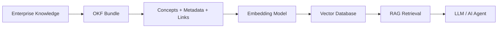

# Google Isn't Replacing RAG — It's Making It Smarter: A Hands-On Comparison with Example Output

Every few months, the AI industry introduces a new concept that sparks endless discussion. Prompt engineering gave way to Retrieval-Augmented Generation (RAG), then AI agents, Model Context Protocol (MCP), and multi-agent systems. Now another term is appearing across LinkedIn, X, and developer communities: **Google's Open Knowledge Format (OKF)**.

Almost immediately, headlines began claiming that "RAG is dead" or that vector databases would soon become obsolete. That sounded unlikely — so instead of jumping to conclusions, I built a side-by-side demo to find out what actually happens when you compare traditional RAG against OKF-enhanced RAG on the same enterprise knowledge base.

**The conclusion: OKF does not replace RAG. It makes RAG better.**

This article walks through that comparison with real example output you can reproduce yourself.

---

## The Real Problem Isn't Retrieval — It's Knowledge Organization

Most enterprise knowledge is scattered across dozens of disconnected systems. Documentation lives in Confluence, APIs are documented separately, architecture diagrams exist somewhere else, code lives in GitHub, and business knowledge is spread across PDFs, spreadsheets, and internal wikis.

When an AI assistant receives a question like *"How does our payment service authenticate requests?"*, the answer may exist in multiple places. The challenge isn't always finding information. The challenge is organizing that information so AI can navigate it efficiently.

That's the problem Google's Open Knowledge Format is trying to solve.

---

## What Is OKF?

Unlike what many people assume, OKF is **not** another language model, vector database, or retrieval framework.

It is an **open specification for organizing knowledge**. Rather than storing large documents that later need to be split into chunks, OKF encourages organizing information into individual concepts. Each concept becomes its own Markdown file enriched with structured metadata using YAML frontmatter. These concepts are then linked together, creating a connected knowledge graph instead of isolated documents.

### Example: an OKF concept file

```markdown
---
type: API Security
title: Payment Authentication
description: How the payment service authenticates incoming API requests.
tags: [payments, security, api]
service: payment-service
security_level: internal
---

# Payment Authentication

All requests to the payment service must include a valid JWT bearer token
issued by the corporate identity provider.

## Flow

1. Client obtains a token from [Identity Provider](identity-provider.md).
2. Client sends `Authorization: Bearer <token>` on every request.
3. The [Payment Gateway](payment-gateway.md) validates the token signature and expiry.
```

Compare that to traditional RAG input: one massive `payment-system-docs.md` file containing authentication, gateway, refunds, monitoring, incidents, and deployment — all in a single document that must be chunked before retrieval.

---

## Traditional RAG vs OKF-Enhanced RAG

| Layer | Traditional RAG | OKF-Enhanced RAG |
|-------|---------------|------------------|
| Knowledge unit | Fixed-size text chunks | One concept per Markdown file |
| Structure | Lost when documents are split | YAML metadata + cross-links |
| Retrieval | Vector similarity only | Metadata filter + vector search + graph expansion |
| Vector database | Required | Still required |
| Best for | Quick prototypes | Enterprise knowledge + AI agents |

The key insight:

```
RAG retrieves information.
OKF organizes information.

One does not replace the other.
```

Think of it like a library. The vector database is the search engine that helps you find books. OKF is the librarian who organizes every book into the correct section before anyone starts searching. A better library doesn't eliminate search — it searches much more effectively.

---

## The Demo

The runnable code lives in `examples/okf-vs-rag/` in this repository.

```bash
cd examples/okf-vs-rag
python3 compare.py
python3 compare.py "investigate a production auth outage in payments"
```

The demo uses a fictional payment platform with eight OKF concepts (`authentication.md`, `payment-gateway.md`, `incident-history.md`, etc.) and one monolithic document containing the same information for traditional RAG.

Both approaches use the same retrieval mechanism (cosine similarity over term-frequency vectors). The only difference is **how knowledge is organized before retrieval**.

---

## Example 1: Authentication Query

**Query:** `How does our payment service authenticate requests?`

### Traditional RAG output

```
========================================================================
Traditional RAG (document chunks + vector similarity)
Query: How does our payment service authenticate requests?
========================================================================

[1] payment-system-docs-chunk-2 (score=0.261)
    excerpt: Page on-call when `auth_failures_total` exceeds 50/min for 5 minutes.
    ## Identity Provider Issues short-lived JWT access tokens used by
    Payment Authentication. ### Token claims - `sub` — user or service
    principal ID - `s...

[2] payment-system-docs-chunk-0 (score=0.213)
    excerpt: # Payment System Documentation This document covers authentication,
    the payment gateway, refunds, monitoring, identity, dependencies,
    incidents, and deployment for the payment platform. ## Payment
    Authentication All requ...

[3] payment-system-docs-chunk-3 (score=0.122)
    excerpt: key rotation; updated Payment Authentication runbook to cache-bust
    JWKS on rotation events. **Follow-up:** Added `auth_failures_total`
    alert in Monitoring. ## Deployment The Payment Gateway deploys via
    blue/green on Kube...

Notes:
  - Documents were split into fixed-size overlapping chunks.
  - No metadata filtering or relationship navigation is available.
  - The model must reconstruct cross-concept context from isolated paragraphs.
```

**What went wrong:** The top result mixes monitoring alerts with identity provider token claims. The retriever found semantically similar text, but the chunk boundaries destroyed the conceptual structure. The LLM must reconstruct the full authentication flow from unrelated paragraph fragments.

### OKF-enhanced RAG output

```
========================================================================
OKF-enhanced RAG (concepts + metadata + graph + vector search)
Query: How does our payment service authenticate requests?
========================================================================

[1] Payment Gateway (score=0.306)
    metadata: {'type': 'Service', 'service': 'payment-service',
              'tags': ['payments', 'gateway', 'api']}
    related concepts: authentication.md, identity-provider.md,
                      refund-workflow.md, service-dependencies.md
    excerpt: # Payment Gateway  The payment gateway is the public entry point for
    all payment operations. It terminates TLS, enforces [Payment
    Authentication](authentication.md), and routes requests to downstream
    processors...

[2] Payment Authentication (score=0.251)
    metadata: {'type': 'API Security', 'service': 'payment-service',
              'tags': ['payments', 'security', 'api']}
    related concepts: identity-provider.md, incident-history.md,
                      monitoring.md, payment-gateway.md
    excerpt: # Payment Authentication  All requests to the payment service must
    include a valid JWT bearer token issued by the corporate identity
    provider.  ## Flow  1. Client obtains a token from [Identity Provider]
    (identity-provide...

[3] Payment Monitoring (score=0.107)
    metadata: {'type': 'Metric', 'service': 'payment-service',
              'tags': ['payments', 'monitoring', 'observability']}
    related concepts: identity-provider.md, incident-history.md,
                      refund-workflow.md

[5] Service Dependencies (score=0.000)    ← pulled in via graph links
[6] Incident History (score=0.000)       ← pulled in via graph links
[7] Identity Provider (score=0.000)      ← pulled in via graph links

Notes:
  - Knowledge is organized as OKF concepts (one concept per markdown file).
  - YAML frontmatter enables metadata pre-filtering before semantic search.
  - Cross-links expand retrieval to related concepts (knowledge graph navigation).
  - Vector similarity still runs — OKF improves organization, not replacement.
```

**What improved:** The retriever returns whole, named concepts with structured metadata. Related concepts (`identity-provider.md`, `incident-history.md`) are included through graph navigation even when their semantic score is zero — because they are explicitly linked from the top-matching concepts.

### Side-by-side verdict (Example 1)

```
Traditional RAG:
  - Retrieved 3 arbitrary document chunks
  - Fragmented IDs: True
  - No concept relationships preserved

OKF-enhanced RAG:
  - Retrieved whole concepts including auth: True
  - Graph-linked related concepts: 20 links surfaced
  - Metadata available for filtering (service, tags, type)
```

---

## Example 2: Production Outage Investigation

This is where OKF has the biggest impact — not on simple Q&A chatbots, but on **AI agents** that must reason across multiple sources.

**Query:** `investigate a production auth outage in payments`

### Traditional RAG output

```
[1] payment-system-docs-chunk-2 (score=0.195)
    excerpt: Page on-call when `auth_failures_total` exceeds 50/min for 5 minutes.
    ## Identity Provider Issues short-lived JWT access tokens...

[2] payment-system-docs-chunk-0 (score=0.124)
    excerpt: # Payment System Documentation This document covers authentication,
    the payment gateway, refunds, monitoring...

[3] payment-system-docs-chunk-1 (score=0.118)
    excerpt: Method | Path | Description | | POST | `/v1/charges` | Create a charge |
    | POST | `/v1/refunds` | Initiate a refund workflow...
```

The retriever returns monitoring thresholds and API endpoint tables — not the incident postmortem. An agent investigating an outage would miss the most relevant document entirely.

### OKF-enhanced RAG output

```
[1] Payment Authentication (score=0.114)
    related concepts: identity-provider.md, incident-history.md,
                      monitoring.md, payment-gateway.md

[2] Payment Gateway (score=0.083)
[3] Payment Monitoring (score=0.071)

[5] Incident History (score=0.000)       ← graph-expanded
    excerpt: # Incident History  ## INC-2025-0412 — Auth outage (2025-04-12)
    **Impact:** 23% of payment requests returned 401 for 18 minutes.
    **Root cause:** [Identity Provider](identity-provider.md) JWKS endpoint
    returned stale keys after rotation.

[6] Service Dependencies (score=0.000)   ← graph-expanded
[7] Identity Provider (score=0.000)      ← graph-expanded
```

Even though `incident-history.md` scored zero on semantic similarity, the knowledge graph pulled it in automatically because it is linked from `authentication.md` and `monitoring.md`. This mirrors how experienced engineers investigate outages: start at authentication, follow links to monitoring, then check incident history.

---

## Does This Mean Vector Databases Become Obsolete?

No. This is probably the biggest misconception surrounding OKF.

Vector databases solve a completely different problem. They store embeddings and perform semantic similarity search. OKF doesn't replace embeddings or similarity search. It improves the information that gets embedded in the first place.

In the demo, both approaches use the same vector similarity function. In production, you would still use Pinecone, OpenSearch, pgvector, or any other vector store. OKF changes what you put *into* that store.

---

## Why Metadata Becomes Even More Important

If you've worked with Amazon Bedrock Knowledge Bases or Amazon OpenSearch, you've seen how powerful metadata can be. Metadata lets retrieval systems filter by department, product, security level, or document type before semantic search even begins.

OKF naturally extends this idea. Since every concept already includes structured metadata in YAML frontmatter, AI systems gain richer context before retrieval starts:

```yaml
---
type: API Security
title: Payment Authentication
tags: [payments, security, api]
service: payment-service
security_level: internal
---
```

The OKF-enhanced RAG pipeline in the demo filters by `service: payment-service` and relevant tags before running similarity search — narrowing the search space the same way production metadata filters do.

---

## Architecture: OKF + RAG Together



The best approach is not choosing between OKF and RAG. It is feeding OKF-organized knowledge into your existing RAG pipeline.

---

## JSON Output Summary

The demo also prints machine-readable results for integration testing or logging:

```json
{
  "query": "How does our payment service authenticate requests?",
  "traditional_rag": {
    "chunks": [
      { "id": "payment-system-docs-chunk-2", "score": 0.2606 },
      { "id": "payment-system-docs-chunk-0", "score": 0.2133 },
      { "id": "payment-system-docs-chunk-3", "score": 0.1216 }
    ]
  },
  "okf_enhanced_rag": {
    "chunks": [
      {
        "id": "payment-gateway.md",
        "score": 0.3057,
        "metadata": {
          "type": "Service",
          "title": "Payment Gateway",
          "tags": ["payments", "gateway", "api"]
        },
        "related": [
          "authentication.md",
          "identity-provider.md",
          "refund-workflow.md",
          "service-dependencies.md"
        ]
      },
      {
        "id": "authentication.md",
        "score": 0.2507,
        "metadata": {
          "type": "API Security",
          "title": "Payment Authentication",
          "tags": ["payments", "security", "api"]
        },
        "related": [
          "identity-provider.md",
          "incident-history.md",
          "monitoring.md",
          "payment-gateway.md"
        ]
      }
    ]
  },
  "conclusion": "OKF complements RAG; it does not replace vector search or embeddings."
}
```

---

## Final Thoughts

Breakthroughs rarely replace everything that came before them. More often, they improve one layer of the stack while building on the strengths of existing technologies.

That's how I see Google's Open Knowledge Format.

It isn't trying to eliminate vector databases, embeddings, or Retrieval-Augmented Generation. Instead, it provides a cleaner and more structured foundation for those technologies to work with. Better knowledge organization leads to better retrieval, and better retrieval ultimately leads to more reliable AI systems.

Perhaps the real question was never *"Is RAG dead?"*

Maybe the better question is:

**What happens when AI stops retrieving disconnected chunks of information and starts navigating a well-structured network of knowledge instead?**

I believe that's the direction enterprise AI is heading — and OKF might be one of the first major steps toward that future.

---

## Try It Yourself

```bash
git clone <this-repo>
cd examples/okf-vs-rag
python3 compare.py
```

## References

- [Google Cloud: How the Open Knowledge Format can improve data sharing](https://cloud.google.com/blog/products/data-analytics/how-the-open-knowledge-format-can-improve-data-sharing)
- [OKF Specification on GitHub](https://github.com/GoogleCloudPlatform/knowledge-catalog/blob/main/okf/SPEC.md)
- Demo source code: `examples/okf-vs-rag/` in this repository
