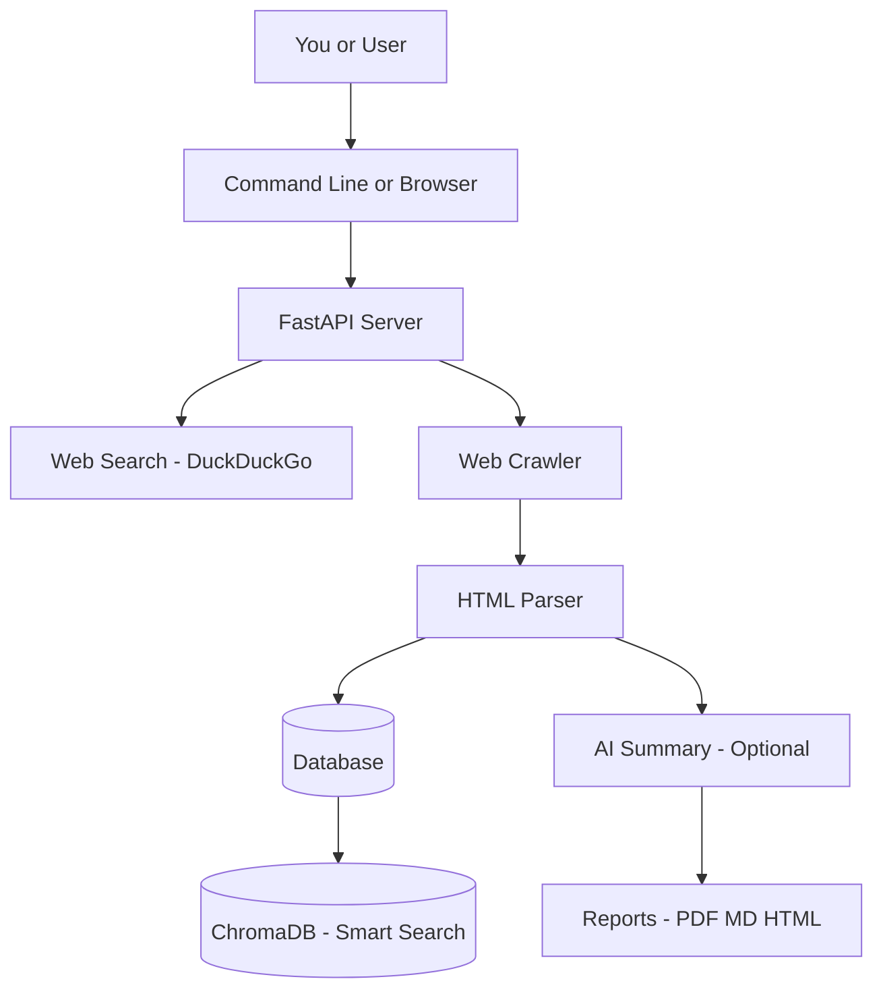
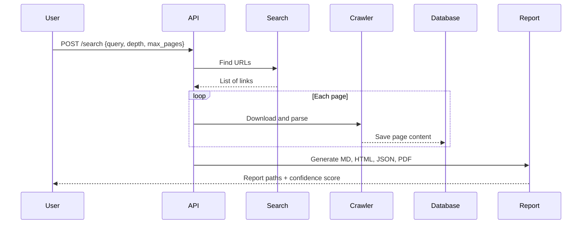
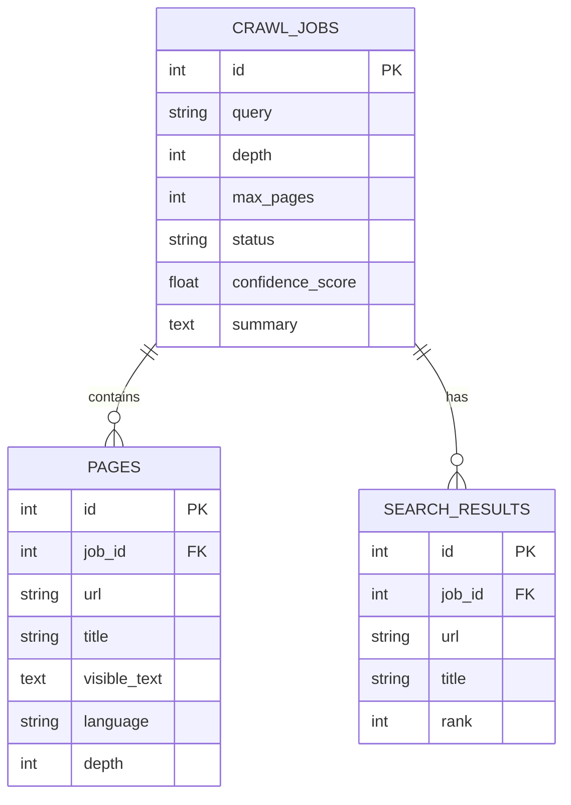

# Complete Beginner's Project Playbook

**Who is this for?**  
Anyone who wants to build software but does not know:
- Which technology to pick
- Where to download tools
- How to install everything
- Which cloud to use
- Where to start step by step

**No coding experience required to read this guide.**  
We explain every term in simple language.

---

## Table of Contents

1. [Executive Summary](#1-executive-summary)
2. [Requirement Analysis](#2-requirement-analysis)
3. [Technology Comparison](#3-technology-comparison-table)
4. [Cost Comparison](#4-cost-comparison-table)
5. [Final Recommendation](#5-final-recommendation)
6. [Architecture](#6-architecture)
7. [Development Roadmap](#7-development-roadmap)
8. [Installation Guide](#8-installation-guide)
9. [Environment Setup](#9-environment-setup)
10. [Scripts](#10-scripts)
11. [Project Structure](#11-project-structure)
12. [Source Code Overview](#12-source-code-overview)
13. [Testing](#13-testing)
14. [Deployment](#14-deployment)
15. [Documentation Index](#15-documentation-index)
16. [Future Improvements](#16-future-improvements)
17. [Risks](#17-risks)
18. [Best Practices](#18-best-practices)
19. [Learning Resources](#19-learning-resources)
20. [Next Steps](#20-next-steps)

---

## 1. Executive Summary

### What is this playbook?

This is a **step-by-step guide** that helps you go from **"I have an idea"** to **"my project runs on my computer or in the cloud"**.

We use the **Research Agent** (AI web crawler) as a real example, but the same steps work for most software projects.

### The simple path (3 stages)

```
Stage 1: Learn on your computer (FREE)
    ↓
Stage 2: Put it online with an easy cloud (LOW COST)
    ↓
Stage 3: Scale when you have many users (PAID)
```

### Best cloud for beginners (short answer)

| Your situation | Best choice | Why |
|----------------|-------------|-----|
| Just learning | **Your own computer** | Free, no credit card |
| First online version | **Render** or **Railway** | Click deploy, very easy |
| More control, still affordable | **DigitalOcean** or **Hetzner** | Simple servers, clear pricing |
| Big company / enterprise | **AWS** or **Google Cloud** | Most features, harder to learn |

**Our #1 recommendation for beginners:** Start on your computer, then use **Render** or **Railway** for your first cloud deployment.

---

## 2. Requirement Analysis

### What we know about your goal (Option C)

| Question | Your answer |
|----------|-------------|
| Project type | Reusable playbook + example project |
| Target audience | Non-developers, freshers, unsure where to start |
| Budget | Start free, grow later |
| Platform | Web API + CLI (command line) |
| AI needed? | Yes (optional — can run without paid AI) |
| Team size | Solo or small team |
| Timeline | Learn at your own pace |

### Glossary (words you will see)

| Word | Simple meaning |
|------|----------------|
| **API** | A way for programs to talk to each other over the internet |
| **Backend** | The "brain" of the app (runs on a server) |
| **Frontend** | What users see in the browser (buttons, pages) |
| **Database** | Where data is stored (like Excel, but for apps) |
| **Cloud** | Someone else's computer you rent over the internet |
| **Docker** | A box that packages your app so it runs the same everywhere |
| **Git** | Tool to save versions of your code |
| **GitHub** | Website to store and share code |
| **CLI** | Typing commands in a terminal instead of clicking buttons |
| **Environment variable** | Secret settings (passwords, API keys) stored outside code |

---

## 3. Technology Comparison Table

### Backend language (where the "brain" is written)

| Technology | Best for | Cost | Learning curve | Our rating for beginners |
|------------|----------|------|----------------|------------------------|
| **Python** | AI, data, APIs, automation | Free | Easy | ⭐⭐⭐⭐⭐ **Best pick** |
| Node.js | Real-time web apps | Free | Medium | ⭐⭐⭐⭐ |
| Java | Big enterprise systems | Free | Hard | ⭐⭐ |
| Go | High-speed servers | Free | Medium | ⭐⭐⭐ |
| PHP | Simple websites | Free | Easy | ⭐⭐⭐ |

**Why Python for this project?**  
AI tools, web crawling, and FastAPI work very well with Python. Huge community, tons of tutorials.

---

### Database (where data is saved)

| Database | Best for | Cost | Beginner friendly? |
|----------|----------|------|-------------------|
| **SQLite** | Learning, small projects | Free | ⭐⭐⭐⭐⭐ **Start here** |
| **PostgreSQL** | Production, many users | Free (self-host) | ⭐⭐⭐⭐ **Upgrade here** |
| MySQL | Websites, WordPress | Free | ⭐⭐⭐⭐ |
| MongoDB | Flexible JSON data | Free tier | ⭐⭐⭐ |

**Recommendation:** SQLite while learning → PostgreSQL when you go online with real users.

---

### Cloud providers (where your app runs on the internet)

| Cloud | Monthly cost (starter) | Easy for beginners? | Best use case |
|-------|------------------------|---------------------|---------------|
| **Your PC** | $0 | ⭐⭐⭐⭐⭐ | Learning |
| **Render** | $0–7 free/low tier | ⭐⭐⭐⭐⭐ | First deployment |
| **Railway** | $0–5 credit | ⭐⭐⭐⭐⭐ | First deployment |
| **DigitalOcean** | $4–6/month | ⭐⭐⭐⭐ | Small production app |
| **Hetzner** | €4/month | ⭐⭐⭐⭐ | Cheapest VPS in EU |
| **AWS** | Complex billing | ⭐⭐ | Enterprise scale |
| **Google Cloud** | Complex billing | ⭐⭐ | AI + big data |
| **Azure** | Complex billing | ⭐⭐ | Microsoft companies |

### Cloud comparison — detailed

#### Render
- **Pros:** Free tier, connect GitHub, auto-deploy, HTTPS included
- **Cons:** Free tier sleeps after inactivity
- **Download:** No download — sign up at https://render.com
- **Best for:** First time putting an app online

#### Railway
- **Pros:** Very easy UI, good free credits, GitHub deploy
- **Cons:** Credits run out; need paid plan for 24/7
- **Sign up:** https://railway.app
- **Best for:** Quick prototypes

#### DigitalOcean
- **Pros:** Simple "Droplet" servers, predictable $6/month
- **Cons:** You manage more yourself (or use their App Platform)
- **Sign up:** https://www.digitalocean.com
- **Best for:** When you outgrow free tiers

#### AWS (Amazon Web Services)
- **Pros:** Most services, used by Netflix, Airbnb
- **Cons:** Confusing for beginners, easy to get unexpected bills
- **Sign up:** https://aws.amazon.com
- **Best for:** Later, when you have a team or enterprise needs

---

### AI providers

| Provider | Cost | Needs internet? | Beginner friendly? |
|----------|------|-----------------|-------------------|
| **None (built-in summary)** | Free | No | ⭐⭐⭐⭐⭐ **Start here** |
| **Ollama (local)** | Free | No | ⭐⭐⭐⭐ |
| **OpenAI** | Pay per use (~$0.01–0.10 per summary) | Yes | ⭐⭐⭐ |
| Google Gemini | Free tier available | Yes | ⭐⭐⭐ |

**Recommendation:** Set `LLM_PROVIDER=none` first. Add OpenAI or Ollama only when you need smarter summaries.

---

## 4. Cost Comparison Table

### Monthly cost estimate (Research Agent example)

| Item | Learning (local) | Small online | Growing business |
|------|------------------|--------------|----------------|
| Computer / server | $0 | $0–7 (Render free) | $20–50 (VPS) |
| Database | $0 (SQLite) | $0–7 | $15 (managed PostgreSQL) |
| Domain name | $0 | $10–15/year | $10–15/year |
| SSL (HTTPS) | N/A | Free (Render/Cloudflare) | Free |
| OpenAI API | $0 | $5–20 | $50–200 |
| Monitoring | $0 | $0 | $10–30 |
| **Total/month** | **$0** | **$0–15** | **$50–150** |

### Yearly cost (realistic beginner path)

| Year 1 stage | Estimated yearly cost |
|--------------|----------------------|
| Months 1–3: Learn locally | **$0** |
| Months 4–6: Free cloud tier | **$0–50** |
| Months 7–12: Small paid hosting + domain | **$100–200** |

### Free alternatives checklist

- [x] Python — free
- [x] VS Code — free
- [x] Git — free
- [x] SQLite — free
- [x] Docker Desktop — free for personal use
- [x] DuckDuckGo search — free (no API key)
- [x] Render/Railway free tiers — free to start
- [x] Let's Encrypt SSL — free

---

## 5. Final Recommendation

### Recommended stack (beginner → production)

```
┌─────────────────────────────────────────────────────────┐
│  PHASE 1 (Learn)          PHASE 2 (Online)   PHASE 3    │
│  Your laptop              Render/Railway     DigitalOcean│
│  Python + SQLite          + PostgreSQL       + Docker   │
│  No AI cost               Optional OpenAI    Full monitoring│
└─────────────────────────────────────────────────────────┘
```

| Layer | Choice | Why |
|-------|--------|-----|
| Language | Python 3.12 | Easiest for AI + APIs |
| Framework | FastAPI | Modern, auto API docs |
| Database | SQLite → PostgreSQL | Free start, easy upgrade |
| Search | DuckDuckGo | No API key needed |
| AI | None → Ollama → OpenAI | Free path first |
| Container | Docker | Same app everywhere |
| Cloud (first) | **Render** | Easiest deploy from GitHub |
| Cloud (later) | DigitalOcean | Cheap, predictable |
| Code hosting | GitHub | Free, industry standard |
| Editor | VS Code | Free, best extensions |

---

## 6. Architecture

### High-level architecture (simple view)



**In plain English:**
1. You type a question (e.g. "Artificial Intelligence")
2. The app searches Google-like engines
3. It visits web pages and reads them
4. It saves text in a database
5. Optionally, AI writes a summary
6. You get a report file

### Low-level flow



### Database diagram (ER)



---

## 7. Development Roadmap

| Phase | What you build | Difficulty | Priority |
|-------|----------------|------------|----------|
| **Phase 1** | Install tools, run app on your PC | Easy | Must do |
| **Phase 2** | Run one search, read the report | Easy | Must do |
| **Phase 3** | Turn on Docker | Medium | Should do |
| **Phase 4** | Deploy to Render/Railway | Medium | Should do |
| **Phase 5** | Add domain name + HTTPS | Medium | Nice to have |
| **MVP** | API works online 24/7 | Medium | Goal |
| **v1.0** | PostgreSQL + API key security | Hard | After MVP |
| **v2.0** | Web UI dashboard | Hard | Future |

### Time guide (self-paced)

| Stage | If you study 1–2 hrs/day |
|-------|--------------------------|
| Install everything | 1–2 days |
| First successful crawl | 1 day |
| Understand the code | 1–2 weeks |
| Deploy online | 2–3 days |
| Comfortable maintaining | 1–2 months |

---

## 8. Installation Guide

### What you need before starting

- A computer (Windows 10+, macOS, or Linux)
- Internet connection
- About 5 GB free disk space
- Admin rights to install software

### Step 0: Choose your operating system guide

| OS | Setup script | Manual guide section |
|----|--------------|----------------------|
| Windows | `scripts/setup-windows.ps1` | Section 9.1 |
| Linux (Ubuntu) | `scripts/setup-linux.sh` | Section 9.2 |
| macOS | `scripts/setup-mac.sh` | Section 9.3 |

---

## 9. Environment Setup

### 9.1 Windows setup (step by step)

#### Step 1: Install Git
1. Open: https://git-scm.com/download/win
2. Download and run the installer
3. Click **Next** on all screens (defaults are fine)
4. Verify — open **PowerShell** and type:
   ```powershell
   git --version
   ```
   **Expected output:** `git version 2.x.x`

#### Step 2: Install Python 3.12
1. Open: https://www.python.org/downloads/
2. Download **Python 3.12.x**
3. **IMPORTANT:** Check ✅ **"Add Python to PATH"** on first screen
4. Click **Install Now**
5. Verify:
   ```powershell
   python --version
   ```
   **Expected output:** `Python 3.12.x`

#### Step 3: Install VS Code
1. Open: https://code.visualstudio.com/
2. Download and install
3. Inside VS Code, install extensions:
   - **Python** (Microsoft)
   - **Docker** (Microsoft)
   - **GitLens**

#### Step 4: Install Docker Desktop (optional but recommended)
1. Open: https://www.docker.com/products/docker-desktop/
2. Download for Windows
3. Install and restart computer
4. Verify:
   ```powershell
   docker --version
   ```

#### Step 5: Get the project code
```powershell
git clone https://github.com/meenakshi25jan/docs.git
cd docs/research-agent
```

#### Step 6: Run the setup script
```powershell
powershell -ExecutionPolicy Bypass -File scripts\setup-windows.ps1
```

#### Step 7: Run your first search
```powershell
.\.venv\Scripts\Activate.ps1
python -m app.main search --query "Artificial Intelligence" --depth 1 --pages 5
```

**Expected output:** JSON with `"status": "completed"` and a report file path.

---

### 9.2 Linux (Ubuntu) setup

```bash
# Run the automated script
chmod +x scripts/setup-linux.sh
./scripts/setup-linux.sh

# Activate environment
source .venv/bin/activate

# First search
python -m app.main search --query "Artificial Intelligence" --depth 1 --pages 5
```

---

### 9.3 macOS setup

```bash
# Install Homebrew first (if missing): https://brew.sh
/bin/bash -c "$(curl -fsSL https://raw.githubusercontent.com/Homebrew/install/HEAD/install.sh)"

chmod +x scripts/setup-mac.sh
./scripts/setup-mac.sh

source .venv/bin/activate
python -m app.main search --query "Artificial Intelligence" --depth 1 --pages 5
```

---

### 9.4 Environment variables (.env file)

```bash
cp .env.example .env
```

**Minimum settings for beginners:**

```env
LLM_PROVIDER=none
SEARCH_PROVIDER=duckduckgo
DATABASE_URL=sqlite+aiosqlite:///./data/research_agent.db
```

You do **not** need OpenAI or Google API keys to start.

---

### 9.5 Troubleshooting

| Problem | Solution |
|---------|----------|
| `python: command not found` | Reinstall Python, check "Add to PATH" |
| `pip install` fails | Run: `python -m pip install --upgrade pip` |
| Playwright error | Run: `playwright install chromium` |
| Permission denied (Linux/Mac) | Run: `chmod +x scripts/*.sh` |
| Port 8000 in use | Use: `python -m app.main serve --port 8001` |
| Crawl returns 0 pages | Check internet; try smaller `--pages 3` |

---

## 10. Scripts

All scripts are in the `scripts/` folder:

| Script | OS | What it does |
|--------|-----|--------------|
| `setup-windows.ps1` | Windows | Installs deps, venv, Playwright |
| `setup-linux.sh` | Linux | Same for Ubuntu/Debian |
| `setup-mac.sh` | macOS | Same for Mac |
| `start-api.sh` | Linux/Mac | Starts the API server |
| `health-check.sh` | Linux/Mac | Checks if API is healthy |
| `backup-data.sh` | Linux/Mac | Backs up database and reports |

**Makefile commands (Linux/Mac):**

```bash
make setup      # Install everything
make test       # Run tests
make serve      # Start API
make docker-up  # Start with Docker
```

---

## 11. Project Structure

```
research-agent/
├── app/                    # Main application code
│   ├── crawler/            # Downloads and reads web pages
│   ├── search/             # Finds URLs (DuckDuckGo, etc.)
│   ├── ai/                 # Summaries and smart search
│   ├── database/           # Saves data
│   ├── api/                # Web API endpoints
│   ├── reports/            # Creates PDF, HTML, etc.
│   └── main.py             # Start here (CLI + server)
├── config.py               # All settings
├── scripts/                # Easy setup scripts for you
├── tests/                  # Automatic quality checks
├── docs/                   # Guides (this file!)
├── .env.example            # Copy to .env
├── requirements.txt        # Python packages list
├── Dockerfile              # Cloud deployment box
└── docker-compose.yml      # Run everything with one command
```

---

## 12. Source Code Overview

You do **not** need to understand all code on day one.

**Start by reading these files in order:**

1. `README.md` — Quick overview
2. `config.py` — All settings in one place
3. `app/main.py` — How the app starts
4. `app/api/routes.py` — API endpoints
5. `app/crawler/crawler.py` — How crawling works

---

## 13. Testing

### What is testing?
Automatic checks that prove the app still works after changes.

### Run tests
```bash
source .venv/bin/activate   # Linux/Mac
pytest -v
```

**Expected:** `19 passed`

### What the tests check
- URL cleaning works
- HTML parsing extracts titles and text
- Reports are created
- API health endpoint responds

---

## 14. Deployment

### Option A: Local only (free)
```bash
python -m app.main serve
```
Open: http://localhost:8000/health

### Option B: Docker (recommended before cloud)
```bash
docker compose up --build
```

### Option C: Render (easiest cloud for beginners)

1. Push code to GitHub
2. Sign up at https://render.com
3. Click **New +** → **Web Service**
4. Connect your GitHub repo
5. Settings:
   - **Root Directory:** `research-agent`
   - **Build Command:** `pip install -r requirements.txt && playwright install chromium`
   - **Start Command:** `python -m app.main serve --host 0.0.0.0 --port $PORT`
6. Click **Create Web Service**
7. Wait 5–10 minutes
8. Visit your URL: `https://your-app.onrender.com/health`

### Option D: DigitalOcean Droplet ($6/month)

1. Create account at https://www.digitalocean.com
2. Create Droplet → Ubuntu 22.04 → $6 plan
3. SSH into server
4. Install Docker
5. Clone repo and run `docker compose up -d`

### SSL (HTTPS)
- **Render/Railway:** Automatic, free
- **VPS:** Use Caddy or Nginx + Let's Encrypt (free)

---

## 15. Documentation Index

| Document | Purpose |
|----------|---------|
| `README.md` | Quick start |
| `docs/BEGINNER_PLAYBOOK.md` | This full guide |
| `.env.example` | Configuration reference |
| API docs | http://localhost:8000/docs (when server running) |

---

## 16. Future Improvements

- [ ] Web dashboard (no command line needed)
- [ ] User accounts and login
- [ ] Email report delivery
- [ ] Scheduled automatic research jobs
- [ ] Mobile app
- [ ] Multi-language UI

---

## 17. Risks

| Risk | What can go wrong | How to avoid |
|------|-------------------|--------------|
| Legal | Crawling sites that forbid it | Respect robots.txt (enabled by default) |
| Cost | OpenAI bills add up | Start with `LLM_PROVIDER=none` |
| Cloud bills | AWS surprise charges | Use Render free tier first |
| Security | API open to everyone | Set `API_KEY` in production |
| Performance | Crawling too fast | Lower `MAX_CONCURRENT_REQUESTS` |
| Data loss | No backups | Run `scripts/backup-data.sh` weekly |

---

## 18. Best Practices

1. **Start free** — learn locally before paying for cloud
2. **One step at a time** — install → run → test → deploy
3. **Use Git** — save every working version
4. **Never put passwords in code** — use `.env` file
5. **Read error messages** — they usually say what's wrong
6. **Run tests** before deploying changes
7. **Back up** database and reports regularly
8. **Ask for help** — copy the full error message when asking

---

## 19. Learning Resources

### Free courses
- [Python for Everybody](https://www.py4e.com/) — best Python starter
- [FastAPI Tutorial](https://fastapi.tiangolo.com/tutorial/) — official docs
- [GitHub Skills](https://skills.github.com/) — learn Git and GitHub
- [Docker Getting Started](https://docs.docker.com/get-started/)

### YouTube search terms
- "Python for absolute beginners"
- "FastAPI crash course"
- "Deploy Python app Render"
- "Git and GitHub tutorial"

### Download links (official only)

| Tool | Official download |
|------|-------------------|
| Python | https://www.python.org/downloads/ |
| Git | https://git-scm.com/downloads |
| VS Code | https://code.visualstudio.com/ |
| Docker | https://www.docker.com/products/docker-desktop/ |
| Postman | https://www.postman.com/downloads/ |
| GitHub Desktop | https://desktop.github.com/ |

---

## 20. Next Steps

### Your checklist (do in order)

- [ ] **Day 1:** Install Python, Git, VS Code
- [ ] **Day 2:** Clone project, run `setup` script
- [ ] **Day 3:** Run first search with 5 pages
- [ ] **Day 4:** Start API, open http://localhost:8000/docs
- [ ] **Day 5:** Run `pytest -v`
- [ ] **Week 2:** Try Docker (`docker compose up`)
- [ ] **Week 3:** Create GitHub account, push your code
- [ ] **Week 4:** Deploy to Render free tier

### When you are stuck

1. Read the error message slowly
2. Check the Troubleshooting section (9.5)
3. Search the error on Google
4. Ask in communities: Stack Overflow, Reddit r/learnpython

---

*You do not need to know everything on day one. Every professional developer started exactly where you are now.*
