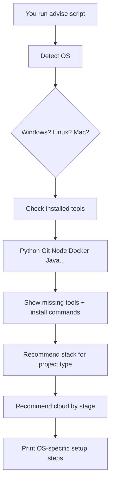

# Universal Project Playbook

**Works for ANY software project — not just this one.**

This guide adapts to **your operating system** and tells you exactly what to download, install, and run.

---

## Run the OS Advisor (start here)

The advisor **detects your computer automatically** and prints tailored suggestions.

### Windows
```powershell
cd research-agent
powershell -ExecutionPolicy Bypass -File scripts\advise.ps1
powershell -ExecutionPolicy Bypass -File scripts\advise.ps1 -ProjectType web
powershell -ExecutionPolicy Bypass -File scripts\advise.ps1 -ProjectType ai
```

### Linux / macOS
```bash
cd research-agent
chmod +x scripts/advise.sh
./scripts/advise.sh                  # general project
./scripts/advise.sh web              # web app
./scripts/advise.sh ai               # AI / ML project
./scripts/advise.sh --json mobile    # machine-readable output
```

### All project types supported
```
general | web | api | ai | mobile | desktop | data | ecommerce
```

---

## How it works



---

## OS-specific quick reference

### Windows

| Task | Command |
|------|---------|
| Install Python | `winget install Python.Python.3.12` |
| Install Git | `winget install Git.Git` |
| Install Node | `winget install OpenJS.NodeJS.LTS` |
| Create venv | `python -m venv .venv` |
| Activate venv | `.\.venv\Scripts\Activate.ps1` |
| Copy env file | `copy .env.example .env` |
| Run setup | `powershell -File scripts\setup-windows.ps1` |
| Get advice | `powershell -File scripts\advise.ps1` |

**Download links (Windows):**
- Python: https://www.python.org/downloads/ (✅ check "Add to PATH")
- Git: https://git-scm.com/download/win
- VS Code: https://code.visualstudio.com/
- Docker: https://www.docker.com/products/docker-desktop/

---

### Linux (Ubuntu/Debian)

| Task | Command |
|------|---------|
| Install Python | `sudo apt install -y python3 python3-pip python3-venv` |
| Install Git | `sudo apt install -y git` |
| Install Node | `sudo apt install -y nodejs npm` |
| Create venv | `python3 -m venv .venv` |
| Activate venv | `source .venv/bin/activate` |
| Copy env file | `cp .env.example .env` |
| Run setup | `./scripts/setup-linux.sh` |
| Get advice | `./scripts/advise.sh` |

**Package managers by distro:**
| Distro | Package manager |
|--------|----------------|
| Ubuntu/Debian | `apt` |
| Fedora/RHEL | `dnf` |
| Arch | `pacman` |
| openSUSE | `zypper` |

---

### macOS

| Task | Command |
|------|---------|
| Install Homebrew | https://brew.sh |
| Install Python | `brew install python@3.12` |
| Install Git | `brew install git` |
| Install Node | `brew install node` |
| Create venv | `python3 -m venv .venv` |
| Activate venv | `source .venv/bin/activate` |
| Copy env file | `cp .env.example .env` |
| Run setup | `./scripts/setup-mac.sh` |
| Get advice | `./scripts/advise.sh` |

---

## Technology recommendations by project type

### Web Application
| Layer | Recommendation | Why |
|-------|---------------|-----|
| Frontend | React or Next.js | Largest community, most jobs |
| Backend | Node.js or Python FastAPI | Fast development |
| Database | PostgreSQL | Reliable, free, scales well |
| Hosting | Vercel + Render | Free tiers, easy deploy |

### API / Backend Service
| Layer | Recommendation | Why |
|-------|---------------|-----|
| Language | Python (FastAPI) | Auto API docs, easy to learn |
| Database | SQLite → PostgreSQL | Free start, easy upgrade |
| Auth | JWT or API keys | Simple, industry standard |
| Hosting | Render or Railway | One-click deploy |

### AI / Machine Learning
| Layer | Recommendation | Why |
|-------|---------------|-----|
| Language | Python | All AI libraries are here |
| LLM (free) | Ollama | Runs locally, no cost |
| LLM (paid) | OpenAI API | Best quality, pay per use |
| Vector DB | ChromaDB | Free, local, easy setup |
| Hosting | Your PC first | AI models need GPU/RAM |

### Mobile App
| Layer | Recommendation | Why |
|-------|---------------|-----|
| Framework | Flutter | One codebase → iOS + Android |
| Backend | Firebase | No server management |
| Alternative | React Native | If you know JavaScript |

### Desktop App
| Layer | Recommendation | Why |
|-------|---------------|-----|
| Easy | Electron (JavaScript) | Web skills transfer directly |
| Lightweight | Tauri (Rust) | Smaller file size |
| Python | PyQt / Tkinter | If you know Python |

### E-commerce
| Layer | Recommendation | Why |
|-------|---------------|-----|
| No-code | Shopify | Fastest to market |
| Custom | Next.js + Stripe | Full control |
| Payments | Stripe (global) / Razorpay (India) | Industry standard |

### Data / Analytics
| Layer | Recommendation | Why |
|-------|---------------|-----|
| Language | Python | Pandas, Jupyter ecosystem |
| Notebook | Jupyter or Google Colab | Interactive exploration |
| Database | PostgreSQL or SQLite | Structured data storage |
| Charts | Plotly or Matplotlib | Free, powerful |

---

## Cloud recommendation (any project)

| Your stage | Best cloud | Cost | Why |
|-----------|-----------|------|-----|
| **Learning** | Your computer | $0 | No risk, instant |
| **First deploy** | **Render** or **Railway** | $0–7/mo | GitHub → live in 10 min |
| **Growing** | **DigitalOcean** or **Hetzner** | $4–6/mo | Full control, clear price |
| **Enterprise** | AWS or Google Cloud | $50+/mo | Scale, compliance, teams |

### Why NOT AWS for beginners?
- 200+ services — overwhelming
- Billing is complex — surprise charges common
- Steep learning curve
- **Use AWS only when:** you have a team, enterprise clients, or need specific AWS services

### Why Render for beginners?
- Connect GitHub → auto deploy
- Free HTTPS certificate
- Free tier available
- Simple dashboard
- **Sign up:** https://render.com

---

## Cost table (any project)

| Item | Free option | Paid option |
|------|------------|-------------|
| Code editor | VS Code | JetBrains IDEs ($) |
| Code hosting | GitHub | GitHub Teams ($) |
| Database | SQLite | PostgreSQL on Render ($7/mo) |
| Hosting | Local PC | Render free tier |
| Domain | None needed | $10–15/year |
| SSL/HTTPS | N/A locally | Free on Render |
| Email sending | N/A | SendGrid free tier |
| File storage | Local disk | Cloudflare R2 / AWS S3 |
| Monitoring | Basic logs | Datadog ($) |
| CI/CD | GitHub Actions free | GitHub Actions paid minutes |

**Realistic first-year cost for a solo beginner: $0–150**

---

## Universal setup checklist (any project)

```
□ 1. Run OS advisor:     ./scripts/advise.sh  (or advise.ps1 on Windows)
□ 2. Install missing tools shown in red
□ 3. Create project folder
□ 4. git init
□ 5. Create virtual environment (Python) or npm init (Node)
□ 6. Copy .env.example → .env
□ 7. Install dependencies
□ 8. Run tests
□ 9. Start dev server
□ 10. Push to GitHub
□ 11. Deploy to Render
```

---

## Troubleshooting by OS

### Windows
| Error | Fix |
|-------|-----|
| `python not found` | Reinstall Python, check "Add to PATH" |
| `execution policy` error | `Set-ExecutionPolicy -Scope CurrentUser RemoteSigned` |
| `Activate.ps1` blocked | Run PowerShell as Admin, fix policy above |
| Long path errors | Enable long paths in Windows settings |

### Linux
| Error | Fix |
|-------|-----|
| `python3 not found` | `sudo apt install python3` |
| `permission denied` | `chmod +x scripts/*.sh` |
| `pip externally managed` | Use virtual environment: `python3 -m venv .venv` |
| `playwright` fails | `playwright install-deps chromium` |

### macOS
| Error | Fix |
|-------|-----|
| `command not found: brew` | Install Homebrew from https://brew.sh |
| `xcrun error` | `xcode-select --install` |
| SSL certificate error | `pip install --upgrade certifi` |

---

## When starting a NEW project (any type)

1. **Run the advisor first:**
   ```bash
   ./scripts/advise.sh <your-project-type>
   ```

2. **Pick your stack** from the recommendations table above

3. **Start local, always** — never pay for cloud on day 1

4. **Use Git from day 1** — save every working version

5. **Read the beginner playbook** for detailed explanations:
   `docs/BEGINNER_PLAYBOOK.md`

---

## JSON output (for automation)

```bash
./scripts/advise.sh --json ai > my-setup-plan.json
```

Use this to feed into other tools, CI/CD, or documentation generators.

---

*This playbook works for any project. The advisor script detects your OS every time you run it.*
