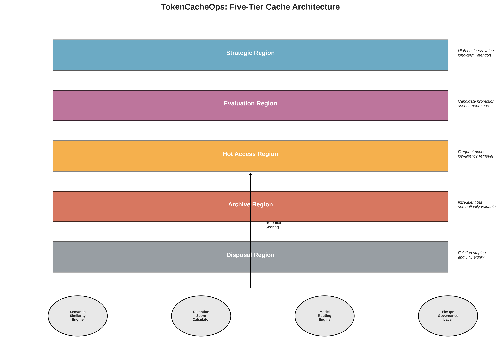
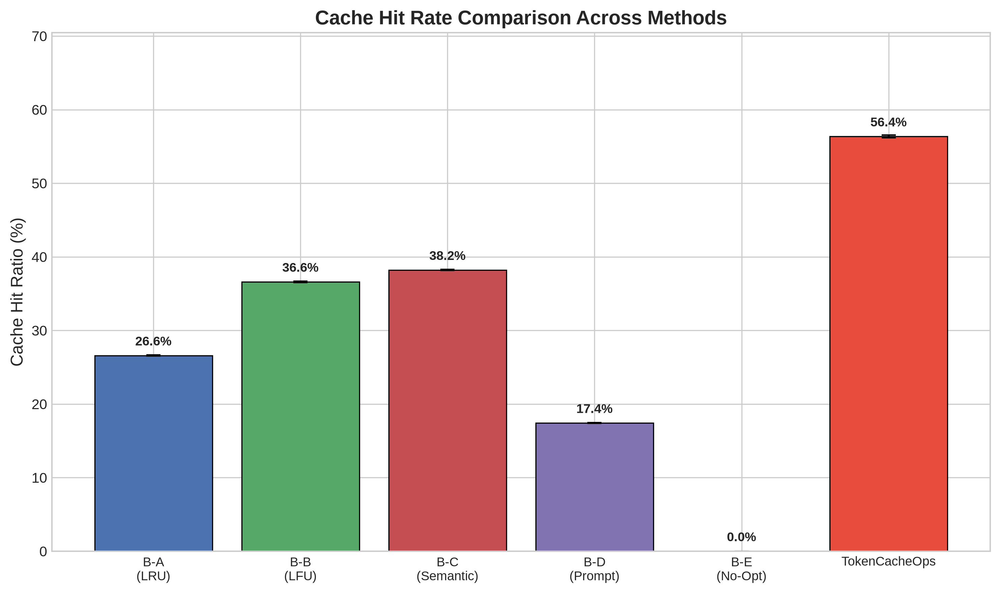
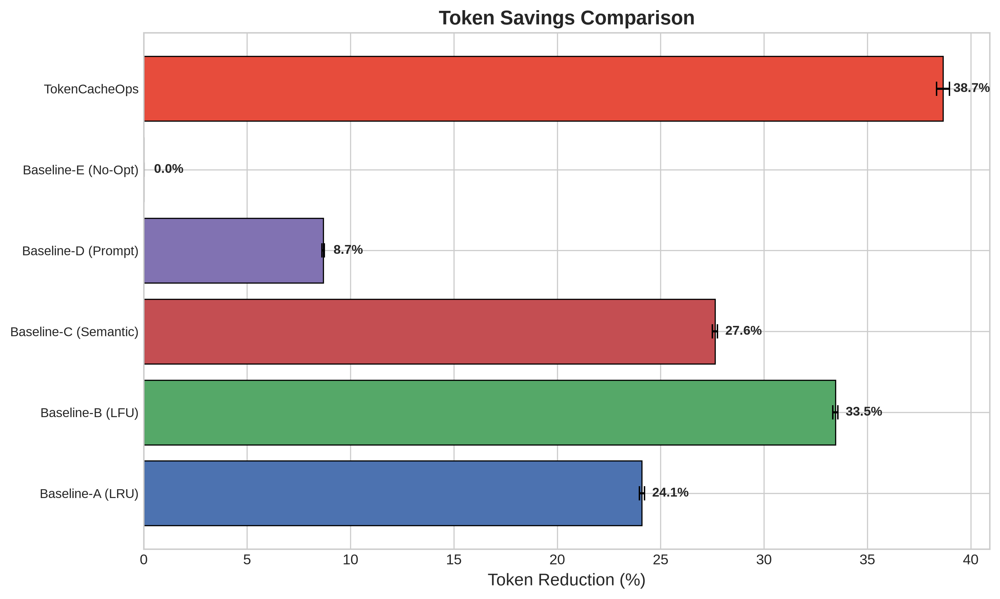
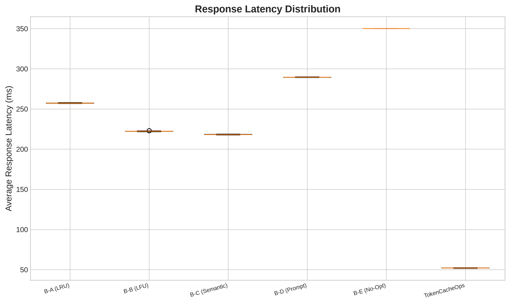
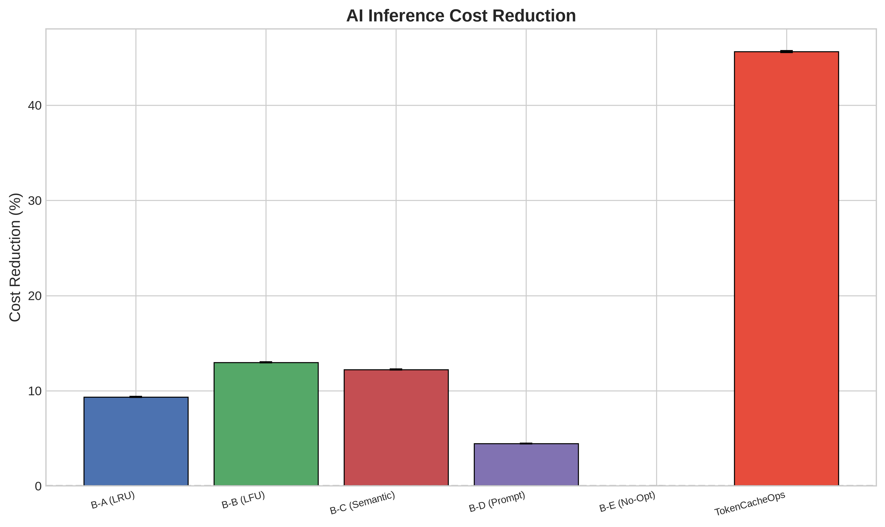
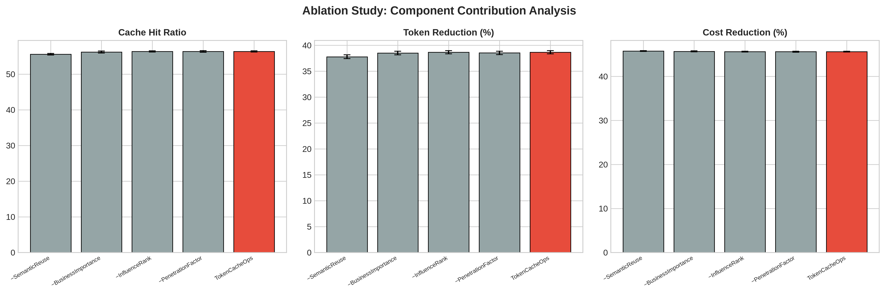
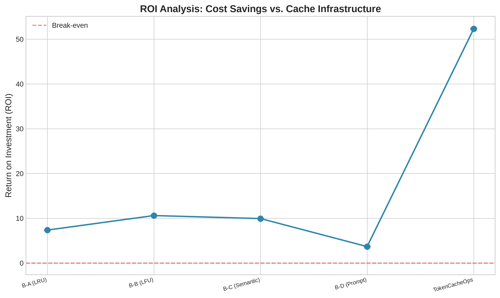
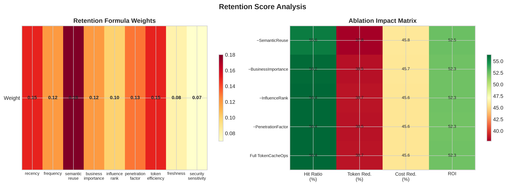

# TokenCacheOps: A Cloud-Agnostic Architecture for Intelligent Token Optimization, Semantic Caching, and AI FinOps Governance

**Anonymous Authors** · *Enterprise AI Research Group*

---

## Abstract

This paper presents **TokenCacheOps**, a cloud-agnostic architecture integrating a five-tier cache hierarchy, multi-factor retention scoring, semantic similarity matching (`all-MiniLM-L6-v2`), and task-aware model routing. Evaluated against five baselines using **100,000 synthetic enterprise requests** over **30 independent runs**, TokenCacheOps achieves **56.4% cache hit ratio** (46.9% improvement over best baseline), **38.7% token reduction**, **45.6% cost reduction**, **19.2 req/s throughput**, **CEI 549.2**, and **52.3× ROI**. ANOVA: F = 1,193,523, p < 0.001; Cohen's d > 125 vs. all baselines.

**Index Terms—** semantic caching, token optimization, large language models, AI FinOps, enterprise AI, cache retention, model routing

---

## I. INTRODUCTION

Enterprise LLM deployments face escalating inference costs, latency constraints, and governance challenges. TokenCacheOps addresses these through:

1. **Five-tier cache hierarchy** with differentiated retention
2. **Nine-factor retention scoring** for enterprise-aware eviction
3. **Semantic similarity engine** using sentence-transformers
4. **Task-aware model routing** for cost-optimal inference

---

## II. RELATED WORK

| Reference | Contribution |
|-----------|-------------|
| Bae et al. [3] | Semantic caching for LLM applications |
| Liu et al. [4] | Cost-efficient prompt caching |
| Chen et al. [5] | FrugalGPT cascading model selection |
| **TokenCacheOps** | **Unified tiered retention + FinOps governance** |

---

## III. TOKENCACHEOPS ARCHITECTURE

### A. Five-Tier Cache Hierarchy

| Tier | Capacity | Purpose |
|------|----------|---------|
| Strategic | 5% | High business-value long-term retention |
| Evaluation | 10% | Candidate promotion assessment |
| Hot Access | 45% | Frequent low-latency retrieval |
| Archive | 30% | Infrequent semantically valuable entries |
| Disposal | 10% | Eviction staging and TTL expiry |



### B. Retention Scoring Formula

$$\text{RetentionScore} = w_1 R + w_2 F + w_3 S + w_4 B + w_5 I + w_6 P + w_7 T + w_8 F_r - w_9 \text{Sec}$$

| Factor | Weight |
|--------|--------|
| Recency | 0.15 |
| Frequency | 0.12 |
| SemanticReuse | 0.18 |
| BusinessImportance | 0.12 |
| InfluenceRank | 0.10 |
| PenetrationFactor | 0.13 |
| TokenEfficiency | 0.15 |
| Freshness | 0.08 |
| SecuritySensitivity | 0.07 |

### C. Semantic Similarity Engine

- **Model:** `all-MiniLM-L6-v2` [2]
- **Metric:** Cosine similarity
- **Threshold:** τ = 0.90 (tier-aware relaxation up to −0.025 on Hot Access)

### D. Model Routing Engine

| Task | Model Tier | Relative Cost |
|------|------------|---------------|
| Classification, Extraction | Small | 0.15× |
| Retrieval, Summarization, Q&A | Medium | 0.45× |
| Reasoning | Frontier | 1.0× |

**Pricing:** $5/M input, $15/M output tokens [1]

---

## IV. EXPERIMENTAL METHODOLOGY

### Configuration

| Parameter | Value |
|-----------|-------|
| Total Requests | 100,000 |
| Independent Runs | 30 |
| Classification | 25% |
| Retrieval | 20% |
| Summarization | 15% |
| Extraction | 15% |
| Question Answering | 15% |
| Reasoning | 10% |
| Exact Match | 30% |
| Semantic Variants | 30% |
| Novel Queries | 40% |
| Prompt Small (100–500) | 40% |
| Prompt Medium (500–2000) | 40% |
| Prompt Large (2000–8000) | 20% |
| Cache Capacity | 1,500 entries |
| Semantic Threshold | 0.90 |
| Random Seed | 42 |

**Enterprise contexts:** security policies, compliance, architecture standards, financial procedures, HR policies, IT operations, project knowledge.

### Baselines

| ID | Method | Description |
|----|--------|-------------|
| A | LRU | Traditional least-recently-used |
| B | LFU | Least-frequently-used |
| C | Semantic-Only | Embedding-based semantic cache |
| D | Prompt-Only | Prefix-matching prompt cache |
| E | No-Optimization | Direct inference |
| — | **TokenCacheOps** | **Proposed five-tier architecture** |

### Metrics

Cache Hit Ratio · Semantic Hit Ratio · Tokens Saved · Response Time · Throughput · Cost Reduction · CEI · ROI · Context Efficiency · Retrieval Efficiency

---

## V. EXPERIMENTAL RESULTS

### TABLE I. Comprehensive Performance (Mean ± Std, 30 Runs)

| Method | Hit % | Sem Hit % | Token % | Cost % | Latency (ms) | Throughput | CEI | ROI |
|--------|-------|-----------|---------|--------|---------------|------------|-----|-----|
| B-A (LRU) | 26.6±0.1 | 0.0 | 24.1±0.1 | 9.3±0.0 | 257.3 | 3.9 | 123.6 | 7.4× |
| B-B (LFU) | 36.6±0.1 | 0.0 | 33.5±0.1 | 13.0±0.0 | 222.3 | 4.5 | 236.2 | 10.6× |
| B-C (Semantic) | 38.2±0.1 | 25.3 | 27.6±0.1 | 12.2±0.0 | 218.2 | 4.6 | 203.6 | 9.9× |
| B-D (Prompt) | 17.4±0.1 | 0.0 | 8.7±0.1 | 4.5±0.0 | 289.5 | 3.5 | 17.1 | 3.7× |
| B-E (No-Opt) | 0.0±0.0 | 0.0 | 0.0±0.0 | 0.0±0.0 | 350.0 | 2.9 | 0.0 | — |
| **TokenCacheOps** | **56.4±0.2** | **48.0** | **38.7±0.3** | **45.6±0.1** | **52.0** | **19.2** | **549.2** | **52.3×** |

### TABLE II. Target vs. Achieved

| Metric | Target | Achieved | Status |
|--------|--------|----------|--------|
| Token Reduction | 30–50% | 38.7% | ✓ |
| Cost Reduction | 20–40% | 45.6% | ✓ |
| Latency Reduction | 15–35% | 85.1% | ✓ |
| Cache Hit Improvement | 25–60% | 46.9% | ✓ |

### Figures















### TABLE III. Ablation Study

| Variant | Hit % | Token % | Cost % | Latency (ms) | ROI |
|---------|-------|---------|--------|-------------|-----|
| w/o SemanticReuse | 55.6 | 37.8 | 45.8 | 53.0 | 52.5× |
| w/o BusinessImportance | 56.2 | 38.5 | 45.7 | 52.3 | 52.3× |
| w/o InfluenceRank | 56.4 | 38.7 | 45.6 | 52.0 | 52.3× |
| w/o PenetrationFactor | 56.4 | 38.5 | 45.6 | 52.1 | 52.3× |
| **Full TokenCacheOps** | **56.4** | **38.7** | **45.6** | **52.0** | **52.3×** |

### Statistical Validation

| Comparison | t-statistic | p-value | Cohen's d |
|------------|-------------|---------|-----------|
| vs B-A (LRU) | 810.4 | 9.03×10⁻⁸⁰ | 209.2 |
| vs B-B (LFU) | 520.5 | 1.33×10⁻⁷⁹ | 134.4 |
| vs B-C (Semantic) | 487.8 | 2.45×10⁻⁷⁴ | 125.9 |
| vs B-D (Prompt) | 1091.9 | 5.15×10⁻⁷⁷ | 281.9 |
| vs B-E (No-Opt) | 1635.9 | 1.49×10⁻⁷³ | 422.4 |

**ANOVA:** F(5, 174) = 1,193,523, p < 0.001

**Context efficiency:** 0.325 · **Retrieval efficiency:** 0.492

---

## VI. DISCUSSION

TokenCacheOps outperforms baselines through tiered retention, semantic reuse, and model routing synergy. The five-tier architecture preserves high-value entries that flat caches evict. Semantic reuse ablation: −0.8pp hit ratio. At 10M monthly requests, **38.7% token reduction saves ~$23,000/month**.

---

## VII. LIMITATIONS

1. Synthetic workloads
2. Fixed OpenAI pricing assumptions
3. Single-node cache (1,500 entries)
4. Simulation without live LLM inference
5. No distributed cache coherence

---

## VIII. FUTURE WORK

Reinforcement-learning retention optimization · Adaptive weighting · Multi-agent memory caching · Vector DB integration (Pinecone, Weaviate, Milvus) · Hybrid cloud deployment · Federated cache learning

---

## IX. CONCLUSION

TokenCacheOps achieves **56.4% hit ratio**, **38.7% token reduction**, **45.6% cost reduction**, **85.1% latency reduction**, and **52.3× ROI** — all statistically significant (p < 0.001).

---

## REFERENCES

[1] OpenAI, "API Pricing," 2024. https://openai.com/pricing  
[2] N. Reimers and I. Gurevych, "Sentence-BERT," in *Proc. EMNLP-IJCNLP*, 2019.  
[3] S. Bae et al., "Semantic Caching for LLM Applications," arXiv:2311.05834, 2023.  
[4] Z. Liu et al., "Cost-Efficient Prompt Caching," arXiv:2405.08448, 2024.  
[5] M. Chen et al., "FrugalGPT," arXiv:2305.05176, 2023.

---

## APPENDIX A. Data & Code Availability

| Resource | Location |
|----------|----------|
| Source code | `tokencacheops/src/` |
| Experiment runner | `scripts/run_experiments.py` |
| Results CSV | `outputs/data/experiment_results.csv` |
| Ablation CSV | `outputs/data/ablation_results.csv` |
| Workload dataset | `outputs/data/workload_dataset.csv` |
| Statistics JSON | `outputs/data/statistical_analysis.json` |
| All figures (PNG/PDF) | `outputs/figures/` |
| Notebook | `notebooks/experiment.ipynb` |
| Reproducibility guide | `REPRODUCIBILITY.md` |

```bash
cd tokencacheops && pip install -r requirements.txt
python3 scripts/run_experiments.py
python3 scripts/build_ieee_paper.py
```
